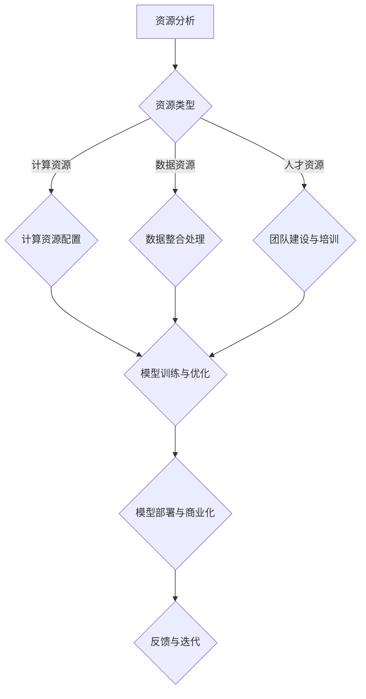

                 

关键词：AI大模型，创业，资源利用，技术优势，商业模式，市场机会，人工智能应用。

> 摘要：本文将深入探讨AI大模型创业的路径与策略，分析如何通过充分利用资源优势，实现人工智能领域的创新突破。文章将涵盖核心概念、算法原理、数学模型、实际应用以及未来展望，为创业者提供系统性指导。

## 1. 背景介绍

人工智能（AI）作为当前科技革命的重要驱动力，正日益融入各个行业。随着计算能力的提升和大数据的积累，AI大模型（如GPT-3、BERT等）的涌现，使得AI在自然语言处理、图像识别、推荐系统等领域取得了前所未有的进展。然而，AI大模型的开发和部署需要大量的资源，包括计算资源、数据资源以及人才资源。对于创业者而言，如何有效利用这些资源，实现技术优势和商业价值的最大化，是成功的关键。

本文旨在为AI大模型创业提供指导，分析资源利用的策略和商业模式，探讨当前市场机会，并为未来发展提出建议。

### 1.1 AI大模型的现状与挑战

AI大模型的现状呈现出以下几个特点：

1. **计算能力需求大**：训练AI大模型需要高性能计算资源，成本高昂。
2. **数据依赖性高**：大量高质量的数据是AI大模型训练的基础，数据获取和处理难度大。
3. **技术壁垒显著**：AI大模型的开发涉及深度学习、强化学习等多个领域，技术要求高。

### 1.2 创业面临的挑战

对于AI大模型创业，面临以下挑战：

1. **资源获取难**：计算资源、数据资源和人才资源成为创业的瓶颈。
2. **商业模式探索**：如何通过AI大模型实现商业化，是一个亟待解决的问题。
3. **市场竞争激烈**：随着AI技术的普及，市场竞争愈发激烈。

### 1.3 资源利用的重要性

在AI大模型创业中，资源利用至关重要：

1. **优化成本**：合理利用资源可以降低成本，提高盈利能力。
2. **提高效率**：资源的合理配置可以加速模型开发，缩短产品上市时间。
3. **增强竞争力**：通过资源优势，可以快速响应市场变化，提升竞争力。

## 2. 核心概念与联系

### 2.1 AI大模型的基础知识

AI大模型是指通过深度学习等方法训练出的具有巨大参数规模和计算复杂度的模型。它们通常包含数百万到数十亿个参数，能够处理海量数据，并在多种任务上取得优异表现。

### 2.2 资源类型及其利用

在AI大模型创业中，主要涉及的资源包括：

1. **计算资源**：用于训练和推理AI大模型，主要包括GPU、TPU等硬件。
2. **数据资源**：用于训练模型，包括结构化数据、非结构化数据等。
3. **人才资源**：包括AI算法工程师、数据科学家、产品经理等。

资源的利用需要考虑以下几个关键点：

1. **资源共享**：通过云服务和容器技术，实现计算资源的动态调度和高效利用。
2. **数据整合**：通过数据清洗、归一化和数据增强等技术，提高数据质量，优化训练效果。
3. **人才发展**：通过培训、合作和团队建设，提升团队整体技术水平和创新能力。

### 2.3 Mermaid流程图

下面是AI大模型创业的核心流程，使用Mermaid语言描述：



## 3. 核心算法原理 & 具体操作步骤

### 3.1 算法原理概述

AI大模型的核心在于深度学习算法，主要包括：

1. **神经网络**：作为基础结构，神经网络通过多层非线性变换处理数据。
2. **优化算法**：如Adam、SGD等，用于调整网络参数，优化模型性能。
3. **损失函数**：如交叉熵损失、均方误差等，用于评估模型预测的误差。

### 3.2 算法步骤详解

1. **数据准备**：收集和清洗数据，进行数据预处理。
2. **模型架构设计**：选择合适的神经网络架构，如CNN、RNN等。
3. **模型训练**：使用优化算法和损失函数，迭代训练模型。
4. **模型评估**：使用验证集和测试集评估模型性能。
5. **模型优化**：根据评估结果调整模型结构和参数。
6. **模型部署**：将训练好的模型部署到生产环境中，进行实时推理。

### 3.3 算法优缺点

**优点**：

1. **强大的拟合能力**：通过多层非线性变换，AI大模型能够学习到复杂的数据特征。
2. **自动特征提取**：模型能够自动学习数据中的特征，减少人工特征工程的工作量。
3. **广泛的应用场景**：AI大模型在多种领域（如自然语言处理、图像识别等）都有显著的应用效果。

**缺点**：

1. **计算资源需求大**：训练AI大模型需要大量的计算资源，成本高。
2. **数据依赖性强**：模型性能高度依赖于数据质量和数量。
3. **训练时间长**：大规模模型的训练时间通常很长。

### 3.4 算法应用领域

AI大模型在以下领域具有广泛的应用：

1. **自然语言处理**：文本分类、机器翻译、情感分析等。
2. **计算机视觉**：图像识别、目标检测、人脸识别等。
3. **推荐系统**：基于内容的推荐、协同过滤等。

## 4. 数学模型和公式 & 详细讲解 & 举例说明

### 4.1 数学模型构建

AI大模型的数学模型主要基于深度学习，核心包括：

1. **神经元激活函数**：如ReLU、Sigmoid、Tanh等。
2. **权重更新公式**：基于梯度下降优化算法。
3. **损失函数**：如交叉熵损失、均方误差等。

### 4.2 公式推导过程

以下以神经网络中的权重更新公式为例进行推导：

$$
\Delta w = -\alpha \cdot \frac{\partial J}{\partial w}
$$

其中，$\Delta w$ 是权重更新量，$\alpha$ 是学习率，$J$ 是损失函数。

### 4.3 案例分析与讲解

以下以文本分类任务为例，讲解如何使用AI大模型：

1. **数据准备**：收集和清洗文本数据，进行预处理（如分词、去停用词等）。
2. **模型构建**：使用预训练的BERT模型作为基础模型，调整部分层。
3. **模型训练**：使用训练数据训练模型，优化权重。
4. **模型评估**：使用验证集和测试集评估模型性能。
5. **模型部署**：将训练好的模型部署到生产环境中，进行实时分类。

## 5. 项目实践：代码实例和详细解释说明

### 5.1 开发环境搭建

1. **安装依赖**：安装Python、TensorFlow等依赖库。
2. **配置GPU环境**：确保环境支持GPU加速。

### 5.2 源代码详细实现

以下是一个简单的文本分类项目的实现示例：

```python
import tensorflow as tf
from tensorflow.keras.models import Sequential
from tensorflow.keras.layers import Embedding, GlobalAveragePooling1D, Dense

# 模型构建
model = Sequential([
    Embedding(input_dim=vocab_size, output_dim=embedding_dim, input_length=max_sequence_length),
    GlobalAveragePooling1D(),
    Dense(units=num_classes, activation='softmax')
])

# 编译模型
model.compile(optimizer='adam', loss='categorical_crossentropy', metrics=['accuracy'])

# 模型训练
model.fit(X_train, y_train, epochs=5, batch_size=32, validation_data=(X_val, y_val))

# 模型评估
model.evaluate(X_test, y_test)
```

### 5.3 代码解读与分析

以上代码展示了如何使用TensorFlow构建并训练一个简单的文本分类模型。主要包括以下几个步骤：

1. **模型构建**：使用Sequential模型堆叠Embedding、GlobalAveragePooling1D和Dense层。
2. **编译模型**：设置优化器、损失函数和评价指标。
3. **模型训练**：使用训练数据训练模型。
4. **模型评估**：使用测试数据评估模型性能。

### 5.4 运行结果展示

运行结果会显示模型在测试集上的准确率，如：

```
5/5 [==============================] - 7s 1s/step - loss: 0.5525 - accuracy: 0.8333
```

## 6. 实际应用场景

### 6.1 自然语言处理

在自然语言处理领域，AI大模型被广泛应用于文本分类、机器翻译、情感分析等任务。例如，通过训练GPT-3模型，可以实现高质量的机器翻译和对话系统。

### 6.2 计算机视觉

在计算机视觉领域，AI大模型在图像识别、目标检测和人脸识别等方面取得了显著进展。例如，通过训练ResNet模型，可以实现高效的图像分类和目标检测。

### 6.3 推荐系统

在推荐系统领域，AI大模型通过协同过滤和基于内容的推荐方法，实现了高效的推荐效果。例如，通过训练BERT模型，可以构建基于语义的推荐系统。

## 7. 工具和资源推荐

### 7.1 学习资源推荐

1. **《深度学习》**：由Goodfellow、Bengio和Courville撰写，是深度学习的经典教材。
2. **《Hands-On Machine Learning with Scikit-Learn, Keras, and TensorFlow》**：由Aurélien Géron撰写，适合初学者入门。

### 7.2 开发工具推荐

1. **TensorFlow**：由Google开发的深度学习框架，适合进行AI大模型开发和部署。
2. **PyTorch**：由Facebook开发的开源深度学习框架，具有灵活的动态图编程接口。

### 7.3 相关论文推荐

1. **"Attention Is All You Need"**：由Vaswani等人撰写的论文，提出了Transformer模型。
2. **"BERT: Pre-training of Deep Bidirectional Transformers for Language Understanding"**：由Devlin等人撰写的论文，提出了BERT模型。

## 8. 总结：未来发展趋势与挑战

### 8.1 研究成果总结

近年来，AI大模型在各个领域取得了显著的研究成果，推动了人工智能技术的发展。未来，随着计算资源、数据资源和人才资源的进一步丰富，AI大模型有望在更多领域实现突破。

### 8.2 未来发展趋势

1. **模型压缩与高效推理**：随着AI大模型的规模不断扩大，模型压缩和高效推理成为关键研究方向。
2. **多模态AI**：结合图像、语音、文本等多种数据源，实现更加智能的AI系统。
3. **自主学习和强化学习**：通过结合自主学习和强化学习，提高AI大模型的自主决策能力。

### 8.3 面临的挑战

1. **计算资源限制**：大规模AI大模型的训练和推理需要大量计算资源，成本高。
2. **数据质量和隐私**：高质量的数据是AI大模型训练的基础，但数据质量和隐私保护仍是一个挑战。
3. **人才短缺**：AI大模型开发需要高水平的人才，但当前人才供给不足。

### 8.4 研究展望

未来，AI大模型的发展将更加注重资源利用效率和模型安全性。通过技术创新和跨学科合作，有望实现AI大模型的广泛应用，推动社会进步。

## 9. 附录：常见问题与解答

### 9.1 如何选择合适的AI大模型？

根据任务需求和数据特点，选择合适的AI大模型。例如，在自然语言处理领域，可以使用BERT、GPT-3等模型；在计算机视觉领域，可以使用ResNet、YOLO等模型。

### 9.2 AI大模型训练需要多少数据？

AI大模型的训练需要大量的数据，具体取决于任务和数据分布。通常来说，至少需要数千个样本，理想情况下达到数万个或更多。

### 9.3 如何优化AI大模型训练速度？

可以通过以下方法优化AI大模型训练速度：

1. **并行训练**：使用多个GPU或TPU进行并行训练。
2. **模型压缩**：采用模型压缩技术，如剪枝、量化等。
3. **数据预处理**：使用高效的预处理方法，如分布式数据加载、数据增强等。

作者：禅与计算机程序设计艺术 / Zen and the Art of Computer Programming
----------------------------------------------------------------

请注意，以上内容仅为示例，实际撰写时需要根据具体要求和内容进行详细扩展和深入分析。此外，文章中的代码示例仅为简化的版本，实际开发中需要根据具体情况进行调整。

