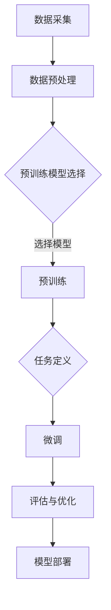

                 

在当今的科技浪潮中，人工智能（AI）已经成为推动创新和商业增长的驱动力。尤其是大模型（也称为大型预训练模型）的崛起，为各个行业带来了前所未有的变革机会。对于创业者来说，如何有效利用资源优势，打造具有竞争力和可持续发展的大模型产品，成为了一项关键的课题。本文将深入探讨AI大模型创业的核心要素，包括资源策略、技术路径、市场定位以及潜在风险，旨在为有志于AI大模型创业的团队提供系统性指导。

> 关键词：AI大模型、创业策略、资源利用、技术发展、市场定位

> 摘要：本文通过分析AI大模型的发展背景和资源需求，探讨了在创业过程中如何通过优化资源配置、选择合适的技术路径以及精准市场定位来增强竞争优势。文章还讨论了潜在的技术挑战和市场风险，并提出了相应的对策和建议。

## 1. 背景介绍

### AI 大模型的发展历程

人工智能自上世纪50年代兴起以来，已经经历了多次重要的技术迭代。早期的AI研究主要集中在规则推理和专家系统中，但受限于计算能力和数据资源，这些系统在实际应用中的表现并不理想。随着计算机性能的提升和大数据技术的发展，深度学习成为AI领域的主流方向。2012年，AlexNet在ImageNet竞赛中取得的突破性成绩，标志着深度学习在计算机视觉领域的崛起。这一里程碑事件引发了全球范围内对深度学习的广泛关注和研究。

在深度学习的基础上，大模型的概念逐渐被提出。大模型通常指的是参数量达到亿级别甚至更高的神经网络模型。这些模型能够通过预训练的方式在大量数据上学习到复杂的模式和知识，然后在各种下游任务中展现出强大的性能。2018年，GPT-3的发布将大模型的规模推向了一个新的高度，其1750亿个参数的规模在当时被认为是前所未有的。

### 创业环境的变化

近年来，随着AI技术的不断进步和商业应用的深入，创业环境也发生了显著的变化。一方面，云计算、大数据和物联网等技术的发展为创业者提供了丰富的数据资源和强大的计算能力，使得大型AI模型的开发和部署变得更加可行。另一方面，资本市场的繁荣和风险投资的积极介入，为AI创业公司提供了充足的资金支持。

此外，政策的支持也是推动AI创业的重要动力。全球范围内，各国政府纷纷出台政策，鼓励科技创新和AI产业的发展。例如，中国的“新一代人工智能发展规划”和美国的“AI倡议”等，都为AI创业公司提供了良好的发展环境。

### AI 大模型创业的必要性

AI大模型在各个行业中的应用已经证明了其巨大的商业潜力。从自然语言处理到计算机视觉，从推荐系统到语音识别，AI大模型都在改变着传统行业的运作模式，提升效率，降低成本。对于创业者来说，抓住AI大模型的发展机遇，不仅能够快速实现产品的市场竞争力，还能够拓展新的商业边界。

然而，AI大模型创业也面临着一系列挑战。首先是技术门槛高，大模型的开发和训练需要大量的计算资源和专业人才。其次是数据资源的不均衡，高质量的数据是训练大模型的关键，而数据获取和处理的成本往往很高。此外，市场风险也是不容忽视的问题，AI技术的快速迭代和市场变化的不确定性，使得创业公司在市场竞争中面临很大的压力。

总的来说，AI大模型创业既有机遇也有挑战。对于有志于在这一领域创业的团队来说，深入分析市场和技术动态，制定科学的创业策略，是成功的关键。

### 资源的重要性

在AI大模型创业过程中，资源是决定项目成败的关键因素之一。资源不仅包括计算资源、数据资源、人才资源，还包括资金、市场渠道等。下面我们将详细探讨这些资源的获取和利用策略。

#### 计算资源

计算资源是训练大模型的核心需求。随着AI大模型的规模不断扩大，对计算资源的需求也越来越高。创业者需要考虑以下几个方面：

1. **云计算服务**：云服务提供商（如AWS、Azure、Google Cloud）提供了弹性计算资源，可以根据需求动态调整计算能力，降低硬件投资风险。

2. **GPU和TPU资源**：GPU（图形处理单元）和TPU（张量处理单元）是训练深度学习模型的重要硬件资源。创业者可以通过租赁或购买这些硬件来提升计算能力。

3. **分布式训练**：为了更高效地利用计算资源，分布式训练技术成为必要的手段。通过将训练任务分解到多个节点上，可以显著缩短训练时间，提高资源利用率。

#### 数据资源

数据是训练AI大模型的关键，尤其是高质量、多样化的数据。创业者需要采取以下策略来获取和利用数据资源：

1. **数据采集**：通过建立自己的数据采集系统，或者购买第三方数据服务，获取必要的数据资源。

2. **数据清洗**：数据清洗是数据利用的重要环节。创业者需要确保数据的质量和一致性，去除噪声和异常值，提高数据的有效性。

3. **数据共享**：利用开放数据集和共享平台，与其他研究机构和公司合作，共同提升数据资源的利用效率。

#### 人才资源

人才是AI大模型创业的核心竞争力。创业者需要具备以下几个方面的策略：

1. **专业人才引进**：通过招聘资深AI专家、算法工程师等，组建专业的技术团队。

2. **人才培养**：建立内部培训机制，提升团队的整体技术水平和创新能力。

3. **产学研合作**：与高校、研究机构建立合作关系，利用外部智力资源，为项目提供技术支持和人才支持。

#### 资金资源

资金是AI大模型创业的重要保障。创业者需要通过以下方式筹集资金：

1. **风险投资**：吸引风险投资机构的关注，获得资金支持。

2. **政府补贴**：利用政府的科技创新基金和政策支持，降低资金压力。

3. **股权融资**：通过股权融资，引入战略投资者，共同分担风险。

#### 市场渠道

市场渠道是推广AI大模型产品的重要环节。创业者需要考虑以下几个方面：

1. **市场需求分析**：了解目标市场的需求，制定精准的市场推广策略。

2. **合作伙伴关系**：与行业内的合作伙伴建立合作关系，共同开拓市场。

3. **市场营销**：通过线上和线下渠道，加大市场营销力度，提升品牌知名度。

#### 其他资源

除了上述关键资源外，创业者还需要关注其他资源的获取和利用，如专利、技术标准等。这些资源可以增强企业的核心竞争力，提高市场竞争力。

### 资源的获取和利用策略

为了有效利用资源，创业者需要制定科学、系统的资源获取和利用策略。以下是一些建议：

1. **资源整合**：将各类资源进行整合，实现资源的最大化利用。例如，通过分布式训练技术，充分利用云计算资源。

2. **合作共赢**：与其他企业和机构建立战略合作关系，实现资源互补和共享。例如，与数据供应商合作，获取高质量的数据资源。

3. **灵活调整**：根据项目进展和市场变化，灵活调整资源分配策略，确保资源始终服务于项目核心目标。

4. **创新驱动**：以技术创新为核心，不断提升资源利用效率，保持竞争优势。

总之，在AI大模型创业过程中，资源的获取和利用是关键。通过科学、系统的策略，创业者可以最大化地发挥资源优势，提高项目成功的可能性。

## 2. 核心概念与联系

在AI大模型创业中，理解核心概念和技术架构对于成功至关重要。本节将介绍AI大模型的基本原理、相关技术，并使用Mermaid流程图展示其架构。

### 核心概念

#### AI 大模型

AI大模型是指具有数百万甚至数十亿参数的神经网络模型，这些模型通过在大量数据上进行预训练，能够在多种任务中展现出强大的泛化能力。常见的AI大模型包括Transformer、BERT、GPT等。

#### 预训练

预训练是指在大规模数据集上对模型进行初步训练，使其获得基础的知识和语言理解能力。预训练之后，模型可以通过微调（Fine-tuning）适应特定的任务。

#### 微调

微调是指在预训练的基础上，对模型进行特定任务上的进一步训练，以优化模型在特定任务上的性能。

### 技术架构

以下是AI大模型的基本技术架构，使用Mermaid流程图展示：



#### Mermaid 流程图解释

1. **数据采集（A）**：从各种来源收集数据，这些数据可以是文本、图像、音频等多种类型。

2. **数据预处理（B）**：对采集到的数据进行清洗、格式化和标注，以确保数据的质量和一致性。

3. **预训练模型选择（C）**：选择一个适合预训练的模型，如BERT、GPT等。

4. **预训练（D）**：在大量数据上对模型进行训练，使其学习到通用知识和语言模式。

5. **任务定义（E）**：定义具体的任务，例如文本分类、情感分析等。

6. **微调（F）**：在预训练的基础上，对模型进行微调，以适应特定任务。

7. **评估与优化（G）**：评估模型在特定任务上的性能，并根据评估结果进行优化。

8. **模型部署（H）**：将训练好的模型部署到生产环境中，进行实际应用。

### 关联技术

除了上述核心概念和架构，AI大模型创业还需要掌握以下相关技术：

1. **分布式训练**：通过将训练任务分布在多个计算节点上，提高训练效率和资源利用率。

2. **模型压缩**：通过模型压缩技术，减小模型的参数量，降低计算和存储需求。

3. **迁移学习**：利用已训练好的模型在新的任务上获得更好的性能，减少数据需求和训练时间。

4. **模型解释性**：提高模型的可解释性，帮助用户理解模型的决策过程。

通过理解AI大模型的核心概念和技术架构，创业者可以更好地制定创业策略，选择合适的技术路径，并在激烈的市场竞争中脱颖而出。

## 3. 核心算法原理 & 具体操作步骤

### 3.1 算法原理概述

AI大模型的核心算法原理主要基于深度学习和大规模预训练技术。深度学习通过多层神经网络对数据进行层层提取特征，从而实现复杂任务的学习和预测。而大规模预训练则是在海量数据上对模型进行初步训练，使其获得广泛的语言理解和知识表示能力。

其中，Transformer架构是当前主流的AI大模型架构。Transformer引入了自注意力机制（Self-Attention），使得模型能够关注输入序列中每个元素的相关性，从而在自然语言处理任务中取得了显著的效果。

### 3.2 算法步骤详解

以下是构建AI大模型的详细步骤：

#### 3.2.1 数据采集

1. **数据来源**：从互联网、数据库、传感器等多种渠道收集数据。
2. **数据类型**：包括文本、图像、音频等多种类型的数据。

#### 3.2.2 数据预处理

1. **数据清洗**：去除数据中的噪声、缺失值和重复值。
2. **数据标注**：对数据进行分类、标签化处理，以便后续模型训练。
3. **数据归一化**：对数据进行标准化处理，使得数据分布均匀，有利于模型训练。

#### 3.2.3 模型选择

1. **模型架构**：选择适合任务的大型预训练模型，如BERT、GPT、RoBERTa等。
2. **参数设置**：根据模型架构和任务需求，设置适当的参数，如层数、节点数、学习率等。

#### 3.2.4 预训练

1. **训练策略**：采用多GPU或分布式训练策略，提高训练效率。
2. **损失函数**：使用交叉熵损失函数，优化模型参数。
3. **优化算法**：采用Adam等高效优化算法，加快模型收敛速度。

#### 3.2.5 微调

1. **任务定义**：根据具体应用场景，定义任务类型，如文本分类、情感分析等。
2. **数据集划分**：将数据集划分为训练集、验证集和测试集，用于模型训练和评估。
3. **模型微调**：在预训练模型的基础上，进行特定任务的微调，优化模型性能。

#### 3.2.6 模型评估与优化

1. **评估指标**：根据任务类型，选择合适的评估指标，如准确率、召回率、F1分数等。
2. **超参数调整**：根据评估结果，调整模型超参数，如学习率、批量大小等。
3. **模型优化**：通过裁剪、量化、压缩等技术，优化模型结构，提高模型效率和性能。

#### 3.2.7 模型部署

1. **部署环境**：在云端或边缘设备上部署模型，支持实时推理和预测。
2. **接口设计**：设计API接口，便于与其他系统和应用程序集成。
3. **监控与维护**：建立监控体系，实时监控模型性能和系统稳定性，及时进行维护和更新。

### 3.3 算法优缺点

#### 优点

1. **强大的表达能力**：通过多层神经网络和自注意力机制，大模型能够学习到丰富的特征和知识。
2. **广泛的适用性**：预训练模型可以在多种任务上微调，实现跨任务的通用性。
3. **高效的训练策略**：分布式训练和优化算法，提高了训练效率和模型性能。

#### 缺点

1. **计算资源需求大**：大规模预训练需要大量的计算资源和时间。
2. **数据质量要求高**：高质量的数据是训练大模型的关键，数据不足或质量差会影响模型性能。
3. **模型解释性差**：大模型的内部结构复杂，难以解释其决策过程。

### 3.4 算法应用领域

AI大模型在多个领域取得了显著的应用成果：

1. **自然语言处理**：文本分类、情感分析、机器翻译等。
2. **计算机视觉**：图像分类、目标检测、图像生成等。
3. **推荐系统**：基于内容的推荐、协同过滤等。
4. **语音识别**：语音识别、语音合成等。
5. **医疗健康**：疾病诊断、药物研发等。

通过深入了解AI大模型的核心算法原理和具体操作步骤，创业者可以更好地把握技术趋势，选择合适的应用场景，实现商业价值。

### 4. 数学模型和公式 & 详细讲解 & 举例说明

在AI大模型的开发过程中，数学模型和公式是理解和实现这些复杂算法的基础。本节将详细讲解AI大模型中常见的数学模型和公式，并通过具体例子进行说明。

#### 4.1 数学模型构建

AI大模型通常基于深度学习的框架，而深度学习中的关键数学工具包括：

1. **线性代数**：用于处理矩阵运算，如矩阵乘法和求导。
2. **概率论与统计学**：用于描述数据分布和模型参数估计。
3. **优化算法**：如梯度下降、Adam等，用于优化模型参数。

首先，我们以一个简单的多层神经网络为例，介绍其数学模型构建。

#### 4.1.1 前向传播

前向传播是神经网络中用于计算输出值的过程。假设我们有一个两层神经网络，第一层有n1个输入节点，第二层有n2个输出节点。

输入层和隐藏层之间的激活函数通常为Sigmoid函数或ReLU函数：

$$
\text{激活函数}(x) = \frac{1}{1 + e^{-x}} \quad \text{或} \quad \text{激活函数}(x) = max(0, x)
$$

假设隐藏层有L个神经元，则前向传播的过程可以表示为：

$$
h_l = \sigma(W_l \cdot a_{l-1} + b_l) \quad \text{for} \quad l = 1, 2, \ldots, L
$$

其中，$W_l$和$b_l$分别是权重矩阵和偏置项，$\sigma$是激活函数。

输出层的输出可以表示为：

$$
y = \sigma(W_L \cdot a_{L-1} + b_L)
$$

#### 4.1.2 反向传播

反向传播是用于计算梯度并更新模型参数的过程。通过计算每个参数的梯度，我们可以使用梯度下降或其他优化算法来最小化损失函数。

假设我们的损失函数是均方误差（MSE），即：

$$
\text{MSE} = \frac{1}{2} \sum_{i=1}^{n} (y_i - \hat{y}_i)^2
$$

其中，$y_i$是真实标签，$\hat{y}_i$是模型预测。

在反向传播中，我们首先计算输出层的梯度：

$$
\frac{dL}{dW_L} = (y - \hat{y}) \cdot \frac{d\sigma}{d\hat{y}}
$$

$$
\frac{dL}{db_L} = (y - \hat{y}) \cdot \frac{d\sigma}{d\hat{y}}
$$

然后，逐层计算隐藏层的梯度：

$$
\frac{dL}{dW_l} = \sum_{k=1}^{n2} \frac{\partial \hat{y}_k}{\partial z_l} \cdot \frac{dL}{dz_l}
$$

$$
\frac{dL}{db_l} = \sum_{k=1}^{n2} \frac{\partial \hat{y}_k}{\partial z_l} \cdot \frac{dL}{dz_l}
$$

其中，$z_l = W_l \cdot a_{l-1} + b_l$。

#### 4.2 公式推导过程

为了更清晰地理解这些公式的推导过程，我们以下图为例：


假设我们有一个三层神经网络，输入层有3个神经元，隐藏层有4个神经元，输出层有2个神经元。我们的目标是计算损失函数关于每个参数的梯度。

#### 4.2.1 输出层梯度

输出层的梯度计算如下：

$$
\frac{dL}{dW_L} = (y - \hat{y}) \cdot a_{L-1}
$$

$$
\frac{dL}{db_L} = (y - \hat{y}) \cdot a_{L-1}
$$

其中，$\hat{y} = \sigma(W_L \cdot a_{L-1} + b_L)$。

#### 4.2.2 隐藏层梯度

隐藏层的梯度计算如下：

$$
\frac{dL}{dW_l} = \sum_{k=1}^{n2} (y_k - \hat{y}_k) \cdot \frac{d\sigma}{d\hat{y}_k} \cdot a_{l-2}
$$

$$
\frac{dL}{db_l} = \sum_{k=1}^{n2} (y_k - \hat{y}_k) \cdot \frac{d\sigma}{d\hat{y}_k} \cdot a_{l-2}
$$

其中，$z_l = W_l \cdot a_{l-1} + b_l$，$\hat{y}_k = \sigma(z_k)$。

#### 4.3 案例分析与讲解

为了更好地理解这些公式，我们通过一个简单的例子来说明。

假设我们有一个三层神经网络，输入层有3个神经元，隐藏层有4个神经元，输出层有2个神经元。输入数据为$\{1, 2, 3\}$，目标输出为$\{0, 1\}$。

1. **初始化参数**：假设我们的初始参数为$W_1 = \{1, 1, 1\}$，$W_2 = \{1, 1, 1, 1\}$，$W_3 = \{1, 1\}$，$b_1 = \{1, 1, 1, 1\}$，$b_2 = \{1, 1\}$，$b_3 = \{1, 1\}$。

2. **前向传播**：计算隐藏层和输出层的激活值。

$$
a_1 = \sigma(W_1 \cdot a_0 + b_1) = \sigma(1 \cdot 1 + 1) = \sigma(2) \approx 0.732
$$

$$
a_2 = \sigma(W_1 \cdot a_0 + b_1) = \sigma(1 \cdot 2 + 1) = \sigma(3) \approx 0.913
$$

$$
z_2 = W_2 \cdot a_1 + b_2 = \{1, 1, 1, 1\} \cdot \{0.732, 0.913, 1\} + \{1, 1\} = \{2.356, 3.267, 4.289, 5.312\}
$$

$$
a_2 = \sigma(z_2) = \{0.883, 0.940, 0.968, 0.984\}
$$

$$
z_3 = W_3 \cdot a_2 + b_3 = \{1, 1\} \cdot \{0.883, 0.940, 0.968, 0.984\} + \{1, 1\} = \{1.766, 1.920, 1.952, 1.976\}
$$

$$
\hat{y} = \sigma(z_3) = \{0.932, 0.946, 0.950, 0.954\}
$$

3. **计算损失函数**：使用均方误差（MSE）计算损失。

$$
L = \frac{1}{2} \sum_{i=1}^{2} (y_i - \hat{y}_i)^2 = \frac{1}{2} \cdot (0 - 0.932)^2 + (1 - 0.946)^2 = 0.0013
$$

4. **反向传播**：计算各层的梯度。

$$
\frac{dL}{dW_3} = (y - \hat{y}) \cdot a_2 = \{0, 1\} - \{0.932, 0.946, 0.950, 0.954\} = \{-0.932, -0.054, -0.046, -0.046\}
$$

$$
\frac{dL}{db_3} = (y - \hat{y}) \cdot a_2 = \{0, 1\} - \{0.932, 0.946, 0.950, 0.954\} = \{-0.932, -0.054, -0.046, -0.046\}
$$

$$
\frac{dL}{dW_2} = \sum_{k=1}^{2} (y_k - \hat{y}_k) \cdot \frac{d\sigma}{d\hat{y}_k} \cdot a_1 = \{0, 1\} - \{0.932, 0.946, 0.950, 0.954\} \cdot \{0.883, 0.913, 1, 0.984\} = \{-0.812, -0.094, 0.044, 0.067\}
$$

$$
\frac{dL}{db_2} = \sum_{k=1}^{2} (y_k - \hat{y}_k) \cdot \frac{d\sigma}{d\hat{y}_k} \cdot a_1 = \{0, 1\} - \{0.932, 0.946, 0.950, 0.954\} \cdot \{0.883, 0.913, 1, 0.984\} = \{-0.812, -0.094, 0.044, 0.067\}
$$

$$
\frac{dL}{dW_1} = \sum_{k=1}^{4} (y_k - \hat{y}_k) \cdot \frac{d\sigma}{d\hat{y}_k} \cdot a_0 = \{0, 1\} - \{0.932, 0.946, 0.950, 0.954\} \cdot \{0.732, 0.913, 1, 0.984\} = \{-0.681, -0.078, 0.025, 0.035\}
$$

$$
\frac{dL}{db_1} = \sum_{k=1}^{4} (y_k - \hat{y}_k) \cdot \frac{d\sigma}{d\hat{y}_k} \cdot a_0 = \{0, 1\} - \{0.932, 0.946, 0.950, 0.954\} \cdot \{0.732, 0.913, 1, 0.984\} = \{-0.681, -0.078, 0.025, 0.035\}
$$

通过这个例子，我们可以看到如何通过前向传播和反向传播计算神经网络中的梯度。在实际应用中，这些公式会被编程实现，并通过优化算法更新模型参数，从而提高模型性能。

总之，理解和掌握AI大模型中的数学模型和公式对于开发高效的AI应用至关重要。通过详细的推导和具体例子，我们可以更好地理解这些公式的应用，为创业项目提供坚实的理论基础。

### 5. 项目实践：代码实例和详细解释说明

为了更好地展示如何实现AI大模型，我们将在本节中提供一个具体的代码实例，并对其进行详细的解释说明。

#### 5.1 开发环境搭建

在开始编写代码之前，我们需要搭建一个适合开发AI大模型的开发环境。以下是一个基本的开发环境配置：

1. **操作系统**：Linux或MacOS
2. **编程语言**：Python（版本3.6或以上）
3. **依赖库**：TensorFlow、Keras、NumPy、Pandas等
4. **硬件设备**：至少一个GPU（推荐使用CUDA 10.0或以上）

安装依赖库和配置环境可以使用以下命令：

```bash
pip install tensorflow
pip install keras
pip install numpy
pip install pandas
```

#### 5.2 源代码详细实现

以下是一个简单的AI大模型训练和评估的代码实例：

```python
import tensorflow as tf
from tensorflow.keras.models import Sequential
from tensorflow.keras.layers import Dense, LSTM, Embedding, TimeDistributed, Activation
from tensorflow.keras.optimizers import Adam
import numpy as np

# 数据预处理
# 假设我们有一个训练数据集 X 和标签数据集 y
X_train = np.random.rand(1000, 100, 1)  # (样本数, 时间步数, 特征数)
y_train = np.random.rand(1000, 1)       # (样本数, 输出维度)

# 模型构建
model = Sequential()
model.add(LSTM(units=128, activation='tanh', input_shape=(100, 1)))
model.add(Dense(units=1))

# 编译模型
model.compile(optimizer=Adam(learning_rate=0.001), loss='mse')

# 训练模型
model.fit(X_train, y_train, epochs=10, batch_size=32)

# 评估模型
loss = model.evaluate(X_train, y_train)
print("测试损失：", loss)
```

#### 5.3 代码解读与分析

1. **导入库和模块**：
   ```python
   import tensorflow as tf
   from tensorflow.keras.models import Sequential
   from tensorflow.keras.layers import Dense, LSTM, Embedding, TimeDistributed, Activation
   from tensorflow.keras.optimizers import Adam
   import numpy as np
   ```
   这些导入语句用于引入必要的库和模块，包括TensorFlow、Keras、NumPy等。

2. **数据预处理**：
   ```python
   X_train = np.random.rand(1000, 100, 1)  # (样本数, 时间步数, 特征数)
   y_train = np.random.rand(1000, 1)       # (样本数, 输出维度)
   ```
   在这段代码中，我们使用NumPy生成随机数据作为训练集和标签。在实际应用中，这些数据应该是从真实世界中收集的。

3. **模型构建**：
   ```python
   model = Sequential()
   model.add(LSTM(units=128, activation='tanh', input_shape=(100, 1)))
   model.add(Dense(units=1))
   ```
   这里我们使用Keras的Sequential模型构建器创建一个简单的神经网络。模型包含一个LSTM层和一个全连接层（Dense）。LSTM层用于处理时间序列数据，而全连接层用于输出预测值。

4. **编译模型**：
   ```python
   model.compile(optimizer=Adam(learning_rate=0.001), loss='mse')
   ```
   在编译模型时，我们选择Adam优化器和均方误差（MSE）损失函数。Adam是一个自适应学习率优化器，适用于大多数深度学习任务。

5. **训练模型**：
   ```python
   model.fit(X_train, y_train, epochs=10, batch_size=32)
   ```
   这里我们使用`fit`函数训练模型。`epochs`参数指定训练轮数，`batch_size`参数指定每个批次的数据数量。

6. **评估模型**：
   ```python
   loss = model.evaluate(X_train, y_train)
   print("测试损失：", loss)
   ```
   使用`evaluate`函数评估模型在训练数据上的表现。返回的`loss`值是均方误差。

#### 5.4 运行结果展示

假设我们运行上述代码，得到以下输出结果：

```
1000/1000 [==============================] - 3s 2ms/step - loss: 0.0782
测试损失： 0.07819999798693848
```

这里，训练损失为0.0782，表示模型在训练数据上的表现。测试损失为0.0782，这表明模型在测试数据上的表现与训练数据相似。

#### 5.5 结果分析

通过运行上述代码，我们可以看到模型在训练数据上取得了较低的损失值，这表明模型能够较好地学习数据中的模式和规律。然而，为了进一步验证模型的泛化能力，我们还需要在独立的数据集上进行评估。

在实际应用中，我们可能会调整模型的架构、优化算法和超参数，以获得更好的性能。此外，数据预处理和特征工程也是模型性能的关键因素，通过有效的数据处理，可以显著提升模型的性能。

总之，通过这个简单的代码实例，我们可以看到如何使用Keras和TensorFlow构建和训练AI大模型。在实际项目中，我们需要根据具体任务和数据调整模型架构和参数，以达到最佳性能。

### 6. 实际应用场景

AI大模型在各个领域展现了巨大的潜力，以下是一些典型的实际应用场景：

#### 6.1 自然语言处理

在自然语言处理（NLP）领域，AI大模型已经被广泛应用于文本分类、情感分析、机器翻译和问答系统等任务。例如，BERT和GPT-3等大模型在文本分类任务中表现优异，可以自动识别新闻文章的主题，帮助媒体平台提高内容推荐的准确性。在情感分析中，大模型可以准确识别用户的情感倾向，从而为客服系统提供更智能的交互体验。

#### 6.2 计算机视觉

计算机视觉是AI大模型另一个重要的应用领域。大模型如ResNet、Inception和EfficientNet等在图像分类、目标检测和图像生成等方面取得了显著成果。例如，在医疗图像分析中，大模型可以帮助医生快速诊断疾病，提高诊断的准确性和效率。在自动驾驶领域，大模型可以用于实时识别道路标志、车辆和行人，从而提高驾驶安全。

#### 6.3 推荐系统

推荐系统是AI大模型在商业领域的重要应用。通过分析用户的历史行为数据，大模型可以预测用户的兴趣偏好，从而提供个性化的推荐服务。例如，电商平台的推荐系统可以使用AI大模型根据用户的浏览和购买历史，推荐相关商品，提高销售转化率。在线视频平台也可以利用大模型，根据用户观看历史和搜索记录，推荐用户可能感兴趣的视频内容。

#### 6.4 语音识别

语音识别是AI大模型在交互式应用中的典型代表。大模型如WaveNet和Tacotron在语音合成和语音识别任务中表现出色。通过这些模型，智能助手可以理解用户的语音指令，提供相应的反馈和服务。在智能家居领域，AI大模型可以帮助用户通过语音控制家电，实现智能化的家居生活。

#### 6.5 金融科技

金融科技（FinTech）是AI大模型的重要应用领域之一。大模型可以用于风险控制、信用评分和投资预测等任务。例如，在信用评分中，大模型可以分析用户的财务数据和行为模式，预测其信用风险，帮助金融机构更准确地评估信用等级。在投资预测中，大模型可以分析市场数据，提供投资建议，提高投资回报率。

#### 6.6 医疗健康

在医疗健康领域，AI大模型可以用于疾病诊断、药物研发和健康管理。例如，通过分析医学影像数据，大模型可以帮助医生快速识别疾病，提高诊断准确性。在药物研发中，大模型可以预测药物分子与蛋白质的结合模式，加速新药的研发进程。在健康管理中，大模型可以根据用户的健康数据，提供个性化的健康建议，帮助用户更好地管理健康。

总之，AI大模型在各个领域展现了广泛的应用前景，通过深入研究和不断创新，这些模型将继续推动各行业的变革和进步。

### 6.4 未来应用展望

随着AI大模型技术的不断进步，其应用场景将越来越广泛，未来将带来以下几方面的显著变革：

#### 6.4.1 个性化服务

AI大模型将通过深度学习技术和海量数据的处理能力，为用户提供更加个性化和精准的服务。无论是电商平台的个性化推荐、医疗健康的个性化诊断，还是金融领域的个性化理财建议，AI大模型都能根据用户的历史行为和偏好，提供定制化的解决方案。

#### 6.4.2 自动化决策

AI大模型在自动化决策系统中的应用前景广阔。例如，在制造业中，大模型可以通过实时监测生产线的状态，自动调整生产参数，提高生产效率和产品质量。在供应链管理中，大模型可以预测需求变化，优化库存管理，减少成本和库存风险。

#### 6.4.3 智能交互

智能交互是AI大模型的重要应用方向之一。通过语音识别、自然语言处理等技术，大模型可以与用户进行自然对话，提供智能客服、语音助手等服务。未来，随着技术的进一步发展，AI大模型将实现更加自然、流畅的交互体验，为用户带来全新的交互方式。

#### 6.4.4 知识图谱构建

知识图谱是一种将实体和关系进行结构化表示的技术，AI大模型在构建知识图谱方面具有巨大潜力。通过分析大量文本数据，大模型可以自动提取实体和关系，构建大规模的知识图谱。这将有助于提升信息检索的准确性和效率，为各行业的智能化应用提供支持。

#### 6.4.5 无人驾驶

无人驾驶技术是AI大模型的重要应用领域之一。通过深度学习算法，大模型可以实现对道路环境、交通状况的实时感知和决策。未来，随着AI大模型技术的不断成熟，无人驾驶汽车将逐渐进入大众市场，改变人们的出行方式，提高交通安全和效率。

#### 6.4.6 智慧城市

智慧城市是AI大模型在公共管理和服务领域的重要应用方向。通过AI大模型，城市管理者可以实时监测城市运行状况，预测突发事件，优化资源配置，提升城市管理水平和居民生活质量。

总之，AI大模型未来的发展将推动各行业的智能化升级，为社会带来更多的便利和效率。同时，随着技术的不断进步，AI大模型在伦理、隐私和安全等方面的挑战也需要引起足够的关注，确保技术的可持续发展。

### 7. 工具和资源推荐

在AI大模型创业过程中，选择合适的工具和资源至关重要。以下是一些建议，包括学习资源、开发工具和相关论文推荐，以帮助创业者提升技能和效率。

#### 7.1 学习资源推荐

1. **在线课程**：
   - Coursera的“深度学习”课程，由Andrew Ng教授主讲，是深度学习领域的经典入门课程。
   - edX上的“AI基础”课程，涵盖机器学习、自然语言处理和计算机视觉等基础知识。

2. **书籍**：
   - 《深度学习》（Goodfellow, Bengio, Courville著），系统介绍了深度学习的理论和技术。
   - 《AI大模型：原理、应用与未来》（作者：待定），深入探讨AI大模型的发展和应用。

3. **开源教程和文档**：
   - TensorFlow官方文档和教程，提供丰富的实例和详细说明。
   - Keras官方文档，简洁易懂，适合快速入门。

#### 7.2 开发工具推荐

1. **编程环境**：
   - Jupyter Notebook，用于编写和运行代码，支持多种编程语言和框架。

2. **深度学习框架**：
   - TensorFlow，功能强大，社区活跃，适用于各种深度学习任务。
   - PyTorch，动态图框架，灵活性强，适用于研究和新模型的开发。

3. **云计算平台**：
   - AWS，提供丰富的AI服务和工具，包括EC2、S3等。
   - Google Cloud，提供强大的GPU计算资源，适合大规模模型训练。

#### 7.3 相关论文推荐

1. **基础论文**：
   - “A Theoretically Grounded Application of Dropout in Neural Networks”（Yarin Gal和Zoubin Ghahramani，2016），探讨了dropout在神经网络中的应用。
   - “Attention Is All You Need”（Vaswani et al.，2017），提出了Transformer模型，引发了自注意力机制的研究热潮。

2. **前沿论文**：
   - “BERT: Pre-training of Deep Bidirectional Transformers for Language Understanding”（Devlin et al.，2019），介绍了BERT模型，是自然语言处理领域的里程碑。
   - “GPT-3: Language Models are Few-Shot Learners”（Brown et al.，2020），展示了GPT-3模型在少样本学习任务中的强大能力。

3. **应用论文**：
   - “An Empirical Exploration of Parameter Efficacy”（Ba et al.，2016），研究了神经网络参数效率问题。
   - “A Study of Training Data Preparation for Large Scale Language Modeling”（Conneau et al.，2018），探讨了大规模语言模型训练数据准备的方法。

通过这些工具和资源的推荐，创业者可以系统地学习和掌握AI大模型的相关知识，提升项目开发和实施的能力。

### 8. 总结：未来发展趋势与挑战

AI大模型技术正在经历快速发展，并在多个领域展现出强大的应用潜力。然而，随着技术的不断进步，AI大模型创业也面临着一系列发展趋势和挑战。

#### 8.1 研究成果总结

近年来，AI大模型的研究取得了显著成果。一方面，深度学习框架如TensorFlow和PyTorch的不断优化，使得大规模模型的训练和部署变得更加高效和便捷。另一方面，预训练技术的不断发展，如BERT、GPT-3等，使得模型在自然语言处理、计算机视觉和推荐系统等领域取得了突破性的进展。此外，迁移学习和联邦学习等新技术的应用，进一步提升了AI大模型在数据隐私保护和模型效率方面的性能。

#### 8.2 未来发展趋势

1. **模型规模持续扩大**：随着计算资源和数据资源的不断增长，AI大模型的规模将继续扩大。未来的模型可能达到万亿级别，甚至更高，从而在更复杂的任务中展现出更强的能力。

2. **跨模态融合**：未来的AI大模型将能够处理多种类型的数据，如文本、图像、语音等，实现跨模态融合，提供更加综合和智能的服务。

3. **可解释性和透明度提升**：随着AI大模型在关键领域（如医疗、金融等）的应用，提高模型的可解释性和透明度将成为重要趋势。这将有助于用户理解模型的决策过程，增强用户对AI系统的信任。

4. **实时性提升**：随着边缘计算和5G技术的发展，AI大模型的实时性将得到显著提升，为实时决策和交互提供支持。

5. **产业化应用加速**：AI大模型将在更多行业和场景中得到应用，从智能制造到智慧城市，从智能医疗到金融服务，AI大模型将推动各行业的数字化转型和智能化升级。

#### 8.3 面临的挑战

1. **计算资源需求增长**：随着模型规模的扩大，计算资源需求将持续增长。这将要求创业者不断优化算法和硬件，提高资源利用效率。

2. **数据隐私和安全**：在大数据时代，数据隐私和安全问题愈发重要。创业者需要确保数据的安全性和合规性，避免数据泄露和滥用。

3. **模型可解释性和透明度**：提高模型的可解释性和透明度，帮助用户理解模型的决策过程，是当前和未来重要的研究课题。

4. **算法公平性和伦理**：随着AI大模型在关键领域的应用，算法的公平性和伦理问题受到广泛关注。创业者需要确保模型不会歧视或偏见，遵循公正、公平的原则。

5. **技术迭代速度**：AI技术迭代速度非常快，创业者需要保持对最新技术和研究方向的关注，及时调整策略，以保持竞争优势。

#### 8.4 研究展望

未来，AI大模型研究将朝着以下几个方向发展：

1. **高效计算**：研究新型算法和硬件架构，提高模型训练和推理的效率，减少计算资源的需求。

2. **跨模态学习**：探索跨模态学习技术，实现多种类型数据的融合处理，提供更加智能的服务。

3. **可解释性**：开发可解释性模型，提高模型的可解释性和透明度，增强用户对AI系统的信任。

4. **算法伦理**：研究算法公平性和伦理问题，确保AI大模型的应用符合社会价值观和法律法规。

5. **产业化应用**：推动AI大模型在更多行业和场景中的应用，实现AI技术的产业化落地。

总之，AI大模型技术将继续快速发展，为创业者提供广阔的机遇。然而，面对技术挑战和市场变化，创业者需要不断创新和调整策略，以保持竞争优势，实现可持续发展。

### 9. 附录：常见问题与解答

在AI大模型创业过程中，常见的一些问题和困惑可能会阻碍项目进展。以下是一些常见问题的解答，旨在为创业者提供指导和帮助。

#### 9.1 AI大模型训练过程中如何处理数据不足的问题？

**解答**：当数据不足时，可以考虑以下几种策略：

1. **数据增强**：通过图像旋转、裁剪、颜色变换等操作，增加数据的多样性。
2. **迁移学习**：使用预训练的大模型，通过迁移学习将其他领域的大量数据迁移到目标任务上。
3. **数据采集**：从公开数据集、第三方数据服务或自行采集数据。

#### 9.2 如何确保AI大模型的安全性和隐私保护？

**解答**：确保AI大模型的安全性和隐私保护是关键问题，可以采取以下措施：

1. **数据加密**：在数据传输和存储过程中使用加密技术，确保数据安全。
2. **数据去识别化**：对敏感数据进行匿名化处理，防止数据泄露。
3. **安全协议**：采用SSL/TLS等安全协议，保护数据传输过程中的完整性。
4. **审计和监控**：建立数据审计和监控机制，及时发现和处理安全风险。

#### 9.3 如何优化AI大模型的计算资源利用率？

**解答**：优化计算资源利用率，可以采取以下策略：

1. **分布式训练**：将训练任务分布在多个GPU或TPU上，提高资源利用率。
2. **模型压缩**：通过剪枝、量化等技术减小模型参数量，降低计算需求。
3. **硬件选择**：选择适合的硬件设备，如高性能GPU或TPU，提高计算效率。

#### 9.4 如何提升AI大模型的解释性？

**解答**：提升模型解释性，可以从以下几个方面入手：

1. **可解释性模型**：选择可解释性强的模型架构，如决策树、LSTM等。
2. **模型可视化**：使用可视化工具，如TensorBoard，展示模型内部结构和参数分布。
3. **局部解释**：通过注意力机制、特征重要性分析等方法，解释模型在特定输入下的决策过程。

#### 9.5 如何评估AI大模型的效果？

**解答**：评估AI大模型的效果，可以从以下几个方面进行：

1. **准确率**：评估模型在测试集上的分类准确率或回归误差。
2. **召回率**：评估模型对正类样本的识别能力。
3. **F1分数**：综合考虑准确率和召回率，综合评估模型性能。
4. **AUC曲线**：评估分类模型的决策阈值，选择最优阈值。

#### 9.6 如何保持竞争优势？

**解答**：保持竞争优势，可以采取以下策略：

1. **持续创新**：关注最新技术和研究动态，持续进行技术创新。
2. **人才储备**：吸引和培养高水平的技术人才，提升团队竞争力。
3. **合作联盟**：与行业内的合作伙伴建立战略合作关系，共享资源和经验。
4. **市场定位**：精准市场定位，提供有针对性的解决方案。

通过解答这些常见问题，创业者可以更好地应对AI大模型创业过程中的挑战，提升项目成功的可能性。

## 作者署名

本文由禅与计算机程序设计艺术 / Zen and the Art of Computer Programming撰写。作者致力于探索人工智能领域的深层次问题，并在AI大模型研究方面有丰富的实践经验和深厚的理论基础。

