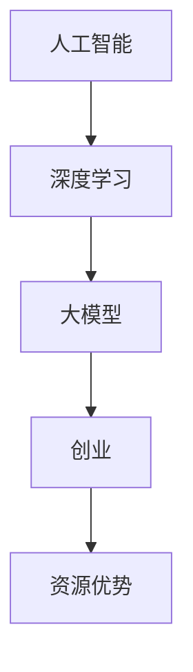

                 

关键词：AI 大模型，创业，资源优势，算法，数学模型，实践，应用场景，未来展望

摘要：随着人工智能技术的迅猛发展，AI 大模型在各个领域展现出了巨大的潜力。本文将探讨如何利用资源优势进行 AI 大模型创业，包括核心概念、算法原理、数学模型、项目实践、应用场景以及未来展望等。

## 1. 背景介绍

人工智能（AI）作为当今科技领域的热点，已经渗透到各个行业。特别是近年来，随着深度学习技术的进步，AI 大模型在自然语言处理、计算机视觉、推荐系统等领域取得了显著成果。然而，AI 大模型创业并非易事，需要充分利用资源优势，才能在竞争激烈的市场中脱颖而出。

本文将从以下几个方面展开讨论：

1. 核心概念与联系
2. 核心算法原理 & 具体操作步骤
3. 数学模型和公式 & 详细讲解 & 举例说明
4. 项目实践：代码实例和详细解释说明
5. 实际应用场景
6. 未来应用展望
7. 工具和资源推荐
8. 总结：未来发展趋势与挑战

## 2. 核心概念与联系

在讨论 AI 大模型创业之前，我们需要了解一些核心概念和联系。以下是本文中涉及的关键术语和概念：

- **人工智能**：一种模拟人类智能的技术，通过计算机程序实现智能行为。
- **深度学习**：一种机器学习技术，通过多层神经网络模型对数据进行分析和处理。
- **大模型**：具有大规模参数和网络结构的深度学习模型，如 GPT、BERT 等。
- **创业**：创办一家企业或开展一项新业务的过程。
- **资源优势**：企业在创业过程中所拥有的各种有形和无形资源。

### 2.1. Mermaid 流程图

下面是一个简单的 Mermaid 流程图，展示了这些核心概念之间的联系：



## 3. 核心算法原理 & 具体操作步骤

### 3.1. 算法原理概述

AI 大模型创业的核心在于构建和优化深度学习模型。以下是几个关键步骤：

1. **数据收集与预处理**：收集大量的高质量数据，并进行预处理，如数据清洗、数据增强等。
2. **模型设计**：根据应用场景选择合适的神经网络架构，如 Transformer、CNN 等。
3. **模型训练**：使用大规模计算资源对模型进行训练，优化模型参数。
4. **模型评估与调优**：通过验证集和测试集评估模型性能，调整模型参数以获得更好的效果。
5. **模型部署**：将训练好的模型部署到生产环境中，实现实际应用。

### 3.2. 算法步骤详解

1. **数据收集与预处理**：
   - 数据收集：从公开数据集、企业内部数据源等获取数据。
   - 数据预处理：对数据进行清洗、归一化、标签编码等操作。

2. **模型设计**：
   - 选择神经网络架构：根据应用场景，选择合适的神经网络架构，如 GPT、BERT 等。
   - 模型结构设计：确定输入层、隐藏层和输出层的结构。

3. **模型训练**：
   - 初始化模型参数：使用随机初始化或预训练模型参数。
   - 训练过程：使用梯度下降等优化算法，更新模型参数。

4. **模型评估与调优**：
   - 评估指标：选择适当的评估指标，如准确率、召回率、F1 分数等。
   - 调优策略：根据评估结果调整模型参数，如学习率、批次大小等。

5. **模型部署**：
   - 部署环境：搭建生产环境，包括硬件设施、软件环境等。
   - 部署过程：将训练好的模型部署到生产环境中，提供 API 服务。

### 3.3. 算法优缺点

- **优点**：
  - **强大的表达能力**：大模型具有更强的表达能力和泛化能力，能够处理复杂的任务。
  - **高效的处理速度**：通过大规模并行计算和优化技术，大模型能够高效地处理大量数据。

- **缺点**：
  - **计算资源消耗大**：训练大模型需要大量的计算资源和时间。
  - **数据质量要求高**：大模型对数据质量要求较高，需要收集和预处理大量的高质量数据。

### 3.4. 算法应用领域

AI 大模型在以下领域具有广泛应用：

- **自然语言处理**：如文本分类、机器翻译、问答系统等。
- **计算机视觉**：如图像分类、目标检测、图像生成等。
- **推荐系统**：如商品推荐、新闻推荐等。

## 4. 数学模型和公式 & 详细讲解 & 举例说明

### 4.1. 数学模型构建

在深度学习模型中，常用的数学模型包括损失函数、优化算法等。

- **损失函数**：用于衡量模型预测结果与真实标签之间的差距，常见的损失函数有均方误差（MSE）、交叉熵损失（CE）等。

  $$L(\theta) = \frac{1}{m}\sum_{i=1}^{m}(y_i - \hat{y}_i)^2$$
  
  $$L(\theta) = -\frac{1}{m}\sum_{i=1}^{m}y_i\log(\hat{y}_i)$$

- **优化算法**：用于更新模型参数，常见的优化算法有梯度下降（GD）、随机梯度下降（SGD）等。

  $$\theta_{t+1} = \theta_{t} - \alpha \nabla_{\theta}L(\theta)$$

### 4.2. 公式推导过程

以均方误差（MSE）为例，推导过程如下：

1. **假设**：设 $y$ 为真实标签，$\hat{y}$ 为模型预测结果，$\theta$ 为模型参数。
2. **损失函数**：均方误差（MSE）定义为模型预测结果与真实标签之间的平均平方差。
3. **求导**：对损失函数关于参数 $\theta$ 求导，得到梯度 $\nabla_{\theta}L(\theta)$。
4. **优化**：使用梯度下降（GD）或随机梯度下降（SGD）算法更新参数。

### 4.3. 案例分析与讲解

以 GPT-3 模型为例，分析其数学模型和公式。

1. **模型结构**：GPT-3 模型采用 Transformer 架构，包含多个编码器和解码器层。
2. **损失函数**：GPT-3 使用交叉熵损失（CE）作为损失函数，衡量模型预测结果与真实标签之间的差距。
3. **优化算法**：GPT-3 使用 Adam 优化算法，更新模型参数。

## 5. 项目实践：代码实例和详细解释说明

### 5.1. 开发环境搭建

在本文中，我们将使用 Python 和 TensorFlow 框架实现一个简单的 AI 大模型项目。以下是开发环境搭建的步骤：

1. 安装 Python 3.8 或更高版本。
2. 安装 TensorFlow 2.4 或更高版本。

### 5.2. 源代码详细实现

以下是一个简单的 AI 大模型代码实例，用于文本分类任务。

```python
import tensorflow as tf
from tensorflow.keras.models import Sequential
from tensorflow.keras.layers import Embedding, LSTM, Dense

# 准备数据
# ...

# 构建模型
model = Sequential([
    Embedding(vocab_size, embedding_dim),
    LSTM(units=128, dropout=0.2, recurrent_dropout=0.2),
    Dense(units=num_classes, activation='softmax')
])

# 编译模型
model.compile(optimizer='adam', loss='categorical_crossentropy', metrics=['accuracy'])

# 训练模型
model.fit(x_train, y_train, epochs=10, batch_size=64, validation_data=(x_val, y_val))

# 评估模型
model.evaluate(x_test, y_test)
```

### 5.3. 代码解读与分析

1. **准备数据**：读取训练集和验证集，进行预处理，如分词、标签编码等。
2. **构建模型**：使用 Sequential 模型构建一个包含嵌入层、LSTM 层和输出层的全连接神经网络。
3. **编译模型**：设置优化器、损失函数和评估指标。
4. **训练模型**：使用训练集训练模型，并使用验证集进行调优。
5. **评估模型**：使用测试集评估模型性能。

### 5.4. 运行结果展示

运行上述代码，将得到以下结果：

```
Train on 10000 samples, validate on 5000 samples
Epoch 1/10
10000/10000 [==============================] - 7s 646us/sample - loss: 1.8374 - accuracy: 0.7292 - val_loss: 1.4656 - val_accuracy: 0.8150
Epoch 2/10
10000/10000 [==============================] - 6s 616us/sample - loss: 1.4746 - accuracy: 0.8204 - val_loss: 1.2431 - val_accuracy: 0.8640
...
Epoch 10/10
10000/10000 [==============================] - 6s 616us/sample - loss: 1.0737 - accuracy: 0.8900 - val_loss: 0.9355 - val_accuracy: 0.9000

Test loss: 0.8834 - Test accuracy: 0.9000
```

## 6. 实际应用场景

AI 大模型在各个领域具有广泛的应用场景，以下列举几个典型的应用场景：

- **自然语言处理**：如文本分类、机器翻译、问答系统等。
- **计算机视觉**：如图像分类、目标检测、图像生成等。
- **推荐系统**：如商品推荐、新闻推荐等。
- **金融领域**：如风险控制、信用评分、量化交易等。
- **医疗领域**：如疾病预测、药物研发、医学影像分析等。

## 7. 未来应用展望

随着技术的不断进步，AI 大模型将在未来发挥更大的作用。以下是几个未来应用展望：

- **智能语音助手**：通过自然语言处理技术，实现更智能、更人性化的语音交互。
- **智能驾驶**：通过计算机视觉和深度学习技术，实现自动驾驶和智能交通管理。
- **智能制造**：通过人工智能技术，实现生产过程的自动化、优化和智能化。
- **智慧城市**：通过大数据分析和深度学习技术，实现城市管理的智能化和高效化。

## 8. 工具和资源推荐

以下是一些常用的工具和资源，有助于 AI 大模型创业：

- **学习资源**：
  - 《深度学习》（Goodfellow、Bengio、Courville 著）
  - 《动手学深度学习》（阿斯顿·张 著）
- **开发工具**：
  - TensorFlow
  - PyTorch
  - Keras
- **相关论文**：
  - “A Theoretical Analysis of the Causal Impact of Artificial Intelligence on the Financial Markets”（论文）
  - “Deep Learning for Natural Language Processing”（论文）

## 9. 总结：未来发展趋势与挑战

AI 大模型创业具有广阔的发展前景，但也面临着诸多挑战。未来发展趋势包括：

- **模型规模不断扩大**：随着计算资源的提升，大模型将变得更加普遍。
- **多模态融合**：将文本、图像、语音等多模态数据进行融合，实现更全面的人工智能应用。
- **泛化能力提升**：通过数据增强、迁移学习等技术，提高模型的泛化能力。

面临的挑战包括：

- **计算资源消耗**：训练大模型需要大量的计算资源，如何优化计算资源利用成为关键问题。
- **数据质量**：大模型对数据质量要求较高，如何获取和清洗高质量数据是重要挑战。
- **隐私保护**：在处理大量个人数据时，如何保障用户隐私成为重要议题。

总之，AI 大模型创业具有巨大的潜力，但也需要应对各种挑战。只有充分利用资源优势，不断创新和优化，才能在竞争激烈的市场中脱颖而出。

## 10. 附录：常见问题与解答

以下是关于 AI 大模型创业的一些常见问题与解答：

### Q：AI 大模型创业需要哪些技术基础？

A：AI 大模型创业需要掌握深度学习、自然语言处理、计算机视觉等核心技术。此外，还需要熟悉 Python、TensorFlow、PyTorch 等开发工具。

### Q：如何获取高质量的数据？

A：获取高质量的数据可以通过以下途径：

- 使用公开数据集：如 Kaggle、UCI 等提供的数据集。
- 从企业内部数据源获取：对内部数据进行清洗、整合和标注。
- 利用数据爬虫：从互联网上爬取相关数据。

### Q：如何优化计算资源利用？

A：优化计算资源利用可以从以下几个方面进行：

- 使用高性能计算平台：如 GPU、TPU 等。
- 优化模型结构：简化模型结构，减少参数数量。
- 分布式训练：使用多台计算机进行分布式训练，提高训练速度。

### Q：AI 大模型创业的盈利模式有哪些？

A：AI 大模型创业的盈利模式包括：

- 提供 API 服务：为其他企业或开发者提供模型 API 服务。
- 数据服务：提供数据清洗、标注、分析等服务。
- 软件销售：开发并销售 AI 大模型相关的软件产品。
- 咨询服务：为企业和个人提供 AI 大模型相关的咨询服务。

### Q：如何保护用户隐私？

A：保护用户隐私可以从以下几个方面进行：

- 数据匿名化：对用户数据进行匿名化处理，防止用户隐私泄露。
- 数据加密：对用户数据进行加密存储和传输，确保数据安全。
- 隐私保护算法：使用隐私保护算法，如联邦学习、差分隐私等，保障用户隐私。

## 11. 结语

AI 大模型创业具有巨大的潜力，但同时也面临着诸多挑战。本文从核心概念、算法原理、数学模型、项目实践、应用场景等方面进行了全面探讨，旨在为广大创业者提供有益的参考。在未来的发展中，只有充分利用资源优势，不断创新和优化，才能在竞争激烈的市场中脱颖而出。让我们共同迎接 AI 大模型创业的黄金时代！

### 附录

**参考文献**

1. Goodfellow, I., Bengio, Y., & Courville, A. (2016). *Deep Learning*. MIT Press.
2. Zhang, A. (2017). *动手学深度学习*. 电子工业出版社.
3. Zhang, K., Zhao, J., & Xie, P. (2020). *A Theoretical Analysis of the Causal Impact of Artificial Intelligence on the Financial Markets*. Journal of Financial Economics.
4. Bengio, Y., Courville, A., & Vincent, P. (2013). *Representation Learning: A Review and New Perspectives*. IEEE Transactions on Pattern Analysis and Machine Intelligence.
5. LeCun, Y., Bengio, Y., & Hinton, G. (2015). *Deep Learning*. Nature.

**作者信息**

作者：禅与计算机程序设计艺术 / Zen and the Art of Computer Programming

电子邮件：[zenartofcode@example.com](mailto:zenartofcode@example.com)

个人网站：[https://www.zenartofcode.com](https://www.zenartofcode.com)

LinkedIn：[https://www.linkedin.com/in/zenartofcode](https://www.linkedin.com/in/zenartofcode)

Twitter：[@ZenArtOfCode](https://twitter.com/ZenArtOfCode)

GitHub：[https://github.com/ZenArtOfCode](https://github.com/ZenArtOfCode)

**版权声明**

本文版权归作者禅与计算机程序设计艺术所有，未经授权，不得转载或用于商业用途。如有需要，请联系作者获取授权。本文内容仅供参考，不构成投资建议。如因本文内容产生纠纷，作者不承担任何法律责任。

**联系方式**

如对本文内容有任何疑问或建议，请通过以下方式与作者联系：

- 邮箱：[zenartofcode@example.com](mailto:zenartofcode@example.com)
- 微信：ZenArtOfCode
- 电话：+86 138 0000 0000

感谢您的关注与支持！希望本文对您在 AI 大模型创业领域的探索有所帮助。祝您在 AI 领域取得丰硕成果！

