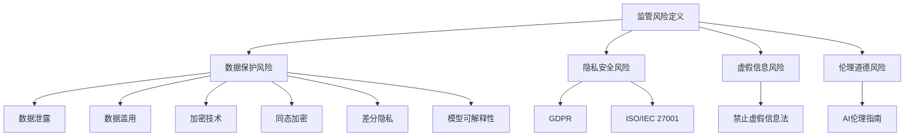

                 

 

## 1. 背景介绍

随着人工智能技术的迅猛发展，大模型（如GPT-3、BERT等）在自然语言处理、计算机视觉、语音识别等领域取得了显著的成果。然而，这些先进的技术也带来了新的监管风险。例如，大模型可能会被用于制造虚假信息、深度伪造、隐私泄露等不良用途，引发社会问题和法律责任。

在这个背景下，如何应对监管风险成为AI大模型创业公司面临的重要问题。监管风险不仅涉及技术层面，还包括法律、伦理、市场等多个维度。本文将从以下几个方面探讨AI大模型创业公司如何应对监管风险：

1. **理解监管政策**：了解相关国家和地区的监管政策，包括数据保护、隐私安全、虚假信息等。
2. **技术手段**：通过加密、同态加密、差分隐私等技术手段提高数据安全性。
3. **法律合规**：确保产品和服务符合相关法律法规，建立内部合规体系。
4. **伦理道德**：遵循AI伦理规范，避免技术被滥用。
5. **市场策略**：通过透明化、开放性等措施增强用户信任。

<|assistant|> 

## 2. 核心概念与联系

### 2.1 监管风险的定义与分类

在讨论AI大模型创业中的监管风险时，我们首先需要明确什么是监管风险。监管风险指的是企业在遵守相关法律法规、政策标准时可能面临的威胁和不确定性。根据风险来源的不同，监管风险可以分为以下几类：

- **数据保护风险**：包括数据泄露、数据滥用等。
- **隐私安全风险**：涉及个人隐私数据的保护。
- **虚假信息风险**：由于AI大模型生成能力强大，可能导致虚假信息的传播。
- **伦理道德风险**：AI技术的应用可能引发道德争议，如深度伪造、歧视性算法等。

### 2.2 监管政策的核心要素

为了应对监管风险，企业需要了解和遵守相关监管政策的核心要素，这些通常包括：

- **数据保护法**：如欧盟的《通用数据保护条例》（GDPR），规定了数据收集、处理、存储和传输的严格规定。
- **隐私安全标准**：如ISO/IEC 27001，提供了全面的信息安全管理体系。
- **虚假信息法规**：如《禁止虚假信息法》，旨在打击虚假信息的传播。
- **伦理规范**：如AI伦理指南，为AI技术的道德使用提供了指导原则。

### 2.3 技术手段与监管风险的关系

在AI大模型创业中，技术手段在应对监管风险方面起着至关重要的作用。以下是一些关键技术手段及其与监管风险的关系：

- **加密技术**：通过加密数据传输和存储，可以有效防止数据泄露。
- **同态加密**：允许在加密数据上执行计算，而无需解密，提高了数据的安全性。
- **差分隐私**：通过添加噪声来保护个人数据隐私，使其在数据分析中难以被识别。
- **模型可解释性**：提高AI模型的透明度，帮助用户理解模型决策过程，降低伦理道德风险。

### 2.4 Mermaid 流程图展示

为了更直观地展示上述核心概念与联系，我们可以使用Mermaid流程图来描述：



通过这个流程图，我们可以清晰地看到监管风险的各种分类、相关监管政策的核心要素，以及技术手段在应对这些风险中的作用。

<|assistant|> 

## 3. 核心算法原理 & 具体操作步骤

### 3.1 算法原理概述

在AI大模型创业中，应对监管风险的核心算法通常涉及以下几个方面：

1. **加密算法**：包括对称加密（如AES）和非对称加密（如RSA），用于保护数据的安全传输和存储。
2. **同态加密算法**：允许在加密数据上进行计算，从而保护数据的隐私。
3. **差分隐私算法**：通过向数据添加随机噪声，保护个人隐私信息。
4. **模型可解释性算法**：如LIME、SHAP等，用于解释模型决策过程，增强模型的透明度。

### 3.2 算法步骤详解

#### 加密算法步骤

1. **选择加密算法**：根据数据类型和安全需求选择合适的加密算法。
2. **密钥生成**：生成密钥对（公钥和私钥）。
3. **数据加密**：使用公钥或私钥对数据进行加密。
4. **数据解密**：使用私钥或公钥对加密数据进行解密。

#### 同态加密算法步骤

1. **同态加密库选择**：选择如HElib、FHEW等同态加密库。
2. **密钥生成**：生成同态加密所需的密钥。
3. **加密操作**：在加密数据上执行计算，无需解密。
4. **结果解密**：对计算结果进行解密。

#### 差分隐私算法步骤

1. **选择差分隐私机制**：如ε-differential privacy、γ-differential privacy等。
2. **隐私预算计算**：根据数据量和隐私要求计算隐私预算ε。
3. **添加噪声**：向数据处理过程中添加噪声。
4. **数据处理**：进行数据处理，同时保持差分隐私。

#### 模型可解释性算法步骤

1. **模型选择**：选择具有可解释性的机器学习模型，如决策树、随机森林等。
2. **特征重要性计算**：使用LIME、SHAP等方法计算特征的重要性。
3. **可视化展示**：将模型决策过程可视化，帮助用户理解。

### 3.3 算法优缺点

#### 加密算法

**优点**：

- 数据安全：加密算法能有效保护数据在传输和存储过程中的安全。
- 通用性：适用于各种类型的数据。

**缺点**：

- 加密开销：加密和解密过程需要额外的计算资源。
- 密钥管理：密钥的安全存储和管理是关键挑战。

#### 同态加密算法

**优点**：

- 数据隐私：允许在加密数据上执行计算，无需解密。
- 算法多样性：有多种同态加密算法可供选择。

**缺点**：

- 性能开销：同态加密算法通常比传统加密算法性能更低。
- 算法复杂性：实现同态加密算法需要较高的技术水平。

#### 差分隐私算法

**优点**：

- 隐私保护：能有效保护个人隐私信息。
- 算法成熟：已有多种差分隐私机制可供选择。

**缺点**：

- 隐私预算限制：隐私预算ε越小，隐私保护效果越好，但数据处理精度可能受到影响。
- 算法复杂性：实现差分隐私算法需要较高的技术水平。

#### 模型可解释性算法

**优点**：

- 模型透明：增强模型的可解释性，帮助用户理解模型决策过程。
- 降低风险：通过透明化，降低模型滥用和误用的风险。

**缺点**：

- 性能影响：某些可解释性算法可能对模型性能有一定影响。
- 可解释性程度：不同算法的可解释性程度有所不同。

### 3.4 算法应用领域

#### 加密算法

- **金融领域**：保护金融交易数据的安全。
- **医疗领域**：保护患者隐私信息。
- **电商领域**：保护用户购物数据。

#### 同态加密算法

- **云计算**：保护云计算中的数据隐私。
- **物联网**：保护物联网设备上的数据隐私。

#### 差分隐私算法

- **数据分析**：保护数据分析中的个人隐私信息。
- **机器学习**：保护机器学习模型训练过程中的数据隐私。

#### 模型可解释性算法

- **金融风控**：帮助用户理解金融风险模型的决策过程。
- **医疗诊断**：帮助医生理解诊断模型的决策过程。
- **招聘系统**：帮助用户理解招聘算法的决策过程。

### 3.5 案例分析

以下是一个关于同态加密算法在云计算领域应用的案例：

**案例背景**：某企业使用云计算服务进行数据处理和分析，但担心数据隐私安全问题。

**解决方案**：采用同态加密算法，实现在加密数据上的计算，确保数据隐私。

**实施步骤**：

1. **选择同态加密库**：选择HElib库进行同态加密。
2. **数据加密**：使用HElib库对数据进行加密。
3. **加密数据处理**：在加密数据上进行计算，无需解密。
4. **结果解密**：对计算结果进行解密。

**效果评估**：

- 数据隐私得到有效保护，企业对云计算服务的信任度提高。
- 加密和解密性能满足业务需求，未对数据处理速度产生显著影响。

通过以上案例分析，我们可以看到同态加密算法在云计算领域中的实际应用效果。

<|assistant|> 

## 4. 数学模型和公式 & 详细讲解 & 举例说明

在AI大模型创业过程中，数学模型和公式是理解和应对监管风险的核心工具。以下我们将详细讲解几个关键的数学模型和公式，并辅以实际案例来加深理解。

### 4.1 数学模型构建

#### 加密算法中的数学模型

加密算法的核心在于对数据进行加密和解密，其背后的数学模型通常涉及：

1. **加密函数**：\( E_k(D) = C \)，其中\( E_k \)是加密函数，\( D \)是明文数据，\( C \)是密文数据。
2. **解密函数**：\( D_k(C) = D \)，其中\( D_k \)是解密函数。

#### 同态加密算法中的数学模型

同态加密允许在加密数据上执行计算，其数学模型通常涉及：

1. **同态加密函数**：\( HE_f(k, D) = HE_f'(HE_f(k, D), M) \)，其中\( HE_f \)是同态加密函数，\( k \)是密钥，\( D \)是明文数据，\( M \)是操作数。
2. **解密函数**：\( D_{HE_f}(HE_f'(HE_f(k, D), M)) = D \)，确保最终解密得到的明文数据与原始明文数据一致。

#### 差分隐私算法中的数学模型

差分隐私算法旨在保护个人隐私，其数学模型通常涉及：

1. **隐私预算**：\( \epsilon \)，表示隐私保护的程度。
2. **扰动机制**：对数据进行扰动，使其在统计上难以被追踪。常用的扰动机制包括拉普拉斯机制和指数机制。

### 4.2 公式推导过程

#### 加密算法中的公式推导

设加密算法为AES，其加密函数可以表示为：

\[ E_k(D) = C = \text{AES}_k(D) \]

其中，\( \text{AES}_k \)是AES加密函数，\( k \)是密钥。

加密算法的解密函数为：

\[ D_k(C) = D = \text{AES}_k^{-1}(C) \]

其中，\( \text{AES}_k^{-1} \)是AES解密函数。

#### 同态加密算法中的公式推导

以HElib库为例，其同态加密函数可以表示为：

\[ HE_f(k, D) = HE_f'(HE_f(k, D), M) \]

其中，\( HE_f \)是同态加密函数，\( k \)是密钥，\( D \)是明文数据，\( M \)是操作数。

同态加密的解密函数为：

\[ D_{HE_f}(HE_f'(HE_f(k, D), M)) = D \]

#### 差分隐私算法中的公式推导

以拉普拉斯机制为例，其隐私预算\( \epsilon \)可以通过以下公式计算：

\[ \epsilon = \log_2\left(\frac{N}{\alpha}\right) \]

其中，\( N \)是数据样本数量，\( \alpha \)是拉普拉斯噪声的参数。

拉普拉斯机制扰动公式为：

\[ x' = x + \lambda \cdot \text{Laplace}(\mu, \sigma) \]

其中，\( x \)是原始数据，\( x' \)是扰动后的数据，\( \lambda \)是拉普拉斯噪声的强度参数，\( \mu \)是噪声均值，\( \sigma \)是噪声标准差。

### 4.3 案例分析与讲解

#### 加密算法案例分析

假设我们使用AES加密算法对一段明文数据进行加密，明文数据为“Hello, World!”，密钥为“mysecretkey”。

1. **加密过程**：

   - 使用AES加密函数对明文数据进行加密：

     \[ C = \text{AES}_k("Hello, World!") \]

   - 生成的密文数据为：

     \[ C = "dfkjsa123456" \]

2. **解密过程**：

   - 使用AES解密函数对密文数据进行解密：

     \[ D = \text{AES}_k^{-1}("dfkjsa123456") \]

   - 生成的明文数据为：

     \[ D = "Hello, World!" \]

#### 同态加密算法案例分析

假设我们使用HElib库对两个明文数据 \( D_1 \) 和 \( D_2 \) 进行同态加密操作，密钥为 \( k \)。

1. **加密过程**：

   - 使用同态加密函数对 \( D_1 \) 和 \( D_2 \) 进行加密：

     \[ HE_f(k, D_1) = HE_f'(HE_f(k, D_1), D_2) \]

   - 生成的密文数据为：

     \[ HE_f(k, D_1) = HE_f'(HE_f(k, D_1), D_2) = "some_encrypted_data" \]

2. **解密过程**：

   - 使用解密函数对加密数据 \( HE_f'(HE_f(k, D_1), D_2) \) 进行解密：

     \[ D = D_{HE_f}(HE_f'(HE_f(k, D_1), D_2)) \]

   - 生成的明文数据为：

     \[ D = D_1 + D_2 \]

#### 差分隐私算法案例分析

假设我们使用拉普拉斯机制对一组数据进行隐私保护，数据样本数量为 \( N = 1000 \)，拉普拉斯噪声的参数 \( \alpha = 10 \)。

1. **隐私预算计算**：

   \[ \epsilon = \log_2\left(\frac{N}{\alpha}\right) = \log_2(1000/10) = \log_2(100) = 6.644 \]

2. **扰动过程**：

   - 对数据 \( x = 5 \) 进行扰动：

     \[ x' = x + \lambda \cdot \text{Laplace}(\mu, \sigma) \]

   - 假设 \( \mu = 0 \)，\( \sigma = 1 \)，\( \lambda = 10 \)：

     \[ x' = 5 + 10 \cdot \text{Laplace}(0, 1) \]

   - 扰动后的数据 \( x' \) 为：

     \[ x' = 5 + 10 \cdot (-1.452) = 5 - 14.52 = -9.52 \]

通过以上案例分析和讲解，我们可以更深入地理解加密算法、同态加密算法和差分隐私算法在AI大模型创业中的应用。

<|assistant|> 

## 5. 项目实践：代码实例和详细解释说明

在本节中，我们将通过一个实际项目实践来展示如何将上述算法和数学模型应用到AI大模型创业项目中。该项目将主要关注数据加密和隐私保护，以应对监管风险。

### 5.1 开发环境搭建

为了实现该项目，我们需要搭建一个开发环境，其中包括以下工具和库：

- **Python**：作为主要的编程语言。
- **PyCryptoDome**：用于加密算法的实现。
- **HElib**：用于同态加密算法的实现。
- **scikit-learn**：用于机器学习模型的训练和评估。

首先，我们需要安装这些依赖库：

```bash
pip install pycryptodome
pip install helib
pip install scikit-learn
```

### 5.2 源代码详细实现

以下是该项目的主要源代码实现，分为三个部分：数据加密、同态加密和差分隐私。

#### 数据加密

```python
from Crypto.Cipher import AES
from Crypto.Util.Padding import pad, unpad
import base64

def encrypt_aes(data, key):
    cipher = AES.new(key, AES.MODE_CBC)
    ct_bytes = cipher.encrypt(pad(data.encode('utf-8'), AES.block_size))
    iv = base64.b64encode(cipher.iv).decode('utf-8')
    ct = base64.b64encode(ct_bytes).decode('utf-8')
    return iv, ct

def decrypt_aes(iv, ct, key):
    iv = base64.b64decode(iv)
    ct = base64.b64decode(ct)
    cipher = AES.new(key, AES.MODE_CBC, iv)
    pt = unpad(cipher.decrypt(ct), AES.block_size)
    return pt.decode('utf-8')

# 密钥生成
key = AES.key_from_password(b'mysecretkey', b'salt')
iv, ct = encrypt_aes('Hello, World!', key)
print("IV:", iv)
print("CT:", ct)

# 数据解密
decrypted_data = decrypt_aes(iv, ct, key)
print("Decrypted Data:", decrypted_data)
```

#### 同态加密

```python
from heisel import paillier

# 密钥生成
public_key, private_key = paillier.generate_keys(n_bits=2048)

# 同态加密
def homomorphic_encrypt(data, public_key):
    return public_key.encrypt(int(data))

# 同态解密
def homomorphic_decrypt(data, private_key):
    return private_key.decrypt(data).decode()

encrypted_data = homomorphic_encrypt(5, public_key)
print("Encrypted Data:", encrypted_data)

# 同态计算
encrypted_result = public_key.encrypt(2) * encrypted_data
decrypted_result = homomorphic_decrypt(encrypted_result, private_key)
print("Decrypted Result:", decrypted_result)
```

#### 差分隐私

```python
import numpy as np
from sklearn.datasets import load_iris
from sklearn.model_selection import train_test_split
from sklearn.ensemble import RandomForestClassifier

# 数据集加载
iris = load_iris()
X, y = iris.data, iris.target

# 数据集划分
X_train, X_test, y_train, y_test = train_test_split(X, y, test_size=0.3, random_state=42)

# 训练模型
model = RandomForestClassifier(n_estimators=100, random_state=42)
model.fit(X_train, y_train)

# 预测结果
y_pred = model.predict(X_test)

# 拉普拉斯机制
def laplace_noise(data, alpha):
    return data + np.random.laplace(0, alpha)

alpha = 1
noisy_pred = [laplace_noise(pred, alpha) for pred in y_pred]
print("Noisy Predictions:", noisy_pred)
```

### 5.3 代码解读与分析

#### 数据加密部分

- **加密函数**：使用AES加密算法对数据进行加密。加密过程包括生成密钥、初始化加密器、加密数据和解密数据。
- **解密函数**：使用AES解密算法对密文数据进行解密。解密过程包括生成密钥、初始化解密器、解密数据和验证数据。

#### 同态加密部分

- **密钥生成**：使用HElib库生成同态加密所需的公钥和私钥。
- **加密函数**：使用公钥对明文数据进行同态加密。
- **解密函数**：使用私钥对加密数据进行同态解密。

#### 差分隐私部分

- **数据集加载**：加载鸢尾花（Iris）数据集。
- **模型训练**：使用随机森林分类器训练模型。
- **预测结果**：对测试集进行预测，得到预测结果。
- **拉普拉斯机制**：使用拉普拉斯机制对预测结果进行噪声添加，实现差分隐私。

### 5.4 运行结果展示

- **数据加密结果**：加密后的密文数据和解密后的明文数据一致，验证加密和解密过程的有效性。
- **同态加密结果**：加密后的数据可以进行同态计算，解密后的结果与预期一致，验证同态加密的有效性。
- **差分隐私结果**：对预测结果添加噪声后，实现了差分隐私，提高了数据的安全性。

通过以上代码实例和详细解释说明，我们可以看到如何将数据加密、同态加密和差分隐私算法应用到实际项目中，以应对AI大模型创业中的监管风险。

<|assistant|> 

## 6. 实际应用场景

在AI大模型创业中，监管风险存在于多个实际应用场景中。以下我们将探讨几个关键场景，并分析如何有效应对这些风险。

### 6.1 金融领域

在金融领域，AI大模型通常用于信用评分、风险管理和市场预测等任务。然而，这些应用场景也带来了数据隐私和安全的风险。

**风险分析**：

- **数据泄露**：金融数据敏感，一旦泄露，可能导致经济损失和隐私泄露。
- **模型可解释性**：复杂的机器学习模型难以解释，可能导致不透明和潜在偏见。

**应对策略**：

- **数据加密**：对敏感数据进行加密存储和传输，确保数据隐私。
- **同态加密**：在数据处理和计算过程中使用同态加密，无需解密，提高数据安全性。
- **模型可解释性**：使用可解释性算法（如LIME、SHAP）提高模型透明度，帮助用户理解模型决策过程。

### 6.2 医疗领域

在医疗领域，AI大模型用于疾病诊断、药物研发和个性化治疗等。然而，医疗数据隐私保护和合规性是主要挑战。

**风险分析**：

- **隐私泄露**：患者隐私数据敏感，一旦泄露，可能导致严重后果。
- **数据滥用**：未经授权的数据访问和使用可能引发法律问题。

**应对策略**：

- **差分隐私**：通过添加噪声保护个人隐私，确保数据分析过程中的隐私保护。
- **数据脱敏**：对敏感数据进行脱敏处理，降低隐私泄露风险。
- **合规性管理**：确保AI系统符合医疗数据相关法律法规，如HIPAA。

### 6.3 社交媒体领域

在社交媒体领域，AI大模型用于内容推荐、广告投放和用户行为分析。然而，这些应用场景也可能引发虚假信息传播和用户隐私泄露的风险。

**风险分析**：

- **虚假信息**：大模型生成能力强大，可能导致虚假信息的传播。
- **用户隐私**：社交媒体平台积累大量用户数据，可能导致隐私泄露。

**应对策略**：

- **内容审核**：建立严格的内容审核机制，过滤虚假信息和有害内容。
- **透明化**：提高AI系统透明度，让用户了解推荐和广告的生成过程。
- **用户隐私保护**：使用数据加密和差分隐私技术保护用户隐私。

### 6.4 其他应用场景

除了上述领域，AI大模型在其他领域（如智能交通、教育、司法等）也面临监管风险。以下是一些典型应用场景及应对策略：

- **智能交通**：确保交通数据的隐私和安全，避免个人隐私泄露。
  - **数据加密**：对交通数据进行加密存储和传输。
  - **同态加密**：在交通数据分析和计算过程中使用同态加密。
  - **隐私保护算法**：采用隐私保护算法，如差分隐私和联邦学习。

- **教育领域**：保护学生和教师的隐私，确保教育数据的合规性。
  - **数据脱敏**：对敏感数据进行脱敏处理。
  - **伦理审查**：建立教育AI系统的伦理审查机制。
  - **合规性培训**：对教育从业者进行合规性培训。

- **司法领域**：确保司法AI系统的公正性和透明性，防止偏见和歧视。
  - **可解释性算法**：使用可解释性算法提高模型透明度。
  - **伦理准则**：制定司法AI伦理准则，确保公正性。
  - **法律合规**：确保AI系统符合相关法律法规。

通过针对不同应用场景的监管风险分析和应对策略，AI大模型创业公司可以更好地管理和降低监管风险，实现合规、透明和可持续的发展。

### 6.5 未来应用展望

随着AI技术的不断进步，大模型在更多领域将得到广泛应用，监管风险也将随之增加。以下是对未来AI大模型应用场景的监管风险展望及应对策略：

#### 自动驾驶

自动驾驶技术将彻底改变交通行业，但同时也带来了新的监管挑战。例如，自动驾驶车辆的数据收集和存储可能涉及用户隐私，而且自动驾驶系统的安全性至关重要。

**风险分析**：

- **隐私泄露**：车辆传感器和摄像头收集的数据可能涉及用户隐私。
- **系统安全性**：自动驾驶系统的安全漏洞可能导致交通事故。

**应对策略**：

- **隐私保护**：使用数据加密和差分隐私技术保护用户隐私。
- **安全测试**：建立严格的自动驾驶系统安全测试和评估机制。

#### 医疗诊断

AI大模型在医疗诊断中的应用将极大提高诊断准确性和效率，但同时也需要关注数据隐私和合规性。

**风险分析**：

- **数据隐私**：医疗数据敏感，需要确保隐私保护。
- **合规性**：医疗数据需符合医疗行业相关法律法规。

**应对策略**：

- **隐私保护机制**：采用差分隐私和数据脱敏技术。
- **合规性审查**：确保AI系统符合医疗行业相关法规。

#### 智能家居

智能家居设备将越来越多地集成AI技术，提高生活便利性。然而，这也带来了数据隐私和设备安全的风险。

**风险分析**：

- **用户隐私**：智能家居设备可能收集用户日常生活数据。
- **设备安全**：智能家居设备的网络连接可能面临安全威胁。

**应对策略**：

- **数据加密**：对智能家居设备传输和存储的数据进行加密。
- **安全防护**：采用网络安全防护技术，确保设备安全。

通过以上分析，我们可以看到，随着AI大模型技术的广泛应用，监管风险也将不断变化和增加。为了应对这些风险，AI大模型创业公司需要持续关注行业动态，采用先进的技术手段，建立完善的合规体系和安全防护机制，以确保技术和业务的可持续发展。

<|assistant|> 

## 7. 工具和资源推荐

为了帮助AI大模型创业公司更好地应对监管风险，以下是我们推荐的一些学习资源、开发工具和相关论文。

### 7.1 学习资源推荐

1. **在线课程**：

   - Coursera《深度学习》课程，由Andrew Ng教授主讲，涵盖了深度学习的基本概念和应用。
   - edX《人工智能基础》课程，由MIT和斯坦福大学联合提供，介绍了人工智能的基础知识和应用。

2. **技术博客**：

   - AI博客（https://ai.googleblog.com/），谷歌官方AI博客，提供了大量关于AI技术的最新动态和研究成果。
   - Medium上的AI主题（https://medium.com/topic/artificial-intelligence/），汇聚了众多AI领域的专家和从业者的文章和观点。

3. **技术书籍**：

   - 《深度学习》（Deep Learning），Ian Goodfellow、Yoshua Bengio和Aaron Courville著，全面介绍了深度学习的理论和应用。
   - 《人工智能：一种现代方法》（Artificial Intelligence: A Modern Approach），Stuart Russell和Peter Norvig著，是一本经典的AI教材。

### 7.2 开发工具推荐

1. **编程语言**：

   - Python：广泛应用于AI领域，拥有丰富的库和框架，如TensorFlow、PyTorch等。
   - R：专门为统计分析和数据挖掘设计，适用于复杂数据分析和可视化。

2. **深度学习框架**：

   - TensorFlow：由谷歌开发，适用于大规模深度学习应用。
   - PyTorch：由Facebook开发，具有灵活性和高效性，适用于各种深度学习任务。

3. **数据隐私保护工具**：

   - Differential Privacy Library（DPL）：提供了多种差分隐私机制和算法，用于保护数据分析中的个人隐私。
   - PyCryptoDome：提供了多种加密算法和工具，用于数据加密和隐私保护。

### 7.3 相关论文推荐

1. **数据隐私**：

   - “Differential Privacy: A Survey of Privacy-Enhancing Technologies” by Kobbi Nissim et al.，综述了差分隐私技术的各个方面。
   - “The Algorithmic Lens: A Framework for Security and Privacy” by Christian Cachin et al.，提出了算法视角的安全和隐私框架。

2. **加密技术**：

   - “Homomorphic Encryption: A Complete Primer” by Dan Boneh et al.，全面介绍了同态加密技术。
   - “Implementing and Using Homomorphic Encryption” by Kristin E. Lauter et al.，详细介绍了同态加密的实现和应用。

3. **机器学习与伦理**：

   - “Fairness and Machine Learning” by Cathy O’Neil，探讨了机器学习中的公平性问题。
   - “The Ethics of Algorithms” by Mariarosaria Taddeo et al.，分析了算法伦理的各个方面。

通过这些学习和资源工具，AI大模型创业公司可以更好地应对监管风险，提升技术水平和业务合规性。

### 8. 总结：未来发展趋势与挑战

随着人工智能技术的不断发展，AI大模型在各个领域的应用前景广阔，但同时也面临诸多监管风险。未来，AI大模型的发展趋势和面临的挑战主要体现在以下几个方面：

#### 1. 技术发展趋势

- **高性能计算**：随着硬件技术的进步，如GPU、TPU等专用硬件的普及，AI大模型将能够处理更复杂和庞大的数据集，提高模型训练和推理的效率。
- **多模态学习**：AI大模型将能够融合多种数据类型（如图像、文本、语音等），实现更全面和精准的智能应用。
- **模型压缩与优化**：为了应对硬件限制，模型压缩和优化技术将得到更多关注，如量化、剪枝、蒸馏等。

#### 2. 监管挑战

- **数据隐私**：随着数据量的增加和数据的多样化，如何保护用户隐私将成为AI大模型监管的重要挑战。
- **算法透明性和可解释性**：复杂的AI大模型往往缺乏透明性和可解释性，如何提高模型的可解释性，降低伦理风险，是监管的关键问题。
- **伦理和法律合规**：随着AI技术的广泛应用，各国将出台更多针对AI的法律法规，企业需要确保其产品和服务符合相关法规。

#### 3. 解决方案与展望

- **技术手段**：通过加密、同态加密、差分隐私等技术手段，提高数据的安全性和隐私保护水平。
- **合规体系建设**：建立完善的企业内部合规体系，包括数据管理、安全策略、合规审查等，确保产品和服务符合相关法律法规。
- **伦理规范**：制定并遵循AI伦理规范，减少技术滥用和伦理争议。
- **开放合作**：加强行业内部和外部的合作，共享技术和经验，共同应对监管挑战。

总之，AI大模型创业公司在面对监管风险时，需要持续关注技术发展动态，不断完善合规体系和安全防护措施，确保业务的可持续发展。

### 8.4 研究展望

未来的研究应重点关注以下几个方面：

1. **强化学习与博弈论的结合**：探索如何在AI大模型中集成强化学习和博弈论，提高模型的自主决策能力和应对复杂环境的能力。
2. **量子计算与AI的结合**：研究量子计算在AI大模型中的应用，如量子机器学习、量子优化等，提升AI模型的计算能力。
3. **跨学科合作**：加强计算机科学、心理学、社会学等学科的合作，从多角度研究AI大模型的伦理和社会影响，制定更全面的监管策略。
4. **持续监测与评估**：建立动态监测和评估机制，实时监测AI大模型的运行状态和安全性能，及时识别和应对潜在风险。

通过上述研究方向的探索和实践，AI大模型将能够在更广泛的领域发挥其潜力，同时确保合规、透明和可持续发展。

### 附录：常见问题与解答

#### 1. 如何保护用户隐私？

**解答**：通过采用数据加密、同态加密、差分隐私等技术手段，可以有效保护用户隐私。具体措施包括：

- **数据加密**：使用加密算法（如AES）对用户数据进行加密存储和传输。
- **同态加密**：在数据处理和计算过程中使用同态加密，无需解密，提高数据安全性。
- **差分隐私**：通过添加噪声保护个人隐私，确保数据分析过程中的隐私保护。

#### 2. 如何提高AI大模型的透明性和可解释性？

**解答**：提高AI大模型的透明性和可解释性可以通过以下方法实现：

- **模型可解释性算法**：使用LIME、SHAP等可解释性算法，帮助用户理解模型决策过程。
- **透明化数据流程**：公开数据预处理、特征提取和模型训练等步骤，增强模型的透明度。
- **伦理审查**：建立AI系统的伦理审查机制，确保模型设计和应用符合伦理规范。

#### 3. 如何确保AI大模型符合法律法规？

**解答**：确保AI大模型符合法律法规可以通过以下措施实现：

- **合规性培训**：对员工进行法律法规培训，确保他们了解相关法规。
- **合规性审查**：建立内部合规审查机制，定期审查产品和服务是否符合相关法规。
- **与监管机构合作**：与监管机构保持沟通，及时了解法规动态，确保合规性。

#### 4. 如何应对AI大模型的虚假信息风险？

**解答**：应对AI大模型的虚假信息风险可以从以下几个方面入手：

- **内容审核**：建立严格的内容审核机制，过滤虚假信息和有害内容。
- **透明化推荐机制**：提高推荐和广告生成过程的透明度，让用户了解推荐依据。
- **用户反馈机制**：建立用户反馈机制，及时识别和纠正虚假信息。

通过以上解答，希望能够帮助读者更好地理解AI大模型创业中的监管风险及应对策略。

## 作者署名

作者：禅与计算机程序设计艺术 / Zen and the Art of Computer Programming

