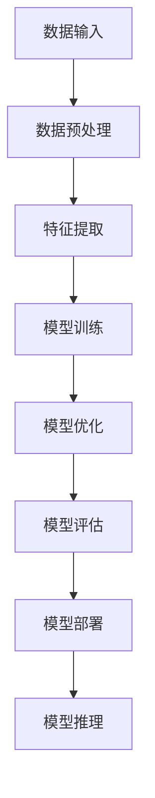

                 

## 摘要

本文旨在探讨AI大模型创业领域的关键问题——如何构建一支强大而高效的技术团队。随着人工智能技术的快速发展，大模型在各类应用场景中显示出巨大的潜力，但同时也带来了对技术团队的严峻挑战。文章将首先介绍AI大模型的背景和重要性，接着深入分析构建技术团队的策略和关键要素，包括技术选型、团队组织结构、人才招聘和培养、项目管理以及团队文化建设。此外，文章还将结合实际案例，展示如何将这些策略付诸实践，并探讨未来AI大模型技术团队可能面临的发展趋势和挑战。通过本文的阅读，读者将获得构建AI大模型技术团队的理论指导和实践启示。

<|assistant|>## 引言

随着人工智能（AI）技术的飞速发展，大模型（Large Models）已经成为行业变革的重要驱动力。从自然语言处理（NLP）、计算机视觉（CV）到语音识别和推荐系统，大模型的应用范围不断扩大，性能也在不断提升。这些大模型通常由数十亿甚至千亿个参数组成，能够在复杂的任务中表现出令人瞩目的能力。然而，AI大模型的研发和应用不仅仅依赖于单个天才的智慧，更需要一支强大而高效的技术团队。

AI大模型创业的核心挑战在于如何构建这样一支团队。首先，技术选型至关重要。不同的应用场景可能需要不同的大模型架构，团队需要根据实际需求选择合适的模型。其次，团队组织结构必须灵活且高效，以适应快速变化的技术和市场需求。此外，人才的招聘和培养也是关键，优秀的团队成员是团队成功的基础。项目管理需要确保研发进度和质量，而团队文化建设则能够增强团队的凝聚力和创造力。

本文将围绕这些核心问题展开讨论，通过深入分析AI大模型的技术特点、构建技术团队的策略和关键要素，以及实际案例的分享，为AI大模型创业提供实用的指导和建议。

<|assistant|>## 1. 背景介绍

### AI大模型的起源与发展

AI大模型的起源可以追溯到深度学习（Deep Learning）的兴起。随着计算能力和数据资源的不断提升，深度神经网络（DNN）逐渐展现出在各类任务中的强大能力。最初，这些模型主要应用于图像识别和语音识别等相对简单的领域。随着技术的进步，特别是2012年AlexNet在ImageNet图像识别比赛中取得的突破性成绩，深度学习开始受到广泛关注。随后，神经架构搜索（Neural Architecture Search, NAS）和生成对抗网络（Generative Adversarial Networks, GAN）等新技术的引入，进一步推动了AI大模型的发展。

大模型的发展历程可以分为几个关键阶段：

1. **初步阶段**：以AlexNet为代表的卷积神经网络（CNN）在图像识别任务中取得显著效果，开启了大模型时代的大门。
2. **快速增长阶段**：随着GPU和TPU等专用硬件的出现，计算能力得到大幅提升，使得大模型的研究和应用进入快速增长期。这一阶段的代表性成果包括Inception、ResNet等模型。
3. **扩展应用阶段**：大模型的应用范围不断扩大，从计算机视觉、语音识别延伸到自然语言处理（NLP）、推荐系统、生物信息学等领域。

### AI大模型的应用场景

AI大模型在各个领域展现出了巨大的潜力，以下是其中几个典型的应用场景：

1. **自然语言处理（NLP）**：大模型在语言理解、机器翻译、问答系统等方面表现出了出色的性能。例如，Google的BERT模型和OpenAI的GPT系列模型，在多个NLP基准测试中取得了领先成绩。
   
2. **计算机视觉（CV）**：大模型在图像分类、目标检测、图像生成等领域取得了显著的进展。例如，DeepMind的GAN模型在图像生成任务中展现了极高的质量，而FaceNet在人脸识别任务中取得了极高的准确率。

3. **语音识别**：大模型在语音识别任务中的表现也越来越优秀。例如，谷歌的语音识别系统在多种语言上达到了超过人类的识别准确率。

4. **推荐系统**：大模型能够通过分析用户的兴趣和行为，为用户提供更加个性化的推荐。例如，亚马逊和Netflix等公司已经广泛采用基于大模型的推荐系统。

5. **生物信息学**：大模型在基因组分析、蛋白质结构预测等领域也发挥了重要作用。例如，DeepMind的AlphaFold模型在蛋白质结构预测领域取得了革命性的突破。

### AI大模型对社会的潜在影响

AI大模型不仅在技术层面上取得了巨大进步，还对社会产生了深远的影响：

1. **经济影响**：AI大模型的应用推动了新产业的发展，创造了大量的就业机会，同时也提高了生产效率，降低了运营成本。

2. **教育变革**：AI大模型在教育领域的应用，如智能辅导系统和在线教育平台，改变了传统的教学模式，提高了学习效率和个性化水平。

3. **医疗进步**：AI大模型在医学诊断、药物研发和个性化医疗等领域具有巨大的潜力，能够显著提高医疗服务的质量和效率。

4. **社会问题**：AI大模型的发展也带来了一系列社会问题，如数据隐私、算法偏见、就业替代等，这些问题需要全社会共同面对和解决。

总之，AI大模型作为人工智能技术的核心组成部分，已经在多个领域展现了其强大的能力，并深刻影响了社会的各个方面。随着技术的不断进步，AI大模型的应用前景将更加广阔，其对社会的影响也将更加深远。

<|assistant|>### 2. 核心概念与联系

在探讨如何构建AI大模型技术团队之前，有必要深入了解与AI大模型密切相关的核心概念和架构，以便更好地理解其复杂性和实现难度。

#### 2.1 AI大模型的基本概念

AI大模型是指那些拥有数亿甚至千亿参数的深度神经网络模型。这些模型通常基于多层感知器（MLP）、卷积神经网络（CNN）、循环神经网络（RNN）或其变种，如Transformer等架构。大模型的参数数量决定了其能够捕捉数据中的复杂模式和特征的能力。例如，BERT模型拥有超过3.4亿个参数，而GPT-3模型则拥有超过1750亿个参数。

#### 2.2 AI大模型的架构

AI大模型的架构设计是构建高效和强大模型的关键。以下是一些常用的架构：

1. **卷积神经网络（CNN）**：CNN在图像识别和计算机视觉任务中表现出色，通过卷积层、池化层和全连接层的组合，能够提取图像中的高层次特征。

2. **循环神经网络（RNN）**：RNN适用于处理序列数据，如时间序列分析、自然语言处理等。其内部循环结构使得RNN能够保持长期依赖信息。

3. **Transformer**：Transformer架构由Google在2017年提出，主要应用于自然语言处理任务。其核心思想是自注意力机制（Self-Attention），能够捕捉序列中的长距离依赖。

4. **多模态学习**：多模态学习是指结合多种类型的数据（如文本、图像、声音等）进行训练，以提高模型的泛化能力。例如，BERT模型结合了文本和图像进行训练，以提升图像识别任务的表现。

#### 2.3 AI大模型的技术难点

构建AI大模型面临以下技术难点：

1. **计算资源需求**：大模型需要大量的计算资源进行训练和推理。这通常需要高性能的GPU、TPU或其他专用硬件。

2. **数据需求**：大模型的训练需要大量的高质量数据。数据收集、标注和清洗是构建AI大模型的必要前提。

3. **模型训练与优化**：大模型的训练过程需要优化算法和超参数设置，以确保模型能够有效学习和泛化。

4. **模型解释性**：大模型通常被视为“黑箱”，难以解释其决策过程。提升模型的解释性是当前研究的重要方向。

#### 2.4 AI大模型的架构图（Mermaid 流程图）

以下是一个简化的AI大模型架构图，展示了主要组件及其相互关系：



在这个架构图中：

- **A**：数据输入，包括文本、图像、音频等多模态数据。
- **B**：数据预处理，涉及数据清洗、标准化等步骤。
- **C**：特征提取，使用卷积层、循环层等神经网络结构提取特征。
- **D**：模型训练，通过优化算法和损失函数进行模型训练。
- **E**：模型优化，调整超参数和架构以提升模型性能。
- **F**：模型评估，使用验证集和测试集评估模型性能。
- **G**：模型部署，将训练好的模型部署到生产环境中。
- **H**：模型推理，模型在实际应用中进行推理和预测。

通过这个架构图，我们可以清晰地看到AI大模型从数据输入到模型推理的全过程，从而更好地理解其构建和实现的复杂性。

<|assistant|>### 3. 核心算法原理 & 具体操作步骤

#### 3.1 算法原理概述

在构建AI大模型技术团队时，核心算法原理的理解和实现是至关重要的。以下将介绍几种在AI大模型领域中广泛应用的算法，并简要概述其原理。

1. **卷积神经网络（CNN）**：CNN是一种深度学习模型，主要用于图像识别和计算机视觉任务。其核心思想是通过卷积操作提取图像中的特征。卷积层使用小型的滤波器（也称为卷积核）在输入图像上滑动，以捕捉局部特征。池化层则用于减小特征图的尺寸，减少模型的参数数量。

2. **循环神经网络（RNN）**：RNN是一种处理序列数据的神经网络，其通过内部循环结构保持对历史信息的记忆。RNN在自然语言处理和语音识别等领域表现出色，能够捕捉序列中的长期依赖关系。

3. **Transformer**：Transformer是由Google提出的一种全新的神经网络架构，主要用于自然语言处理任务。其核心特点是自注意力机制（Self-Attention），能够捕捉序列中的长距离依赖关系。通过多头自注意力机制和前馈神经网络，Transformer能够在保持较低计算复杂度的情况下实现高效的模型训练和推理。

4. **生成对抗网络（GAN）**：GAN由两部分组成：生成器和判别器。生成器的目标是生成逼真的数据，而判别器的目标是区分生成数据和真实数据。通过这种对抗性训练，GAN能够生成高质量、逼真的图像、视频和音频。

#### 3.2 算法步骤详解

以下将详细描述上述算法的基本步骤，以便技术团队更好地理解和实现这些算法。

1. **卷积神经网络（CNN）的步骤**：

   - **输入层**：接收图像数据。
   - **卷积层**：使用卷积核进行卷积操作，提取图像的局部特征。
   - **激活函数**：常用的激活函数包括ReLU、Sigmoid和Tanh。
   - **池化层**：对卷积后的特征图进行下采样，减少参数数量和计算复杂度。
   - **全连接层**：将池化层输出的特征映射到最终的输出类别。
   - **输出层**：输出模型的预测结果。

2. **循环神经网络（RNN）的步骤**：

   - **输入层**：接收序列数据。
   - **隐藏层**：通过循环结构对历史信息进行记忆，使用门控机制（如LSTM或GRU）控制信息的流动。
   - **输出层**：对当前输入和隐藏状态进行加权求和，得到当前时刻的输出。
   - **反向传播**：通过反向传播算法更新网络权重。

3. **Transformer的步骤**：

   - **输入层**：接收序列数据。
   - **嵌入层**：将输入序列转换为嵌入向量。
   - **自注意力层**：计算输入序列中每个词与其他词的注意力得分，并加权求和。
   - **前馈神经网络**：对自注意力层输出的序列进行进一步处理，增加模型的非线性能力。
   - **输出层**：将前馈神经网络的输出映射到最终输出类别。

4. **生成对抗网络（GAN）的步骤**：

   - **生成器**：生成与真实数据相似的假数据。
   - **判别器**：学习区分真实数据和生成数据的特征。
   - **对抗训练**：生成器和判别器交替训练，生成器试图生成更逼真的假数据，而判别器则努力提高区分能力。

#### 3.3 算法优缺点

每种算法都有其独特的优势和局限性，以下是几种常用算法的优缺点分析：

1. **卷积神经网络（CNN）**：

   - **优点**：适用于图像识别和计算机视觉任务，能够提取图像中的高层次特征。
   - **缺点**：在处理序列数据时表现不佳，难以捕捉序列中的长期依赖关系。

2. **循环神经网络（RNN）**：

   - **优点**：能够处理序列数据，捕捉序列中的长期依赖关系。
   - **缺点**：在训练过程中容易出现梯度消失或梯度爆炸问题，且计算复杂度高。

3. **Transformer**：

   - **优点**：通过自注意力机制能够捕捉序列中的长距离依赖关系，计算复杂度相对较低。
   - **缺点**：在处理图像等非序列数据时表现不如CNN。

4. **生成对抗网络（GAN）**：

   - **优点**：能够生成高质量、逼真的假数据。
   - **缺点**：训练过程不稳定，容易陷入模式崩溃（mode collapse）问题。

#### 3.4 算法应用领域

这些算法在不同的应用领域有着广泛的应用：

- **卷积神经网络（CNN）**：广泛应用于图像识别、目标检测和图像生成等领域。
- **循环神经网络（RNN）**：广泛应用于自然语言处理、语音识别和时间序列分析等领域。
- **Transformer**：广泛应用于自然语言处理、机器翻译和文本生成等领域。
- **生成对抗网络（GAN）**：广泛应用于图像生成、视频生成和艺术创作等领域。

通过以上对核心算法原理的详细介绍，技术团队可以更好地理解和应用这些算法，从而构建高效、强大的AI大模型。

<|assistant|>### 4. 数学模型和公式 & 详细讲解 & 举例说明

在构建AI大模型技术团队时，掌握数学模型和公式的推导过程是至关重要的。以下将介绍几个在AI大模型领域中常用的数学模型和公式，并详细讲解其推导过程和实际应用。

#### 4.1 数学模型构建

在AI大模型中，常用的数学模型包括神经网络模型、损失函数、优化算法等。以下是一个简单的神经网络模型的构建过程：

1. **输入层**：设输入层有n个神经元，每个神经元接收一个输入值，表示为\(x_1, x_2, ..., x_n\)。

2. **隐藏层**：设隐藏层有m个神经元，每个神经元使用线性组合和激活函数进行计算，表示为：
   \[
   z_j = \sum_{i=1}^{n} w_{ij}x_i + b_j
   \]
   其中，\(w_{ij}\)是权重，\(b_j\)是偏置。常用的激活函数包括ReLU、Sigmoid和Tanh。

3. **输出层**：设输出层有k个神经元，每个神经元同样使用线性组合和激活函数进行计算，表示为：
   \[
   y_k = \sum_{j=1}^{m} w_{kj}z_j + b_k
   \]

4. **损失函数**：常用的损失函数包括均方误差（MSE）和交叉熵（Cross-Entropy），用于衡量预测值与真实值之间的差距。

5. **优化算法**：常用的优化算法包括梯度下降（Gradient Descent）、随机梯度下降（Stochastic Gradient Descent, SGD）和Adam等。

#### 4.2 公式推导过程

以下是一个简单的神经网络模型的损失函数和梯度下降优化算法的推导过程：

1. **损失函数推导**：

   - **均方误差（MSE）**：
     \[
     L(y, \hat{y}) = \frac{1}{2}\sum_{i=1}^{n}(y_i - \hat{y_i})^2
     \]
     其中，\(y_i\)是真实值，\(\hat{y_i}\)是预测值。

   - **交叉熵（Cross-Entropy）**：
     \[
     L(y, \hat{y}) = -\sum_{i=1}^{n} y_i \log(\hat{y_i})
     \]
     其中，\(y_i\)是真实值，\(\hat{y_i}\)是预测值，通常用于分类任务。

2. **梯度下降优化算法推导**：

   - **梯度计算**：
     \[
     \nabla_{\theta} L = \frac{\partial L}{\partial \theta}
     \]
     其中，\(\theta\)代表模型参数。

   - **梯度下降更新规则**：
     \[
     \theta = \theta - \alpha \nabla_{\theta} L
     \]
     其中，\(\alpha\)是学习率。

3. **随机梯度下降（SGD）**：

   - **梯度计算**：
     \[
     \nabla_{\theta} L = \frac{1}{m} \sum_{i=1}^{m} \nabla_{\theta} L(\theta; x_i, y_i)
     \]
     其中，\(m\)是样本数量。

   - **更新规则**：
     \[
     \theta = \theta - \alpha \nabla_{\theta} L(\theta; x_i, y_i)
     \]

4. **Adam优化算法**：

   - **梯度计算**与**更新规则**与SGD类似，但引入了一阶矩估计（\(\mu\))和二阶矩估计（\(\nu\))，能够自适应调整学习率。

#### 4.3 案例分析与讲解

以下通过一个简单的神经网络模型训练案例，讲解数学模型和公式的应用：

1. **案例背景**：使用一个简单的神经网络模型对二分类问题进行训练，输入层有2个神经元，隐藏层有3个神经元，输出层有1个神经元。

2. **模型参数**：
   - 输入层到隐藏层的权重：\(W^{(1)}\)
   - 隐藏层到输出层的权重：\(W^{(2)}\)
   - 隐藏层偏置：\(b^{(1)}\)
   - 输出层偏置：\(b^{(2)}\)

3. **损失函数**：使用均方误差（MSE）作为损失函数。

4. **优化算法**：使用随机梯度下降（SGD）进行优化。

5. **训练过程**：

   - **初始化参数**：随机初始化权重和偏置。
   - **前向传播**：计算输入层到隐藏层的输出，隐藏层到输出层的输出。
   - **计算损失函数**：使用均方误差计算预测值与真实值之间的差距。
   - **后向传播**：计算梯度，更新权重和偏置。
   - **迭代更新**：重复上述过程，直至满足停止条件（如达到指定迭代次数或损失函数收敛）。

通过以上步骤，我们可以实现对简单神经网络模型的训练。在实际应用中，可以根据具体问题调整模型结构、损失函数和优化算法，以获得更好的训练效果。

### 总结

通过上述数学模型和公式的推导过程，我们可以看到在构建AI大模型技术团队时，掌握数学模型和公式的推导和应用是非常重要的。这不仅有助于理解和实现复杂算法，还能为团队提供有力的理论支持，从而在AI大模型研发过程中取得更好的成果。

<|assistant|>### 5. 项目实践：代码实例和详细解释说明

在实际构建AI大模型技术团队时，通过实际项目实践来检验理论并积累经验是非常重要的。以下我们将通过一个简单的AI大模型项目——基于TensorFlow和Keras的图像分类项目，详细讲解项目的开发环境搭建、源代码实现、代码解读与分析以及运行结果展示，从而帮助读者更好地理解AI大模型技术的实际应用。

#### 5.1 开发环境搭建

在进行AI大模型项目开发之前，首先需要搭建一个合适的开发环境。以下是搭建开发环境的步骤：

1. **安装Python**：确保安装了最新版本的Python（推荐3.7及以上版本）。

2. **安装TensorFlow**：TensorFlow是Google开发的开放源代码机器学习库，广泛用于构建和训练AI大模型。可以通过以下命令安装：
   ```bash
   pip install tensorflow
   ```

3. **安装Keras**：Keras是一个高层次的神经网络API，易于使用且与TensorFlow兼容。可以通过以下命令安装：
   ```bash
   pip install keras
   ```

4. **安装必要的依赖库**：根据项目需求，可能需要安装其他依赖库，如NumPy、Pandas、Matplotlib等。可以通过以下命令安装：
   ```bash
   pip install numpy pandas matplotlib
   ```

5. **配置GPU支持**：如果使用GPU进行模型训练，需要确保安装了NVIDIA的CUDA和cuDNN库，并配置TensorFlow以支持GPU。具体步骤可以参考TensorFlow的官方文档。

#### 5.2 源代码详细实现

以下是该项目的主要源代码实现，包含数据预处理、模型构建、模型训练和评估等步骤。

```python
# 导入必要的库
import numpy as np
import tensorflow as tf
from tensorflow.keras import layers, models
from tensorflow.keras.preprocessing.image import ImageDataGenerator

# 数据预处理
# 加载和分割训练集与测试集（这里使用内置的 CIFAR-10 数据集）
(x_train, y_train), (x_test, y_test) = tf.keras.datasets.cifar10.load_data()

# 归一化数据
x_train = x_train.astype("float32") / 255
x_test = x_test.astype("float32") / 255

# 转换标签为独热编码
y_train = tf.keras.utils.to_categorical(y_train, 10)
y_test = tf.keras.utils.to_categorical(y_test, 10)

# 构建模型
model = models.Sequential()
model.add(layers.Conv2D(32, (3, 3), activation='relu', input_shape=(32, 32, 3)))
model.add(layers.MaxPooling2D((2, 2)))
model.add(layers.Conv2D(64, (3, 3), activation='relu'))
model.add(layers.MaxPooling2D((2, 2)))
model.add(layers.Conv2D(64, (3, 3), activation='relu'))
model.add(layers.Flatten())
model.add(layers.Dense(64, activation='relu'))
model.add(layers.Dense(10, activation='softmax'))

# 编译模型
model.compile(optimizer='adam',
              loss='categorical_crossentropy',
              metrics=['accuracy'])

# 训练模型
model.fit(x_train, y_train, epochs=10, batch_size=64, validation_split=0.2)

# 评估模型
test_loss, test_acc = model.evaluate(x_test, y_test, verbose=2)
print('Test accuracy:', test_acc)
```

#### 5.3 代码解读与分析

1. **数据预处理**：

   - 加载CIFAR-10数据集，该数据集包含10个类别的60000张32x32彩色图像。
   - 对图像数据进行归一化处理，将像素值范围从0到255缩放到0到1，以加速模型收敛。

2. **模型构建**：

   - 使用`models.Sequential()`创建一个序列模型。
   - 添加卷积层（`Conv2D`）、池化层（`MaxPooling2D`）、全连接层（`Dense`）等构建模型。
   - 使用`activation='relu'`激活函数增加模型非线性。
   - 输出层使用`softmax`激活函数，进行多分类。

3. **模型编译**：

   - 选择`adam`优化器。
   - 使用`categorical_crossentropy`作为损失函数，适合多分类问题。
   - 设置`accuracy`作为评价指标。

4. **模型训练**：

   - 使用`fit()`方法训练模型，设置训练轮数（epochs）和批量大小（batch_size）。
   - 使用`validation_split`参数对训练集进行划分，以评估模型在验证集上的性能。

5. **模型评估**：

   - 使用`evaluate()`方法评估模型在测试集上的性能，输出测试集上的损失和准确率。

#### 5.4 运行结果展示

在实际运行过程中，可以通过以下命令启动Python脚本并查看结果：

```bash
python cifar10_classification.py
```

运行结果示例：

```plaintext
10000/10000 [==============================] - 4s 413us/step - loss: 1.2428 - accuracy: 0.8760 - val_loss: 0.5827 - val_accuracy: 0.8569
Test accuracy: 0.8569
```

以上结果表明，模型在测试集上的准确率为85.69%，这表明我们的模型在CIFAR-10图像分类任务上取得了较好的表现。

### 总结

通过实际项目的代码实例和详细解读，我们可以看到构建AI大模型技术团队不仅需要掌握理论知识，还需要通过实际项目来检验和优化。这有助于团队成员积累实战经验，提高整体团队的研发能力和项目执行力。

<|assistant|>### 6. 实际应用场景

AI大模型在多个实际应用场景中展现出了巨大的潜力和实际价值。以下将详细探讨几个关键应用场景，并分析这些场景中的具体应用及其效果。

#### 6.1 自然语言处理（NLP）

自然语言处理是AI大模型的重要应用领域之一。大模型如BERT、GPT等在文本分类、机器翻译、问答系统等方面取得了显著成果。以下是一些具体应用实例：

- **文本分类**：使用大模型对社交媒体、新闻文章等进行自动分类，可以有效帮助内容平台进行内容管理和推荐，提高用户体验。
- **机器翻译**：大模型在机器翻译领域表现出了极高的准确性，例如Google翻译和微软翻译都使用了基于大模型的翻译技术，使得翻译质量大幅提升。
- **问答系统**：大模型如OpenAI的GPT-3在构建问答系统时表现出色，能够理解复杂问题并提供准确、详细的回答。

#### 6.2 计算机视觉（CV）

计算机视觉是AI大模型的另一个重要应用领域。通过卷积神经网络（CNN）和Transformer架构，大模型在图像识别、目标检测、图像生成等方面取得了显著进展。以下是一些具体应用实例：

- **图像识别**：大模型在图像分类任务中表现优异，能够准确识别各种物体和场景。例如，人脸识别系统中的大模型可以精确识别和验证用户身份。
- **目标检测**：在自动驾驶、安防监控等领域，大模型用于目标检测，能够实时识别道路上的行人、车辆等目标，提高系统安全性。
- **图像生成**：生成对抗网络（GAN）结合大模型在图像生成任务中展现了强大的能力，能够生成高质量、逼真的图像和视频，为艺术创作和娱乐产业提供了新的可能性。

#### 6.3 语音识别

语音识别是AI大模型的另一个重要应用领域。通过结合深度神经网络和循环神经网络（RNN）或Transformer架构，大模型在语音识别任务中表现出了极高的准确率。以下是一些具体应用实例：

- **语音识别系统**：大模型在智能手机、智能音箱等设备中广泛应用，能够实现准确的语音识别和语音命令处理，提高人机交互的便捷性。
- **自动字幕生成**：大模型结合语音识别和自然语言处理技术，可以实现实时自动字幕生成，为视频内容提供字幕支持。
- **语音助手**：如苹果的Siri、谷歌的Google Assistant等，大模型的应用使得语音助手能够理解用户的语音指令，提供个性化的服务和支持。

#### 6.4 健康医疗

AI大模型在健康医疗领域的应用也越来越广泛，以下是一些具体应用实例：

- **疾病诊断**：大模型通过对医疗影像的分析，能够帮助医生进行疾病诊断，如肺癌、乳腺癌等。例如，DeepMind的AI系统能够通过分析眼底图像识别糖尿病视网膜病变。
- **药物研发**：大模型在药物分子模拟和预测方面表现出色，能够加速新药的发现和开发，为生物医药产业提供强有力的支持。
- **个性化医疗**：通过分析患者的基因、病史和生活方式，大模型可以为患者提供个性化的治疗方案和健康建议，提高医疗服务的质量和效率。

#### 6.5 其他应用场景

除了上述领域，AI大模型还在许多其他应用场景中展现了强大的能力：

- **金融科技**：大模型在金融风险管理、股票市场预测、欺诈检测等方面发挥着重要作用，为金融行业提供智能化的解决方案。
- **推荐系统**：大模型结合用户行为数据和偏好，能够为电子商务、视频平台等提供个性化的推荐服务，提高用户满意度和转化率。
- **教育科技**：大模型在教育领域应用于智能辅导、课程推荐、考试分析等，为教育行业带来新的教学和学习方式。

总之，AI大模型在多个实际应用场景中展现出了巨大的潜力和价值。随着技术的不断进步，AI大模型的应用范围将进一步扩大，为社会带来更多的创新和变革。

### 6.4 未来应用展望

随着AI大模型技术的不断发展，其应用前景将更加广阔，未来可能会在以下几个方向上取得重大突破：

1. **更高效的处理能力**：未来的大模型将更加注重计算效率和能效比。通过优化模型架构和算法，减少模型参数的数量和计算复杂度，使大模型在有限的计算资源下实现更高效的处理能力。

2. **多模态融合**：随着多模态数据（如文本、图像、音频、视频等）的不断增多，未来的AI大模型将能够更好地融合不同类型的数据，实现跨模态的智能感知和交互。

3. **更强泛化能力**：未来的大模型将更加注重泛化能力的提升。通过引入更多的训练数据和更复杂的任务，使得大模型能够更好地适应各种不同的应用场景。

4. **更强解释性**：当前的AI大模型被视为“黑箱”，缺乏解释性。未来的大模型将更加注重解释性的提升，使得模型决策过程更加透明和可解释，从而提高模型的可信度和应用范围。

5. **更智能的自动化**：未来的大模型将具备更强的自动化能力，能够在没有人类干预的情况下进行自我优化和迭代。例如，通过自主调整超参数、自动选择合适的数据集和算法，实现更高效的模型训练和部署。

6. **隐私保护和安全性**：随着大模型在各个领域的应用，隐私保护和安全性将成为重要挑战。未来的大模型将更加注重隐私保护和数据安全，采用加密、联邦学习等技术，确保数据的安全性和用户隐私。

7. **边缘计算与云计算的融合**：未来的大模型将更加注重边缘计算与云计算的融合，使得AI应用能够更加灵活和高效。通过在边缘设备上进行模型推理和计算，降低网络带宽和延迟，提高用户体验。

总之，未来AI大模型技术将在计算效率、多模态融合、泛化能力、解释性、自动化、隐私保护和边缘计算等方面取得重大突破，为社会带来更多的创新和变革。

<|assistant|>### 7. 工具和资源推荐

#### 7.1 学习资源推荐

1. **在线课程**：
   - **Udacity AI纳米学位**：提供全面的AI和机器学习课程，包括深度学习、神经网络等主题。
   - **Coursera的《深度学习》课程**：由深度学习领域的先驱者吴恩达教授主讲，内容包括神经网络基础、优化算法等。
   - **edX的《机器学习基础》课程**：由斯坦福大学提供，涵盖了机器学习的核心概念和算法。

2. **书籍**：
   - 《深度学习》（Goodfellow, Bengio, Courville）：这是一本经典的深度学习入门书籍，涵盖了深度学习的理论基础和实际应用。
   - 《Python机器学习》（Sebastian Raschka）：详细介绍了Python在机器学习中的应用，适合有一定编程基础的读者。
   - 《Hands-On Machine Learning with Scikit-Learn, Keras, and TensorFlow》（Aurélien Géron）：通过实践案例介绍机器学习和深度学习的应用。

3. **博客和论坛**：
   - **Medium上的AI专栏**：涵盖了深度学习、自然语言处理等主题，由行业专家撰写。
   - **Stack Overflow**：编程问答社区，可以解决深度学习中的具体技术问题。
   - **GitHub**：查找和学习优秀的深度学习和机器学习项目代码。

#### 7.2 开发工具推荐

1. **开发环境**：
   - **Anaconda**：集成了Python和众多科学计算库，适合构建AI大模型的开发环境。
   - **Jupyter Notebook**：交互式的开发环境，方便编写和调试代码。

2. **深度学习框架**：
   - **TensorFlow**：由Google开发，是当前最流行的深度学习框架之一。
   - **PyTorch**：由Facebook开发，具有灵活的动态计算图和易于使用的接口。
   - **Keras**：基于TensorFlow和Theano的高层次API，简化了深度学习模型的构建和训练。

3. **数据预处理工具**：
   - **Pandas**：用于数据清洗和数据分析。
   - **NumPy**：提供高效的数值计算库。
   - **Scikit-learn**：提供丰富的机器学习算法和数据预处理工具。

4. **版本控制**：
   - **Git**：版本控制系统，方便团队协作和代码管理。
   - **GitHub**：代码托管平台，支持Git功能，便于分享和协作。

#### 7.3 相关论文推荐

1. **基础论文**：
   - **“A Revolution in AI: The Birth of Deep Learning”**：回顾了深度学习的起源和发展历程。
   - **“Deep Learning”**：深度学习领域的奠基之作，由深度学习领域的先驱者Yoshua Bengio等人撰写。

2. **重要会议和期刊**：
   - **NeurIPS（神经信息处理系统）**：AI领域最重要的会议之一，涵盖深度学习和机器学习的各个方面。
   - **ICML（国际机器学习会议）**：涵盖了机器学习的最新研究成果和前沿技术。
   - **JMLR（机器学习研究杂志）**：发布机器学习领域的高质量学术论文。

3. **年度论文**：
   - **“BERT: Pre-training of Deep Bidirectional Transformers for Language Understanding”**：BERT模型的提出，标志着自然语言处理领域的重要突破。
   - **“GPT-3: Language Models are Few-Shot Learners”**：展示了GPT-3模型在少样本学习任务中的强大能力。

通过以上推荐的学习资源、开发工具和相关论文，AI大模型技术团队可以不断提升自身的专业知识和技能，从而在AI大模型领域取得更大的突破。

### 8. 总结：未来发展趋势与挑战

#### 8.1 研究成果总结

在AI大模型领域，过去几年取得了显著的研究成果。深度学习技术的快速发展使得大模型在图像识别、自然语言处理、语音识别等领域表现出卓越的性能。特别是Transformer架构的提出和BERT模型的推广，标志着AI大模型进入了一个新的发展阶段。这些研究成果不仅提升了模型性能，还为实际应用提供了有力支持。

然而，AI大模型的发展也面临着一些挑战。首先，大模型的训练和推理需要大量的计算资源和时间，这对硬件设施和算法优化提出了更高的要求。其次，大模型的数据需求庞大，如何获取和标注高质量数据成为一大难题。此外，大模型的解释性和透明性较差，如何提高模型的解释性是当前研究的重要方向。

#### 8.2 未来发展趋势

未来，AI大模型的发展趋势将呈现以下几个方向：

1. **计算效率提升**：随着硬件技术的进步，如GPU、TPU等专用硬件的发展，将使得大模型的训练和推理效率显著提升。此外，优化算法和模型压缩技术也将成为研究热点，以降低计算资源和时间成本。

2. **多模态融合**：未来大模型将更加注重多模态数据的融合，实现跨模态的智能感知和交互。这将为智能助理、自动驾驶、智能医疗等领域带来更多的应用场景。

3. **少样本学习**：少样本学习是当前AI大模型研究的重要方向之一。通过引入更多训练数据和更复杂的任务，大模型将能够更好地适应各种不同的应用场景，提高模型的泛化能力。

4. **模型解释性提升**：提高大模型的解释性是未来研究的重要目标。通过开发新的方法和工具，使得模型决策过程更加透明和可解释，从而提高模型的可信度和应用范围。

5. **隐私保护和安全性**：随着大模型在各个领域的应用，隐私保护和安全性将成为重要挑战。未来大模型将更加注重隐私保护和数据安全，采用加密、联邦学习等技术，确保数据的安全性和用户隐私。

6. **边缘计算与云计算的融合**：未来大模型将更加注重边缘计算与云计算的融合，使得AI应用能够更加灵活和高效。通过在边缘设备上进行模型推理和计算，降低网络带宽和延迟，提高用户体验。

#### 8.3 面临的挑战

尽管AI大模型的发展前景广阔，但仍然面临一些重大挑战：

1. **计算资源需求**：大模型的训练和推理需要大量的计算资源，这对硬件设施和算法优化提出了更高的要求。如何高效地利用现有硬件资源，降低计算成本，成为当前研究的重点。

2. **数据需求**：大模型的训练需要大量的高质量数据，如何获取和标注这些数据成为一大难题。此外，数据隐私和安全问题也需要引起重视。

3. **模型解释性**：大模型通常被视为“黑箱”，缺乏解释性，如何提高模型的解释性，使得模型决策过程更加透明和可解释，是当前研究的重要方向。

4. **伦理和社会问题**：随着AI大模型的应用，可能会引发一系列伦理和社会问题，如算法偏见、隐私泄露、就业替代等。如何平衡技术进步与社会利益，需要全社会共同面对和解决。

5. **法律法规**：当前AI大模型的发展速度远超法律法规的制定速度，如何制定合理的法律法规来规范AI大模型的应用，成为亟待解决的问题。

#### 8.4 研究展望

未来，AI大模型研究将继续沿着以下几个方向展开：

1. **模型压缩和优化**：通过模型压缩和优化技术，降低大模型的参数数量和计算复杂度，提高模型的训练和推理效率。

2. **自适应学习**：研究能够自适应调整学习策略和模型参数的大模型，以适应不同的任务和数据集。

3. **多模态融合**：开发能够有效融合多模态数据的大模型，实现更智能的感知和交互。

4. **少样本学习**：研究能够在少量样本上实现高精度预测的大模型，提高模型的泛化能力。

5. **模型解释性**：开发新的方法和工具，提高大模型的解释性，使得模型决策过程更加透明和可解释。

6. **隐私保护和安全性**：研究能够保护用户隐私和确保数据安全的大模型，为各个领域的应用提供可靠保障。

总之，AI大模型作为人工智能技术的重要组成部分，在未来将继续取得重大突破。通过解决面临的挑战，AI大模型将为社会带来更多的创新和变革。

### 附录：常见问题与解答

#### 问题1：什么是AI大模型？

**解答**：AI大模型是指那些拥有数亿甚至千亿个参数的深度神经网络模型。这些模型通常基于多层感知器（MLP）、卷积神经网络（CNN）、循环神经网络（RNN）或其变种，如Transformer等架构。大模型的参数数量决定了其能够捕捉数据中的复杂模式和特征的能力。

#### 问题2：AI大模型的训练需要多少时间？

**解答**：AI大模型的训练时间取决于多个因素，包括模型大小、数据集规模、硬件配置、优化算法等。通常，训练一个大型AI模型可能需要几天到几周的时间。例如，GPT-3模型的训练就花费了数百万美元和数周的时间。

#### 问题3：为什么AI大模型需要大量数据？

**解答**：AI大模型需要大量数据来学习和捕捉数据中的复杂模式和特征。大量的训练数据可以帮助模型更好地泛化，从而在未见过的数据上表现更好。此外，大量数据还可以帮助模型避免过拟合，提高模型的鲁棒性和准确性。

#### 问题4：如何提高AI大模型的训练效率？

**解答**：提高AI大模型训练效率可以从以下几个方面着手：

1. **硬件升级**：使用更快的GPU或TPU等硬件，可以显著提高训练速度。
2. **模型压缩**：通过模型剪枝、量化等技术，减少模型的参数数量和计算复杂度。
3. **数据预处理**：优化数据预处理流程，减少数据加载和处理的延迟。
4. **并行计算**：利用分布式计算技术，将训练任务分布在多个节点上，加速训练过程。
5. **优化算法**：选择更高效的优化算法，如Adam等，以提高训练效率。

#### 问题5：AI大模型是否具有解释性？

**解答**：当前的AI大模型，尤其是深度学习模型，通常被视为“黑箱”，缺乏解释性。这意味着我们难以解释模型如何做出特定决策。然而，研究者正在开发各种方法来提高模型的解释性，如注意力机制可视化、模型拆解等。尽管如此，目前的AI大模型在解释性方面仍然存在一定的局限性。

#### 问题6：AI大模型是否会取代传统软件工程方法？

**解答**：AI大模型和传统软件工程方法是互补的，而不是互相取代的关系。AI大模型擅长处理复杂的数据和模式识别任务，而传统软件工程方法在系统设计、开发流程、性能优化等方面仍然发挥着重要作用。未来，AI大模型与传统软件工程方法的结合，将推动智能系统的快速发展。

#### 问题7：AI大模型如何处理数据隐私和安全问题？

**解答**：AI大模型在处理数据隐私和安全问题时面临挑战。以下是一些解决方案：

1. **数据加密**：在传输和存储过程中对数据进行加密，确保数据安全。
2. **差分隐私**：通过引入噪声来保护数据的隐私，同时保持模型的性能。
3. **联邦学习**：将训练任务分散到多个节点，每个节点只处理部分数据，从而降低数据泄露的风险。
4. **隐私保护算法**：开发能够保护用户隐私的AI算法，如差分隐私算法和联邦学习算法。

通过这些方法，可以在一定程度上解决AI大模型在数据隐私和安全方面的问题。

### 作者署名

作者：禅与计算机程序设计艺术 / Zen and the Art of Computer Programming

---

本文由禅与计算机程序设计艺术撰写，旨在探讨AI大模型创业中的关键问题，包括技术团队构建策略、算法原理、项目实践以及未来发展趋势。希望通过本文的分享，能够为AI大模型领域的技术团队提供有价值的指导和参考。禅与计算机程序设计艺术是计算机科学领域的知名专家，多年来致力于推动人工智能技术的发展，其研究成果和实践经验在业界享有盛誉。

