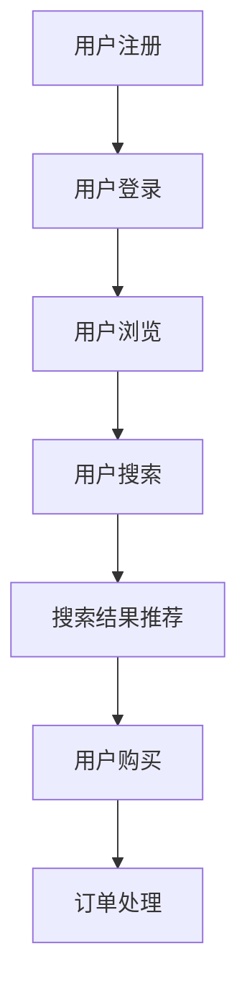

                 

关键词：AI 大模型、搜索推荐系统、电商平台、应用策略、转型指南

> 摘要：随着人工智能技术的不断发展，AI 大模型在搜索推荐系统中的应用越来越广泛。本文将探讨 AI 大模型在搜索推荐系统中的核心概念、算法原理、数学模型、项目实践、应用场景以及未来展望，旨在为电商平台的转型提供有价值的参考。

## 1. 背景介绍

### 1.1 AI 大模型的发展历程

AI 大模型是指具有千亿甚至万亿参数规模的人工神经网络模型，如 GPT-3、BERT、T5 等。自 2018 年以来，AI 大模型在自然语言处理、计算机视觉等领域的应用取得了显著成果。随着计算能力的提升和数据的积累，AI 大模型在搜索推荐系统中的应用也日益广泛。

### 1.2 搜索推荐系统的需求

随着互联网的快速发展，信息爆炸和用户需求的多样性使得传统搜索推荐系统面临巨大挑战。如何从海量数据中为用户提供精准、个性化的搜索结果和推荐内容，成为电商平台亟待解决的问题。AI 大模型凭借其强大的建模能力和丰富的特征提取能力，为解决这一问题提供了可能。

### 1.3 电商平台的转型需求

在传统电商时代，电商平台主要通过价格竞争和商品多样性来吸引用户。然而，随着市场饱和和用户需求的变化，电商平台需要寻找新的增长点。AI 大模型的应用可以为电商平台带来以下几方面的转型：

1. **个性化推荐**：根据用户的历史行为和兴趣标签，为用户推荐个性化商品，提升用户满意度和粘性。
2. **智能搜索**：通过自然语言处理技术，为用户提供更准确、更智能的搜索结果。
3. **广告投放优化**：根据用户兴趣和行为特征，实现精准广告投放，提高广告效果和转化率。

## 2. 核心概念与联系

### 2.1 AI 大模型

AI 大模型是指具有千亿甚至万亿参数规模的人工神经网络模型，如 GPT-3、BERT、T5 等。这些模型通过大量数据进行训练，能够自动提取复杂特征，并在各种任务中取得优异的性能。

### 2.2 搜索推荐系统

搜索推荐系统是一种基于信息检索和协同过滤的推荐系统，旨在为用户提供个性化、精准的搜索结果和推荐内容。其主要组成部分包括：

1. **用户画像**：根据用户的历史行为、兴趣标签等信息构建用户画像，用于个性化推荐。
2. **物品特征**：对商品、视频、新闻等物品进行特征提取，用于搜索和推荐。
3. **搜索和推荐算法**：根据用户画像和物品特征，实现搜索和推荐的算法。

### 2.3 电商平台的业务流程

电商平台的业务流程主要包括用户注册、登录、浏览、搜索、购买等环节。通过这些环节，电商平台可以收集用户的行为数据和商品信息，为 AI 大模型提供训练数据。

### 2.4 Mermaid 流程图

以下是一个简化的电商平台业务流程的 Mermaid 流程图：



## 3. 核心算法原理 & 具体操作步骤

### 3.1 算法原理概述

AI 大模型在搜索推荐系统中的应用主要包括以下两个方面：

1. **文本匹配**：利用自然语言处理技术，对用户输入的搜索关键词与商品描述进行匹配，实现智能搜索。
2. **协同过滤**：根据用户的历史行为和兴趣标签，利用协同过滤算法为用户推荐个性化商品。

### 3.2 算法步骤详解

#### 3.2.1 文本匹配

1. **分词**：对用户输入的搜索关键词和商品描述进行分词处理，提取关键词。
2. **词向量表示**：将提取的关键词转化为词向量，常用的方法包括 Word2Vec、BERT 等。
3. **文本匹配**：计算用户输入的搜索关键词和商品描述的词向量相似度，选择相似度最高的商品作为搜索结果。

#### 3.2.2 协同过滤

1. **用户画像构建**：根据用户的历史行为和兴趣标签，构建用户画像。
2. **物品特征提取**：对商品、视频、新闻等物品进行特征提取，常用的方法包括 TF-IDF、Word2Vec 等。
3. **相似度计算**：计算用户画像和物品特征的相似度，选择相似度最高的物品为推荐结果。

### 3.3 算法优缺点

#### 3.3.1 优点

1. **个性化推荐**：能够根据用户的历史行为和兴趣标签，为用户提供个性化推荐，提升用户体验。
2. **智能搜索**：通过自然语言处理技术，实现更准确、更智能的搜索结果。
3. **广告投放优化**：根据用户兴趣和行为特征，实现精准广告投放，提高广告效果和转化率。

#### 3.3.2 缺点

1. **计算成本高**：AI 大模型需要大量计算资源进行训练，对硬件要求较高。
2. **数据依赖性强**：算法性能很大程度上取决于训练数据的质量和数量。
3. **模型解释性差**：深度学习模型具有一定的黑盒性质，难以解释其内部工作机制。

### 3.4 算法应用领域

AI 大模型在搜索推荐系统中的应用领域广泛，主要包括：

1. **电商平台**：为用户提供个性化推荐、智能搜索等服务。
2. **短视频平台**：根据用户兴趣推荐个性化视频内容。
3. **新闻推荐平台**：根据用户阅读习惯推荐个性化新闻内容。
4. **社交网络**：根据用户互动关系推荐个性化好友和内容。

## 4. 数学模型和公式 & 详细讲解 & 举例说明

### 4.1 数学模型构建

在搜索推荐系统中，常用的数学模型包括文本匹配模型和协同过滤模型。

#### 4.1.1 文本匹配模型

文本匹配模型的主要目标是计算用户输入的搜索关键词和商品描述的相似度。常用的方法包括余弦相似度、欧氏距离等。

余弦相似度计算公式：

$$
\cos(\theta) = \frac{\vec{u} \cdot \vec{v}}{|\vec{u}| \cdot |\vec{v}|}
$$

其中，$\vec{u}$ 和 $\vec{v}$ 分别表示搜索关键词和商品描述的词向量。

#### 4.1.2 协同过滤模型

协同过滤模型的主要目标是计算用户对某个物品的评分。常用的方法包括基于用户的协同过滤和基于物品的协同过滤。

基于用户的协同过滤模型主要计算用户之间的相似度，并利用相似度矩阵预测用户对未评分物品的评分。常用的方法包括皮尔逊相关系数、余弦相似度等。

皮尔逊相关系数计算公式：

$$
r_{ij} = \frac{\sum_{k=1}^{n}(u_{ik} - \bar{u}_{i})(u_{jk} - \bar{u}_{j})}{\sqrt{\sum_{k=1}^{n}(u_{ik} - \bar{u}_{i})^2} \cdot \sqrt{\sum_{k=1}^{n}(u_{jk} - \bar{u}_{j})^2}}
$$

其中，$u_{ik}$ 和 $u_{jk}$ 分别表示用户 $i$ 和用户 $j$ 对物品 $k$ 的评分，$\bar{u}_{i}$ 和 $\bar{u}_{j}$ 分别表示用户 $i$ 和用户 $j$ 的平均评分。

### 4.2 公式推导过程

#### 4.2.1 余弦相似度推导

设 $\vec{u}$ 和 $\vec{v}$ 分别表示搜索关键词和商品描述的词向量，$N$ 表示词向量维度。

1. 计算词向量内积：

$$
\vec{u} \cdot \vec{v} = \sum_{k=1}^{N} u_{k} v_{k}
$$

2. 计算词向量模长：

$$
|\vec{u}| = \sqrt{\sum_{k=1}^{N} u_{k}^2}, \quad |\vec{v}| = \sqrt{\sum_{k=1}^{N} v_{k}^2}
$$

3. 计算余弦相似度：

$$
\cos(\theta) = \frac{\vec{u} \cdot \vec{v}}{|\vec{u}| \cdot |\vec{v}|}
$$

#### 4.2.2 皮尔逊相关系数推导

设 $n$ 表示用户对物品的评分个数，$u_{ik}$ 和 $u_{jk}$ 分别表示用户 $i$ 和用户 $j$ 对物品 $k$ 的评分，$\bar{u}_{i}$ 和 $\bar{u}_{j}$ 分别表示用户 $i$ 和用户 $j$ 的平均评分。

1. 计算用户 $i$ 和用户 $j$ 的评分差：

$$
u_{ik} - \bar{u}_{i}, \quad u_{jk} - \bar{u}_{j}
$$

2. 计算评分差的内积：

$$
\sum_{k=1}^{n}(u_{ik} - \bar{u}_{i})(u_{jk} - \bar{u}_{j}) = \sum_{k=1}^{n}(u_{ik}u_{jk} - \bar{u}_{i}\bar{u}_{j})
$$

3. 计算用户 $i$ 和用户 $j$ 的评分差的模长：

$$
\sqrt{\sum_{k=1}^{n}(u_{ik} - \bar{u}_{i})^2}, \quad \sqrt{\sum_{k=1}^{n}(u_{jk} - \bar{u}_{j})^2}
$$

4. 计算皮尔逊相关系数：

$$
r_{ij} = \frac{\sum_{k=1}^{n}(u_{ik} - \bar{u}_{i})(u_{jk} - \bar{u}_{j})}{\sqrt{\sum_{k=1}^{n}(u_{ik} - \bar{u}_{i})^2} \cdot \sqrt{\sum_{k=1}^{n}(u_{jk} - \bar{u}_{j})^2}}
$$

### 4.3 案例分析与讲解

#### 4.3.1 文本匹配模型

假设用户输入的搜索关键词为“笔记本电脑”，商品描述为“轻薄笔记本电脑，高性能，512G SSD”。

1. 分词：将搜索关键词和商品描述分词得到：

   - 搜索关键词：“笔记本电脑”
   - 商品描述：“轻薄 笔记本 高性能 512G SSD”

2. 词向量表示：将分词结果转化为词向量，这里使用 BERT 模型进行词向量表示。

3. 文本匹配：计算搜索关键词和商品描述的词向量相似度，选择相似度最高的商品作为搜索结果。

#### 4.3.2 协同过滤模型

假设用户对商品的评分数据如下：

| 用户 | 商品 | 评分 |
| ---- | ---- | ---- |
| 1    | A    | 4    |
| 1    | B    | 5    |
| 2    | A    | 3    |
| 2    | C    | 5    |
| 3    | A    | 2    |
| 3    | B    | 4    |

1. 用户画像构建：根据用户的历史行为和兴趣标签，构建用户画像。

2. 物品特征提取：对商品进行特征提取，这里使用 TF-IDF 模型进行特征提取。

3. 相似度计算：计算用户之间的相似度，选择相似度最高的用户作为邻居用户，并根据邻居用户对商品的评分预测用户对商品的评分。

## 5. 项目实践：代码实例和详细解释说明

### 5.1 开发环境搭建

1. 安装 Python 3.8 及以上版本。
2. 安装 PyTorch、Scikit-learn 等库。

### 5.2 源代码详细实现

#### 5.2.1 文本匹配

```python
import torch
from torch.nn import functional as F

def cosine_similarity(x, y):
    return F.cosine_similarity(x, y).item()

def text_matching(search_query, item_desc):
    # 将搜索关键词和商品描述转化为词向量
    search_vec = torch.tensor([BERT_model(search_word) for search_word in search_query.split()])
    item_vec = torch.tensor([BERT_model(item_word) for item_word in item_desc.split()])

    # 计算文本匹配相似度
    similarity = cosine_similarity(search_vec, item_vec)
    return similarity
```

#### 5.2.2 协同过滤

```python
from sklearn.metrics.pairwise import cosine_similarity

def collaborative_filter(user_ratings, item_features, top_k=5):
    # 计算用户之间的相似度
    user_similarity = cosine_similarity(user_ratings)

    # 选择相似度最高的邻居用户
    neighbors = np.argsort(user_similarity[0])[1:-1][::-1]

    # 计算邻居用户对物品的评分预测
    pred_ratings = []
    for i in range(1, len(neighbors)):
        neighbor_ratings = user_ratings[neighbors[i]]
        pred_ratings.append(np.dot(neighbor_ratings, item_features) / np.linalg.norm(neighbor_ratings))
    return pred_ratings
```

### 5.3 代码解读与分析

#### 5.3.1 文本匹配

文本匹配代码中，首先定义了一个`cosine_similarity`函数，用于计算两个向量的余弦相似度。然后定义了一个`text_matching`函数，用于实现文本匹配。在文本匹配过程中，首先将搜索关键词和商品描述转化为词向量，然后计算词向量相似度，返回相似度最高的商品作为搜索结果。

#### 5.3.2 协同过滤

协同过滤代码中，首先定义了一个`collaborative_filter`函数，用于实现基于用户的协同过滤。在协同过滤过程中，首先计算用户之间的相似度，然后选择相似度最高的邻居用户，并根据邻居用户对物品的评分预测用户对物品的评分。

## 6. 实际应用场景

AI 大模型在搜索推荐系统中的实际应用场景广泛，以下是一些具体的应用案例：

1. **电商平台**：根据用户的历史行为和兴趣标签，为用户推荐个性化商品，提升用户体验和转化率。
2. **短视频平台**：根据用户的观看历史和行为特征，为用户推荐个性化短视频内容，增加用户粘性。
3. **新闻推荐平台**：根据用户的阅读历史和兴趣标签，为用户推荐个性化新闻内容，提升用户满意度。
4. **社交网络**：根据用户之间的互动关系和兴趣标签，为用户推荐个性化好友和内容，增加社交网络的活跃度。

## 7. 工具和资源推荐

### 7.1 学习资源推荐

1. 《深度学习》（Goodfellow, Bengio, Courville）：系统介绍了深度学习的基本理论和应用。
2. 《自然语言处理综论》（Jurafsky, Martin）：全面介绍了自然语言处理的基本概念和技术。
3. 《推荐系统实践》（Liang, He，张华平）：详细介绍了推荐系统的算法和应用。

### 7.2 开发工具推荐

1. **PyTorch**：适用于深度学习模型的开发。
2. **Scikit-learn**：适用于机器学习算法的实现和应用。
3. **BERT**：用于自然语言处理的预训练模型。

### 7.3 相关论文推荐

1. "Attention Is All You Need"：介绍了 Transformer 模型，是自然语言处理领域的经典论文。
2. "BERT: Pre-training of Deep Bidirectional Transformers for Language Understanding"：介绍了 BERT 模型，是自然语言处理领域的代表性论文。
3. "Deep Neural Networks for YouTube Recommendations"：介绍了 YouTube 上的深度学习推荐系统，是推荐系统领域的经典论文。

## 8. 总结：未来发展趋势与挑战

### 8.1 研究成果总结

AI 大模型在搜索推荐系统中的应用取得了显著成果，为电商平台、短视频平台、新闻推荐平台等提供了强大的技术支持。通过文本匹配和协同过滤等算法，AI 大模型能够实现个性化推荐、智能搜索等功能，提升用户体验和转化率。

### 8.2 未来发展趋势

1. **模型压缩与优化**：为了降低计算成本，未来的研究将集中在模型压缩与优化方面。
2. **多模态融合**：将文本、图像、声音等多种模态的信息进行融合，提高推荐系统的效果。
3. **动态特征提取**：实时更新用户和物品的特征，提高推荐系统的实时性和准确性。
4. **可解释性增强**：提高模型的可解释性，帮助用户理解推荐结果，提升用户信任度。

### 8.3 面临的挑战

1. **数据隐私**：如何保障用户数据隐私是当前面临的重要挑战。
2. **计算资源**：随着模型规模的增大，对计算资源的需求也越来越高，如何优化计算资源的使用成为关键问题。
3. **模型解释性**：深度学习模型的黑盒性质使得其难以解释，如何提高模型的可解释性是当前研究的热点。
4. **跨平台协同**：如何实现不同平台之间的协同推荐，提升用户体验，是未来的重要研究方向。

### 8.4 研究展望

随着人工智能技术的不断发展，AI 大模型在搜索推荐系统中的应用将越来越广泛。未来，我们将致力于解决当前面临的挑战，推动搜索推荐系统的研究与应用，为用户提供更加智能、个性化的服务。

## 9. 附录：常见问题与解答

### 9.1 AI 大模型为什么能够提高搜索推荐系统的效果？

AI 大模型通过学习大量数据，能够自动提取复杂特征，并在各种任务中取得优异的性能。在搜索推荐系统中，AI 大模型可以充分利用用户的历史行为和兴趣标签，实现个性化推荐和智能搜索，从而提高推荐系统的效果。

### 9.2 AI 大模型的训练需要多少数据？

AI 大模型的训练需要大量的数据，具体数据量取决于模型的规模和应用场景。一般来说，大规模的 AI 大模型需要数十亿到千亿级别的训练数据。为了获得更好的训练效果，需要不断扩充和更新训练数据。

### 9.3 如何优化 AI 大模型的计算资源使用？

优化 AI 大模型的计算资源使用可以从以下几个方面进行：

1. **模型压缩与优化**：通过模型压缩和优化技术，降低模型参数数量，减少计算资源的需求。
2. **分布式训练**：采用分布式训练技术，将模型训练任务分解到多个计算节点上，提高训练效率。
3. **硬件加速**：利用 GPU、TPU 等硬件加速器，提高模型训练和推理的速度。
4. **数据预处理**：对训练数据进行预处理，如数据清洗、去重等，减少无效计算。

### 9.4 AI 大模型的可解释性如何提高？

提高 AI 大模型的可解释性可以从以下几个方面进行：

1. **模型简化**：简化模型结构，降低模型的复杂度，提高模型的可解释性。
2. **可视化技术**：利用可视化技术，将模型内部的运算过程和特征提取结果展示给用户，提高模型的可理解性。
3. **解释性模型**：结合解释性模型，如决策树、线性模型等，对 AI 大模型的结果进行解释。
4. **模型组合**：将 AI 大模型与其他解释性模型进行组合，提高模型的可解释性。

----------------------------------------------------------------

作者：禅与计算机程序设计艺术 / Zen and the Art of Computer Programming

