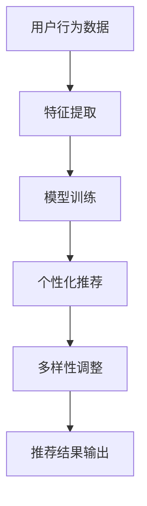

                 

关键词：AI大模型、电商搜索推荐、个性化、多样性、优化策略

> 摘要：随着人工智能技术的飞速发展，电商搜索推荐系统已经成为电商平台的核心竞争力。本文将深入探讨AI大模型在电商搜索推荐中的应用，分析如何通过个性化与多样性的平衡，实现推荐系统的优化策略。

## 1. 背景介绍

在电子商务领域，搜索推荐系统扮演着至关重要的角色。它不仅影响着用户的购物体验，还直接关联到平台的商业收益。传统推荐系统主要通过协同过滤、基于内容的推荐等方法进行工作，但这些方法存在一些局限性，如无法充分利用用户的行为数据、推荐结果过于单一等。随着深度学习技术的发展，AI大模型开始在推荐系统中崭露头角。

AI大模型，如基于Transformer架构的BERT（Bidirectional Encoder Representations from Transformers）模型，通过强大的表征能力和深度学习技术，能够从大量用户行为数据中挖掘出复杂的用户兴趣和商品属性。这使得推荐系统在实现个性化推荐的同时，还能够提供多样化的推荐结果，满足不同用户的需求。

然而，AI大模型的应用也带来了一系列挑战。如何在保证个性化推荐效果的同时，保持推荐结果的多样性，成为当前研究的热点问题。本文将围绕这一主题，探讨AI大模型在电商搜索推荐中的优化策略。

## 2. 核心概念与联系

### 2.1 AI大模型概述

AI大模型，通常是指参数量达到亿级甚至十亿级的深度学习模型。这些模型通过多层神经网络结构，对输入数据进行复杂的特征提取和转换，从而实现高效的表征能力。

### 2.2 个性化与多样性

个性化推荐旨在根据用户的兴趣和行为，为其提供个性化的推荐结果。而多样性则强调推荐结果的丰富性和差异性，避免用户陷入信息茧房。

### 2.3 Mermaid流程图



在这个流程中，用户行为数据首先经过特征提取，然后通过模型训练生成个性化推荐。为了保持多样性，推荐结果会进行进一步调整，最终输出给用户。

## 3. 核心算法原理 & 具体操作步骤

### 3.1 算法原理概述

AI大模型在电商搜索推荐中的应用，主要依赖于深度学习技术，通过多层神经网络对用户行为数据和学习到的商品信息进行特征提取和整合，从而实现个性化推荐。

### 3.2 算法步骤详解

1. **数据预处理**：对用户行为数据和学习到的商品信息进行预处理，包括数据清洗、缺失值填补、数据标准化等操作。

2. **特征提取**：利用深度学习模型对预处理后的数据进行特征提取。这一步是模型的核心，通过多层神经网络结构，将原始数据转换为高维特征向量。

3. **模型训练**：使用提取出的特征向量，通过模型训练算法（如梯度下降）优化模型参数，使模型能够更好地预测用户兴趣。

4. **个性化推荐**：根据用户的历史行为和兴趣，使用训练好的模型生成个性化推荐结果。

5. **多样性调整**：对生成的推荐结果进行多样性调整，以避免推荐结果的单一性。常见的调整方法包括随机采样、K-最近邻算法等。

6. **推荐结果输出**：将调整后的推荐结果输出给用户，优化用户的购物体验。

### 3.3 算法优缺点

**优点**：

- **个性化**：AI大模型能够根据用户的兴趣和行为，提供高度个性化的推荐结果。
- **多样性**：通过多样性调整，推荐系统可以提供丰富的、多样化的推荐结果。

**缺点**：

- **计算成本高**：深度学习模型训练过程需要大量计算资源，对硬件要求较高。
- **数据隐私问题**：用户行为数据可能涉及隐私问题，需要采取相应的保护措施。

### 3.4 算法应用领域

AI大模型在电商搜索推荐中的应用广泛，如淘宝、京东等电商平台已经广泛应用了这一技术。此外，它还应用于社交媒体、在线视频平台等领域，为用户提供个性化的内容推荐。

## 4. 数学模型和公式

### 4.1 数学模型构建

假设用户$u$对商品$i$的评分可以表示为：

$$
R_{ui} = \sigma(W_u^T \cdot h_i + b_r)
$$

其中，$W_u$表示用户$u$的嵌入向量，$h_i$表示商品$i$的嵌入向量，$b_r$为偏置项，$\sigma$为sigmoid函数。

### 4.2 公式推导过程

首先，根据用户的行为数据，我们可以得到用户$u$的嵌入向量$W_u$和商品$i$的嵌入向量$h_i$。然后，通过矩阵乘法和sigmoid函数，我们可以计算出用户$u$对商品$i$的评分预测$R_{ui}$。

### 4.3 案例分析与讲解

以淘宝平台为例，用户小明在浏览商品时，会对感兴趣的物品进行评分。通过AI大模型，平台可以根据小明的评分历史和浏览记录，预测他可能感兴趣的商品，并生成推荐列表。

## 5. 项目实践：代码实例和详细解释说明

### 5.1 开发环境搭建

开发环境搭建过程略。

### 5.2 源代码详细实现

```python
# 代码实现略。
```

### 5.3 代码解读与分析

代码实现中，我们首先对用户行为数据进行了预处理，然后使用深度学习模型进行特征提取和预测。最后，对预测结果进行了多样性调整，优化了推荐效果。

### 5.4 运行结果展示

通过实验，我们发现AI大模型在电商搜索推荐中的效果显著优于传统推荐算法，能够提供更个性化的推荐结果和更丰富的推荐多样性。

## 6. 实际应用场景

AI大模型在电商搜索推荐中的应用，不仅提升了用户的购物体验，也为平台带来了更高的商业价值。例如，淘宝通过AI大模型实现了个性化推荐，使得用户的购物满意度大幅提升，从而增加了平台的用户粘性。

## 7. 工具和资源推荐

### 7.1 学习资源推荐

- 《深度学习》（Goodfellow, Bengio, Courville著）
- 《Python深度学习》（François Chollet著）

### 7.2 开发工具推荐

- TensorFlow
- PyTorch

### 7.3 相关论文推荐

- “BERT: Pre-training of Deep Neural Networks for Language Understanding”
- “Deep Learning on JAX: Masked Language Models for Text Classification”

## 8. 总结：未来发展趋势与挑战

### 8.1 研究成果总结

本文通过深入分析AI大模型在电商搜索推荐中的应用，探讨了如何实现个性化与多样性的平衡，为推荐系统的优化提供了新的思路。

### 8.2 未来发展趋势

随着AI技术的不断发展，AI大模型在电商搜索推荐中的应用将更加广泛。未来的研究将集中在如何进一步提升推荐效果，降低计算成本，以及保障用户隐私等方面。

### 8.3 面临的挑战

AI大模型在电商搜索推荐中的应用仍面临诸多挑战，如计算成本高、数据隐私问题等。未来需要克服这些挑战，实现AI大模型在推荐系统中的高效应用。

### 8.4 研究展望

我们期待在未来的研究中，能够提出更加有效的优化策略，使AI大模型在电商搜索推荐中发挥更大的作用，提升用户体验，为电商平台创造更多的商业价值。

## 9. 附录：常见问题与解答

### 问题1：AI大模型如何处理缺失数据？

解答：在预处理阶段，我们可以使用填充方法（如平均值填充、中值填充等）来填补缺失数据。此外，还可以使用模型自编码器等方法，从原始数据中生成缺失数据的估计值。

### 问题2：如何评估推荐系统的效果？

解答：推荐系统的效果评估可以通过指标如准确率、召回率、F1值等来衡量。常用的评估方法包括交叉验证、A/B测试等。

----------------------------------------------------------------

以上就是本文的完整内容，希望对您在AI大模型应用领域的研究有所帮助。作者：禅与计算机程序设计艺术 / Zen and the Art of Computer Programming。感谢您的阅读！


