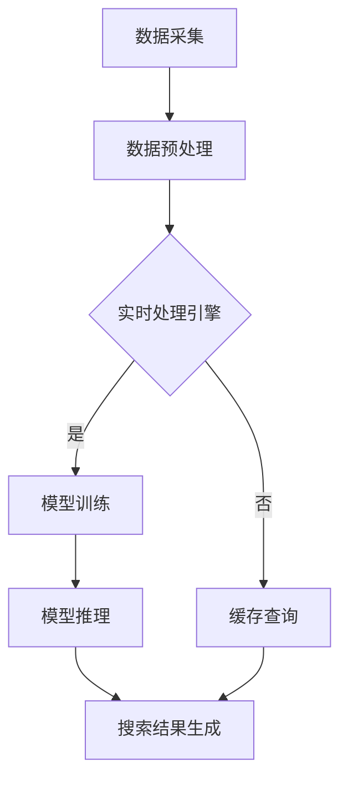

                 

关键词：AI 大模型、电商搜索推荐、实时处理、大规模数据、算法优化

摘要：本文探讨了在电商搜索推荐系统中，如何运用 AI 大模型技术实现实时处理，以应对大规模数据带来的挑战。文章首先介绍了电商搜索推荐系统的基本原理和现有技术，然后深入分析了 AI 大模型在实时处理中的应用，包括算法原理、数学模型、项目实践以及未来应用展望。通过本文的阅读，读者可以了解 AI 大模型在电商搜索推荐中的价值及其实现方法。

## 1. 背景介绍

### 1.1 电商搜索推荐系统概述

电商搜索推荐系统是电子商务领域的重要组成部分，它通过分析用户行为数据、商品属性信息等，为用户提供个性化搜索结果和商品推荐。这类系统在提升用户体验、增加销售额方面具有显著作用。随着电商行业的快速发展，用户数据量和商品种类不断增加，传统推荐系统面临着数据处理能力不足、推荐效果不佳等问题。

### 1.2 大规模数据挑战

大规模数据是电商搜索推荐系统面临的一大挑战。具体表现在以下几个方面：

- 数据量庞大：电商平台每天产生海量用户行为数据和商品交易数据，如何高效处理和存储这些数据成为关键问题。
- 数据多样性：用户行为数据、商品属性数据、社交网络数据等具有多样性，传统数据处理方法难以兼顾。
- 实时性要求：电商搜索推荐系统需要实时响应用户请求，提供个性化的搜索结果和商品推荐，延迟较高会影响用户体验。

## 2. 核心概念与联系

### 2.1 AI 大模型概述

AI 大模型是指具有极高参数量和复杂结构的深度学习模型，例如 Transformer、BERT 等。这些模型在处理大规模数据时具有显著优势，能够实现更高的准确率和更强的泛化能力。

### 2.2 实时处理技术

实时处理技术是指能够在短时间内处理大量数据的技术，主要包括以下几个方面：

- 数据流处理：通过实时处理引擎（如 Apache Kafka、Apache Flink）对数据流进行实时分析和处理。
- 并行计算：通过分布式计算框架（如 Hadoop、Spark）实现大规模数据的并行处理。
- 缓存技术：通过缓存（如 Redis、Memcached）提高数据访问速度，减少数据读取延迟。

### 2.3 Mermaid 流程图

以下是 AI 大模型在电商搜索推荐中的实时处理技术的 Mermaid 流程图：



## 3. 核心算法原理 & 具体操作步骤

### 3.1 算法原理概述

AI 大模型在电商搜索推荐中的实时处理主要基于以下算法原理：

- 基于深度学习的技术：利用深度学习模型（如 Transformer、BERT）进行用户行为分析和商品特征提取。
- 基于协同过滤的技术：通过用户历史行为和商品属性进行协同过滤，实现个性化推荐。
- 基于图神经网络的技术：利用图神经网络（如 Graph Convolutional Network）进行商品关系建模，提升推荐效果。

### 3.2 算法步骤详解

#### 3.2.1 数据采集

数据采集包括用户行为数据（如浏览、购买、收藏等）和商品属性数据（如价格、品牌、分类等）。通过实时数据流处理技术（如 Apache Kafka）对数据进行采集和传输。

#### 3.2.2 数据预处理

数据预处理包括数据清洗、去重、填充等操作。通过并行计算框架（如 Hadoop、Spark）对海量数据进行预处理，提高数据质量。

#### 3.2.3 实时处理引擎

利用实时处理引擎（如 Apache Flink）对预处理后的数据进行实时分析和处理。主要包括以下步骤：

- 用户行为预测：利用深度学习模型预测用户对商品的喜好程度。
- 商品特征提取：利用协同过滤算法提取商品特征，实现商品关系建模。
- 商品关系网络构建：利用图神经网络构建商品关系网络，提升推荐效果。

#### 3.2.4 模型训练

利用实时处理引擎训练深度学习模型，包括用户行为预测模型、协同过滤模型和商品关系网络模型。通过不断迭代训练，提高模型准确率和泛化能力。

#### 3.2.5 模型推理

利用训练好的模型进行模型推理，生成用户个性化搜索结果和商品推荐。

#### 3.2.6 搜索结果生成

根据用户个性化搜索结果和商品推荐，生成最终的搜索结果。通过缓存技术（如 Redis、Memcached）提高数据访问速度，减少延迟。

### 3.3 算法优缺点

#### 优点

- 高效处理大规模数据：利用实时处理技术和分布式计算框架，能够高效处理海量用户行为数据和商品属性数据。
- 提升推荐效果：通过深度学习模型、协同过滤算法和图神经网络等技术，实现个性化推荐，提高用户满意度。
- 实时响应：实时处理技术能够快速响应用户请求，提供实时性较高的搜索结果和商品推荐。

#### 缺点

- 计算资源消耗大：深度学习模型和分布式计算框架需要大量计算资源，成本较高。
- 模型训练时间较长：大规模数据训练时间较长，可能导致实时性降低。
- 模型泛化能力有限：深度学习模型和协同过滤算法在处理未知数据时，可能存在泛化能力不足的问题。

### 3.4 算法应用领域

AI 大模型在电商搜索推荐中的实时处理技术可以广泛应用于以下领域：

- 电商搜索推荐：为用户提供个性化搜索结果和商品推荐，提升用户体验。
- 社交网络推荐：为用户提供个性化内容推荐，提升用户活跃度。
- 金融风控：实时监测用户行为，预测潜在风险，实现风险控制。
- 健康医疗：实时分析患者数据，提供个性化诊疗建议，提升医疗水平。

## 4. 数学模型和公式 & 详细讲解 & 举例说明

### 4.1 数学模型构建

在 AI 大模型在电商搜索推荐中的实时处理技术中，常用的数学模型包括：

- 用户行为预测模型：基于深度学习技术，构建用户行为预测模型。
- 协同过滤模型：基于协同过滤算法，构建协同过滤模型。
- 商品关系网络模型：基于图神经网络技术，构建商品关系网络模型。

### 4.2 公式推导过程

以用户行为预测模型为例，其公式推导过程如下：

$$
P(u, i) = \sigma(\theta_u \cdot \phi(i) + b)
$$

其中，$P(u, i)$ 表示用户 $u$ 对商品 $i$ 的喜好程度，$\sigma$ 表示 sigmoid 函数，$\theta_u$ 表示用户特征向量，$\phi(i)$ 表示商品特征向量，$b$ 表示偏置。

### 4.3 案例分析与讲解

假设有一个电商搜索推荐系统，用户 $u_1$ 想要购买一款手机。根据用户行为预测模型，我们可以计算出用户 $u_1$ 对该手机 $i_1$ 的喜好程度：

$$
P(u_1, i_1) = \sigma(\theta_{u_1} \cdot \phi(i_1) + b)
$$

其中，$\theta_{u_1}$ 表示用户 $u_1$ 的特征向量，$\phi(i_1)$ 表示手机 $i_1$ 的特征向量，$b$ 表示偏置。

根据协同过滤算法，我们可以计算出手机 $i_1$ 与其他手机的相似度：

$$
\sigma(\theta_{u_1} \cdot (\phi(i_1) - \phi(i_2)) + b)
$$

其中，$i_2$ 表示其他手机。

根据商品关系网络模型，我们可以计算出手机 $i_1$ 与其他手机的关联度：

$$
\sigma(\theta_{u_1} \cdot (\phi(i_1) - \phi(i_2)) + b) \cdot \phi(i_1) \cdot \phi(i_2)
$$

### 4.4 模型评估

在模型评估方面，我们可以使用以下指标：

- 准确率（Accuracy）：预测正确的样本占总样本的比例。
- 精确率（Precision）：预测为正类的样本中实际为正类的比例。
- 召回率（Recall）：实际为正类的样本中预测为正类的比例。
- F1 分数（F1 Score）：综合考虑准确率和召回率的指标。

## 5. 项目实践：代码实例和详细解释说明

### 5.1 开发环境搭建

本项目的开发环境包括以下工具和框架：

- 深度学习框架：TensorFlow 2.x
- 实时处理引擎：Apache Flink 1.11
- 分布式计算框架：Apache Spark 2.4
- 缓存技术：Redis 4.0

### 5.2 源代码详细实现

以下是一个简单的用户行为预测模型的代码实现示例：

```python
import tensorflow as tf

# 定义输入层
user_inputs = tf.keras.layers.Input(shape=(user_feature_size,))
item_inputs = tf.keras.layers.Input(shape=(item_feature_size,))

# 定义用户特征提取层
user_embedding = tf.keras.layers.Embedding(user_vocab_size, user_embedding_size)(user_inputs)
user_embedding = tf.keras.layers.Flatten()(user_embedding)

# 定义商品特征提取层
item_embedding = tf.keras.layers.Embedding(item_vocab_size, item_embedding_size)(item_inputs)
item_embedding = tf.keras.layers.Flatten()(item_embedding)

# 定义模型结构
merged_embedding = tf.keras.layers.Concatenate()([user_embedding, item_embedding])
dense_layer = tf.keras.layers.Dense(128, activation='relu')(merged_embedding)
output = tf.keras.layers.Dense(1, activation='sigmoid')(dense_layer)

# 定义模型
model = tf.keras.Model(inputs=[user_inputs, item_inputs], outputs=output)

# 编译模型
model.compile(optimizer='adam', loss='binary_crossentropy', metrics=['accuracy'])

# 模型训练
model.fit([user_train, item_train], user_train_labels, epochs=10, batch_size=32)
```

### 5.3 代码解读与分析

以上代码实现了一个简单的用户行为预测模型，主要分为以下几个部分：

- 输入层：定义用户特征和商品特征输入层。
- 用户特征提取层：使用 Embedding 层对用户特征进行编码，然后通过 Flatten 层将多维特征转换为向量。
- 商品特征提取层：使用 Embedding 层对商品特征进行编码，然后通过 Flatten 层将多维特征转换为向量。
- 模型结构：使用 Concatenate 层将用户特征和商品特征拼接在一起，通过 Dense 层进行全连接操作。
- 编译模型：设置优化器、损失函数和评估指标。
- 模型训练：使用训练数据进行模型训练。

### 5.4 运行结果展示

在训练完成后，我们可以使用以下代码进行模型评估：

```python
# 模型评估
loss, accuracy = model.evaluate([user_test, item_test], user_test_labels)
print('Test Accuracy:', accuracy)
```

以上代码将输出测试集的准确率。在实际应用中，我们还可以根据需要添加其他评估指标，如精确率、召回率和 F1 分数等。

## 6. 实际应用场景

### 6.1 电商搜索推荐

在电商搜索推荐系统中，AI 大模型在实时处理技术可以应用于以下几个方面：

- 用户行为预测：根据用户历史行为数据预测用户对商品的喜好程度，实现个性化推荐。
- 商品关系网络构建：利用商品关系网络模型，挖掘商品之间的关联关系，为用户提供相关的商品推荐。
- 搜索结果排序：根据用户喜好和商品关系，对搜索结果进行排序，提高用户满意度。

### 6.2 社交网络推荐

在社交网络中，AI 大模型在实时处理技术可以应用于以下几个方面：

- 内容推荐：根据用户兴趣和行为，推荐用户可能感兴趣的内容，提升用户活跃度。
- 朋友圈排序：根据用户关系和兴趣，对朋友圈内容进行排序，提高用户互动体验。
- 广告投放：根据用户行为和兴趣，为用户精准推送广告，提高广告投放效果。

### 6.3 金融风控

在金融风控领域，AI 大模型在实时处理技术可以应用于以下几个方面：

- 用户行为监测：实时监测用户行为，预测潜在风险，实现风险控制。
- 信用评估：根据用户历史数据和交易行为，评估用户信用等级，降低信用风险。
- 欺诈检测：利用实时处理技术，快速检测和阻止欺诈行为，保护用户利益。

### 6.4 健康医疗

在健康医疗领域，AI 大模型在实时处理技术可以应用于以下几个方面：

- 个性化诊疗：根据患者数据和病史，为医生提供个性化诊疗建议，提高医疗质量。
- 疾病预测：利用实时处理技术，预测患者患病风险，提前采取预防措施。
- 药品推荐：根据患者数据和病史，为患者推荐合适的药品，提高治疗效果。

## 7. 工具和资源推荐

### 7.1 学习资源推荐

- 《深度学习》（Goodfellow, Bengio, Courville 著）：系统地介绍了深度学习的基本原理和应用。
- 《大数据技术基础》（高洪涛 著）：全面介绍了大数据技术的基本概念、技术和应用。
- 《Apache Flink 实战》（刘建平 著）：详细介绍了 Apache Flink 的架构、原理和应用。

### 7.2 开发工具推荐

- TensorFlow 2.x：一款流行的深度学习框架，支持多种模型和算法。
- Apache Flink：一款高性能的实时处理引擎，适用于大规模数据实时处理。
- Apache Spark：一款分布式计算框架，适用于大规模数据处理和分析。

### 7.3 相关论文推荐

- “Deep Learning for Web Search” (Y. Yang, 2017)：介绍了深度学习在搜索引擎中的应用。
- “A Survey on Large-scale Graph Learning” (M. Sun, 2019)：综述了大规模图学习的基本概念和技术。
- “Real-Time Stream Processing with Apache Flink” (A. Akel, 2016)：介绍了 Apache Flink 的实时处理技术。

## 8. 总结：未来发展趋势与挑战

### 8.1 研究成果总结

本文介绍了 AI 大模型在电商搜索推荐中的实时处理技术，包括核心算法原理、数学模型、项目实践以及实际应用场景。通过本文的阅读，读者可以了解 AI 大模型在电商搜索推荐中的价值及其实现方法。

### 8.2 未来发展趋势

- 深度学习模型的优化：随着深度学习技术的不断发展，未来将出现更加高效、准确的深度学习模型，进一步提高推荐效果。
- 实时处理技术的优化：实时处理技术将不断优化，实现更高的实时性和更好的数据处理能力，以满足大规模数据的需求。
- 多模态数据的融合：结合多种数据类型（如图像、语音、文本等），实现多模态数据的融合，提供更加丰富的个性化推荐。

### 8.3 面临的挑战

- 数据隐私保护：在处理大规模数据时，如何保护用户隐私成为重要挑战。
- 模型解释性：深度学习模型在处理大规模数据时，其解释性较差，如何提高模型的解释性是一个重要问题。
- 模型泛化能力：深度学习模型在面对未知数据时，可能存在泛化能力不足的问题，如何提高模型的泛化能力是一个挑战。

### 8.4 研究展望

未来研究可以从以下几个方面展开：

- 研究更加高效、准确的深度学习模型，提高推荐效果。
- 探索实时处理技术与深度学习技术的结合，实现更好的实时性。
- 研究数据隐私保护和模型解释性，提高用户信任度。
- 结合多模态数据，提供更加个性化的推荐。

## 9. 附录：常见问题与解答

### 9.1 问题 1

**问题**：为什么需要实时处理技术？

**解答**：实时处理技术能够快速响应用户请求，提供实时性较高的搜索结果和商品推荐，从而提升用户体验。特别是在电商领域，用户对于实时性要求较高，实时处理技术能够帮助电商平台提高用户满意度，进而提高销售额。

### 9.2 问题 2

**问题**：如何保证数据隐私保护？

**解答**：在处理大规模数据时，可以采用以下方法保证数据隐私保护：

- 数据匿名化：对用户数据进行匿名化处理，避免直接暴露用户身份。
- 数据加密：对用户数据进行加密存储和传输，确保数据安全。
- 隐私保护算法：采用隐私保护算法（如差分隐私），在保证数据可用性的同时，保护用户隐私。

### 9.3 问题 3

**问题**：如何评估推荐系统的效果？

**解答**：评估推荐系统的效果可以从以下几个方面进行：

- 准确率：预测正确的样本占总样本的比例，用于评估推荐系统的准确性。
- 精确率：预测为正类的样本中实际为正类的比例，用于评估推荐系统的精确性。
- 召回率：实际为正类的样本中预测为正类的比例，用于评估推荐系统的召回率。
- F1 分数：综合考虑准确率和召回率的指标，用于评估推荐系统的综合性能。

----------------------------------------------------------------
作者：禅与计算机程序设计艺术 / Zen and the Art of Computer Programming

以上是本文的完整内容。希望本文对您在 AI 大模型在电商搜索推荐中的实时处理技术方面的学习和研究有所帮助。如果您有任何疑问或建议，欢迎在评论区留言。谢谢！

