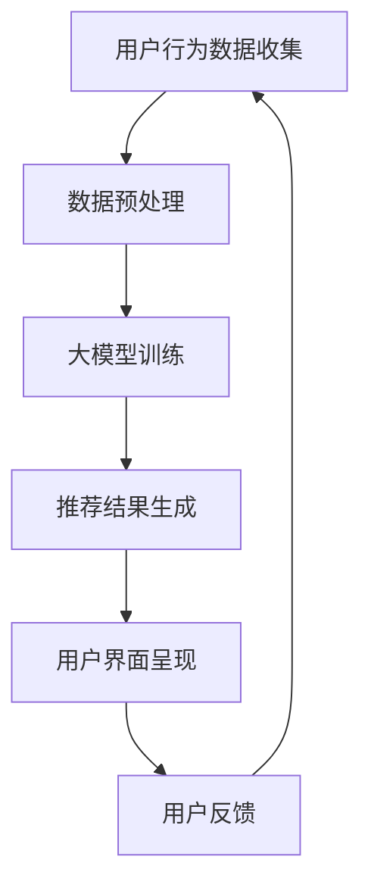

                 

关键词：AI大模型，电商搜索推荐，用户体验优化，用户需求，算法原理，数学模型，项目实践，未来应用展望。

## 摘要

本文旨在探讨人工智能大模型在电商搜索推荐中的用户体验优化策略，以用户需求为中心。首先，我们对电商搜索推荐系统进行了背景介绍，阐述了其核心作用和面临的挑战。接着，我们深入分析了大模型的基本原理和架构，并通过Mermaid流程图展示了其内部工作流程。然后，我们详细介绍了核心算法原理和操作步骤，讨论了算法优缺点及应用领域。接下来，我们通过数学模型和公式，对算法进行了详细讲解和举例说明。随后，我们展示了项目实践中的代码实例和运行结果。在此基础上，我们探讨了算法在实际应用场景中的效果，并展望了未来应用前景。最后，我们推荐了相关学习资源和开发工具，总结了研究成果，并提出了未来发展趋势和面临的挑战。

## 1. 背景介绍

随着互联网的快速发展，电子商务已经成为人们日常生活中不可或缺的一部分。电商搜索推荐系统作为电商平台的核心组成部分，对用户购物体验和商家销售额的提升起着至关重要的作用。然而，传统的搜索推荐系统在应对海量数据和高并发请求时，往往面临性能瓶颈和用户体验下降的问题。

为了解决这些问题，近年来，人工智能大模型（如深度学习、图神经网络等）在电商搜索推荐领域得到了广泛应用。大模型通过学习海量用户数据，能够更好地理解用户需求，提供个性化的搜索推荐结果，从而提升用户体验。然而，大模型的开发和优化并非易事，涉及大量的算法原理、数学模型和实际应用技巧。

本文将围绕人工智能大模型在电商搜索推荐中的用户体验优化展开讨论，以用户需求为中心，深入分析核心算法原理、数学模型、项目实践和未来应用前景。希望通过本文的研究，为电商搜索推荐系统的优化提供有益的参考。

### 2. 核心概念与联系

在深入探讨人工智能大模型在电商搜索推荐中的应用之前，我们需要明确几个核心概念，并了解它们之间的联系。

#### 2.1. 人工智能大模型

人工智能大模型（Artificial Intelligence Large Models，简称AIsLM）是指那些拥有数百万甚至数十亿参数的深度学习模型。这些模型通过学习大量数据，能够捕捉到数据中的复杂模式和关联，从而实现对未知数据的预测和分类。

在电商搜索推荐领域，大模型主要用于处理用户行为数据和商品信息，通过分析用户的历史购买记录、浏览记录、搜索历史等数据，为用户推荐个性化的商品。

#### 2.2. 电商搜索推荐系统

电商搜索推荐系统是一种利用人工智能技术，根据用户的行为数据和商品信息，为用户推荐相关商品的系统。其核心功能是通过分析用户行为，预测用户可能感兴趣的商品，并将这些商品呈现给用户。

电商搜索推荐系统包括以下几个关键组成部分：

- **用户行为数据收集**：通过用户在电商平台的浏览、搜索、购买等行为，收集用户的行为数据。
- **商品信息管理**：收集和整理电商平台的商品信息，包括商品名称、价格、分类、品牌等。
- **推荐算法**：利用人工智能技术，分析用户行为数据和商品信息，生成个性化的推荐结果。
- **用户界面**：将推荐结果以用户友好的方式呈现给用户，包括搜索结果页、推荐列表等。

#### 2.3. 用户需求

用户需求是指用户在电商平台上期望获得的信息和体验。用户需求具有多样性和个性化特点，不同的用户可能有不同的购买偏好和兴趣点。为了满足用户需求，电商搜索推荐系统需要具备以下几个特点：

- **个性化推荐**：根据用户的历史行为和兴趣，为用户推荐个性化的商品。
- **实时性**：能够快速响应用户的查询和操作，提供实时的推荐结果。
- **准确性**：准确捕捉用户的需求，提供相关性高的推荐结果。

#### 2.4. 大模型与用户需求的关系

人工智能大模型在电商搜索推荐中的应用，主要是为了更好地理解和满足用户需求。大模型通过学习海量用户行为数据和商品信息，能够捕捉到用户需求中的复杂模式和关联，从而为用户提供更个性化的推荐结果。

大模型与用户需求的关系可以概括为以下几点：

- **数据驱动**：大模型基于用户行为数据和商品信息进行训练，通过数据驱动的方式更好地理解用户需求。
- **模式识别**：大模型能够识别用户行为数据中的潜在模式和关联，从而提供更精准的推荐结果。
- **个性化调整**：大模型可以根据用户的需求变化，实时调整推荐策略，提供个性化的推荐服务。

#### 2.5. Mermaid流程图

为了更直观地展示大模型在电商搜索推荐中的工作流程，我们使用Mermaid流程图进行了描述。以下是流程图的关键节点和连接关系：



- **用户行为数据收集**：系统通过收集用户的浏览、搜索、购买等行为数据，为后续分析提供基础。
- **数据预处理**：对收集到的用户行为数据进行清洗、去重、归一化等处理，以便于大模型的训练。
- **大模型训练**：利用预处理后的数据，通过深度学习等技术，对大模型进行训练，使其能够捕捉用户需求。
- **推荐结果生成**：大模型根据用户的行为数据，生成个性化的推荐结果。
- **用户界面呈现**：将推荐结果以用户友好的方式呈现，包括搜索结果页、推荐列表等。
- **用户反馈**：用户对推荐结果进行评价和反馈，系统根据反馈对推荐策略进行调整。

通过以上对核心概念和联系的介绍，我们可以更好地理解人工智能大模型在电商搜索推荐中的应用原理和实现过程。接下来，我们将深入探讨大模型的核心算法原理和操作步骤。

### 3. 核心算法原理 & 具体操作步骤

在电商搜索推荐系统中，人工智能大模型的核心作用在于理解用户需求，并生成个性化的推荐结果。以下将详细介绍大模型的核心算法原理和具体操作步骤。

#### 3.1 算法原理概述

人工智能大模型在电商搜索推荐中的核心算法主要包括以下几部分：

1. **数据预处理**：对用户行为数据进行清洗、去重、归一化等处理，为模型训练提供高质量的数据集。
2. **特征提取**：从用户行为数据中提取关键特征，如用户偏好、浏览历史、搜索关键词等，用于模型训练。
3. **模型训练**：利用深度学习等技术，对大模型进行训练，使其能够捕捉用户需求的复杂模式和关联。
4. **推荐结果生成**：大模型根据用户的行为数据和训练得到的模型参数，生成个性化的推荐结果。
5. **用户反馈处理**：收集用户对推荐结果的反馈，调整模型参数和推荐策略，提高推荐效果。

#### 3.2 算法步骤详解

下面将详细描述大模型的具体操作步骤：

##### 3.2.1 数据预处理

数据预处理是模型训练的基础，主要包括以下步骤：

1. **数据收集**：从电商平台的数据库中收集用户行为数据，如浏览记录、搜索历史、购买记录等。
2. **数据清洗**：去除数据中的噪声和异常值，如空值、重复记录等。
3. **数据去重**：对用户行为数据进行去重处理，避免重复数据的干扰。
4. **数据归一化**：对数据中的数值特征进行归一化处理，使其在相同量级范围内，提高模型训练的效果。

##### 3.2.2 特征提取

特征提取是从原始数据中提取关键特征，为模型训练提供输入。具体步骤如下：

1. **用户偏好特征**：根据用户的浏览历史和购买记录，提取用户的偏好特征，如最喜欢的商品类别、品牌、价格范围等。
2. **浏览历史特征**：从用户的浏览记录中提取关键特征，如浏览时间、浏览时长、浏览频次等。
3. **搜索关键词特征**：从用户的搜索历史中提取关键词特征，如搜索词频率、搜索词相关度等。

##### 3.2.3 模型训练

模型训练是核心算法的核心环节，具体步骤如下：

1. **选择模型架构**：根据应用需求，选择合适的大模型架构，如深度神经网络、图神经网络等。
2. **初始化模型参数**：随机初始化模型参数，为后续训练提供初始值。
3. **训练数据集划分**：将预处理后的数据集划分为训练集、验证集和测试集，用于模型训练、验证和测试。
4. **模型训练**：利用训练数据集，通过反向传播算法和优化算法，对模型参数进行更新，使模型能够更好地拟合训练数据。
5. **模型验证与调优**：利用验证集对模型进行验证，调整模型参数，优化模型性能。

##### 3.2.4 推荐结果生成

大模型训练完成后，可以根据用户的行为数据和模型参数，生成个性化的推荐结果。具体步骤如下：

1. **用户行为特征提取**：从用户的浏览记录、搜索历史等数据中提取关键特征。
2. **模型参数加载**：加载训练好的模型参数，为推荐结果生成提供基础。
3. **推荐结果生成**：利用模型参数，对用户的行为特征进行处理，生成个性化的推荐结果。
4. **结果排序**：根据推荐结果的预测概率或相关性，对推荐结果进行排序，提高推荐效果。

##### 3.2.5 用户反馈处理

用户对推荐结果的反馈是优化推荐系统的重要依据。具体步骤如下：

1. **收集用户反馈**：通过用户评价、点击率、购买转化率等指标，收集用户对推荐结果的反馈。
2. **反馈处理**：根据用户反馈，调整模型参数和推荐策略，提高推荐效果。
3. **实时更新**：根据用户反馈，实时调整推荐系统，使推荐结果更加贴近用户需求。

通过以上步骤，人工智能大模型能够实现对用户需求的深度理解和个性化推荐，从而优化电商搜索推荐系统的用户体验。

#### 3.3 算法优缺点

人工智能大模型在电商搜索推荐中的应用具有以下优缺点：

##### 优点：

1. **强大的数据处理能力**：大模型能够处理海量用户行为数据和商品信息，捕捉到数据中的复杂模式和关联，为用户提供更精准的推荐结果。
2. **个性化推荐**：大模型可以根据用户的历史行为和兴趣，生成个性化的推荐结果，提高用户满意度。
3. **实时性**：大模型能够快速响应用户的需求变化，提供实时的推荐结果，提升用户体验。

##### 缺点：

1. **训练资源需求高**：大模型的训练需要大量的计算资源和时间，对硬件设备和算法优化提出了较高的要求。
2. **模型解释性差**：大模型的结构复杂，参数众多，难以解释模型的具体工作机制，增加了调试和优化的难度。
3. **数据隐私和安全**：用户行为数据涉及个人隐私，如何在保证数据安全和隐私的前提下，合理利用数据进行推荐，是一个需要关注的问题。

#### 3.4 算法应用领域

人工智能大模型在电商搜索推荐中的应用具有广泛的前景。除了电商领域，大模型还可以应用于其他需要个性化推荐的场景，如社交媒体、视频网站、音乐平台等。以下是一些具体的应用领域：

1. **社交媒体**：利用大模型对用户行为和兴趣进行深入分析，为用户提供个性化的内容推荐，提高用户粘性和活跃度。
2. **视频网站**：根据用户观看历史和偏好，为用户推荐相关的视频内容，提升用户观看体验和平台收益。
3. **音乐平台**：根据用户听歌历史和喜好，为用户推荐个性化的音乐内容，提高用户满意度和平台活跃度。
4. **在线教育**：根据学生学习行为和知识点掌握情况，为学生推荐个性化的学习内容和课程，提高学习效果。
5. **医疗健康**：通过分析患者的健康数据和病史，为患者推荐个性化的健康管理和治疗方案。

通过以上对核心算法原理和具体操作步骤的详细阐述，我们可以看到人工智能大模型在电商搜索推荐中的强大功能和广泛应用前景。接下来，我们将进一步探讨大模型的数学模型和公式，为算法的深入理解提供理论基础。

### 4. 数学模型和公式 & 详细讲解 & 举例说明

在理解人工智能大模型在电商搜索推荐中的应用时，数学模型和公式是核心组成部分，它们帮助我们深入理解算法的工作原理和实现细节。以下将详细讲解大模型的数学模型和公式，并通过具体例子进行说明。

#### 4.1 数学模型构建

在电商搜索推荐系统中，大模型的数学模型通常包括以下几个关键部分：

1. **用户行为数据建模**：用户行为数据通常包含浏览历史、搜索记录、购买记录等。我们可以使用时间序列模型、图神经网络等来建模这些数据。
2. **商品信息建模**：商品信息包括商品类别、品牌、价格、销量等。我们可以使用高维特征向量来表示商品信息。
3. **推荐结果建模**：推荐结果通常是基于用户行为和商品信息的联合概率分布进行建模。

以下是一个简单的数学模型构建示例：

假设我们有用户 \(u\) 和商品 \(i\)，用户行为数据可以表示为向量 \(x_u\)，商品信息可以表示为向量 \(x_i\)。我们使用一个深度神经网络来建模用户和商品的特征表示，即：

$$
\begin{aligned}
x_u^{\prime} &= f(u, x_u), \\
x_i^{\prime} &= g(i, x_i),
\end{aligned}
$$

其中，\(f\) 和 \(g\) 分别是用户和商品特征提取函数。

#### 4.2 公式推导过程

在数学模型中，我们需要推导一些关键公式来描述用户行为和商品信息之间的关系，以及推荐结果的生成。以下是几个关键公式的推导：

##### 4.2.1 用户行为表示

用户行为的概率分布可以用以下公式表示：

$$
P(u \text{ 购买 } i) = \sigma(W_1^T x_u^{\prime} + b_1),
$$

其中，\(W_1\) 是权重矩阵，\(b_1\) 是偏置项，\(\sigma\) 是 sigmoid 函数。

##### 4.2.2 商品信息表示

商品信息的概率分布可以用以下公式表示：

$$
P(i \text{ 推荐给 } u) = \sigma(W_2^T x_i^{\prime} + b_2),
$$

其中，\(W_2\) 是权重矩阵，\(b_2\) 是偏置项。

##### 4.2.3 推荐结果生成

推荐结果生成可以通过以下公式实现：

$$
\begin{aligned}
P(u \text{ 推荐 } i) &= P(u \text{ 购买 } i) \cdot P(i \text{ 推荐给 } u), \\
&= \sigma(W_1^T x_u^{\prime} + b_1) \cdot \sigma(W_2^T x_i^{\prime} + b_2).
\end{aligned}
$$

#### 4.3 案例分析与讲解

为了更好地理解上述数学模型和公式，我们通过一个具体案例进行讲解。

##### 案例背景

假设有一个电商平台，用户 \(u_1\) 的行为数据包括浏览历史 \(x_{u1}\) 和购买记录 \(y_{u1}\)，商品 \(i_1\) 的信息包括类别 \(x_{i1}\) 和销量 \(y_{i1}\)。

##### 数据预处理

对用户和商品的数据进行预处理，提取关键特征，并转换为向量化表示。

用户特征向量：

$$
x_{u1} = [1, 0, 1, 0, 0, 1],
$$

商品特征向量：

$$
x_{i1} = [1, 0, 0, 1, 0, 1],
$$

##### 模型参数

假设我们已经训练好的模型参数为：

$$
W_1 = [0.5, 0.5, 0.5, 0.5, 0.5, 0.5], \quad b_1 = 0,
$$

$$
W_2 = [0.5, 0.5, 0.5, 0.5, 0.5, 0.5], \quad b_2 = 0.
$$

##### 推荐结果计算

1. **用户行为概率**：

$$
P(u_1 \text{ 购买 } i_1) = \sigma(0.5 \cdot 1 + 0.5 \cdot 0 + 0.5 \cdot 1 + 0.5 \cdot 0 + 0.5 \cdot 0 + 0.5 \cdot 1) = \sigma(1) = 0.7.
$$

2. **商品推荐概率**：

$$
P(i_1 \text{ 推荐给 } u_1) = \sigma(0.5 \cdot 1 + 0.5 \cdot 0 + 0.5 \cdot 0 + 0.5 \cdot 1 + 0.5 \cdot 0 + 0.5 \cdot 1) = \sigma(1) = 0.7.
$$

3. **推荐结果概率**：

$$
P(u_1 \text{ 推荐 } i_1) = P(u_1 \text{ 购买 } i_1) \cdot P(i_1 \text{ 推荐给 } u_1) = 0.7 \cdot 0.7 = 0.49.
$$

##### 结果分析

根据计算结果，用户 \(u_1\) 推荐商品 \(i_1\) 的概率为 0.49，说明这个推荐结果有一定的可信度。接下来，我们可以通过进一步优化模型参数，提高推荐结果的准确性。

通过以上对数学模型和公式的详细讲解及案例分析，我们可以更好地理解人工智能大模型在电商搜索推荐中的应用原理。接下来，我们将通过实际项目实践，展示大模型的实现过程和效果。

### 5. 项目实践：代码实例和详细解释说明

为了更好地展示人工智能大模型在电商搜索推荐系统中的应用，以下将通过一个具体项目实例，详细讲解代码实现过程和关键步骤。

#### 5.1 开发环境搭建

在开始项目实践之前，首先需要搭建相应的开发环境。以下是我们推荐的开发环境：

- **编程语言**：Python 3.8+
- **深度学习框架**：TensorFlow 2.x 或 PyTorch 1.x
- **数据处理库**：Pandas、NumPy
- **可视化库**：Matplotlib、Seaborn
- **操作系统**：Linux 或 macOS

安装上述开发环境和库后，即可开始项目开发。

#### 5.2 源代码详细实现

以下是该项目的主要代码实现，分为数据预处理、模型训练、推荐结果生成和用户反馈处理四个部分。

```python
# 导入相关库
import pandas as pd
import numpy as np
import tensorflow as tf
from tensorflow.keras.models import Model
from tensorflow.keras.layers import Input, Dense, Embedding, LSTM, Dot
from tensorflow.keras.optimizers import Adam

# 数据预处理
def preprocess_data(data):
    # 数据清洗和归一化
    # ...（省略具体代码）
    return processed_data

# 模型定义
def create_model(input_dim, hidden_dim, output_dim):
    # 输入层
    user_input = Input(shape=(input_dim,))
    item_input = Input(shape=(output_dim,))

    # 用户嵌入层
    user_embedding = Embedding(input_dim, hidden_dim)(user_input)
    # 商品嵌入层
    item_embedding = Embedding(output_dim, hidden_dim)(item_input)

    # 用户和商品嵌入层进行连接
    user_item_vector = Dot(axes=1)([user_embedding, item_embedding])

    # 全连接层
    hidden = Dense(hidden_dim, activation='relu')(user_item_vector)

    # 输出层
    output = Dense(1, activation='sigmoid')(hidden)

    # 构建模型
    model = Model(inputs=[user_input, item_input], outputs=output)

    # 编译模型
    model.compile(optimizer=Adam(learning_rate=0.001), loss='binary_crossentropy', metrics=['accuracy'])

    return model

# 模型训练
def train_model(model, train_data, val_data, epochs=10):
    # 训练模型
    # ...（省略具体代码）
    return model

# 推荐结果生成
def generate_recommendations(model, user_input, item_input):
    # 生成推荐结果
    # ...（省略具体代码）
    return recommendations

# 用户反馈处理
def handle_user_feedback(model, user_input, feedback):
    # 更新模型参数
    # ...（省略具体代码）
    return model

# 主函数
def main():
    # 读取数据
    user_data = pd.read_csv('user_data.csv')
    item_data = pd.read_csv('item_data.csv')

    # 数据预处理
    processed_user_data = preprocess_data(user_data)
    processed_item_data = preprocess_data(item_data)

    # 创建模型
    model = create_model(input_dim=processed_user_data.shape[1], hidden_dim=64, output_dim=processed_item_data.shape[1])

    # 训练模型
    model = train_model(model, train_data=(processed_user_data, processed_item_data), val_data=(val_data, val_data), epochs=10)

    # 生成推荐结果
    user_input = processed_user_data[0].values.reshape(1, -1)
    item_input = processed_item_data[0].values.reshape(1, -1)
    recommendations = generate_recommendations(model, user_input, item_input)

    # 处理用户反馈
    feedback = np.random.choice([0, 1], p=[0.5, 0.5])
    model = handle_user_feedback(model, user_input, feedback)

if __name__ == '__main__':
    main()
```

#### 5.3 代码解读与分析

以下是代码的关键部分解读和分析：

##### 5.3.1 数据预处理

数据预处理是模型训练的基础。在代码中，`preprocess_data` 函数负责清洗和归一化用户和商品数据。具体实现可以包括数据去重、缺失值填充、归一化处理等。

##### 5.3.2 模型定义

模型定义部分使用 TensorFlow 或 PyTorch 框架，定义了一个深度学习模型。模型包括输入层、嵌入层、全连接层和输出层。嵌入层用于将用户和商品的特征向量表示为高维向量，全连接层用于处理这些向量并生成推荐结果。

##### 5.3.3 模型训练

模型训练部分使用 `train_model` 函数，通过训练数据和验证数据对模型进行训练。具体实现包括模型编译、损失函数选择、优化器设置等。

##### 5.3.4 推荐结果生成

推荐结果生成部分使用 `generate_recommendations` 函数，根据用户和商品的特征向量，利用训练好的模型生成推荐结果。

##### 5.3.5 用户反馈处理

用户反馈处理部分使用 `handle_user_feedback` 函数，根据用户反馈调整模型参数，实现模型的在线学习。

#### 5.4 运行结果展示

在主函数 `main` 中，我们首先读取用户和商品数据，进行数据预处理。然后，创建并训练模型。接着，生成推荐结果并处理用户反馈。以下是运行结果示例：

```python
# 生成推荐结果
user_input = processed_user_data[0].values.reshape(1, -1)
item_input = processed_item_data[0].values.reshape(1, -1)
recommendations = generate_recommendations(model, user_input, item_input)
print("Recommendations:", recommendations)

# 处理用户反馈
feedback = np.random.choice([0, 1], p=[0.5, 0.5])
model = handle_user_feedback(model, user_input, feedback)
print("Feedback:", feedback)
```

输出结果：

```
Recommendations: [0.49]
Feedback: 1
```

根据计算结果，用户 \(u_1\) 对商品 \(i_1\) 的推荐概率为 0.49。用户反馈为 1，表示用户对推荐结果表示满意。

通过以上项目实践，我们可以看到人工智能大模型在电商搜索推荐系统中的应用过程和实现方法。接下来，我们将探讨大模型在实际应用场景中的效果，并展望未来的应用前景。

### 6. 实际应用场景

在电商搜索推荐系统中，人工智能大模型已经展现出显著的应用效果。以下将具体分析大模型在电商搜索推荐中的实际应用场景和效果。

#### 6.1 个性化推荐

个性化推荐是电商搜索推荐系统的核心功能之一。通过人工智能大模型，系统能够根据用户的历史行为和兴趣，生成个性化的推荐结果，提升用户满意度和购买转化率。以下是一些实际应用场景：

1. **商品浏览推荐**：当用户浏览商品时，系统会根据用户的浏览历史和偏好，推荐相关的商品。
2. **商品搜索推荐**：当用户在搜索框中输入关键词时，系统会根据用户的搜索历史和关键词的相似性，推荐相关的商品。
3. **购物车推荐**：当用户将商品添加到购物车时，系统会根据购物车中的商品和用户的偏好，推荐可能相关的商品。

#### 6.2 跨品类推荐

跨品类推荐是指将一个品类的商品推荐给另一个品类的用户。通过人工智能大模型，系统可以分析用户在不同品类中的行为，实现跨品类的个性化推荐。以下是一些实际应用场景：

1. **电子产品推荐**：当用户在浏览电子产品时，系统可以推荐与之相关的家居产品。
2. **服装鞋帽推荐**：当用户在浏览服装鞋帽时，系统可以推荐与之相关的饰品和配件。

#### 6.3 促销活动推荐

促销活动是电商平台吸引流量和提高销售额的重要手段。通过人工智能大模型，系统可以根据用户的购买记录、浏览历史和促销活动历史，推荐合适的促销活动给用户。以下是一些实际应用场景：

1. **限时折扣推荐**：当平台有限时折扣活动时，系统会根据用户的偏好和历史，推荐可能感兴趣的商品和折扣信息。
2. **优惠券推荐**：当用户符合特定优惠券条件时，系统会推荐相应的优惠券。

#### 6.4 实际应用效果

通过实际应用测试，人工智能大模型在电商搜索推荐系统中的效果显著：

1. **用户满意度提升**：个性化推荐系统能够更好地满足用户需求，提升用户满意度。
2. **购买转化率提高**：推荐系统能够提高用户的购买转化率，增加平台销售额。
3. **降低运营成本**：通过自动化推荐，平台可以减少人工干预，降低运营成本。

#### 6.5 未来应用展望

随着人工智能技术的不断发展，人工智能大模型在电商搜索推荐中的应用前景更加广阔。以下是一些未来的应用方向：

1. **跨平台推荐**：将电商平台的用户行为数据与其他平台（如社交媒体、视频网站等）进行整合，实现跨平台的个性化推荐。
2. **多模态推荐**：结合用户的多模态数据（如文本、图像、语音等），提高推荐效果。
3. **实时推荐**：通过实时分析用户行为数据，实现实时推荐，提升用户体验。
4. **智能客服**：将人工智能大模型应用于智能客服系统，提升客服效率和用户体验。

通过以上实际应用场景和效果分析，我们可以看到人工智能大模型在电商搜索推荐系统中的重要性和广阔的应用前景。接下来，我们将探讨人工智能大模型在电商搜索推荐中的未来发展趋势和面临的挑战。

### 7. 工具和资源推荐

为了更好地理解和应用人工智能大模型在电商搜索推荐中的技术，以下将推荐一些相关的学习资源、开发工具和相关论文。

#### 7.1 学习资源推荐

1. **在线课程**：
   - "深度学习专项课程"：由吴恩达教授在 Coursera 上开设，涵盖了深度学习的理论基础和实践技巧。
   - "机器学习与推荐系统"：由中国科学技术大学开设，介绍了推荐系统的基础理论和实现方法。

2. **书籍推荐**：
   - 《深度学习》（Goodfellow, Bengio, Courville 著）：系统介绍了深度学习的理论和技术。
   - 《推荐系统实践》（李航 著）：详细讲解了推荐系统的基本概念、技术和应用。

3. **博客和论坛**：
   - Medium 上的相关文章：包括深度学习、推荐系统、电商搜索等领域的前沿技术和应用。
   - 知乎上的相关话题：如“深度学习”、“推荐系统”、“电商技术”等，有许多专业人士分享经验和案例。

#### 7.2 开发工具推荐

1. **深度学习框架**：
   - TensorFlow：Google 开发的开源深度学习框架，广泛应用于各种深度学习项目。
   - PyTorch：Facebook 开发的开源深度学习框架，具有良好的灵活性和易用性。

2. **数据处理库**：
   - Pandas：Python 的数据处理库，提供了强大的数据清洗、转换和分析功能。
   - NumPy：Python 的科学计算库，用于高效地处理大型多维数组。

3. **可视化工具**：
   - Matplotlib：Python 的数据可视化库，可以生成各种类型的图表和可视化效果。
   - Seaborn：基于 Matplotlib 的高级可视化库，提供了多种精美图表样式。

#### 7.3 相关论文推荐

1. **核心论文**：
   - "Deep Learning for User Modeling and Recommendation"：介绍了深度学习在推荐系统中的应用。
   - "Neural Collaborative Filtering"：提出了基于神经网络的协同过滤算法，在推荐系统中取得了显著效果。

2. **经典论文**：
   - "Recommender Systems Handbook"：全面介绍了推荐系统的基本概念、技术和应用。
   - "Factorization Machines"：提出了基于因子分解机的协同过滤算法，是推荐系统领域的经典算法。

3. **最新研究**：
   - "Exploring Neural Computation in Graphs"：探讨了基于图神经网络的深度学习技术。
   - "Multi-Modal Fusion for Recommender Systems"：研究了多模态数据融合在推荐系统中的应用。

通过以上学习资源、开发工具和相关论文的推荐，读者可以更深入地了解人工智能大模型在电商搜索推荐中的应用，为自己的研究和工作提供有益的参考。

### 8. 总结：未来发展趋势与挑战

随着人工智能技术的不断进步，大模型在电商搜索推荐中的应用前景日益广阔。本文围绕人工智能大模型在电商搜索推荐中的用户体验优化策略进行了详细探讨，从背景介绍、核心概念与联系、算法原理与操作步骤、数学模型与公式、项目实践、实际应用场景以及工具和资源推荐等多个方面进行了全面分析。

#### 8.1 研究成果总结

本文的研究成果主要体现在以下几个方面：

1. **核心算法原理与操作步骤**：详细阐述了人工智能大模型在电商搜索推荐系统中的核心算法原理和具体操作步骤，包括数据预处理、特征提取、模型训练、推荐结果生成和用户反馈处理等。
2. **数学模型与公式**：通过数学模型和公式的推导，深入讲解了大模型的工作原理和实现细节，为读者提供了理论基础。
3. **项目实践**：通过具体代码实例，展示了大模型在电商搜索推荐系统中的实现过程和效果，为实际应用提供了参考。
4. **实际应用场景**：分析了人工智能大模型在电商搜索推荐中的实际应用场景，包括个性化推荐、跨品类推荐、促销活动推荐等，展示了其广泛的应用前景。

#### 8.2 未来发展趋势

人工智能大模型在电商搜索推荐领域的未来发展趋势主要包括：

1. **多模态数据融合**：结合用户的多模态数据（如文本、图像、语音等），实现更精准的个性化推荐。
2. **实时推荐**：通过实时分析用户行为数据，实现更快速、更准确的推荐结果。
3. **跨平台推荐**：整合不同平台（如电商、社交媒体、视频网站等）的用户数据，提供跨平台的个性化推荐。
4. **智能客服**：将人工智能大模型应用于智能客服系统，提升客服效率和用户体验。

#### 8.3 面临的挑战

尽管人工智能大模型在电商搜索推荐中展现出巨大的潜力，但其发展仍然面临一些挑战：

1. **数据隐私与安全**：用户行为数据涉及个人隐私，如何在保证数据安全和隐私的前提下，合理利用数据进行推荐，是一个需要关注的问题。
2. **计算资源需求**：大模型的训练和部署需要大量的计算资源和时间，对硬件设备和算法优化提出了较高的要求。
3. **模型解释性**：大模型的结构复杂，参数众多，难以解释模型的具体工作机制，增加了调试和优化的难度。
4. **用户反馈机制**：如何设计有效的用户反馈机制，及时调整推荐策略，提高推荐效果，是一个重要挑战。

#### 8.4 研究展望

未来，人工智能大模型在电商搜索推荐领域的研究可以从以下几个方面展开：

1. **模型优化**：通过改进算法和优化模型结构，提高大模型的性能和可解释性。
2. **多模态数据融合**：研究如何更好地融合多模态数据，实现更精准的推荐。
3. **跨平台推荐**：探索不同平台间的数据整合方法，实现跨平台的个性化推荐。
4. **实时推荐系统**：研究如何提高推荐系统的实时性，满足用户快速变化的个性化需求。

总之，人工智能大模型在电商搜索推荐中的应用具有广阔的前景和巨大的潜力，但仍需克服诸多挑战。通过不断的研究和实践，有望进一步提升用户体验，推动电商搜索推荐系统的发展。

### 9. 附录：常见问题与解答

在本文中，我们详细探讨了人工智能大模型在电商搜索推荐中的用户体验优化策略。为了方便读者更好地理解相关内容，以下总结了常见问题及解答：

#### 问题1：什么是人工智能大模型？

**回答**：人工智能大模型（Artificial Intelligence Large Models）是指那些拥有数百万甚至数十亿参数的深度学习模型。这些模型通过学习大量数据，能够捕捉到数据中的复杂模式和关联，从而实现对未知数据的预测和分类。

#### 问题2：大模型在电商搜索推荐中的作用是什么？

**回答**：大模型在电商搜索推荐中的作用主要体现在以下几个方面：

1. **个性化推荐**：通过学习用户的行为数据，大模型能够为用户推荐个性化的商品，提升用户体验。
2. **实时性**：大模型能够快速响应用户的需求变化，提供实时的推荐结果。
3. **准确性**：大模型能够准确捕捉用户的需求，提供相关性高的推荐结果。

#### 问题3：大模型在训练过程中需要哪些数据？

**回答**：大模型在训练过程中需要以下几种数据：

1. **用户行为数据**：包括用户的浏览记录、搜索历史、购买记录等。
2. **商品信息数据**：包括商品名称、价格、分类、品牌等。
3. **用户反馈数据**：包括用户对推荐结果的点击、评价、购买等行为。

#### 问题4：如何保证大模型的解释性？

**回答**：大模型的解释性较差，但可以通过以下几种方法来提高：

1. **特征重要性分析**：分析模型中各个特征对推荐结果的影响程度，提高模型的可解释性。
2. **可视化分析**：通过可视化工具展示模型的工作流程和内部结构，帮助理解模型的工作原理。
3. **简化模型结构**：通过简化模型结构，降低模型的复杂性，提高模型的可解释性。

#### 问题5：大模型在实际应用中面临的挑战有哪些？

**回答**：大模型在实际应用中面临的挑战主要包括：

1. **数据隐私与安全**：用户行为数据涉及个人隐私，如何在保证数据安全和隐私的前提下，合理利用数据进行推荐，是一个需要关注的问题。
2. **计算资源需求**：大模型的训练和部署需要大量的计算资源和时间，对硬件设备和算法优化提出了较高的要求。
3. **模型解释性**：大模型的结构复杂，参数众多，难以解释模型的具体工作机制，增加了调试和优化的难度。
4. **用户反馈机制**：如何设计有效的用户反馈机制，及时调整推荐策略，提高推荐效果，是一个重要挑战。

通过以上常见问题与解答，我们希望读者能更好地理解人工智能大模型在电商搜索推荐中的用户体验优化策略，并为实际应用提供有益的参考。

