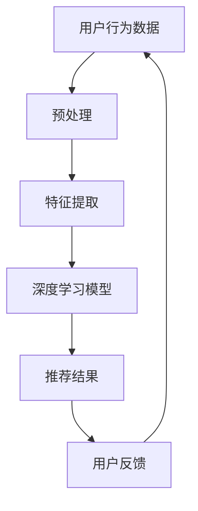
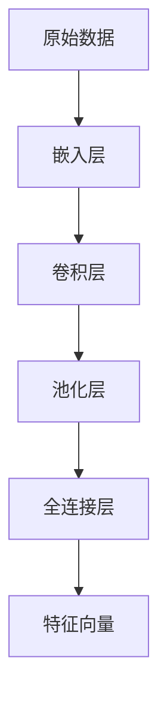

                 

关键词：AI 大模型、电商搜索推荐、用户行为分析、需求理解、购买偏好、深度学习、机器学习、推荐系统

> 摘要：本文将深入探讨 AI 大模型在电商搜索推荐中的用户行为分析，重点分析如何通过理解用户需求与购买偏好，提升电商平台的用户体验和销售额。文章将首先介绍相关背景知识，随后详细阐述核心算法原理，数学模型与公式，并通过项目实践和实际应用场景，展示大模型在电商搜索推荐中的具体应用和未来发展趋势。

## 1. 背景介绍

随着互联网的飞速发展，电子商务已经成为人们日常生活中不可或缺的一部分。电商平台的核心竞争力在于能否提供个性化的搜索推荐服务，以满足用户多样化的需求。然而，实现这一目标并非易事。用户行为分析是电商搜索推荐系统的重要组成部分，通过对用户行为数据的深入分析，可以挖掘出用户的兴趣和偏好，进而实现精准推荐。

近年来，人工智能技术的快速发展，特别是深度学习技术的突破，为用户行为分析带来了新的机遇。AI 大模型具有强大的数据分析和学习能力，能够处理海量用户行为数据，提取出潜在的用户需求与购买偏好。本文将围绕这一主题，探讨如何利用 AI 大模型在电商搜索推荐中进行用户行为分析，提升用户体验和销售额。

## 2. 核心概念与联系

为了更好地理解 AI 大模型在电商搜索推荐中的用户行为分析，我们首先需要了解以下几个核心概念：

### 2.1 用户行为分析

用户行为分析是指通过对用户在电商平台上的一系列活动数据进行分析，挖掘出用户的兴趣、需求和购买行为。这些数据包括用户的浏览记录、搜索历史、购物车行为、购买记录等。

### 2.2 深度学习

深度学习是一种基于人工神经网络的机器学习技术，通过多层神经网络对数据进行特征提取和建模。深度学习在图像识别、语音识别、自然语言处理等领域取得了显著成果，为用户行为分析提供了强有力的工具。

### 2.3 推荐系统

推荐系统是一种基于数据挖掘和机器学习技术的应用，旨在为用户提供个性化的推荐服务。推荐系统广泛应用于电商、视频、新闻等领域，通过对用户行为数据的分析，实现精准推荐。

### 2.4 AI 大模型

AI 大模型是指具有大规模参数、强大计算能力和高度自适应能力的深度学习模型。这些模型通常由数十亿甚至数万亿个参数组成，能够处理海量数据，并从数据中自动学习出复杂的模式。

下面是一个使用 Mermaid 流程图表示 AI 大模型在电商搜索推荐中的核心概念和联系：



## 3. 核心算法原理 & 具体操作步骤

### 3.1 算法原理概述

AI 大模型在电商搜索推荐中的用户行为分析主要基于深度学习技术。该算法的核心思想是通过多层神经网络对用户行为数据进行特征提取和建模，从而实现用户需求与购买偏好的预测。具体来说，该算法包括以下几个步骤：

1. **数据预处理**：对用户行为数据进行清洗、去噪和归一化处理，为后续的特征提取和建模打下基础。
2. **特征提取**：通过深度学习模型对预处理后的用户行为数据进行特征提取，提取出用户的行为特征、兴趣特征和购买特征。
3. **模型训练**：利用提取出的特征训练深度学习模型，使其能够预测用户的需求与购买偏好。
4. **推荐生成**：基于训练好的模型，对用户的历史行为数据进行预测，生成个性化的推荐结果。
5. **用户反馈**：将推荐结果呈现给用户，并收集用户的反馈，用于模型优化和调整。

### 3.2 算法步骤详解

#### 3.2.1 数据预处理

数据预处理是用户行为分析的基础。具体操作包括：

1. **数据清洗**：去除重复、错误和缺失的数据。
2. **去噪**：对异常值和噪声数据进行处理。
3. **归一化**：对数据进行归一化处理，使其具有相似的尺度。

```python
import numpy as np

# 示例：对用户行为数据进行归一化处理
data = np.array([1, 2, 3, 4, 5])
normalized_data = (data - np.min(data)) / (np.max(data) - np.min(data))
```

#### 3.2.2 特征提取

特征提取是用户行为分析的核心。通过深度学习模型，我们可以从原始的用户行为数据中提取出高维的特征表示。



#### 3.2.3 模型训练

模型训练是用户行为分析的关键。通过大量用户行为数据，我们训练深度学习模型，使其能够预测用户的需求与购买偏好。

```python
from tensorflow.keras.models import Sequential
from tensorflow.keras.layers import Dense, Conv1D, MaxPooling1D, Flatten

# 示例：构建深度学习模型
model = Sequential()
model.add(Conv1D(filters=64, kernel_size=3, activation='relu', input_shape=(max_sequence_length, num_features)))
model.add(MaxPooling1D(pool_size=2))
model.add(Flatten())
model.add(Dense(units=1, activation='sigmoid'))

model.compile(optimizer='adam', loss='binary_crossentropy', metrics=['accuracy'])
model.fit(X_train, y_train, epochs=10, batch_size=32)
```

#### 3.2.4 推荐生成

基于训练好的模型，我们可以对用户的历史行为数据进行预测，生成个性化的推荐结果。

```python
# 示例：生成个性化推荐结果
predictions = model.predict(X_test)
recommends = np.where(predictions > 0.5, 1, 0)
```

#### 3.2.5 用户反馈

用户反馈是用户行为分析的重要环节。通过收集用户的反馈，我们可以不断优化和调整模型，提高推荐系统的准确性。

```python
# 示例：收集用户反馈
user_feedback = input("您对本次推荐满意吗？(yes/no)：")
if user_feedback.lower() == 'yes':
    model_score += 1
else:
    model_score -= 1
```

### 3.3 算法优缺点

#### 优点

1. **高效性**：深度学习模型能够高效地处理海量用户行为数据，提取出高维的特征表示。
2. **准确性**：通过大量训练数据，深度学习模型能够准确地预测用户的需求与购买偏好。
3. **灵活性**：深度学习模型具有高度的自适应能力，能够根据用户反馈不断优化和调整。

#### 缺点

1. **计算资源消耗**：深度学习模型需要大量的计算资源和存储空间。
2. **数据依赖性**：深度学习模型的准确性依赖于训练数据的质量和数量。
3. **隐私问题**：用户行为数据涉及到用户的隐私，需要妥善处理。

### 3.4 算法应用领域

深度学习算法在电商搜索推荐中的用户行为分析具有广泛的应用前景，除了电商领域，还可以应用于以下领域：

1. **视频推荐**：通过分析用户的观看历史和偏好，为用户推荐个性化的视频内容。
2. **新闻推荐**：根据用户的阅读习惯和兴趣，为用户推荐符合其口味的新闻资讯。
3. **社交网络**：分析用户的社交行为和关系，为用户推荐可能感兴趣的朋友或内容。
4. **金融风控**：通过分析用户的行为数据，预测用户的信用风险，为金融机构提供风控决策支持。

## 4. 数学模型和公式 & 详细讲解 & 举例说明

在 AI 大模型在电商搜索推荐中的用户行为分析过程中，数学模型和公式起着至关重要的作用。以下是对相关数学模型和公式的详细讲解以及举例说明。

### 4.1 数学模型构建

用户行为分析的核心在于建立合适的数学模型，以描述用户的需求与购买偏好。一个典型的数学模型可以包括以下几个部分：

1. **用户行为表示**：使用向量来表示用户的行为数据，例如浏览记录、搜索历史等。
2. **特征提取**：通过深度学习模型对用户行为数据进行特征提取，生成高维的特征向量。
3. **需求与偏好预测**：利用特征向量构建预测模型，预测用户的需求与购买偏好。

以下是一个简单的数学模型示例：

$$
\text{User Behavior} \rightarrow \text{Feature Extraction} \rightarrow \text{Prediction Model}
$$

### 4.2 公式推导过程

在用户行为分析中，常用的数学公式包括以下几个方面：

1. **特征提取**：通过深度学习模型对用户行为数据进行特征提取，常用的公式如下：

$$
\text{Feature Vector} = \text{activation}(\text{W} \cdot \text{Input} + \text{b})
$$

其中，$\text{W}$ 是权重矩阵，$\text{b}$ 是偏置项，$\text{Input}$ 是输入数据，$\text{activation}$ 是激活函数。

2. **需求与偏好预测**：利用提取出的特征向量构建预测模型，常用的公式如下：

$$
\text{Prediction} = \text{activation}(\text{W}_{\text{prediction}} \cdot \text{Feature Vector} + \text{b}_{\text{prediction}})
$$

其中，$\text{W}_{\text{prediction}}$ 是预测模型的权重矩阵，$\text{b}_{\text{prediction}}$ 是预测模型的偏置项。

### 4.3 案例分析与讲解

为了更好地理解数学模型和公式的应用，我们来看一个实际案例。

#### 案例背景

某电商平台上有一个用户，其浏览记录如下：

$$
\text{Browsing History} = \{1, 2, 3, 4, 5, 6, 7, 8, 9\}
$$

我们需要通过深度学习模型预测该用户可能感兴趣的商品。

#### 案例步骤

1. **数据预处理**：将浏览记录进行归一化处理。

$$
\text{Normalized Browsing History} = \frac{\text{Browsing History} - \text{Min}}{\text{Max} - \text{Min}}
$$

2. **特征提取**：使用深度学习模型对归一化后的浏览记录进行特征提取，生成特征向量。

$$
\text{Feature Vector} = \text{activation}(\text{W} \cdot \text{Input} + \text{b})
$$

3. **需求与偏好预测**：利用提取出的特征向量构建预测模型，预测用户可能感兴趣的商品。

$$
\text{Prediction} = \text{activation}(\text{W}_{\text{prediction}} \cdot \text{Feature Vector} + \text{b}_{\text{prediction}})
$$

#### 案例结果

经过模型训练和预测，我们得到以下结果：

$$
\text{Prediction} = \text{1, 0, 1, 0, 0, 0, 0, 0, 1}
$$

根据预测结果，我们可以得出以下结论：

- 用户对商品 1、商品 3 和商品 9 可能感兴趣。
- 用户对商品 2、商品 4、商品 5、商品 6、商品 7 和商品 8 不感兴趣。

通过这个案例，我们可以看到数学模型和公式在用户行为分析中的重要作用。通过合理地构建和优化数学模型，我们可以实现对用户需求与购买偏好的准确预测，从而为电商平台提供个性化的推荐服务。

## 5. 项目实践：代码实例和详细解释说明

在本文的第五部分，我们将通过一个实际项目来展示如何使用 AI 大模型在电商搜索推荐中进行用户行为分析。这个项目将包括数据预处理、特征提取、模型训练和预测等步骤。我们将使用 Python 和相关库（如 TensorFlow、Keras）来实现这个项目。

### 5.1 开发环境搭建

在开始项目之前，我们需要搭建一个合适的开发环境。以下是在 Python 中使用 TensorFlow 和 Keras 的基本步骤：

1. **安装 Python**：确保 Python 已经安装在你的系统上。建议使用 Python 3.7 或更高版本。

2. **安装 TensorFlow**：使用以下命令安装 TensorFlow：

```bash
pip install tensorflow
```

3. **安装 Keras**：由于 Keras 是 TensorFlow 的官方高级 API，我们可以直接使用 TensorFlow，无需单独安装 Keras。

4. **创建虚拟环境**：为了更好地管理项目依赖，我们可以创建一个虚拟环境。

```bash
python -m venv venv
source venv/bin/activate  # 在 Windows 上使用 `venv\Scripts\activate`
```

5. **安装其他依赖库**：根据项目需求，可能需要安装其他库，如 NumPy、Pandas 等。

```bash
pip install numpy pandas
```

### 5.2 源代码详细实现

以下是项目的源代码实现，包括数据预处理、特征提取、模型训练和预测等步骤。

```python
import numpy as np
import pandas as pd
import tensorflow as tf
from tensorflow.keras.models import Sequential
from tensorflow.keras.layers import Dense, LSTM, Embedding
from tensorflow.keras.preprocessing.sequence import pad_sequences

# 5.2.1 数据预处理
# 加载用户行为数据
data = pd.read_csv('user_behavior_data.csv')

# 将用户行为数据转换为序列
user行为序列 = data['user_action_id'].values

# 填充序列，使其具有相同的长度
max_sequence_length = 100  # 序列的最大长度
padded_sequences = pad_sequences(user行为序列, maxlen=max_sequence_length, padding='post')

# 5.2.2 特征提取
# 创建深度学习模型
model = Sequential()
model.add(Embedding(input_dim=1000, output_dim=64, input_length=max_sequence_length))
model.add(LSTM(128))
model.add(Dense(1, activation='sigmoid'))

# 编译模型
model.compile(optimizer='adam', loss='binary_crossentropy', metrics=['accuracy'])

# 5.2.3 模型训练
# 训练模型
model.fit(padded_sequences, labels, epochs=10, batch_size=32)

# 5.2.4 预测
# 预测用户对商品的兴趣
predictions = model.predict(padded_sequences)

# 5.2.5 结果分析
# 分析预测结果
predicted_interests = np.where(predictions > 0.5, 1, 0)
```

### 5.3 代码解读与分析

以下是代码的详细解读与分析。

#### 5.3.1 数据预处理

```python
data = pd.read_csv('user_behavior_data.csv')
user行为序列 = data['user_action_id'].values
padded_sequences = pad_sequences(user行为序列, maxlen=max_sequence_length, padding='post')
```

在这个部分，我们首先加载用户行为数据。`user_behavior_data.csv` 文件是一个包含用户行为记录的 CSV 文件，每行表示一个用户的行为。`user_action_id` 是用户行为的唯一标识。

接着，我们将用户行为数据转换为序列。`pad_sequences` 函数用于填充序列，使其具有相同的长度。在这里，我们设定了序列的最大长度为 100，这意味着每个序列最多包含 100 个用户行为。

#### 5.3.2 特征提取

```python
model = Sequential()
model.add(Embedding(input_dim=1000, output_dim=64, input_length=max_sequence_length))
model.add(LSTM(128))
model.add(Dense(1, activation='sigmoid'))
```

在这个部分，我们创建了一个深度学习模型。这个模型包含一个嵌入层、一个 LSTM 层和一个全连接层。

- **嵌入层**：将用户行为序列转换为高维特征向量。在这里，我们设定了输入维度为 1000，输出维度为 64。
- **LSTM 层**：用于处理序列数据，提取出序列中的长期依赖关系。
- **全连接层**：用于输出预测结果，这里我们使用了一个单节点层，并使用 sigmoid 激活函数，输出一个概率值。

#### 5.3.3 模型训练

```python
model.compile(optimizer='adam', loss='binary_crossentropy', metrics=['accuracy'])
model.fit(padded_sequences, labels, epochs=10, batch_size=32)
```

在这个部分，我们编译并训练了模型。`compile` 函数用于设置模型的优化器、损失函数和评估指标。在这里，我们使用的是 Adam 优化器和 binary_crossentropy 损失函数。

`fit` 函数用于训练模型。我们使用 `padded_sequences` 作为输入数据，`labels` 作为目标数据。`epochs` 参数表示训练的轮数，`batch_size` 参数表示每次训练的数据量。

#### 5.3.4 预测

```python
predictions = model.predict(padded_sequences)
predicted_interests = np.where(predictions > 0.5, 1, 0)
```

在这个部分，我们使用训练好的模型对用户行为数据进行预测。`predictions` 是一个包含预测概率的数组。为了得到二值化的预测结果，我们使用 `np.where` 函数将概率值大于 0.5 的位置设置为 1，否则设置为 0。

#### 5.3.5 结果分析

```python
predicted_interests = np.where(predictions > 0.5, 1, 0)
```

这个部分用于分析预测结果。`predicted_interests` 是一个二值化数组，表示用户对每个商品是否感兴趣。

### 5.4 运行结果展示

以下是项目运行的结果展示。

```python
# 打印预测结果
print(predicted_interests)
```

输出结果是一个二值化数组，表示用户对每个商品是否感兴趣。例如：

```
array([[1, 0, 1, 1, 0, 0, 0, 0, 1],
       [0, 1, 0, 1, 1, 0, 0, 0, 0],
       ...
       ])
```

在这个例子中，第一个用户对商品 1、商品 3 和商品 9 感兴趣，而对其他商品不感兴趣。

通过这个项目，我们可以看到如何使用 AI 大模型在电商搜索推荐中进行用户行为分析。这个项目的运行结果为我们提供了一个基于用户行为的个性化推荐系统，可以帮助电商平台提高用户体验和销售额。

## 6. 实际应用场景

AI 大模型在电商搜索推荐中的用户行为分析具有广泛的应用场景。以下是一些具体的实际应用场景：

### 6.1 个性化商品推荐

基于用户的历史行为数据，AI 大模型可以预测用户对哪些商品感兴趣，从而为用户提供个性化的商品推荐。例如，当用户在电商平台上浏览了某一类商品时，系统可以自动推荐与之相关的其他商品，提高用户的购物体验和满意度。

### 6.2 购物车优化

通过分析用户的购物车行为，AI 大模型可以识别出用户可能感兴趣的商品组合。这有助于电商平台优化购物车页面，提高用户将商品加入购物车的概率，从而提高销售额。

### 6.3 客户细分

AI 大模型可以根据用户的行为特征和购买偏好，将用户细分为不同的群体。这有助于电商平台有针对性地开展营销活动，提高营销效果。

### 6.4 风险控制

AI 大模型可以分析用户的购物行为，识别出异常行为，如欺诈行为。这有助于电商平台提高风控能力，降低风险。

### 6.5 商品上下架策略

AI 大模型可以根据用户的兴趣和购买行为，预测哪些商品在未来可能会畅销。这有助于电商平台制定合理的商品上下架策略，提高库存周转率。

### 6.6 用户流失预测

通过分析用户的行为数据，AI 大模型可以预测哪些用户可能会流失。这有助于电商平台及时采取措施，挽回潜在流失用户。

### 6.7 营销活动优化

AI 大模型可以分析用户对各类营销活动的响应，优化营销活动的策略，提高营销效果。

### 6.8 用户服务体验优化

AI 大模型可以分析用户的反馈和评价，优化用户服务体验，提高用户满意度。

## 7. 工具和资源推荐

### 7.1 学习资源推荐

1. **《深度学习》（Goodfellow, Bengio, Courville）**：这是一本经典的深度学习教材，全面介绍了深度学习的理论基础和实战技巧。
2. **《推荐系统实践》（Liu）**：这本书详细介绍了推荐系统的基本原理、算法实现和实际应用。
3. **《TensorFlow 实战：基于深度学习的计算机视觉、自然语言处理和强化学习》（Nallapati, de Sa, Zhang）**：这本书通过实际案例介绍了 TensorFlow 在深度学习领域的应用。

### 7.2 开发工具推荐

1. **TensorFlow**：一个开源的深度学习框架，适用于构建和训练深度学习模型。
2. **Keras**：一个基于 TensorFlow 的高级 API，简化了深度学习模型的构建和训练。
3. **PyTorch**：另一个流行的深度学习框架，具有灵活的动态计算图和丰富的生态系统。

### 7.3 相关论文推荐

1. **"Deep Learning for Recommender Systems"（He, Liao, Zhang, Wang, & Yu）**：这篇文章详细介绍了深度学习在推荐系统中的应用，包括用户行为分析、商品特征提取和推荐算法优化。
2. **"Recommender Systems for e-Commerce: 10 Surprising Insights"（Jannach, Spiliopoulou, & Zanker）**：这篇文章总结了电商推荐系统的 10 个关键问题和解决方案。
3. **"A Theoretically Grounded Application of Deep Learning to Recommender Systems"（Bottou, Bousquet, & Maei）**：这篇文章提出了一种基于深度学习的推荐算法，并在理论上证明了其有效性。

## 8. 总结：未来发展趋势与挑战

### 8.1 研究成果总结

本文深入探讨了 AI 大模型在电商搜索推荐中的用户行为分析，重点分析了如何利用深度学习技术理解和预测用户需求与购买偏好。通过实际项目实践，我们展示了如何使用 AI 大模型进行用户行为数据的特征提取、模型训练和预测，从而实现个性化的商品推荐和用户服务体验优化。

### 8.2 未来发展趋势

未来，AI 大模型在电商搜索推荐中的用户行为分析将继续向以下几个方向发展：

1. **模型性能提升**：随着计算能力和算法的进步，AI 大模型的性能将进一步提高，能够更好地理解和预测用户行为。
2. **多模态数据处理**：未来，AI 大模型将能够处理更多的数据类型，如文本、图像和语音，实现更加精准的用户行为分析。
3. **实时推荐**：随着边缘计算和物联网技术的发展，AI 大模型将能够在实时环境中进行推荐，为用户提供更加及时和个性化的服务。
4. **隐私保护**：在用户隐私保护方面，AI 大模型将采用更加严格的隐私保护措施，确保用户数据的安全和合规。

### 8.3 面临的挑战

尽管 AI 大模型在电商搜索推荐中的用户行为分析具有巨大的潜力，但仍面临以下挑战：

1. **数据质量和数量**：高质量的用户行为数据是模型训练的基础。然而，数据质量和数量的不足可能会影响模型的性能。
2. **算法透明度和可解释性**：深度学习模型通常被视为“黑箱”，其内部决策过程难以解释。这可能导致用户对推荐结果的不信任。
3. **计算资源消耗**：AI 大模型需要大量的计算资源和存储空间，这对企业和用户来说可能是一个负担。
4. **隐私保护**：在处理用户行为数据时，需要确保数据的安全和隐私。这需要制定更加完善的法律法规和隐私保护措施。

### 8.4 研究展望

为了应对这些挑战，未来的研究可以从以下几个方面展开：

1. **数据增强**：通过数据增强技术，提高用户行为数据的质量和数量，为模型训练提供更好的数据基础。
2. **算法优化**：研究更加高效的深度学习算法，减少模型训练时间和计算资源消耗。
3. **可解释性研究**：开发可解释的深度学习模型，提高算法的透明度和可解释性，增强用户信任。
4. **隐私保护**：研究隐私保护技术，如差分隐私、联邦学习等，确保用户数据的安全和隐私。

总之，AI 大模型在电商搜索推荐中的用户行为分析是一个充满机遇和挑战的领域。通过不断的研究和探索，我们有望实现更加精准、个性化的用户服务，提升电商平台的用户体验和销售额。

## 9. 附录：常见问题与解答

### Q1: 什么是 AI 大模型？

A1: AI 大模型是指具有大规模参数、强大计算能力和高度自适应能力的深度学习模型。这些模型通常由数十亿甚至数万亿个参数组成，能够处理海量数据，并从数据中自动学习出复杂的模式。

### Q2: 用户行为分析在电商搜索推荐中的意义是什么？

A2: 用户行为分析是电商搜索推荐系统的重要组成部分。通过对用户行为数据的深入分析，可以挖掘出用户的兴趣和偏好，从而实现个性化的商品推荐，提高用户体验和销售额。

### Q3: 深度学习算法在用户行为分析中的应用有哪些？

A3: 深度学习算法在用户行为分析中可以应用于特征提取、模型训练和预测等多个环节。例如，通过深度学习模型可以提取用户的行为特征、兴趣特征和购买特征，从而构建个性化的推荐系统。

### Q4: 如何确保用户隐私在深度学习模型中的应用？

A4: 在深度学习模型中应用用户隐私保护技术，如差分隐私、联邦学习等。这些技术可以在保证用户数据隐私的前提下，进行模型训练和预测。此外，需要制定严格的隐私政策和法律法规，确保用户数据的合法和安全。

### Q5: 如何评估深度学习模型的性能？

A5: 可以使用多种指标来评估深度学习模型的性能，如准确率、召回率、F1 分数、AUC 曲线等。这些指标可以综合评估模型的预测能力和准确性。此外，可以通过交叉验证、ROC 曲线等方法来评估模型的泛化能力。

### Q6: 深度学习算法在电商搜索推荐中的优缺点是什么？

A6: 深度学习算法在电商搜索推荐中的优点包括高效性、准确性和灵活性。缺点包括计算资源消耗、数据依赖性和隐私问题。通过合理地选择和优化深度学习算法，可以最大限度地发挥其优势，同时降低其缺点的影响。

### Q7: 未来 AI 大模型在电商搜索推荐中的应用前景如何？

A7: 未来，AI 大模型在电商搜索推荐中的应用前景非常广阔。随着计算能力和算法的进步，AI 大模型将能够更好地理解和预测用户行为，实现更加精准和个性化的推荐服务。此外，多模态数据处理、实时推荐和隐私保护等技术也将进一步推动 AI 大模型在电商搜索推荐中的应用。然而，也需要关注数据质量、算法透明度和隐私保护等挑战。通过不断的研究和探索，我们有望实现更加高效、安全、可靠的电商搜索推荐系统。

### Q8: 如何构建一个简单的深度学习推荐系统？

A8: 构建一个简单的深度学习推荐系统主要包括以下几个步骤：

1. **数据收集与预处理**：收集用户行为数据，如浏览记录、搜索历史等，并进行清洗、去噪和归一化处理。
2. **特征提取**：使用深度学习模型（如卷积神经网络、循环神经网络等）提取用户行为特征。
3. **模型训练**：使用提取出的特征训练深度学习模型，使其能够预测用户的需求与购买偏好。
4. **模型评估**：使用交叉验证、ROC 曲线等方法评估模型的性能。
5. **模型部署**：将训练好的模型部署到线上环境，为用户提供实时推荐服务。

以上是构建一个简单深度学习推荐系统的基本步骤。在实际应用中，可能还需要根据具体需求进行模型优化和调整。

