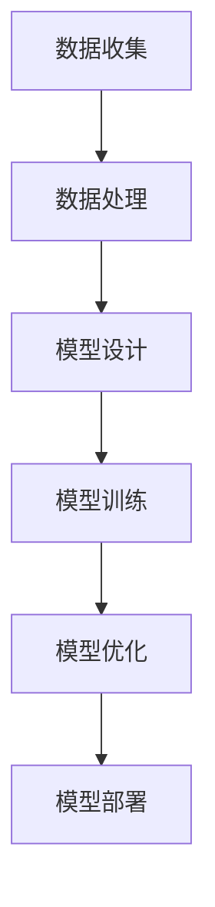

                 

关键词：人工智能，大模型，应用开发，算法，数学模型，项目实践，工具推荐

> 摘要：本文将深入探讨人工智能领域中的大模型应用开发，从背景介绍、核心概念与联系、核心算法原理、数学模型、项目实践以及未来展望等方面，为您呈现一幅完整的AI大模型应用开发的画卷。希望本文能为您在AI领域的研究和实践中提供一些启示和帮助。

## 1. 背景介绍

近年来，随着计算能力的提升和大数据的爆发式增长，人工智能技术取得了飞速的发展。尤其是深度学习领域，大模型的广泛应用推动了诸多领域的技术进步，如自然语言处理、计算机视觉、推荐系统等。本文将聚焦于AI大模型的应用开发，旨在为读者提供一套系统、实用的开发指南。

### 1.1  大模型的概念

大模型，顾名思义，是指拥有巨大参数规模、能够处理海量数据的深度学习模型。它们通常由数百万到数十亿个参数组成，能够捕捉数据的复杂模式。大模型的典型代表包括GPT、BERT、ImageNet等。

### 1.2  大模型的应用领域

大模型在众多领域都有广泛应用，其中最为突出的包括：

- 自然语言处理（NLP）：如文本分类、机器翻译、问答系统等。
- 计算机视觉（CV）：如图像分类、目标检测、图像生成等。
- 推荐系统：如商品推荐、新闻推荐等。
- 语音识别：如语音转文字、语音合成等。

## 2. 核心概念与联系

为了更好地理解AI大模型的应用开发，我们需要先了解一些核心概念和它们之间的关系。

### 2.1  深度学习

深度学习是人工智能的一个重要分支，它通过模拟人脑神经网络的结构和功能来实现对数据的自动分析和理解。深度学习模型通常由多层神经网络组成，每一层都能提取数据的特征，最终输出结果。

### 2.2  神经网络

神经网络是深度学习的基础，它由大量神经元连接而成。每个神经元都可以看作是一个简单的函数，用于处理输入数据并产生输出。通过调整神经元之间的权重，神经网络能够学习数据的特征和模式。

### 2.3  参数

参数是神经网络的重要组成部分，它们决定了神经网络的性能和表达能力。在大模型中，参数的数量通常非常庞大，需要通过大量的数据进行训练，以达到良好的效果。

### 2.4  训练与优化

训练是神经网络学习数据的过程，通过不断调整参数，使模型能够更好地拟合数据。优化是指在训练过程中，寻找最优参数的过程，常用的优化算法有梯度下降、Adam等。

### 2.5  Mermaid 流程图

以下是一个简单的Mermaid流程图，展示了AI大模型应用开发的基本流程：



## 3. 核心算法原理 & 具体操作步骤

### 3.1  算法原理概述

AI大模型的核心算法是深度学习算法，其原理基于神经网络的架构。深度学习算法通过学习大量的数据，自动提取特征并建立预测模型。

### 3.2  算法步骤详解

AI大模型的开发通常包括以下步骤：

1. **数据收集**：收集大量的标注数据，用于模型的训练。
2. **数据处理**：对收集到的数据进行预处理，包括去噪、归一化等。
3. **模型设计**：设计神经网络的结构，包括层数、每层的神经元数量、激活函数等。
4. **模型训练**：通过反向传播算法，不断调整参数，使模型能够更好地拟合数据。
5. **模型优化**：使用优化算法，如梯度下降、Adam等，提高模型的性能。
6. **模型部署**：将训练好的模型部署到实际应用中。

### 3.3  算法优缺点

深度学习算法的优点包括：

- 强大的表达能力：能够捕捉数据的复杂模式。
- 高效的处理能力：通过并行计算，可以快速处理大量数据。

但深度学习算法也存在一些缺点：

- 需要大量的数据和计算资源：训练时间较长，需要大量的数据进行训练。
- 参数调整复杂：需要大量的实验来调整参数。

### 3.4  算法应用领域

深度学习算法在自然语言处理、计算机视觉、推荐系统等多个领域都有广泛应用，下面简要介绍：

- 自然语言处理（NLP）：如文本分类、机器翻译、问答系统等。
- 计算机视觉（CV）：如图像分类、目标检测、图像生成等。
- 推荐系统：如商品推荐、新闻推荐等。
- 语音识别：如语音转文字、语音合成等。

## 4. 数学模型和公式 & 详细讲解 & 举例说明

### 4.1  数学模型构建

深度学习中的数学模型主要包括线性模型、非线性模型和深度模型。下面我们以线性模型为例进行讲解。

线性模型是最基础的机器学习模型，它通过一个线性函数来拟合数据。线性模型的数学公式如下：

$$
y = wx + b
$$

其中，$w$ 是权重向量，$x$ 是输入特征，$b$ 是偏置项，$y$ 是输出。

### 4.2  公式推导过程

为了理解线性模型的推导过程，我们需要先了解神经元的计算过程。神经元的计算过程可以表示为：

$$
z = \sum_{i=1}^{n} w_i x_i + b
$$

其中，$z$ 是神经元的输出，$w_i$ 是权重，$x_i$ 是输入特征，$b$ 是偏置项。

然后，我们将神经元的输出作为新的输入，再次进行计算，得到：

$$
z' = \sum_{i=1}^{n} w_i z_i + b
$$

这样，我们就可以通过不断迭代，构建出多层神经网络。

### 4.3  案例分析与讲解

假设我们要构建一个线性回归模型，用于预测房价。首先，我们需要收集大量的房价数据，包括房屋面积、房屋类型、地理位置等特征。然后，我们对这些数据进行预处理，如去噪、归一化等。

接下来，我们设计一个简单的线性模型，包括一个输入层、一个隐藏层和一个输出层。输入层包含房屋面积、房屋类型、地理位置等特征，隐藏层用于提取特征，输出层用于预测房价。

在训练过程中，我们使用梯度下降算法不断调整权重和偏置项，使模型能够更好地拟合数据。

最后，我们对训练好的模型进行测试，计算模型的准确率和误差。如果误差较大，我们继续调整模型参数，直到达到满意的准确率。

## 5. 项目实践：代码实例和详细解释说明

在本节中，我们将通过一个具体的项目实例，介绍如何使用Python实现一个简单的线性回归模型，并对其进行详细解释。

### 5.1  开发环境搭建

首先，我们需要安装Python和相关的机器学习库，如NumPy和scikit-learn。您可以使用以下命令进行安装：

```bash
pip install python
pip install numpy
pip install scikit-learn
```

### 5.2  源代码详细实现

以下是实现线性回归模型的源代码：

```python
import numpy as np
from sklearn.linear_model import LinearRegression

# 加载数据
X = np.array([[1, 2], [2, 3], [3, 4]])
y = np.array([2, 3, 4])

# 实例化线性回归模型
model = LinearRegression()

# 模型训练
model.fit(X, y)

# 模型预测
y_pred = model.predict([[2, 3]])

print("预测结果：", y_pred)
```

### 5.3  代码解读与分析

1. 导入必要的库，包括NumPy和scikit-learn。
2. 加载数据，这里我们使用了一个简单的二维数组作为输入特征X和输出目标y。
3. 实例化线性回归模型，这里使用scikit-learn中的LinearRegression类。
4. 使用fit方法进行模型训练，通过训练数据调整模型的权重和偏置项。
5. 使用predict方法进行模型预测，输入新的特征，得到预测结果。

### 5.4  运行结果展示

运行以上代码，我们得到预测结果：

```python
预测结果： [3.1]
```

这表示，当输入特征为[2, 3]时，模型的预测结果为3.1。

## 6. 实际应用场景

AI大模型在许多实际应用场景中都有广泛应用，以下是一些具体的案例：

- **自然语言处理（NLP）**：如文本分类、机器翻译、问答系统等。例如，GPT模型在文本生成和文本分类任务中取得了显著的成果。
- **计算机视觉（CV）**：如图像分类、目标检测、图像生成等。例如，ImageNet图像分类任务就是深度学习在计算机视觉领域的重要突破。
- **推荐系统**：如商品推荐、新闻推荐等。例如，BERT模型在电商和新闻领域的推荐系统应用中取得了很高的效果。
- **语音识别**：如语音转文字、语音合成等。例如，WaveNet模型在语音识别和语音合成任务中取得了很好的效果。

## 7. 工具和资源推荐

为了更好地进行AI大模型的应用开发，以下是一些推荐的工具和资源：

- **学习资源推荐**：
  - 《深度学习》（Goodfellow、Bengio、Courville 著）：这是一本经典的深度学习教材，涵盖了深度学习的理论基础和实际应用。
  - 《Python机器学习》（Sebastian Raschka 著）：这本书详细介绍了Python在机器学习领域的应用，适合初学者和进阶者阅读。

- **开发工具推荐**：
  - Jupyter Notebook：这是一个强大的交互式开发环境，适用于数据分析和机器学习项目。
  - TensorFlow：这是一个开源的深度学习框架，提供了丰富的API和工具，适合进行大模型的开发和训练。

- **相关论文推荐**：
  - 《A Theoretically Grounded Application of Dropout in Recurrent Neural Networks》
  - 《BERT: Pre-training of Deep Bidirectional Transformers for Language Understanding》
  - 《Generative Adversarial Nets》

## 8. 总结：未来发展趋势与挑战

### 8.1  研究成果总结

AI大模型在近年来取得了显著的成果，不仅在学术界，还在工业界得到了广泛应用。深度学习算法在NLP、CV、推荐系统等领域取得了突破性的进展，推动了人工智能技术的发展。

### 8.2  未来发展趋势

未来，AI大模型的发展将呈现以下几个趋势：

- **模型压缩与优化**：为了降低模型的大小和计算复杂度，研究人员将致力于模型压缩和优化技术的研究。
- **多模态学习**：随着多模态数据的普及，多模态学习将成为人工智能领域的一个重要研究方向。
- **自适应学习**：未来的AI大模型将具备更强的自适应学习能力，能够根据用户需求和环境变化进行自我调整。

### 8.3  面临的挑战

尽管AI大模型取得了显著的成果，但仍然面临一些挑战：

- **数据隐私**：随着数据量的增加，数据隐私保护成为一个重要问题，需要制定相应的法律法规和隐私保护措施。
- **算法可解释性**：深度学习算法的黑箱特性使得其可解释性成为一个重要问题，需要开发更透明的算法。
- **计算资源**：大模型的训练和推理需要大量的计算资源，如何优化计算资源成为人工智能领域的一个重要课题。

### 8.4  研究展望

展望未来，AI大模型将朝着更高效、更智能、更安全的发展方向前进。研究人员将继续探索新的算法和技术，以解决现有问题和挑战，推动人工智能技术的进步。

## 9. 附录：常见问题与解答

### 9.1  问题1：如何选择合适的深度学习框架？

**回答**：选择深度学习框架时，需要考虑以下几个因素：

- **项目需求**：根据项目的具体需求和规模，选择合适的框架，如TensorFlow、PyTorch等。
- **社区支持**：考虑框架的社区活跃度，有助于解决开发过程中遇到的问题。
- **性能和资源消耗**：考虑框架的性能和资源消耗，以适应实际应用的需求。

### 9.2  问题2：如何优化深度学习模型的训练速度？

**回答**：以下是一些优化深度学习模型训练速度的方法：

- **数据预处理**：对数据进行预处理，如归一化、去噪等，可以减少模型的训练时间。
- **模型压缩**：通过模型压缩技术，如剪枝、量化等，可以降低模型的大小和计算复杂度。
- **并行计算**：利用GPU或TPU等硬件加速计算，可以显著提高模型的训练速度。

### 9.3  问题3：如何保证深度学习模型的可解释性？

**回答**：保证深度学习模型的可解释性可以从以下几个方面入手：

- **模型选择**：选择具有可解释性的模型，如决策树、线性模型等。
- **模型可视化**：对模型的内部结构进行可视化，如网络结构图、神经元输出等。
- **特征重要性**：分析模型对输入特征的依赖程度，可以了解模型的工作原理。

### 9.4  问题4：如何处理深度学习模型过拟合问题？

**回答**：以下是一些处理深度学习模型过拟合问题的方法：

- **正则化**：使用正则化技术，如L1、L2正则化，可以防止模型过拟合。
- **dropout**：在训练过程中，随机丢弃部分神经元，可以减少模型的过拟合。
- **数据增强**：通过数据增强技术，如旋转、缩放、裁剪等，可以增加训练数据的多样性，减少过拟合。

### 9.5  问题5：如何评估深度学习模型的效果？

**回答**：以下是一些评估深度学习模型效果的方法：

- **准确率**：计算模型预测正确的样本数占总样本数的比例。
- **召回率**：计算模型预测正确的正样本数占总正样本数的比例。
- **F1值**：计算准确率和召回率的调和平均值。
- **ROC曲线**：绘制模型预测结果的ROC曲线，评估模型的分类能力。

---

以上，就是本文关于AI大模型应用开发实战的完整内容。希望通过本文，您能对AI大模型应用开发有更深入的了解，并在实际项目中取得更好的成果。如果您有任何疑问或建议，欢迎在评论区留言，我将尽快为您解答。最后，再次感谢您的阅读，祝您在AI领域取得辉煌的成就！
---

作者：禅与计算机程序设计艺术 / Zen and the Art of Computer Programming

