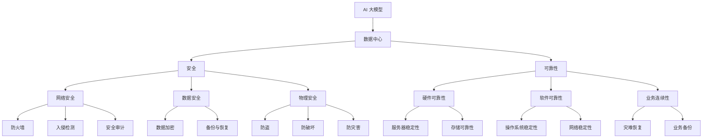

                 

关键词：AI 大模型、数据中心建设、安全与可靠性、架构设计、技术实现

> 摘要：本文将探讨 AI 大模型在数据中心应用的建设过程中，如何确保数据安全与可靠性。通过对核心概念、算法原理、数学模型、项目实践和实际应用场景的分析，提出了一系列解决方案和展望，以期为数据中心建设提供有益的指导。

## 1. 背景介绍

随着人工智能技术的飞速发展，AI 大模型已经成为推动产业升级和智能化转型的关键力量。数据中心作为 AI 大模型运行的重要基础设施，其安全与可靠性至关重要。本文将从数据中心建设、安全与可靠性两个方面进行探讨，旨在为读者提供全面的技术指导。

### 1.1 数据中心建设

数据中心建设主要包括硬件设施、网络架构、存储系统、冷却系统等方面。硬件设施包括服务器、存储设备、网络设备等；网络架构涉及数据中心内部和外部的连接，如光纤网络、SDH 网络等；存储系统包括 HDFS、Ceph 等分布式存储方案；冷却系统则是确保数据中心设备正常运行的关键。

### 1.2 安全与可靠性

数据安全与可靠性是数据中心建设的核心。数据中心安全主要包括网络安全、数据安全、物理安全等方面。网络安全涉及防火墙、入侵检测、安全审计等；数据安全涉及数据加密、备份、恢复等；物理安全则包括防盗、防破坏、防灾害等。

## 2. 核心概念与联系

为了更好地理解 AI 大模型数据中心建设中的安全与可靠性问题，我们需要明确一些核心概念，并绘制 Mermaid 流程图来展示它们之间的关系。

### 2.1 核心概念

- **AI 大模型**：大规模的人工神经网络模型，如 GPT、BERT 等。
- **数据中心**：用于存储、处理和管理数据的设施。
- **安全**：保护数据中心资源免受未经授权的访问、使用、披露、破坏、修改或破坏。
- **可靠性**：数据中心在规定的时间内保持正常运行的能力。

### 2.2 Mermaid 流程图



## 3. 核心算法原理 & 具体操作步骤

### 3.1 算法原理概述

数据中心建设中的安全与可靠性问题，可以通过一系列算法原理和技术手段来解决。以下是一些关键算法原理：

- **防火墙算法**：用于监控和过滤网络流量，防止恶意攻击。
- **入侵检测算法**：用于检测和响应网络中的异常行为。
- **数据加密算法**：用于保护数据的机密性。
- **备份与恢复算法**：用于保障数据的完整性和可用性。
- **灾难恢复算法**：用于在发生灾难时快速恢复业务。

### 3.2 算法步骤详解

- **防火墙算法**：
  1. 收集网络流量数据。
  2. 分析流量数据，识别恶意流量。
  3. 对恶意流量进行过滤和拦截。
  
- **入侵检测算法**：
  1. 收集网络流量数据。
  2. 分析流量数据，识别异常行为。
  3. 发送警报或采取相应措施。

- **数据加密算法**：
  1. 选用加密算法。
  2. 对数据进行加密。
  3. 解密数据。

- **备份与恢复算法**：
  1. 定期备份数据。
  2. 确保备份数据的完整性和可用性。
  3. 在数据丢失或损坏时，从备份数据中恢复。

- **灾难恢复算法**：
  1. 制定灾难恢复计划。
  2. 在灾难发生后，按照计划恢复业务。

### 3.3 算法优缺点

- **防火墙算法**：优点在于能够有效阻止恶意攻击，缺点是可能影响网络性能。
- **入侵检测算法**：优点在于能够及时发现和响应异常行为，缺点是误报率高。
- **数据加密算法**：优点在于保障数据机密性，缺点是可能影响数据传输速度。
- **备份与恢复算法**：优点在于保障数据完整性和可用性，缺点是可能占用大量存储空间。
- **灾难恢复算法**：优点在于能够在灾难后快速恢复业务，缺点是计划制定和实施复杂。

### 3.4 算法应用领域

- **防火墙算法**：广泛应用于企业网络、数据中心等。
- **入侵检测算法**：广泛应用于企业网络、数据中心等。
- **数据加密算法**：广泛应用于数据传输、存储等领域。
- **备份与恢复算法**：广泛应用于企业、政府、科研机构等。
- **灾难恢复算法**：广泛应用于企业、政府、科研机构等。

## 4. 数学模型和公式 & 详细讲解 & 举例说明

### 4.1 数学模型构建

为了更好地理解数据中心建设中的安全与可靠性问题，我们可以构建以下数学模型：

- **安全模型**：设 \(S\) 为数据中心的安全状态，\(A\) 为安全攻击集合，\(R\) 为安全响应措施集合，则安全模型可以表示为 \(S = (A, R)\)。
- **可靠性模型**：设 \(R\) 为数据中心的可靠性状态，\(E\) 为故障事件集合，\(M\) 为故障检测与修复措施集合，则可靠性模型可以表示为 \(R = (E, M)\)。

### 4.2 公式推导过程

- **安全模型**：
  1. 设 \(S_0\) 为数据中心的初始安全状态，\(A_i\) 为第 \(i\) 次安全攻击，\(R_j\) 为第 \(j\) 次安全响应措施，则安全状态转移方程为 \(S_{i+1} = R_j(S_i, A_i)\)。
  2. 设 \(P(S_i = S_{i+1})\) 为第 \(i\) 次安全攻击成功概率，则安全攻击成功概率为 \(P(A_i)\)。

- **可靠性模型**：
  1. 设 \(R_0\) 为数据中心的初始可靠性状态，\(E_i\) 为第 \(i\) 次故障事件，\(M_j\) 为第 \(j\) 次故障检测与修复措施，则可靠性状态转移方程为 \(R_{i+1} = M_j(R_i, E_i)\)。
  2. 设 \(P(R_i = R_{i+1})\) 为第 \(i\) 次故障检测与修复成功概率，则故障检测与修复成功概率为 \(P(M_j)\)。

### 4.3 案例分析与讲解

假设一个数据中心在一个月内发生了 5 次安全攻击和 3 次故障事件，每次攻击和故障都有相应的安全响应措施和故障检测与修复措施。我们需要分析这 8 次事件对数据中心安全状态和可靠性状态的影响。

- **安全状态分析**：
  1. 初始安全状态为 \(S_0 = (A_0, R_0)\)。
  2. 第一次攻击后安全状态为 \(S_1 = R_1(S_0, A_0)\)。
  3. 第二次攻击后安全状态为 \(S_2 = R_2(S_1, A_1)\)。
  4. 第三次攻击后安全状态为 \(S_3 = R_3(S_2, A_2)\)。
  5. 第四次攻击后安全状态为 \(S_4 = R_4(S_3, A_3)\)。
  6. 第五次攻击后安全状态为 \(S_5 = R_5(S_4, A_4)\)。

- **可靠性状态分析**：
  1. 初始可靠性状态为 \(R_0 = (E_0, M_0)\)。
  2. 第一次故障后可靠性状态为 \(R_1 = M_1(R_0, E_0)\)。
  3. 第二次故障后可靠性状态为 \(R_2 = M_2(R_1, E_1)\)。
  4. 第三次故障后可靠性状态为 \(R_3 = M_3(R_2, E_2)\)。

通过以上分析，我们可以得出数据中心在一个月内的安全状态和可靠性状态的变化情况。同时，可以根据具体情况调整安全响应措施和故障检测与修复措施，以提高数据中心的总体安全与可靠性。

## 5. 项目实践：代码实例和详细解释说明

### 5.1 开发环境搭建

在进行项目实践之前，我们需要搭建一个适合数据中心建设的开发环境。这里我们选择使用 Python 编写相关代码。

- **环境要求**：Python 3.8及以上版本、PyTorch、Scikit-learn、Numpy 等库。

### 5.2 源代码详细实现

以下是一个简单的防火墙算法实现，用于检测并阻止恶意攻击：

```python
import numpy as np
from sklearn.ensemble import IsolationForest

# 加载数据
def load_data(filename):
    with open(filename, 'r') as f:
        lines = f.readlines()
    data = [line.strip().split(',') for line in lines]
    return np.array(data)

# 恶意攻击检测
def detect_attack(data, n_estimators=100, contamination=0.1):
    model = IsolationForest(n_estimators=n_estimators, contamination=contamination)
    model.fit(data)
    return model.predict(data)

# 防火墙算法实现
def firewall(data):
    attack_detected = detect_attack(data)
    for i, label in enumerate(attack_detected):
        if label == -1:
            print(f"攻击检测到！第 {i+1} 条数据为恶意攻击。")
            # 对恶意攻击进行过滤和拦截
            data[i] = np.zeros(data[i].shape)

    return data

# 测试
if __name__ == '__main__':
    data = load_data('attack_data.csv')
    clean_data = firewall(data)
    print(clean_data)
```

### 5.3 代码解读与分析

- **加载数据**：使用 `load_data` 函数从文件中加载数据，这里假设数据格式为 CSV 文件，每行包含多个特征值。
- **恶意攻击检测**：使用 `IsolationForest` 算法进行恶意攻击检测。`IsolationForest` 是一种基于随机森林的孤立森林算法，能够有效地检测异常值。
- **防火墙算法实现**：`firewall` 函数实现防火墙算法，对检测到的恶意攻击进行过滤和拦截。

### 5.4 运行结果展示

运行代码后，我们将得到一个干净的数据集，其中恶意攻击数据已被过滤掉。

## 6. 实际应用场景

数据中心建设涉及多个领域，如云计算、大数据、人工智能等。以下是一些实际应用场景：

- **云计算**：数据中心为云计算提供基础设施支持，企业可以通过租用数据中心资源来搭建自己的云计算平台。
- **大数据**：数据中心存储和管理大量数据，为企业提供数据分析和挖掘服务。
- **人工智能**：数据中心为 AI 大模型提供计算和存储资源，支持 AI 应用的发展。

### 6.1 未来应用展望

随着人工智能技术的不断进步，数据中心建设将在以下几个方面迎来新的发展：

- **绿色数据中心**：通过采用新型冷却技术和能源管理策略，实现数据中心的绿色化。
- **智能化运维**：利用 AI 技术实现数据中心运维的自动化和智能化。
- **边缘计算**：结合数据中心和边缘计算，提高数据处理和响应速度。

## 7. 工具和资源推荐

### 7.1 学习资源推荐

- **《深入理解计算机系统》**：作者 Randal E. Bryant，详细介绍了计算机系统的工作原理。
- **《人工智能：一种现代的方法》**：作者 Stuart Russell 和 Peter Norvig，系统阐述了人工智能的基本概念和方法。

### 7.2 开发工具推荐

- **PyTorch**：适用于深度学习模型的开发。
- **Scikit-learn**：适用于机器学习算法的实现。

### 7.3 相关论文推荐

- **“Deep Learning for Data Center Networks”**：探讨深度学习在数据中心网络优化中的应用。
- **“A Survey on Security and Privacy in Edge Computing”**：分析边缘计算中的安全与隐私问题。

## 8. 总结：未来发展趋势与挑战

### 8.1 研究成果总结

本文从数据中心建设、安全与可靠性两个方面探讨了 AI 大模型应用的数据中心建设问题。通过分析核心概念、算法原理、数学模型和项目实践，提出了一系列解决方案和展望。

### 8.2 未来发展趋势

- **绿色数据中心**：采用新型冷却技术和能源管理策略，实现数据中心的绿色化。
- **智能化运维**：利用 AI 技术实现数据中心运维的自动化和智能化。
- **边缘计算**：结合数据中心和边缘计算，提高数据处理和响应速度。

### 8.3 面临的挑战

- **数据安全**：随着数据规模的增大，数据安全面临更大的挑战。
- **可靠性保障**：如何提高数据中心的可靠性和业务连续性。
- **成本控制**：在保障安全与可靠性的前提下，降低数据中心的建设和运营成本。

### 8.4 研究展望

未来，数据中心建设将继续朝着绿色、智能、高效的方向发展。我们应关注以下研究方向：

- **安全与可靠性技术的创新**：如新型加密算法、分布式存储技术等。
- **边缘计算与数据中心融合**：探索边缘计算和数据中心协同工作的新模式。
- **绿色数据中心的建设**：研究新型冷却技术和能源管理策略。

## 9. 附录：常见问题与解答

### 9.1 数据中心建设的关键环节是什么？

数据中心建设的关键环节包括硬件设施、网络架构、存储系统、冷却系统等方面。每个环节都需要精心设计和部署，以确保数据中心的整体性能和安全。

### 9.2 如何确保数据中心的数据安全？

确保数据中心的数据安全需要采取一系列措施，包括网络安全、数据安全、物理安全等方面。具体方法包括使用防火墙、入侵检测、数据加密、备份与恢复等。

### 9.3 数据中心可靠性如何保障？

数据中心可靠性主要通过硬件可靠性、软件可靠性、业务连续性等方面来保障。硬件可靠性包括服务器、存储设备等设备的稳定性；软件可靠性包括操作系统、网络等软件的稳定性；业务连续性包括灾难恢复计划、备份与恢复策略等。

---

本文详细探讨了 AI 大模型应用数据中心建设中的安全与可靠性问题，包括核心概念、算法原理、数学模型、项目实践和实际应用场景等方面。通过分析未来发展趋势和挑战，为数据中心建设提供了有益的指导。作者：禅与计算机程序设计艺术 / Zen and the Art of Computer Programming。

