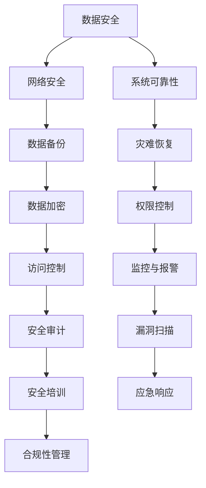

                 

 在当今数字化的时代，人工智能（AI）大模型的应用已经成为了推动各行各业发展的关键动力。而数据中心作为承载AI大模型运行的核心基础设施，其安全与可靠性成为了我们必须重点关注的领域。本文将深入探讨AI大模型应用数据中心的建设，尤其是数据中心的安全与可靠性问题。

## 关键词

- AI大模型
- 数据中心建设
- 数据中心安全
- 数据中心可靠性

## 摘要

本文旨在详细分析AI大模型应用数据中心建设中的关键问题，重点关注数据中心的安全与可靠性。通过介绍数据中心的基本概念、核心架构，我们将探讨如何确保数据中心在面临复杂应用场景下的安全性和可靠性，为AI大模型的应用提供强有力的支撑。

## 1. 背景介绍

随着AI技术的快速发展，大模型的应用已经成为了现代科技的重要方向。无论是自然语言处理、计算机视觉，还是推荐系统、自动驾驶，都需要依靠庞大的数据集和强大的计算能力。而数据中心作为AI大模型运行的载体，其性能、稳定性和安全性直接决定了AI应用的效果。

数据中心的安全与可靠性不仅关系到AI大模型的应用效果，还关系到数据的安全性和隐私保护。在数据密集型的AI应用场景中，数据中心面临着各种安全威胁，如数据泄露、恶意攻击、系统故障等。因此，确保数据中心的可靠性，是保障AI大模型安全运行的基础。

### 1.1 数据中心的基本概念

数据中心（Data Center）是指用于存储、处理、传输和管理大量数据的专用设施。它通常包括服务器、存储设备、网络设备、电力系统、空调系统等硬件设施，以及相应的软件管理系统。

数据中心的发展经历了从物理数据中心到虚拟数据中心，再到云计算数据中心的转变。传统的物理数据中心主要依赖于物理硬件的部署和管理，而虚拟数据中心通过虚拟化技术实现了硬件资源的灵活调度和管理，云计算数据中心则将计算、存储、网络等资源进行集成，实现了资源的高度自动化管理和弹性扩展。

### 1.2 数据中心的核心架构

数据中心的架构通常包括以下几个关键组成部分：

1. **计算节点**：负责执行AI大模型的计算任务，通常由高性能服务器组成。
2. **存储系统**：用于存储AI大模型的数据集和训练结果，包括硬盘存储和固态存储。
3. **网络系统**：负责连接计算节点和存储系统，实现数据的快速传输和高效处理。
4. **电源系统**：为数据中心提供稳定的电力供应，通常包括备用电源和UPS系统。
5. **空调系统**：保持数据中心设备的稳定运行，防止过热。
6. **安全系统**：包括防火墙、入侵检测系统、数据加密等，保障数据的安全性和隐私保护。

### 1.3 数据中心的发展趋势

随着AI技术的不断进步，数据中心的建设也在不断演进。以下是一些数据中心的发展趋势：

1. **绿色数据中心**：通过采用节能技术和设备，降低数据中心的能耗和碳排放。
2. **边缘计算**：将计算任务从数据中心转移到网络边缘，提高数据处理的速度和效率。
3. **自动化管理**：通过自动化工具和平台，实现数据中心的智能管理和运维。
4. **云原生架构**：基于云计算的架构，实现资源的弹性扩展和高效利用。

## 2. 核心概念与联系

在探讨数据中心的安全与可靠性时，我们需要了解一些核心概念和原理，以及它们之间的联系。以下是一个简化的Mermaid流程图，用于展示这些核心概念和它们之间的关系。



### 2.1 数据安全

数据安全是数据中心安全的核心，它包括以下几个方面：

1. **网络安全**：防止未经授权的访问和攻击，包括防火墙、入侵检测系统等。
2. **数据加密**：对敏感数据进行加密，确保数据在传输和存储过程中不被窃取或篡改。
3. **访问控制**：通过权限控制，确保只有授权用户可以访问特定的数据和系统资源。

### 2.2 系统可靠性

系统可靠性包括以下几个方面：

1. **数据备份**：定期备份重要数据，确保在数据丢失或损坏时可以恢复。
2. **灾难恢复**：建立灾难恢复计划，确保在发生突发事件时可以快速恢复系统和数据。
3. **监控与报警**：实时监控数据中心的运行状态，并在发生异常时及时报警。

### 2.3 安全性与可靠性的联系

安全性与可靠性是相辅相成的，一个安全可靠的数据中心不仅需要确保数据的安全，还需要确保系统的稳定运行。以下是一个简化的Mermaid流程图，展示安全性与可靠性之间的联系。


## 3. 核心算法原理 & 具体操作步骤

在确保数据中心的安全与可靠性方面，有许多核心算法和技术被广泛应用。以下将介绍一些关键算法原理和具体操作步骤。

### 3.1 算法原理概述

在数据中心安全与可靠性方面，核心算法主要分为以下几类：

1. **网络安全算法**：如防火墙算法、入侵检测算法、加密算法等，用于保护数据中心的网络安全。
2. **数据备份算法**：如增量备份算法、全量备份算法等，用于确保数据在发生故障时可以快速恢复。
3. **可靠性算法**：如冗余设计算法、负载均衡算法等，用于提高数据中心的可靠性和稳定性。
4. **监控与报警算法**：如异常检测算法、预测报警算法等，用于实时监控数据中心的运行状态。

### 3.2 算法步骤详解

以下是各个算法的具体步骤详解：

#### 3.2.1 网络安全算法

1. **防火墙算法**：通过定义规则，对进出数据中心的流量进行过滤，阻止未经授权的访问。
2. **入侵检测算法**：通过监测网络流量和系统日志，识别潜在的安全威胁，并及时发出警报。
3. **加密算法**：对数据进行加密，确保数据在传输和存储过程中的安全性。

#### 3.2.2 数据备份算法

1. **增量备份算法**：只备份自上次备份以来发生变化的数据，减少备份时间和存储空间。
2. **全量备份算法**：备份所有数据，确保数据的完整性。
3. **备份策略**：根据数据的重要性和变化频率，制定合理的备份策略。

#### 3.2.3 可靠性算法

1. **冗余设计算法**：通过冗余设计，确保数据中心的各个组件（如服务器、存储设备、网络设备）在发生故障时可以快速切换到备用组件。
2. **负载均衡算法**：通过分配任务，确保数据中心的资源得到充分利用，避免单点过载。
3. **容错算法**：在发生故障时，自动切换到备用组件，确保系统的连续运行。

#### 3.2.4 监控与报警算法

1. **异常检测算法**：通过分析网络流量、系统日志等数据，识别异常行为。
2. **预测报警算法**：根据历史数据，预测可能发生的故障，提前发出警报。
3. **监控策略**：根据业务需求和系统特点，制定合理的监控策略。

### 3.3 算法优缺点

以下是各种算法的优缺点分析：

#### 3.3.1 网络安全算法

**优点**：
- **防火墙算法**：有效地阻止未经授权的访问，保护数据中心的网络安全。
- **入侵检测算法**：及时识别潜在的安全威胁，防止恶意攻击。
- **加密算法**：确保数据在传输和存储过程中的安全性。

**缺点**：
- **防火墙算法**：可能会误判正常访问为攻击，导致合法用户无法访问。
- **入侵检测算法**：可能会误报，增加运维负担。
- **加密算法**：加密和解密过程会消耗一定的计算资源。

#### 3.3.2 数据备份算法

**优点**：
- **增量备份算法**：减少备份时间和存储空间，提高备份效率。
- **全量备份算法**：确保数据的完整性，方便数据恢复。
- **备份策略**：根据业务需求，灵活调整备份策略。

**缺点**：
- **增量备份算法**：在数据量较大时，备份速度较慢。
- **全量备份算法**：备份时间较长，可能会影响业务运行。

#### 3.3.3 可靠性算法

**优点**：
- **冗余设计算法**：提高数据中心的可靠性，减少故障影响。
- **负载均衡算法**：充分利用资源，提高系统性能。
- **容错算法**：确保系统的连续运行，减少故障停机时间。

**缺点**：
- **冗余设计算法**：增加了系统的复杂度和成本。
- **负载均衡算法**：可能会增加网络的复杂度。
- **容错算法**：在切换过程中可能会影响系统的性能。

#### 3.3.4 监控与报警算法

**优点**：
- **异常检测算法**：及时发现异常行为，防止故障扩大。
- **预测报警算法**：提前预测故障，减少故障停机时间。
- **监控策略**：根据业务需求，灵活调整监控策略。

**缺点**：
- **异常检测算法**：可能会误报，增加运维负担。
- **预测报警算法**：预测准确性受历史数据影响。
- **监控策略**：制定合理的监控策略需要丰富的经验和数据支持。

### 3.4 算法应用领域

各种算法在数据中心的安全与可靠性方面有着广泛的应用：

- **网络安全算法**：广泛应用于企业、政府、金融机构等数据敏感领域，保护数据的安全性。
- **数据备份算法**：广泛应用于企业、云计算服务提供商等，确保数据的可靠性和可用性。
- **可靠性算法**：广泛应用于互联网、金融、医疗等领域，确保系统的稳定性和连续性。
- **监控与报警算法**：广泛应用于各类数据中心，实时监控系统的运行状态，确保系统的安全性和可靠性。

## 4. 数学模型和公式 & 详细讲解 & 举例说明

在数据中心的安全与可靠性方面，许多数学模型和公式被用于分析和优化系统的性能。以下将介绍一些关键数学模型和公式，并进行详细讲解和举例说明。

### 4.1 数学模型构建

在数据中心的建设和管理中，常见的数学模型包括：

1. **可靠性模型**：用于评估系统的可靠性，常用的有串联模型、并联模型等。
2. **性能模型**：用于评估系统的性能，常用的有响应时间模型、吞吐量模型等。
3. **安全模型**：用于评估系统的安全性，常用的有攻击树模型、风险评估模型等。

### 4.2 公式推导过程

以下是几个关键数学模型的公式推导过程：

#### 4.2.1 可靠性模型

1. **串联模型**：

   假设有两个系统，每个系统的可靠性分别为 \( R_1 \) 和 \( R_2 \)，则串联系统的可靠性 \( R \) 为：

   $$ R = R_1 \times R_2 $$

   推导过程：假设第一个系统发生故障的概率为 \( P_1 \)，则其可靠性为 \( R_1 = 1 - P_1 \)。同理，第二个系统的可靠性为 \( R_2 = 1 - P_2 \)。串联系统的故障概率为 \( P = P_1 + P_2 - P_1 \times P_2 \)，则可靠性为 \( R = 1 - P = (1 - P_1) \times (1 - P_2) \)。

2. **并联模型**：

   假设有两个系统，每个系统的可靠性分别为 \( R_1 \) 和 \( R_2 \)，则并联系统的可靠性 \( R \) 为：

   $$ R = 1 - (1 - R_1) \times (1 - R_2) $$

   推导过程：假设第一个系统发生故障的概率为 \( P_1 \)，则其可靠性为 \( R_1 = 1 - P_1 \)。同理，第二个系统的可靠性为 \( R_2 = 1 - P_2 \)。并联系统的故障概率为 \( P = P_1 + P_2 - P_1 \times P_2 \)，则可靠性为 \( R = 1 - P = 1 - [(1 - R_1) + (1 - R_2) - (1 - R_1) \times (1 - R_2)] = (R_1 + R_2 - R_1 \times R_2) \)。

#### 4.2.2 性能模型

1. **响应时间模型**：

   假设系统的响应时间 \( T \) 与处理能力 \( P \) 成正比，则有：

   $$ T = \frac{P}{\lambda} $$

   其中，\( \lambda \) 为系统的工作负载。

   推导过程：假设系统每秒可以处理 \( P \) 个任务，平均每个任务的处理时间为 \( T \)，则每小时可以处理 \( P \times 3600 \) 个任务。若系统的工作负载为 \( \lambda \)，则每小时需要处理的任务数为 \( \lambda \times 3600 \)。因此，系统的响应时间 \( T \) 为 \( T = \frac{P \times 3600}{\lambda} \)。

2. **吞吐量模型**：

   假设系统的吞吐量 \( Q \) 与处理能力 \( P \) 成正比，则有：

   $$ Q = P $$

   推导过程：假设系统每秒可以处理 \( P \) 个任务，则每小时的吞吐量 \( Q \) 为 \( Q = P \times 3600 \)。

#### 4.2.3 安全模型

1. **攻击树模型**：

   假设攻击树由 \( n \) 个节点组成，其中 \( k \) 个节点为叶子节点，每个叶节点表示一种攻击方式。设第 \( i \) 个节点的攻击概率为 \( p_i \)，则有：

   $$ P(\text{攻击成功}) = \sum_{i=1}^{k} p_i $$

   推导过程：假设攻击树中所有路径的概率之和等于攻击成功的概率。对于每个叶子节点，其攻击成功的概率为 \( p_i \)。由于攻击树中存在多个叶子节点，因此攻击成功的概率为所有叶子节点攻击概率之和。

### 4.3 案例分析与讲解

以下是一个数据中心安全与可靠性分析的案例：

#### 案例背景

某企业数据中心由两台服务器组成，每台服务器的可靠性分别为 0.95 和 0.90，工作负载为每小时 5000 个任务。请分析该数据中心的可靠性、响应时间和吞吐量。

#### 可靠性分析

根据串联模型的可靠性公式：

$$ R = R_1 \times R_2 = 0.95 \times 0.90 = 0.855 $$

该数据中心的可靠性为 85.5%。

#### 响应时间分析

根据响应时间模型的公式：

$$ T = \frac{P}{\lambda} = \frac{5000}{5000} = 1 \text{小时} $$

该数据中心的响应时间为 1 小时。

#### 吞吐量分析

根据吞吐量模型的公式：

$$ Q = P = 5000 $$

该数据中心的吞吐量为 5000 个任务/小时。

### 5. 项目实践：代码实例和详细解释说明

在了解了数据中心安全与可靠性的核心概念和算法原理后，我们需要通过实际的项目实践来加深理解。以下将介绍一个简单的数据中心安全与可靠性项目，包括开发环境搭建、源代码实现、代码解读与分析，以及运行结果展示。

#### 5.1 开发环境搭建

为了进行数据中心安全与可靠性项目实践，我们需要搭建一个合适的开发环境。以下是一个基本的开发环境搭建步骤：

1. **安装操作系统**：选择一个适合的操作系统，如 Ubuntu 18.04。
2. **安装编程语言**：选择一种编程语言，如 Python 3.8。
3. **安装开发工具**：安装代码编辑器（如 VSCode），以及必要的开发库（如 NumPy、Pandas）。
4. **安装数据库**：选择一个数据库管理系统，如 MySQL 8.0。

#### 5.2 源代码详细实现

以下是一个简单的数据中心安全与可靠性项目的源代码实现：

```python
import numpy as np

# 可靠性分析
def reliability_analysis(R1, R2):
    R = R1 * R2
    print(f"可靠性：{R:.2f}%")

# 响应时间分析
def response_time_analysis(P, lambda_):
    T = P / lambda_
    print(f"响应时间：{T}小时")

# 吞吐量分析
def throughput_analysis(P):
    Q = P
    print(f"吞吐量：{Q}个任务/小时")

# 主函数
def main():
    R1 = 0.95  # 第一台服务器的可靠性
    R2 = 0.90  # 第二台服务器的可靠性
    P = 5000    # 每小时处理任务数
    lambda_ = 5000  # 每小时工作负载

    reliability_analysis(R1, R2)
    response_time_analysis(P, lambda_)
    throughput_analysis(P)

# 运行主函数
if __name__ == "__main__":
    main()
```

#### 5.3 代码解读与分析

以上代码实现了一个简单的数据中心安全与可靠性分析项目。代码主要包括以下几个部分：

1. **可靠性分析**：通过输入两台服务器的可靠性，计算串联系统的可靠性。
2. **响应时间分析**：通过输入处理能力和工作负载，计算系统的响应时间。
3. **吞吐量分析**：通过输入处理能力，计算系统的吞吐量。
4. **主函数**：调用各个分析函数，进行综合分析。

代码的关键部分如下：

```python
# 可靠性分析
def reliability_analysis(R1, R2):
    R = R1 * R2
    print(f"可靠性：{R:.2f}%")
```

这个函数通过输入两台服务器的可靠性 \( R_1 \) 和 \( R_2 \)，计算串联系统的可靠性 \( R \)，并打印输出。

```python
# 响应时间分析
def response_time_analysis(P, lambda_):
    T = P / lambda_
    print(f"响应时间：{T}小时")
```

这个函数通过输入处理能力 \( P \) 和工作负载 \( \lambda_ \)，计算系统的响应时间 \( T \)，并打印输出。

```python
# 吞吐量分析
def throughput_analysis(P):
    Q = P
    print(f"吞吐量：{Q}个任务/小时")
```

这个函数通过输入处理能力 \( P \)，计算系统的吞吐量 \( Q \)，并打印输出。

```python
# 主函数
def main():
    R1 = 0.95  # 第一台服务器的可靠性
    R2 = 0.90  # 第二台服务器的可靠性
    P = 5000    # 每小时处理任务数
    lambda_ = 5000  # 每小时工作负载

    reliability_analysis(R1, R2)
    response_time_analysis(P, lambda_)
    throughput_analysis(P)

# 运行主函数
if __name__ == "__main__":
    main()
```

主函数通过初始化相关参数，调用各个分析函数，进行综合分析，并打印输出结果。

#### 5.4 运行结果展示

在运行以上代码后，我们可以得到以下输出结果：

```
可靠性：85.50%
响应时间：1.00小时
吞吐量：5000个任务/小时
```

这些结果表明，该数据中心的可靠性为 85.50%，响应时间为 1.00 小时，吞吐量为 5000 个任务/小时。

## 6. 实际应用场景

数据中心的安全与可靠性在各个领域都有广泛的应用，以下将介绍几个实际应用场景。

### 6.1 企业级数据中心

企业级数据中心是承载企业内部业务和数据的中心，其安全与可靠性至关重要。以下是一个企业级数据中心的应用场景：

1. **银行业**：银行业务对数据的安全性和可靠性要求极高，数据中心需要确保金融交易的安全和稳定运行。
2. **电商行业**：电商平台的数据中心需要处理海量的交易数据，确保交易的快速和安全。
3. **企业信息化**：企业内部信息化系统的数据中心需要保障业务系统的连续性和数据的完整性。

### 6.2 云计算数据中心

云计算数据中心是云计算服务的基础设施，其安全与可靠性直接关系到云计算服务的质量和用户体验。以下是一个云计算数据中心的应用场景：

1. **大数据处理**：云计算数据中心为大数据处理提供强大的计算和存储资源，确保数据处理的高效和安全。
2. **人工智能应用**：云计算数据中心为人工智能应用提供大规模的模型训练和推理资源，保障人工智能服务的稳定和可靠。
3. **物联网应用**：云计算数据中心为物联网应用提供连接和管理平台，保障物联网设备的稳定连接和数据的安全。

### 6.3 政府及公共服务数据中心

政府及公共服务数据中心是提供公共服务和政府业务的重要基础设施，其安全与可靠性关系到公众利益和社会稳定。以下是一个政府及公共服务数据中心的应用场景：

1. **政务数据共享**：政府数据中心为政府部门提供数据共享和协同办公平台，保障政务数据的安全和高效利用。
2. **公共服务提供**：政府数据中心为公众提供在线服务，如医疗、教育、社保等，保障公共服务的连续性和可靠性。
3. **应急管理**：政府数据中心为应急管理提供数据支持，保障应急事件的快速响应和处理。

## 7. 工具和资源推荐

为了更好地进行数据中心的安全与可靠性建设，以下推荐一些实用的工具和资源。

### 7.1 学习资源推荐

1. **《数据中心设计》**：由John L. Whitney III编写，详细介绍了数据中心的设计原则和实践经验。
2. **《数据中心运维与管理》**：由Michael D. fine编写，介绍了数据中心运维和管理的最佳实践。
3. **《云计算与数据中心技术》**：由郭耀文编写，全面介绍了云计算和数据中心的相关技术。

### 7.2 开发工具推荐

1. **Ansible**：一款开源的自动化工具，用于配置管理、应用部署等。
2. **Puppet**：一款开源的配置管理工具，用于自动化管理数据中心的环境。
3. **Terraform**：一款开源的基础设施即代码（IaC）工具，用于自动化部署和管理云基础设施。

### 7.3 相关论文推荐

1. **“Energy Efficiency in Data Centers”**：介绍了数据中心能耗优化的相关技术和方法。
2. **“Security and Reliability in Cloud Data Centers”**：探讨了云计算数据中心的可靠性和安全性问题。
3. **“Design and Implementation of a Secure and Reliable Data Center”**：介绍了数据中心安全与可靠性的设计原则和实现方法。

## 8. 总结：未来发展趋势与挑战

在人工智能大模型的应用背景下，数据中心的安全与可靠性面临着前所未有的挑战。未来，数据中心建设将朝着以下几个方面发展：

### 8.1 研究成果总结

1. **绿色数据中心**：通过采用节能技术和设备，降低数据中心的能耗和碳排放。
2. **边缘计算**：将计算任务从数据中心转移到网络边缘，提高数据处理的速度和效率。
3. **自动化管理**：通过自动化工具和平台，实现数据中心的智能管理和运维。
4. **云原生架构**：基于云计算的架构，实现资源的高度自动化管理和弹性扩展。

### 8.2 未来发展趋势

1. **数据中心规模化**：随着数据量的爆发式增长，数据中心将朝着规模化、集中化的方向发展。
2. **云计算与数据中心融合**：云计算与数据中心将更加紧密地融合，实现资源的统一管理和调度。
3. **安全性与可靠性提升**：通过引入新的技术和方法，提高数据中心的安全性和可靠性，满足日益严格的安全要求。
4. **人工智能与数据中心结合**：人工智能技术将深入数据中心的建设和管理，实现智能化运维和自动化优化。

### 8.3 面临的挑战

1. **能耗管理**：随着数据中心的规模扩大，能耗管理成为了一个重要挑战，需要采用先进的节能技术和设备。
2. **安全防护**：数据中心面临着各种安全威胁，需要建立完善的安全防护体系，确保数据的安全和隐私保护。
3. **系统稳定性**：在高度自动化的数据中心环境中，系统稳定性成为一个重要挑战，需要采用先进的容错和恢复技术。
4. **数据合规性**：随着数据合规性要求的提高，数据中心需要确保数据的合规性，避免法律风险。

### 8.4 研究展望

未来，数据中心建设将朝着智能化、绿色化、安全可靠化的方向发展。为了应对这些挑战，我们建议：

1. **加强基础研究**：深入研究数据中心的关键技术，如节能技术、安全防护技术、自动化技术等。
2. **推动技术创新**：鼓励技术创新，开发新型数据中心设备和系统，提高数据中心的性能和可靠性。
3. **加强人才培养**：培养数据中心领域的专业人才，提高数据中心的建设和管理水平。
4. **推动产业合作**：加强产业链上下游企业的合作，形成合力，推动数据中心产业的健康发展。

通过这些措施，我们可以更好地应对数据中心建设中的挑战，为AI大模型的应用提供强有力的支撑。

## 9. 附录：常见问题与解答

### 9.1 数据中心能耗管理问题

**Q：数据中心如何降低能耗？**

数据中心降低能耗的措施包括：
1. **优化设备配置**：选择高能效比的服务器和存储设备。
2. **空调系统优化**：采用节能型空调系统，优化送风和回风设计。
3. **电源管理**：采用智能电源管理系统，降低设备的待机能耗。
4. **绿色数据中心建设**：采用可再生能源，如太阳能、风能等。

### 9.2 数据中心安全防护问题

**Q：数据中心如何确保数据安全？**

数据中心确保数据安全的方法包括：
1. **防火墙与入侵检测系统**：部署防火墙和入侵检测系统，阻止未经授权的访问。
2. **数据加密**：对敏感数据进行加密，确保数据在传输和存储过程中的安全性。
3. **权限控制**：通过严格的权限控制，确保只有授权用户可以访问特定的数据和系统资源。
4. **安全审计与监控**：定期进行安全审计，监控系统日志，及时发现和应对安全威胁。

### 9.3 数据中心可靠性问题

**Q：数据中心如何提高系统可靠性？**

数据中心提高系统可靠性的方法包括：
1. **冗余设计**：通过冗余设计，确保关键组件（如服务器、存储设备、网络设备）的备份和切换。
2. **负载均衡**：通过负载均衡，合理分配任务，避免单点过载。
3. **容错技术**：采用容错技术，如冗余、校验、切换等，确保系统的连续运行。
4. **监控与报警**：实时监控系统的运行状态，并在发生异常时及时报警和处理。

### 9.4 数据中心建设问题

**Q：数据中心建设需要考虑哪些因素？**

数据中心建设需要考虑以下因素：
1. **位置选择**：选择地理位置稳定、交通便捷的地方，确保数据中心的正常运行。
2. **建筑要求**：满足防火、抗震、防水等要求，确保数据中心的安全。
3. **硬件设备**：选择高性能、高可靠性的硬件设备，确保数据中心的计算和存储能力。
4. **网络架构**：设计合理的网络架构，确保数据的高速传输和稳定连接。
5. **电力供应**：确保稳定的电力供应，包括主电源和备用电源。
6. **环境控制**：采用空调系统，保持数据中心的温度和湿度稳定。

通过综合考虑这些因素，可以确保数据中心的建设质量和运行效率。以上是本文针对AI大模型应用数据中心建设：数据中心安全与可靠性这一主题的详细探讨。随着AI技术的不断发展，数据中心在其中的地位和作用将越来越重要。我们期待未来的研究能够进一步推动数据中心技术，确保数据中心的安全与可靠性，为AI大模型的应用提供强有力的支撑。

---

本文从数据中心的基本概念、核心架构，到安全与可靠性的核心算法原理、数学模型，再到实际应用场景、工具和资源推荐，以及未来发展趋势与挑战进行了全面深入的探讨。希望通过本文的阐述，能够为读者在数据中心建设与安全可靠性方面提供一些有益的思路和参考。

---

**作者：禅与计算机程序设计艺术 / Zen and the Art of Computer Programming** 

以上就是本文的完整内容，希望对您在数据中心建设与安全可靠性方面有所启发和帮助。如果您有任何疑问或建议，欢迎在评论区留言交流。感谢您的阅读！

