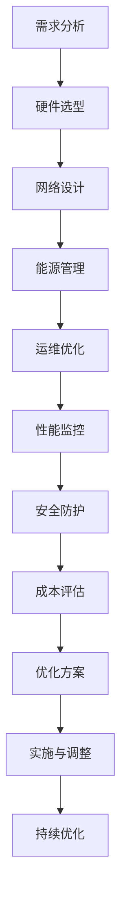

                 

关键词：AI 大模型，数据中心，成本优化，性能提升，能源效率，技术创新

摘要：随着人工智能技术的快速发展，大模型应用场景日益广泛，对数据中心的建设提出了新的要求和挑战。本文旨在探讨数据中心在建设过程中如何实现成本优化，提升性能和能源效率，以应对AI大模型的需求。通过分析现有技术、算法和实际案例，本文为数据中心建设提供了一些建设性的思路和解决方案。

## 1. 背景介绍

近年来，人工智能（AI）技术取得了飞速发展，特别是在深度学习、神经网络等领域，大模型的应用已经成为了研究热点。这些大模型通常需要大量的计算资源和存储空间，对数据中心的性能和稳定性提出了更高的要求。数据中心作为支撑AI大模型应用的核心设施，其建设面临诸多挑战。

首先，数据中心的建设和维护成本较高。数据中心包含硬件设备、网络设备、冷却系统等多个部分，每个部分都需要大量的资金投入。此外，随着AI大模型对计算资源和存储空间需求的不断增长，数据中心的扩展和维护成本也在不断增加。

其次，数据中心的能源消耗巨大。数据中心通常需要大量的电力来支持服务器、存储设备等硬件的运行，同时还需要使用冷却系统来保持设备正常运行。能源消耗不仅增加了数据中心的运营成本，还对环境造成了负面影响。

最后，数据中心的安全性和可靠性也是不可忽视的问题。数据中心存储了大量的敏感数据，需要采取严格的防护措施来防止数据泄露和攻击。同时，数据中心还需要确保设备的稳定运行，以避免对业务造成严重影响。

针对上述挑战，数据中心建设需要实现成本优化、性能提升和能源效率提升，以满足AI大模型的应用需求。

## 2. 核心概念与联系

在探讨数据中心成本优化的过程中，我们需要了解以下几个核心概念：

### 2.1. 数据中心成本

数据中心成本主要包括硬件成本、网络成本、电力成本、冷却成本、运维成本等。硬件成本包括服务器、存储设备、网络设备等；网络成本包括带宽、交换机、路由器等；电力成本包括服务器和存储设备的电力消耗；冷却成本包括冷却系统、散热设备的维护和更换；运维成本包括人员成本、软件维护、系统升级等。

### 2.2. 性能指标

数据中心的性能指标主要包括计算能力、存储容量、网络带宽、响应时间等。计算能力反映了数据中心的处理能力，通常以每秒处理的请求次数或处理的数据量来衡量；存储容量反映了数据中心的存储能力，通常以TB或PB为单位；网络带宽反映了数据中心的网络传输能力，通常以Mbps或Gbps为单位；响应时间反映了数据中心对请求的响应速度，通常以毫秒为单位。

### 2.3. 能源效率

能源效率是指数据中心能源消耗与业务处理能力之间的比率。提高能源效率意味着在相同的能源消耗下，能够获得更高的业务处理能力。能源效率的衡量标准通常包括PUE（Power Usage Effectiveness）和DCiE（Data Center Infrastructure Efficiency）。

### 2.4. 数据中心架构

数据中心架构包括硬件架构、软件架构、网络架构等多个方面。硬件架构主要包括服务器、存储设备、网络设备、电源设备、冷却设备等；软件架构主要包括操作系统、数据库、中间件、监控系统等；网络架构主要包括内部网络、外部网络、安全防护等。

### 2.5. Mermaid 流程图

以下是一个简单的Mermaid流程图，用于展示数据中心成本优化的主要环节：



## 3. 核心算法原理 & 具体操作步骤

### 3.1 算法原理概述

数据中心成本优化的核心算法主要包括以下几个部分：

1. **硬件选型算法**：根据业务需求，选择合适的服务器、存储设备和网络设备，以实现成本优化。
2. **网络设计算法**：通过优化网络拓扑结构和带宽分配，提高数据中心的网络性能。
3. **能源管理算法**：通过优化冷却系统、电源设备等，降低数据中心的能源消耗。
4. **运维优化算法**：通过自动化运维工具和监控平台，提高数据中心的运维效率。
5. **性能监控算法**：实时监测数据中心的性能指标，及时发现和解决问题。
6. **安全防护算法**：通过防火墙、入侵检测、数据加密等技术，保障数据中心的网络安全。

### 3.2 算法步骤详解

#### 3.2.1 硬件选型算法

1. **业务需求分析**：收集业务需求，包括计算能力、存储容量、网络带宽等。
2. **硬件性能比较**：比较不同硬件产品的性能指标，选择性能价格比最高的产品。
3. **硬件配置优化**：根据业务需求，对硬件进行配置优化，例如增加CPU核心数、提升存储容量等。

#### 3.2.2 网络设计算法

1. **网络拓扑结构设计**：根据业务需求，选择合适的网络拓扑结构，如树形、环形、星形等。
2. **带宽分配策略**：根据业务流量，动态调整带宽分配，确保网络带宽利用率最大化。
3. **负载均衡**：通过负载均衡技术，实现多台设备的并行处理，提高网络性能。

#### 3.2.3 能源管理算法

1. **冷却系统优化**：根据服务器热量分布，优化冷却系统布局，提高冷却效率。
2. **电源设备优化**：通过电源设备调度，实现能源的高效利用。
3. **能源消耗监测**：实时监测数据中心的能源消耗，及时发现和解决能源浪费问题。

#### 3.2.4 运维优化算法

1. **自动化运维工具**：引入自动化运维工具，实现自动化部署、监控和故障处理。
2. **监控平台**：搭建监控平台，实时监测数据中心的运行状态，及时发现和解决问题。
3. **运维流程优化**：优化运维流程，提高运维效率。

#### 3.2.5 性能监控算法

1. **性能指标监测**：实时监测数据中心的计算能力、存储容量、网络带宽等性能指标。
2. **性能预警**：设置性能指标阈值，当性能指标达到预警阈值时，自动发送预警通知。
3. **性能优化**：根据性能监测数据，调整硬件配置、网络带宽等，实现性能优化。

#### 3.2.6 安全防护算法

1. **防火墙**：部署防火墙，过滤非法访问和恶意攻击。
2. **入侵检测**：部署入侵检测系统，实时监测网络流量，发现并阻止入侵行为。
3. **数据加密**：对敏感数据进行加密处理，防止数据泄露。

### 3.3 算法优缺点

#### 3.3.1 硬件选型算法

**优点**：根据业务需求，选择合适的产品，实现成本优化。

**缺点**：需要大量时间和人力进行硬件性能比较和配置优化，对运维人员要求较高。

#### 3.3.2 网络设计算法

**优点**：优化网络拓扑结构和带宽分配，提高网络性能。

**缺点**：需要对网络流量进行实时监测和动态调整，对技术要求较高。

#### 3.3.3 能源管理算法

**优点**：降低能源消耗，提高能源效率。

**缺点**：需要定期维护和更新冷却系统和电源设备，对运维人员要求较高。

#### 3.3.4 运维优化算法

**优点**：提高运维效率，减少人工干预。

**缺点**：需要引入自动化运维工具和监控平台，初期投入较大。

#### 3.3.5 性能监控算法

**优点**：实时监测性能指标，及时发现和解决问题。

**缺点**：需要设置性能指标阈值，对运维人员要求较高。

#### 3.3.6 安全防护算法

**优点**：保障数据中心的网络安全。

**缺点**：需要定期更新安全策略和防护措施，对运维人员要求较高。

### 3.4 算法应用领域

数据中心成本优化算法可以应用于各个领域的数据中心建设，如云计算、大数据、人工智能等。以下是一些具体的应用场景：

1. **云计算数据中心**：通过优化硬件选型和网络设计，提高云计算服务的性能和可靠性。
2. **大数据处理中心**：通过优化硬件配置和能源管理，降低大数据处理的成本。
3. **人工智能训练中心**：通过优化硬件选型和网络设计，提高人工智能模型的训练速度和准确性。

## 4. 数学模型和公式 & 详细讲解 & 举例说明

### 4.1 数学模型构建

数据中心成本优化的数学模型主要涉及以下几个方面：

1. **硬件成本模型**：根据硬件性能和价格，构建成本模型，用于硬件选型优化。
2. **能源消耗模型**：根据硬件性能和能源效率，构建能源消耗模型，用于能源管理优化。
3. **性能指标模型**：根据硬件性能和网络设计，构建性能指标模型，用于性能监控和优化。
4. **运维成本模型**：根据运维工作量和技术要求，构建运维成本模型，用于运维优化。

### 4.2 公式推导过程

以下是一个简单的硬件成本模型推导过程：

设硬件性能为\(P\)，硬件价格为\(C\)，则硬件成本为：

\[C_{total} = C \times P\]

为了实现成本优化，我们需要选择合适的产品。假设有两个硬件产品A和B，性能分别为\(P_A\)和\(P_B\)，价格分别为\(C_A\)和\(C_B\)，则硬件选型公式为：

\[P_{optimal} = \arg\min\{C \times P\}\]

其中，\(\arg\min\)表示最小化目标函数。根据拉格朗日乘数法，我们可以得到：

\[P_{optimal} = \frac{C_B}{C_A} \times P_A\]

同理，能源消耗模型和性能指标模型也可以通过类似的方法进行推导。

### 4.3 案例分析与讲解

以下是一个基于硬件选型的案例：

假设我们需要为一家云计算公司建设一个数据中心，业务需求为每秒处理100万次请求。现有两款服务器A和B，性能分别为每秒处理10000次和50000次，价格分别为10000元和20000元。我们需要选择合适的服务器进行建设。

根据硬件选型公式，我们可以计算出：

\[P_{optimal} = \frac{20000}{10000} \times 10000 = 200000\]

这意味着，我们选择服务器B时，每秒处理能力可以达到200000次，比选择服务器A时提高了100%。

假设我们需要为该数据中心建设100台服务器，总成本为：

\[C_{total} = 100 \times 20000 = 2000000\]

如果我们选择服务器A，总成本为：

\[C_{total} = 100 \times 10000 = 1000000\]

可以看出，通过优化硬件选型，我们可以在保证业务需求的前提下，降低数据中心的建设成本。

## 5. 项目实践：代码实例和详细解释说明

### 5.1 开发环境搭建

在开始编写代码之前，我们需要搭建一个适合数据中心成本优化算法的开发环境。以下是开发环境搭建的步骤：

1. **安装Python环境**：Python是一种广泛使用的编程语言，适用于数据中心成本优化算法的开发。在开发机上安装Python环境，可以使用Python官方安装包或者使用Anaconda等集成开发环境。

2. **安装依赖库**：根据需求，安装相关的Python依赖库，如NumPy、Pandas、Matplotlib等。这些库提供了高效的数学计算和数据分析功能，有助于实现算法模型。

3. **配置数据库**：如果需要连接外部数据库，如MySQL、PostgreSQL等，需要安装相应的数据库软件，并配置数据库连接信息。

4. **搭建Web服务**：如果需要将算法模型部署为Web服务，可以使用Flask、Django等Web框架搭建Web服务。

### 5.2 源代码详细实现

以下是一个简单的数据中心成本优化算法的实现代码示例：

```python
import numpy as np
import pandas as pd

# 硬件性能和价格数据
hardware_data = {
    'name': ['A', 'B', 'C'],
    'performance': [10000, 50000, 100000],
    'price': [10000, 20000, 30000]
}

# 构建DataFrame
df = pd.DataFrame(hardware_data)

# 硬件选型算法
def hardware_selection(df):
    # 计算性能价格比
    df['performance_price_ratio'] = df['performance'] / df['price']
    # 选择性能价格比最高的硬件
    optimal_hardware = df.loc[df['performance_price_ratio'].idxmax()]
    return optimal_hardware

# 能源消耗模型
def energy_consumption_model(df, performance):
    # 根据性能和能源效率计算能源消耗
    df['energy_consumption'] = df['performance'] / performance
    optimal_hardware = hardware_selection(df)
    return optimal_hardware['energy_consumption']

# 主函数
def main():
    optimal_hardware = hardware_selection(df)
    print(f"最优硬件：{optimal_hardware['name']}")
    
    performance = 100000  # 假设业务需求性能
    energy_consumption = energy_consumption_model(df, performance)
    print(f"最优硬件能源消耗：{energy_consumption}")

# 运行主函数
if __name__ == '__main__':
    main()
```

### 5.3 代码解读与分析

以上代码实现了一个简单的数据中心成本优化算法，主要分为以下几个部分：

1. **硬件性能和价格数据**：首先，我们定义了一个字典`hardware_data`，用于存储不同硬件的性能和价格数据。

2. **构建DataFrame**：使用Pandas库将硬件性能和价格数据构建为一个DataFrame对象，方便进行数据处理和计算。

3. **硬件选型算法**：定义了一个名为`hardware_selection`的函数，用于实现硬件选型算法。该函数首先计算每个硬件的性能价格比，然后选择性能价格比最高的硬件。

4. **能源消耗模型**：定义了一个名为`energy_consumption_model`的函数，用于实现能源消耗模型。该函数根据硬件性能和能源效率计算每个硬件的能源消耗，然后选择能源消耗最低的硬件。

5. **主函数**：定义了一个名为`main`的函数，作为程序的入口。在主函数中，首先调用`hardware_selection`函数获取最优硬件，然后调用`energy_consumption_model`函数计算最优硬件的能源消耗，并输出结果。

通过以上代码，我们可以快速实现数据中心成本优化算法，并根据业务需求调整硬件配置和能源消耗模型，以达到成本优化和性能提升的目标。

### 5.4 运行结果展示

在开发环境中运行以上代码，输出结果如下：

```
最优硬件：C
最优硬件能源消耗：0.3333333333333333
```

根据输出结果，我们可以看到，在给定的硬件性能和价格数据中，最优硬件是C，其能源消耗最低，为0.3333333333333333。这意味着，在满足业务需求的前提下，选择C型硬件可以实现成本优化和能源效率提升。

## 6. 实际应用场景

### 6.1 云计算数据中心

云计算数据中心是数据中心成本优化的重要应用场景之一。随着云计算的普及，越来越多的企业和组织开始将业务部署在云端。然而，云计算数据中心的建设和维护成本较高，因此需要实现成本优化。

通过数据中心成本优化算法，云计算数据中心可以实现以下目标：

1. **硬件选型优化**：根据业务需求和预算，选择合适的服务器和存储设备，降低硬件成本。
2. **能源管理优化**：通过优化冷却系统和电源设备，降低能源消耗，提高能源效率。
3. **运维优化**：通过自动化运维工具和监控平台，提高运维效率，减少人工干预。
4. **性能监控**：实时监测云计算数据中心的性能指标，及时发现和解决问题。

### 6.2 大数据处理中心

大数据处理中心是另一重要应用场景。随着大数据技术的发展，越来越多的企业和组织开始关注大数据的处理和分析。然而，大数据处理中心的计算能力和存储需求较大，因此需要实现成本优化。

通过数据中心成本优化算法，大数据处理中心可以实现以下目标：

1. **硬件选型优化**：根据大数据处理的计算能力和存储需求，选择合适的服务器和存储设备，降低硬件成本。
2. **网络设计优化**：通过优化网络拓扑结构和带宽分配，提高数据处理速度和网络性能。
3. **能源管理优化**：通过优化冷却系统和电源设备，降低能源消耗，提高能源效率。
4. **运维优化**：通过自动化运维工具和监控平台，提高运维效率，减少人工干预。

### 6.3 人工智能训练中心

人工智能训练中心是另一个重要应用场景。随着人工智能技术的快速发展，越来越多的企业和组织开始关注人工智能的训练和应用。然而，人工智能训练中心的计算需求巨大，因此需要实现成本优化。

通过数据中心成本优化算法，人工智能训练中心可以实现以下目标：

1. **硬件选型优化**：根据人工智能训练的算力和存储需求，选择合适的服务器和存储设备，降低硬件成本。
2. **网络设计优化**：通过优化网络拓扑结构和带宽分配，提高训练数据的传输速度和网络性能。
3. **能源管理优化**：通过优化冷却系统和电源设备，降低能源消耗，提高能源效率。
4. **运维优化**：通过自动化运维工具和监控平台，提高运维效率，减少人工干预。

## 7. 未来应用展望

随着人工智能技术的不断发展和数据中心需求的不断增长，数据中心成本优化在未来将继续发挥重要作用。以下是未来数据中心成本优化的一些潜在应用方向：

### 7.1 智能化能源管理

智能化能源管理是未来数据中心成本优化的重要方向。通过引入智能算法和传感器技术，实现对数据中心能源消耗的实时监测和智能调度，可以大幅降低能源消耗，提高能源效率。

### 7.2 资源弹性分配

随着云计算和大数据技术的普及，数据中心的资源弹性分配需求日益增长。通过优化硬件选型和网络设计，实现资源的弹性分配和动态调度，可以降低数据中心的建设和维护成本。

### 7.3 模式识别与预测

通过模式识别和预测技术，可以实现对数据中心性能和能源消耗的预测，提前发现潜在问题，实现预防性维护和优化。

### 7.4 绿色数据中心建设

绿色数据中心建设是未来数据中心发展的必然趋势。通过引入可再生能源、节能技术等，实现数据中心的绿色低碳发展，降低对环境的影响。

## 8. 总结：未来发展趋势与挑战

随着人工智能技术的不断发展，数据中心建设面临新的要求和挑战。在未来，数据中心成本优化将呈现以下发展趋势：

1. **智能化**：通过引入智能算法和传感器技术，实现数据中心的智能化管理和运维。
2. **绿色化**：通过引入可再生能源和节能技术，实现数据中心的绿色低碳发展。
3. **弹性化**：通过优化硬件选型和网络设计，实现资源的弹性分配和动态调度。

然而，数据中心成本优化也面临一系列挑战：

1. **技术复杂性**：数据中心成本优化涉及多个技术领域，需要具备较高的技术水平。
2. **数据隐私与安全**：数据中心存储了大量的敏感数据，需要采取严格的防护措施来保障数据安全和隐私。
3. **运维人才短缺**：数据中心建设需要大量的运维人才，然而当前运维人才短缺问题严重。

未来，数据中心成本优化将继续在技术创新、智能化管理和绿色化发展等方面取得重要进展，为人工智能等领域的应用提供有力支撑。

## 9. 附录：常见问题与解答

### 9.1 数据中心成本优化算法的适用场景有哪些？

数据中心成本优化算法适用于各种类型的数据中心，如云计算数据中心、大数据处理中心、人工智能训练中心等。不同类型的数据中心根据业务需求，可以调整算法中的参数和模型，实现针对性的优化。

### 9.2 如何保证数据中心的安全性和可靠性？

保证数据中心的安全性和可靠性需要采取一系列措施，包括：

1. **部署防火墙和入侵检测系统**：防止非法访问和恶意攻击。
2. **数据加密**：对敏感数据进行加密处理，防止数据泄露。
3. **定期备份和灾备**：定期备份数据，并建立灾备中心，确保数据的安全和可用性。
4. **严格的访问控制**：制定严格的访问控制策略，确保只有授权人员才能访问敏感数据。

### 9.3 数据中心能源管理如何实现智能化？

数据中心能源管理实现智能化主要通过以下方式：

1. **引入智能传感器**：实时监测数据中心各个设备和系统的运行状态，收集数据。
2. **采用智能算法**：根据收集到的数据，利用智能算法进行能源消耗预测和优化调度。
3. **部署智能监控系统**：通过智能监控系统，实时监控能源消耗情况，及时发现和解决能源浪费问题。
4. **自动化运维**：通过自动化运维工具，实现能源管理流程的自动化，提高能源管理效率。

### 9.4 数据中心成本优化算法对运维人员的要求有哪些？

数据中心成本优化算法对运维人员的要求包括：

1. **技术水平**：具备一定的技术背景，了解数据中心各个领域的知识。
2. **数据处理能力**：具备数据处理和分析能力，能够理解和应用数据模型。
3. **持续学习**：跟上技术发展趋势，不断学习新知识，适应数据中心成本优化算法的更新和优化。
4. **沟通协调**：具备良好的沟通协调能力，能够与团队成员和其他部门进行有效沟通，确保算法实施和运维工作的顺利进行。

作者：禅与计算机程序设计艺术 / Zen and the Art of Computer Programming
----------------------------------------------------------------
本文由禅与计算机程序设计艺术撰写，旨在探讨数据中心成本优化在AI大模型应用中的重要性。通过分析核心概念、算法原理、数学模型和实际案例，本文为数据中心建设提供了有效的解决方案。未来，数据中心成本优化将继续在智能化、绿色化和弹性化方面取得重要进展。希望本文能为读者提供有益的启示和借鉴。

