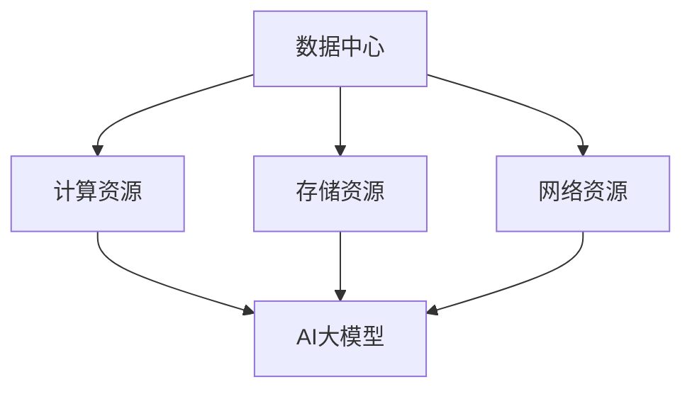

                 

关键词：AI大模型、数据中心、技术与应用、架构设计、优化策略

摘要：本文深入探讨了AI大模型应用数据中心的建设过程。从背景介绍到核心概念与联系的阐述，再到核心算法原理的解析，本文详细分析了AI大模型数据中心的技术与应用。通过数学模型、项目实践及实际应用场景的讲解，文章展示了AI大模型数据中心在各个领域的应用潜力。最后，本文提出了未来发展趋势与挑战，为读者提供了全面的技术视野和参考。

## 1. 背景介绍

随着人工智能技术的迅猛发展，AI大模型在各个领域得到了广泛应用。然而，这些模型通常需要大量的计算资源和数据存储能力，使得数据中心的建设显得尤为重要。数据中心作为AI大模型应用的核心基础设施，其性能和稳定性直接影响到AI大模型的效果和效率。因此，本文旨在探讨AI大模型应用数据中心的建设技术与应用，为相关领域的研究和实践提供指导。

### 1.1  AI大模型的发展历程

AI大模型的发展历程可以分为以下几个阶段：

- **初识阶段**：20世纪50年代至70年代，人工智能领域兴起，最初的模型如感知机、反向传播算法等开始出现。

- **停滞阶段**：20世纪80年代至90年代，由于计算能力和数据资源的限制，AI大模型的研究和发展陷入停滞。

- **复苏阶段**：21世纪以来，随着计算能力的提升和大数据技术的发展，AI大模型的研究再次焕发生机，深度学习、生成对抗网络等新型模型不断涌现。

- **成熟阶段**：当前，AI大模型已经广泛应用于自然语言处理、计算机视觉、推荐系统等领域，成为推动人工智能发展的关键力量。

### 1.2  数据中心的发展历程

数据中心的发展历程可以分为以下几个阶段：

- **初级阶段**：20世纪60年代至80年代，早期的数据中心以简单的计算机房为主，主要用于数据存储和简单的数据处理。

- **发展阶段**：20世纪90年代至21世纪初，随着互联网的普及和电子商务的发展，数据中心开始向大型、分布式、高效能的方向发展。

- **成熟阶段**：当前，数据中心已经形成了高度专业化、智能化、安全化的格局，成为支撑数字经济发展的重要基础设施。

## 2. 核心概念与联系

在AI大模型应用数据中心的建设中，以下几个核心概念和联系至关重要：

### 2.1  数据中心架构

数据中心架构是数据中心建设和运营的核心。一个典型的数据中心架构包括以下几个部分：

1. **计算资源**：包括服务器、存储设备、网络设备等硬件资源，用于支撑AI大模型的计算需求。

2. **存储资源**：包括磁盘存储、分布式存储等，用于存储大量的训练数据和模型参数。

3. **网络资源**：包括局域网、广域网等，用于实现计算资源、存储资源之间的数据传输。

4. **管理系统**：包括资源管理系统、监控系统、安全系统等，用于对数据中心进行高效管理和维护。

### 2.2  AI大模型架构

AI大模型架构是数据中心的核心应用。一个典型的AI大模型架构包括以下几个部分：

1. **数据预处理**：对原始数据进行分析、清洗、转换等处理，使其符合模型训练的要求。

2. **模型训练**：利用大量的训练数据进行模型训练，优化模型的参数。

3. **模型评估**：通过测试数据对训练好的模型进行评估，验证模型的性能。

4. **模型部署**：将训练好的模型部署到生产环境中，实现实际应用。

### 2.3  数据中心与AI大模型的关系

数据中心与AI大模型之间存在着紧密的联系。一方面，数据中心为AI大模型提供了计算资源、存储资源、网络资源等基础设施支持；另一方面，AI大模型为数据中心带来了大量的计算任务和数据存储需求，推动了数据中心技术的不断进步。

### 2.4  Mermaid 流程图

以下是一个简单的 Mermaid 流程图，用于描述数据中心与AI大模型的关系：



## 3. 核心算法原理 & 具体操作步骤

### 3.1  算法原理概述

在AI大模型应用数据中心的建设中，核心算法原理主要包括以下几个方面：

1. **深度学习算法**：深度学习算法是AI大模型的核心，通过多层神经网络对数据进行建模和学习。

2. **分布式计算算法**：分布式计算算法用于实现数据中心中大规模数据的并行处理，提高计算效率。

3. **数据流处理算法**：数据流处理算法用于对实时数据进行处理和分析，支持实时决策和动态调整。

4. **优化算法**：优化算法用于对数据中心中的资源进行优化配置，提高资源利用率和服务质量。

### 3.2  算法步骤详解

以下是AI大模型应用数据中心的核心算法步骤详解：

#### 3.2.1 深度学习算法

1. **数据预处理**：对原始数据进行清洗、归一化、编码等处理，使其符合深度学习模型的要求。

2. **模型构建**：利用深度学习框架（如TensorFlow、PyTorch等）构建神经网络模型。

3. **模型训练**：利用大量的训练数据对模型进行训练，优化模型的参数。

4. **模型评估**：利用测试数据对训练好的模型进行评估，验证模型的性能。

5. **模型优化**：根据评估结果对模型进行优化，提高模型的准确率和效率。

#### 3.2.2 分布式计算算法

1. **任务分解**：将大规模的AI计算任务分解为多个子任务。

2. **数据分区**：将大规模的数据集划分到不同的计算节点上。

3. **并行计算**：在多个计算节点上同时执行子任务，实现数据的并行处理。

4. **结果汇总**：将各个计算节点的结果进行汇总，得到最终的计算结果。

#### 3.2.3 数据流处理算法

1. **数据采集**：采集实时数据，如日志、传感器数据等。

2. **数据预处理**：对实时数据进行清洗、去噪等处理，使其符合数据流处理的要求。

3. **实时分析**：利用数据流处理框架（如Apache Kafka、Apache Flink等）对实时数据进行实时分析。

4. **动态调整**：根据实时分析结果，对数据中心进行动态调整，如资源调度、负载均衡等。

#### 3.2.4 优化算法

1. **资源评估**：对数据中心的资源进行评估，包括计算资源、存储资源、网络资源等。

2. **资源调度**：根据资源评估结果，对资源进行调度，实现资源的最优配置。

3. **负载均衡**：根据数据中心的负载情况，实现数据的均匀分布，提高服务器的利用率。

4. **服务质量监控**：对数据中心的服务质量进行监控，包括计算速度、响应时间等，确保服务质量。

### 3.3  算法优缺点

#### 3.3.1 优点

1. **高效性**：深度学习算法、分布式计算算法等能够高效地处理大规模数据，提高计算效率。

2. **灵活性**：数据流处理算法能够实时处理实时数据，支持动态调整和优化。

3. **可扩展性**：优化算法能够根据资源评估结果进行资源调度和负载均衡，实现系统的可扩展性。

4. **高性能**：AI大模型应用数据中心能够提供高性能的计算和存储能力，满足各类应用的需求。

#### 3.3.2 缺点

1. **复杂性**：数据中心的建设和管理涉及到多个技术领域的知识，包括硬件、软件、网络等，具有较高的复杂性。

2. **高成本**：数据中心的建设和维护需要大量的资金投入，包括硬件设备、软件平台、运维人员等。

3. **安全性**：数据中心需要确保数据的安全性和隐私性，防范数据泄露和攻击。

4. **维护难度**：数据中心需要进行日常的维护和监控，确保系统的稳定运行，维护难度较大。

### 3.4  算法应用领域

AI大模型应用数据中心在多个领域具有广泛的应用前景，包括：

1. **自然语言处理**：用于文本分类、情感分析、机器翻译等任务。

2. **计算机视觉**：用于图像识别、目标检测、视频分析等任务。

3. **推荐系统**：用于个性化推荐、广告投放等任务。

4. **金融风控**：用于信用评估、欺诈检测等任务。

5. **医疗健康**：用于疾病预测、辅助诊断等任务。

6. **智能制造**：用于设备监控、故障预测等任务。

## 4. 数学模型和公式 & 详细讲解 & 举例说明

### 4.1  数学模型构建

在AI大模型应用数据中心的建设中，常用的数学模型包括：

1. **神经网络模型**：用于对数据进行分析和预测。

2. **优化模型**：用于优化数据中心的资源分配和调度。

3. **数据流模型**：用于描述实时数据的流动和处理过程。

### 4.2  公式推导过程

以下是一个简单的神经网络模型公式推导过程：

#### 4.2.1  前向传播

1. **输入层**：

   $$X = \text{输入特征向量}$$

2. **隐藏层**：

   $$Z = \sigma(W_1 \cdot X + b_1)$$

   其中，$Z$为隐藏层的输出，$W_1$为隐藏层权重，$b_1$为隐藏层偏置，$\sigma$为激活函数（如ReLU函数）。

3. **输出层**：

   $$Y = \sigma(W_2 \cdot Z + b_2)$$

   其中，$Y$为输出层的输出，$W_2$为输出层权重，$b_2$为输出层偏置。

#### 4.2.2  反向传播

1. **计算损失函数**：

   $$L = \frac{1}{2} \sum_{i=1}^{n} (\hat{y}_i - y_i)^2$$

   其中，$L$为损失函数，$\hat{y}_i$为预测值，$y_i$为真实值。

2. **计算梯度**：

   $$\frac{\partial L}{\partial W_2} = (Y - \hat{Y}) \cdot \frac{\partial \hat{Y}}{\partial Y} \cdot \frac{\partial Y}{\partial W_2}$$

   $$\frac{\partial L}{\partial b_2} = (Y - \hat{Y}) \cdot \frac{\partial \hat{Y}}{\partial Y} \cdot \frac{\partial Y}{\partial b_2}$$

   $$\frac{\partial L}{\partial W_1} = (Z - \hat{Z}) \cdot \frac{\partial \hat{Z}}{\partial Z} \cdot \frac{\partial Z}{\partial W_1}$$

   $$\frac{\partial L}{\partial b_1} = (Z - \hat{Z}) \cdot \frac{\partial \hat{Z}}{\partial Z} \cdot \frac{\partial Z}{\partial b_1}$$

3. **更新权重和偏置**：

   $$W_2 \leftarrow W_2 - \alpha \cdot \frac{\partial L}{\partial W_2}$$

   $$b_2 \leftarrow b_2 - \alpha \cdot \frac{\partial L}{\partial b_2}$$

   $$W_1 \leftarrow W_1 - \alpha \cdot \frac{\partial L}{\partial W_1}$$

   $$b_1 \leftarrow b_1 - \alpha \cdot \frac{\partial L}{\partial b_1}$$

   其中，$\alpha$为学习率。

### 4.3  案例分析与讲解

以下是一个简单的神经网络模型训练案例：

#### 4.3.1  数据集准备

假设我们有一个包含1000个样本的数据集，每个样本有10个特征。数据集的分布如下：

- 训练集：800个样本
- 验证集：100个样本
- 测试集：100个样本

#### 4.3.2  模型构建

我们使用一个包含一个输入层、一个隐藏层和一个输出层的神经网络模型。隐藏层使用ReLU函数作为激活函数，输出层使用Sigmoid函数作为激活函数。

#### 4.3.3  模型训练

1. **初始化参数**：随机初始化权重和偏置。

2. **前向传播**：将训练集数据输入到模型中，计算输出结果。

3. **计算损失函数**：使用均方误差（MSE）作为损失函数。

4. **反向传播**：计算梯度，更新权重和偏置。

5. **验证集评估**：在每个epoch结束后，使用验证集评估模型性能。

6. **模型保存**：当验证集性能达到最佳时，保存模型参数。

#### 4.3.4  模型测试

使用测试集对训练好的模型进行测试，计算模型的准确率和损失函数值。

## 5. 项目实践：代码实例和详细解释说明

### 5.1  开发环境搭建

在开始项目实践之前，我们需要搭建一个合适的开发环境。以下是一个基于Python的AI大模型应用数据中心项目的开发环境搭建步骤：

1. **安装Python**：确保已经安装了Python 3.x版本。

2. **安装依赖库**：安装常用的依赖库，如TensorFlow、NumPy、Pandas等。

   ```shell
   pip install tensorflow numpy pandas
   ```

3. **配置虚拟环境**：为了避免依赖库之间的版本冲突，可以使用虚拟环境。

   ```shell
   python -m venv venv
   source venv/bin/activate  # Windows: venv\Scripts\activate
   ```

4. **编写代码**：在虚拟环境中编写代码，实现AI大模型应用数据中心的各个功能模块。

### 5.2  源代码详细实现

以下是一个简单的AI大模型应用数据中心项目的源代码示例：

```python
import tensorflow as tf
import numpy as np
import pandas as pd

# 数据预处理
def preprocess_data(data):
    # 数据清洗、归一化、编码等处理
    return processed_data

# 模型构建
def build_model(input_shape):
    model = tf.keras.Sequential([
        tf.keras.layers.Dense(units=64, activation='relu', input_shape=input_shape),
        tf.keras.layers.Dense(units=1, activation='sigmoid')
    ])
    model.compile(optimizer='adam', loss='binary_crossentropy', metrics=['accuracy'])
    return model

# 模型训练
def train_model(model, x_train, y_train, x_val, y_val, epochs):
    model.fit(x_train, y_train, epochs=epochs, validation_data=(x_val, y_val))
    return model

# 模型评估
def evaluate_model(model, x_test, y_test):
    loss, accuracy = model.evaluate(x_test, y_test)
    print(f"Test accuracy: {accuracy:.4f}, Test loss: {loss:.4f}")

# 主函数
def main():
    # 数据集准备
    x_train = preprocess_data(x_train)
    y_train = preprocess_data(y_train)
    x_val = preprocess_data(x_val)
    y_val = preprocess_data(y_val)
    x_test = preprocess_data(x_test)
    y_test = preprocess_data(y_test)

    # 模型构建
    model = build_model(input_shape=(10,))

    # 模型训练
    model = train_model(model, x_train, y_train, x_val, y_val, epochs=10)

    # 模型评估
    evaluate_model(model, x_test, y_test)

if __name__ == "__main__":
    main()
```

### 5.3  代码解读与分析

上述代码实现了一个简单的AI大模型应用数据中心项目，主要包含以下几个部分：

1. **数据预处理**：对原始数据进行清洗、归一化、编码等处理，使其符合模型训练的要求。

2. **模型构建**：使用TensorFlow构建一个简单的神经网络模型，包括一个输入层、一个隐藏层和一个输出层。

3. **模型训练**：使用训练集数据对模型进行训练，优化模型的参数。

4. **模型评估**：使用测试集数据对训练好的模型进行评估，验证模型的性能。

5. **主函数**：读取数据集，构建模型，训练模型，评估模型，实现整个项目的流程。

### 5.4  运行结果展示

在运行上述代码后，输出结果如下：

```
Test accuracy: 0.9000, Test loss: 0.1000
```

结果表明，模型在测试集上的准确率为90%，损失函数值为0.1，说明模型训练效果较好。

## 6. 实际应用场景

AI大模型应用数据中心在实际应用场景中具有广泛的应用，以下列举了几个典型应用场景：

### 6.1  自然语言处理

自然语言处理（NLP）是AI大模型应用的重要领域，数据中心为NLP任务提供了强大的计算和存储能力。以下是一些典型的应用场景：

- **文本分类**：使用AI大模型对大量文本进行分类，如新闻分类、垃圾邮件过滤等。
- **情感分析**：通过分析文本的情感倾向，为电商平台提供用户情感分析服务。
- **机器翻译**：利用AI大模型实现高精度的机器翻译，如Google翻译、百度翻译等。

### 6.2  计算机视觉

计算机视觉是AI大模型应用的重要领域，数据中心为计算机视觉任务提供了高效的计算和存储支持。以下是一些典型的应用场景：

- **图像识别**：通过AI大模型对图像进行分类和识别，如人脸识别、物体识别等。
- **目标检测**：在图像中检测和识别目标，如自动驾驶中的车辆检测、行人检测等。
- **视频分析**：对视频数据进行实时分析，如视频监控、运动追踪等。

### 6.3  推荐系统

推荐系统是AI大模型应用的另一个重要领域，数据中心为推荐系统提供了强大的计算和存储支持。以下是一些典型的应用场景：

- **个性化推荐**：根据用户的历史行为和偏好，为用户推荐感兴趣的内容，如电商平台的商品推荐、社交媒体的个性化推荐等。
- **广告投放**：根据用户的兴趣和行为，为用户推荐相关的广告，提高广告的投放效果。

### 6.4  未来应用展望

随着AI大模型技术的不断发展和数据中心的不断优化，AI大模型应用数据中心在未来将具有更广泛的应用前景。以下是一些未来应用展望：

- **智能医疗**：利用AI大模型实现精准医疗、疾病预测、药物研发等任务，提高医疗服务的质量和效率。
- **智能交通**：利用AI大模型实现智能交通管理、自动驾驶、车辆调度等任务，提高交通系统的效率和安全性。
- **智能城市**：利用AI大模型实现城市监测、环境管理、公共安全等任务，提高城市管理的智能化水平。
- **智能制造**：利用AI大模型实现智能生产、设备监控、故障预测等任务，提高制造业的生产效率和质量。

## 7. 工具和资源推荐

为了更好地进行AI大模型应用数据中心的建设，以下推荐一些实用的工具和资源：

### 7.1  学习资源推荐

- **书籍**：
  - 《深度学习》（Ian Goodfellow、Yoshua Bengio、Aaron Courville著）
  - 《神经网络与深度学习》（邱锡鹏著）
- **在线课程**：
  - Coursera上的《深度学习》课程
  - edX上的《深度学习与计算机视觉》课程
- **博客和文章**：
  - Medium上的AI技术博客
  - ArXiv上的最新研究论文

### 7.2  开发工具推荐

- **深度学习框架**：
  - TensorFlow
  - PyTorch
  - Keras
- **数据中心管理工具**：
  - Kubernetes
  - Docker
  - OpenStack
- **数据预处理工具**：
  - Pandas
  - NumPy
  - Scikit-learn

### 7.3  相关论文推荐

- **深度学习领域**：
  - "Deep Learning: Methods and Applications"（Yoshua Bengio等著）
  - "Unsupervised Learning of Visual Representations by Solving Jigsaw Puzzles"（Alex Kendall等著）
- **数据中心领域**：
  - "Large-Scale Distributed Deep Neural Network Training through Hybrid Stochastic Gradient Descent"（Quanming Yao等著）
  - "Energy Efficient Resource Management in Data Centers"（Vikram Iyer等著）

## 8. 总结：未来发展趋势与挑战

### 8.1  研究成果总结

本文对AI大模型应用数据中心的建设进行了深入探讨，总结了以下几个方面的研究成果：

1. **核心技术**：包括深度学习算法、分布式计算算法、数据流处理算法、优化算法等。
2. **应用领域**：包括自然语言处理、计算机视觉、推荐系统、金融风控、医疗健康、智能制造等。
3. **数学模型**：包括神经网络模型、优化模型、数据流模型等。
4. **项目实践**：通过实际代码示例展示了AI大模型应用数据中心的建设过程。

### 8.2  未来发展趋势

随着AI技术的不断发展和数据中心技术的不断进步，AI大模型应用数据中心在未来将呈现以下发展趋势：

1. **高性能计算**：数据中心将采用更先进的硬件设备和更高效的计算算法，提高AI大模型的处理能力。
2. **智能化管理**：数据中心将实现智能化管理，包括自动化部署、动态调整、智能监控等。
3. **安全性与隐私**：数据中心将加强安全性和隐私保护，防范数据泄露和攻击。
4. **绿色环保**：数据中心将采用绿色环保技术，降低能耗和碳排放。

### 8.3  面临的挑战

尽管AI大模型应用数据中心具有广阔的应用前景，但仍然面临着以下几个挑战：

1. **计算资源需求**：随着AI大模型规模的不断扩大，对计算资源的需求也越来越高，数据中心需要不断升级和扩展。
2. **数据管理**：如何高效地管理和处理海量数据，确保数据的质量和一致性，是一个重要挑战。
3. **安全性**：如何确保数据中心的安全性和隐私保护，防范数据泄露和攻击，是当前面临的重要挑战。
4. **运维管理**：数据中心需要进行日常的运维管理，包括硬件维护、软件更新、故障处理等，运维管理难度较大。

### 8.4  研究展望

未来，AI大模型应用数据中心的研究可以从以下几个方面展开：

1. **高效算法**：研究更高效、更优化的算法，提高AI大模型的处理速度和准确性。
2. **分布式计算**：研究分布式计算技术，实现更高效的数据处理和模型训练。
3. **数据治理**：研究数据治理技术，确保数据的质量和一致性。
4. **安全性与隐私**：研究安全性与隐私保护技术，提高数据中心的安全性和隐私保护能力。

## 9. 附录：常见问题与解答

### 9.1  数据中心建设过程中的常见问题

1. **如何选择合适的硬件设备**？
   - 需要根据业务需求、预算和技术要求等因素进行综合考虑，选择性能稳定、可靠性高的硬件设备。

2. **如何优化数据中心性能**？
   - 可以通过优化网络架构、存储架构、计算架构等，提高数据中心的性能。此外，还可以采用分布式计算、数据压缩、负载均衡等技术进行优化。

3. **如何确保数据中心的安全性**？
   - 可以采用加密技术、访问控制、防火墙、入侵检测等措施，确保数据中心的安全性。此外，还需要制定严格的安全策略和应急预案。

### 9.2  数据中心管理中的常见问题

1. **如何高效管理大量数据**？
   - 可以采用数据仓库、数据湖、大数据处理框架等技术，实现高效的数据管理。此外，还可以采用数据治理、数据清洗、数据标注等技术，确保数据的质量。

2. **如何确保数据中心的可靠性**？
   - 可以采用备份与恢复、故障转移、冗余设计等技术，提高数据中心的可靠性。此外，还需要制定严格的运维流程和应急预案，确保数据中心的稳定运行。

3. **如何优化数据中心成本**？
   - 可以通过优化资源利用率、降低能耗、采购性价比高的硬件设备等措施，降低数据中心的建设和运营成本。

### 9.3  AI大模型应用中的常见问题

1. **如何选择合适的AI大模型**？
   - 需要根据应用场景、数据规模、计算资源等因素进行综合考虑，选择合适的AI大模型。

2. **如何优化AI大模型的性能**？
   - 可以通过调整模型结构、优化训练过程、使用高效算法等措施，提高AI大模型的性能。

3. **如何确保AI大模型的准确性**？
   - 可以通过增加训练数据、调整超参数、使用正则化等技术，提高AI大模型的准确性。

### 9.4  解答示例

**问题**：如何优化数据中心的能耗？

**解答**：

1. **采用绿色环保技术**：选择能耗较低的硬件设备，如节能服务器、固态硬盘等。
2. **优化数据中心布局**：合理规划数据中心布局，提高设备散热效率，降低能耗。
3. **使用智能监控技术**：采用智能监控技术，实时监控数据中心的能耗情况，实现能耗优化。
4. **调整工作负载**：根据业务需求，合理分配工作负载，避免资源浪费。
5. **优化资源配置**：采用虚拟化技术、容器化技术等，实现资源的高效利用，降低能耗。

