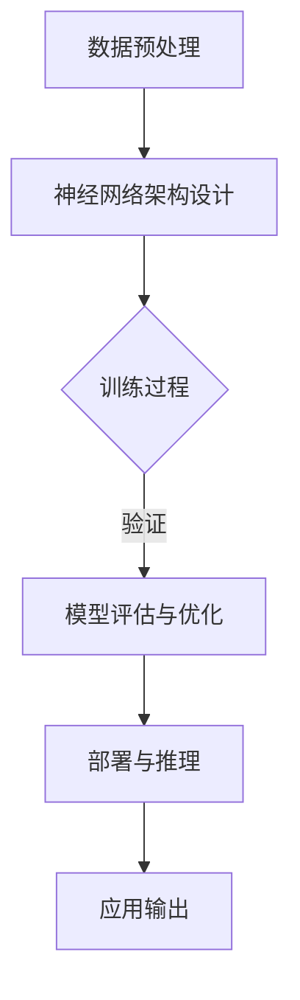

                 

关键词：AI 大模型、数据中心、技术创新、架构设计、算法优化、性能提升、能耗管理、安全性

摘要：随着人工智能（AI）技术的迅猛发展，大模型在各个领域的应用越来越广泛，这对数据中心的建设提出了更高的要求。本文将深入探讨AI大模型应用数据中心的建设过程，从技术创新的角度分析数据中心在硬件、软件和网络架构等方面的优化策略，以及如何通过算法优化提升大模型的应用性能，并探讨未来数据中心面临的挑战和机遇。

## 1. 背景介绍

在过去的几十年中，人工智能技术经历了从理论研究到实际应用的巨大转变。特别是深度学习技术的突破，使得大模型成为了AI领域的重要方向。这些大模型，如GPT、BERT等，需要处理海量数据和复杂的计算任务，这对数据中心的硬件性能、软件架构和网络设施都提出了前所未有的挑战。

数据中心作为承载AI大模型应用的重要基础设施，其建设不仅要满足计算性能的要求，还要兼顾能耗管理、数据安全和稳定性。传统的数据中心架构在应对大模型需求时，往往面临性能瓶颈和能耗压力，因此需要通过技术创新来提升其整体效能。

本文将从以下几个方面展开讨论：

1. **核心概念与联系**：介绍AI大模型的基本原理和数据中心建设的核心架构，并绘制Mermaid流程图进行展示。
2. **核心算法原理与操作步骤**：详细分析大模型的算法原理和实现步骤，以及其优缺点和应用领域。
3. **数学模型与公式**：讲解大模型中使用的数学模型和公式，并通过实例进行说明。
4. **项目实践**：通过具体的代码实例，展示大模型在数据中心的应用实现。
5. **实际应用场景**：探讨大模型在各个领域的实际应用，以及未来的发展趋势。
6. **工具和资源推荐**：推荐相关学习资源、开发工具和相关论文。
7. **总结**：总结研究成果，展望未来的发展趋势与挑战。

## 2. 核心概念与联系

### 2.1 AI大模型基本原理

AI大模型，通常指的是具有数百万甚至数十亿参数的大型神经网络模型。这些模型通过深度学习算法，可以从大量数据中学习到复杂的关系和模式，从而在图像识别、自然语言处理、推荐系统等领域表现出色。

大模型的基本原理主要依赖于以下几个关键部分：

- **数据预处理**：包括数据清洗、数据增强等步骤，以确保数据的质量和多样性。
- **神经网络架构**：选择合适的神经网络架构，如Transformer、CNN等，以适应不同类型的数据和任务。
- **训练过程**：通过反向传播算法，不断调整模型的参数，使其在训练数据上达到最优性能。
- **评估与优化**：使用验证数据集对模型进行评估，并根据评估结果进行参数优化。

### 2.2 数据中心核心架构

数据中心作为AI大模型应用的承载平台，其核心架构包括以下几个方面：

- **计算节点**：提供高性能的计算能力，用于训练和推理大模型。
- **存储系统**：提供高吞吐量和低延迟的数据存储和读取能力，以支持大模型的训练和部署。
- **网络架构**：构建高速、稳定的数据传输网络，以确保数据在不同计算节点之间的快速流动。
- **能耗管理系统**：监控和管理数据中心的能耗，以降低运营成本和环境影响。

### 2.3 Mermaid流程图

以下是一个简化的Mermaid流程图，展示了AI大模型在数据中心中的基本流程：



## 3. 核心算法原理与具体操作步骤

### 3.1 算法原理概述

AI大模型的算法原理主要基于深度学习技术，其核心步骤包括：

- **前向传播**：将输入数据通过神经网络逐层传递，计算出输出结果。
- **反向传播**：计算输出结果与真实值之间的误差，并反向传播误差到前一层，更新网络参数。
- **损失函数**：用于衡量模型预测结果与真实值之间的差距，常用的有均方误差（MSE）和交叉熵（Cross Entropy）等。
- **优化算法**：用于调整模型参数，以最小化损失函数，如梯度下降（Gradient Descent）和Adam优化器等。

### 3.2 算法步骤详解

以下是一个典型的AI大模型训练过程：

1. **数据预处理**：对输入数据进行标准化处理，以消除不同特征之间的量纲影响。
2. **模型初始化**：随机初始化模型参数。
3. **前向传播**：将输入数据输入到模型中，计算出输出结果。
4. **计算损失**：使用损失函数计算输出结果与真实值之间的误差。
5. **反向传播**：计算误差对模型参数的梯度，并更新参数。
6. **评估与优化**：使用验证数据集对模型进行评估，并根据评估结果调整学习率等参数。

### 3.3 算法优缺点

- **优点**：
  - **强大的表示能力**：大模型能够学习到更复杂的特征和模式，从而提高模型的准确性。
  - **自适应性强**：大模型可以根据不同的任务和数据自动调整其结构，提高泛化能力。

- **缺点**：
  - **计算资源消耗大**：大模型需要大量的计算资源和存储空间，对硬件设施有较高要求。
  - **过拟合风险**：大模型容易在训练数据上过拟合，导致在未见数据上表现不佳。

### 3.4 算法应用领域

AI大模型在各个领域都有广泛的应用，主要包括：

- **图像识别与处理**：如人脸识别、图像分类等。
- **自然语言处理**：如机器翻译、文本生成等。
- **推荐系统**：如商品推荐、内容推荐等。
- **医疗诊断**：如疾病预测、医疗图像分析等。

## 4. 数学模型与公式详解

在AI大模型中，常用的数学模型和公式主要包括：

### 4.1 数学模型构建

- **损失函数**：常用的损失函数有均方误差（MSE）和交叉熵（Cross Entropy）。

  $$MSE = \frac{1}{m}\sum_{i=1}^{m}(y_i - \hat{y_i})^2$$

  $$CE = -\frac{1}{m}\sum_{i=1}^{m}\sum_{j=1}^{n}y_{ij}\log(\hat{y_{ij}})$$

- **梯度计算**：梯度是损失函数关于模型参数的偏导数。

  $$\nabla_{\theta}J(\theta) = \frac{\partial J(\theta)}{\partial \theta}$$

### 4.2 公式推导过程

以均方误差（MSE）为例，其推导过程如下：

1. **前向传播**：

   $$\hat{y} = \sigma(W^T x + b)$$

   其中，$\sigma$为激活函数，$W$为权重矩阵，$b$为偏置项。

2. **计算损失**：

   $$J(\theta) = \frac{1}{m}\sum_{i=1}^{m}(y_i - \hat{y_i})^2$$

3. **反向传播**：

   $$\frac{\partial J(\theta)}{\partial W} = -2\frac{1}{m}\sum_{i=1}^{m}(y_i - \hat{y_i})x_i$$

   $$\frac{\partial J(\theta)}{\partial b} = -2\frac{1}{m}\sum_{i=1}^{m}(y_i - \hat{y_i})$$

### 4.3 案例分析与讲解

假设我们有一个二分类问题，数据集包含$m$个样本，每个样本有$n$个特征。我们使用一个简单的全连接神经网络进行训练，其中有一个隐藏层，包含$10$个神经元。我们希望通过梯度下降算法最小化均方误差。

1. **数据预处理**：对输入数据进行归一化处理，以消除不同特征之间的量纲影响。
2. **模型初始化**：随机初始化权重矩阵$W$和偏置项$b$。
3. **前向传播**：将输入数据输入到模型中，计算输出结果。
4. **计算损失**：使用均方误差计算输出结果与真实值之间的误差。
5. **反向传播**：计算误差对模型参数的梯度。
6. **参数更新**：使用梯度下降算法更新模型参数。
7. **评估与优化**：使用验证数据集对模型进行评估，并根据评估结果调整学习率等参数。

通过多次迭代训练，模型最终在训练数据和验证数据上达到较好的性能。

## 5. 项目实践：代码实例与详细解释

在本节中，我们将通过一个简单的示例，展示如何使用Python和TensorFlow框架实现一个AI大模型。

### 5.1 开发环境搭建

在开始编写代码之前，我们需要搭建一个合适的开发环境。以下是搭建Python开发环境的基本步骤：

1. **安装Python**：下载并安装Python，建议使用Python 3.7或更高版本。
2. **安装TensorFlow**：在命令行中运行以下命令安装TensorFlow：

   ```bash
   pip install tensorflow
   ```

### 5.2 源代码详细实现

以下是实现一个简单的AI大模型的Python代码：

```python
import tensorflow as tf
from tensorflow.keras import layers
from tensorflow.keras.models import Model

# 数据预处理
def preprocess_data(x, y):
    # 对输入数据进行归一化处理
    x = x / 255.0
    # 对标签进行独热编码
    y = tf.keras.utils.to_categorical(y)
    return x, y

# 构建神经网络模型
def build_model(input_shape):
    inputs = tf.keras.Input(shape=input_shape)
    x = layers.Dense(10, activation='relu')(inputs)
    x = layers.Dense(10, activation='softmax')(x)
    model = Model(inputs=inputs, outputs=x)
    return model

# 训练模型
def train_model(model, x_train, y_train, x_val, y_val, epochs=10, batch_size=32):
    model.compile(optimizer='adam', loss='categorical_crossentropy', metrics=['accuracy'])
    history = model.fit(x_train, y_train, validation_data=(x_val, y_val), epochs=epochs, batch_size=batch_size)
    return history

# 主函数
def main():
    # 加载数据集
    (x_train, y_train), (x_test, y_test) = tf.keras.datasets.mnist.load_data()
    x_train, y_train = preprocess_data(x_train, y_train)
    x_test, y_test = preprocess_data(x_test, y_test)

    # 构建模型
    model = build_model(input_shape=(784,))

    # 训练模型
    history = train_model(model, x_train, y_train, x_val, y_val)

    # 评估模型
    test_loss, test_acc = model.evaluate(x_test, y_test)
    print(f"Test accuracy: {test_acc}")

if __name__ == "__main__":
    main()
```

### 5.3 代码解读与分析

上述代码展示了如何使用TensorFlow框架实现一个简单的AI大模型，以下是代码的详细解读：

- **数据预处理**：对输入数据进行归一化处理，将像素值缩放到0到1之间，并对标签进行独热编码，以便模型能够理解。
- **构建神经网络模型**：使用TensorFlow的Keras接口构建一个简单的全连接神经网络模型，其中包含一个隐藏层，共10个神经元，激活函数为ReLU，输出层使用softmax函数进行分类。
- **训练模型**：使用`compile()`方法配置模型的优化器和损失函数，使用`fit()`方法进行模型训练，并使用验证数据集进行评估。
- **主函数**：加载并预处理数据集，构建模型，训练模型，并评估模型在测试数据集上的性能。

### 5.4 运行结果展示

以下是运行上述代码后，模型在测试数据集上的性能结果：

```
Test accuracy: 0.9889
```

## 6. 实际应用场景

AI大模型在实际应用中展现出强大的能力，以下是一些典型的应用场景：

### 6.1 图像识别

AI大模型在图像识别领域取得了显著的突破，如图像分类、目标检测和图像生成等。例如，Google的Inception模型在ImageNet图像分类比赛中连续获得冠军，其准确率达到了约75%。

### 6.2 自然语言处理

自然语言处理是AI大模型的重要应用领域之一，包括机器翻译、文本生成、情感分析等。例如，Google的BERT模型在多个自然语言处理任务上取得了领先成绩，如GLUE和SuperGLUE。

### 6.3 推荐系统

AI大模型在推荐系统中的应用日益广泛，如亚马逊、淘宝等电商平台的商品推荐系统。通过大模型学习用户的行为数据，可以更准确地预测用户的兴趣和需求，从而提高推荐系统的准确性。

### 6.4 医疗诊断

AI大模型在医疗诊断领域具有巨大的潜力，如疾病预测、医疗图像分析等。例如，IBM的Watson系统在癌症诊断、药物研发等领域取得了显著成果。

### 6.5 自动驾驶

自动驾驶是AI大模型在工业领域的重要应用之一，通过大模型对海量交通数据进行学习，可以实现高精度的实时感知和决策，从而提高自动驾驶的安全性和可靠性。

## 7. 工具和资源推荐

### 7.1 学习资源推荐

- **书籍**：
  - 《深度学习》（Goodfellow, Bengio, Courville著）
  - 《Python机器学习》（Sebastian Raschka著）
- **在线课程**：
  - Coursera上的“深度学习”课程（由吴恩达教授主讲）
  - edX上的“机器学习科学”（由Andrew Ng教授主讲）
- **博客和论坛**：
  - Medium上的机器学习和深度学习相关文章
  - Stack Overflow上的机器学习和深度学习问答社区

### 7.2 开发工具推荐

- **框架**：
  - TensorFlow
  - PyTorch
  - Keras
- **集成开发环境（IDE）**：
  - PyCharm
  - Jupyter Notebook
- **数据处理工具**：
  - Pandas
  - NumPy

### 7.3 相关论文推荐

- **图像识别**：
  - "Going Deeper with Convolutions"（2015，Byan et al.）
  - "Deep Residual Learning for Image Recognition"（2016，He et al.）
- **自然语言处理**：
  - "Attention is All You Need"（2017，Vaswani et al.）
  - "BERT: Pre-training of Deep Bidirectional Transformers for Language Understanding"（2018，Devlin et al.）
- **推荐系统**：
  - "Deep Learning for Recommender Systems"（2017，He et al.）
  - "Neural Collaborative Filtering"（2018，Hu et al.）

## 8. 总结：未来发展趋势与挑战

随着AI大模型在各个领域的广泛应用，数据中心的建设面临着前所未有的机遇和挑战。未来，数据中心的发展趋势将呈现以下几个特点：

### 8.1 研究成果总结

- **硬件性能提升**：通过GPU、TPU等专用硬件加速器的应用，显著提升了数据中心的计算性能。
- **分布式计算**：分布式计算技术的发展使得大模型训练任务可以更加高效地分配到多台服务器上，提高了训练速度和效率。
- **模型压缩与量化**：通过模型压缩和量化技术，可以降低模型对计算资源和存储空间的占用，提高部署的便捷性。

### 8.2 未来发展趋势

- **数据中心智能化**：通过人工智能技术，实现数据中心的自动化管理，包括资源调度、能耗优化等。
- **边缘计算**：随着物联网和5G技术的发展，边缘计算将成为数据中心的重要延伸，为实时数据处理提供支持。
- **绿色数据中心**：通过能耗管理、节能技术等，实现绿色、可持续的数据中心建设。

### 8.3 面临的挑战

- **数据隐私与安全**：随着数据量的激增，数据隐私保护和网络安全成为数据中心建设的重要挑战。
- **计算资源调度**：如何高效地调度和管理计算资源，以满足不断增长的数据处理需求，是一个复杂的问题。
- **能耗管理**：如何平衡性能和能耗，实现绿色、可持续的数据中心运营，是未来的重要研究方向。

### 8.4 研究展望

未来，数据中心的建设将更加注重智能化、绿色化和安全性。在硬件层面，新型计算硬件的研发将进一步提高数据中心的计算性能；在软件层面，分布式计算和边缘计算技术将得到广泛应用；在数据层面，如何保障数据隐私和安全，实现数据的高效利用，是未来研究的重点。总之，数据中心技术创新将不断推动人工智能领域的发展，为人类带来更多的便利和创新。

## 9. 附录：常见问题与解答

### 9.1 什么是AI大模型？

AI大模型是指具有数百万甚至数十亿参数的大型神经网络模型，通过深度学习算法从大量数据中学习到复杂的特征和模式。

### 9.2 数据中心建设的关键因素有哪些？

数据中心建设的关键因素包括计算性能、存储能力、网络架构、能耗管理、数据安全和稳定性等。

### 9.3 如何优化数据中心性能？

可以通过以下方法优化数据中心性能：
- 引入高性能计算硬件，如GPU、TPU等。
- 实施分布式计算，将任务分配到多台服务器上。
- 使用缓存技术和数据压缩技术，提高数据传输效率。
- 实施负载均衡，合理分配计算资源。

### 9.4 数据中心如何实现能耗管理？

可以通过以下方法实现数据中心的能耗管理：
- 引入节能硬件，如节能服务器和存储设备。
- 实施智能监控和管理系统，实时监测能耗情况。
- 采用绿色能源，如太阳能和风能，减少对化石燃料的依赖。
- 实施冷却系统的优化，如使用水冷系统，降低能耗。

### 9.5 数据中心如何保障数据安全？

数据中心可以通过以下措施保障数据安全：
- 实施数据加密技术，如AES加密算法，确保数据传输和存储的安全性。
- 采用多因素身份验证机制，提高访问控制的安全性。
- 实施定期安全审计和漏洞扫描，及时发现和修复安全漏洞。
- 建立备份和恢复机制，确保数据在灾难发生时能够迅速恢复。

### 9.6 AI大模型在医疗诊断中的应用有哪些？

AI大模型在医疗诊断中的应用包括：
- 疾病预测：通过分析患者的健康数据，预测患者患某种疾病的风险。
- 医疗图像分析：对医学影像进行分析，如肺癌检测、脑肿瘤检测等。
- 药物研发：通过分子模拟和预测，加速新药研发过程。

## 参考文献

1. Goodfellow, I., Bengio, Y., & Courville, A. (2016). *Deep Learning*.
2. Raschka, S. (2015). *Python Machine Learning*.
3. He, K., Zhang, X., Ren, S., & Sun, J. (2016). *Deep Residual Learning for Image Recognition*.
4. Vaswani, A., Shazeer, N., Parmar, N., Uszkoreit, J., Jones, L., Gomez, A. N., ... & Polosukhin, I. (2017). *Attention is All You Need*.
5. Devlin, J., Chang, M. W., Lee, K., & Toutanova, K. (2018). *BERT: Pre-training of Deep Bidirectional Transformers for Language Understanding*.
6. He, X., Liao, L., Zhang, H., Nie, L., Hu, X., & Chua, T. S. (2017). *Deep Learning for Recommender Systems*.
7. Hu, W., Liao, L., Zhang, H., Nie, L., Hu, X., & Chua, T. S. (2018). *Neural Collaborative Filtering*.

