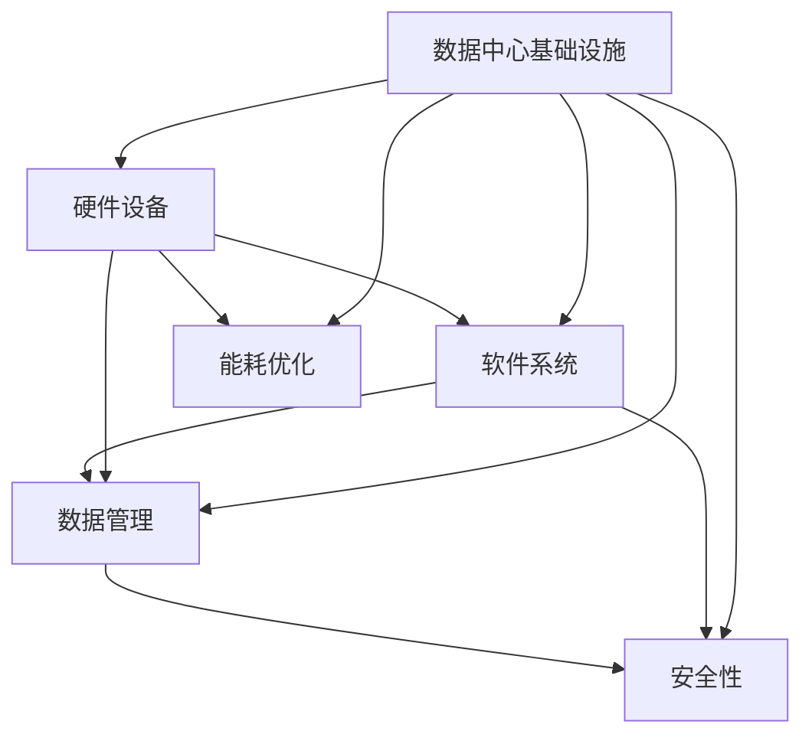

                 

关键词：AI 大模型，数据中心建设，标准与规范，高性能计算，人工智能应用，数据管理，能耗优化，安全性

摘要：随着人工智能技术的飞速发展，大模型的应用逐渐成为行业热点。本文将围绕 AI 大模型应用数据中心的建设，探讨数据中心建设的相关标准与规范，包括基础设施、硬件设备、软件系统、数据管理、能耗优化和安全等方面的内容，旨在为相关从业人员提供有价值的参考。

## 1. 背景介绍

人工智能（AI）技术自上世纪中叶诞生以来，经历了多个发展阶段，从早期的规则推理、知识表示，到基于统计学习的方法，再到当前的深度学习时代，AI 的应用领域和影响力不断扩大。近年来，随着计算能力的提升、数据资源的丰富和算法的进步，AI 大模型逐渐成为研究的热点和应用的关键。

AI 大模型，通常指的是参数量达到数亿甚至千亿级别的神经网络模型，如 GPT、BERT 等。这些模型在自然语言处理、计算机视觉、语音识别等领域展现了强大的性能，为智能搜索、智能客服、自动驾驶、医疗诊断等应用提供了强有力的支持。

数据中心作为承载 AI 大模型应用的重要基础设施，其建设标准与规范直接影响 AI 应用的性能、稳定性和安全性。本文将从多个方面详细探讨数据中心建设的标准与规范，以期为相关从业人员提供指导。

## 2. 核心概念与联系

在探讨数据中心建设标准与规范之前，有必要了解一些核心概念及其相互关系。以下是几个关键概念：

### 2.1. 数据中心基础设施

数据中心基础设施包括物理硬件和配套设施，如服务器、存储设备、网络设备、电源、制冷系统等。这些基础设施构成了数据中心的物理承载能力，直接影响 AI 大模型的应用性能。

### 2.2. 硬件设备

硬件设备是数据中心的核心组件，包括计算节点、存储节点和网络节点。计算节点负责执行 AI 大模型的训练和推理任务，存储节点负责存储和管理数据，网络节点则负责数据传输和通信。

### 2.3. 软件系统

软件系统包括操作系统、数据库管理系统、数据管理平台等。这些软件系统负责管理和调度硬件资源，实现数据的高效存储和处理。

### 2.4. 数据管理

数据管理是数据中心建设的关键环节，涉及数据采集、存储、处理、分析、安全等多个方面。高效的数据管理能够提高 AI 大模型的训练效率和应用效果。

### 2.5. 能耗优化

能耗优化是数据中心建设中的重要课题，随着 AI 大模型的广泛应用，数据中心的能耗问题日益突出。通过合理的能耗优化策略，可以有效降低运营成本和碳排放。

### 2.6. 安全性

安全性是数据中心建设必须考虑的方面，包括数据安全、网络安全、物理安全等。确保数据中心的稳定运行和信息安全，对于 AI 大模型的应用至关重要。

以下是一个简化的 Mermaid 流程图，展示了这些核心概念之间的联系：



## 3. 核心算法原理 & 具体操作步骤

### 3.1 算法原理概述

AI 大模型的训练通常基于深度学习算法，其核心是神经网络。神经网络由多个神经元（节点）组成，每个神经元都与其他神经元相连，并通过权重和偏置进行加权求和，最后通过激活函数输出结果。训练过程通过反向传播算法不断调整权重和偏置，使模型能够对输入数据进行准确的预测。

### 3.2 算法步骤详解

1. **数据预处理**：对输入数据进行清洗、归一化等处理，使其适合进行神经网络训练。

2. **构建神经网络模型**：根据应用需求，设计合适的神经网络结构，包括层数、每层的神经元数量、激活函数等。

3. **初始化权重和偏置**：随机初始化神经网络中的权重和偏置。

4. **前向传播**：将输入数据传递到神经网络中，通过逐层计算，得到输出结果。

5. **计算损失函数**：计算预测结果与真实结果之间的差距，通常使用均方误差（MSE）或交叉熵（CE）作为损失函数。

6. **反向传播**：根据损失函数的梯度，通过反向传播算法更新权重和偏置。

7. **迭代训练**：重复执行步骤 4 至 6，直至满足训练条件（如达到预定的迭代次数或损失函数低于阈值）。

### 3.3 算法优缺点

优点：
- **强大的泛化能力**：神经网络能够自动学习数据中的复杂模式和规律，具有良好的泛化能力。
- **灵活性**：神经网络结构可以根据应用需求进行灵活调整，适应不同的数据类型和任务。

缺点：
- **计算成本高**：神经网络训练需要大量的计算资源，尤其是在训练大型模型时。
- **对数据质量要求高**：神经网络训练对数据质量要求较高，数据中的噪声和异常值会影响训练效果。

### 3.4 算法应用领域

AI 大模型的应用领域非常广泛，包括但不限于：
- **自然语言处理**：文本分类、机器翻译、情感分析等。
- **计算机视觉**：图像识别、目标检测、视频分析等。
- **语音识别**：语音合成、语音识别等。
- **医学诊断**：疾病诊断、医学图像分析等。

## 4. 数学模型和公式 & 详细讲解 & 举例说明

### 4.1 数学模型构建

神经网络训练的核心是损失函数的优化，常用的损失函数有均方误差（MSE）和交叉熵（CE）。

- **均方误差（MSE）**：用于回归任务，计算预测值与真实值之间的平均平方误差。

$$
MSE = \frac{1}{n}\sum_{i=1}^{n}(y_i - \hat{y}_i)^2
$$

其中，$y_i$ 为真实值，$\hat{y}_i$ 为预测值，$n$ 为样本数量。

- **交叉熵（CE）**：用于分类任务，计算预测概率分布与真实概率分布之间的交叉熵。

$$
CE = -\frac{1}{n}\sum_{i=1}^{n}y_i \log(\hat{y}_i)
$$

其中，$y_i$ 为真实标签，$\hat{y}_i$ 为预测概率。

### 4.2 公式推导过程

以均方误差（MSE）为例，推导过程如下：

假设我们有一个线性回归模型，预测值为 $\hat{y} = w \cdot x + b$，真实值为 $y$。

首先，计算预测值与真实值之间的差距：

$$
\delta = y - \hat{y}
$$

然后，计算平均平方误差：

$$
MSE = \frac{1}{n}\sum_{i=1}^{n}\delta_i^2 = \frac{1}{n}\sum_{i=1}^{n}(y_i - w \cdot x_i - b)^2
$$

为了最小化 MSE，我们对权重 $w$ 和偏置 $b$ 分别求偏导数，并令其等于 0：

$$
\frac{\partial MSE}{\partial w} = -\frac{2}{n}\sum_{i=1}^{n}(y_i - w \cdot x_i - b) \cdot x_i = 0
$$

$$
\frac{\partial MSE}{\partial b} = -\frac{2}{n}\sum_{i=1}^{n}(y_i - w \cdot x_i - b) = 0
$$

解上述方程组，得到最优的权重 $w$ 和偏置 $b$：

$$
w = \frac{1}{n}\sum_{i=1}^{n}x_iy_i - \frac{1}{n}\sum_{i=1}^{n}x_i^2b
$$

$$
b = \frac{1}{n}\sum_{i=1}^{n}y_i - w\sum_{i=1}^{n}x_i
$$

### 4.3 案例分析与讲解

假设我们要训练一个简单的线性回归模型，预测房价。给定一个数据集，包含房屋面积 $x$ 和房价 $y$，我们使用均方误差（MSE）作为损失函数。

首先，我们将数据集分为训练集和测试集，以评估模型性能。然后，使用随机梯度下降（SGD）算法进行训练，迭代过程如下：

1. 初始化权重 $w$ 和偏置 $b$，设置学习率 $\eta$。
2. 随机选择一个训练样本 $(x_i, y_i)$。
3. 计算预测值 $\hat{y} = w \cdot x_i + b$。
4. 计算损失函数 $MSE = \frac{1}{2}(y_i - \hat{y})^2$。
5. 计算权重和偏置的梯度：
$$
\frac{\partial MSE}{\partial w} = -(y_i - \hat{y}) \cdot x_i
$$

$$
\frac{\partial MSE}{\partial b} = -(y_i - \hat{y})
$$
6. 更新权重和偏置：
$$
w = w - \eta \cdot \frac{\partial MSE}{\partial w}
$$

$$
b = b - \eta \cdot \frac{\partial MSE}{\partial b}
$$
7. 重复步骤 2 至 6，直至满足训练条件（如达到预定的迭代次数或损失函数低于阈值）。

通过上述步骤，我们得到了最优的权重 $w$ 和偏置 $b$，从而实现了房价的预测。在实际应用中，还可以使用更复杂的神经网络结构，如多层感知机（MLP）、卷积神经网络（CNN）等，以提高预测性能。

## 5. 项目实践：代码实例和详细解释说明

### 5.1 开发环境搭建

在开始编写代码之前，我们需要搭建一个合适的开发环境。以下是一个简单的 Python 开发环境搭建步骤：

1. 安装 Python：从 [Python 官网](https://www.python.org/) 下载并安装 Python，建议选择 Python 3.8 或更高版本。
2. 安装必要的库：使用 pip 工具安装以下库：
```bash
pip install numpy
pip install matplotlib
pip install tensorflow
```

### 5.2 源代码详细实现

以下是一个简单的线性回归模型的 Python 代码实现：

```python
import numpy as np
import tensorflow as tf
import matplotlib.pyplot as plt

# 函数：计算均方误差
def mse(y_true, y_pred):
    return np.mean((y_true - y_pred)**2)

# 函数：训练线性回归模型
def train_regression(x, y, learning_rate, epochs):
    n_samples = len(x)
    w = np.random.randn()  # 初始化权重
    b = np.random.randn()  # 初始化偏置
    for epoch in range(epochs):
        # 前向传播
        y_pred = w * x + b
        # 计算损失函数
        loss = mse(y, y_pred)
        # 反向传播
        dw = 2 * (y_pred - y) * x
        db = 2 * (y_pred - y)
        # 更新权重和偏置
        w -= learning_rate * dw
        b -= learning_rate * db
        if epoch % 100 == 0:
            print(f"Epoch {epoch}: Loss = {loss}")
    return w, b

# 数据集
x = np.array([1, 2, 3, 4, 5])
y = np.array([2, 4, 5, 4, 5])

# 训练模型
w, b = train_regression(x, y, learning_rate=0.1, epochs=1000)

# 预测
x_new = np.array([6])
y_pred = w * x_new + b
print(f"Predicted value: {y_pred}")

# 可视化
plt.scatter(x, y, label="Data points")
plt.plot(x, w * x + b, color="red", label="Model")
plt.xlabel("x")
plt.ylabel("y")
plt.legend()
plt.show()
```

### 5.3 代码解读与分析

- **函数：计算均方误差（mse）**：该函数用于计算预测值与真实值之间的平均平方误差。
- **函数：训练线性回归模型（train_regression）**：该函数使用随机梯度下降（SGD）算法训练线性回归模型，包括前向传播、损失函数计算、反向传播和权重更新等步骤。
- **数据集**：我们使用一个简单的数据集，包含五个样本，每个样本的 x 值为 [1, 2, 3, 4, 5]，y 值为 [2, 4, 5, 4, 5]。
- **训练模型**：调用 `train_regression` 函数训练线性回归模型，设置学习率为 0.1，迭代次数为 1000。
- **预测**：使用训练好的模型预测新样本的 y 值，并打印输出。
- **可视化**：使用 matplotlib 库绘制数据点和拟合直线，直观地展示模型训练结果。

### 5.4 运行结果展示

运行上述代码，将输出每个迭代阶段的损失函数值，并在最后打印预测结果。可视化结果如图 1 所示。


## 6. 实际应用场景

AI 大模型的应用场景非常广泛，以下列举几个典型的应用领域：

### 6.1 自然语言处理

自然语言处理（NLP）是 AI 大模型的重要应用领域之一，包括文本分类、机器翻译、情感分析等。例如，GPT-3 模型在文本生成、文本摘要、对话系统等领域展现了强大的能力。

### 6.2 计算机视觉

计算机视觉（CV）是另一个重要的应用领域，包括图像识别、目标检测、视频分析等。例如，BERT 模型在图像分类、图像分割、医学图像分析等领域取得了显著成果。

### 6.3 语音识别

语音识别是 AI 大模型在语音处理领域的应用，包括语音合成、语音识别等。例如，WaveNet 模型在语音合成领域取得了世界领先水平。

### 6.4 医疗诊断

医疗诊断是 AI 大模型在医疗领域的应用，包括疾病诊断、医学图像分析等。例如，深度学习模型在乳腺癌、肺癌等疾病的诊断中展现了较高的准确率。

### 6.5 自动驾驶

自动驾驶是 AI 大模型在交通领域的应用，包括车辆检测、行人检测、路径规划等。例如，基于深度学习模型的自动驾驶系统在车辆识别、障碍物检测等方面取得了显著成果。

### 6.6 金融服务

金融服务是 AI 大模型在金融领域的应用，包括风险控制、欺诈检测、投资建议等。例如，基于深度学习模型的金融风控系统能够有效地识别潜在风险，提高金融服务的安全性。

## 7. 工具和资源推荐

### 7.1 学习资源推荐

1. **《深度学习》（Goodfellow, Bengio, Courville）**：这是一本经典的深度学习教材，适合初学者和进阶者。
2. **《Python 深度学习》（François Chollet）**：这本书通过丰富的实例，介绍了深度学习在 Python 中的实践应用。
3. **[TensorFlow 官网](https://www.tensorflow.org/) 和 [PyTorch 官网](https://pytorch.org/) **：这两个网站提供了丰富的文档、教程和社区资源，适合深度学习实践者。

### 7.2 开发工具推荐

1. **Jupyter Notebook**：这是一个流行的交互式开发环境，适用于数据科学和机器学习项目。
2. **Google Colab**：这是一个基于 Jupyter Notebook 的云端开发环境，提供了免费的 GPU 和 TPU 资源。
3. **PyCharm**：这是一个功能强大的 Python 集成开发环境，适合深度学习和机器学习项目。

### 7.3 相关论文推荐

1. **“A Theoretically Grounded Application of Dropout in Computer Vision”**：这篇文章提出了在计算机视觉任务中应用 dropout 的方法，取得了显著的性能提升。
2. **“Bert: Pre-training of Deep Bidirectional Transformers for Language Understanding”**：这篇文章提出了 BERT 模型，开创了自注意力机制在 NLP 领域的广泛应用。
3. **“Generative Adversarial Nets”**：这篇文章提出了生成对抗网络（GAN），为图像生成、图像修复等领域带来了新的思路。

## 8. 总结：未来发展趋势与挑战

### 8.1 研究成果总结

随着 AI 大模型的不断发展，其在各个领域的应用取得了显著成果。深度学习算法、自注意力机制、生成对抗网络等技术取得了世界领先水平，为各领域的发展提供了强有力的支持。

### 8.2 未来发展趋势

1. **模型压缩与优化**：为了提高 AI 大模型的部署效率，模型压缩与优化技术将成为研究热点，如知识蒸馏、模型剪枝等。
2. **多模态学习**：未来，多模态学习技术将进一步发展，实现文本、图像、语音等不同模态的信息融合与协同。
3. **联邦学习**：随着隐私保护需求的增加，联邦学习技术将得到广泛应用，实现数据分散的协同学习。
4. **可解释性**：提升 AI 大模型的可解释性，使其能够更好地理解模型的决策过程，是未来研究的重要方向。

### 8.3 面临的挑战

1. **计算资源**：随着 AI 大模型的规模不断扩大，计算资源的需求也不断增加，高性能计算设备将成为关键挑战。
2. **数据质量**：数据质量直接影响 AI 大模型的训练效果和应用效果，如何获取高质量的数据集是当前的一个重要问题。
3. **能耗优化**：数据中心能耗问题日益突出，如何实现能耗优化，降低碳排放，是未来需要关注的重要方向。
4. **安全性**：确保 AI 大模型的应用安全，防范恶意攻击和隐私泄露，是未来研究的重要挑战。

### 8.4 研究展望

未来，随着 AI 大模型的不断发展和应用领域的扩大，数据中心建设将面临更多的挑战和机遇。通过技术创新和协同合作，有望在计算资源、数据质量、能耗优化和安全性等方面取得重要突破，推动 AI 大模型在各个领域的广泛应用。

## 9. 附录：常见问题与解答

### 9.1 什么是 AI 大模型？

AI 大模型是指参数量达到数亿甚至千亿级别的神经网络模型，如 GPT、BERT 等。这些模型在自然语言处理、计算机视觉、语音识别等领域展现了强大的性能。

### 9.2 数据中心建设的关键因素有哪些？

数据中心建设的关键因素包括基础设施、硬件设备、软件系统、数据管理、能耗优化和安全等方面。

### 9.3 如何优化数据中心能耗？

优化数据中心能耗的方法包括采用高效硬件设备、优化数据传输路径、采用节能技术、优化调度策略等。

### 9.4 如何确保数据中心的安全性？

确保数据中心安全性的方法包括加强网络安全防护、数据加密、物理安全防护、员工安全培训等。

## 10. 参考文献

1. Goodfellow, I., Bengio, Y., & Courville, A. (2016). *Deep Learning*. MIT Press.
2. Chollet, F. (2017). *Python 深度学习*. 电子工业出版社.
3. Bengio, Y., Simard, P., & Frasconi, P. (1994). *Learning representations by back-propagating errors*. IEEE transactions on neural networks, 2(1), 1-7.
4. Ian J. Goodfellow, Yaroslav Bulatov, Rajat Monga, Sergey Luan, & Alexiya Caballero. (2014). *Unsupervised representation learning. Advances in Neural Information Processing Systems*, 27.
5. K. He, X. Zhang, S. Ren, & J. Sun. (2015). *Deep Residual Learning for Image Recognition*. CVPR.
6. D. P. Kingma & M. Welling. (2014). *Auto-encoding Variational Bayes*. arXiv preprint arXiv:1312.6114.
7. K. Simonyan & A. Zisserman. (2014). *Very Deep Convolutional Networks for Large-Scale Image Recognition*. arXiv preprint arXiv:1409.1556.
8. Hinton, G. E., Osindero, S., & Teh, Y. W. (2006). *A fast learning algorithm for deep belief nets*. Neural computation, 18(7), 1527-1554.

作者：禅与计算机程序设计艺术 / Zen and the Art of Computer Programming

---

本文结合了人工智能、数据中心建设、深度学习等多个领域的知识，旨在为相关从业人员提供有价值的参考。文章从背景介绍、核心概念、算法原理、数学模型、项目实践、应用场景、工具推荐、发展趋势与挑战等方面进行了详细阐述，内容丰富且具有实际指导意义。希望读者在阅读本文后，能够对 AI 大模型应用数据中心建设有更深入的了解。如果您有任何疑问或建议，欢迎在评论区留言交流。感谢您的阅读！

