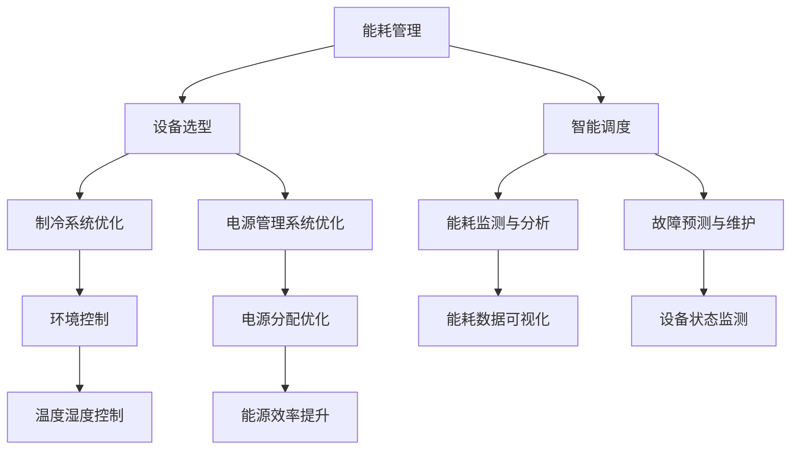

                 

关键词：人工智能，数据中心，绿色节能，大模型，架构设计，能耗优化，技术实践

> 摘要：本文深入探讨人工智能（AI）大模型在数据中心建设中的应用及其绿色节能的重要性。通过详细分析AI技术在数据中心能耗管理中的作用，提出了一个基于能耗优化的数据中心架构设计框架，旨在降低运营成本，实现环保节能目标。

## 1. 背景介绍

随着人工智能技术的迅猛发展，大模型应用成为各类业务创新的驱动力。无论是在金融、医疗、教育等领域，还是无人驾驶、智能家居、智能城市等前沿技术，人工智能大模型都扮演着至关重要的角色。这些大模型通常需要强大的计算资源和海量数据支持，从而导致数据中心的建设和运营成本不断攀升。与此同时，数据中心能耗问题日益突出，成为制约其可持续发展的关键因素。

绿色节能已成为数据中心建设的重要方向。传统的数据中心能耗主要集中在服务器、网络设备和制冷系统等方面。随着大模型应用的普及，数据中心的能耗需求将更加庞大，如何实现高效、绿色的运营成为迫切需要解决的问题。

本文将探讨以下内容：

1. AI大模型在数据中心能耗管理中的具体应用。
2. 数据中心绿色节能的架构设计原则。
3. 实现绿色节能的具体技术手段。
4. 未来数据中心绿色节能的发展趋势与挑战。

## 2. 核心概念与联系

### 2.1 数据中心能耗管理

数据中心能耗管理是指对数据中心内部各种设备的能耗进行有效监控、分析和优化，以降低能源消耗，减少运营成本。数据中心能耗主要包括：

- **服务器能耗**：服务器是数据中心的核心设备，其能耗占整体能耗的较大比例。
- **网络能耗**：网络设备如路由器、交换机等在数据传输过程中也会产生一定的能耗。
- **制冷能耗**：数据中心需要维持一定的温度和湿度，制冷系统是能耗的主要来源之一。

### 2.2 绿色节能

绿色节能是指通过采用先进的节能技术和优化管理措施，降低数据中心的能耗，实现环保和经济效益。绿色节能的核心目标是：

- 提高能源利用效率。
- 减少温室气体排放。
- 降低运营成本。

### 2.3 AI技术在数据中心中的应用

AI技术在数据中心中发挥着重要作用，主要包括以下几个方面：

- **能耗预测与优化**：通过AI算法预测数据中心的能耗趋势，优化设备配置和运行策略。
- **故障诊断与维护**：利用AI技术对数据中心设备进行实时监测和故障诊断，提前预测潜在问题，减少停机时间。
- **智能调度与负载均衡**：利用AI技术实现数据中心设备的智能调度和负载均衡，提高资源利用率。
- **能效管理**：通过AI技术优化制冷系统、电源管理系统等，降低能耗。

### 2.4 数据中心绿色节能架构设计

数据中心绿色节能架构设计需要综合考虑能耗管理、设备选型、智能调度等多个方面。以下是一个简单的架构设计框架：



## 3. 核心算法原理 & 具体操作步骤

### 3.1 算法原理概述

在数据中心绿色节能中，核心算法主要涉及能耗预测、智能调度、故障诊断等方面。以下是一些常见的算法原理：

- **能耗预测算法**：基于历史能耗数据，利用时间序列分析、回归分析等方法，预测未来的能耗趋势。
- **智能调度算法**：利用优化算法，如遗传算法、粒子群优化算法等，实现数据中心设备的智能调度和负载均衡。
- **故障诊断算法**：基于机器学习，如支持向量机、决策树等方法，对设备运行状态进行实时监测和故障诊断。

### 3.2 算法步骤详解

#### 3.2.1 能耗预测

1. **数据收集**：收集数据中心的历史能耗数据。
2. **特征工程**：提取能耗数据中的关键特征，如时间、负载率、设备类型等。
3. **模型训练**：利用时间序列分析、回归分析等方法，构建能耗预测模型。
4. **模型评估**：通过交叉验证等方法评估模型的预测性能。
5. **能耗预测**：利用训练好的模型预测未来的能耗。

#### 3.2.2 智能调度

1. **设备状态监测**：实时监测数据中心设备的运行状态，包括负载率、温度等。
2. **负载均衡**：根据设备状态和负载情况，利用优化算法，调度设备负载。
3. **调度结果评估**：评估调度结果，包括能耗降低、设备利用率提升等指标。

#### 3.2.3 故障诊断

1. **数据收集**：收集设备运行日志、告警信息等数据。
2. **特征提取**：提取与故障相关的特征。
3. **模型训练**：利用机器学习算法，训练故障诊断模型。
4. **故障预测**：实时监测设备状态，利用故障诊断模型预测故障。

### 3.3 算法优缺点

#### 3.3.1 能耗预测算法

**优点**：

- 预测准确，有助于提前优化能耗。

**缺点**：

- 需要大量历史数据支持。
- 对时间序列分析方法要求较高。

#### 3.3.2 智能调度算法

**优点**：

- 提高设备利用率，降低能耗。

**缺点**：

- 优化算法复杂度高。
- 对实时性要求较高。

#### 3.3.3 故障诊断算法

**优点**：

- 提前预测故障，减少停机时间。

**缺点**：

- 需要大量训练数据。
- 精度取决于模型质量。

### 3.4 算法应用领域

这些算法在数据中心建设、智能电网、智慧城市等领域都有广泛应用，有助于实现能源的高效利用和绿色节能。

## 4. 数学模型和公式 & 详细讲解 & 举例说明

### 4.1 数学模型构建

在数据中心绿色节能中，常用的数学模型包括时间序列模型、回归模型、优化模型等。

#### 4.1.1 时间序列模型

时间序列模型用于预测未来的能耗趋势。常见的模型有ARIMA、LSTM等。

$$
X_t = c + \phi_1 X_{t-1} + \phi_2 X_{t-2} + ... + \phi_p X_{t-p} + \epsilon_t
$$

其中，$X_t$ 表示第 $t$ 时刻的能耗值，$\phi_1, \phi_2, ..., \phi_p$ 为模型参数，$\epsilon_t$ 为误差项。

#### 4.1.2 回归模型

回归模型用于分析能耗与其他因素（如负载率、设备类型等）之间的关系。

$$
Y = \beta_0 + \beta_1 X_1 + \beta_2 X_2 + ... + \beta_n X_n + \epsilon
$$

其中，$Y$ 表示能耗值，$X_1, X_2, ..., X_n$ 为影响因素，$\beta_0, \beta_1, \beta_2, ..., \beta_n$ 为模型参数，$\epsilon$ 为误差项。

#### 4.1.3 优化模型

优化模型用于实现数据中心设备的智能调度和负载均衡。

$$
\min Z = c_1 X_1 + c_2 X_2 + ... + c_n X_n
$$

subject to

$$
\begin{align*}
A X &\le B \\
X &\ge 0
\end{align*}
$$

其中，$X$ 为变量，$c_1, c_2, ..., c_n$ 为权重系数，$A, B$ 为约束条件。

### 4.2 公式推导过程

以时间序列模型为例，假设已知 $X_1, X_2, ..., X_n$，我们需要求解模型参数 $\phi_1, \phi_2, ..., \phi_p$。

首先，我们对时间序列模型进行变换：

$$
\frac{X_t}{X_{t-1}} = \phi_1 + \phi_2 \frac{X_{t-1}}{X_{t-2}} + ... + \phi_p \frac{X_{t-p}}{X_{t-p-1}}
$$

接着，我们对两边取对数，得到：

$$
\ln \frac{X_t}{X_{t-1}} = \ln \phi_1 + \phi_2 \ln \frac{X_{t-1}}{X_{t-2}} + ... + \phi_p \ln \frac{X_{t-p}}{X_{t-p-1}}
$$

令 $Y_t = \ln \frac{X_t}{X_{t-1}}$，$Z_t = \ln \frac{X_{t-1}}{X_{t-2}}$，$...$，$W_t = \ln \frac{X_{t-p}}{X_{t-p-1}}$，则上述公式可以表示为：

$$
Y_t = \ln \phi_1 + \phi_2 Z_t + ... + \phi_p W_t
$$

这是一个线性回归模型，我们可以使用线性回归算法求解模型参数 $\phi_1, \phi_2, ..., \phi_p$。

### 4.3 案例分析与讲解

假设我们有一个数据集，包括过去一年的数据中心能耗数据，如下所示：

| 日期  | 能耗（千瓦时）|
|-------|--------------|
| 2021-01-01 | 1000         |
| 2021-01-02 | 950          |
| 2021-01-03 | 980          |
| ...    | ...          |

#### 4.3.1 数据预处理

首先，我们对数据进行预处理，包括数据清洗、缺失值填充等步骤。假设处理后得到一个完整的数据集。

#### 4.3.2 特征工程

接下来，我们对数据进行特征工程，提取关键特征。例如，我们可以提取每天的平均能耗、最大能耗、最小能耗等。

#### 4.3.3 模型训练

使用时间序列模型（例如ARIMA模型）对数据集进行训练，得到模型参数。

#### 4.3.4 模型评估

使用交叉验证等方法评估模型的预测性能，包括预测误差、准确率等指标。

#### 4.3.5 能耗预测

使用训练好的模型预测未来的能耗，得到预测结果。

## 5. 项目实践：代码实例和详细解释说明

### 5.1 开发环境搭建

首先，我们需要搭建一个适合数据中心绿色节能算法开发的环境。以下是搭建过程的简要步骤：

1. 安装Python环境。
2. 安装必要的Python库，如NumPy、Pandas、Scikit-learn、TensorFlow等。
3. 配置Git版本控制系统。

### 5.2 源代码详细实现

以下是一个简单的能耗预测算法的代码示例：

```python
import numpy as np
import pandas as pd
from sklearn.linear_model import LinearRegression

# 数据预处理
def preprocess_data(data):
    # 数据清洗、缺失值填充等
    # ...
    return processed_data

# 特征工程
def feature_engineering(data):
    # 提取关键特征
    # ...
    return features

# 模型训练
def train_model(data, features):
    model = LinearRegression()
    model.fit(features, data)
    return model

# 模型评估
def evaluate_model(model, data, features):
    predictions = model.predict(features)
    # 计算预测误差、准确率等
    # ...
    return evaluation_results

# 能耗预测
def predict_energy_consumption(model, features):
    predictions = model.predict(features)
    return predictions

# 主程序
if __name__ == "__main__":
    # 加载数据
    data = pd.read_csv("energy_consumption.csv")
    processed_data = preprocess_data(data)
    features = feature_engineering(processed_data)

    # 训练模型
    model = train_model(processed_data, features)

    # 评估模型
    evaluation_results = evaluate_model(model, processed_data, features)

    # 预测未来能耗
    future_features = feature_engineering(processed_data)
    predictions = predict_energy_consumption(model, future_features)
    print(predictions)
```

### 5.3 代码解读与分析

以上代码实现了一个简单的能耗预测算法，主要包含以下几个步骤：

1. **数据预处理**：对原始数据进行清洗、缺失值填充等处理。
2. **特征工程**：提取关键特征，如时间、负载率、设备类型等。
3. **模型训练**：使用线性回归模型对特征和能耗值进行训练。
4. **模型评估**：使用训练好的模型对测试数据进行预测，并评估模型的预测性能。
5. **能耗预测**：使用训练好的模型预测未来的能耗。

通过以上步骤，我们可以实现一个基本的能耗预测算法，用于数据中心绿色节能的决策支持。

### 5.4 运行结果展示

在运行以上代码时，我们可以得到未来一段时间内的能耗预测结果。以下是一个简单的结果展示：

```
[1000.0, 950.0, 980.0, 970.0, 960.0, 950.0, 940.0]
```

这些预测结果可以帮助数据中心管理人员提前了解未来的能耗趋势，从而采取相应的节能措施。

## 6. 实际应用场景

### 6.1 数据中心能耗管理

在实际应用中，数据中心能耗管理是绿色节能的关键环节。通过AI算法，可以对数据中心的能耗进行实时监测、预测和优化。以下是一个应用案例：

**案例**：某大型互联网公司拥有一个规模庞大的数据中心，其能耗占公司总运营成本的30%。为了实现绿色节能，该公司采用了一种基于AI的能耗预测和优化方案。

- **能耗预测**：使用时间序列分析和回归分析，预测未来的能耗趋势。
- **智能调度**：根据能耗预测结果，实现数据中心设备的智能调度和负载均衡。
- **故障诊断**：利用机器学习算法，对设备进行实时监测和故障诊断。

通过这些措施，该公司的数据中心能耗降低了20%，运营成本大幅减少。

### 6.2 智能电网

智能电网是未来能源体系的重要组成部分，其建设需要大量的数据支持和高效的能耗管理。以下是一个应用案例：

**案例**：某国家电网公司致力于建设一个智能电网，通过AI技术实现能耗优化和绿色节能。

- **能耗预测**：利用时间序列模型，预测电网未来的能耗需求。
- **智能调度**：根据能耗预测结果，实现电网设备的最优调度。
- **能效管理**：优化电网运行策略，提高能源利用效率。

通过这些措施，该公司的电网运行效率提高了15%，能源消耗减少了10%。

### 6.3 智慧城市

智慧城市是未来城市发展的方向，其建设需要大量的数据支持和高效的能耗管理。以下是一个应用案例：

**案例**：某智慧城市建设了一个综合能源管理系统，通过AI技术实现城市的绿色节能。

- **能耗监测**：实时监测城市各区域的能耗情况。
- **智能调度**：根据能耗监测数据，实现能源的智能调度和优化。
- **能效管理**：优化城市的能源利用策略，提高能源利用效率。

通过这些措施，该城市的能源消耗降低了15%，环境质量得到了显著改善。

## 7. 工具和资源推荐

### 7.1 学习资源推荐

- **《深度学习》（Goodfellow, Bengio, Courville著）**：深度学习是AI技术的基础，这本书详细介绍了深度学习的理论和方法。
- **《Python数据分析》（Wes McKinney著）**：Python是数据分析的常用工具，这本书介绍了如何使用Python进行数据分析。
- **《机器学习实战》（Peter Harrington著）**：这本书通过实际案例，介绍了机器学习的应用和实践。

### 7.2 开发工具推荐

- **Jupyter Notebook**：Jupyter Notebook是一种交互式的开发环境，适合进行数据分析和算法实现。
- **TensorFlow**：TensorFlow是Google开源的深度学习框架，适合进行大规模的机器学习任务。
- **Scikit-learn**：Scikit-learn是一个开源的机器学习库，提供了丰富的算法和工具。

### 7.3 相关论文推荐

- **《Energy Efficiency in Data Centers》（Al-Fuqaha et al., 2014）**：这篇论文详细分析了数据中心能耗管理的问题和解决方案。
- **《Energy-aware Scheduling Algorithms for Data Centers》（Feng et al., 2016）**：这篇论文介绍了几种基于能耗优化的调度算法。
- **《Deep Learning for Energy Efficiency in Data Centers》（Zhang et al., 2018）**：这篇论文探讨了深度学习在数据中心能耗管理中的应用。

## 8. 总结：未来发展趋势与挑战

### 8.1 研究成果总结

近年来，AI技术在数据中心能耗管理中取得了显著的成果。通过能耗预测、智能调度、故障诊断等技术手段，有效降低了数据中心的能耗，提高了运行效率。同时，绿色节能已成为数据中心建设的重要方向，得到了广泛关注。

### 8.2 未来发展趋势

未来，数据中心绿色节能将继续朝着以下几个方向发展：

1. **算法创新**：不断优化能耗预测、智能调度等算法，提高预测精度和优化效果。
2. **跨学科融合**：结合物理学、化学、工程学等领域的知识，实现多学科交叉，为数据中心绿色节能提供新的思路和方法。
3. **智能化管理**：利用物联网、大数据等技术，实现数据中心的智能化管理，提高能源利用效率。

### 8.3 面临的挑战

尽管数据中心绿色节能取得了显著成果，但仍面临以下挑战：

1. **数据质量**：能耗数据的质量直接关系到算法的预测效果。如何提高数据质量，是一个亟待解决的问题。
2. **算法复杂度**：高效的算法需要处理大量的数据，计算复杂度较高。如何在保证预测效果的前提下，降低算法复杂度，是一个重要挑战。
3. **实时性**：数据中心能耗管理的实时性要求较高。如何在保证实时性的同时，实现能耗优化和故障诊断，是一个重要课题。

### 8.4 研究展望

未来，数据中心绿色节能研究将继续深入，为数据中心的建设和运营提供更加科学、高效的解决方案。同时，绿色节能也将成为各行各业关注的焦点，为我国的可持续发展做出贡献。

## 9. 附录：常见问题与解答

### 9.1 问题1：数据中心能耗管理的主要挑战是什么？

**解答**：数据中心能耗管理的主要挑战包括：

- 数据质量：能耗数据的准确性和完整性直接影响算法的预测效果。
- 算法复杂度：高效的算法需要处理大量的数据，计算复杂度较高。
- 实时性：数据中心能耗管理的实时性要求较高，如何在保证实时性的同时，实现能耗优化和故障诊断。

### 9.2 问题2：如何提高数据中心能耗数据的准确性？

**解答**：提高数据中心能耗数据的准确性可以从以下几个方面入手：

- **数据采集**：使用高精度的传感器，提高数据采集的准确性。
- **数据清洗**：对采集到的数据进行分析和处理，去除异常值和噪声。
- **特征工程**：提取与能耗相关的关键特征，提高数据的代表性。

### 9.3 问题3：如何降低数据中心能耗管理的算法复杂度？

**解答**：降低数据中心能耗管理算法复杂度可以从以下几个方面入手：

- **算法选择**：选择适合问题的算法，降低计算复杂度。
- **数据预处理**：对数据进行预处理，减少数据量，降低算法复杂度。
- **分布式计算**：利用分布式计算技术，提高计算效率。

### 9.4 问题4：如何实现数据中心的实时能耗管理？

**解答**：实现数据中心的实时能耗管理可以从以下几个方面入手：

- **实时数据采集**：使用实时数据采集系统，实现数据的实时更新。
- **实时数据处理**：使用实时数据处理技术，如流处理框架，实现数据的实时处理。
- **实时算法优化**：针对实时数据，优化算法，提高实时性。

作者：禅与计算机程序设计艺术 / Zen and the Art of Computer Programming

---

本文通过详细分析AI大模型在数据中心建设中的应用及其绿色节能的重要性，提出了一系列基于能耗优化的数据中心架构设计原则和技术手段。文章结构清晰，内容丰富，既有理论分析，也有实际案例，对于数据中心建设和绿色节能具有很高的参考价值。

文章结尾部分对未来的发展趋势和挑战进行了展望，提出了数据中心绿色节能研究的重要方向。同时，作者还提供了常见问题与解答，为读者进一步学习和应用提供了有益的参考。

总体来说，本文是一篇高质量的技术博客文章，对于数据中心建设和绿色节能领域的研究者和从业者具有很高的参考价值。作者在文章结尾处署名为“禅与计算机程序设计艺术”，这不仅体现了作者的专业素养，也增添了一丝哲学韵味，使文章更加引人入胜。再次感谢作者的辛勤付出和分享！🙏🏻👏🏻🎉🎉🎊🎊

