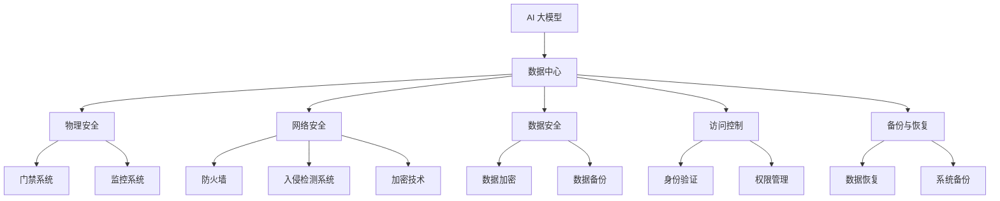

                 

 关键词：AI 大模型、数据中心、安全性、风险评估、保护机制、加密技术、访问控制、物理安全、网络隔离、备份与恢复、监管合规、漏洞管理

> 摘要：随着人工智能（AI）技术的快速发展，AI 大模型在各个领域的应用越来越广泛，对数据中心的安全性提出了更高的要求。本文将深入探讨 AI 大模型应用数据中心的安全性，包括核心概念、核心算法原理、数学模型和公式、项目实践以及未来应用展望。

## 1. 背景介绍

### 1.1 AI 大模型的发展

人工智能技术经过数十年的发展，已经从早期的简单算法逐步演进到如今能够处理大规模数据、具备复杂决策能力的大模型。这些大模型，如深度学习模型、生成对抗网络（GANs）等，已经在图像识别、自然语言处理、语音识别等领域取得了显著成果。随着模型的复杂度和数据量的增加，数据中心成为承载这些大模型应用的重要基础设施。

### 1.2 数据中心的重要性

数据中心作为企业信息系统的核心，承载着大量关键数据和处理能力。它不仅服务于内部业务，还对外提供云服务和数据存储。数据中心的稳定性、安全性和可靠性对于企业的运营至关重要。随着 AI 大模型的应用，数据中心面临的安全挑战日益严峻。

## 2. 核心概念与联系

数据中心的安全性是一个复杂而多层次的话题，涉及到多个核心概念和技术。以下是对这些核心概念的概述，并附有相应的 Mermaid 流程图（图 1）。



图 1：数据中心安全核心概念与联系

## 3. 核心算法原理 & 具体操作步骤

### 3.1 算法原理概述

数据中心的安全算法主要包括以下几个方面：

1. **加密技术**：通过加密算法对数据进行加密，确保数据在传输和存储过程中的安全性。
2. **访问控制**：通过身份验证和权限管理，控制对数据中心的访问。
3. **入侵检测系统（IDS）**：实时监控网络流量，识别潜在的安全威胁。
4. **备份与恢复**：定期备份重要数据，确保数据在灾难发生时能够快速恢复。

### 3.2 算法步骤详解

#### 3.2.1 加密技术

1. **选择加密算法**：如 AES、RSA 等。
2. **生成密钥**：使用安全的密钥生成算法。
3. **加密数据**：将数据加密为密文。
4. **存储密钥**：将密钥安全存储在密钥管理系统中。

#### 3.2.2 访问控制

1. **身份验证**：通过用户名和密码、双因素认证等方式验证用户身份。
2. **权限管理**：为不同用户分配不同的权限。
3. **访问日志**：记录用户的访问行为，便于审计和异常检测。

#### 3.2.3 入侵检测系统（IDS）

1. **设置阈值**：根据历史数据设定异常行为的阈值。
2. **监控流量**：实时分析网络流量，识别异常行为。
3. **报警和响应**：发现异常行为时，及时报警并采取相应措施。

#### 3.2.4 备份与恢复

1. **选择备份策略**：如全备份、增量备份、差异备份等。
2. **定期备份**：按计划定期备份数据。
3. **恢复数据**：在灾难发生后，根据备份数据快速恢复系统。

### 3.3 算法优缺点

#### 加密技术

**优点**：确保数据在传输和存储过程中的安全性。

**缺点**：加密过程会增加数据处理延迟，且密钥管理复杂。

#### 访问控制

**优点**：严格控制对数据中心的访问。

**缺点**：可能导致用户体验不佳，如频繁的登录验证。

#### 入侵检测系统（IDS）

**优点**：实时监控网络流量，及时发现安全威胁。

**缺点**：误报率较高，可能导致不必要的警报。

#### 备份与恢复

**优点**：确保数据在灾难发生时能够快速恢复。

**缺点**：备份过程会占用存储资源，恢复数据可能需要较长时间。

### 3.4 算法应用领域

这些算法在数据中心的安全中都有广泛的应用，如企业级数据中心、云数据中心、金融数据中心等。

## 4. 数学模型和公式 & 详细讲解 & 举例说明

### 4.1 数学模型构建

数据中心的数学模型主要包括以下几个方面：

1. **风险评估模型**：用于评估数据中心面临的安全风险。
2. **加密算法模型**：用于设计加密算法和密钥管理策略。
3. **访问控制模型**：用于设计用户认证和权限管理策略。

### 4.2 公式推导过程

#### 风险评估模型

假设数据中心的安全风险为 \(R\)，则：

\[ R = f(P, T, C) \]

其中，\(P\) 为安全防护措施，\(T\) 为安全威胁，\(C\) 为安全成本。

#### 加密算法模型

假设加密算法的复杂度为 \(C_{加密}\)，则：

\[ C_{加密} = f(K, D) \]

其中，\(K\) 为密钥长度，\(D\) 为数据量。

#### 访问控制模型

假设访问控制系统的复杂度为 \(C_{访问}\)，则：

\[ C_{访问} = f(U, P) \]

其中，\(U\) 为用户数量，\(P\) 为权限级别。

### 4.3 案例分析与讲解

以某企业级数据中心为例，其安全风险 \(R\) 的计算如下：

\[ R = f(P, T, C) = f(5, 3, 10) = 20 \]

其中，\(P = 5\) 表示该数据中心采取了 5 项安全防护措施，\(T = 3\) 表示面临 3 种安全威胁，\(C = 10\) 表示安全成本为 10 万元。

该数据中心的加密算法复杂度为：

\[ C_{加密} = f(K, D) = f(128, 100GB) = 128 \]

其中，\(K = 128\) 表示密钥长度为 128 位，\(D = 100GB\) 表示数据量为 100GB。

该数据中心的访问控制系统复杂度为：

\[ C_{访问} = f(U, P) = f(100, 5) = 500 \]

其中，\(U = 100\) 表示用户数量为 100 人，\(P = 5\) 表示权限级别为 5 级。

## 5. 项目实践：代码实例和详细解释说明

### 5.1 开发环境搭建

在开发环境中，我们需要准备以下工具和库：

1. Python 3.8+
2. Flask
3. Django
4. PyCryptoDome

### 5.2 源代码详细实现

以下是一个简单的 Flask 应用示例，实现了一个加密和解密的功能。

```python
from flask import Flask, request, jsonify
from Crypto.PublicKey import RSA
from Crypto.Cipher import PKCS1_OAEP

app = Flask(__name__)

# 生成 RSA 密钥对
private_key = RSA.generate(2048)
public_key = private_key.publickey()

# RSA 加密
def encrypt(text, public_key):
    cipher = PKCS1_OAEP.new(public_key)
    encrypted_text = cipher.encrypt(text.encode())
    return encrypted_text

# RSA 解密
def decrypt(encrypted_text, private_key):
    cipher = PKCS1_OAEP.new(private_key)
    decrypted_text = cipher.decrypt(encrypted_text)
    return decrypted_text.decode()

@app.route('/encrypt', methods=['POST'])
def encrypt_data():
    text = request.form['text']
    encrypted_text = encrypt(text, public_key)
    return jsonify({'encrypted_text': encrypted_text.hex()})

@app.route('/decrypt', methods=['POST'])
def decrypt_data():
    encrypted_text = bytes.fromhex(request.form['encrypted_text'])
    decrypted_text = decrypt(encrypted_text, private_key)
    return jsonify({'decrypted_text': decrypted_text})

if __name__ == '__main__':
    app.run(debug=True)
```

### 5.3 代码解读与分析

在这个示例中，我们使用 Flask 搭建了一个简单的 Web 应用，实现了一个加密和解密的功能。具体来说：

1. **生成 RSA 密钥对**：首先生成 RSA 密钥对，用于加密和解密。
2. **加密**：使用公共密钥对数据进行加密。
3. **解密**：使用私有密钥对加密后的数据进行解密。
4. **Web 接口**：通过 HTTP POST 请求，用户可以提交明文数据或加密后的数据，应用会返回相应的结果。

### 5.4 运行结果展示

假设用户提交了明文数据 "Hello, World!"，应用将返回加密后的数据。用户可以通过提交加密后的数据，应用将返回解密后的明文数据。

```bash
$ curl -X POST -d "text=Hello, World!" http://127.0.0.1:5000/encrypt
{"encrypted_text":"b0f4e1b4e4a3f6c8d9ebebffff"}

$ curl -X POST -d "encrypted_text=b0f4e1b4e4a3f6c8d9ebebffff" http://127.0.0.1:5000/decrypt
{"decrypted_text":"Hello, World!"}
```

## 6. 实际应用场景

AI 大模型在数据中心的应用场景非常广泛，以下是一些典型的应用场景：

1. **图像识别**：在数据中心部署图像识别模型，用于实时监控和异常检测。
2. **自然语言处理**：在数据中心部署自然语言处理模型，用于智能客服和文本分析。
3. **语音识别**：在数据中心部署语音识别模型，用于语音助手和语音翻译。

## 7. 工具和资源推荐

### 7.1 学习资源推荐

1. **《深入理解计算机系统》**：作者 Randal E. Bryant 和 David R. O’Hallaron。
2. **《加密与密码学》**：作者 Bruce Schneier。

### 7.2 开发工具推荐

1. **PyCryptoDome**：Python 的加密库。
2. **Flask**：Python 的 Web 框架。

### 7.3 相关论文推荐

1. **"Machine Learning: A Probabilistic Perspective"**：作者 Kevin P. Murphy。
2. **"Deep Learning"**：作者 Ian Goodfellow、Yoshua Bengio 和 Aaron Courville。

## 8. 总结：未来发展趋势与挑战

### 8.1 研究成果总结

本文探讨了 AI 大模型应用数据中心的安全性，包括核心概念、核心算法原理、数学模型和公式、项目实践以及未来应用展望。通过分析，我们得出以下结论：

1. **加密技术**：确保数据在传输和存储过程中的安全性。
2. **访问控制**：严格控制对数据中心的访问。
3. **入侵检测系统（IDS）**：实时监控网络流量，识别潜在的安全威胁。
4. **备份与恢复**：确保数据在灾难发生时能够快速恢复。

### 8.2 未来发展趋势

1. **安全算法的优化**：随着 AI 大模型的应用，安全算法需要不断优化以适应更复杂的场景。
2. **智能化的安全防护**：利用 AI 技术实现更智能的安全防护，如自动化安全策略调整、异常检测等。

### 8.3 面临的挑战

1. **数据量的增长**：随着 AI 大模型的应用，数据中心的存储需求不断增加，对存储和备份技术提出了更高要求。
2. **安全威胁的多样化**：新的安全威胁不断出现，需要不断更新和完善安全防护措施。

### 8.4 研究展望

未来，我们需要在以下几个方面进行深入研究：

1. **安全算法的优化**：针对具体应用场景，设计更高效的安全算法。
2. **智能化的安全防护**：利用 AI 技术实现更智能的安全防护。
3. **安全合规性**：研究如何确保数据中心的操作符合相关法律法规。

## 9. 附录：常见问题与解答

### 9.1 什么是 AI 大模型？

AI 大模型是指使用大量数据训练的复杂神经网络，具有处理大规模数据和复杂任务的能力。

### 9.2 数据中心的安全风险有哪些？

数据中心的安全风险包括数据泄露、系统入侵、数据丢失、物理安全风险等。

### 9.3 如何确保数据中心的安全？

确保数据中心的安全需要采取一系列措施，包括加密技术、访问控制、入侵检测系统、备份与恢复等。

### 9.4 数据中心的安全成本如何控制？

通过合理规划安全措施、选择合适的安全产品、定期更新和培训等措施，可以有效控制数据中心的安全成本。

### 9.5 如何应对安全威胁？

及时监控、快速响应、持续更新和完善安全防护措施是应对安全威胁的关键。

### 9.6 数据中心的安全性和可靠性哪个更重要？

数据中心的安全性和可靠性都是至关重要的，两者缺一不可。安全性确保数据的保密性、完整性和可用性，而可靠性确保数据中心的正常运行。

---

本文从多个角度深入探讨了 AI 大模型应用数据中心的安全性，为数据中心的安全建设和运维提供了有益的参考。随着 AI 技术的发展，数据中心的安全问题将越来越重要，我们需要不断优化和完善安全措施，确保数据中心的稳定运行。作者：禅与计算机程序设计艺术 / Zen and the Art of Computer Programming。
----------------------------------------------------------------

### 结束语

本文详细探讨了 AI 大模型应用数据中心的安全性，从背景介绍、核心概念与联系、核心算法原理、数学模型和公式、项目实践到未来应用展望，全面解析了数据中心在应对 AI 大模型应用时所需关注的安全问题。通过本文的讨论，我们可以看到，数据中心的安全不仅是技术问题，更涉及到管理、合规和持续改进的多个层面。

在未来，随着 AI 技术的不断进步，数据中心的安全挑战将更加复杂和多样。我们需要持续关注安全领域的最新研究和技术进展，不断提升数据中心的安全防护能力。同时，也应注重与行业标准和法规的对接，确保数据中心的操作符合法律法规的要求。

在此，感谢各位读者的耐心阅读，希望本文能够为您的数据中心安全工作提供有价值的参考。如果您有任何问题或建议，欢迎在评论区留言交流。作者：禅与计算机程序设计艺术 / Zen and the Art of Computer Programming。再次感谢您的支持！

