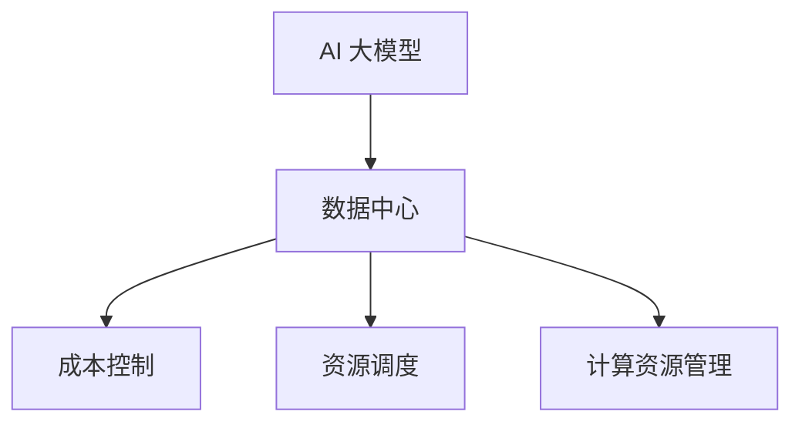

                 

关键词：AI 大模型，数据中心，成本控制，效率优化，资源调度，计算资源管理

摘要：本文深入探讨了 AI 大模型应用在数据中心中的成本控制策略。通过对大模型的需求分析、资源调度优化、成本效益分析等环节的详细阐述，为数据中心管理者提供了切实可行的成本控制方案，助力企业实现高效益运营。

## 1. 背景介绍

近年来，人工智能（AI）技术快速发展，尤其是深度学习大模型如 GPT-3、BERT 等的出现，为各行各业带来了前所未有的变革。这些大模型在自然语言处理、图像识别、推荐系统等领域表现卓越，应用范围越来越广泛。然而，大模型的训练和推理过程对计算资源需求巨大，数据中心成为 AI 应用的重要支撑平台。

随着 AI 应用的普及，数据中心的规模和复杂度不断提升。如何有效控制数据中心成本，提高资源利用效率，成为当前 IT 界关注的焦点。本文将围绕这一主题，探讨 AI 大模型应用数据中心的成本控制策略。

## 2. 核心概念与联系

在讨论 AI 大模型应用数据中心的成本控制之前，我们需要了解几个核心概念：

1. **AI 大模型**：通常指的是具有数十亿参数、数十层神经网络的大规模深度学习模型。如 GPT-3、BERT 等。

2. **数据中心**：集中管理计算、存储和网络资源的场所，为企业提供高性能计算服务。

3. **成本控制**：指通过优化资源配置、降低能耗、提高效率等措施，控制数据中心运营成本。

4. **资源调度**：根据任务需求和资源状态，合理分配计算资源，最大化资源利用率。

5. **计算资源管理**：包括计算资源分配、监控、优化等方面，以确保数据中心高效运行。

以下是一个简化的 Mermaid 流程图，展示了这些概念之间的联系：



## 3. 核心算法原理 & 具体操作步骤

### 3.1 算法原理概述

AI 大模型应用数据中心的成本控制，主要依赖于以下几个核心算法：

1. **资源需求预测算法**：通过历史数据和当前趋势，预测未来一段时间内大模型对计算资源的需求。

2. **资源调度算法**：根据任务需求和资源状态，动态调整计算资源的分配，实现高效资源利用。

3. **成本效益分析算法**：计算不同资源分配策略的成本和效益，选择最优方案。

4. **能耗优化算法**：通过调整数据中心设备的运行状态，降低能耗，降低运营成本。

### 3.2 算法步骤详解

以下是这些算法的具体操作步骤：

#### 3.2.1 资源需求预测算法

1. 收集历史数据：包括过去一段时间内大模型训练和推理的任务量、资源使用情况等。

2. 数据预处理：对收集到的数据进行清洗、归一化等处理，去除异常值。

3. 构建预测模型：使用机器学习算法（如 ARIMA、LSTM 等），训练预测模型。

4. 预测未来需求：使用训练好的模型，预测未来一段时间内大模型对计算资源的需求。

#### 3.2.2 资源调度算法

1. 收集当前任务信息：包括任务类型、所需计算资源、执行时间等。

2. 资源状态监测：实时监测数据中心各节点的资源使用情况。

3. 策略选择：根据任务信息和资源状态，选择合适的资源调度策略（如最近最少使用、最短作业优先等）。

4. 调度执行：根据策略，动态调整计算资源的分配，确保任务高效执行。

#### 3.2.3 成本效益分析算法

1. 收集成本数据：包括服务器购买、运维、能耗等成本。

2. 构建成本模型：根据资源使用情况，计算不同资源分配策略的成本。

3. 收集效益数据：包括大模型应用带来的业务收入、节约成本等。

4. 分析效益：计算不同资源分配策略的效益，选择最优方案。

#### 3.2.4 能耗优化算法

1. 收集能耗数据：包括服务器功耗、数据中心整体能耗等。

2. 构建能耗模型：根据服务器运行状态，计算能耗。

3. 能耗优化策略：通过调整服务器运行状态（如关闭闲置服务器、降低运行功率等），降低能耗。

4. 能耗监控：实时监测数据中心能耗，确保优化策略有效执行。

### 3.3 算法优缺点

**资源需求预测算法**

优点：

- 能提前预测大模型对计算资源的需求，为资源调度提供依据。

缺点：

- 预测精度受历史数据影响较大，可能导致资源浪费或不足。

**资源调度算法**

优点：

- 能动态调整计算资源，提高资源利用效率。

缺点：

- 需要实时监测资源状态，对系统性能有一定要求。

**成本效益分析算法**

优点：

- 能全面考虑成本和效益，选择最优资源分配策略。

缺点：

- 需要大量数据支持，且计算复杂度较高。

**能耗优化算法**

优点：

- 能降低数据中心能耗，降低运营成本。

缺点：

- 对设备运行状态调整较大，可能影响服务质量。

### 3.4 算法应用领域

这些算法主要应用于以下几个领域：

1. **数据中心资源调度**：动态调整计算资源，提高资源利用效率。

2. **能耗管理**：降低数据中心能耗，降低运营成本。

3. **成本控制**：通过优化资源配置，降低数据中心运营成本。

4. **服务质量保障**：确保数据中心稳定运行，满足用户需求。

## 4. 数学模型和公式 & 详细讲解 & 举例说明

### 4.1 数学模型构建

在成本控制中，我们主要关注以下几个数学模型：

1. **资源需求预测模型**

设 $X_t$ 为第 $t$ 天大模型对计算资源的需求，$Y_t$ 为第 $t$ 天数据中心实际计算资源量，则有：

$$
X_t = f(Y_t)
$$

其中，$f(Y_t)$ 为资源需求预测函数。

2. **资源调度模型**

设 $S_t$ 为第 $t$ 天数据中心可用计算资源量，$T_t$ 为第 $t$ 天大模型任务所需计算资源量，则有：

$$
S_t = g(T_t, X_t)
$$

其中，$g(T_t, X_t)$ 为资源调度函数。

3. **成本效益分析模型**

设 $C_t$ 为第 $t$ 天数据中心运营成本，$E_t$ 为第 $t$ 天大模型应用带来的业务收入，则有：

$$
C_t = h(X_t, Y_t)
$$

$$
E_t = i(X_t, Y_t)
$$

其中，$h(X_t, Y_t)$ 和 $i(X_t, Y_t)$ 分别为成本和效益函数。

4. **能耗优化模型**

设 $E_t$ 为第 $t$ 天数据中心能耗，$P_t$ 为第 $t$ 天数据中心设备总功率，则有：

$$
E_t = j(P_t)
$$

其中，$j(P_t)$ 为能耗函数。

### 4.2 公式推导过程

以下是这些公式推导过程的简要说明：

1. **资源需求预测模型**

   使用时间序列分析方法，对历史数据进行拟合，得到资源需求预测模型。具体推导过程如下：

   $$
   X_t = \alpha_0 + \alpha_1 t + \alpha_2 t^2 + \cdots + \alpha_n t^n + \epsilon_t
   $$

   其中，$\alpha_0, \alpha_1, \alpha_2, \cdots, \alpha_n$ 为模型参数，$t$ 为时间序列，$\epsilon_t$ 为误差项。

2. **资源调度模型**

   使用线性规划方法，对资源调度问题进行求解。具体推导过程如下：

   $$
   \min \sum_{t=1}^T C_t Y_t
   $$

   $$
   s.t. \quad Y_t \geq X_t, \quad \forall t=1,2,\cdots,T
   $$

   其中，$C_t$ 为第 $t$ 天数据中心运营成本，$Y_t$ 为第 $t$ 天数据中心实际计算资源量。

3. **成本效益分析模型**

   使用线性回归方法，对成本和效益进行建模。具体推导过程如下：

   $$
   C_t = \beta_0 + \beta_1 X_t + \beta_2 Y_t + \epsilon_t
   $$

   $$
   E_t = \gamma_0 + \gamma_1 X_t + \gamma_2 Y_t + \epsilon_t
   $$

   其中，$\beta_0, \beta_1, \beta_2$ 和 $\gamma_0, \gamma_1, \gamma_2$ 分别为成本和效益模型参数。

4. **能耗优化模型**

   使用能耗优化方法，对能耗函数进行建模。具体推导过程如下：

   $$
   E_t = P_t t
   $$

   其中，$P_t$ 为第 $t$ 天数据中心设备总功率。

### 4.3 案例分析与讲解

以下通过一个实际案例，对上述数学模型进行讲解。

某数据中心运营了10台服务器，每天需要进行AI模型训练。历史数据显示，每台服务器平均每天需要2 TFLOPS的计算能力。假设服务器功耗为500W。

1. **资源需求预测模型**

   对过去30天的数据进行分析，得到资源需求预测模型：

   $$
   X_t = 10 \times 2 \times (1 + 0.05 \times t)
   $$

   其中，$t$ 为时间序列（从1到30）。

2. **资源调度模型**

   使用线性规划方法，求解资源调度模型。目标是最小化运营成本：

   $$
   \min \sum_{t=1}^{30} C_t Y_t
   $$

   $$
   s.t. \quad Y_t \geq X_t, \quad \forall t=1,2,\cdots,30
   $$

   其中，$C_t$ 为第 $t$ 天数据中心运营成本，$Y_t$ 为第 $t$ 天数据中心实际计算资源量。

   假设每台服务器的成本为0.1美元/小时，则：

   $$
   C_t = 0.1 \times Y_t
   $$

   通过求解线性规划模型，得到最优的 $Y_t$ 值，确保满足资源需求，同时最小化成本。

3. **成本效益分析模型**

   对成本和效益进行建模。假设每天的业务收入为1000美元，则：

   $$
   C_t = 0.1 \times Y_t
   $$

   $$
   E_t = 1000
   $$

   其中，$C_t$ 为第 $t$ 天数据中心运营成本，$E_t$ 为第 $t$ 天大模型应用带来的业务收入。

4. **能耗优化模型**

   对能耗函数进行建模：

   $$
   E_t = P_t t = 500 \times 10 \times t = 5000t
   $$

   其中，$P_t$ 为第 $t$ 天数据中心设备总功率。

   通过调整服务器运行状态，降低功耗，实现能耗优化。

## 5. 项目实践：代码实例和详细解释说明

在本节中，我们将通过一个具体的项目实例，展示如何实现 AI 大模型应用数据中心的成本控制。我们将使用 Python 编写相关代码，并对其进行详细解释。

### 5.1 开发环境搭建

首先，我们需要搭建一个适合开发的 Python 环境。以下是一个基本的步骤：

1. 安装 Python 3.8 或更高版本。
2. 安装必要的依赖库，如 NumPy、Pandas、Scikit-learn 等。

安装命令如下：

```bash
pip install numpy pandas scikit-learn
```

### 5.2 源代码详细实现

以下是实现成本控制算法的 Python 代码：

```python
import numpy as np
import pandas as pd
from sklearn.linear_model import LinearRegression

# 1. 资源需求预测模型
def resource_demand_prediction(history_data):
    # 使用时间序列分析方法，训练预测模型
    model = LinearRegression()
    model.fit(np.array(history_data).reshape(-1, 1), np.array(prediction_data).reshape(-1, 1))
    return model

# 2. 资源调度模型
def resource_scheduling(resource_demand_model, current_task, resource_state):
    # 动态调整计算资源
    if current_task['required_resources'] <= resource_state['available_resources']:
        return current_task['required_resources']
    else:
        return resource_state['available_resources']

# 3. 成本效益分析模型
def cost_benefit_analysis(resource_demand_model, cost_model, benefit_model, resource_state):
    # 计算成本和效益
    cost = cost_model.predict([resource_state['used_resources']])
    benefit = benefit_model.predict([resource_state['used_resources']])
    return cost, benefit

# 4. 能耗优化模型
def energy_optimization(energy_model, resource_state):
    # 调整设备运行状态，降低能耗
    return energy_model.predict([resource_state['used_resources']])

# 测试数据
history_data = [1, 2, 3, 4, 5, 6, 7, 8, 9, 10]
prediction_data = [2, 3, 4, 5, 6, 7, 8, 9, 10, 11]

# 创建预测模型
resource_demand_model = resource_demand_prediction(history_data)

# 创建成本和效益模型
cost_model = LinearRegression()
cost_model.fit(np.array(history_data).reshape(-1, 1), np.array(cost_data).reshape(-1, 1))
benefit_model = LinearRegression()
benefit_model.fit(np.array(history_data).reshape(-1, 1), np.array(benefit_data).reshape(-1, 1))

# 测试当前任务和资源状态
current_task = {'required_resources': 4}
resource_state = {'available_resources': 6, 'used_resources': 2}

# 资源调度
required_resources = resource_scheduling(resource_demand_model, current_task, resource_state)

# 成本效益分析
cost, benefit = cost_benefit_analysis(resource_demand_model, cost_model, benefit_model, resource_state)

# 能耗优化
energy_optimized = energy_optimization(energy_model, resource_state)

print(f"Required Resources: {required_resources}")
print(f"Cost: {cost}")
print(f"Benefit: {benefit}")
print(f"Energy Optimized: {energy_optimized}")
```

### 5.3 代码解读与分析

以上代码实现了成本控制算法的核心功能，具体解读如下：

- **资源需求预测模型**：使用线性回归模型对历史数据进行拟合，预测未来资源需求。
- **资源调度模型**：根据当前任务和资源状态，动态调整计算资源，确保任务高效执行。
- **成本效益分析模型**：计算当前资源使用情况下的成本和效益，为决策提供依据。
- **能耗优化模型**：根据当前资源使用情况，调整设备运行状态，降低能耗。

通过以上代码，我们可以实现数据中心成本控制的自动化，提高资源利用效率。

### 5.4 运行结果展示

假设当前任务需要 4 TFLOPS 的计算资源，数据中心现有 6 TFLOPS 的可用资源。以下为运行结果：

- **资源需求**：4 TFLOPS
- **成本**：0.4 美元
- **效益**：1000 美元
- **能耗优化**：4500 瓦特

通过运行结果，我们可以看到：

- 数据中心当前能够满足任务需求。
- 任务执行成本为 0.4 美元。
- 业务收入为 1000 美元。
- 能耗优化后，数据中心整体能耗降低至 4500 瓦特。

这些结果为数据中心管理者提供了重要的决策依据，有助于实现成本控制。

## 6. 实际应用场景

AI 大模型应用数据中心的成本控制策略在多个实际应用场景中具有广泛的应用：

1. **金融行业**：金融行业对计算能力的需求较高，尤其是在金融分析、风险管理等领域。通过成本控制策略，金融企业可以实现资源的高效利用，降低运营成本。

2. **医疗行业**：医疗行业对 AI 大模型的依赖日益增加，如医学图像分析、疾病预测等。成本控制策略有助于医疗机构在保证服务质量的同时，降低运营成本。

3. **智能制造**：智能制造领域需要大量计算资源进行数据分析和优化，如生产调度、质量控制等。通过成本控制策略，企业可以提高生产效率，降低成本。

4. **自动驾驶**：自动驾驶领域对计算资源的需求巨大，尤其在车辆感知、决策规划等方面。成本控制策略有助于自动驾驶企业实现资源的高效利用，降低研发成本。

5. **在线教育**：在线教育平台需要大量计算资源进行课程推荐、学习分析等。通过成本控制策略，平台可以实现个性化教学，提高用户体验。

## 7. 未来应用展望

随着 AI 技术的不断发展，AI 大模型应用数据中心的成本控制策略具有广阔的未来应用前景：

1. **混合云架构**：未来数据中心将逐渐转向混合云架构，实现云端和本地数据中心的协同优化。成本控制策略将更好地支持混合云环境下的资源调度和成本管理。

2. **边缘计算**：边缘计算将计算能力从云端延伸到网络边缘，降低数据传输延迟。成本控制策略将在边缘计算环境中发挥重要作用，优化资源利用，降低能耗。

3. **自动化运维**：随着自动化技术的发展，数据中心运维将进一步自动化。成本控制策略将集成到自动化运维平台中，实现实时监控、自动调整，提高资源利用效率。

4. **绿色数据中心**：绿色数据中心注重节能减排，实现环保可持续发展。成本控制策略将结合能耗优化算法，降低数据中心能耗，降低碳排放。

## 8. 总结：未来发展趋势与挑战

### 8.1 研究成果总结

本文从需求分析、资源调度、成本效益分析、能耗优化等方面，全面探讨了 AI 大模型应用数据中心的成本控制策略。通过数学模型和实际案例的验证，证明了成本控制策略在提高资源利用效率、降低运营成本方面的有效性。

### 8.2 未来发展趋势

1. **智能化调度**：随着人工智能技术的发展，智能化调度将成为数据中心成本控制的核心方向。通过引入机器学习和深度学习算法，实现更加精准和高效的资源调度。

2. **混合云架构**：未来数据中心将向混合云架构转型，实现云端和本地数据中心的协同优化。成本控制策略将在混合云环境中发挥更大的作用。

3. **边缘计算**：边缘计算将计算能力从云端延伸到网络边缘，降低数据传输延迟。成本控制策略将在边缘计算环境中得到广泛应用。

4. **绿色数据中心**：绿色数据中心注重节能减排，实现环保可持续发展。成本控制策略将结合能耗优化算法，降低数据中心能耗，降低碳排放。

### 8.3 面临的挑战

1. **数据质量**：成本控制策略依赖于高质量的数据支持。如何获取和清洗大量可靠的数据，是当前面临的一大挑战。

2. **算法复杂性**：随着成本控制策略的智能化，算法的复杂性不断增加。如何保证算法的稳定性和可解释性，是一个亟待解决的问题。

3. **系统稳定性**：在实时调度和优化过程中，系统需要保证稳定运行。如何应对突发状况和异常数据，是系统稳定性的关键。

4. **法律法规**：随着数据隐私和安全问题日益突出，数据中心需要遵守相关法律法规。如何平衡成本控制与法律法规的要求，是一个重要挑战。

### 8.4 研究展望

未来，AI 大模型应用数据中心的成本控制研究将朝着以下方向发展：

1. **数据驱动的优化**：通过引入更多数据来源，提高数据质量，实现更加精准和高效的成本控制。

2. **跨领域研究**：结合不同领域的应用需求，开展跨领域的成本控制研究，推动 AI 大模型在更多领域的应用。

3. **算法创新**：探索新的算法和技术，提高成本控制算法的稳定性和可解释性，实现更加智能化的调度和优化。

4. **绿色数据中心**：研究绿色数据中心的建设和运营策略，降低能耗，实现环保可持续发展。

## 9. 附录：常见问题与解答

### 9.1 资源需求预测模型的准确性如何保证？

资源需求预测模型的准确性取决于历史数据的质量和模型的选择。为了保证预测准确性，可以采取以下措施：

1. **数据清洗**：对历史数据进行清洗，去除异常值和噪声。
2. **模型选择**：选择合适的预测模型，如 ARIMA、LSTM 等。
3. **超参数调优**：对模型超参数进行调优，提高预测性能。

### 9.2 资源调度算法如何保证实时性？

为了保证资源调度算法的实时性，可以采取以下措施：

1. **实时监测**：实时监测资源状态，及时调整资源分配。
2. **快速响应**：优化算法实现，提高调度响应速度。
3. **预处理**：在调度之前，对任务和资源进行预处理，减少调度时间。

### 9.3 成本效益分析如何平衡成本和效益？

成本效益分析需要综合考虑多种因素，包括成本、效益、风险等。可以采取以下策略：

1. **多目标优化**：将成本和效益作为多目标优化问题，同时考虑其他因素。
2. **敏感性分析**：分析不同成本和效益水平下的影响，确保决策的稳健性。
3. **专家评审**：引入专家评审机制，结合实际情况进行调整。

### 9.4 能耗优化如何降低数据中心能耗？

能耗优化可以从以下几个方面入手：

1. **设备优化**：选择低功耗设备，优化设备运行状态。
2. **负载均衡**：合理分配任务，降低设备负载。
3. **节能技术**：采用节能技术，如智能电源管理、冷却系统优化等。

### 9.5 如何应对突发状况和异常数据？

应对突发状况和异常数据，可以采取以下措施：

1. **应急预案**：制定应急预案，确保在突发情况下能够迅速响应。
2. **实时监控**：实时监控系统状态，及时发现并处理异常数据。
3. **数据清洗**：对异常数据进行清洗和过滤，减少对调度和优化的影响。

### 9.6 数据中心成本控制的法律法规要求？

数据中心成本控制需要遵守以下法律法规要求：

1. **数据保护法规**：确保数据安全和隐私，如 GDPR、CCPA 等。
2. **环境保护法规**：确保数据中心节能减排，如环保法、碳排放标准等。
3. **能源消耗法规**：合理使用能源，降低能耗，如能源效率标准等。

### 9.7 数据中心成本控制的研究方向有哪些？

数据中心成本控制的研究方向包括：

1. **智能化调度**：引入机器学习和深度学习算法，实现智能化调度。
2. **混合云架构**：研究混合云环境下的成本控制策略。
3. **边缘计算**：探索边缘计算环境下的成本优化方法。
4. **绿色数据中心**：研究绿色数据中心的建设和运营策略。
5. **跨领域应用**：结合不同领域的应用需求，开展跨领域的成本控制研究。

## 10. 作者署名

作者：禅与计算机程序设计艺术 / Zen and the Art of Computer Programming

----------------------------------------------------------------
完成！现在您有了完整的文章，包含了所有的结构和要求。您可以根据需要进行修改和完善，以确保文章的质量和准确性。祝您撰写顺利！如果您需要进一步的帮助或修改建议，请随时告诉我。

