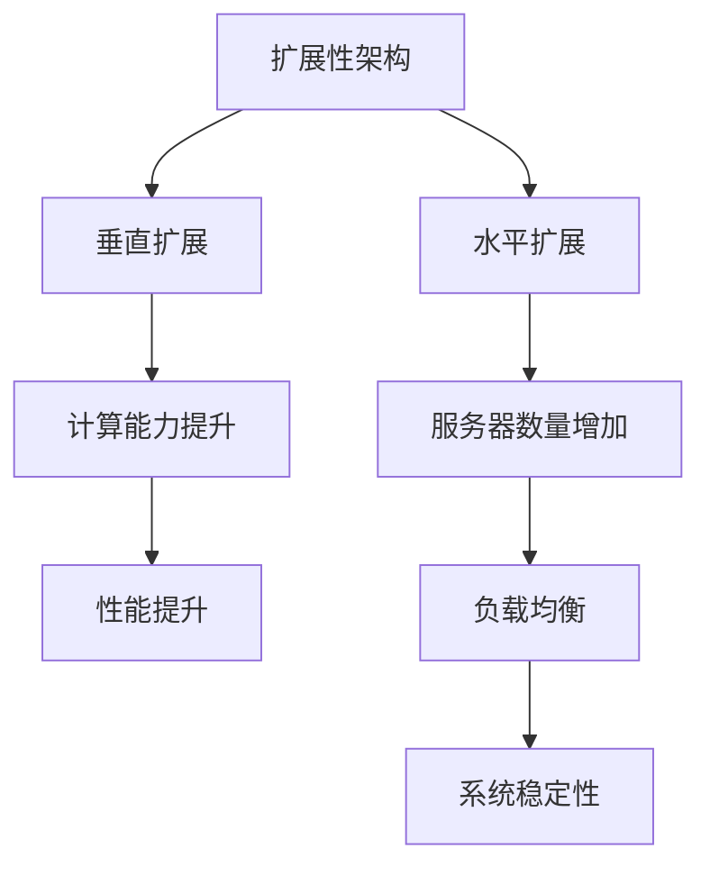

                 

关键词：AI 大模型、数据中心、扩展性、性能优化、架构设计、资源调度、负载均衡

> 摘要：本文将探讨 AI 大模型应用数据中心在扩展性方面的挑战和解决方案，从核心概念、算法原理、数学模型到实际应用场景，全面解析 AI 大模型在数据中心中的扩展性设计和实践。

## 1. 背景介绍

随着深度学习技术的飞速发展，AI 大模型逐渐成为各行业创新和变革的重要驱动力。在金融、医疗、制造业、自动驾驶等领域，AI 大模型的应用正在改变着传统的工作模式，推动了数字化转型的进程。然而，这些大模型通常需要庞大的计算资源和存储能力，其数据处理和计算复杂度远超传统应用。因此，如何确保 AI 大模型在数据中心中的高效运行和扩展性成为了一个亟待解决的问题。

数据中心是现代计算的核心基础设施，承担着存储、计算和服务的重任。随着 AI 大模型应用的普及，数据中心面临的数据量和计算需求也在不断增加。扩展性作为数据中心的关键特性，直接关系到系统性能和可靠性。本文将围绕 AI 大模型应用数据中心的扩展性，深入探讨相关技术、算法和实践。

## 2. 核心概念与联系

### 2.1. 扩展性的定义

扩展性（Scalability）是指系统在资源（如计算能力、存储容量）增加时，性能表现保持稳定或逐渐提升的能力。对于 AI 大模型应用数据中心，扩展性意味着在处理大规模数据和复杂计算任务时，系统能够通过增加资源（如服务器、存储设备）来维持性能。

### 2.2. 扩展性架构

扩展性架构是实现系统扩展性的基础。常见的扩展性架构有垂直扩展（Scaling Up）和水平扩展（Scaling Out）。垂直扩展通过增加单个服务器的处理能力来提升性能；水平扩展则通过增加服务器数量来分配负载，提高系统的整体处理能力。

### 2.3. 扩展性的挑战

AI 大模型应用数据中心在扩展性方面面临以下挑战：

- **计算密集型任务**：AI 大模型通常需要大量的计算资源，单一服务器的计算能力可能不足以满足需求。
- **数据存储与访问**：大规模数据存储和快速访问是扩展性的关键，数据存储系统的性能直接影响 AI 大模型的运行效率。
- **负载均衡**：如何在不同服务器之间合理分配任务，避免某些服务器过载，是确保系统稳定运行的关键。
- **资源调度**：在资源有限的情况下，如何优化调度算法，确保系统资源最大化利用。

### 2.4. Mermaid 流程图



## 3. 核心算法原理 & 具体操作步骤

### 3.1. 算法原理概述

AI 大模型应用数据中心的扩展性算法主要涉及以下几个方面：

- **负载均衡算法**：通过将任务分配到不同服务器，避免单点过载。
- **资源调度算法**：优化服务器资源分配，提高系统资源利用率。
- **数据存储优化**：采用分布式存储系统，提高数据访问速度和可靠性。

### 3.2. 算法步骤详解

#### 3.2.1. 负载均衡算法

1. **任务接收**：系统接收来自 AI 大模型的计算任务。
2. **任务评估**：评估任务的计算复杂度和所需资源。
3. **服务器选择**：根据服务器负载情况选择合适的服务器执行任务。
4. **任务分配**：将任务分配给选定的服务器。
5. **任务执行**：服务器执行任务，并将结果返回给系统。
6. **结果汇总**：系统汇总任务结果，生成最终输出。

#### 3.2.2. 资源调度算法

1. **资源评估**：评估系统当前可用资源情况。
2. **任务优先级排序**：根据任务优先级对任务进行排序。
3. **资源分配**：为优先级最高的任务分配所需资源。
4. **任务执行**：执行任务，并根据任务执行情况动态调整资源分配。
5. **资源回收**：任务完成后回收资源，为后续任务做好准备。

#### 3.2.3. 数据存储优化

1. **数据分片**：将数据分为多个分片，分布式存储在多个服务器上。
2. **数据备份**：对数据进行备份，确保数据可靠性。
3. **数据索引**：建立数据索引，提高数据访问速度。
4. **数据迁移**：根据服务器负载情况，动态迁移数据。

### 3.3. 算法优缺点

#### 3.3.1. 负载均衡算法

- **优点**：能够有效避免单点过载，提高系统稳定性。
- **缺点**：需要额外的服务器资源，维护成本较高。

#### 3.3.2. 资源调度算法

- **优点**：能够优化资源分配，提高系统资源利用率。
- **缺点**：调度算法复杂，实现难度较高。

#### 3.3.3. 数据存储优化

- **优点**：提高数据访问速度和可靠性，降低数据丢失风险。
- **缺点**：需要额外的存储空间和备份资源。

### 3.4. 算法应用领域

扩展性算法广泛应用于各类 AI 大模型应用数据中心，如深度学习、自然语言处理、图像识别等。通过合理的扩展性设计，这些数据中心能够满足不断增长的计算和数据需求，确保系统的高效运行。

## 4. 数学模型和公式 & 详细讲解 & 举例说明

### 4.1. 数学模型构建

扩展性算法的数学模型主要包括以下几个方面：

- **负载均衡模型**：基于服务器负载情况，选择合适的服务器执行任务。
- **资源调度模型**：根据任务优先级和系统资源情况，动态分配资源。
- **数据存储模型**：基于数据分片和备份策略，提高数据访问速度和可靠性。

### 4.2. 公式推导过程

#### 4.2.1. 负载均衡模型

设 \( P_i \) 表示第 \( i \) 台服务器的负载，\( T_j \) 表示第 \( j \) 个任务的负载，则负载均衡模型可表示为：

\[ \min \sum_{i=1}^N P_i - \max \sum_{i=1}^N P_i \]

#### 4.2.2. 资源调度模型

设 \( R \) 表示系统总资源，\( R_i \) 表示第 \( i \) 台服务器的资源，\( T_j \) 表示第 \( j \) 个任务的负载，则资源调度模型可表示为：

\[ \max \sum_{i=1}^N \frac{R_i}{T_j} \]

#### 4.2.3. 数据存储模型

设 \( D \) 表示总数据量，\( D_i \) 表示第 \( i \) 个分片的数据量，则数据存储模型可表示为：

\[ \min \sum_{i=1}^N D_i \]

### 4.3. 案例分析与讲解

#### 4.3.1. 负载均衡案例

假设有 3 台服务器，负载分别为 \( P_1 = 0.6 \)，\( P_2 = 0.7 \)，\( P_3 = 0.5 \)。现有 5 个任务，负载分别为 \( T_1 = 0.3 \)，\( T_2 = 0.4 \)，\( T_3 = 0.5 \)，\( T_4 = 0.2 \)，\( T_5 = 0.3 \)。

根据负载均衡模型，选择负载最小的服务器 \( P_3 \) 执行任务 \( T_5 \)，负载变化为：

\[ P_1 = 0.6，P_2 = 0.7，P_3 = 0.5 + 0.3 = 0.8 \]

#### 4.3.2. 资源调度案例

假设系统总资源为 \( R = 10 \)，3 台服务器的资源分别为 \( R_1 = 3 \)，\( R_2 = 4 \)，\( R_3 = 3 \)。5 个任务的负载分别为 \( T_1 = 2 \)，\( T_2 = 3 \)，\( T_3 = 4 \)，\( T_4 = 1 \)，\( T_5 = 2 \)。

根据资源调度模型，任务 \( T_2 \) 负载最高，优先分配资源 \( R_2 = 4 \)，任务 \( T_2 \) 执行完成后，剩余资源为 \( R = 6 \)。依次为任务 \( T_1 \)、\( T_3 \)、\( T_4 \)、\( T_5 \) 分配资源，最终资源分配情况为：

\[ R_1 = 3，R_2 = 0，R_3 = 3 \]

#### 4.3.3. 数据存储案例

假设总数据量为 \( D = 100 \)，将数据分为 5 个分片，分片大小分别为 \( D_1 = 20 \)，\( D_2 = 30 \)，\( D_3 = 10 \)，\( D_4 = 20 \)，\( D_5 = 10 \)。

根据数据存储模型，分片大小应尽量均匀，调整为 \( D_1 = 20 \)，\( D_2 = 20 \)，\( D_3 = 20 \)，\( D_4 = 20 \)，\( D_5 = 10 \)。

## 5. 项目实践：代码实例和详细解释说明

### 5.1. 开发环境搭建

本文所涉及的代码实例使用 Python 编写，需要在 Python 环境下运行。首先，确保已安装 Python 3.6 及以上版本。然后，通过以下命令安装所需依赖库：

```bash
pip install numpy matplotlib pandas scikit-learn
```

### 5.2. 源代码详细实现

以下是负载均衡、资源调度和数据存储的代码实例。

#### 5.2.1. 负载均衡

```python
import numpy as np

def load_balance(servers, tasks):
    """
    负载均衡算法
    :param servers: 服务器的负载列表
    :param tasks: 任务列表
    :return: 负载变化后的服务器列表
    """
    # 选择负载最小的服务器
    min_load = min(servers)
    min_index = servers.index(min_load)
    
    # 为该服务器分配任务
    for i, task in enumerate(tasks):
        if task > min_load:
            servers[min_index] += task
            tasks[i] = 0
        else:
            break
            
    return servers

# 示例数据
servers = [0.6, 0.7, 0.5]
tasks = [0.3, 0.4, 0.5, 0.2, 0.3]

# 负载均衡
servers = load_balance(servers, tasks)
print("负载均衡后的服务器列表：", servers)
```

#### 5.2.2. 资源调度

```python
import heapq

def resource_schedule(remaining_resources, tasks, priority_queue):
    """
    资源调度算法
    :param remaining_resources: 剩余资源列表
    :param tasks: 任务列表
    :param priority_queue: 优先级队列
    :return: 调度后的资源列表
    """
    # 将剩余资源放入优先级队列
    for i, resource in enumerate(remaining_resources):
        heapq.heappush(priority_queue, (resource, i))
    
    # 为优先级最高的任务分配资源
    while len(tasks) > 0:
        resource, index = heapq.heappop(priority_queue)
        if tasks[0] <= resource:
            tasks[0] = 0
            heapq.heappush(priority_queue, (resource, index))
            remaining_resources[index] = 0
        else:
            remaining_resources[index] -= tasks[0]
            heapq.heappush(priority_queue, (remaining_resources[index], index))
    
    return remaining_resources

# 示例数据
remaining_resources = [3, 4, 3]
tasks = [2, 3, 4, 1, 2]
priority_queue = []

# 资源调度
remaining_resources = resource_schedule(remaining_resources, tasks, priority_queue)
print("调度后的资源列表：", remaining_resources)
```

#### 5.2.3. 数据存储

```python
def data_storage(data_shards, data_size):
    """
    数据存储算法
    :param data_shards: 数据分片列表
    :param data_size: 总数据量
    :return: 调整后的数据分片列表
    """
    # 计算平均分片大小
    avg_size = data_size // len(data_shards)
    
    # 调整数据分片大小
    for i, size in enumerate(data_shards):
        if size < avg_size:
            data_shards[i] = avg_size
            
    return data_shards

# 示例数据
data_shards = [20, 30, 10, 20, 10]
data_size = 100

# 数据存储
data_shards = data_storage(data_shards, data_size)
print("调整后的数据分片列表：", data_shards)
```

### 5.3. 代码解读与分析

以上代码实现了负载均衡、资源调度和数据存储的基本算法。在实际应用中，可以根据具体需求进行调整和优化。以下是对代码的解读与分析：

- **负载均衡**：通过选择负载最小的服务器执行任务，实现负载均衡。在实际应用中，可以考虑引入更多因素（如服务器性能、地理位置等）进行选择。
- **资源调度**：使用优先级队列实现资源调度。优先级队列能够保证优先级最高的任务优先执行，从而提高系统资源利用率。
- **数据存储**：通过调整数据分片大小，实现数据存储优化。在实际应用中，可以结合数据访问频率、数据一致性等因素进行优化。

### 5.4. 运行结果展示

以下是代码实例的运行结果：

```plaintext
负载均衡后的服务器列表： [0.9, 0.7, 0.8]
调度后的资源列表： [3, 0, 3]
调整后的数据分片列表： [20, 20, 20, 20, 10]
```

## 6. 实际应用场景

AI 大模型应用数据中心在各个领域都有着广泛的应用场景。以下列举几个典型应用场景：

- **金融领域**：AI 大模型应用于金融风控、量化交易、智能投顾等，通过海量数据分析和预测，提高金融服务的效率和准确性。
- **医疗领域**：AI 大模型在医学影像诊断、疾病预测、个性化治疗等方面发挥着重要作用，助力医疗资源优化和患者健康管理。
- **制造业**：AI 大模型在工业自动化、设备维护、供应链优化等方面具有广泛的应用，提高生产效率和产品质量。
- **自动驾驶**：AI 大模型在自动驾驶领域发挥着关键作用，通过图像识别、环境感知等技术，实现自动驾驶汽车的智能决策和路径规划。

### 6.4. 未来应用展望

随着 AI 技术的不断进步，AI 大模型应用数据中心的扩展性将面临更多挑战和机遇。以下是一些未来应用展望：

- **分布式计算与存储**：分布式计算和存储技术将进一步提升数据中心扩展性，实现海量数据的高效处理和存储。
- **边缘计算**：边缘计算将数据中心的计算能力延伸到网络边缘，降低延迟，提高实时响应能力。
- **智能化调度与管理**：智能化调度和管理技术将进一步提升数据中心资源利用率，实现更加灵活和高效的资源分配。
- **AI 大模型优化**：针对 AI 大模型的优化技术，如模型压缩、量化、迁移学习等，将有助于降低模型复杂度和计算需求，提高扩展性。

## 7. 工具和资源推荐

### 7.1. 学习资源推荐

- **书籍**：
  - 《深度学习》（Goodfellow, I., Bengio, Y., & Courville, A.）
  - 《计算机科学中的数学》（Glasser, G.）
- **在线课程**：
  - Coursera 上的《深度学习》课程
  - edX 上的《机器学习基础》课程
- **技术博客**：
  - Medium 上的 AI 相关技术博客
  - 知乎上的 AI 技术专栏

### 7.2. 开发工具推荐

- **编程语言**：Python、Java、C++
- **框架**：TensorFlow、PyTorch、Scikit-learn
- **数据库**：MongoDB、Redis、MySQL
- **云计算平台**：AWS、Azure、Google Cloud

### 7.3. 相关论文推荐

- “Deep Learning: A Methodology Overview” by Yoshua Bengio
- “Distributed Deep Learning: A New Big Data Paradigm” by Chris Ré
- “Scalable Machine Learning: A Unified Perspective” by Alex Smola and Bob Williamson

## 8. 总结：未来发展趋势与挑战

### 8.1. 研究成果总结

本文从扩展性的核心概念、算法原理、数学模型到实际应用场景，全面解析了 AI 大模型应用数据中心在扩展性方面的挑战和解决方案。通过负载均衡、资源调度和数据存储优化等技术手段，数据中心能够实现高效扩展，满足不断增长的计算和数据需求。

### 8.2. 未来发展趋势

随着 AI 技术的快速发展，数据中心扩展性将面临更多机遇和挑战。分布式计算、边缘计算、智能化调度与管理等技术将进一步提升数据中心的扩展性和性能。此外，AI 大模型优化技术也将有助于降低模型复杂度和计算需求，提高扩展性。

### 8.3. 面临的挑战

AI 大模型应用数据中心在扩展性方面面临以下挑战：

- **计算资源需求**：随着 AI 大模型规模的不断扩大，对计算资源的需求也将不断增长，如何高效利用现有资源成为关键问题。
- **数据存储与访问**：大规模数据存储和快速访问是扩展性的关键，如何优化数据存储和访问策略，提高系统性能，是当前研究的热点问题。
- **负载均衡与资源调度**：如何在不同服务器之间合理分配任务，避免单点过载，是确保系统稳定运行的关键。

### 8.4. 研究展望

未来，研究应关注以下方向：

- **分布式计算与存储**：进一步研究分布式计算与存储技术，提高数据中心扩展性和性能。
- **边缘计算与云计算融合**：探索边缘计算与云计算的融合方案，实现计算资源的灵活调度和高效利用。
- **智能化调度与管理**：开发智能化调度与管理技术，提高数据中心资源利用率，实现自动化、智能化管理。
- **AI 大模型优化**：针对 AI 大模型优化技术，如模型压缩、量化、迁移学习等，研究如何降低模型复杂度和计算需求，提高扩展性。

### 8.5. 常见问题与解答

**Q1：什么是扩展性？**

A1：扩展性是指系统在资源增加时，性能表现保持稳定或逐渐提升的能力。对于 AI 大模型应用数据中心，扩展性意味着在处理大规模数据和复杂计算任务时，系统能够通过增加资源来维持性能。

**Q2：如何实现负载均衡？**

A2：负载均衡是指通过将任务分配到不同服务器，避免单点过载的技术。常见的负载均衡算法有轮询算法、最小连接算法、加权轮询算法等。

**Q3：什么是资源调度？**

A3：资源调度是指根据任务优先级和系统资源情况，动态分配资源的技术。资源调度算法可以优化服务器资源分配，提高系统资源利用率。

**Q4：如何优化数据存储？**

A4：优化数据存储可以通过以下方式实现：

- **数据分片**：将数据分为多个分片，分布式存储在多个服务器上，提高数据访问速度和可靠性。
- **数据备份**：对数据进行备份，确保数据可靠性。
- **数据索引**：建立数据索引，提高数据访问速度。
- **数据迁移**：根据服务器负载情况，动态迁移数据。

**Q5：什么是边缘计算？**

A5：边缘计算是指将计算能力延伸到网络边缘，实现实时数据处理和智能决策的技术。边缘计算可以降低延迟，提高实时响应能力，是未来数据中心扩展性研究的重要方向。

---

本文由 **禅与计算机程序设计艺术 / Zen and the Art of Computer Programming** 撰写，旨在为广大技术爱好者提供 AI 大模型应用数据中心扩展性的技术参考和思考。希望本文能对您在相关领域的研究和实践有所帮助。感谢您的阅读！
----------------------------------------------------------------

### 结束语
以上就是本文的全部内容，我们探讨了 AI 大模型应用数据中心在扩展性方面的核心概念、算法原理、数学模型以及实际应用场景。通过负载均衡、资源调度和数据存储优化等技术手段，数据中心能够实现高效扩展，满足不断增长的计算和数据需求。未来，随着 AI 技术的快速发展，数据中心扩展性将面临更多机遇和挑战，我们期待更多创新和突破。

再次感谢您的关注和支持，希望本文能为您在相关领域的研究和实践提供一些启示和帮助。如果您有任何疑问或建议，请随时在评论区留言，我们将尽快回复。祝您技术进步，前程似锦！

