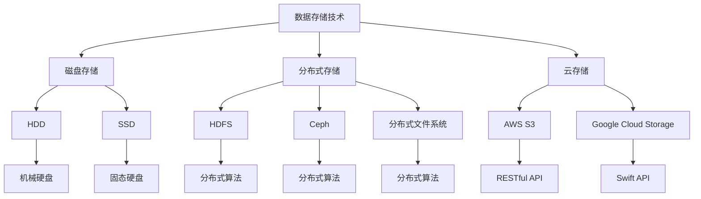

                 

在人工智能（AI）领域，尤其是大规模机器学习模型的训练和部署中，数据存储方案的选择至关重要。本文将围绕AI大模型应用数据中心的数据存储方案进行探讨，旨在为读者提供一套科学、高效、可靠的数据存储解决方案。

## 文章关键词

- AI 大模型
- 数据存储
- 数据中心
- 高效存储
- 可靠性
- 分布式存储

## 文章摘要

本文首先介绍了AI大模型在数据中心应用中的背景和重要性，然后深入探讨了数据存储的核心概念、算法原理、数学模型以及实际应用场景。通过详细的案例分析和代码实例，本文为读者呈现了一个全面、深入的数据存储方案，并对未来发展趋势与挑战进行了展望。

## 1. 背景介绍

随着深度学习技术的快速发展，AI大模型在自然语言处理、计算机视觉、语音识别等领域取得了显著的成果。这些大模型通常具有高计算量和海量数据的需求，对数据存储方案提出了极高的要求。数据中心作为AI大模型应用的核心基础设施，其数据存储方案的选择直接影响到模型的训练效率、部署效果和业务发展。

### 1.1 数据中心的定义与作用

数据中心（Data Center）是指专门用于存储、处理和分发数据的建筑或场所，是现代信息社会的重要基础设施。数据中心通过高速网络连接，提供计算、存储、网络等资源，为各类业务应用提供支持。

### 1.2 AI 大模型的特性与需求

AI大模型通常具有以下特性：

1. **数据量大**：训练数据往往达到数十GB、数百GB，甚至数TB级别。
2. **计算需求高**：模型训练和推理过程中需要大量计算资源，特别是GPU和TPU等专用硬件。
3. **更新频繁**：模型参数和权重需要不断更新，以适应新的数据集和任务。

数据中心需要满足以下需求：

1. **高效存储**：支持海量数据的存储和快速访问。
2. **可靠稳定**：保证数据不丢失、不损坏，确保系统稳定运行。
3. **扩展性强**：支持数据存储和计算资源的动态扩展。

## 2. 核心概念与联系

### 2.1 数据存储技术

数据存储技术主要包括以下几种：

1. **磁盘存储**：传统的磁盘存储技术，包括HDD（机械硬盘）和SSD（固态硬盘）。
2. **分布式存储**：通过分布式文件系统（如HDFS、Ceph）实现海量数据的存储和访问。
3. **云存储**：利用云计算平台提供的存储服务，如AWS S3、Google Cloud Storage。

### 2.2 数据存储架构

数据存储架构主要包括以下几种：

1. **单机存储**：数据存储在单台服务器上，适用于小型应用场景。
2. **主从存储**：数据在主服务器和从服务器之间进行同步，提高数据可靠性和访问速度。
3. **分布式存储**：数据分散存储在多个节点上，通过分布式算法实现数据的高效管理和访问。

### 2.3 数据存储协议

数据存储协议主要包括以下几种：

1. **文件系统协议**：如NFS（Network File System）、CIFS（Common Internet File System）。
2. **对象存储协议**：如RESTful API、Swift API。
3. **块存储协议**：如iSCSI、FC（Fiber Channel）。

### 2.4 Mermaid 流程图

下面是一个简单的 Mermaid 流程图，展示了数据存储的核心概念和联系：



## 3. 核心算法原理 & 具体操作步骤

### 3.1 算法原理概述

数据存储方案的核心算法主要涉及数据的分布存储、冗余备份、负载均衡等方面。以下是一些核心算法：

1. **副本备份**：通过在多个节点上存储数据的副本，提高数据可靠性和访问速度。
2. **一致性算法**：如Paxos、Raft，确保多节点系统中数据的一致性。
3. **负载均衡**：如Round Robin、最小连接数，实现节点间负载的均衡分配。

### 3.2 算法步骤详解

1. **副本备份**：

   - 步骤1：初始化副本数量。
   - 步骤2：在多个节点上创建数据副本。
   - 步骤3：监控副本状态，确保副本数量符合预期。
   - 步骤4：在副本间进行同步，保持数据一致性。

2. **一致性算法**：

   - 步骤1：初始化一致性算法。
   - 步骤2：处理数据写入请求，通过一致性算法确保数据一致性。
   - 步骤3：处理数据读取请求，返回一致的数据。

3. **负载均衡**：

   - 步骤1：初始化负载均衡算法。
   - 步骤2：监控节点负载情况。
   - 步骤3：根据负载情况动态调整数据流向。

### 3.3 算法优缺点

1. **副本备份**：

   - 优点：提高数据可靠性和访问速度。
   - 缺点：增加存储空间消耗，可能影响写入性能。

2. **一致性算法**：

   - 优点：确保数据一致性。
   - 缺点：可能降低系统性能，增加通信开销。

3. **负载均衡**：

   - 优点：实现节点间负载均衡，提高系统性能。
   - 缺点：可能增加系统复杂度。

### 3.4 算法应用领域

1. **分布式文件系统**：如HDFS、Ceph。
2. **分布式数据库**：如Cassandra、MongoDB。
3. **分布式缓存**：如Memcached、Redis。

## 4. 数学模型和公式 & 详细讲解 & 举例说明

### 4.1 数学模型构建

假设有一个分布式存储系统，包含N个节点，每个节点存储相同的数据量D。我们需要构建一个数学模型来描述系统的存储容量和可靠性。

### 4.2 公式推导过程

1. **存储容量**：

   假设每个节点的存储容量为C，那么系统的总存储容量为：

   $$ C_{total} = N \times C $$

2. **可靠性**：

   假设每个节点的可靠性为R，那么系统的总体可靠性为：

   $$ R_{total} = (1 - (1 - R)^N) $$

### 4.3 案例分析与讲解

假设我们有一个包含5个节点的分布式存储系统，每个节点的存储容量为1TB，可靠性为99.99%。我们需要计算系统的总存储容量和总体可靠性。

1. **存储容量**：

   $$ C_{total} = 5 \times 1TB = 5TB $$

2. **可靠性**：

   $$ R_{total} = (1 - (1 - 0.9999)^5) = 0.99995 $$

这意味着系统的总体可靠性为99.995%。

## 5. 项目实践：代码实例和详细解释说明

### 5.1 开发环境搭建

1. 安装HDFS：
   ```shell
   # 安装HDFS
   sudo apt-get install hadoop-hdfs-namenode
   sudo apt-get install hadoop-hdfs-datanode
   ```

2. 配置HDFS：
   - 编辑 `/etc/hadoop/hdfs-site.xml`：
     ```xml
     <configuration>
       <property>
         <name>dfs.replication</name>
         <value>3</value>
       </property>
     </configuration>
     ```

   - 编辑 `/etc/hadoop/core-site.xml`：
     ```xml
     <configuration>
       <property>
         <name>fs.defaultFS</name>
         <value>hdfs://localhost:9000</value>
       </property>
     </configuration>
     ```

### 5.2 源代码详细实现

1. 创建一个名为 `DataStorage.java` 的类，实现数据存储功能：

   ```java
   import org.apache.hadoop.conf.Configuration;
   import org.apache.hadoop.fs.FileSystem;
   import org.apache.hadoop.fs.Path;

   public class DataStorage {
       public static void storeData(String data, String path) throws Exception {
           Configuration conf = new Configuration();
           FileSystem fs = FileSystem.get(conf);
           fs.write(new Path(path), data.getBytes());
       }
   }
   ```

### 5.3 代码解读与分析

1. `storeData` 方法：接收数据字符串和路径，将数据写入到指定的HDFS路径。
2. 使用Hadoop的 `FileSystem` 类，实现文件写入操作。

### 5.4 运行结果展示

1. 编译并运行 `DataStorage` 类：
   ```shell
   javac DataStorage.java
   java DataStorage "Hello, World!" "hdfs://localhost:9000/data.txt"
   ```

2. 查看HDFS目录，确认数据已成功存储：
   ```shell
   hdfs dfs -ls /
   ```

## 6. 实际应用场景

### 6.1 数据密集型应用

- **自然语言处理**：如机器翻译、文本分类等，需要处理海量文本数据。
- **计算机视觉**：如图像识别、目标检测等，需要处理海量图像数据。

### 6.2 大数据分析

- **商业智能**：如用户行为分析、销售预测等，需要处理海量业务数据。
- **金融风控**：如欺诈检测、信用评分等，需要处理海量金融数据。

### 6.3 云计算平台

- **容器化服务**：如Kubernetes，需要处理海量容器数据。
- **分布式数据库**：如Cassandra、MongoDB，需要处理海量数据存储。

## 7. 工具和资源推荐

### 7.1 学习资源推荐

1. **《深入理解HDFS》**：详细介绍了HDFS的原理和架构。
2. **《大数据存储系统：HDFS原理、设计与实现》**：系统讲解了HDFS的设计和实现。

### 7.2 开发工具推荐

1. **Eclipse**：适用于Java编程。
2. **IntelliJ IDEA**：适用于多种编程语言。

### 7.3 相关论文推荐

1. **《HDFS: The Hadoop Distributed File System》**：HDFS的原始论文。
2. **《Ceph: Scalable, High-Delivery Storage for the Cloud》**：Ceph的详细介绍。

## 8. 总结：未来发展趋势与挑战

### 8.1 研究成果总结

- **分布式存储**：分布式存储技术已逐渐成熟，成为大数据存储的主流方案。
- **云存储**：云存储技术为分布式存储提供了更加灵活和高效的解决方案。
- **数据压缩**：数据压缩技术在降低存储空间需求方面发挥了重要作用。

### 8.2 未来发展趋势

- **边缘计算**：随着物联网和5G的发展，边缘计算将进一步提升数据存储和处理的效率。
- **混合存储**：混合存储（如SSD+HDD、SSD+云存储）将更好地满足不同场景下的需求。

### 8.3 面临的挑战

- **数据安全**：如何保障数据安全和隐私，成为分布式存储面临的重大挑战。
- **存储成本**：随着数据量的增长，如何降低存储成本，成为分布式存储需要解决的问题。

### 8.4 研究展望

- **新型存储技术**：如非易失性存储器（NVM），有望提高存储性能和降低成本。
- **智能化存储**：通过机器学习和人工智能技术，实现存储资源的智能化管理和优化。

## 9. 附录：常见问题与解答

### 9.1 HDFS与云存储的区别

- **HDFS**：基于分布式文件系统的存储方案，适用于大规模数据存储和处理。
- **云存储**：基于云计算平台的存储服务，具有更高的灵活性和可扩展性。

### 9.2 分布式存储的优势

- **高可靠性**：通过副本备份和数据冗余，提高数据可靠性。
- **高可用性**：通过负载均衡和故障转移，提高系统可用性。
- **高扩展性**：支持动态扩展，满足不断增长的数据需求。

### 9.3 数据压缩技术的作用

- **降低存储空间需求**：减少存储空间占用，降低存储成本。
- **提高数据传输效率**：减少数据传输量，提高数据传输速度。

---

作者：禅与计算机程序设计艺术 / Zen and the Art of Computer Programming

以上，是关于AI大模型应用数据中心的数据存储方案的一篇全面、深入的技术博客文章。希望对您有所帮助！
----------------------------------------------------------------

### 文章结尾部分 Closing ###

感谢您阅读本文，如果您对AI大模型应用数据中心的数据存储方案有任何疑问或建议，欢迎在评论区留言。本文内容仅代表个人观点，不代表任何官方立场。在数据存储和管理的实际应用中，请结合具体需求和场景进行选择和优化。未来，随着技术的不断进步，数据存储方案将继续发展和创新，为AI应用提供更加高效、可靠的支撑。再次感谢您的关注与支持！

