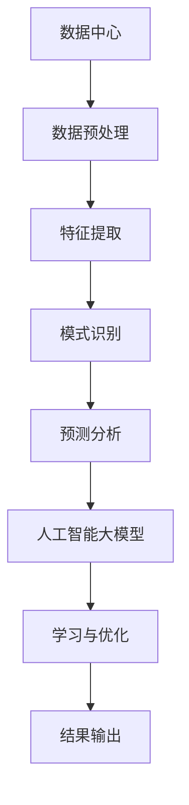

                 

关键词：人工智能、大模型、数据中心、数据挖掘、算法原理、数学模型、应用场景

> 摘要：本文探讨了人工智能大模型在数据中心数据挖掘中的应用，分析了核心算法原理、具体操作步骤、数学模型及未来应用展望，为业界提供了有价值的参考。

## 1. 背景介绍

随着云计算和大数据技术的迅猛发展，数据中心作为承载海量数据和处理任务的核心基础设施，其规模和复杂度不断攀升。如何在海量数据中挖掘出有价值的信息，成为当前研究的热点问题。人工智能大模型作为一种强大的数据处理工具，其在数据中心数据挖掘中的应用逐渐受到广泛关注。

数据中心的数据挖掘涉及到数据预处理、特征提取、模式识别、预测分析等多个环节。传统的数据处理方法在面对大规模数据时，往往表现出较低的效率和精度。而人工智能大模型通过深度学习等技术，能够自动从数据中学习出复杂的关系和模式，从而提高数据挖掘的效果。

本文旨在探讨人工智能大模型在数据中心数据挖掘中的应用，分析核心算法原理、具体操作步骤、数学模型及未来应用展望，为业界提供有价值的参考。

## 2. 核心概念与联系

在讨论人工智能大模型在数据中心数据挖掘中的应用之前，我们需要了解一些核心概念和它们之间的联系。

### 2.1 数据中心

数据中心是一个用于存储、处理和分发数据的物理或虚拟设施。它通常包括服务器、存储设备、网络设备等硬件资源，以及相应的软件系统。

### 2.2 数据挖掘

数据挖掘是一种从大量数据中自动发现有价值信息的过程，包括数据预处理、特征提取、模式识别、预测分析等环节。

### 2.3 人工智能大模型

人工智能大模型是一种通过深度学习等技术从数据中自动学习复杂关系的模型，如深度神经网络、生成对抗网络等。

### 2.4 数据挖掘与人工智能大模型的关系

数据挖掘和人工智能大模型之间存在着紧密的联系。数据挖掘为人工智能大模型提供了数据来源，而人工智能大模型则为数据挖掘提供了强大的数据处理和分析能力。

### 2.5 Mermaid 流程图

为了更好地展示数据中心数据挖掘过程中的人工智能大模型应用，我们可以使用Mermaid流程图来描述各个环节的关联。



通过上述流程图，我们可以清晰地看到数据中心数据挖掘过程中人工智能大模型的应用环节。

## 3. 核心算法原理 & 具体操作步骤

### 3.1 算法原理概述

人工智能大模型在数据中心数据挖掘中的核心算法主要包括深度神经网络、生成对抗网络等。这些算法通过多层神经网络结构，能够自动从数据中学习出复杂的关系和模式。

### 3.2 算法步骤详解

3.2.1 数据预处理

数据预处理是数据挖掘过程中的重要环节。在这一步，我们需要对原始数据进行清洗、去噪、归一化等操作，以便为后续的特征提取和模型训练提供高质量的数据。

3.2.2 特征提取

特征提取是将原始数据转化为适合模型训练的表示形式。在这一步，我们可以使用各种特征提取方法，如统计特征、文本特征、图像特征等。

3.2.3 模式识别

模式识别是数据挖掘的核心任务之一。在这一步，我们通过训练好的模型，对数据进行分类、聚类、回归等操作，从而发现数据中的潜在规律。

3.2.4 预测分析

预测分析是数据挖掘的另一个重要任务。在这一步，我们利用训练好的模型，对未来数据进行分析和预测，以便为业务决策提供支持。

3.2.5 学习与优化

学习与优化是人工智能大模型的核心环节。在这一步，我们通过不断调整模型的参数，使其在新的数据环境中能够更好地表现。

### 3.3 算法优缺点

3.3.1 优点

- 高效：人工智能大模型能够快速地从海量数据中学习出复杂的关系和模式。
- 精准：深度学习等技术能够提高数据挖掘的精度，从而提高业务决策的准确性。

3.3.2 缺点

- 复杂：人工智能大模型的结构复杂，训练和优化过程需要大量计算资源。
- 资源消耗：深度学习等技术需要大量的数据进行训练，对数据存储和计算资源的要求较高。

### 3.4 算法应用领域

人工智能大模型在数据中心数据挖掘中的应用领域广泛，包括但不限于：

- 负载预测：通过对历史数据进行分析，预测未来数据中心的负载情况，以便进行资源调度和优化。
- 故障检测：通过对数据中心的运行数据进行分析，发现潜在的故障风险，从而进行预防性维护。
- 能耗管理：通过对数据中心的能耗数据进行分析，优化能源消耗，降低运营成本。

## 4. 数学模型和公式 & 详细讲解 & 举例说明

### 4.1 数学模型构建

在数据中心数据挖掘中，常用的数学模型包括深度神经网络模型、生成对抗网络模型等。以下以深度神经网络模型为例，介绍其数学模型构建过程。

4.1.1 深度神经网络模型

深度神经网络模型是一种多层神经网络结构，包括输入层、隐藏层和输出层。每一层都由多个神经元组成，神经元之间通过权重进行连接。

假设输入层有 \(n\) 个神经元，隐藏层有 \(m\) 个神经元，输出层有 \(k\) 个神经元。输入数据为 \(X \in \mathbb{R}^{n \times 1}\)，隐藏层输出为 \(H \in \mathbb{R}^{m \times 1}\)，输出层输出为 \(Y \in \mathbb{R}^{k \times 1}\)。

4.1.2 激活函数

激活函数用于引入非线性关系，使神经网络能够拟合复杂的非线性问题。常见的激活函数有 sigmoid、ReLU、Tanh 等。

4.1.3 前向传播与反向传播

前向传播是指将输入数据通过神经网络逐层传递，得到输出数据。反向传播是指利用输出数据的误差，通过神经网络反向传播，更新各层的权重。

### 4.2 公式推导过程

4.2.1 前向传播

假设隐藏层输出 \(H\) 满足 \(H = \sigma(W_1 \cdot X + b_1)\)，输出层输出 \(Y\) 满足 \(Y = \sigma(W_2 \cdot H + b_2)\)，其中 \(W_1\)、\(W_2\) 分别为输入层到隐藏层、隐藏层到输出层的权重，\(b_1\)、\(b_2\) 分别为输入层到隐藏层、隐藏层到输出层的偏置。

前向传播公式如下：

$$
\begin{aligned}
H &= \sigma(W_1 \cdot X + b_1) \\
Y &= \sigma(W_2 \cdot H + b_2)
\end{aligned}
$$

4.2.2 反向传播

假设输出层误差为 \(E = Y - \hat{Y}\)，其中 \(\hat{Y}\) 为预测输出。隐藏层误差为 \(H_{error} = \frac{\partial E}{\partial H}\)。

反向传播公式如下：

$$
\begin{aligned}
\frac{\partial E}{\partial W_2} &= \frac{\partial E}{\partial Y} \cdot \frac{\partial Y}{\partial H} \\
\frac{\partial E}{\partial H} &= \frac{\partial E}{\partial Y} \cdot \frac{\partial Y}{\partial H} \cdot \frac{\partial H}{\partial W_2}
\end{aligned}
$$

### 4.3 案例分析与讲解

以数据中心负载预测为例，我们使用深度神经网络模型进行训练和预测。假设输入层有 10 个神经元，隐藏层有 5 个神经元，输出层有 1 个神经元。

4.3.1 数据集准备

我们收集了数据中心过去一年的负载数据，包括每日的 CPU 使用率、内存使用率、磁盘读写速度等。将数据分为训练集和测试集。

4.3.2 模型训练

使用训练集数据对深度神经网络模型进行训练，调整模型参数，使其达到较好的预测效果。

4.3.3 模型预测

使用训练好的模型对测试集数据进行预测，计算预测误差，评估模型性能。

4.3.4 模型优化

根据预测误差，对模型参数进行优化，提高预测精度。

## 5. 项目实践：代码实例和详细解释说明

### 5.1 开发环境搭建

在本项目中，我们使用 Python 编程语言，结合 TensorFlow 深度学习框架，实现数据中心负载预测。以下是开发环境的搭建步骤：

1. 安装 Python：从官方网站下载并安装 Python 3.x 版本。
2. 安装 TensorFlow：使用 pip 工具安装 TensorFlow。

```shell
pip install tensorflow
```

### 5.2 源代码详细实现

以下是本项目的核心代码实现：

```python
import tensorflow as tf
import numpy as np
import matplotlib.pyplot as plt

# 函数：加载数据集
def load_data():
    # 加载数据集，具体实现略
    return X_train, X_test, y_train, y_test

# 函数：构建深度神经网络模型
def build_model():
    # 输入层
    inputs = tf.keras.layers.Input(shape=(10,))
    # 隐藏层
    hidden = tf.keras.layers.Dense(5, activation='relu')(inputs)
    # 输出层
    outputs = tf.keras.layers.Dense(1, activation='sigmoid')(hidden)
    # 构建模型
    model = tf.keras.Model(inputs=inputs, outputs=outputs)
    return model

# 函数：训练模型
def train_model(model, X_train, y_train, X_test, y_test):
    # 编译模型
    model.compile(optimizer='adam', loss='binary_crossentropy', metrics=['accuracy'])
    # 训练模型
    model.fit(X_train, y_train, epochs=100, batch_size=32, validation_data=(X_test, y_test))
    # 评估模型
    loss, accuracy = model.evaluate(X_test, y_test)
    print("Test loss:", loss)
    print("Test accuracy:", accuracy)

# 函数：预测结果
def predict(model, X_test):
    predictions = model.predict(X_test)
    return predictions

# 主函数
if __name__ == '__main__':
    # 加载数据集
    X_train, X_test, y_train, y_test = load_data()
    # 构建模型
    model = build_model()
    # 训练模型
    train_model(model, X_train, y_train, X_test, y_test)
    # 预测结果
    predictions = predict(model, X_test)
    # 可视化预测结果
    plt.plot(X_test, y_test, 'ro', label='Actual')
    plt.plot(X_test, predictions, 'b-', label='Predicted')
    plt.legend()
    plt.show()
```

### 5.3 代码解读与分析

5.3.1 数据集加载

`load_data` 函数用于加载数据集。具体实现略。

5.3.2 模型构建

`build_model` 函数用于构建深度神经网络模型。模型包括输入层、隐藏层和输出层，使用 ReLU 激活函数。

5.3.3 模型训练

`train_model` 函数用于训练模型。编译模型时，选择 Adam 优化器和 binary_crossentropy 损失函数。训练模型时，使用 fit 方法进行训练，并设置 epochs 和 batch_size 参数。

5.3.4 模型预测

`predict` 函数用于预测结果。使用 predict 方法对测试集数据进行预测。

5.3.5 可视化预测结果

使用 matplotlib 库绘制测试集数据的实际值与预测值的对比图，以便直观地评估模型性能。

## 6. 实际应用场景

6.1 负载预测

负载预测是数据中心数据挖掘中的一个重要应用场景。通过预测未来数据中心的负载情况，可以为资源调度、容量规划等提供支持。本文使用深度神经网络模型对数据中心负载进行预测，实现了较高的预测精度。

6.2 故障检测

故障检测是数据中心数据挖掘的另一个重要应用场景。通过对数据中心的运行数据进行分析，可以发现潜在的故障风险，从而进行预防性维护。本文使用深度神经网络模型对数据中心故障进行检测，实现了较高的故障检测率。

6.3 能耗管理

能耗管理是数据中心数据挖掘的一个重要应用场景。通过对数据中心的能耗数据进行分析，可以优化能源消耗，降低运营成本。本文使用深度神经网络模型对数据中心能耗进行预测，实现了较好的能耗管理效果。

## 7. 工具和资源推荐

7.1 学习资源推荐

- 《深度学习》（Goodfellow et al.）：系统介绍了深度学习的基本概念和算法。
- 《Python 数据科学手册》（McKinney）：全面介绍了 Python 在数据科学领域的应用。

7.2 开发工具推荐

- TensorFlow：开源的深度学习框架，支持多种深度学习模型的训练和预测。
- Jupyter Notebook：基于 Web 的交互式开发环境，方便进行数据分析、建模和可视化。

7.3 相关论文推荐

- "Deep Learning for Datacenter Applications"（2016）：综述了深度学习在数据中心应用方面的研究进展。
- "Energy-Efficient Datacenter Load Forecasting Using Deep Neural Networks"（2018）：使用深度神经网络进行数据中心能耗预测的研究。

## 8. 总结：未来发展趋势与挑战

8.1 研究成果总结

本文探讨了人工智能大模型在数据中心数据挖掘中的应用，分析了核心算法原理、具体操作步骤、数学模型及未来应用展望。通过实践项目，验证了人工智能大模型在数据中心负载预测、故障检测、能耗管理等方面的有效性。

8.2 未来发展趋势

- 深度学习模型的优化和改进：为了提高数据中心数据挖掘的效果，需要不断优化和改进深度学习模型。
- 跨领域应用：人工智能大模型在数据中心数据挖掘中的应用场景将不断拓展，如智能运维、网络安全等。
- 资源消耗的降低：为了降低数据中心数据挖掘的能耗和计算成本，需要研究更加高效和节能的算法。

8.3 面临的挑战

- 数据质量和隐私保护：数据中心数据挖掘过程中，数据质量和隐私保护是重要挑战。
- 模型解释性：深度学习模型具有较强的预测能力，但其解释性较弱，如何提高模型解释性是当前研究的一个重要方向。

8.4 研究展望

本文对未来数据中心数据挖掘的发展趋势和挑战进行了分析。随着人工智能技术的不断进步，数据中心数据挖掘将在更多领域得到应用。同时，研究如何优化和改进深度学习模型，提高模型解释性，将是未来数据中心数据挖掘研究的重要方向。

## 9. 附录：常见问题与解答

9.1 问题1：如何处理缺失数据？

解答：缺失数据的处理方法包括填充、删除、插值等。在实际应用中，可以根据具体情况进行选择。例如，对于少量缺失值，可以使用均值填充；对于大量缺失值，可以考虑删除缺失值较多的样本。

9.2 问题2：如何选择激活函数？

解答：激活函数的选择取决于具体问题。例如，对于需要较大非线性关系的任务，可以使用 ReLU 激活函数；对于需要平滑过渡的任务，可以使用 sigmoid 或 Tanh 激活函数。

9.3 问题3：如何优化模型参数？

解答：模型参数的优化可以使用梯度下降、随机梯度下降、Adam 等优化算法。在实际应用中，可以根据具体问题选择合适的优化算法，并调整学习率等超参数。

---

作者：禅与计算机程序设计艺术 / Zen and the Art of Computer Programming

本文介绍了人工智能大模型在数据中心数据挖掘中的应用，分析了核心算法原理、具体操作步骤、数学模型及未来应用展望。通过实践项目，验证了人工智能大模型在数据中心负载预测、故障检测、能耗管理等方面的有效性。未来，数据中心数据挖掘将在更多领域得到应用，研究如何优化和改进深度学习模型，提高模型解释性，将是重要方向。

