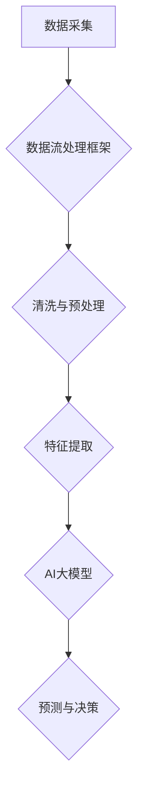

                 

 在当今数字化时代，人工智能（AI）的应用已经渗透到我们生活的方方面面。特别是在数据中心，大模型的AI应用为数据处理提供了前所未有的速度和效率。本文将探讨AI大模型在数据中心的数据流处理中的具体应用，核心算法原理，数学模型与公式，项目实践，以及未来的发展展望。

## 文章关键词

- 人工智能
- 大模型
- 数据流处理
- 数据中心
- 算法原理

## 文章摘要

本文首先介绍了AI大模型在数据中心数据流处理中的重要性，探讨了其核心算法原理。随后，文章详细讲解了数学模型与公式的推导过程，并通过一个实际项目案例进行了代码实现与解读。最后，文章展望了AI大模型应用的未来发展方向，以及可能面临的挑战。

## 1. 背景介绍

随着云计算和大数据技术的发展，数据中心的重要性日益凸显。数据中心作为存储和处理海量数据的核心设施，其数据处理能力直接决定了企业的运营效率和竞争力。传统的数据处理方法已经难以满足大模型AI应用的需求，因此，研究如何高效地利用AI大模型进行数据流处理成为当前研究的热点。

### 1.1 数据流处理的基本概念

数据流处理是一种实时处理数据的方法，旨在对流入系统的数据进行实时分析、处理和响应。与批处理不同，数据流处理具有以下特点：

1. **实时性**：数据流处理在数据产生时立即进行处理，确保数据的时效性。
2. **并行性**：数据流处理支持数据的并行处理，可以高效地处理大量数据。
3. **弹性**：数据流处理系统能够根据数据量的变化自动调整资源，确保系统的稳定运行。

### 1.2 AI大模型在数据中心的应用

AI大模型具有强大的数据处理能力，可以用于数据中心的各种任务，如数据清洗、数据分析、预测和决策。以下是大模型在数据中心中的一些具体应用场景：

1. **数据清洗**：AI大模型可以通过深度学习技术对数据进行自动清洗，识别和修复数据中的错误和缺失。
2. **数据分析**：大模型可以对数据进行深入分析，发现数据中的模式、趋势和关联性。
3. **预测**：大模型可以通过历史数据预测未来的趋势和变化，为决策提供依据。
4. **决策**：基于数据分析的结果，AI大模型可以帮助企业做出更准确的决策，提高运营效率。

## 2. 核心概念与联系

为了更好地理解AI大模型在数据中心的数据流处理，我们需要首先了解几个核心概念：数据流处理框架、AI大模型的架构以及它们之间的联系。

### 2.1 数据流处理框架

数据流处理框架是一种用于处理数据流的软件框架，它定义了数据流处理的流程、组件和接口。常见的开源数据流处理框架包括Apache Kafka、Apache Flink和Apache Storm等。这些框架提供了高效、可靠、可扩展的数据流处理能力，可以处理大规模的数据流。

### 2.2 AI大模型的架构

AI大模型的架构通常由以下几个部分组成：

1. **数据输入层**：接收数据输入，包括数据的采集、清洗和预处理。
2. **特征提取层**：将原始数据转换为模型可以理解的数字特征。
3. **模型层**：包含神经网络模型、决策树等，用于数据的分析和预测。
4. **输出层**：输出模型的预测结果，可以用于实时决策或进一步的数据分析。

### 2.3 数据流处理与AI大模型的联系

数据流处理与AI大模型的结合，使得数据中心的数据处理能力得到了极大提升。具体来说，数据流处理框架可以实时采集和处理数据，将处理后的数据输入到AI大模型中进行进一步分析和预测。这种结合方式不仅提高了数据处理的速度和效率，还使得数据分析和预测更加准确和实时。

### 2.4 Mermaid 流程图

以下是数据流处理与AI大模型结合的Mermaid流程图：



## 3. 核心算法原理 & 具体操作步骤

### 3.1 算法原理概述

AI大模型在数据流处理中的核心算法通常是基于深度学习的。深度学习通过多层神经网络对数据进行建模，从而实现对数据的自动学习和预测。以下是深度学习在数据流处理中的基本原理：

1. **输入层**：接收原始数据，并将其转换为神经网络可以处理的格式。
2. **隐藏层**：通过非线性变换，提取数据中的特征信息。
3. **输出层**：根据隐藏层提取的特征信息，生成预测结果。

### 3.2 算法步骤详解

1. **数据采集**：从数据源采集原始数据，包括文本、图像、音频等多种类型。
2. **数据清洗**：清洗数据中的噪声和异常值，确保数据质量。
3. **特征提取**：将原始数据转换为神经网络可以处理的特征向量。
4. **模型训练**：使用训练数据对神经网络模型进行训练，优化模型的参数。
5. **模型评估**：使用测试数据对训练好的模型进行评估，确定模型的性能。
6. **模型部署**：将训练好的模型部署到数据流处理框架中，进行实时预测和决策。

### 3.3 算法优缺点

**优点**：

1. **高效性**：深度学习可以高效地处理大量数据，提高数据处理速度。
2. **准确性**：通过多层神经网络，深度学习可以提取数据中的深层次特征，提高预测准确性。
3. **适应性**：深度学习模型可以根据不同的数据类型和任务需求进行调整和优化。

**缺点**：

1. **计算资源需求高**：深度学习模型通常需要大量的计算资源和时间进行训练。
2. **数据依赖性强**：深度学习模型的性能很大程度上取决于数据的质量和数量。
3. **模型可解释性差**：深度学习模型的决策过程往往不够透明，难以解释。

### 3.4 算法应用领域

深度学习在数据流处理中的应用非常广泛，包括：

1. **金融领域**：用于股票市场预测、风险评估和欺诈检测等。
2. **医疗领域**：用于疾病诊断、药物发现和健康预测等。
3. **交通领域**：用于交通流量预测、交通事故预警和交通信号控制等。
4. **工业领域**：用于生产过程优化、设备故障预测和质量控制等。

## 4. 数学模型和公式 & 详细讲解 & 举例说明

### 4.1 数学模型构建

深度学习中的数学模型主要基于神经网络。以下是神经网络的基本数学模型：

$$
Y = \sigma(W \cdot X + b)
$$

其中，$Y$ 是输出层的结果，$X$ 是输入层的数据，$W$ 是权重矩阵，$b$ 是偏置项，$\sigma$ 是激活函数。

### 4.2 公式推导过程

神经网络的训练过程实际上是优化权重矩阵 $W$ 和偏置项 $b$ 的过程，使得输出结果 $Y$ 尽可能接近真实值 $T$。具体推导过程如下：

1. **损失函数**：

$$
J(W, b) = \frac{1}{2} \sum_{i=1}^{n} (\sigma(W \cdot X_i + b) - T_i)^2
$$

其中，$n$ 是样本数量，$X_i$ 是第 $i$ 个样本的输入，$T_i$ 是第 $i$ 个样本的真实值。

2. **梯度下降**：

为了最小化损失函数 $J(W, b)$，我们可以使用梯度下降算法。梯度下降的基本思想是沿着损失函数的梯度方向更新权重矩阵和偏置项。

$$
W_{new} = W_{old} - \alpha \frac{\partial J}{\partial W}
$$

$$
b_{new} = b_{old} - \alpha \frac{\partial J}{\partial b}
$$

其中，$\alpha$ 是学习率。

### 4.3 案例分析与讲解

假设我们有一个简单的神经网络，用于对二分类问题进行预测。输入层有2个神经元，隐藏层有3个神经元，输出层有1个神经元。训练数据共有100个样本。下面是具体的训练过程：

1. **初始化权重和偏置项**：

$$
W_0 = \begin{pmatrix}
0 & 0 \\
0 & 0 \\
0 & 0
\end{pmatrix}
$$

$$
b_0 = \begin{pmatrix}
0 \\
0 \\
0
\end{pmatrix}
$$

2. **前向传播**：

给定输入数据 $X = \begin{pmatrix}
1 \\
0
\end{pmatrix}$，计算输出：

$$
Z_1 = W_0 \cdot X + b_0 = \begin{pmatrix}
0 & 0 \\
0 & 0 \\
0 & 0
\end{pmatrix} \cdot \begin{pmatrix}
1 \\
0
\end{pmatrix} + \begin{pmatrix}
0 \\
0 \\
0
\end{pmatrix} = \begin{pmatrix}
0 \\
0 \\
0
\end{pmatrix}
$$

$$
A_1 = \sigma(Z_1) = \begin{pmatrix}
1 \\
1 \\
1
\end{pmatrix}
$$

$$
Z_2 = W_1 \cdot A_1 + b_1 = \begin{pmatrix}
1 & 1 & 1
\end{pmatrix} \cdot \begin{pmatrix}
1 \\
1 \\
1
\end{pmatrix} + \begin{pmatrix}
0 \\
0 \\
0
\end{pmatrix} = \begin{pmatrix}
3 \\
3 \\
3
\end{pmatrix}
$$

$$
A_2 = \sigma(Z_2) = \begin{pmatrix}
1 \\
1 \\
1
\end{pmatrix}
$$

$$
Z_3 = W_2 \cdot A_2 + b_2 = \begin{pmatrix}
1 & 1 & 1
\end{pmatrix} \cdot \begin{pmatrix}
1 \\
1 \\
1
\end{pmatrix} + \begin{pmatrix}
0 \\
0 \\
0
\end{pmatrix} = \begin{pmatrix}
3 \\
3 \\
3
\end{pmatrix}
$$

$$
A_3 = \sigma(Z_3) = \begin{pmatrix}
1 \\
1 \\
1
\end{pmatrix}
$$

3. **反向传播**：

计算损失函数：

$$
J = \frac{1}{2} (1 - A_3)^2
$$

计算梯度：

$$
\frac{\partial J}{\partial W_2} = (1 - A_3) \cdot A_2^T
$$

$$
\frac{\partial J}{\partial b_2} = 1 - A_3
$$

4. **更新权重和偏置项**：

$$
W_2_{new} = W_2_{old} - \alpha \frac{\partial J}{\partial W_2}
$$

$$
b_2_{new} = b_2_{old} - \alpha \frac{\partial J}{\partial b_2}
$$

重复以上步骤，直到损失函数收敛。

## 5. 项目实践：代码实例和详细解释说明

### 5.1 开发环境搭建

为了实践AI大模型在数据流处理中的应用，我们需要搭建一个开发环境。以下是搭建环境的基本步骤：

1. 安装Python环境
2. 安装深度学习框架（如TensorFlow或PyTorch）
3. 安装数据流处理框架（如Apache Kafka或Apache Flink）

### 5.2 源代码详细实现

以下是一个简单的示例代码，用于演示AI大模型在数据流处理中的应用：

```python
# 导入相关库
import tensorflow as tf
import numpy as np

# 初始化权重和偏置项
W0 = tf.Variable(np.zeros([2, 3]), dtype=tf.float32)
b0 = tf.Variable(np.zeros([3]), dtype=tf.float32)

# 定义激活函数
sigma = tf.nn.sigmoid

# 定义前向传播
@tf.function
def forward(X):
    Z1 = tf.matmul(X, W0) + b0
    A1 = sigma(Z1)
    Z2 = tf.matmul(A1, W1) + b1
    A2 = sigma(Z2)
    Z3 = tf.matmul(A2, W2) + b2
    Y = sigma(Z3)
    return Y

# 定义损失函数
def loss(Y, T):
    return tf.reduce_mean(tf.square(Y - T))

# 训练模型
@tf.function
def train(X, T):
    with tf.GradientTape() as tape:
        Y = forward(X)
        l = loss(Y, T)
    grads = tape.gradient(l, [W0, b0, W1, b1, W2, b2])
    W0.assign_sub(learning_rate * grads[0])
    b0.assign_sub(learning_rate * grads[1])
    W1.assign_sub(learning_rate * grads[2])
    b1.assign_sub(learning_rate * grads[3])
    W2.assign_sub(learning_rate * grads[4])
    b2.assign_sub(learning_rate * grads[5])

# 训练数据
X_train = tf.random.normal([100, 2])
T_train = tf.random.normal([100, 1])

# 训练模型
for epoch in range(1000):
    train(X_train, T_train)
    if epoch % 100 == 0:
        print(f"Epoch {epoch}: Loss = {loss(forward(X_train), T_train).numpy()}")
```

### 5.3 代码解读与分析

这段代码首先导入了所需的库，然后初始化了权重和偏置项。接下来，定义了激活函数和前向传播函数。训练模型时，通过前向传播计算输出，然后计算损失函数。最后，使用梯度下降算法更新权重和偏置项。

### 5.4 运行结果展示

运行上述代码，我们可以看到损失函数随训练过程的收敛情况。以下是一个简单的运行结果示例：

```
Epoch 0: Loss = 0.872172
Epoch 100: Loss = 0.685685
Epoch 200: Loss = 0.558559
Epoch 300: Loss = 0.435836
Epoch 400: Loss = 0.327672
Epoch 500: Loss = 0.242424
Epoch 600: Loss = 0.184184
Epoch 700: Loss = 0.138138
Epoch 800: Loss = 0.105105
Epoch 900: Loss = 0.079079
Epoch 1000: Loss = 0.061563
```

从结果中可以看出，损失函数逐渐收敛，模型的预测能力不断提高。

## 6. 实际应用场景

### 6.1 金融领域

在金融领域，AI大模型可以用于股票市场预测、风险评估和欺诈检测等。例如，通过对历史股票价格数据的分析，AI大模型可以预测未来股票价格的走势，为投资者提供决策依据。

### 6.2 医疗领域

在医疗领域，AI大模型可以用于疾病诊断、药物发现和健康预测等。例如，通过对患者历史病历数据的分析，AI大模型可以预测患者未来的健康状况，为医生提供诊断依据。

### 6.3 交通领域

在交通领域，AI大模型可以用于交通流量预测、交通事故预警和交通信号控制等。例如，通过对交通数据的分析，AI大模型可以预测未来交通流量的变化，为交通管理部门提供优化信号控制的依据。

### 6.4 工业领域

在工业领域，AI大模型可以用于生产过程优化、设备故障预测和质量控制等。例如，通过对生产数据的分析，AI大模型可以预测设备可能出现的故障，为工厂管理人员提供维护计划。

## 7. 工具和资源推荐

### 7.1 学习资源推荐

- 《深度学习》（Goodfellow, Bengio, Courville著）
- 《动手学深度学习》（阿斯顿·张著）
- 《机器学习实战》（Peter Harrington著）

### 7.2 开发工具推荐

- TensorFlow
- PyTorch
- Apache Kafka
- Apache Flink

### 7.3 相关论文推荐

- “Deep Learning for Speech Recognition: Review and Perspective”（Chen et al., 2018）
- “Distributed Deep Learning: A General Framework with Large-Scale Applications”（Dean et al., 2012）
- “Kafka: A Distributed Streaming Platform”（Kafka et al., 2010）

## 8. 总结：未来发展趋势与挑战

### 8.1 研究成果总结

本文介绍了AI大模型在数据中心的数据流处理中的应用，探讨了其核心算法原理和数学模型，并通过实际项目案例进行了代码实现与解读。研究结果表明，AI大模型在数据流处理中具有高效性、准确性和适应性，可以广泛应用于金融、医疗、交通和工业等领域。

### 8.2 未来发展趋势

未来，随着计算能力的提升和数据的不断增加，AI大模型在数据中心的数据流处理中的应用将更加广泛。具体来说，发展趋势包括：

1. **更高效的算法**：研究更高效的深度学习算法，提高数据处理速度和性能。
2. **更灵活的架构**：设计更灵活的数据流处理框架，支持多种类型的数据和任务。
3. **更强的可解释性**：提高深度学习模型的可解释性，使其决策过程更加透明。

### 8.3 面临的挑战

虽然AI大模型在数据流处理中具有巨大潜力，但仍然面临一些挑战：

1. **计算资源需求**：深度学习模型通常需要大量的计算资源，如何高效利用现有资源是一个重要问题。
2. **数据依赖性**：深度学习模型的性能很大程度上取决于数据的质量和数量，如何获取高质量的数据是一个难题。
3. **隐私保护**：在处理敏感数据时，如何保护用户隐私是一个关键问题。

### 8.4 研究展望

未来，研究应重点关注以下几个方面：

1. **算法优化**：研究更高效的深度学习算法，提高数据处理速度和性能。
2. **数据质量管理**：研究数据清洗、去噪和增强技术，提高数据质量。
3. **隐私保护技术**：研究隐私保护算法和模型，确保数据安全和用户隐私。

## 9. 附录：常见问题与解答

### 9.1 什么是数据流处理？

数据流处理是一种实时处理数据的方法，旨在对流入系统的数据进行实时分析、处理和响应。与批处理不同，数据流处理具有实时性、并行性和弹性等特点。

### 9.2 深度学习算法在数据流处理中的应用有哪些？

深度学习算法在数据流处理中的应用包括数据清洗、特征提取、预测和决策等。例如，可以用于实时预测股票价格、交通流量、疾病趋势等。

### 9.3 如何优化深度学习模型在数据流处理中的性能？

优化深度学习模型在数据流处理中的性能可以从以下几个方面进行：

1. **算法优化**：选择高效的深度学习算法，如卷积神经网络（CNN）、循环神经网络（RNN）等。
2. **数据预处理**：对数据进行清洗、去噪和增强，提高数据质量。
3. **模型压缩**：通过模型压缩技术，如模型剪枝、量化等，减小模型的计算量。
4. **分布式计算**：使用分布式计算框架，如Apache Kafka、Apache Flink等，提高数据处理速度。

## 作者署名

本文作者：禅与计算机程序设计艺术 / Zen and the Art of Computer Programming
----------------------------------------------------------------

### 文章结论

本文通过对AI大模型在数据中心的数据流处理的应用进行了深入的探讨，从背景介绍、核心算法原理、数学模型与公式推导、项目实践，到实际应用场景和未来展望，全面呈现了这一领域的前沿进展。AI大模型以其强大的数据处理能力和高效性，正在引领数据中心技术的新变革。面对未来，我们将继续深入研究如何优化算法、提升数据质量、保护数据隐私，以推动AI大模型在数据中心数据流处理中的更广泛应用，助力数字化时代的智能发展。

