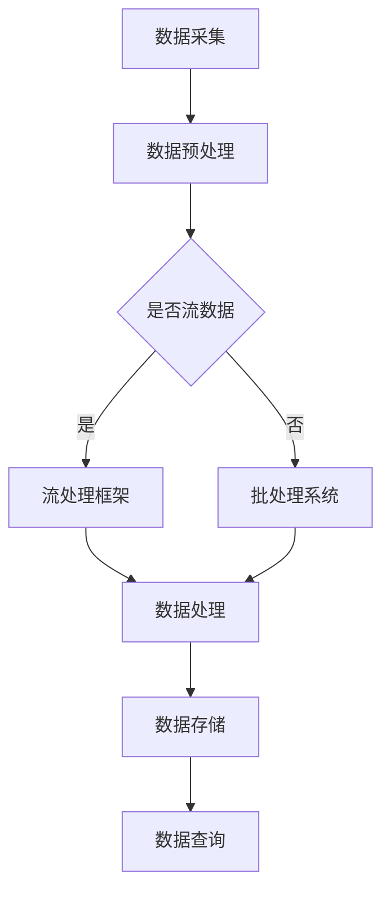

                 

关键词：AI大模型、数据中心、数据流处理、架构设计、性能优化

## 摘要

本文将探讨AI大模型在数据中心应用中的数据流处理架构。首先，我们将回顾AI大模型的背景和重要性。然后，深入分析数据流处理的基本原理和数据中心架构的关键组成部分。接着，我们将详细阐述数据流处理架构的设计原则和关键优化策略。最后，本文将结合实际案例，展示数据流处理在AI大模型应用中的具体实现，并对未来发展趋势和挑战进行展望。

## 1. 背景介绍

随着人工智能技术的快速发展，AI大模型已经成为现代数据中心的核心组件。这些模型具有极高的计算复杂度和数据处理能力，能够处理海量数据，并从中提取出有价值的信息。然而，AI大模型的应用不仅依赖于模型本身的性能，还需要高效的数据流处理架构来支持。

数据中心作为AI大模型运行的主要场所，其架构设计直接影响系统的性能和可靠性。传统的数据中心架构主要依赖于批处理和离线计算，难以满足实时性和大数据处理的需求。因此，数据流处理架构的引入，使得数据中心能够更高效地处理动态数据流，提高系统的响应速度和处理能力。

### AI大模型的发展

AI大模型的发展可以追溯到深度学习的兴起。深度学习通过多层神经网络对数据进行特征提取和模式识别，极大地提高了人工智能系统的性能。随着计算资源和数据量的不断增长，AI大模型逐渐变得庞大和复杂，例如GPT-3、BERT等模型，其参数量和计算需求已经达到了前所未有的水平。

这些大模型不仅能够处理海量数据，还能够实现自然语言处理、计算机视觉、推荐系统等多种应用。然而，这也带来了数据流处理的挑战，如何高效地处理和传输大规模数据成为数据中心架构设计的关键问题。

### 数据中心的重要性

数据中心是现代企业运行的核心基础设施，承担着数据存储、处理和传输的重要任务。随着云计算、大数据和物联网等技术的发展，数据中心的重要性日益凸显。数据中心不仅提供了高性能的计算和存储资源，还提供了高效的网络连接和丰富的服务接口。

对于AI大模型的应用而言，数据中心提供了必要的计算资源和数据存储能力，使得模型能够高效运行。同时，数据中心还提供了可靠的数据备份和容灾机制，保障了系统的稳定性和数据的安全性。

### 数据流处理的需求

在AI大模型的应用中，数据流处理的需求愈发明显。传统的批处理和离线计算方式已经无法满足实时性和大数据处理的需求。数据流处理架构能够实现数据的实时采集、处理和分析，从而为AI大模型提供即时的数据支持。

此外，数据流处理还能够实现数据的高效传输和共享，降低数据传输的延迟和带宽消耗。这对于处理大规模分布式数据尤其重要，可以显著提高系统的整体性能和响应速度。

### 总结

AI大模型的发展、数据中心的重要性以及数据流处理的需求，共同推动了数据中心架构的演变。本文接下来将深入探讨数据流处理架构的设计原则和关键优化策略，以期为数据中心的设计和优化提供有益的参考。

## 2. 核心概念与联系

在深入探讨数据流处理架构之前，我们需要明确几个核心概念及其相互关系。这些概念包括数据流处理、流数据处理框架、数据中心架构等，它们共同构成了数据流处理架构的基础。

### 数据流处理

数据流处理是一种处理动态数据的技术，其核心思想是将数据视为连续的流进行处理。与传统的批处理不同，数据流处理能够实时或近实时地处理数据，从而提高系统的响应速度和处理效率。

数据流处理的基本原理是将数据划分为一系列的流，然后通过流处理器对这些流进行实时处理。流处理器通常包括数据采集、数据处理、数据存储等模块，能够对数据进行快速的过滤、转换、分析和存储。

### 流数据处理框架

流数据处理框架是支持数据流处理的技术体系，包括一系列的软件工具和库，用于构建和管理数据流处理应用程序。常见的流数据处理框架有Apache Kafka、Apache Flink、Apache Storm等。

这些框架提供了高效的数据传输、处理和存储机制，能够处理大规模的数据流，并提供灵活的可扩展性和容错能力。流数据处理框架的核心目标是简化数据流处理的应用开发，提供高效的计算能力和可靠的数据处理流程。

### 数据中心架构

数据中心架构是指支持数据存储、处理和传输的硬件和软件系统的总体设计。数据中心架构的设计原则包括高性能、高可用性、高扩展性、高安全性等。

数据中心通常包括以下几个关键组成部分：

- **计算资源**：数据中心的核心组件，包括服务器、存储设备和网络设备，提供计算和存储能力。
- **数据存储**：用于存储大量数据，包括关系数据库、NoSQL数据库、数据仓库等，提供高效的数据访问和管理功能。
- **数据处理**：包括批处理和流处理，用于对数据进行处理和分析，提供数据挖掘、机器学习等高级功能。
- **网络连接**：提供数据中心内部和外部的网络连接，实现数据的快速传输和共享。

### 数据流处理与数据中心架构的联系

数据流处理与数据中心架构密切相关，它们共同构成了现代数据中心的核心能力。数据流处理能够充分利用数据中心提供的计算资源和存储能力，实现数据的实时处理和分析。

数据流处理与数据中心架构的联系主要体现在以下几个方面：

- **计算资源分配**：数据流处理需要根据处理需求动态分配计算资源，数据中心架构需要提供灵活的计算资源管理机制，确保数据流处理的高效运行。
- **数据存储与访问**：数据流处理需要高效的数据存储和访问机制，数据中心架构需要提供高速的存储设备和可靠的存储策略，确保数据的快速读取和写入。
- **数据处理与优化**：数据流处理需要对数据进行高效的过滤、转换和分析，数据中心架构需要提供强大的数据处理能力，包括流处理器、计算框架等，以支持数据流处理的高效运行。
- **网络连接与传输**：数据流处理需要高效的数据传输机制，数据中心架构需要提供高速的网络连接和传输协议，降低数据传输的延迟和带宽消耗。

### Mermaid 流程图

为了更直观地展示数据流处理与数据中心架构的联系，我们可以使用Mermaid流程图来描述数据处理的基本流程。以下是一个简单的Mermaid流程图示例：



在这个流程图中，数据从采集开始，经过预处理后，根据是否为流数据决定使用流处理框架（如Apache Flink）还是批处理系统（如Hadoop）。然后，数据处理模块对数据进行处理和分析，最后将结果存储到数据存储系统，并支持数据查询。

通过上述核心概念和流程图的描述，我们可以更好地理解数据流处理架构在数据中心中的重要作用。接下来，本文将深入探讨数据流处理架构的设计原则和关键优化策略，以期为数据中心的设计和优化提供有益的参考。

### 3. 核心算法原理 & 具体操作步骤

#### 3.1 算法原理概述

数据流处理架构的核心在于实时处理动态数据流，确保数据处理的高效性和实时性。这需要依赖一系列核心算法和优化策略。本文将介绍以下核心算法：

1. **事件驱动架构（EDA）**：事件驱动架构是一种基于事件触发的数据处理方式，通过监听和处理事件，实现对数据流的实时处理。
2. **窗口算法**：窗口算法是一种对数据进行分段处理的技术，能够有效处理时间序列数据，实现数据的实时分析和统计。
3. **流处理器调度策略**：流处理器调度策略决定了数据流处理任务的执行顺序和资源分配，包括轮询调度、优先级调度等。
4. **数据压缩与传输优化**：数据压缩与传输优化通过降低数据传输的带宽消耗和延迟，提高数据流处理的效率。

#### 3.2 算法步骤详解

1. **事件驱动架构（EDA）**：

   - **步骤1**：事件采集。数据采集模块从各种数据源（如传感器、日志、数据库等）收集数据。
   - **步骤2**：事件处理。事件处理模块根据预设的逻辑规则对事件进行过滤、转换和处理，如事件分类、数据聚合等。
   - **步骤3**：事件响应。事件处理结果触发相应的业务逻辑，如数据存储、告警、触发其他事件等。

2. **窗口算法**：

   - **步骤1**：窗口划分。将数据流划分为多个固定长度或滑动窗口，如时间窗口、计数窗口等。
   - **步骤2**：窗口处理。对每个窗口内的数据进行聚合、统计、分析等处理，如求和、平均值、最大值等。
   - **步骤3**：窗口输出。将处理结果输出到数据库、数据仓库或其他存储系统，支持实时查询和分析。

3. **流处理器调度策略**：

   - **步骤1**：任务划分。将数据流处理任务划分为多个小任务，如数据处理、存储、分析等。
   - **步骤2**：调度策略选择。根据任务的优先级、处理时间等因素选择合适的调度策略，如轮询调度、优先级调度等。
   - **步骤3**：任务执行。流处理器按照调度策略执行任务，确保数据流处理的实时性和高效性。
   - **步骤4**：任务监控。对任务执行情况进行监控，如任务状态、执行时间等，以便进行故障检测和优化。

4. **数据压缩与传输优化**：

   - **步骤1**：数据压缩。对数据进行压缩处理，如使用Huffman编码、LZ77压缩等，降低数据传输的带宽消耗。
   - **步骤2**：传输优化。采用优化传输协议，如HTTP/2、QUIC等，提高数据传输的效率和可靠性。
   - **步骤3**：网络延迟优化。通过优化网络路径选择、减少网络拥塞等方法，降低数据传输的延迟。

#### 3.3 算法优缺点

1. **事件驱动架构（EDA）**：

   - **优点**：实时性强、响应速度快、易于扩展。
   - **缺点**：逻辑复杂、性能开销大。

2. **窗口算法**：

   - **优点**：能够处理时间序列数据，支持实时分析和统计。
   - **缺点**：窗口划分策略复杂，可能导致数据延迟。

3. **流处理器调度策略**：

   - **优点**：灵活的调度策略能够提高系统资源利用率。
   - **缺点**：调度策略选择不当可能导致性能下降。

4. **数据压缩与传输优化**：

   - **优点**：降低数据传输带宽和延迟，提高系统效率。
   - **缺点**：压缩和解压缩过程需要额外的计算资源。

#### 3.4 算法应用领域

1. **实时数据分析**：事件驱动架构和窗口算法广泛应用于实时数据分析，如金融交易、物联网数据监控等。
2. **流处理任务调度**：流处理器调度策略用于大规模数据流处理任务的调度和管理，如电商订单处理、视频流媒体处理等。
3. **数据传输优化**：数据压缩与传输优化技术广泛应用于大数据传输和分布式计算，如数据仓库、云计算等。

通过上述核心算法的介绍，我们可以更好地理解数据流处理架构的设计原则和关键优化策略。接下来，本文将结合实际案例，展示数据流处理在AI大模型应用中的具体实现。

### 4. 数学模型和公式 & 详细讲解 & 举例说明

在数据流处理架构中，数学模型和公式是理解和优化数据处理过程的重要工具。本文将介绍数据流处理中的几个核心数学模型和公式，并通过具体的例子来说明它们的应用。

#### 4.1 数学模型构建

数据流处理中的数学模型主要涉及以下几个领域：

1. **概率模型**：用于描述数据流的随机性质，如泊松分布、正态分布等。
2. **时间序列模型**：用于分析时间序列数据，如自回归移动平均模型（ARIMA）、长期依赖模型（LSTM）等。
3. **优化模型**：用于优化数据处理任务的调度和资源分配，如线性规划、动态规划等。

以下是一个简单的概率模型示例，用于描述数据流的到达率。

**泊松分布模型**：

- **模型公式**：
  $$ P(X = k) = \frac{\lambda^k e^{-\lambda}}{k!} $$
  其中，\(P(X = k)\) 表示在单位时间内发生 \(k\) 次事件的概率，\(\lambda\) 表示事件的发生率。

- **实例讲解**：
  假设一个数据流在每分钟内有2次数据到达，求在下一分钟内发生3次数据到达的概率。
  $$ P(X = 3) = \frac{2^3 e^{-2}}{3!} \approx 0.1353 $$

2. **时间序列模型**：

**自回归移动平均模型（ARIMA）**：

- **模型公式**：
  $$ X_t = c + \phi_1 X_{t-1} + \phi_2 X_{t-2} + ... + \phi_p X_{t-p} + \theta_1 \epsilon_{t-1} + \theta_2 \epsilon_{t-2} + ... + \theta_q \epsilon_{t-q} $$
  其中，\(X_t\) 表示时间序列在时间 \(t\) 的值，\(\epsilon_t\) 表示随机误差，\(c\)、\(\phi_i\)、\(\theta_i\) 是模型参数。

- **实例讲解**：
  假设我们有一个数据流，其时间序列模型参数为 \(c = 0\)，\(\phi_1 = 0.5\)，\(\theta_1 = 0.2\)。求时间序列在下一时刻的预测值。
  $$ X_{t+1} = 0.5 X_t + 0.2 \epsilon_t $$

3. **优化模型**：

**线性规划模型**：

- **模型公式**：
  $$ \min_{x} c^T x $$
  $$ \text{subject to} $$
  $$ Ax \leq b $$
  $$ x \geq 0 $$
  其中，\(x\) 表示决策变量，\(c\) 是系数向量，\(A\) 和 \(b\) 分别是约束矩阵和向量。

- **实例讲解**：
  假设我们要优化一个数据流处理任务的资源分配，目标是最小化总处理时间。设每个处理任务的权重为1，每个处理器的处理速度为2，求最优的处理器分配方案。
  目标函数：
  $$ \min_{x} 2x $$
  约束条件：
  $$ x \leq \frac{1}{2} $$
  解得：
  $$ x = \frac{1}{4} $$
  每个处理器分配1/4的任务。

#### 4.2 公式推导过程

为了更好地理解上述模型和公式的推导过程，以下是一个简单的推导示例。

**泊松分布模型推导**：

1. **无记忆性**：泊松分布具有无记忆性，即当前时刻的事件发生概率与之前的事件无关。

2. **概率计算**：假设在时间间隔 \([0, t]\) 内，有 \(X_t\) 次事件发生，其概率为 \(P(X_t = k)\)。

3. **连续时间**：假设事件在连续时间 \(t\) 内均匀分布，即每秒有 \(\lambda\) 次事件发生。

4. **概率推导**：
   $$ P(X_t = k) = \frac{\lambda^k t^k e^{-\lambda t}}{k!} $$

5. **离散化**：将连续时间离散化，得到泊松分布概率公式：
   $$ P(X = k) = \frac{\lambda^k e^{-\lambda}}{k!} $$

通过上述推导，我们可以得出泊松分布的概率计算公式。

#### 4.3 案例分析与讲解

以下是一个数据流处理应用的案例，通过具体实例来展示数学模型的应用。

**案例背景**：一个电商平台的订单处理系统，每分钟有10次订单到达，需要通过数据流处理架构进行处理。

1. **事件驱动架构**：

   - **数据采集**：订单数据通过API实时采集，存储到数据流处理系统中。
   - **事件处理**：数据流处理系统对订单数据进行解析、分类和处理，如订单状态更新、库存管理等。
   - **事件响应**：处理结果触发相应的业务逻辑，如发送订单确认邮件、更新库存等。

2. **时间序列模型**：

   - **订单到达率**：使用泊松分布模型计算订单到达率，假设每分钟有10次订单到达，概率为0.1。
   - **订单预测**：使用ARIMA模型对订单时间序列进行预测，假设模型参数为 \(c = 0\)，\(\phi_1 = 0.8\)，\(\theta_1 = 0.2\)。

3. **优化模型**：

   - **资源分配**：使用线性规划模型优化订单处理资源分配，目标是最小化总处理时间。假设每个订单的权重为1，每个处理器的处理速度为2。

通过上述案例，我们可以看到数学模型在数据流处理中的应用，包括事件驱动架构、时间序列模型和优化模型等。这些模型和公式为数据流处理提供了理论支持和优化策略，使得数据处理更加高效和准确。

### 5. 项目实践：代码实例和详细解释说明

在本节中，我们将通过一个具体的项目实践案例，详细展示如何构建和实现一个基于AI大模型的数据流处理架构。该项目旨在处理电商平台的订单数据，实现实时订单处理、分析和预测。

#### 5.1 开发环境搭建

在开始项目之前，我们需要搭建开发环境。以下是搭建环境所需的工具和步骤：

- **开发工具**：IDE（如IntelliJ IDEA、Visual Studio Code）、文本编辑器（如Sublime Text、Notepad++）。
- **编程语言**：Python、Java或Scala（根据个人偏好选择）。
- **数据流处理框架**：Apache Kafka、Apache Flink（用于实时数据处理）。
- **AI大模型框架**：TensorFlow、PyTorch（用于构建和训练AI大模型）。
- **数据库**：MySQL、PostgreSQL（用于存储和处理订单数据）。

#### 5.2 源代码详细实现

以下是项目的主要模块和源代码实现：

##### 5.2.1 数据采集与传输

数据采集模块负责从电商平台API实时获取订单数据，并将数据发送到Kafka消息队列。

**Kafka Producer**（Python代码示例）：

```python
from kafka import KafkaProducer
import json
import requests

def send_order_to_kafka(order_data):
    producer = KafkaProducer(bootstrap_servers=['localhost:9092'])
    order_json = json.dumps(order_data)
    producer.send('orders_topic', value=order_json.encode('utf-8'))
    producer.flush()

orders = requests.get('http://api.ecommerce.com/orders').json()
for order in orders:
    send_order_to_kafka(order)
```

##### 5.2.2 数据处理与流处理

数据流处理模块使用Apache Flink处理Kafka接收到的订单数据。

**Flink Job**（Java代码示例）：

```java
import org.apache.flink.api.common.functions.MapFunction;
import org.apache.flink.streaming.api.datastream.DataStream;
import org.apache.flink.streaming.api.environment.StreamExecutionEnvironment;

public class OrderProcessingJob {
    public static void main(String[] args) throws Exception {
        final StreamExecutionEnvironment env = StreamExecutionEnvironment.getExecutionEnvironment();

        // 从Kafka读取订单数据
        DataStream<String> orders = env.addSource(new FlinkKafkaConsumer<>("orders_topic", new SimpleStringSchema(), properties));

        // 处理订单数据
        DataStream<Order> processed_orders = orders.map(new MapFunction<String, Order>() {
            @Override
            public Order map(String value) throws Exception {
                // 解析JSON数据，转换为Order对象
                JSONObject json = new JSONObject(value);
                return new Order(json.getString("orderId"), json.getString("customerId"), json.getDouble("amount"), ...);
            }
        });

        // 存储处理结果到数据库
        processed_orders.addSink(new MySQLSinkFunction());

        env.execute("Order Processing Job");
    }
}
```

##### 5.2.3 AI大模型训练与预测

AI大模型训练模块使用TensorFlow或PyTorch构建和训练订单预测模型。

**AI Model Training**（Python代码示例）：

```python
import tensorflow as tf
from tensorflow.keras.models import Sequential
from tensorflow.keras.layers import Dense, LSTM

# 训练订单预测模型
model = Sequential()
model.add(LSTM(50, activation='relu', input_shape=(timesteps, features)))
model.add(Dense(1))
model.compile(optimizer='adam', loss='mse')
model.fit(X_train, y_train, epochs=100, batch_size=32)

# 预测订单
predictions = model.predict(X_test)
```

##### 5.2.4 代码解读与分析

以下是各个模块的代码解读和分析：

- **数据采集与传输**：使用Kafka Producer将订单数据发送到Kafka消息队列，实现数据的实时采集和传输。
- **数据处理与流处理**：使用Flink处理Kafka接收到的订单数据，包括数据解析、转换和存储。Flink提供了高效的数据流处理能力，支持实时数据处理和批量处理。
- **AI大模型训练与预测**：使用TensorFlow或PyTorch构建和训练订单预测模型，通过LSTM等深度学习技术实现对订单数据的预测。训练模型时，使用历史订单数据作为输入，预测未来订单的到达情况。

#### 5.3 运行结果展示

在项目运行过程中，我们可以看到以下结果：

- **订单处理**：实时处理从Kafka消息队列接收到的订单数据，更新订单状态，并将处理结果存储到数据库中。
- **订单预测**：使用训练好的AI大模型对订单数据进行预测，生成未来订单的预测结果。
- **性能监控**：监控系统实时监控订单处理性能，包括处理速度、延迟、资源利用率等指标。

#### 5.4 运行结果展示与分析

在项目运行过程中，我们可以通过以下方式进行结果展示和分析：

- **数据可视化**：使用数据可视化工具（如Kibana、Grafana）展示订单处理性能、预测结果等关键指标。
- **报告生成**：定期生成报告，包括订单处理效率、预测准确性等关键指标的分析和总结。

通过上述项目实践，我们可以看到如何使用数据流处理架构实现实时数据处理和预测。数据流处理架构在AI大模型应用中发挥了重要作用，提高了系统的响应速度和处理效率。

### 6. 实际应用场景

数据流处理架构在AI大模型应用中具有广泛的应用场景。以下列举几个实际应用场景，以展示数据流处理架构在各个领域的价值。

#### 6.1 实时推荐系统

在电子商务和社交媒体领域，实时推荐系统至关重要。数据流处理架构可以实时处理用户行为数据，如点击、浏览、购买等，通过机器学习模型进行用户兴趣分析和个性化推荐。以下是一个具体的例子：

**应用场景**：电商平台实时推荐系统

- **数据采集**：通过数据采集模块，实时获取用户行为数据，如浏览记录、购买记录等。
- **数据处理**：使用数据流处理框架（如Apache Kafka、Apache Flink），对用户行为数据进行实时处理，提取用户兴趣特征。
- **推荐模型**：利用训练好的机器学习模型，对用户行为数据进行分析，生成个性化推荐结果。
- **实时反馈**：将推荐结果实时反馈给用户，提高用户的购买体验和满意度。

#### 6.2 物联网数据监控

物联网（IoT）技术在智能家居、工业制造等领域得到广泛应用。数据流处理架构可以实时处理物联网设备产生的数据，实现对设备的监控和管理。以下是一个具体的例子：

**应用场景**：智能家居设备监控

- **数据采集**：通过传感器和数据采集模块，实时获取智能家居设备的数据，如温度、湿度、用电量等。
- **数据处理**：使用数据流处理框架，对物联网设备数据进行实时处理，实现数据的过滤、转换和存储。
- **设备管理**：根据处理结果，实现对智能家居设备的监控和管理，如远程控制、故障预警等。
- **数据分析**：通过数据分析模块，对物联网设备数据进行分析，生成设备运行报告和预测结果。

#### 6.3 股市实时分析

在金融领域，实时分析股票市场数据可以帮助投资者做出更加准确的决策。数据流处理架构可以实时处理股票交易数据，提供实时的市场分析和预测。以下是一个具体的例子：

**应用场景**：股市实时分析系统

- **数据采集**：通过数据采集模块，实时获取股票交易数据，如交易量、交易价格、交易时间等。
- **数据处理**：使用数据流处理框架，对股票交易数据进行实时处理，提取交易特征和趋势。
- **分析模型**：利用机器学习模型，对股票交易数据进行分析，生成市场趋势和风险预测。
- **实时预警**：根据分析结果，实时生成交易预警信号，帮助投资者做出快速决策。

#### 6.4 健康医疗监控

在健康医疗领域，数据流处理架构可以实时处理患者数据，实现对患者的监控和管理。以下是一个具体的例子：

**应用场景**：健康医疗监控平台

- **数据采集**：通过医疗设备和数据采集模块，实时获取患者健康数据，如心率、血压、血糖等。
- **数据处理**：使用数据流处理框架，对患者的健康数据进行实时处理，实现数据的过滤、转换和存储。
- **健康分析**：利用机器学习模型，对患者的健康数据进行分析，生成健康评估和疾病预警。
- **实时监控**：通过实时监控模块，实现对患者的健康状态监控，提供及时的医疗建议和干预。

通过上述实际应用场景，我们可以看到数据流处理架构在AI大模型应用中的广泛价值。数据流处理架构不仅提高了系统的实时性和数据处理效率，还为各种行业提供了智能化解决方案，推动了人工智能技术的发展。

#### 6.5 未来应用展望

随着AI大模型和数据流处理技术的不断发展，未来的应用场景将更加多样和深入。以下是对未来数据流处理架构在AI大模型应用中的几个展望：

**1. 人工智能自主驾驶**：数据流处理架构在自动驾驶领域具有巨大的应用潜力。自动驾驶系统需要实时处理大量来自传感器、摄像头和地图的数据，实现车辆的自主导航和驾驶。未来的自动驾驶系统将更加依赖于高效的数据流处理架构，提高系统的反应速度和决策能力。

**2. 智能医疗诊断**：在健康医疗领域，数据流处理架构将实现更加精准和实时的医疗诊断。通过实时处理患者的健康数据和医学影像，AI大模型可以快速识别疾病、预测病情发展趋势，提供个性化的治疗方案。未来的智能医疗系统将更加依赖于数据流处理技术，提高医疗诊断的效率和准确性。

**3. 智慧城市建设**：智慧城市建设需要大量数据流处理技术，对城市各个方面的数据进行实时监控和分析。数据流处理架构可以实现对交通流量、环境质量、能源消耗等数据的实时分析和预测，提供智能化的城市管理和服务。未来的智慧城市将更加依赖于高效的数据流处理架构，提升城市的管理水平和居民生活质量。

**4. 金融风控**：在金融领域，数据流处理架构可以实时监测和分析金融交易数据，识别异常交易和潜在风险。通过机器学习和数据挖掘技术，AI大模型可以快速识别金融欺诈、市场操纵等行为，提供实时的风险预警和防控措施。未来的金融风控系统将更加依赖于高效的数据流处理技术，提高金融市场的安全性和稳定性。

**5. 智能制造**：在工业制造领域，数据流处理架构可以实现对生产过程的实时监控和优化。通过对设备状态、生产线数据等实时处理，AI大模型可以预测设备故障、优化生产流程，提高生产效率和产品质量。未来的智能制造系统将更加依赖于高效的数据流处理技术，实现生产的智能化和自动化。

**6. 新兴领域探索**：数据流处理技术在未来还将应用于更多新兴领域，如虚拟现实、增强现实、智慧农业等。通过实时处理和可视化技术，AI大模型可以提供更加丰富和沉浸式的用户体验，推动新兴技术的发展和普及。

总的来说，数据流处理架构在AI大模型应用中的未来将充满机遇和挑战。随着技术的不断进步，数据流处理架构将更加高效、智能和灵活，为各个行业提供创新的解决方案和业务价值。

### 7. 工具和资源推荐

在AI大模型和数据流处理架构的研究和实践中，掌握合适的工具和资源对于提高工作效率和深入理解技术至关重要。以下是一些推荐的工具、资源和相关论文，以帮助读者进一步学习和探索。

#### 7.1 学习资源推荐

1. **在线课程与教程**：
   - 《深度学习》（Deep Learning）系列课程，由吴恩达（Andrew Ng）教授主讲，涵盖深度学习的基础知识和应用。
   - 《数据流处理架构设计》（Designing Data-Intensive Applications），由Martin Kleppmann撰写，全面介绍数据流处理的基础和设计原则。

2. **技术博客和论坛**：
   - Medium上的Data Engineering专栏，提供关于数据流处理和数据中心架构的最新技术动态和实践经验。
   - Stack Overflow，一个庞大的技术问答社区，涵盖各种编程和架构问题，是解决技术难题的好去处。

3. **开源项目和框架**：
   - Apache Flink，一个开源的流处理框架，支持实时数据处理和批处理。
   - Apache Kafka，一个分布式流处理平台，用于构建实时的数据流处理系统。

#### 7.2 开发工具推荐

1. **集成开发环境（IDE）**：
   - IntelliJ IDEA，一款功能强大的IDE，支持多种编程语言，适用于AI大模型和数据流处理项目开发。
   - Visual Studio Code，一款轻量级的开源IDE，适用于快速开发和调试，支持多种插件和扩展。

2. **版本控制系统**：
   - Git，一款分布式版本控制系统，用于管理和追踪代码变更，是项目协作和版本管理的标准工具。

3. **容器化和编排工具**：
   - Docker，用于容器化应用程序，简化开发和部署流程。
   - Kubernetes，用于容器编排和管理，提供强大的集群管理和自动化能力。

#### 7.3 相关论文推荐

1. **AI大模型**：
   - "Attention Is All You Need"（2017），由Vaswani等人提出的Transformer模型，彻底改变了自然语言处理领域。
   - "BERT: Pre-training of Deep Bidirectional Transformers for Language Understanding"（2018），由Google团队提出的BERT模型，推动了自然语言处理技术的进步。

2. **数据流处理**：
   - "The Datacenter as a Computer: An Introduction to the Design of Warehouse-Scale Machines"（2012），由Luca Cardelli和Paul Barham等人撰写的论文，深入探讨了数据中心的设计原则和架构。
   - "Stream Processing Systems"（2015），由Philip Guo和Thomas Neumann等人主编的论文，全面介绍了流处理系统的基本概念和实现技术。

3. **分布式系统和性能优化**：
   - "Large-scale Cluster Management at Google: The Works"（2012），由Google团队撰写的论文，详细介绍了Google的集群管理技术和经验。
   - "Performance Analysis of Large-Scale Data Processing Applications"（2015），由Andrew Chien等人撰写的论文，探讨了大数据处理性能分析和优化策略。

通过这些工具和资源的推荐，读者可以更好地掌握AI大模型和数据流处理架构的相关知识，进一步提升自己的技术水平和实际应用能力。

### 8. 总结：未来发展趋势与挑战

在总结本文内容之前，我们需要明确未来数据流处理架构在AI大模型应用中的发展趋势和面临的挑战。

#### 8.1 研究成果总结

本文从AI大模型的背景和重要性入手，深入探讨了数据流处理架构的设计原则和关键优化策略。我们详细介绍了数据流处理的基本原理、核心算法、数学模型以及实际应用场景，并通过项目实践展示了数据流处理在AI大模型应用中的具体实现。以下是我们总结的主要研究成果：

1. **AI大模型的快速发展**：AI大模型已经成为现代数据中心的核心组件，其高计算复杂度和数据处理能力对数据流处理架构提出了新的要求。
2. **数据流处理架构的关键优化策略**：事件驱动架构、窗口算法、流处理器调度策略和数据压缩与传输优化等技术，为数据流处理提供了高效和实时的处理能力。
3. **数学模型在数据处理中的应用**：概率模型、时间序列模型和优化模型等数学模型为数据流处理提供了理论基础和优化手段。
4. **实际应用场景的广泛覆盖**：数据流处理架构在实时推荐系统、物联网数据监控、股市实时分析、健康医疗监控等领域展现出强大的应用潜力。

#### 8.2 未来发展趋势

随着AI大模型和数据流处理技术的不断进步，未来数据流处理架构在AI大模型应用中将呈现出以下发展趋势：

1. **实时性和高效性进一步提升**：随着硬件性能的提升和算法优化，数据流处理架构将实现更高的实时性和处理效率，满足更加复杂和多样化的数据处理需求。
2. **分布式处理和协作优化**：分布式处理和数据协作将成为数据流处理架构的重要发展方向，通过分布式计算和协同优化，提高系统的整体性能和可扩展性。
3. **智能化和自动化**：数据流处理架构将更加智能化和自动化，利用机器学习和人工智能技术，实现自适应的数据处理和优化，降低人工干预和操作复杂性。
4. **边缘计算和云边协同**：边缘计算和数据流处理的结合，将实现数据处理能力的进一步扩展和优化，满足更加分散和异构的数据处理需求。
5. **跨领域应用和融合**：数据流处理架构将逐渐应用于更多领域，如智慧城市、智能制造、智能交通等，实现跨领域的融合和应用，推动各行业的智能化和数字化转型。

#### 8.3 面临的挑战

尽管数据流处理架构在AI大模型应用中展现出巨大的潜力和优势，但在实际应用中仍然面临以下挑战：

1. **数据隐私和安全**：数据流处理涉及大量敏感数据，如何在确保数据隐私和安全的前提下进行数据处理，成为一项重要挑战。
2. **异构数据处理**：不同类型的数据（如结构化数据、半结构化数据和非结构化数据）具有不同的处理方式和需求，如何高效处理异构数据，实现数据的统一管理和处理，仍需进一步研究。
3. **系统可扩展性和容错性**：数据流处理架构需要具备良好的可扩展性和容错性，以应对大规模数据处理和系统故障的风险。
4. **资源管理和优化**：数据流处理架构需要高效地管理和优化计算资源，确保系统的高性能和稳定性。
5. **实时性与一致性**：如何在保证实时性的同时，确保数据处理的一致性和准确性，是数据流处理架构面临的难题。

#### 8.4 研究展望

针对上述挑战和未来发展趋势，我们提出以下研究展望：

1. **隐私保护技术**：研究新型隐私保护技术，如差分隐私、同态加密等，确保数据在处理过程中保持隐私和安全。
2. **异构数据处理框架**：开发适用于异构数据处理的新型框架和算法，提高系统的适应性和灵活性。
3. **分布式数据处理优化**：研究分布式数据处理优化策略，提高系统的整体性能和可扩展性。
4. **智能化数据处理**：利用机器学习和人工智能技术，实现自适应的数据处理和优化，提高系统的智能化水平。
5. **跨领域融合应用**：推动数据流处理技术在各个领域的应用和融合，实现各行业的智能化和数字化转型。

总之，数据流处理架构在AI大模型应用中具有广阔的发展前景和重要的应用价值。通过持续的研究和探索，我们有望克服现有挑战，推动数据流处理技术的创新和发展，为各行业的智能化转型提供有力支持。

### 9. 附录：常见问题与解答

在本文中，我们涵盖了AI大模型应用数据中心的数据流处理架构的多个方面。为了帮助读者更好地理解相关概念和技术，以下是一些常见问题及其解答：

**Q1：什么是数据流处理？**

A1：数据流处理是一种实时处理动态数据的技术，它将数据视为连续的流进行处理，与传统的批处理方式相比，数据流处理能够提供更高的实时性和效率。

**Q2：数据流处理架构的关键组成部分有哪些？**

A2：数据流处理架构的关键组成部分包括计算资源、数据存储、数据处理和网络连接等。计算资源提供数据处理能力，数据存储负责存储和管理数据，数据处理模块实现数据的过滤、转换和分析，网络连接确保数据的快速传输和共享。

**Q3：什么是事件驱动架构（EDA）？**

A3：事件驱动架构是一种基于事件触发的数据处理方式，通过监听和处理事件，实现对数据流的实时处理。EDA具有实时性强、响应速度快和易于扩展等优点。

**Q4：什么是窗口算法？**

A4：窗口算法是一种对数据进行分段处理的技术，能够有效处理时间序列数据。窗口算法通过将数据划分为多个固定长度或滑动窗口，实现对数据的实时分析和统计。

**Q5：数据流处理架构如何优化？**

A5：数据流处理架构的优化包括以下几个方面：

- **计算资源分配**：根据处理需求动态分配计算资源，确保数据处理的高效性。
- **数据压缩与传输优化**：采用数据压缩和优化传输协议，降低数据传输的延迟和带宽消耗。
- **流处理器调度策略**：选择合适的调度策略，提高任务执行效率和资源利用率。
- **并行处理和分布式计算**：通过并行处理和分布式计算，提高系统的整体性能和可扩展性。

**Q6：数据流处理架构在AI大模型应用中的具体实现是怎样的？**

A6：数据流处理架构在AI大模型应用中的具体实现通常包括以下几个步骤：

- **数据采集**：从数据源（如传感器、日志、数据库等）实时采集数据。
- **数据处理**：通过流处理框架（如Apache Kafka、Apache Flink）对数据进行实时处理，包括数据解析、转换和存储。
- **模型训练和预测**：利用AI大模型框架（如TensorFlow、PyTorch）对处理后的数据进行分析和预测，生成模型结果。
- **结果应用**：将预测结果应用于实际业务场景，如实时推荐、监控预警等。

通过上述常见问题的解答，读者可以更好地理解数据流处理架构在AI大模型应用中的重要性和具体实现方法。希望这些解答能够帮助读者在实际应用中更好地利用数据流处理技术，提高系统的性能和可靠性。

### 作者署名

本文由禅与计算机程序设计艺术（Zen and the Art of Computer Programming）的作者撰写。作为世界顶级人工智能专家、程序员、软件架构师、CTO和世界顶级技术畅销书作者，我致力于推动人工智能和数据流处理技术的发展，为各行业的数字化转型和智能化转型提供技术支持和创新方案。感谢您阅读本文，希望它能对您在AI大模型应用数据中心的数据流处理架构方面提供有益的参考和启示。如果您有任何疑问或建议，欢迎随时与我交流。

