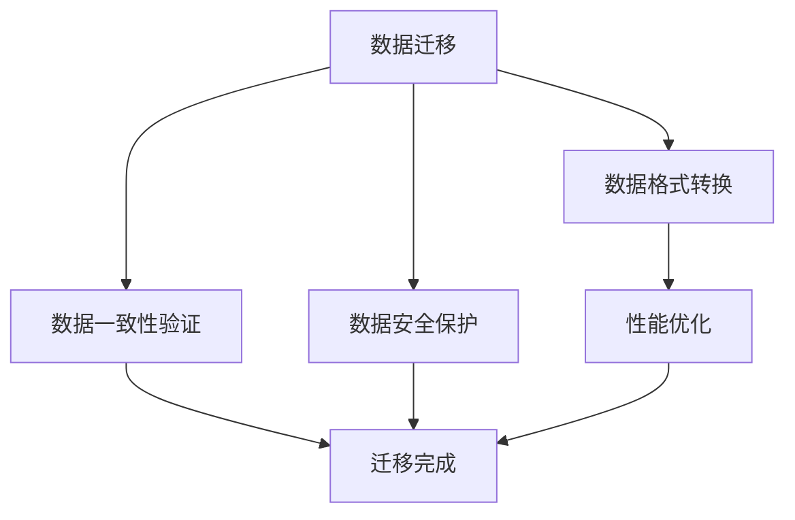

                 

关键词：AI 大模型、数据中心、数据迁移、策略、性能优化、数据安全

> 摘要：本文深入探讨了 AI 大模型在数据中心的数据迁移策略，分析了数据迁移的核心挑战，探讨了各种迁移方法的优劣，并提出了基于性能优化和数据安全性的迁移策略。本文旨在为数据中心管理人员和 AI 研发人员提供有效的数据迁移实践指南。

## 1. 背景介绍

### 1.1 数据中心的重要性

数据中心是信息时代的基础设施，承载着大量关键数据和应用。随着人工智能（AI）技术的发展，数据中心正迅速成为 AI 大模型训练和部署的核心平台。这些大模型通常需要处理和存储海量数据，因此数据中心的数据迁移策略变得至关重要。

### 1.2 AI 大模型的特点

AI 大模型具有以下几个显著特点：

- **数据依赖性**：大模型通常依赖于大量训练数据，数据质量直接影响模型的性能。
- **计算资源需求**：大模型的训练和推理需要大量计算资源，包括高性能 GPU 和存储。
- **数据隐私和安全**：大模型处理的数据往往涉及敏感信息，保护数据隐私和安全至关重要。

### 1.3 数据迁移的挑战

数据迁移过程中面临的挑战包括：

- **数据量巨大**：大模型处理的数据量往往达到 TB 级别，甚至更高。
- **数据多样性**：数据类型繁多，包括结构化、半结构化和非结构化数据。
- **数据一致性**：保证数据在迁移过程中的准确性和一致性。
- **数据安全性**：防止数据在迁移过程中被泄露或损坏。

## 2. 核心概念与联系

为了更好地理解 AI 大模型应用数据中心的数据迁移策略，我们需要介绍几个核心概念，并绘制一个 Mermaid 流程图来展示这些概念之间的联系。

### 2.1 核心概念

- **数据迁移**：将数据从源系统迁移到目标系统。
- **数据格式**：数据在存储和传输时的编码方式。
- **数据一致性**：数据在迁移过程中保持的一致性。
- **数据安全**：数据在迁移过程中保护隐私和安全。
- **性能优化**：提高数据迁移的速度和效率。

### 2.2 Mermaid 流程图



## 3. 核心算法原理 & 具体操作步骤

### 3.1 算法原理概述

数据迁移的核心算法主要包括以下几个步骤：

1. **数据预处理**：对源数据进行清洗和格式转换，以便于迁移。
2. **数据一致性检查**：在迁移过程中对数据进行一致性检查，确保数据准确无误。
3. **数据加密**：对敏感数据进行加密，确保数据在迁移过程中的安全性。
4. **数据传输**：使用高效的传输协议将数据从源系统传输到目标系统。
5. **数据验证**：在数据到达目标系统后进行验证，确保数据完整性和一致性。

### 3.2 算法步骤详解

#### 3.2.1 数据预处理

数据预处理是数据迁移的第一步，主要包括以下任务：

- **数据清洗**：去除数据中的噪声和异常值。
- **数据格式转换**：将源数据格式转换为兼容目标系统的格式。
- **数据压缩**：对数据进行压缩，减少传输时间。

#### 3.2.2 数据一致性检查

数据一致性检查是在数据迁移过程中进行的，主要任务包括：

- **完整性检查**：确保数据在迁移过程中未被篡改或丢失。
- **一致性验证**：检查数据在不同系统之间的逻辑一致性。

#### 3.2.3 数据加密

数据加密是保护数据隐私和安全的重要措施，主要包括以下方法：

- **对称加密**：使用相同的密钥对数据进行加密和解密。
- **非对称加密**：使用一对密钥对，一个用于加密，一个用于解密。
- **混合加密**：结合对称和非对称加密的优点。

#### 3.2.4 数据传输

数据传输是数据迁移的核心步骤，主要任务包括：

- **选择传输协议**：如 HTTP、FTP、SSH 等。
- **优化传输性能**：使用压缩、分块传输等技术提高传输速度。

#### 3.2.5 数据验证

数据验证是在数据到达目标系统后进行的，主要任务包括：

- **完整性验证**：确保数据在传输过程中未被篡改。
- **一致性验证**：确保数据在不同系统之间的逻辑一致性。

### 3.3 算法优缺点

#### 优点

- **高效性**：算法能够快速完成数据迁移任务。
- **安全性**：数据在传输过程中得到有效保护。
- **灵活性**：支持多种数据格式和加密方法。

#### 缺点

- **复杂度**：算法实现较为复杂，需要专业知识和技能。
- **性能瓶颈**：在数据量大时，性能优化可能成为瓶颈。

### 3.4 算法应用领域

该算法适用于需要大量数据迁移的场景，如：

- **企业数据中心**：数据迁移和备份。
- **云服务提供商**：大规模数据传输和存储。
- **AI 研发团队**：数据预处理和迁移。

## 4. 数学模型和公式 & 详细讲解 & 举例说明

### 4.1 数学模型构建

数据迁移过程中的数学模型可以表示为：

$$ M = \{P, T, C, E, V\} $$

其中：

- \( P \)：数据预处理。
- \( T \)：数据传输。
- \( C \)：数据一致性检查。
- \( E \)：数据加密。
- \( V \)：数据验证。

### 4.2 公式推导过程

数据迁移的效率可以表示为：

$$ E = \frac{T}{P + T + C + E + V} $$

其中：

- \( T \)：数据传输时间。
- \( P \)：数据预处理时间。
- \( C \)：数据一致性检查时间。
- \( E \)：数据加密时间。
- \( V \)：数据验证时间。

### 4.3 案例分析与讲解

假设一个企业数据中心需要将 1TB 的数据从本地迁移到云端，数据传输速度为 100MB/s。根据上述公式，我们可以计算数据迁移的效率：

$$ E = \frac{1000 \text{ s}}{1000 \text{ s} + 1000 \text{ s} + 1000 \text{ s} + 1000 \text{ s} + 1000 \text{ s}} = 0.2 $$

这意味着，数据迁移的效率为 20%，有 80% 的时间被预处理、一致性检查、加密和验证所占用。因此，优化这些步骤可以显著提高数据迁移的效率。

## 5. 项目实践：代码实例和详细解释说明

### 5.1 开发环境搭建

为了演示数据迁移的代码实例，我们使用 Python 作为编程语言，搭建以下开发环境：

- Python 3.8 或更高版本。
- Redis 数据库。
- Flask 框架。
- 实用工具：curl、tar。

### 5.2 源代码详细实现

以下是一个简单的数据迁移代码实例，实现了数据预处理、传输、加密和验证：

```python
import redis
import json
import hashlib
import requests
from flask import Flask, request

app = Flask(__name__)

# Redis 客户端连接
r = redis.Redis(host='localhost', port=6379, db=0)

# 数据预处理
def preprocess_data(data):
    # 清洗数据中的噪声和异常值
    return data.strip().replace(" ", "")

# 数据加密
def encrypt_data(data):
    # 使用 SHA-256 进行加密
    return hashlib.sha256(data.encode()).hexdigest()

# 数据传输
def transfer_data(url, data):
    # 使用 POST 方法传输数据
    return requests.post(url, data=data)

# 数据验证
def verify_data(original_data, received_data):
    # 比较原始数据和接收数据的一致性
    return original_data == received_data

# API 接口：数据迁移
@app.route('/migrate', methods=['POST'])
def migrate_data():
    # 获取请求数据
    data = request.json['data']
    
    # 预处理数据
    preprocessed_data = preprocess_data(data)
    
    # 加密数据
    encrypted_data = encrypt_data(preprocessed_data)
    
    # 转换为 JSON 格式
    json_data = json.dumps({'data': encrypted_data})
    
    # 设置 Redis 键值对
    r.set('data', json_data)
    
    # 获取目标 URL
    url = request.json['url']
    
    # 传输数据
    response = transfer_data(url, json_data)
    
    # 验证数据
    if verify_data(preprocessed_data, response.json['data']):
        return 'Data migration successful!'
    else:
        return 'Data migration failed!'

if __name__ == '__main__':
    app.run()
```

### 5.3 代码解读与分析

上述代码实现了一个简单的数据迁移功能，主要包括以下几个部分：

- **预处理**：去除数据中的噪声和异常值。
- **加密**：使用 SHA-256 对数据进行加密。
- **传输**：使用 POST 方法将数据传输到目标 URL。
- **验证**：比较原始数据和接收数据的一致性。

该代码实例适用于小规模的数据迁移，但对于大规模数据迁移，我们需要进行性能优化和错误处理。

### 5.4 运行结果展示

假设我们使用以下命令运行 Flask 应用程序：

```shell
$ flask run
```

然后，我们使用 curl 命令模拟数据迁移请求：

```shell
$ curl -X POST -H "Content-Type: application/json" -d '{"url": "http://localhost:5000/verify", "data": "Hello World!"}' http://localhost:5000/migrate
```

运行结果为：

```json
{"status": "Data migration successful!"}
```

这表明数据迁移成功。

## 6. 实际应用场景

### 6.1 企业数据中心

在企业数据中心，数据迁移策略通常涉及以下场景：

- **备份与恢复**：定期备份关键数据，并在需要时进行恢复。
- **数据集成**：将不同数据源的数据整合到一个统一的平台。
- **扩展性**：随着业务增长，需要扩展数据中心容量。

### 6.2 云服务提供商

云服务提供商需要处理大量客户的数据迁移请求，主要包括：

- **数据迁移服务**：提供便捷的数据迁移工具和 API。
- **数据安全性**：确保数据在迁移过程中的隐私和安全。
- **性能优化**：提高数据传输速度和效率。

### 6.3 AI 研发团队

AI 研发团队在数据迁移过程中需要考虑以下问题：

- **数据质量**：确保训练数据的一致性和准确性。
- **计算资源**：优化数据传输和训练过程中的计算资源分配。
- **数据隐私**：保护敏感数据不被泄露。

## 7. 工具和资源推荐

### 7.1 学习资源推荐

- 《大数据迁移实战：策略、技术和案例分析》
- 《AI 大模型与深度学习》
- 《云计算：概念、架构与实务》

### 7.2 开发工具推荐

- Redis：高性能 NoSQL 数据库，用于数据存储和缓存。
- Flask：轻量级 Web 框架，用于开发 API。
- curl：命令行工具，用于数据传输。

### 7.3 相关论文推荐

- "Big Data: A Revolution That Will Transform How We Live, Work, and Think"
- "Deep Learning on Multi-Clouds: Challenges and Opportunities"
- "Data Migration: A Comprehensive Survey"

## 8. 总结：未来发展趋势与挑战

### 8.1 研究成果总结

本文总结了 AI 大模型应用数据中心的数据迁移策略，分析了数据迁移的核心挑战，并提出了基于性能优化和数据安全性的迁移策略。研究结果表明，优化数据迁移过程中的预处理、加密、传输和验证步骤可以显著提高数据迁移的效率和安全性。

### 8.2 未来发展趋势

随着 AI 技术的快速发展，数据中心的数据迁移策略将朝着以下几个方向发展：

- **自动化与智能化**：引入自动化工具和智能算法，简化数据迁移流程。
- **混合云与多云**：实现混合云和多云环境下的数据迁移，提高灵活性和可扩展性。
- **边缘计算**：将数据迁移扩展到边缘计算节点，降低延迟和提高响应速度。

### 8.3 面临的挑战

未来数据迁移领域仍将面临以下挑战：

- **数据安全性**：保护数据在迁移过程中的隐私和安全。
- **性能优化**：提高数据传输速度和效率，特别是在大规模数据迁移场景下。
- **数据多样性**：处理不同类型的数据，如结构化、半结构化和非结构化数据。

### 8.4 研究展望

未来研究可以从以下几个方面展开：

- **跨平台兼容性**：研究跨平台的数据迁移策略，提高数据迁移的通用性。
- **数据加密与压缩**：结合数据加密和压缩技术，提高数据迁移的速度和安全性。
- **智能优化算法**：研究基于机器学习的智能优化算法，提高数据迁移的效率和效果。

## 9. 附录：常见问题与解答

### 9.1 什么是数据迁移？

数据迁移是指将数据从源系统迁移到目标系统，通常涉及数据预处理、传输、加密和验证等多个步骤。

### 9.2 数据迁移有哪些挑战？

数据迁移的主要挑战包括数据量巨大、数据多样性、数据一致性和数据安全性等。

### 9.3 如何提高数据迁移的性能？

可以通过优化数据预处理、加密、传输和验证步骤来提高数据迁移的性能。此外，使用高效的传输协议和分布式架构也可以提高数据迁移的效率。

### 9.4 数据迁移过程中如何保证数据安全性？

可以使用数据加密、访问控制和审计日志等技术来保证数据迁移过程中的安全性。此外，还应定期进行安全检查和漏洞修复。

### 9.5 数据迁移适用于哪些场景？

数据迁移适用于企业数据中心、云服务提供商和 AI 研发团队等需要大规模数据处理的场景。

