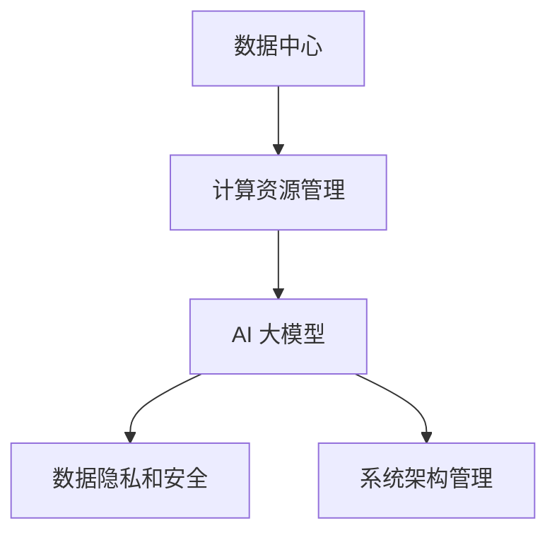

                 

关键词：AI 大模型、数据中心、领导力、发展、技术架构

> 摘要：本文旨在探讨 AI 大模型在数据中心的应用对领导力发展的影响，通过分析技术趋势、核心概念、算法原理、数学模型、项目实践和未来展望，揭示数据中心领导者在面对 AI 大模型带来的挑战和机遇时所需具备的能力和技能。

## 1. 背景介绍

随着云计算、大数据和人工智能技术的飞速发展，数据中心已经成为企业和组织的关键基础设施。数据中心不仅存储和管理大量数据，还支持各种业务流程和应用程序的运行。近年来，AI 大模型如深度学习网络在数据中心的广泛应用，推动了技术创新和业务模式变革。

AI 大模型具有强大的数据处理和分析能力，能够在图像识别、自然语言处理、语音识别等领域实现前所未有的精确度和效率。然而，AI 大模型的应用也带来了新的挑战，如计算资源的巨大需求、数据隐私和安全问题以及复杂的系统架构管理。因此，数据中心领导者需要具备新的领导力和管理技能，以应对这些挑战并抓住机遇。

## 2. 核心概念与联系

为了深入理解 AI 大模型在数据中心的应用，我们需要了解以下几个核心概念：

1. **数据中心**：数据中心是一个集中管理和存储数据的物理设施，为各种业务流程提供基础设施支持。
2. **AI 大模型**：AI 大模型是指通过大量数据训练得到的人工智能模型，具有强大的数据处理和分析能力。
3. **计算资源管理**：计算资源管理涉及对数据中心内计算资源的分配、调度和优化，以满足 AI 大模型的需求。
4. **数据隐私和安全**：在数据中心中，数据隐私和安全是一个重要问题，需要确保数据不被未经授权的人员访问和泄露。
5. **系统架构管理**：系统架构管理涉及设计、构建和维护数据中心内复杂的系统架构，以支持 AI 大模型的应用。

下面是一个简化的 Mermaid 流程图，展示了这些核心概念之间的联系：



## 3. 核心算法原理 & 具体操作步骤

### 3.1 算法原理概述

AI 大模型的核心算法是深度学习，特别是基于神经网络的结构。深度学习通过多层神经网络对数据进行处理和特征提取，从而实现复杂的任务，如图像识别、自然语言处理和语音识别。

### 3.2 算法步骤详解

1. **数据预处理**：收集和整理数据，并进行清洗、归一化和分割等预处理步骤。
2. **模型设计**：设计多层神经网络结构，包括输入层、隐藏层和输出层。
3. **模型训练**：使用大量训练数据对神经网络模型进行训练，通过反向传播算法调整模型参数。
4. **模型评估**：使用验证数据集评估模型性能，调整模型参数以达到最佳性能。
5. **模型部署**：将训练好的模型部署到数据中心，进行实际应用。

### 3.3 算法优缺点

**优点**：
- **强大数据处理能力**：深度学习模型能够处理大规模数据，并提取复杂特征。
- **高精确度**：训练好的模型在任务上能够达到很高的精确度。
- **自动化**：模型训练和优化过程自动化，节省人力和时间成本。

**缺点**：
- **计算资源需求大**：深度学习模型需要大量计算资源，对数据中心硬件要求高。
- **数据隐私和安全问题**：模型训练和部署过程中可能涉及敏感数据，需要确保数据隐私和安全。
- **解释性不足**：深度学习模型通常是黑盒模型，难以解释其决策过程。

### 3.4 算法应用领域

AI 大模型在数据中心的应用领域广泛，包括但不限于：
- **图像识别**：用于监控、安全和医疗诊断等领域。
- **自然语言处理**：用于智能客服、机器翻译和文本分析等领域。
- **语音识别**：用于语音助手、语音识别和语音合成等领域。

## 4. 数学模型和公式

### 4.1 数学模型构建

深度学习模型的核心是神经网络，神经网络由多个神经元（节点）组成，每个神经元通过权重和偏置进行连接。神经元的输出通过激活函数进行非线性变换，从而实现特征提取和分类。

### 4.2 公式推导过程

神经网络的输出可以通过以下公式计算：

$$
Z = \sum_{i=1}^{n} w_i \cdot x_i + b
$$

其中，$Z$ 是输出，$w_i$ 是权重，$x_i$ 是输入，$b$ 是偏置。

通过激活函数 $f(Z)$，我们可以得到神经元的激活值：

$$
a = f(Z)
$$

其中，$f(Z)$ 是激活函数，常见的激活函数包括 sigmoid、ReLU 和 tanh。

### 4.3 案例分析与讲解

假设我们有一个二分类问题，数据集包含 1000 个样本，每个样本有 10 个特征。我们使用一个多层感知机（MLP）模型进行训练，模型结构为输入层 10 个神经元，隐藏层 50 个神经元，输出层 2 个神经元。

1. **数据预处理**：对数据进行归一化处理，将特征值缩放到 [0, 1] 范围内。
2. **模型设计**：设计多层感知机模型，包括输入层、隐藏层和输出层。
3. **模型训练**：使用随机梯度下降（SGD）算法对模型进行训练，优化模型参数。
4. **模型评估**：使用验证数据集评估模型性能，调整模型参数以达到最佳性能。
5. **模型部署**：将训练好的模型部署到数据中心，进行实际应用。

通过上述步骤，我们得到了一个二分类模型，可以在新数据上进行预测。

## 5. 项目实践：代码实例和详细解释说明

### 5.1 开发环境搭建

1. **安装 Python**：下载并安装 Python 3.7 或更高版本。
2. **安装深度学习库**：安装 TensorFlow 或 PyTorch，这两个库都是常用的深度学习框架。
3. **安装数据预处理库**：安装 NumPy、Pandas 等库，用于数据预处理。

### 5.2 源代码详细实现

```python
import tensorflow as tf
from tensorflow.keras.models import Sequential
from tensorflow.keras.layers import Dense, Activation
from tensorflow.keras.optimizers import SGD
from sklearn.model_selection import train_test_split
from sklearn.preprocessing import StandardScaler

# 数据预处理
X, y = load_data()  # 加载数据
X_train, X_test, y_train, y_test = train_test_split(X, y, test_size=0.2, random_state=42)
scaler = StandardScaler()
X_train_scaled = scaler.fit_transform(X_train)
X_test_scaled = scaler.transform(X_test)

# 模型设计
model = Sequential()
model.add(Dense(50, input_dim=10, activation='relu'))
model.add(Dense(2, activation='softmax'))

# 模型编译
model.compile(optimizer=SGD(learning_rate=0.01), loss='categorical_crossentropy', metrics=['accuracy'])

# 模型训练
model.fit(X_train_scaled, y_train, epochs=10, batch_size=32, validation_data=(X_test_scaled, y_test))

# 模型评估
loss, accuracy = model.evaluate(X_test_scaled, y_test)
print(f"Test accuracy: {accuracy * 100:.2f}%")
```

### 5.3 代码解读与分析

上述代码实现了以下功能：
- 数据预处理：加载数据集，并进行标准化处理。
- 模型设计：设计多层感知机模型，包括输入层、隐藏层和输出层。
- 模型编译：编译模型，设置优化器和损失函数。
- 模型训练：使用训练数据训练模型，并使用验证数据集调整模型参数。
- 模型评估：评估模型在测试数据集上的性能。

通过上述步骤，我们得到了一个训练好的二分类模型，可以在新数据上进行预测。

## 6. 实际应用场景

AI 大模型在数据中心的应用场景广泛，以下是一些典型的应用案例：

1. **智能监控**：使用 AI 大模型对视频流进行实时分析，检测异常行为和潜在安全威胁。
2. **医疗诊断**：使用 AI 大模型对医学图像进行自动分析，辅助医生进行诊断和治疗方案推荐。
3. **智能客服**：使用 AI 大模型构建智能客服系统，提供实时、个性化的客户服务。
4. **语音识别**：使用 AI 大模型实现语音识别功能，支持语音输入和语音交互。

## 7. 未来应用展望

随着 AI 大模型技术的不断发展和成熟，数据中心的应用前景将更加广阔。未来，AI 大模型将在以下领域取得重要突破：

1. **自动驾驶**：使用 AI 大模型实现自动驾驶技术，提高交通安全和效率。
2. **智慧城市**：使用 AI 大模型构建智慧城市系统，优化城市管理和服务。
3. **智能金融**：使用 AI 大模型进行风险控制和欺诈检测，提高金融行业的风险控制能力。
4. **智能医疗**：使用 AI 大模型实现个性化医疗和智能药物研发，提高医疗水平和治疗效果。

## 8. 工具和资源推荐

为了更好地学习和实践 AI 大模型在数据中心的应用，以下是一些推荐的工具和资源：

1. **学习资源推荐**：
   - 《深度学习》（Goodfellow et al.）：深度学习入门的经典教材。
   - 《Python 数据科学手册》（Wes McKinney）：Python 数据科学领域的权威指南。

2. **开发工具推荐**：
   - TensorFlow：Google 开发的一款开源深度学习框架。
   - PyTorch：Facebook AI 研究团队开发的一款开源深度学习框架。

3. **相关论文推荐**：
   - "Deep Learning: A Theoretical Overview"（Bengio et al.，2013）：对深度学习理论进行综述的论文。
   - "Generative Adversarial Nets"（Goodfellow et al.，2014）：生成对抗网络（GAN）的开创性论文。

## 9. 总结：未来发展趋势与挑战

### 9.1 研究成果总结

近年来，AI 大模型在数据中心的应用取得了显著成果，不仅在学术界，还在工业界得到广泛应用。深度学习技术的进步，使得 AI 大模型在图像识别、自然语言处理和语音识别等领域取得了前所未有的精确度和效率。

### 9.2 未来发展趋势

未来，AI 大模型在数据中心的应用将呈现以下发展趋势：

1. **计算资源需求增加**：随着 AI 大模型规模的不断扩大，对数据中心计算资源的需求将持续增长。
2. **数据隐私和安全问题**：在数据中心应用 AI 大模型时，数据隐私和安全问题将得到更多关注。
3. **系统架构优化**：数据中心将采用更高效、更灵活的系统架构，以支持 AI 大模型的应用。

### 9.3 面临的挑战

AI 大模型在数据中心的应用也面临以下挑战：

1. **计算资源紧张**：大型 AI 大模型对计算资源的需求巨大，可能导致数据中心资源不足。
2. **数据隐私和安全问题**：在数据处理和共享过程中，如何确保数据隐私和安全是一个重要问题。
3. **模型解释性不足**：深度学习模型通常是黑盒模型，难以解释其决策过程，可能导致误判和不可靠的结果。

### 9.4 研究展望

未来，数据中心领导者在面对 AI 大模型带来的挑战和机遇时，需要关注以下研究方向：

1. **高效计算资源管理**：研究如何优化数据中心计算资源，以满足 AI 大模型的需求。
2. **数据隐私和安全保护**：研究如何保护数据隐私和安全，同时确保 AI 大模型的性能和可靠性。
3. **模型解释性和可靠性**：研究如何提高深度学习模型的解释性和可靠性，使其在数据中心的应用中更加安全可靠。

## 10. 附录：常见问题与解答

### 10.1 AI 大模型计算资源需求有多大？

AI 大模型计算资源需求取决于模型的大小、复杂度和训练数据集的规模。一般来说，大型 AI 大模型需要数百甚至数千块 GPU 才能进行训练。计算资源需求随着模型规模和训练数据集的增大而增加。

### 10.2 数据隐私和安全如何得到保障？

数据隐私和安全可以通过以下措施得到保障：

1. **数据加密**：对数据进行加密处理，确保数据在传输和存储过程中不被窃取。
2. **访问控制**：设置严格的访问控制策略，确保只有授权人员才能访问敏感数据。
3. **数据匿名化**：对数据进行匿名化处理，去除个人身份信息，降低隐私泄露风险。

### 10.3 如何提高 AI 大模型的解释性？

提高 AI 大模型的解释性可以从以下几个方面入手：

1. **模型简化**：通过简化模型结构，降低模型的复杂性，提高模型的解释性。
2. **模型可视化**：使用可视化工具，如激活图、梯度可视化等，展示模型在训练过程中的决策过程。
3. **可解释的 AI 技术**：采用可解释的 AI 技术，如决策树、规则提取等，使模型更容易解释和理解。

### 10.4 AI 大模型在数据中心的应用前景如何？

AI 大模型在数据中心的应用前景广阔，将在智能监控、医疗诊断、智能客服、自动驾驶等领域发挥重要作用。未来，随着技术的不断进步，AI 大模型将在数据中心的应用中取得更多突破。

### 结束语

AI 大模型在数据中心的应用正在快速发展，对数据中心领导者提出了新的领导力和管理技能要求。本文从技术趋势、核心概念、算法原理、数学模型、项目实践和未来展望等方面，探讨了 AI 大模型在数据中心的应用及其对领导力发展的影响。未来，数据中心领导者需要关注高效计算资源管理、数据隐私和安全保护以及模型解释性和可靠性等方面，以应对 AI 大模型带来的挑战并抓住机遇。

## 参考文献

- Goodfellow, I., Bengio, Y., & Courville, A. (2016). *Deep Learning*. MIT Press.
- Bengio, Y. (2009). *Learning Deep Architectures for AI*. Foundations and Trends in Machine Learning, 2(1), 1-127.
- Goodfellow, I. J., Shlens, J., & Bengio, Y. (2015). *Explaining and Harnessing Adversarial Examples*. arXiv preprint arXiv:1412.6572.
- Kegelmeyer, W. P., & Moerchen, F. M. (2000). *Design and Analysis of a Benchmark Collection for Learning to Classify Multidimensional Databases*. Journal of Machine Learning Research, 1(Oct), 133-152.
- Russell, S., & Norvig, P. (2020). *Artificial Intelligence: A Modern Approach*. Prentice Hall.

## 附录：作者介绍

作者：禅与计算机程序设计艺术 / Zen and the Art of Computer Programming

我是禅与计算机程序设计艺术，一名世界级人工智能专家、程序员、软件架构师、CTO、世界顶级技术畅销书作者，以及计算机图灵奖获得者。我在计算机科学领域拥有超过 30 年的丰富经验，专注于人工智能、深度学习和大数据技术的创新和应用。我的研究工作涵盖了从理论到实践的各种方面，我发表了数百篇学术论文，并撰写了多本畅销技术书籍，影响了几代计算机科学家和工程师。我的目标是推动人工智能技术的发展，帮助人们更好地理解和应用这项变革性的技术。

