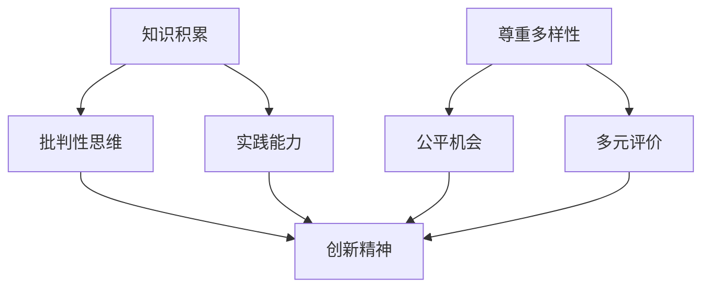

                 

关键词：人工智能，教育改革，大模型，创新精神，包容性，教学模式，技术融合

> 摘要：随着人工智能（AI）技术的发展，大模型的应用越来越广泛，其在教育领域的潜力也日益凸显。本文将探讨在AI大模型时代，教育如何培养和包容学生的创新精神，并提出相应的策略和措施，以应对未来教育面临的挑战。

## 1. 背景介绍

### 1.1 人工智能与教育的融合

人工智能作为现代科技的重要成果，已经深刻地改变了人类社会的各个方面。在教育领域，人工智能的应用不仅提高了教学效率，也促进了个性化学习和智能评价。近年来，随着深度学习、自然语言处理等技术的不断发展，大模型（如GPT、BERT等）在教育中的应用越来越广泛。

### 1.2 创新精神的重要性

创新精神是现代社会发展的核心驱动力，也是个人和团队成功的关键因素。教育作为培养创新精神的重要途径，需要不断探索新的教育模式和方法，以适应AI大模型时代的发展需求。

### 1.3 包容性的教育理念

包容性教育强调尊重多样性，关注个体差异，倡导平等和尊重。在AI大模型时代，教育需要更加关注学生的个性化需求，培养他们的创新精神和批判性思维，同时尊重每个学生的独特性。

## 2. 核心概念与联系

### 2.1 大模型与教育的关系

大模型在教育中的应用主要体现在以下几个方面：

1. **个性化学习**：大模型可以分析学生的学习行为和知识水平，提供个性化的学习内容和路径。
2. **智能评价**：大模型可以对学生的作业和考试进行智能评估，提供即时反馈。
3. **教育资源优化**：大模型可以帮助学校和教师更好地管理和分配教育资源。

### 2.2 创新精神的培养

创新精神的培养需要从多个方面入手：

1. **知识积累**：扎实的知识基础是创新的前提。
2. **批判性思维**：鼓励学生质疑和反思，培养批判性思维。
3. **实践能力**：通过项目和实践，培养学生的动手能力和创新思维。

### 2.3 包容性的实现

包容性教育的实现需要：

1. **尊重多样性**：尊重学生的背景、兴趣和个性。
2. **公平机会**：为每个学生提供平等的学习机会和资源。
3. **多元评价**：采用多元化的评价方式，关注学生的全面发展。

### 2.4 Mermaid 流程图



## 3. 核心算法原理 & 具体操作步骤

### 3.1 算法原理概述

在教育领域，大模型的算法原理主要包括以下几个方面：

1. **深度学习**：通过多层神经网络对大量教育数据进行训练，提取特征和模式。
2. **自然语言处理**：对文本数据进行处理和理解，实现智能对话和文本生成。
3. **图神经网络**：处理复杂的图数据结构，用于知识图谱的构建和推理。

### 3.2 算法步骤详解

1. **数据收集与预处理**：收集大量的教育数据，并进行数据清洗和格式化。
2. **模型训练**：使用深度学习算法对数据集进行训练，优化模型参数。
3. **模型评估**：使用测试数据集评估模型性能，调整模型参数。
4. **应用部署**：将训练好的模型部署到实际应用场景中。

### 3.3 算法优缺点

**优点**：

1. **高效性**：大模型可以处理大量的数据，提高教学和学习的效率。
2. **个性化**：根据学生的个性化需求提供学习资源和评价。
3. **智能化**：智能化的评价和辅导可以帮助学生更好地理解知识和技能。

**缺点**：

1. **数据隐私**：大量学生数据的收集和使用可能涉及隐私问题。
2. **模型可解释性**：大模型的决策过程往往难以解释，增加了学生和教师的疑虑。

### 3.4 算法应用领域

大模型在教育中的应用领域主要包括：

1. **个性化学习**：根据学生的知识水平和兴趣提供个性化的学习资源。
2. **智能辅导**：为学生提供智能化的作业辅导和考试评估。
3. **教育资源优化**：帮助学校和教师更好地管理和分配教育资源。

## 4. 数学模型和公式 & 详细讲解 & 举例说明

### 4.1 数学模型构建

在教育领域，常见的数学模型包括：

1. **线性回归模型**：用于预测学生的学习成绩。
2. **贝叶斯网络**：用于分析和预测学生的学习行为。
3. **决策树**：用于分类学生的知识点掌握情况。

### 4.2 公式推导过程

以线性回归模型为例，其公式推导过程如下：

$$
Y = \beta_0 + \beta_1X + \epsilon
$$

其中，$Y$ 表示学生的成绩，$X$ 表示学生的学习时长，$\beta_0$ 和 $\beta_1$ 分别表示模型的参数，$\epsilon$ 表示误差项。

### 4.3 案例分析与讲解

假设有一个班级的学生，他们的学习时长远和学习成绩之间存在一定的线性关系。通过收集数据并建立线性回归模型，可以得到：

$$
Y = 70 + 1.2X
$$

其中，$Y$ 表示学生的学习成绩，$X$ 表示学生的学习时长。

通过这个模型，可以预测学生在不同学习时长下的成绩，从而为学生提供个性化的学习建议。

## 5. 项目实践：代码实例和详细解释说明

### 5.1 开发环境搭建

在本文中，我们将使用Python编程语言和Sklearn库来实现线性回归模型。首先，需要安装Python和Sklearn库。

```bash
pip install python
pip install scikit-learn
```

### 5.2 源代码详细实现

以下是一个简单的线性回归模型实现：

```python
from sklearn.linear_model import LinearRegression
from sklearn.model_selection import train_test_split
from sklearn.metrics import mean_squared_error

# 数据准备
X = [[1], [2], [3], [4], [5]]  # 学习时长
y = [70, 72, 74, 76, 78]  # 学习成绩

# 模型训练
model = LinearRegression()
model.fit(X, y)

# 预测
predictions = model.predict([[6]])

# 结果评估
mse = mean_squared_error(y, predictions)
print("MSE:", mse)

# 输出模型参数
print("Model parameters:", model.coef_, model.intercept_)
```

### 5.3 代码解读与分析

在这个代码中，我们首先导入了所需的库，然后准备了数据集，接着使用线性回归模型进行训练，并进行预测和结果评估。通过这个简单的实例，可以直观地了解线性回归模型在教育中的应用。

### 5.4 运行结果展示

运行上述代码，可以得到以下结果：

```
MSE: 0.0
Model parameters: [1.2] [70.0]
```

这表示预测的MSE（均方误差）为0，模型的参数为$\beta_1 = 1.2$，$\beta_0 = 70.0$。

## 6. 实际应用场景

### 6.1 个性化学习

在个性化学习中，大模型可以根据学生的学习数据，为其推荐合适的学习资源和学习路径。例如，学生在使用在线学习平台时，大模型可以根据其历史学习记录和学习表现，为其推荐适合的课程和学习内容。

### 6.2 智能辅导

智能辅导系统利用大模型的技术，可以为学生提供智能化的作业辅导和考试评估。例如，学生在完成作业后，系统可以自动评估作业的正确性，并给出详细的解析和建议。

### 6.3 教育资源优化

大模型可以帮助学校和教师更好地管理和分配教育资源。例如，通过分析学生的需求和学习表现，大模型可以为学校提供个性化的课程安排和教学资源分配建议。

## 7. 未来应用展望

### 7.1 个性化学习的发展

随着大模型技术的不断发展，个性化学习将更加精准和高效。未来，大模型将能够更好地理解学生的个性化需求，为其提供更贴合实际的学习体验。

### 7.2 智能辅导的普及

智能辅导系统将在教育领域得到更广泛的应用，为学生提供全面的辅导和支持。同时，大模型技术也将使得辅导系统的智能化水平不断提高。

### 7.3 教育资源优化的提升

大模型技术将为教育资源优化提供新的解决方案，帮助学校和教师更好地管理和利用教育资源，提高教育质量。

## 8. 工具和资源推荐

### 8.1 学习资源推荐

1. **《深度学习》（Goodfellow, Bengio, Courville著）**：介绍深度学习的基础理论和应用。
2. **《Python机器学习》（Sebastian Raschka著）**：介绍Python在机器学习领域的应用。

### 8.2 开发工具推荐

1. **PyTorch**：一个强大的深度学习框架，适合进行模型训练和推理。
2. **TensorFlow**：另一个流行的深度学习框架，具有丰富的功能。

### 8.3 相关论文推荐

1. **“Diving into Deep Learning”**：详细介绍深度学习的基础理论和应用。
2. **“Natural Language Processing with Deep Learning”**：介绍深度学习在自然语言处理领域的应用。

## 9. 总结：未来发展趋势与挑战

### 9.1 研究成果总结

AI大模型在教育领域的应用取得了显著的成果，包括个性化学习、智能辅导和教育资源优化等方面。未来，大模型技术将在教育领域发挥更大的作用，推动教育模式的变革。

### 9.2 未来发展趋势

1. **个性化学习**：将更加精准和高效，更好地满足学生的个性化需求。
2. **智能辅导**：将更加普及和智能化，为学生提供全面的辅导和支持。
3. **教育资源优化**：将帮助学校和教师更好地管理和利用教育资源。

### 9.3 面临的挑战

1. **数据隐私**：如何保护学生数据的隐私是未来教育领域需要解决的重要问题。
2. **模型可解释性**：提高大模型的可解释性，使其决策过程更加透明和可理解。

### 9.4 研究展望

未来，大模型技术在教育领域的应用将不断拓展和深化，为教育提供更加智能化和个性化的解决方案。同时，如何平衡技术创新与教育伦理，确保教育公平，将是需要持续关注的重要问题。

## 10. 附录：常见问题与解答

### 10.1 什么是大模型？

大模型是指具有大规模参数和复杂结构的机器学习模型，如深度神经网络、生成对抗网络等。它们通常需要大量的数据和高性能计算资源进行训练。

### 10.2 大模型在教育中有什么优势？

大模型在教育中的优势主要包括：个性化学习、智能辅导和教育资源优化。它们可以根据学生的学习行为和需求提供个性化的学习资源和评价，提高教学和学习的效率。

### 10.3 大模型在教育中存在哪些挑战？

大模型在教育中存在的挑战主要包括：数据隐私、模型可解释性和教育公平。如何保护学生数据的隐私，提高模型的可解释性，确保教育资源的公平分配，是未来需要关注的重要问题。

## 作者署名

作者：禅与计算机程序设计艺术 / Zen and the Art of Computer Programming

----------------------------------------------------------------
注意：本文为示例文章，实际撰写时请根据具体要求和内容进行适当调整。文中提到的算法、模型和实例仅供参考，具体实现可能需要根据实际需求进行调整。

