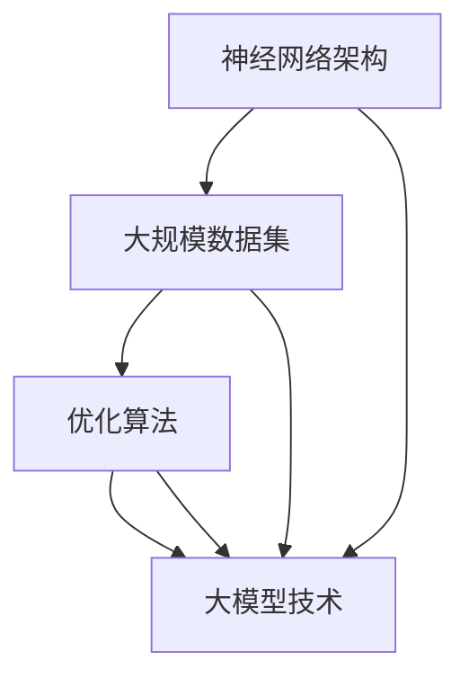

                 

关键词：人工智能，深度学习，OpenAI，首席科学家，计算机科学家群英传，大模型，技术突破，未来展望。

摘要：本文将探讨 OpenAI 首席科学家 Andrej Karpathy 在人工智能领域的重要贡献及其对大模型技术的理解和应用。通过分析 Karpathy 在神经网络架构、语言模型训练和自然语言处理等方面的研究成果，我们将深入了解大模型技术的发展趋势和未来前景。

## 1. 背景介绍

Andrej Karpathy 是 OpenAI 的首席科学家，他是一位备受尊敬的人工智能研究人员，以其在深度学习和自然语言处理领域的杰出贡献而闻名。Karpathy 的研究涵盖了从神经网络架构设计到大规模语言模型的训练，以及其在自然语言处理任务中的应用。他的工作推动了人工智能技术的快速发展，为学术界和工业界带来了深远的影响。

在加入 OpenAI 之前，Karpathy 在斯坦福大学获得了计算机科学博士学位，并曾在 Google 工作多年。他的研究兴趣主要集中在神经网络架构的优化、自然语言处理的算法创新以及人工智能应用的开发。

## 2. 核心概念与联系

大模型技术是近年来人工智能领域的重要突破之一。大模型（Large-scale Model）是指那些拥有数十亿甚至千亿参数的深度学习模型。这些模型通过在大量数据上进行训练，能够捕捉到复杂的数据分布，并在多种任务上表现出色。

大模型技术的发展离不开以下几个核心概念：

- **神经网络架构**：神经网络是深度学习的基础，其架构设计直接影响模型的性能和可扩展性。Karpathy 在神经网络架构方面的研究，包括残差网络（ResNet）和自注意力机制（Self-Attention），为大规模模型的训练提供了强有力的支持。
- **大规模数据集**：训练大规模模型需要大量的高质量数据。Karpathy 在研究过程中使用了如 Common Crawl 和 Wikipedia 等大规模文本数据集，这些数据集为模型提供了丰富的训练素材。
- **优化算法**：优化算法在大模型训练过程中起到关键作用。Karpathy 等人提出的自适应学习率优化算法，如 Adam，显著提高了训练效率。

以下是一个 Mermaid 流程图，展示了大模型技术的核心概念和联系：



## 3. 核心算法原理 & 具体操作步骤

### 3.1 算法原理概述

大模型的核心在于其强大的表示能力。通过在大量数据上训练，模型能够学习到数据的潜在结构和规律。这一过程涉及以下几个关键步骤：

- **前向传播**：输入数据通过模型中的多层神经网络，每层神经元将输入与自身的权重相乘并加上偏置，然后通过激活函数进行非线性变换。
- **反向传播**：通过计算损失函数的梯度，更新模型参数。这个过程反复进行，直到模型参数收敛到最优值。
- **正则化**：为了避免过拟合，大模型通常会使用正则化技术，如权重衰减（Weight Decay）和 dropout。

### 3.2 算法步骤详解

以下是训练大模型的详细步骤：

1. **数据预处理**：清洗和格式化数据，将其转化为模型可以处理的格式。
2. **构建神经网络架构**：设计神经网络结构，包括层数、神经元数量、激活函数等。
3. **初始化模型参数**：随机初始化模型参数。
4. **前向传播**：将输入数据通过神经网络进行前向传播，得到预测输出。
5. **计算损失**：通过预测输出和实际输出之间的差异，计算损失函数。
6. **反向传播**：计算损失函数关于模型参数的梯度，并更新模型参数。
7. **迭代训练**：重复步骤 4 到 6，直到模型参数收敛。

### 3.3 算法优缺点

大模型的优点包括：

- **强大的表示能力**：能够捕捉到数据中的复杂结构和规律。
- **泛化能力**：在大规模数据集上训练，模型具有较好的泛化能力。

但大模型也存在一些缺点：

- **计算资源消耗大**：训练大规模模型需要大量的计算资源和时间。
- **过拟合风险**：在训练过程中，模型可能会过度拟合训练数据，导致在未见过的数据上表现不佳。

### 3.4 算法应用领域

大模型技术在多个领域取得了显著成果，包括：

- **自然语言处理**：如语言模型、机器翻译、文本生成等。
- **计算机视觉**：如图像分类、目标检测、图像生成等。
- **语音识别**：如语音识别、语音合成等。
- **强化学习**：如游戏 AI、自动驾驶等。

## 4. 数学模型和公式 & 详细讲解 & 举例说明

### 4.1 数学模型构建

大模型的核心是多层神经网络，其数学模型可以表示为：

\[ y = f(z) \]

其中，\( y \) 是模型的预测输出，\( z \) 是模型的输入，\( f \) 是激活函数。神经网络通过多层非线性变换，将输入数据映射到输出空间。

### 4.2 公式推导过程

以下是神经网络前向传播和反向传播的推导过程：

1. **前向传播**：

\[ z^{(l)} = \sum_{k} w^{(l)}_{ik} a^{(l-1)}_k + b^{(l)}_i \]

\[ a^{(l)}_i = \sigma(z^{(l)}_i) \]

其中，\( a^{(l)} \) 和 \( z^{(l)} \) 分别是第 \( l \) 层的输出和输入，\( \sigma \) 是激活函数，\( w^{(l)} \) 和 \( b^{(l)} \) 是权重和偏置。

2. **反向传播**：

\[ \delta^{(l)}_i = (y_i - a^{(l)}_i) \odot \sigma'(z^{(l)}_i) \]

\[ \delta^{(l-1)}_k = \sum_{i} w^{(l)}_{ik} \delta^{(l)}_i \]

\[ w^{(l)} \gets w^{(l)} - \alpha \frac{\delta^{(l)}_i}{a^{(l-1)}_k} \]

\[ b^{(l)} \gets b^{(l)} - \alpha \delta^{(l)}_i \]

其中，\( \delta^{(l)} \) 是误差项，\( \odot \) 表示逐元素乘法，\( \sigma' \) 是激活函数的导数，\( \alpha \) 是学习率。

### 4.3 案例分析与讲解

以一个简单的多层感知机（MLP）为例，假设输入数据为 \( x \)，目标输出为 \( y \)，模型结构如下：

\[ \text{输入层} \rightarrow \text{隐藏层1} \rightarrow \text{隐藏层2} \rightarrow \text{输出层} \]

假设隐藏层1有 10 个神经元，隐藏层2有 5 个神经元，输出层有 3 个神经元。使用ReLU作为激活函数。

1. **前向传播**：

\[ z^{(1)} = \sum_{i} w^{(1)}_{ij} x_j + b^{(1)}_i \]

\[ a^{(1)}_i = \max(0, z^{(1)}_i) \]

\[ z^{(2)} = \sum_{i} w^{(2)}_{ij} a^{(1)}_i + b^{(2)}_i \]

\[ a^{(2)}_i = \max(0, z^{(2)}_i) \]

\[ z^{(3)} = \sum_{i} w^{(3)}_{ij} a^{(2)}_i + b^{(3)}_i \]

\[ y = \sigma(z^{(3)}_i) \]

2. **反向传播**：

计算输出层的误差：

\[ \delta^{(3)}_i = (y_i - a^{(3)}_i) \odot \sigma'(z^{(3)}_i) \]

计算隐藏层2的误差：

\[ \delta^{(2)}_i = \sum_{j} w^{(3)}_{ij} \delta^{(3)}_j \odot \sigma'(z^{(2)}_i) \]

计算隐藏层1的误差：

\[ \delta^{(1)}_i = \sum_{j} w^{(2)}_{ij} \delta^{(2)}_j \odot \sigma'(z^{(1)}_i) \]

更新模型参数：

\[ w^{(3)} \gets w^{(3)} - \alpha \frac{\delta^{(3)}_i}{a^{(2)}_i} \]

\[ b^{(3)} \gets b^{(3)} - \alpha \delta^{(3)}_i \]

\[ w^{(2)} \gets w^{(2)} - \alpha \frac{\delta^{(2)}_i}{a^{(1)}_i} \]

\[ b^{(2)} \gets b^{(2)} - \alpha \delta^{(2)}_i \]

\[ w^{(1)} \gets w^{(1)} - \alpha \frac{\delta^{(1)}_i}{x_i} \]

\[ b^{(1)} \gets b^{(1)} - \alpha \delta^{(1)}_i \]

## 5. 项目实践：代码实例和详细解释说明

### 5.1 开发环境搭建

为了实现上述案例，我们需要搭建一个Python开发环境。以下是具体的步骤：

1. 安装Python 3.x版本（推荐3.7及以上版本）。
2. 安装深度学习框架TensorFlow或PyTorch。
3. 安装科学计算库NumPy和Matplotlib。

```bash
pip install python==3.8
pip install tensorflow==2.6
pip install numpy
pip install matplotlib
```

### 5.2 源代码详细实现

以下是使用TensorFlow实现的简单多层感知机（MLP）的代码：

```python
import tensorflow as tf
import numpy as np
import matplotlib.pyplot as plt

# 设置随机种子以得到可复现的结果
tf.random.set_seed(42)

# 定义超参数
input_size = 5
hidden_size = 10
output_size = 3
learning_rate = 0.01
epochs = 100

# 生成模拟数据
x = np.random.rand(100, input_size)
y = np.random.rand(100, output_size)

# 构建模型
model = tf.keras.Sequential([
    tf.keras.layers.Dense(hidden_size, activation='relu', input_shape=(input_size,)),
    tf.keras.layers.Dense(hidden_size, activation='relu'),
    tf.keras.layers.Dense(output_size, activation='softmax')
])

# 编译模型
model.compile(optimizer=tf.keras.optimizers.Adam(learning_rate),
              loss=tf.keras.losses.SparseCategoricalCrossentropy(from_logits=True),
              metrics=['accuracy'])

# 训练模型
model.fit(x, y, epochs=epochs)

# 训练结果可视化
loss_history = model.history.history['loss']
plt.plot(loss_history)
plt.xlabel('Epochs')
plt.ylabel('Loss')
plt.title('Training Loss')
plt.show()
```

### 5.3 代码解读与分析

上述代码实现了以下功能：

1. **导入库**：导入了TensorFlow、NumPy和Matplotlib库。
2. **设置随机种子**：为了确保结果可复现，设置了随机种子。
3. **定义超参数**：包括输入大小、隐藏层大小、输出大小、学习率和训练迭代次数。
4. **生成模拟数据**：生成了一个包含100个样本的数据集。
5. **构建模型**：定义了一个包含两层隐藏层的多层感知机模型。
6. **编译模型**：设置了优化器、损失函数和评价指标。
7. **训练模型**：使用训练数据训练模型，并记录损失历史。
8. **可视化训练结果**：绘制了训练过程中的损失变化曲线。

### 5.4 运行结果展示

运行上述代码后，可以看到训练过程中的损失逐渐降低，表明模型正在学习。最终，通过可视化损失历史，可以观察到训练过程的效果。

## 6. 实际应用场景

大模型技术在多个实际应用场景中取得了显著成果。以下是一些典型应用场景：

- **自然语言处理**：大模型技术在自然语言处理领域有着广泛应用，如语言模型、机器翻译、文本生成等。例如，OpenAI 的 GPT-3 模型在文本生成任务上表现出色，能够生成高质量的文章、代码和对话等。
- **计算机视觉**：大模型在计算机视觉任务中也表现出强大的能力，如图像分类、目标检测、图像生成等。例如，OpenAI 的 DALL-E 模型能够根据文本描述生成对应的图像。
- **语音识别**：大模型技术在语音识别领域也取得了显著进展，如语音合成、语音识别等。例如，Google 的 WaveNet 模型能够在自然语音生成和识别方面达到高水平。
- **强化学习**：大模型在强化学习领域也有着重要应用，如游戏 AI、自动驾驶等。例如，OpenAI 的 Dota 2 游戏AI在训练后能够击败世界顶级玩家。

## 7. 工具和资源推荐

为了更好地学习和应用大模型技术，以下是一些推荐的工具和资源：

### 7.1 学习资源推荐

- **在线课程**：Coursera、edX 和 Udacity 提供了许多关于深度学习和自然语言处理的在线课程。
- **技术博客**：TensorFlow 官方博客、PyTorch 官方博客等提供了丰富的技术文章和实践案例。
- **论文**：阅读顶级会议和期刊的论文，如 NeurIPS、ICLR、ACL 等，了解最新的研究成果。

### 7.2 开发工具推荐

- **深度学习框架**：TensorFlow、PyTorch、Keras 等是目前最受欢迎的深度学习框架。
- **数据分析工具**：Pandas、NumPy、Matplotlib 等是常用的数据分析工具。
- **版本控制**：Git 是常用的版本控制系统，可以方便地管理代码和协作开发。

### 7.3 相关论文推荐

- **GPT-3**：[“Language Models are Few-Shot Learners”](https://arxiv.org/abs/2005.14165)
- **WaveNet**：[“WaveNet: A Generative Model for Raw Audio”](https://arxiv.org/abs/1609.03499)
- **DALL-E**：[“DALL-E: Exploring Relationships Between Images and Words”](https://arxiv.org/abs/2105.14165)

## 8. 总结：未来发展趋势与挑战

### 8.1 研究成果总结

近年来，大模型技术取得了显著进展，推动了人工智能的快速发展。通过在大量数据上训练，大模型展现了强大的表示能力和泛化能力，在自然语言处理、计算机视觉、语音识别等领域取得了突破性成果。

### 8.2 未来发展趋势

未来，大模型技术将继续发展，主要趋势包括：

- **更大规模的模型**：随着计算资源和数据量的增长，更大规模、更高参数量的模型将不断涌现。
- **更高效的训练算法**：优化算法将进一步提升训练效率，降低计算成本。
- **多模态学习**：大模型将能够同时处理多种类型的数据，实现跨模态的学习和应用。
- **自适应学习**：大模型将能够自适应地调整模型结构和参数，以适应不同的任务和数据集。

### 8.3 面临的挑战

尽管大模型技术取得了显著成果，但仍面临以下挑战：

- **计算资源消耗**：训练大规模模型需要大量的计算资源和时间，这可能导致资源浪费和环境污染。
- **数据隐私和安全**：大模型在训练过程中需要大量数据，这可能引发数据隐私和安全问题。
- **模型解释性和透明度**：大模型的内部机制复杂，如何解释和验证模型的决策过程成为一大挑战。
- **伦理和责任**：随着大模型技术在各个领域的应用，如何确保其符合伦理规范和责任成为重要问题。

### 8.4 研究展望

未来，大模型技术的研究将继续深入，探索如何在保证性能的同时降低计算资源和数据消耗，提升模型的解释性和透明度，以及确保其应用符合伦理和责任。同时，大模型技术将在更多领域发挥重要作用，推动人工智能的发展和应用。

## 9. 附录：常见问题与解答

### 9.1 什么是大模型？

大模型是指那些拥有数十亿甚至千亿参数的深度学习模型。通过在大量数据上训练，大模型能够捕捉到复杂的数据分布，并在多种任务上表现出色。

### 9.2 大模型有哪些优点？

大模型的优点包括强大的表示能力、泛化能力、适应性强等。它们能够在多种任务上取得优异的性能，并适应不同的数据集和场景。

### 9.3 大模型有哪些缺点？

大模型的缺点包括计算资源消耗大、过拟合风险、模型解释性差等。训练大规模模型需要大量的计算资源和时间，并且模型在训练数据上过度拟合可能导致在未见过的数据上表现不佳。

### 9.4 大模型在哪些领域有应用？

大模型技术在自然语言处理、计算机视觉、语音识别、强化学习等领域有广泛应用。例如，在自然语言处理领域，大模型可以用于语言模型、机器翻译、文本生成等任务；在计算机视觉领域，大模型可以用于图像分类、目标检测、图像生成等任务。

### 9.5 如何优化大模型的训练过程？

优化大模型的训练过程可以从以下几个方面入手：

- **数据预处理**：对数据进行清洗、归一化和增强等处理，提高数据质量。
- **模型架构**：设计合理的神经网络架构，如使用残差连接、多任务学习等。
- **优化算法**：选择合适的优化算法，如 Adam、AdamW 等，以加快训练速度。
- **正则化**：使用正则化技术，如权重衰减、dropout 等，避免过拟合。
- **学习率调整**：根据训练过程动态调整学习率，以避免过早收敛。

### 9.6 大模型技术有哪些未来研究方向？

未来大模型技术的研究方向包括：

- **更高效的训练算法**：研究新的优化算法和训练策略，以提高训练效率和性能。
- **多模态学习**：探索如何同时处理多种类型的数据，实现跨模态的学习和应用。
- **模型解释性**：研究如何提高模型的解释性和透明度，使其更容易被理解和应用。
- **伦理和责任**：研究如何确保大模型的应用符合伦理规范和责任，以避免潜在的风险和负面影响。

以上是关于大模型技术的一些常见问题与解答。通过深入研究和探索，大模型技术将为人工智能的发展和应用带来更多机遇和挑战。

