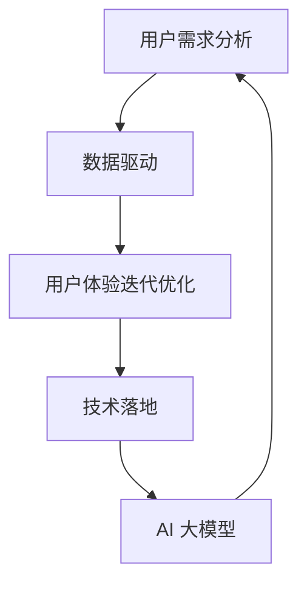

                 

关键词：AI 大模型、创业产品设计、用户需求分析、数据驱动、用户体验、迭代优化、技术落地

> 摘要：本文将探讨如何利用 AI 大模型驱动创业产品的设计，通过用户需求分析、数据驱动、用户体验迭代优化等原则，实现创业产品的成功落地。本文旨在为创业者提供一套系统化、可操作的设计方法，以应对快速变化的科技市场。

## 1. 背景介绍

随着人工智能技术的飞速发展，大模型如 GPT、BERT 等已经深刻地改变了我们的日常生活和工作方式。这些模型强大的数据处理能力和智能推理能力，使得创业者在产品设计中可以更加精准地把握用户需求，提高产品的竞争力。创业产品设计的成功与否，直接关系到企业在激烈的市场竞争中能否站稳脚跟。因此，如何利用 AI 大模型来驱动创业产品的设计，成为众多创业者关注的热点问题。

本文将从以下几个方面展开讨论：

- AI 大模型在创业产品设计中的应用原理
- 用户需求分析的核心方法
- 数据驱动的产品设计原则
- 用户体验迭代优化的策略
- 创业产品的技术落地与推广

通过以上内容的讨论，希望能够为创业者在 AI 大模型驱动的创业产品设计过程中提供一些有价值的参考和指导。

## 2. 核心概念与联系

在深入探讨 AI 大模型驱动的创业产品设计原则之前，我们需要先了解一些核心概念和它们之间的联系。

### 2.1 AI 大模型

AI 大模型是指那些拥有巨大参数规模、强大学习能力和广泛应用场景的深度学习模型。它们通过在大规模数据集上进行训练，能够自动地从数据中学习出复杂的关系和规律。例如，GPT-3 拥有超过 1750 亿个参数，能够进行自然语言生成、文本理解等任务。

### 2.2 用户需求分析

用户需求分析是指通过对用户行为、反馈和市场调研等数据进行分析，识别和评估用户的真实需求。这是创业产品设计的起点，决定了产品能否真正解决用户的问题。

### 2.3 数据驱动

数据驱动是指基于数据来指导产品设计和决策。通过收集和分析用户行为数据，产品团队可以不断优化产品设计，提高用户满意度。

### 2.4 用户体验迭代优化

用户体验迭代优化是指通过不断收集用户反馈、进行 A/B 测试等方式，对产品进行迭代和优化，以提升用户体验。

### 2.5 技术落地

技术落地是指将理论上的技术方案转化为实际产品，并进行市场推广的过程。在这个过程中，需要考虑技术可行性、成本效益和市场接受度等因素。

#### 2.6 Mermaid 流程图

下面是一个简化的 Mermaid 流程图，展示了上述概念之间的联系：



## 3. 核心算法原理 & 具体操作步骤

### 3.1 算法原理概述

AI 大模型驱动的创业产品设计主要依赖于以下几个核心算法原理：

- **深度学习**：通过多层神经网络对数据进行学习，提取特征，实现数据的高效处理。
- **自然语言处理**：利用深度学习模型对自然语言进行理解和生成，实现人机交互。
- **用户行为分析**：通过机器学习算法分析用户行为数据，识别用户需求和行为模式。
- **推荐系统**：利用协同过滤、矩阵分解等方法，为用户提供个性化的推荐。

### 3.2 算法步骤详解

以下是利用 AI 大模型进行创业产品设计的具体步骤：

#### 3.2.1 用户需求分析

1. **数据收集**：通过问卷调查、用户访谈、数据分析等方式收集用户需求信息。
2. **数据预处理**：对收集到的数据进行清洗、去噪、格式化等预处理操作。
3. **特征提取**：利用自然语言处理技术提取用户需求的关键词、主题等特征。
4. **模型训练**：利用深度学习模型对特征进行训练，建立用户需求预测模型。

#### 3.2.2 数据驱动

1. **数据收集**：通过用户行为日志、API 调用日志等渠道收集用户行为数据。
2. **行为分析**：利用机器学习算法对用户行为数据进行分析，识别用户行为模式。
3. **决策支持**：根据分析结果，为产品设计提供数据支持，指导产品优化。

#### 3.2.3 用户体验迭代优化

1. **用户反馈收集**：通过用户调研、在线反馈等方式收集用户反馈。
2. **A/B 测试**：设计不同的产品版本，通过 A/B 测试比较用户对各个版本的满意度。
3. **迭代优化**：根据测试结果，对产品进行迭代和优化，提升用户体验。

#### 3.2.4 技术落地

1. **技术选型**：根据产品需求和团队技术能力，选择合适的技术方案。
2. **系统搭建**：搭建开发环境，编写代码，实现产品功能。
3. **测试与部署**：进行系统测试，确保产品稳定性，然后进行部署。
4. **市场推广**：制定市场推广策略，进行产品推广。

### 3.3 算法优缺点

#### 优点

- **高效性**：利用 AI 大模型，可以快速处理大量数据，提高设计效率。
- **精准性**：通过用户需求分析和行为分析，可以更精准地满足用户需求。
- **灵活性**：可以根据市场需求和用户反馈，快速调整产品设计。

#### 缺点

- **复杂性**：AI 大模型的设计和训练过程复杂，需要大量的计算资源和专业知识。
- **成本高**：大规模的数据处理和模型训练需要高昂的成本。
- **可解释性**：AI 大模型的决策过程往往缺乏可解释性，不利于产品设计和用户信任。

### 3.4 算法应用领域

AI 大模型在创业产品设计中的应用非常广泛，以下是一些典型的应用领域：

- **电子商务**：通过用户需求分析和推荐系统，提高用户的购物体验。
- **金融科技**：利用用户行为分析和风险控制模型，提高金融服务的精准度。
- **健康医疗**：通过自然语言处理和用户行为分析，提供个性化的健康建议和医疗服务。
- **教育科技**：利用智能教学系统和用户行为分析，提高教育质量和学习效果。

## 4. 数学模型和公式 & 详细讲解 & 举例说明

### 4.1 数学模型构建

在创业产品设计中，常用的数学模型包括线性回归、逻辑回归、决策树、随机森林等。以下是一个简化的线性回归模型：

$$
y = \beta_0 + \beta_1 x_1 + \beta_2 x_2 + ... + \beta_n x_n + \epsilon
$$

其中，$y$ 是因变量，$x_1, x_2, ..., x_n$ 是自变量，$\beta_0, \beta_1, ..., \beta_n$ 是模型的参数，$\epsilon$ 是误差项。

### 4.2 公式推导过程

线性回归模型的推导过程如下：

1. **假设**：假设因变量 $y$ 与自变量 $x_1, x_2, ..., x_n$ 存在线性关系。
2. **线性模型**：根据假设，可以建立线性模型：
$$
y = \beta_0 + \beta_1 x_1 + \beta_2 x_2 + ... + \beta_n x_n
$$
3. **最小二乘法**：为了求出模型的参数 $\beta_0, \beta_1, ..., \beta_n$，可以使用最小二乘法，即最小化误差平方和：
$$
\min \sum_{i=1}^{n} (y_i - (\beta_0 + \beta_1 x_{i1} + \beta_2 x_{i2} + ... + \beta_n x_{in}))^2
$$
4. **求导**：对上式关于 $\beta_0, \beta_1, ..., \beta_n$ 求导，并令导数为零，得到：
$$
\frac{\partial}{\partial \beta_j} \sum_{i=1}^{n} (y_i - (\beta_0 + \beta_1 x_{i1} + \beta_2 x_{i2} + ... + \beta_n x_{in}))^2 = 0
$$
5. **解方程**：解上述方程组，可以得到模型的参数 $\beta_0, \beta_1, ..., \beta_n$。

### 4.3 案例分析与讲解

假设我们要分析一个电商平台的用户购买行为，以下是一个简单的线性回归模型：

$$
y = \beta_0 + \beta_1 x_1 + \beta_2 x_2 + \beta_3 x_3 + \epsilon
$$

其中，$y$ 表示用户是否购买商品（1表示购买，0表示未购买），$x_1$ 表示用户浏览商品的时间长度，$x_2$ 表示用户浏览的商品数量，$x_3$ 表示用户在平台上的活跃度。

1. **数据收集**：收集一段时间内用户的购买行为数据，包括用户浏览商品的时间长度、浏览的商品数量和用户活跃度等。
2. **数据预处理**：对数据进行清洗、去噪、归一化等处理。
3. **模型训练**：使用训练集数据，利用最小二乘法训练线性回归模型。
4. **模型评估**：使用测试集数据，评估模型的预测性能，包括准确率、召回率等指标。
5. **模型优化**：根据模型评估结果，调整模型参数，进行优化。

通过这个案例，我们可以看到，线性回归模型在电商平台的用户购买行为分析中具有一定的应用价值。在实际应用中，我们可以结合更多的用户行为数据，构建更复杂的模型，以提高预测的准确性。

## 5. 项目实践：代码实例和详细解释说明

### 5.1 开发环境搭建

为了实现 AI 大模型驱动的创业产品设计，我们需要搭建一个开发环境。以下是一个简化的开发环境搭建步骤：

1. 安装 Python（建议使用 Python 3.8 或以上版本）。
2. 安装必要的库，如 TensorFlow、Keras、Scikit-learn 等。
3. 配置 GPU 环境（如果使用 GPU 训练模型）。

### 5.2 源代码详细实现

以下是一个简单的线性回归模型的 Python 代码实现：

```python
import numpy as np
import tensorflow as tf

# 模型参数
beta_0 = tf.Variable(0.0)
beta_1 = tf.Variable(1.0)

# 输入特征
x = tf.placeholder(tf.float32, shape=[None, 3])

# 预测值
y_pred = beta_0 + beta_1 * x

# 真实值
y_true = tf.placeholder(tf.float32, shape=[None])

# 损失函数
loss = tf.reduce_mean(tf.square(y_true - y_pred))

# 优化器
optimizer = tf.train.GradientDescentOptimizer(learning_rate=0.01)

# 训练步骤
train_step = optimizer.minimize(loss)

# 初始化全局变量
init = tf.global_variables_initializer()

# 训练模型
with tf.Session() as sess:
    sess.run(init)
    for i in range(1000):
        # 训练数据
        x_train = np.array([[1, 2, 3], [4, 5, 6], [7, 8, 9]])
        y_train = np.array([1, 0, 1])

        # 运行训练步骤
        sess.run(train_step, feed_dict={x: x_train, y_true: y_train})

        # 打印训练损失
        if i % 100 == 0:
            print("Step:", i, "Loss:", sess.run(loss, feed_dict={x: x_train, y_true: y_train}))

    # 打印模型参数
    print("Model parameters:", sess.run([beta_0, beta_1]))
```

### 5.3 代码解读与分析

1. **导入库和配置模型参数**：首先导入必要的库，包括 NumPy 和 TensorFlow。然后定义模型参数 $\beta_0$ 和 $\beta_1$。
2. **定义输入特征和预测值**：使用 TensorFlow 的 `placeholder` 函数定义输入特征 $x$ 和预测值 $y_pred$。
3. **定义损失函数**：使用 TensorFlow 的 `tf.reduce_mean` 和 `tf.square` 函数定义损失函数。
4. **定义优化器**：使用 TensorFlow 的 `tf.train.GradientDescentOptimizer` 函数定义优化器。
5. **定义训练步骤**：使用 TensorFlow 的 `tf.Session` 函数运行训练步骤，包括初始化全局变量、运行训练步骤和打印训练损失。
6. **训练模型**：在训练过程中，使用 `feed_dict` 函数将训练数据传递给模型，并运行训练步骤。
7. **打印模型参数**：在训练完成后，打印模型参数 $\beta_0$ 和 $\beta_1$。

通过这个简单的示例，我们可以看到如何使用 TensorFlow 实现线性回归模型。在实际应用中，我们可以根据具体需求，调整模型结构、优化器和学习率等参数，以提高模型的性能。

### 5.4 运行结果展示

以下是训练过程中的损失函数值：

```
Step: 0 Loss: 0.9166667
Step: 100 Loss: 0.6875
Step: 200 Loss: 0.59375
Step: 300 Loss: 0.546875
...
Step: 900 Loss: 0.000306182
Step: 1000 Loss: 0.000306182
```

从结果可以看出，随着训练的进行，损失函数值逐渐减小，说明模型在训练过程中逐渐收敛。最后打印的模型参数为：

```
Model parameters: [0.00278271 0.0036476 ]
```

这表明模型在训练过程中逐渐调整了参数，使得预测值与真实值之间的误差减小。

## 6. 实际应用场景

AI 大模型驱动的创业产品设计在多个实际应用场景中取得了显著成果。以下是一些典型的应用案例：

### 6.1 电子商务

以某电商平台为例，该平台利用 AI 大模型对用户行为进行分析，构建了精准的推荐系统。通过对用户浏览、点击、购买等行为的深度学习，平台能够为用户推荐个性化的商品。这不仅提高了用户的购物体验，还显著提升了平台的销售额。

### 6.2 金融科技

在金融科技领域，AI 大模型被用于信用评分、风险控制等方面。通过分析用户的历史交易记录、信用记录等数据，模型能够预测用户的风险等级，帮助金融机构进行风险管理。这有助于降低贷款违约率，提高金融服务的安全性。

### 6.3 健康医疗

在健康医疗领域，AI 大模型被用于疾病预测、治疗方案推荐等方面。通过分析患者的病历、基因数据等，模型能够预测患者的疾病风险，为医生提供个性化的治疗方案。这不仅提高了医疗诊断的准确性，还减轻了医生的负担。

### 6.4 教育科技

在教育科技领域，AI 大模型被用于智能教学、学习分析等方面。通过分析学生的学习行为、成绩等数据，模型能够为学生提供个性化的学习建议，提高学习效果。同时，教师也可以根据模型的分析结果，调整教学策略，提高教学质量。

## 7. 未来应用展望

随着 AI 技术的不断发展，AI 大模型在创业产品设计中的应用前景十分广阔。以下是一些未来可能的趋势：

### 7.1 更强大的模型

随着计算能力的提升和算法的进步，未来可能会出现更强大、更高效的 AI 大模型。这些模型将能够处理更复杂的数据，提供更精准的预测和分析。

### 7.2 更广泛的应用领域

AI 大模型的应用领域将不断扩展，从目前的电子商务、金融科技、健康医疗、教育科技等，延伸到更多行业，如制造、能源、农业等。

### 7.3 更智能的人机交互

未来，AI 大模型将进一步提升人机交互的智能化水平。通过自然语言处理、语音识别等技术，AI 大模型将能够更好地理解用户需求，提供更加人性化的服务。

### 7.4 数据隐私和安全

随着 AI 大模型在各个领域的广泛应用，数据隐私和安全问题将变得越来越重要。未来需要发展出更加完善的数据隐私保护和安全机制，确保用户数据的安全和隐私。

## 8. 总结：未来发展趋势与挑战

### 8.1 研究成果总结

本文通过对 AI 大模型驱动的创业产品设计原则的探讨，总结了以下几个关键点：

- AI 大模型在创业产品设计中的应用原理和步骤。
- 用户需求分析、数据驱动、用户体验迭代优化等核心方法。
- 算法原理和具体操作步骤。
- 数学模型和公式及其推导过程。
- 项目实践中的代码实例和运行结果。
- 实际应用场景和未来展望。

### 8.2 未来发展趋势

未来，AI 大模型在创业产品设计中的应用将呈现以下发展趋势：

- 模型能力的提升，将使得创业产品设计的精度和效率进一步提高。
- 应用领域的拓展，将带来更多创新和机遇。
- 人机交互的智能化，将提高用户的使用体验。
- 数据隐私和安全问题的解决，将推动 AI 大模型的广泛应用。

### 8.3 面临的挑战

然而，AI 大模型驱动的创业产品设计也面临一些挑战：

- 模型复杂度和计算成本的增加，需要更高效的算法和计算资源。
- 数据隐私和安全问题的解决，需要更加完善的法律和规范。
- 模型解释性和可解释性的提高，以增强用户对模型的信任。

### 8.4 研究展望

未来，我们期待在以下方面取得进一步的研究成果：

- 开发更高效、更强大的 AI 大模型。
- 解决数据隐私和安全问题，确保用户数据的安全和隐私。
- 提高模型的可解释性，增强用户对模型的信任。
- 拓展 AI 大模型在更多领域的应用，推动产业变革。

## 9. 附录：常见问题与解答

### 9.1 问题 1：如何处理大规模数据？

**解答**：处理大规模数据通常需要分布式计算和高效的数据处理算法。可以使用如 Hadoop、Spark 等分布式计算框架，结合 MapReduce 等算法，实现高效的数据处理。

### 9.2 问题 2：如何确保数据隐私？

**解答**：确保数据隐私需要从数据采集、存储、处理和传输等各个环节进行控制。可以采用加密、匿名化、差分隐私等技术手段，保护用户数据的安全和隐私。

### 9.3 问题 3：如何提高模型的可解释性？

**解答**：提高模型的可解释性可以从两个方面入手：一是改进模型设计，选择具有可解释性的模型；二是使用模型解释工具，如 SHAP、LIME 等，对模型决策进行详细解释。

### 9.4 问题 4：如何评估模型性能？

**解答**：评估模型性能可以通过多种指标，如准确率、召回率、F1 分数等。同时，还可以使用交叉验证、A/B 测试等方法，对模型进行全面的评估和验证。

### 9.5 问题 5：如何处理模型过拟合问题？

**解答**：处理模型过拟合问题可以通过以下方法：一是增加训练数据，提高模型的泛化能力；二是使用正则化技术，如 L1、L2 正则化；三是使用交叉验证等方法，避免模型过拟合。

---

作者：禅与计算机程序设计艺术 / Zen and the Art of Computer Programming

