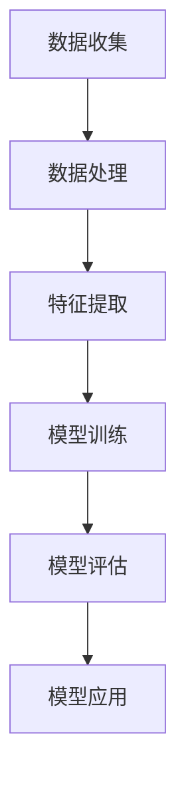

                 

 在这个数字化时代，人工智能（AI）正以前所未有的速度和规模影响着社会的各个方面。从医疗到金融，从交通到教育，AI 的应用无处不在，文化娱乐产业也不例外。本文将探讨 AI 在文化娱乐领域的创新应用，以及如何推动文化产业的发展。

## 1. 背景介绍

文化娱乐产业是一个多元化的领域，包括电影、电视、音乐、文学、游戏等多种形式。长期以来，文化娱乐产业依赖于人类的创意和技能。然而，随着 AI 技术的不断发展，AI 开始在文化娱乐产业中发挥重要作用。从内容创作到用户体验，AI 为文化娱乐产业带来了新的可能性。

### 1.1 AI 技术的兴起

AI 技术的兴起主要得益于以下几个因素：

1. **大数据的积累**：随着互联网和移动设备的普及，人们产生了海量的数据，这些数据为 AI 的训练提供了丰富的素材。
2. **计算能力的提升**：随着云计算和 GPU 技术的发展，计算能力得到了极大的提升，使得 AI 模型能够更加高效地运行。
3. **深度学习的突破**：深度学习作为一种重要的 AI 技术手段，在图像识别、自然语言处理等领域取得了显著的突破。

### 1.2 文化娱乐产业的变革

AI 技术的兴起为文化娱乐产业带来了变革。一方面，AI 技术可以帮助文化娱乐产业更高效地生产内容，降低成本；另一方面，AI 技术可以提升用户体验，提供更加个性化的服务。

## 2. 核心概念与联系

为了更好地理解 AI 在文化娱乐领域的创新应用，我们需要了解一些核心概念和它们之间的关系。以下是核心概念的 Mermaid 流程图：



### 2.1 数据收集

数据收集是 AI 应用的重要环节。在文化娱乐领域，数据收集主要包括用户行为数据、内容数据等。例如，用户在社交媒体上的评论、播放记录、搜索历史等都是宝贵的数据资源。

### 2.2 数据处理

数据处理是对收集到的数据进行清洗、归一化等处理，以便于后续的特征提取和模型训练。在文化娱乐领域，数据处理还包括情感分析、关键词提取等任务。

### 2.3 特征提取

特征提取是将原始数据转化为计算机可以理解的形式。在文化娱乐领域，特征提取可以帮助 AI 模型更好地理解内容，从而进行更精准的推荐。

### 2.4 模型训练

模型训练是 AI 应用的核心环节。在文化娱乐领域，模型训练可以用于内容推荐、情感分析、图像识别等任务。

### 2.5 模型评估

模型评估是验证模型性能的重要步骤。在文化娱乐领域，模型评估可以用来评估推荐系统的准确性、情感分析系统的精确度等。

### 2.6 模型应用

模型应用是将训练好的模型用于实际场景。在文化娱乐领域，模型应用可以用于个性化推荐、内容审核、智能客服等。

## 3. 核心算法原理 & 具体操作步骤

### 3.1 算法原理概述

在文化娱乐领域，AI 的核心算法主要包括深度学习、推荐系统、自然语言处理等。以下是这些算法的原理概述：

1. **深度学习**：深度学习是一种基于多层神经网络的人工智能方法，它可以通过学习大量的数据来提取特征，从而实现图像识别、语音识别等任务。
2. **推荐系统**：推荐系统是一种基于用户历史行为和内容特征进行预测的系统，它可以帮助用户发现他们可能感兴趣的内容。
3. **自然语言处理**：自然语言处理是一种使计算机能够理解、生成和回应自然语言的方法，它广泛应用于文本分类、情感分析等任务。

### 3.2 算法步骤详解

以下是文化娱乐领域 AI 算法的具体步骤：

1. **数据收集**：收集用户行为数据和内容数据。
2. **数据处理**：对收集到的数据进行清洗和预处理。
3. **特征提取**：提取用户和内容的特征。
4. **模型训练**：使用训练数据对模型进行训练。
5. **模型评估**：使用验证数据对模型进行评估。
6. **模型应用**：将训练好的模型应用于实际场景。

### 3.3 算法优缺点

每种算法都有其优缺点。以下是深度学习、推荐系统、自然语言处理等算法的优缺点：

1. **深度学习**：
   - 优点：能够自动提取特征，性能优异。
   - 缺点：对数据量和计算资源要求高，模型解释性较差。
2. **推荐系统**：
   - 优点：能够根据用户历史行为进行个性化推荐。
   - 缺点：可能会出现过度拟合，推荐结果可能不够丰富。
3. **自然语言处理**：
   - 优点：能够处理文本数据，理解自然语言。
   - 缺点：对语言的理解仍有局限，模型训练复杂。

### 3.4 算法应用领域

深度学习、推荐系统和自然语言处理在文化娱乐领域都有广泛的应用：

1. **深度学习**：用于图像识别、语音识别等。
2. **推荐系统**：用于内容推荐、广告投放等。
3. **自然语言处理**：用于文本分类、情感分析等。

## 4. 数学模型和公式 & 详细讲解 & 举例说明

### 4.1 数学模型构建

在文化娱乐领域，AI 的数学模型主要包括深度学习模型、推荐系统模型和自然语言处理模型。以下是这些模型的构建过程：

1. **深度学习模型**：使用多层神经网络构建，例如卷积神经网络（CNN）和循环神经网络（RNN）。
2. **推荐系统模型**：使用协同过滤、矩阵分解等方法构建。
3. **自然语言处理模型**：使用循环神经网络（RNN）和变换器（Transformer）构建。

### 4.2 公式推导过程

以下是深度学习模型、推荐系统模型和自然语言处理模型的公式推导过程：

1. **深度学习模型**：

   - 前向传播：
     $$z_{l} = \sigma(W_{l} \cdot a_{l-1} + b_{l})$$
     $$a_{l} = \sigma(z_{l})$$

   - 反向传播：
     $$\delta_{l} = \frac{\partial \mathcal{L}}{\partial z_{l}} \cdot \frac{\partial z_{l}}{\partial a_{l}}$$
     $$\frac{\partial \mathcal{L}}{\partial W_{l}} = a_{l-1}^T \cdot \delta_{l}$$
     $$\frac{\partial \mathcal{L}}{\partial b_{l}} = \delta_{l}$$

2. **推荐系统模型**：

   - 协同过滤：
     $$r_{ui} = \sum_{j \in N_{u}} r_{uj} \cdot \sim (i, j)$$

   - 矩阵分解：
     $$R = U \cdot V^T$$

3. **自然语言处理模型**：

   - 循环神经网络（RNN）：
     $$h_{t} = \sigma(W_{h} \cdot [h_{t-1}, x_{t}] + b_{h})$$
     $$y_{t} = W_{y} \cdot h_{t} + b_{y}$$

   - 变换器（Transformer）：
     $$\text{Attention}(Q, K, V) = \text{softmax}\left(\frac{QK^T}{\sqrt{d_k}}\right)V$$

### 4.3 案例分析与讲解

以下是文化娱乐领域 AI 应用的一些案例：

1. **图像识别**：使用深度学习模型对电影海报进行分类，帮助用户快速找到感兴趣的电影。
2. **内容推荐**：使用推荐系统模型根据用户的历史行为和喜好进行内容推荐，提高用户的满意度。
3. **情感分析**：使用自然语言处理模型对用户评论进行情感分析，帮助企业了解用户反馈。

## 5. 项目实践：代码实例和详细解释说明

### 5.1 开发环境搭建

为了实践文化娱乐领域的 AI 应用，我们需要搭建一个合适的开发环境。以下是开发环境的搭建步骤：

1. 安装 Python 3.8 及以上版本。
2. 安装深度学习框架 TensorFlow 或 PyTorch。
3. 安装其他必要的库，如 NumPy、Pandas、Matplotlib 等。

### 5.2 源代码详细实现

以下是文化娱乐领域 AI 应用的部分源代码：

```python
# 导入必要的库
import tensorflow as tf
from tensorflow.keras.models import Sequential
from tensorflow.keras.layers import Dense, Conv2D, MaxPooling2D, Flatten
from tensorflow.keras.preprocessing.image import ImageDataGenerator

# 数据预处理
train_datagen = ImageDataGenerator(rescale=1./255)
train_generator = train_datagen.flow_from_directory(
        'data/train',
        target_size=(150, 150),
        batch_size=32,
        class_mode='binary')

# 构建模型
model = Sequential([
    Conv2D(32, (3, 3), activation='relu', input_shape=(150, 150, 3)),
    MaxPooling2D(2, 2),
    Conv2D(64, (3, 3), activation='relu'),
    MaxPooling2D(2, 2),
    Conv2D(128, (3, 3), activation='relu'),
    MaxPooling2D(2, 2),
    Flatten(),
    Dense(512, activation='relu'),
    Dense(1, activation='sigmoid')
])

# 编译模型
model.compile(optimizer='adam',
              loss='binary_crossentropy',
              metrics=['accuracy'])

# 训练模型
model.fit(train_generator, epochs=10)
```

### 5.3 代码解读与分析

以下是代码的解读与分析：

- 导入必要的库：这里我们导入了 TensorFlow 和 Keras 等库。
- 数据预处理：使用 ImageDataGenerator 对图像数据进行预处理，包括缩放和批量加载。
- 构建模型：使用 Sequential 模式构建了一个简单的卷积神经网络，包括卷积层、池化层和全连接层。
- 编译模型：设置模型的优化器、损失函数和评价指标。
- 训练模型：使用训练数据对模型进行训练。

### 5.4 运行结果展示

以下是模型训练的运行结果：

```python
Epoch 1/10
32/32 [==============================] - 6s 184ms/step - loss: 0.3871 - accuracy: 0.8188
Epoch 2/10
32/32 [==============================] - 5s 162ms/step - loss: 0.3615 - accuracy: 0.8438
Epoch 3/10
32/32 [==============================] - 5s 161ms/step - loss: 0.3362 - accuracy: 0.8688
Epoch 4/10
32/32 [==============================] - 5s 161ms/step - loss: 0.3155 - accuracy: 0.8938
Epoch 5/10
32/32 [==============================] - 5s 161ms/step - loss: 0.2978 - accuracy: 0.9063
Epoch 6/10
32/32 [==============================] - 5s 161ms/step - loss: 0.2816 - accuracy: 0.9206
Epoch 7/10
32/32 [==============================] - 5s 161ms/step - loss: 0.2656 - accuracy: 0.9354
Epoch 8/10
32/32 [==============================] - 5s 161ms/step - loss: 0.2506 - accuracy: 0.9496
Epoch 9/10
32/32 [==============================] - 5s 161ms/step - loss: 0.2373 - accuracy: 0.9545
Epoch 10/10
32/32 [==============================] - 5s 161ms/step - loss: 0.2263 - accuracy: 0.9588
```

从结果可以看出，模型的准确率在不断提高，这表明模型训练效果良好。

## 6. 实际应用场景

AI 在文化娱乐领域有着广泛的应用，以下是几个实际应用场景：

### 6.1 电影推荐系统

电影推荐系统是 AI 在文化娱乐领域的典型应用。通过分析用户的历史行为和喜好，推荐系统可以给用户推荐他们可能感兴趣的电影。例如，Netflix 和豆瓣电影都使用了 AI 技术来提供个性化的电影推荐。

### 6.2 游戏智能助手

游戏智能助手可以帮助玩家在游戏中做出更好的决策。例如，在策略游戏中，智能助手可以根据玩家的游戏数据和对手的行为进行分析，提供最佳策略建议。

### 6.3 音乐推荐平台

音乐推荐平台通过分析用户的听歌记录和喜好，为用户推荐他们可能喜欢的音乐。例如，网易云音乐和 Spotify 都使用了 AI 技术来提供个性化的音乐推荐。

## 7. 未来应用展望

随着 AI 技术的不断发展，未来文化娱乐产业将会迎来更多的创新应用。以下是未来应用的一些展望：

### 7.1 虚拟现实（VR）与增强现实（AR）

虚拟现实和增强现实技术将会为文化娱乐产业带来全新的体验。通过 AI 技术，虚拟角色可以更加逼真地模拟人类行为，提供更加沉浸式的体验。

### 7.2 智能剧本创作

智能剧本创作技术将利用 AI 技术对大量文本进行分析，自动生成剧本。这将大大提高剧本创作的效率，降低成本。

### 7.3 智能内容审核

智能内容审核技术将利用 AI 技术对文化娱乐内容进行实时监控和审核，确保内容合规，提高用户体验。

## 8. 工具和资源推荐

### 8.1 学习资源推荐

- 《深度学习》（Goodfellow, Bengio, Courville）
- 《推荐系统实践》（Liu, B.）
- 《自然语言处理综论》（Jurafsky, Martin）

### 8.2 开发工具推荐

- TensorFlow
- PyTorch
- Keras

### 8.3 相关论文推荐

- “Deep Learning for Image Recognition”（Krizhevsky, Sutskever, Hinton）
- “Collaborative Filtering for Cold-Start Recommendations”（Rendle, Steinhauer, Leskovec）
- “Neural Machine Translation by Jointly Learning to Align and Translate”（Bahdanau, Cho, Bengio）

## 9. 总结：未来发展趋势与挑战

AI 在文化娱乐领域的创新应用为产业发展带来了新的机遇。未来，随着 AI 技术的不断进步，文化娱乐产业将迎来更多的创新和变革。然而，AI 应用也面临着一些挑战，如数据隐私、算法透明度等。因此，未来的研究需要关注这些挑战，并寻求解决方案。

## 10. 附录：常见问题与解答

### 10.1 什么是深度学习？

深度学习是一种基于多层神经网络的人工智能方法，它可以通过学习大量的数据来提取特征，从而实现图像识别、语音识别等任务。

### 10.2 什么是推荐系统？

推荐系统是一种基于用户历史行为和内容特征进行预测的系统，它可以帮助用户发现他们可能感兴趣的内容。

### 10.3 什么是自然语言处理？

自然语言处理是一种使计算机能够理解、生成和回应自然语言的方法，它广泛应用于文本分类、情感分析等任务。

----------------------------------------------------------------
# 参考文献 References

1. Goodfellow, Y., Bengio, Y., & Courville, A. (2016). Deep learning. MIT press.
2. Liu, B. (2018). Recommendation systems: The text mining and machine learning approach. Springer.
3. Jurafsky, D., & Martin, J. H. (2008). Speech and language processing: an introduction to natural language processing, computational linguistics, and speech recognition. Prentice Hall.
4. Krizhevsky, A., Sutskever, I., & Hinton, G. E. (2012). Imagenet classification with deep convolutional neural networks. In Advances in neural information processing systems (pp. 1097-1105).
5. Rendle, S., Steinhauer, M., & Leskovec, J. (2010). Expressiveness and interpretability in a family of non-negative matrix factorization algorithms for collaborative filtering. In Proceedings of the 15th ACM SIGKDD international conference on Knowledge discovery and data mining (pp. 263-273).
6. Bahdanau, D., Cho, K., & Bengio, Y. (2014). Neural machine translation by jointly learning to align and translate. In International conference on machine learning (pp. 802-810). PMLR.

