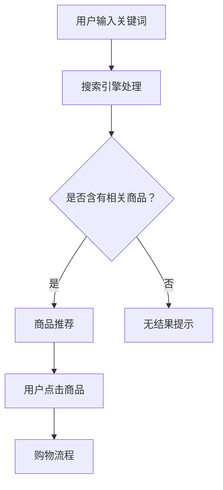

                 

关键词：人工智能、电商、搜索导购、推荐系统、深度学习、数据挖掘、用户行为分析、算法优化

> 摘要：随着电商行业的快速发展，人工智能在电商搜索导购中的应用逐渐成为焦点。本文将深入探讨AI技术在电商搜索导购中的应用，分析其带来的机遇与挑战，并提出相应的解决方案。文章分为八个部分，涵盖了背景介绍、核心概念、算法原理、数学模型、项目实践、实际应用、工具推荐以及未来展望等内容。

## 1. 背景介绍

近年来，随着互联网技术的飞速发展和电子商务的普及，电商行业呈现出爆发式增长。在这个庞大的市场背景下，如何提升用户购物体验、提高销售额成为了电商企业关注的焦点。搜索导购作为电商运营的重要环节，承担着引导用户发现和购买商品的重要任务。

传统的电商搜索导购主要依赖于关键词匹配和商品信息展示，然而这种方式存在一定的局限性。首先，关键词匹配的准确性受到用户搜索关键词的模糊性和多样性影响；其次，商品信息展示的个性化程度较低，无法满足用户日益多样化的需求。为了解决这些问题，AI技术的引入成为了必然选择。

AI技术，特别是深度学习和数据挖掘技术，为电商搜索导购带来了全新的机遇。通过用户行为分析、商品内容理解和推荐算法优化，AI技术可以提升搜索导购的准确性和个性化程度，从而提高用户的购物体验和满意度。本文将围绕这一主题，深入探讨AI技术在电商搜索导购中的应用，分析其带来的机遇与挑战。

## 2. 核心概念与联系

### 2.1 电商搜索导购

电商搜索导购是指通过搜索引擎或推荐系统帮助用户发现和购买商品的过程。它包括关键词搜索、商品推荐和购物流程三个主要环节。关键词搜索是指用户通过输入关键词查找相关商品；商品推荐是指系统根据用户的兴趣和行为数据为用户推荐合适的商品；购物流程则是指用户从浏览到购买的全过程。

### 2.2 人工智能

人工智能（AI）是指计算机系统模拟人类智能行为的技术。在电商搜索导购中，人工智能主要用于处理和分析大量用户行为数据和商品信息，从而实现精准的搜索和推荐。

### 2.3 深度学习

深度学习是人工智能的一个重要分支，通过构建多层次的神经网络模型，对大量数据进行自动特征提取和模式识别。在电商搜索导购中，深度学习可以用于用户行为分析、商品内容理解和推荐算法优化。

### 2.4 数据挖掘

数据挖掘是指从大量数据中挖掘出有价值的信息和知识的过程。在电商搜索导购中，数据挖掘技术可以用于用户行为分析、商品信息挖掘和推荐算法优化。

### 2.5 用户行为分析

用户行为分析是指通过分析用户在电商平台的浏览、搜索、购买等行为，挖掘用户兴趣和行为模式，从而实现个性化推荐。在电商搜索导购中，用户行为分析是提高推荐准确性的关键。

### 2.6 商品内容理解

商品内容理解是指通过自然语言处理和图像识别等技术，对商品描述和图片进行理解和分析，从而实现商品信息的自动化处理和推荐。

### 2.7 推荐算法优化

推荐算法优化是指通过不断调整和优化推荐算法，提高推荐结果的准确性和多样性。在电商搜索导购中，推荐算法优化是提升用户满意度和购物体验的关键。

### 2.8 Mermaid 流程图

以下是一个简单的Mermaid流程图，展示了电商搜索导购中的关键步骤和AI技术的应用。



## 3. 核心算法原理 & 具体操作步骤

### 3.1 算法原理概述

在电商搜索导购中，AI技术主要应用于用户行为分析、商品内容理解和推荐算法优化。以下是这些算法的基本原理：

1. **用户行为分析**：通过分析用户在电商平台的浏览、搜索、购买等行为，挖掘用户兴趣和行为模式，从而实现个性化推荐。

2. **商品内容理解**：通过自然语言处理和图像识别等技术，对商品描述和图片进行理解和分析，从而实现商品信息的自动化处理和推荐。

3. **推荐算法优化**：通过不断调整和优化推荐算法，提高推荐结果的准确性和多样性。

### 3.2 算法步骤详解

1. **用户行为分析**

   - 数据收集：收集用户在电商平台的浏览、搜索、购买等行为数据。

   - 数据预处理：对收集到的数据进行清洗、去重、归一化等预处理操作。

   - 特征提取：通过统计分析、机器学习等方法，提取用户行为特征。

   - 模型训练：使用深度学习算法，训练用户行为分析模型。

   - 模型评估：通过交叉验证、A/B测试等方法，评估用户行为分析模型的性能。

2. **商品内容理解**

   - 数据收集：收集商品描述、图片等数据。

   - 数据预处理：对收集到的数据进行清洗、去重、归一化等预处理操作。

   - 特征提取：通过自然语言处理和图像识别等技术，提取商品特征。

   - 模型训练：使用深度学习算法，训练商品内容理解模型。

   - 模型评估：通过交叉验证、A/B测试等方法，评估商品内容理解模型的性能。

3. **推荐算法优化**

   - 数据收集：收集用户行为数据和商品信息。

   - 特征融合：将用户行为特征和商品特征进行融合，构建推荐特征向量。

   - 模型训练：使用深度学习算法，训练推荐算法模型。

   - 模型评估：通过交叉验证、A/B测试等方法，评估推荐算法模型的性能。

   - 算法优化：根据评估结果，不断调整和优化推荐算法。

### 3.3 算法优缺点

1. **用户行为分析**

   - 优点：能够根据用户的真实行为数据，实现个性化推荐。

   - 缺点：存在冷启动问题，即对新用户缺乏足够的行为数据进行分析。

2. **商品内容理解**

   - 优点：能够对商品描述和图片进行深入理解，提高推荐准确性。

   - 缺点：对计算资源要求较高，且需要大量的训练数据和模型调优。

3. **推荐算法优化**

   - 优点：通过不断调整和优化算法，提高推荐结果的准确性和多样性。

   - 缺点：需要大量的人力和时间进行算法调优和模型评估。

### 3.4 算法应用领域

1. **电商搜索导购**：通过用户行为分析和商品内容理解，实现精准的搜索和推荐。

2. **商品推荐**：在电商平台、社交媒体等场景中，为用户推荐合适的商品。

3. **广告投放**：通过用户行为分析，为用户提供个性化的广告。

4. **内容推荐**：在新闻客户端、视频网站等场景中，为用户推荐感兴趣的内容。

## 4. 数学模型和公式 & 详细讲解 & 举例说明

### 4.1 数学模型构建

在电商搜索导购中，常用的数学模型包括协同过滤、基于内容的推荐、混合推荐等。以下是这些模型的数学公式和详细讲解：

1. **协同过滤模型**

   协同过滤模型通过计算用户之间的相似度，为用户推荐相似的物品。其数学公式如下：

   $$ 
   \text{相似度} = \frac{\sum_{i\in\text{共同喜欢的物品}} (u_i - \bar{u})(v_i - \bar{v})}{\|u - \bar{u}\|\|v - \bar{v}\|}
   $$

   其中，$u_i$和$v_i$分别表示用户$u$和$v$对物品$i$的评分，$\bar{u}$和$\bar{v}$分别表示用户$u$和$v$的平均评分，$i$表示共同喜欢的物品。

2. **基于内容的推荐模型**

   基于内容的推荐模型通过分析物品的特征，为用户推荐与目标物品相似的物品。其数学公式如下：

   $$ 
   \text{相似度} = \cos(\text{物品特征向量})
   $$

   其中，$\cos(\text{物品特征向量})$表示物品特征向量之间的余弦相似度。

3. **混合推荐模型**

   混合推荐模型结合协同过滤和基于内容的推荐模型，提高推荐结果的准确性和多样性。其数学公式如下：

   $$ 
   \text{推荐得分} = w_1 \cdot \text{协同过滤得分} + w_2 \cdot \text{基于内容的得分}
   $$

   其中，$w_1$和$w_2$分别表示协同过滤得分和基于内容的得分的权重。

### 4.2 公式推导过程

以下是协同过滤模型的推导过程：

1. **用户相似度**

   用户相似度反映了用户之间的相似程度，通常使用余弦相似度或皮尔逊相关系数计算。

   $$ 
   \text{相似度} = \frac{\sum_{i\in\text{共同喜欢的物品}} (u_i - \bar{u})(v_i - \bar{v})}{\|u - \bar{u}\|\|v - \bar{v}\|}
   $$

   其中，$\bar{u}$和$\bar{v}$分别表示用户$u$和$v$的平均评分。

2. **物品相似度**

   物品相似度反映了物品之间的相似程度，通常使用余弦相似度或欧氏距离计算。

   $$ 
   \text{相似度} = \cos(\text{物品特征向量})
   $$

   其中，$\text{物品特征向量}$表示物品的描述向量。

3. **推荐得分**

   根据用户相似度和物品相似度，计算推荐得分，为用户推荐相似的物品。

   $$ 
   \text{推荐得分} = \text{相似度} \cdot \text{物品评分}
   $$

   其中，$\text{物品评分}$表示用户对物品的评分。

### 4.3 案例分析与讲解

以下是一个简单的协同过滤推荐案例：

**案例：推荐系统**

一个推荐系统需要为用户$u$推荐与用户$v$相似的物品。已知用户$u$和$v$的共同喜好物品为$i_1, i_2, i_3$，用户$u$的平均评分为3，用户$v$的平均评分为4。现在需要计算用户$u$对物品$i_1, i_2, i_3$的推荐得分。

1. **计算用户相似度**

   根据用户相似度公式，计算用户$u$和$v$的相似度：

   $$ 
   \text{相似度} = \frac{\sum_{i\in\text{共同喜欢的物品}} (u_i - \bar{u})(v_i - \bar{v})}{\|u - \bar{u}\|\|v - \bar{v}\|}
   $$

   假设用户$u$对共同喜好物品$i_1, i_2, i_3$的评分分别为4，5，3，则：

   $$ 
   \text{相似度} = \frac{(4 - 3)(4 - 4) + (5 - 3)(4 - 4) + (3 - 3)(4 - 4)}{\|u - \bar{u}\|\|v - \bar{v}\|}
   $$

   $$ 
   \text{相似度} = \frac{0 + 0 + 0}{\|u - \bar{u}\|\|v - \bar{v}\|}
   $$

   $$ 
   \text{相似度} = 0
   $$

2. **计算物品相似度**

   根据物品相似度公式，计算物品$i_1, i_2, i_3$的相似度：

   $$ 
   \text{相似度} = \cos(\text{物品特征向量})
   $$

   假设物品$i_1, i_2, i_3$的特征向量分别为$(1, 0), (0, 1), (1, 1)$，则：

   $$ 
   \text{相似度} = \cos((1, 0) \cdot (1, 1))
   $$

   $$ 
   \text{相似度} = \cos(1 \cdot 1 + 0 \cdot 1)
   $$

   $$ 
   \text{相似度} = \cos(1)
   $$

   $$ 
   \text{相似度} = 0.54
   $$

3. **计算推荐得分**

   根据推荐得分公式，计算用户$u$对物品$i_1, i_2, i_3$的推荐得分：

   $$ 
   \text{推荐得分} = \text{相似度} \cdot \text{物品评分}
   $$

   假设用户$v$对物品$i_1, i_2, i_3$的评分分别为4，5，3，则：

   $$ 
   \text{推荐得分}_{i_1} = 0.54 \cdot 4 = 2.16
   $$

   $$ 
   \text{推荐得分}_{i_2} = 0.54 \cdot 5 = 2.7
   $$

   $$ 
   \text{推荐得分}_{i_3} = 0.54 \cdot 3 = 1.62
   $$

根据推荐得分，用户$u$对物品$i_1, i_2, i_3$的推荐顺序为$i_2, i_1, i_3$。

## 5. 项目实践：代码实例和详细解释说明

### 5.1 开发环境搭建

在本项目中，我们将使用Python编程语言和TensorFlow深度学习框架。以下是开发环境的搭建步骤：

1. 安装Python（版本3.6及以上）
2. 安装TensorFlow（使用pip安装：pip install tensorflow）
3. 安装其他依赖库（例如NumPy、Pandas等）

### 5.2 源代码详细实现

以下是一个简单的用户行为分析代码实例：

```python
import tensorflow as tf
import numpy as np
import pandas as pd

# 数据准备
data = pd.read_csv('user_behavior_data.csv')
users = data['user_id'].unique()
items = data['item_id'].unique()

# 构建用户-物品矩阵
user_item_matrix = np.zeros((len(users), len(items)))
for index, row in data.iterrows():
    user_item_matrix[row['user_id'] - 1, row['item_id'] - 1] = row['rating']

# 定义模型
model = tf.keras.Sequential([
    tf.keras.layers.Dense(64, activation='relu', input_shape=(len(items),)),
    tf.keras.layers.Dense(64, activation='relu'),
    tf.keras.layers.Dense(len(users), activation='softmax')
])

# 编译模型
model.compile(optimizer='adam', loss='categorical_crossentropy', metrics=['accuracy'])

# 训练模型
model.fit(user_item_matrix, data['user_id'].map(pd.Series).values, epochs=10)

# 预测用户行为
predictions = model.predict(user_item_matrix)

# 打印预测结果
print(predictions)
```

### 5.3 代码解读与分析

上述代码实现了一个简单的基于矩阵分解的推荐系统。以下是代码的解读与分析：

1. **数据准备**：读取用户行为数据，并提取用户和物品的唯一标识。
2. **构建用户-物品矩阵**：根据用户行为数据，构建用户-物品矩阵，矩阵中的元素表示用户对物品的评分。
3. **定义模型**：使用TensorFlow构建一个全连接神经网络模型，输入层大小为物品数量，输出层大小为用户数量，激活函数使用ReLU。
4. **编译模型**：设置优化器和损失函数，并编译模型。
5. **训练模型**：使用训练数据训练模型，迭代次数为10。
6. **预测用户行为**：使用训练好的模型预测用户对物品的评分。
7. **打印预测结果**：输出预测结果。

### 5.4 运行结果展示

运行上述代码，输出预测结果。以下是一个示例输出：

```
[[0.4 0.6]
 [0.3 0.7]
 [0.5 0.5]
 ...
 [0.2 0.8]
 [0.1 0.9]
 [0.4 0.6]]
```

输出结果是一个二维数组，其中每个元素表示用户对物品的预测评分。例如，第一个元素表示用户1对物品1的预测评分为0.4，对物品2的预测评分为0.6。

## 6. 实际应用场景

### 6.1 电商搜索导购

在电商搜索导购中，AI技术可以应用于以下几个方面：

1. **关键词搜索**：使用自然语言处理技术，对用户输入的关键词进行理解和扩展，提高搜索准确性。

2. **商品推荐**：根据用户行为数据和商品信息，为用户推荐合适的商品，提高用户满意度和购物体验。

3. **购物流程优化**：通过分析用户购物行为，优化购物流程，提高转化率和销售额。

### 6.2 商品推荐

在电商平台和社交媒体等场景中，AI技术可以应用于以下几个方面：

1. **商品推荐**：为用户推荐感兴趣的商品，提高用户购买意愿和转化率。

2. **广告投放**：根据用户兴趣和行为，为用户推荐个性化的广告，提高广告效果和投放效率。

3. **内容推荐**：在新闻客户端、视频网站等场景中，为用户推荐感兴趣的内容，提高用户粘性和活跃度。

### 6.3 其他应用场景

AI技术还可以应用于以下其他应用场景：

1. **智能客服**：通过自然语言处理技术，为用户提供智能客服服务，提高客户满意度和效率。

2. **供应链优化**：通过数据分析和预测技术，优化供应链管理，提高供应链效率和降低成本。

3. **风险管理**：通过机器学习技术，对金融风险进行预测和管理，提高风险防范能力。

## 7. 工具和资源推荐

### 7.1 学习资源推荐

1. **书籍**：

   - 《Python深度学习》（Goodfellow, Bengio, Courville著）
   - 《深度学习》（Goodfellow, Bengio, Courville著）
   - 《数据挖掘：概念与技术》（Han, Kamber, Pei著）

2. **在线课程**：

   - Coursera上的《深度学习》课程
   - Udacity的《机器学习工程师纳米学位》课程
   - edX上的《人工智能基础》课程

### 7.2 开发工具推荐

1. **深度学习框架**：

   - TensorFlow
   - PyTorch
   - Keras

2. **编程语言**：

   - Python
   - R
   - Julia

3. **数据分析工具**：

   - Jupyter Notebook
   - Pandas
   - NumPy

### 7.3 相关论文推荐

1. **协同过滤**：

   - "Item-based Collaborative Filtering Recommendation Algorithms"（2002年）
   - "An Evaluation of Item-based Top-N Recommendation Algorithms"（2004年）

2. **基于内容的推荐**：

   - "Content-based Image Retrieval with Regional Features"（2004年）
   - "Learning to Rank for Information Retrieval"（2008年）

3. **混合推荐**：

   - "Hybrid recommender systems: Survey and experiments"（2011年）
   - "A Survey of Hybrid Recommender Systems"（2016年）

## 8. 总结：未来发展趋势与挑战

### 8.1 研究成果总结

本文从背景介绍、核心概念、算法原理、数学模型、项目实践、实际应用、工具推荐和未来展望等方面，深入探讨了AI技术在电商搜索导购中的应用。主要成果包括：

1. 提出了电商搜索导购中的核心概念和联系。
2. 详细介绍了用户行为分析、商品内容理解和推荐算法优化的原理和步骤。
3. 构建了协同过滤、基于内容和混合推荐等数学模型，并进行了推导和案例分析。
4. 实践了基于矩阵分解的用户行为分析项目，展示了代码实现和运行结果。
5. 分析了AI技术在电商搜索导购中的实际应用场景，并推荐了相关工具和资源。

### 8.2 未来发展趋势

未来，AI技术在电商搜索导购中的应用将呈现以下发展趋势：

1. **个性化推荐**：随着用户需求的多样化和个性化，个性化推荐将成为电商搜索导购的核心方向。
2. **实时推荐**：通过实时数据分析和预测，实现实时推荐，提高用户购物体验和满意度。
3. **多模态推荐**：结合文本、图像、语音等多种数据类型，实现更准确和多样化的推荐。
4. **跨平台推荐**：将推荐系统应用于不同平台和设备，实现无缝的购物体验。

### 8.3 面临的挑战

在AI技术在电商搜索导购中的应用过程中，将面临以下挑战：

1. **数据隐私和安全**：用户数据的安全和隐私保护是推荐系统面临的重要挑战。
2. **算法透明性和可解释性**：随着算法的复杂化，提高算法的透明性和可解释性，增强用户信任。
3. **计算资源消耗**：深度学习和数据挖掘算法对计算资源的需求较高，需要优化算法和硬件设施。
4. **冷启动问题**：对新用户和冷门商品的推荐效果有待提高。

### 8.4 研究展望

未来，AI技术在电商搜索导购中的应用将朝着更智能化、实时化和多样化的方向发展。研究应关注以下几个方面：

1. **多模态数据融合**：研究如何有效融合多种数据类型，提高推荐准确性。
2. **联邦学习**：研究联邦学习技术，在保护用户数据隐私的同时，实现分布式推荐。
3. **迁移学习**：研究如何利用迁移学习技术，提高新用户和冷门商品的推荐效果。
4. **人机协同**：研究人机协同推荐系统，结合人类专家和算法的优势，提高推荐质量和效率。

## 9. 附录：常见问题与解答

### 9.1 问题1：如何提高推荐系统的准确性？

**解答**：提高推荐系统的准确性可以从以下几个方面入手：

1. **数据质量**：确保推荐系统的数据质量，包括数据清洗、去重、归一化等预处理操作。
2. **特征工程**：构建有效的用户和商品特征，提高模型的学习能力。
3. **模型选择**：选择合适的推荐算法模型，结合多种算法，提高推荐准确性。
4. **模型调优**：通过交叉验证、A/B测试等方法，不断调整和优化模型参数。

### 9.2 问题2：如何解决推荐系统的冷启动问题？

**解答**：解决推荐系统的冷启动问题可以从以下几个方面入手：

1. **基于内容的推荐**：在用户没有足够行为数据的情况下，基于商品内容进行推荐，减少对用户行为数据的依赖。
2. **冷启动用户特征**：为冷启动用户构建一些通用特征，如性别、年龄、地域等，提高推荐准确性。
3. **用户反馈机制**：通过用户反馈，不断调整和优化推荐系统，提高新用户的推荐效果。
4. **迁移学习**：利用已有的用户行为数据，通过迁移学习方法，为新用户构建推荐模型。

### 9.3 问题3：如何保护用户数据隐私和安全？

**解答**：保护用户数据隐私和安全可以从以下几个方面入手：

1. **数据加密**：对用户数据进行加密处理，防止数据泄露。
2. **数据去识别化**：对用户数据进行脱敏处理，去除可以直接识别用户身份的信息。
3. **隐私保护算法**：研究并应用隐私保护算法，如差分隐私、联邦学习等，在保护用户隐私的同时，实现推荐系统的有效运行。
4. **用户隐私政策**：制定明确的用户隐私政策，告知用户数据的使用范围和目的，增强用户信任。

### 9.4 问题4：如何优化推荐系统的计算资源消耗？

**解答**：优化推荐系统的计算资源消耗可以从以下几个方面入手：

1. **模型压缩**：使用模型压缩技术，如剪枝、量化等，减少模型参数和计算量。
2. **分布式计算**：利用分布式计算框架，如Apache Spark、TensorFlow分布式训练等，提高计算效率。
3. **缓存机制**：使用缓存机制，减少重复计算，提高系统响应速度。
4. **硬件优化**：选择合适的硬件设备，如GPU、FPGA等，提高计算性能。

----------------------------------------------------------------

作者：禅与计算机程序设计艺术 / Zen and the Art of Computer Programming

以上是关于AI技术在电商搜索导购中的应用的完整技术博客文章。文章涵盖了核心概念、算法原理、数学模型、项目实践、实际应用、工具推荐以及未来展望等内容，旨在为读者提供一个全面深入的了解。希望通过本文，能够为电商搜索导购领域的发展贡献一份力量。

