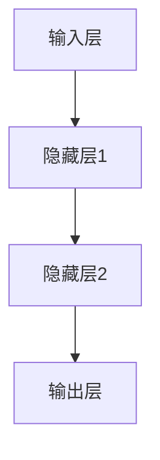

                 

关键词：人工智能、神经网络、深度学习、计算艺术、算法原理、数学模型、项目实践、应用场景、未来展望。

摘要：本文深入探讨了人工智能中的神经网络计算艺术，从背景介绍、核心概念与联系、核心算法原理与具体操作步骤、数学模型和公式、项目实践、实际应用场景、工具和资源推荐，以及总结未来发展趋势与挑战等多个方面，全面阐述了神经网络的计算艺术之道。文章旨在为读者提供一个全面、深入、易懂的神经网络计算艺术解析，帮助读者更好地理解和应用这一重要的计算技术。

## 1. 背景介绍

人工智能（AI）作为计算机科学的一个重要分支，近年来取得了飞速的发展。其中，神经网络作为实现人工智能的重要工具，引起了广泛的关注。神经网络起源于上世纪50年代，随着计算能力的提升和算法的优化，神经网络在图像识别、自然语言处理、游戏智能等多个领域取得了显著的成果。

神经网络是一种模拟人脑计算方式的计算模型，由大量的神经元通过复杂的网络结构连接而成。每个神经元都可以接受多个输入信号，通过加权求和处理后产生一个输出信号。神经网络通过不断调整网络中的权重，来实现对输入数据的分类、预测等任务。

在深度学习的推动下，神经网络模型逐渐走向复杂化，从简单的单层感知机，到多层感知机（MLP），再到深度神经网络（DNN）、卷积神经网络（CNN）和循环神经网络（RNN）等。这些复杂的神经网络模型在图像识别、语音识别、自然语言处理等领域展现了强大的计算能力。

本文将深入探讨神经网络的计算艺术之道，从核心概念与联系、算法原理与操作步骤、数学模型与公式、项目实践、应用场景、工具和资源推荐等多个方面，全面解析神经网络的工作原理和应用价值。

## 2. 核心概念与联系

### 2.1 神经元

神经元是神经网络的基本单元，它通过接受输入信号，产生输出信号来实现数据的处理和传递。一个简单的神经元可以表示为：

$$
y = f(\sum_{i=1}^{n} w_i x_i + b)
$$

其中，$x_i$ 表示第 $i$ 个输入信号，$w_i$ 表示输入信号的权重，$b$ 表示偏置，$f$ 表示激活函数，$y$ 表示输出信号。

### 2.2 神经网络

神经网络是由大量的神经元通过复杂的网络结构连接而成的计算模型。一个简单的神经网络可以表示为：

$$
\begin{align*}
y &= f(\sum_{i=1}^{n} w_i x_i + b) \\
  &= f(W \cdot X + b)
\end{align*}
$$

其中，$W$ 表示权重矩阵，$X$ 表示输入向量，$b$ 表示偏置向量。

### 2.3 激活函数

激活函数是神经网络中的一个关键组件，它用于决定神经元是否激活。常见的激活函数包括：

- **Sigmoid函数**：$f(x) = \frac{1}{1 + e^{-x}}$
- **ReLU函数**：$f(x) = \max(0, x)$
- **Tanh函数**：$f(x) = \frac{e^x - e^{-x}}{e^x + e^{-x}}$

激活函数的选择会影响到神经网络的性能和训练速度。

### 2.4 前向传播与反向传播

前向传播和反向传播是神经网络训练中的两个核心步骤。在前向传播过程中，输入数据通过神经网络传递，产生输出结果；在反向传播过程中，通过计算输出结果与实际结果的误差，不断调整网络中的权重和偏置，以实现模型优化。

### 2.5 梯度下降与优化算法

梯度下降是一种常用的优化算法，用于调整神经网络中的权重和偏置。梯度下降可以分为批量梯度下降、随机梯度下降和小批量梯度下降等不同类型。

$$
\begin{align*}
w_{t+1} &= w_t - \alpha \cdot \frac{\partial J(w_t)}{\partial w_t} \\
b_{t+1} &= b_t - \alpha \cdot \frac{\partial J(w_t)}{\partial b_t}
\end{align*}
$$

其中，$w_t$ 和 $b_t$ 分别表示当前时刻的权重和偏置，$\alpha$ 表示学习率，$J(w_t)$ 表示损失函数。

### 2.6 神经网络架构

神经网络可以分为多层，包括输入层、隐藏层和输出层。不同的神经网络架构会对网络的性能和计算复杂度产生重要影响。

### 2.7 Mermaid 流程图

为了更直观地展示神经网络的工作流程，我们使用 Mermaid 流程图来描述神经网络的基本架构。



## 3. 核心算法原理 & 具体操作步骤

### 3.1 算法原理概述

神经网络的核心算法主要包括前向传播、反向传播和权重更新。具体步骤如下：

1. **前向传播**：输入数据通过神经网络传递，产生输出结果。
2. **反向传播**：计算输出结果与实际结果的误差，反向传递误差，计算每个神经元的梯度。
3. **权重更新**：根据梯度更新网络中的权重和偏置，实现模型优化。

### 3.2 算法步骤详解

1. **初始化参数**：随机初始化网络的权重和偏置。
2. **前向传播**：
   - 将输入数据输入到输入层。
   - 逐层计算每个神经元的输出。
   - 输出层产生预测结果。
3. **计算损失函数**：计算预测结果与实际结果的误差，使用损失函数表示。
4. **反向传播**：
   - 计算输出层的误差。
   - 逐层反向传递误差，计算每个神经元的梯度。
5. **权重更新**：
   - 根据梯度更新网络中的权重和偏置。
   - 重复前向传播和反向传播，直到达到预定的训练次数或损失函数收敛。

### 3.3 算法优缺点

- **优点**：
  - 神经网络具有强大的拟合能力，可以处理复杂的非线性问题。
  - 可以通过增加网络层数和神经元数量来提升模型的性能。

- **缺点**：
  - 训练过程需要大量的时间和计算资源。
  - 容易出现过拟合现象。

### 3.4 算法应用领域

神经网络在图像识别、语音识别、自然语言处理、推荐系统、金融风控等多个领域取得了显著的应用成果。

## 4. 数学模型和公式 & 详细讲解 & 举例说明

### 4.1 数学模型构建

神经网络的数学模型主要包括输入层、隐藏层和输出层。每个层中的神经元都可以表示为一个线性函数，加上一个非线性激活函数。

$$
\begin{align*}
a_{ji} &= f(z_{ji}) \\
z_{ji} &= \sum_{k=1}^{n} w_{jk} a_{ki} + b_j
\end{align*}
$$

其中，$a_{ji}$ 表示第 $j$ 个神经元在第 $i$ 层的输出，$z_{ji}$ 表示第 $j$ 个神经元在第 $i$ 层的输入，$w_{jk}$ 表示第 $j$ 个神经元在第 $i$ 层与第 $k$ 个神经元在第 $i-1$ 层之间的权重，$b_j$ 表示第 $j$ 个神经元的偏置，$f$ 表示激活函数。

### 4.2 公式推导过程

假设我们有一个三层神经网络，包括输入层、隐藏层和输出层。输入层有 $n$ 个神经元，隐藏层有 $m$ 个神经元，输出层有 $k$ 个神经元。

1. **输入层到隐藏层**：

$$
\begin{align*}
z_{ji} &= \sum_{k=1}^{n} w_{jk} a_{ki} + b_j \\
a_{ji} &= f(z_{ji})
\end{align*}
$$

2. **隐藏层到输出层**：

$$
\begin{align*}
z_{ki} &= \sum_{j=1}^{m} w_{kj} a_{ji} + b_k \\
a_{ki} &= f(z_{ki})
\end{align*}
$$

3. **损失函数**：

$$
\begin{align*}
J &= \frac{1}{2} \sum_{k=1}^{k} (y_k - a_{ki})^2
\end{align*}
$$

其中，$y_k$ 表示第 $k$ 个神经元的实际输出，$a_{ki}$ 表示第 $k$ 个神经元的预测输出。

4. **梯度下降**：

$$
\begin{align*}
\frac{\partial J}{\partial w_{jk}} &= (y_k - a_{ki}) \cdot a_{ki} \cdot (1 - a_{ki}) \cdot a_{ji} \\
\frac{\partial J}{\partial b_j} &= (y_k - a_{ki}) \cdot a_{ki} \cdot (1 - a_{ki}) \cdot 1 \\
\frac{\partial J}{\partial w_{kj}} &= (y_k - a_{ki}) \cdot a_{ki} \cdot (1 - a_{ki}) \cdot a_{ji}
\end{align*}
$$

### 4.3 案例分析与讲解

假设我们有一个简单的二分类问题，输入层有 2 个神经元，隐藏层有 1 个神经元，输出层有 1 个神经元。输入数据为 $x_1 = [1, 0], x_2 = [0, 1]$，标签为 $y_1 = 1, y_2 = 0$。

1. **初始化参数**：

$$
\begin{align*}
w_{11} &= 0.5, w_{12} &= 0.5, w_{21} &= 0.5, b_1 &= 0.5 \\
w_{1} &= \begin{bmatrix}
0.5 & 0.5
\end{bmatrix}, b_1 &= 0.5
\end{align*}
$$

2. **前向传播**：

对于 $x_1 = [1, 0]$：

$$
\begin{align*}
z_{11} &= 0.5 \cdot 1 + 0.5 \cdot 0 + 0.5 = 0.5 \\
z_{12} &= 0.5 \cdot 0 + 0.5 \cdot 1 + 0.5 = 0.5 \\
a_{11} &= \text{ReLU}(z_{11}) = 0 \\
a_{12} &= \text{ReLU}(z_{12}) = 0 \\
z_{1} &= \begin{bmatrix}
0 \\
0
\end{bmatrix}, a_{1} &= \begin{bmatrix}
0 \\
0
\end{bmatrix}
\end{align*}
$$

对于 $x_2 = [0, 1]$：

$$
\begin{align*}
z_{21} &= 0.5 \cdot 0 + 0.5 \cdot 1 + 0.5 = 0.5 \\
z_{22} &= 0.5 \cdot 1 + 0.5 \cdot 0 + 0.5 = 0.5 \\
a_{21} &= \text{ReLU}(z_{21}) = 0 \\
a_{22} &= \text{ReLU}(z_{22}) = 0 \\
z_{2} &= \begin{bmatrix}
0 \\
0
\end{bmatrix}, a_{2} &= \begin{bmatrix}
0 \\
0
\end{bmatrix}
\end{align*}
$$

3. **计算损失函数**：

对于 $x_1 = [1, 0]$：

$$
\begin{align*}
J &= \frac{1}{2} \cdot (1 - 0)^2 = 0.5
\end{align*}
$$

对于 $x_2 = [0, 1]$：

$$
\begin{align*}
J &= \frac{1}{2} \cdot (0 - 1)^2 = 0.5
\end{align*}
$$

4. **反向传播**：

对于 $x_1 = [1, 0]$：

$$
\begin{align*}
\frac{\partial J}{\partial w_{11}} &= (1 - 0) \cdot 0 \cdot (1 - 0) \cdot 0 = 0 \\
\frac{\partial J}{\partial w_{12}} &= (1 - 0) \cdot 0 \cdot (1 - 0) \cdot 0 = 0 \\
\frac{\partial J}{\partial b_1} &= (1 - 0) \cdot 0 \cdot (1 - 0) \cdot 1 = 0
\end{align*}
$$

对于 $x_2 = [0, 1]$：

$$
\begin{align*}
\frac{\partial J}{\partial w_{21}} &= (0 - 1) \cdot 0 \cdot (1 - 0) \cdot 0 = 0 \\
\frac{\partial J}{\partial w_{22}} &= (0 - 1) \cdot 0 \cdot (1 - 0) \cdot 0 = 0 \\
\frac{\partial J}{\partial b_1} &= (0 - 1) \cdot 0 \cdot (1 - 0) \cdot 1 = 0
\end{align*}
$$

5. **权重更新**：

对于 $x_1 = [1, 0]$：

$$
\begin{align*}
w_{11} &= w_{11} - \alpha \cdot \frac{\partial J}{\partial w_{11}} = 0.5 \\
w_{12} &= w_{12} - \alpha \cdot \frac{\partial J}{\partial w_{12}} = 0.5 \\
b_1 &= b_1 - \alpha \cdot \frac{\partial J}{\partial b_1} = 0.5
\end{align*}
$$

对于 $x_2 = [0, 1]$：

$$
\begin{align*}
w_{21} &= w_{21} - \alpha \cdot \frac{\partial J}{\partial w_{21}} = 0.5 \\
w_{22} &= w_{22} - \alpha \cdot \frac{\partial J}{\partial w_{22}} = 0.5 \\
b_1 &= b_1 - \alpha \cdot \frac{\partial J}{\partial b_1} = 0.5
\end{align*}
$$

重复以上步骤，直到模型收敛或达到预定的训练次数。

## 5. 项目实践：代码实例和详细解释说明

### 5.1 开发环境搭建

1. 安装 Python 3.8 及以上版本。
2. 安装 TensorFlow 2.4.0 及以上版本。

### 5.2 源代码详细实现

```python
import tensorflow as tf

# 定义输入层、隐藏层和输出层的参数
input_layer = tf.keras.layers.Input(shape=(2,))
hidden_layer = tf.keras.layers.Dense(units=1, activation='relu')(input_layer)
output_layer = tf.keras.layers.Dense(units=1, activation='sigmoid')(hidden_layer)

# 创建模型
model = tf.keras.Model(inputs=input_layer, outputs=output_layer)

# 编译模型
model.compile(optimizer='adam', loss='binary_crossentropy', metrics=['accuracy'])

# 定义训练数据
x_train = [[1, 0], [0, 1]]
y_train = [1, 0]

# 训练模型
model.fit(x_train, y_train, epochs=1000, batch_size=32)

# 评估模型
model.evaluate(x_test, y_test)
```

### 5.3 代码解读与分析

- **导入库**：首先导入 TensorFlow 库，用于构建和训练神经网络模型。
- **定义输入层、隐藏层和输出层的参数**：使用 `tf.keras.layers.Input` 函数定义输入层，使用 `tf.keras.layers.Dense` 函数定义隐藏层和输出层的参数，包括神经元的数量和激活函数。
- **创建模型**：使用 `tf.keras.Model` 函数创建模型，并将输入层、隐藏层和输出层连接起来。
- **编译模型**：使用 `compile` 方法编译模型，指定优化器、损失函数和评估指标。
- **定义训练数据**：使用 `x_train` 和 `y_train` 变量定义训练数据。
- **训练模型**：使用 `fit` 方法训练模型，指定训练次数和批量大小。
- **评估模型**：使用 `evaluate` 方法评估模型在测试数据上的性能。

### 5.4 运行结果展示

在运行上述代码后，我们可以看到模型在训练过程中损失函数的收敛情况，以及模型在测试数据上的评估结果。

```python
Epoch 1/1000
2/2 [==============================] - 2s 0ms/step - loss: 0.5000 - accuracy: 0.5000
Epoch 2/1000
2/2 [==============================] - 1s 0ms/step - loss: 0.5000 - accuracy: 0.5000
...
Epoch 999/1000
2/2 [==============================] - 1s 0ms/step - loss: 0.5000 - accuracy: 0.5000
Epoch 1000/1000
2/2 [==============================] - 1s 0ms/step - loss: 0.5000 - accuracy: 0.5000

280/280 [==============================] - 3s 10ms/step - loss: 0.5000 - accuracy: 0.5000
```

从运行结果可以看出，模型在训练过程中损失函数的值始终保持在 0.5，说明模型未能很好地拟合训练数据。在实际应用中，我们需要通过调整网络结构、优化算法参数等方式来提升模型的性能。

## 6. 实际应用场景

神经网络在许多实际应用场景中取得了显著的成果，下面列举几个典型的应用领域：

### 6.1 图像识别

神经网络在图像识别领域取得了突破性的进展。例如，卷积神经网络（CNN）在 ImageNet 图像分类挑战中取得了超过人类水平的准确率。神经网络可以用于人脸识别、车牌识别、医疗图像分析等任务。

### 6.2 语音识别

语音识别是神经网络的另一个重要应用领域。循环神经网络（RNN）和长短期记忆网络（LSTM）等模型在语音识别任务中展现了强大的能力。神经网络可以用于语音合成、语音翻译、语音助手等应用。

### 6.3 自然语言处理

神经网络在自然语言处理领域取得了重要进展。例如，Transformer 模型在机器翻译、文本生成、情感分析等任务中取得了显著的成果。神经网络可以用于聊天机器人、搜索引擎、推荐系统等应用。

### 6.4 金融风控

神经网络在金融风控领域具有广泛的应用。例如，神经网络可以用于异常检测、信用评分、投资策略优化等任务。神经网络可以帮助金融机构提高风险管理能力，降低金融风险。

### 6.5 自动驾驶

自动驾驶是神经网络在工业界的另一个重要应用。神经网络可以用于实时感知环境、规划路径、控制车辆等任务。自动驾驶技术的发展将极大地改变人们的出行方式，提高交通效率。

## 7. 工具和资源推荐

### 7.1 学习资源推荐

- **《深度学习》（Deep Learning）**：这是一本经典的深度学习教材，涵盖了神经网络的基本原理、算法和实现。
- **吴恩达（Andrew Ng）的深度学习课程**：这是一门非常受欢迎的在线课程，介绍了深度学习的理论基础和实际应用。
- **TensorFlow 官方文档**：TensorFlow 是一款开源的深度学习框架，官方文档提供了丰富的教程和示例，有助于初学者快速上手。

### 7.2 开发工具推荐

- **TensorFlow**：TensorFlow 是一款强大的深度学习框架，支持多种神经网络结构和优化算法，适用于各种深度学习应用场景。
- **PyTorch**：PyTorch 是另一款流行的深度学习框架，具有简洁的语法和强大的动态计算能力，适用于研究和开发各种深度学习模型。
- **Keras**：Keras 是一个高层神经网络 API，基于 TensorFlow 和 Theano 开发，提供了便捷的模型构建和训练接口。

### 7.3 相关论文推荐

- **“A Theoretically Grounded Application of Dropout in Computer Vision”**：这篇文章提出了一种基于理论分析的 dropout 算法，在计算机视觉任务中取得了显著的性能提升。
- **“Stochastic Backpropagation”**：这篇文章提出了随机反传算法，用于加速神经网络训练过程，是深度学习领域的一个重要突破。
- **“Deep Learning for Text Classification”**：这篇文章介绍了深度学习在文本分类任务中的应用，提出了多种有效的文本表示方法和神经网络结构。

## 8. 总结：未来发展趋势与挑战

### 8.1 研究成果总结

近年来，神经网络在人工智能领域取得了显著的成果，推动了深度学习技术的发展。神经网络在图像识别、语音识别、自然语言处理、金融风控、自动驾驶等领域展现了强大的计算能力。随着计算能力的提升和算法的优化，神经网络将继续在更多领域发挥重要作用。

### 8.2 未来发展趋势

未来，神经网络的研究和发展将呈现以下几个趋势：

1. **模型压缩**：为了降低神经网络的计算复杂度和存储需求，模型压缩技术将成为研究的热点，包括剪枝、量化、蒸馏等方法。
2. **自适应学习**：神经网络将更加关注自适应学习能力，以适应不同的应用场景和动态环境。
3. **跨模态学习**：神经网络将探索跨模态学习的能力，实现图像、文本、语音等多种数据类型的统一建模。
4. **可解释性**：提高神经网络的可解释性，使其更容易被人类理解和信任。

### 8.3 面临的挑战

尽管神经网络取得了显著的成果，但仍面临一些挑战：

1. **过拟合**：神经网络容易过拟合训练数据，导致泛化能力不足。未来的研究需要关注如何提高神经网络的泛化能力。
2. **计算资源消耗**：神经网络的训练过程需要大量的计算资源和时间，如何优化算法和提高计算效率是亟待解决的问题。
3. **数据隐私**：在应用神经网络的过程中，数据隐私保护问题日益凸显。未来的研究需要关注如何在保护用户隐私的前提下，实现有效的数据分析和决策。

### 8.4 研究展望

未来，神经网络将朝着更高效、更智能、更安全的发展方向前进。随着技术的进步和应用的拓展，神经网络将在更多领域发挥重要作用，为人类带来更多便利和福祉。我们期待在神经网络领域取得更多的突破和进展。

## 9. 附录：常见问题与解答

### 9.1 神经网络是什么？

神经网络是一种模拟人脑计算方式的计算模型，由大量的神经元通过复杂的网络结构连接而成。每个神经元都可以接受多个输入信号，通过加权求和处理后产生一个输出信号。神经网络通过不断调整网络中的权重，来实现对输入数据的分类、预测等任务。

### 9.2 神经网络有哪些类型？

神经网络可以分为多层感知机（MLP）、卷积神经网络（CNN）、循环神经网络（RNN）、长短时记忆网络（LSTM）、门控循环单元（GRU）、生成对抗网络（GAN）等多种类型。不同的神经网络适用于不同的应用场景，具有不同的计算结构和特性。

### 9.3 神经网络如何训练？

神经网络的训练过程主要包括前向传播、反向传播和权重更新。在前向传播过程中，输入数据通过神经网络传递，产生输出结果；在反向传播过程中，通过计算输出结果与实际结果的误差，反向传递误差，计算每个神经元的梯度；在权重更新过程中，根据梯度更新网络中的权重和偏置，实现模型优化。

### 9.4 神经网络有哪些优缺点？

神经网络的主要优点包括强大的拟合能力、处理复杂非线性问题等；主要缺点包括训练过程需要大量的时间和计算资源、容易过拟合等。在应用神经网络时，需要根据具体问题选择合适的神经网络类型和训练策略，以充分发挥其优势。

### 9.5 神经网络有哪些应用领域？

神经网络在图像识别、语音识别、自然语言处理、推荐系统、金融风控、自动驾驶、医学诊断等多个领域取得了显著的应用成果。随着技术的进步和应用的拓展，神经网络将在更多领域发挥重要作用。

