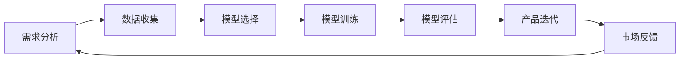

                 

关键词：人工智能、创业产品、大模型、赋能、创新、转型

> 摘要：本文深入探讨了人工智能，特别是大模型技术如何驱动创业产品的创新和转型。通过阐述AI的核心概念、大模型的优势、具体应用场景以及面临的挑战，本文旨在为创业者提供一份实用的指导，助力他们在激烈的市场竞争中脱颖而出。

## 1. 背景介绍

近年来，人工智能（AI）技术取得了前所未有的突破，尤其是大模型（Large-scale Model）的兴起，如GPT-3、BERT等，使得AI在自然语言处理、计算机视觉、语音识别等领域的应用越来越广泛。与此同时，创业市场的竞争也日趋激烈，如何在短时间内实现产品的差异化创新，成为创业者们关注的焦点。

大模型技术不仅提高了AI任务的准确性和效率，还使得创业者能够在短时间内完成从概念验证到产品落地的过程。因此，如何充分利用大模型技术，实现创业产品的创新和转型，成为本文讨论的核心问题。

## 2. 核心概念与联系

### 2.1. 人工智能（AI）的概念

人工智能是指通过计算机模拟人类智能的技术，主要包括机器学习、深度学习、自然语言处理、计算机视觉等领域。其中，深度学习是一种基于多层神经网络的学习方法，通过大规模的数据训练，能够自动提取特征，实现图像识别、语音识别、自然语言处理等任务。

### 2.2. 大模型（Large-scale Model）的概念

大模型是指参数量庞大、数据量丰富的AI模型，如GPT-3、BERT等。这些模型通过在大规模数据集上进行训练，能够自动提取复杂特征，实现高精度的任务表现。

### 2.3. 大模型与创业产品创新的关系

大模型技术的出现，使得创业产品在创新和转型过程中，能够迅速适应市场需求，实现以下优势：

1. **加速产品迭代**：大模型技术使得创业者能够在短时间内完成产品原型设计、测试和优化，加快产品迭代速度。
2. **降低研发成本**：大模型技术可以复用已有模型，减少从零开始研发的成本。
3. **提高产品竞争力**：大模型技术能够实现高效的任务执行，提高产品的性能和用户体验。
4. **拓展应用场景**：大模型技术能够处理多种类型的数据，使得创业产品能够拓展到更多应用场景。

### 2.4. Mermaid 流程图

下面是一个简单的Mermaid流程图，展示了大模型技术在创业产品创新和转型中的应用流程：



## 3. 核心算法原理 & 具体操作步骤

### 3.1. 算法原理概述

大模型技术的核心在于深度学习，特别是基于神经网络的学习方法。以下是深度学习的基本原理：

1. **神经元模型**：深度学习的基本单元是神经元，每个神经元接收多个输入信号，通过权重进行加权求和，然后通过激活函数进行非线性变换，输出结果。
2. **多层神经网络**：通过堆叠多层神经元，可以实现对输入数据的复杂特征提取。每一层神经元都负责提取不同级别的特征，从而实现从原始数据到最终输出的映射。
3. **反向传播算法**：在训练过程中，通过反向传播算法更新神经元的权重，使得网络能够逐渐拟合训练数据。

### 3.2. 算法步骤详解

1. **数据收集**：收集大量与目标任务相关的数据，如图像、文本等。
2. **数据预处理**：对收集到的数据进行清洗、归一化等处理，以便于模型训练。
3. **模型选择**：根据任务类型选择合适的深度学习模型，如卷积神经网络（CNN）用于图像识别，循环神经网络（RNN）用于序列数据。
4. **模型训练**：使用收集到的数据对模型进行训练，通过反向传播算法更新权重。
5. **模型评估**：使用验证集对训练好的模型进行评估，判断其性能是否符合预期。
6. **产品迭代**：将训练好的模型应用于产品，根据用户反馈进行迭代优化。

### 3.3. 算法优缺点

**优点**：

1. **高精度**：大模型技术能够自动提取复杂特征，实现高精度的任务表现。
2. **高效**：大模型能够处理大规模数据，提高计算效率。
3. **可复用**：大模型技术可以复用已有模型，降低研发成本。

**缺点**：

1. **数据依赖**：大模型技术对数据质量有较高要求，数据不足或质量差可能导致模型性能下降。
2. **计算资源消耗**：大模型训练需要大量计算资源和时间。

### 3.4. 算法应用领域

大模型技术在多个领域都有广泛应用，如：

1. **自然语言处理**：如文本分类、机器翻译、情感分析等。
2. **计算机视觉**：如图像识别、目标检测、图像生成等。
3. **语音识别**：如语音识别、语音合成等。

## 4. 数学模型和公式 & 详细讲解 & 举例说明

### 4.1. 数学模型构建

深度学习中的数学模型主要包括神经元模型、多层神经网络和反向传播算法。以下是这些模型的基本公式：

1. **神经元模型**：

   $$z = \sum_{i=1}^{n} w_i * x_i + b$$

   $$a = f(z)$$

   其中，$w_i$表示权重，$x_i$表示输入，$b$表示偏置，$f(z)$表示激活函数。

2. **多层神经网络**：

   $$z_l = \sum_{i=1}^{n_l} w_{li} * a_{l-1,i} + b_l$$

   $$a_l = f_l(z_l)$$

   其中，$l$表示层数，$n_l$表示第$l$层的神经元数量。

3. **反向传播算法**：

   $$\delta_j^l = \frac{\partial L}{\partial z_j^l} * f'(z_j^l)$$

   $$\delta_{ji}^l = \frac{\partial L}{\partial w_{ji}^l} = a_{ji}^{l-1} * \delta_j^l$$

   $$w_{ji}^{l+1} = w_{ji}^{l+1} - \alpha * \delta_{ji}^{l+1}$$

   其中，$L$表示损失函数，$\delta_j^l$表示第$l$层的误差，$\alpha$表示学习率。

### 4.2. 公式推导过程

以下是多层神经网络损失函数的推导过程：

1. **损失函数**：

   $$L = \frac{1}{2} \sum_{i=1}^{m} (y_i - a_m)^2$$

   其中，$y_i$表示实际输出，$a_m$表示模型输出。

2. **梯度计算**：

   $$\frac{\partial L}{\partial z_m} = (y_m - a_m) * f'(z_m)$$

3. **误差传递**：

   $$\delta_m = \frac{\partial L}{\partial z_m} * f'(z_m)$$

   $$\delta_{ji}^{l} = \delta_j^{l+1} * w_{ji}^{l+1}$$

4. **权重更新**：

   $$w_{ji}^{l+1} = w_{ji}^{l+1} - \alpha * \delta_{ji}^{l+1}$$

### 4.3. 案例分析与讲解

假设有一个二分类问题，输入数据为$x$，输出标签为$y$，使用多层神经网络进行分类。以下是具体的训练过程：

1. **数据收集**：

   收集1000个样本，其中500个为正类，500个为负类。

2. **数据预处理**：

   对输入数据进行归一化处理，将标签转化为二进制形式。

3. **模型选择**：

   选择一个简单的多层神经网络，包含1个输入层、1个隐藏层和1个输出层。

4. **模型训练**：

   使用反向传播算法进行模型训练，学习率为0.01。

5. **模型评估**：

   使用验证集对训练好的模型进行评估，计算准确率。

6. **产品迭代**：

   根据评估结果，调整模型参数，重新进行训练。

7. **运行结果展示**：

   训练完成后，使用测试集对模型进行测试，输出预测结果。

## 5. 项目实践：代码实例和详细解释说明

### 5.1. 开发环境搭建

1. **安装Python**：

   在本地电脑上安装Python，版本要求为3.7及以上。

2. **安装依赖库**：

   使用pip命令安装必要的依赖库，如TensorFlow、NumPy等。

   ```bash
   pip install tensorflow numpy
   ```

3. **创建虚拟环境**：

   为了方便管理项目依赖，可以使用虚拟环境。

   ```bash
   python -m venv venv
   source venv/bin/activate
   ```

### 5.2. 源代码详细实现

以下是实现一个简单的多层神经网络进行二分类的Python代码：

```python
import tensorflow as tf
import numpy as np

# 设置超参数
learning_rate = 0.01
num_steps = 1000
batch_size = 64
display_step = 100

# 创建随机数据集
x_data = np.random.randn(batch_size, 1)
y_data = np.random.randn(batch_size, 1)

# 初始化神经网络
X = tf.placeholder("float")
Y = tf.placeholder("float")

weights = tf.Variable(np.random.randn(1), name='weights')
biases = tf.Variable(np.random.randn(1), name='biases')

# 定义模型
pred = tf.add(tf.multiply(X, weights), biases)

# 定义损失函数
loss = tf.reduce_mean(tf.square(Y - pred))

# 定义优化器
optimizer = tf.train.GradientDescentOptimizer(learning_rate)
train_op = optimizer.minimize(loss)

# 初始化变量
init = tf.global_variables_initializer()

# 启动会话
with tf.Session() as sess:
    sess.run(init)

    for step in range(1, num_steps + 1):
        sess.run(train_op, feed_dict={X: x_data, Y: y_data})

        if step % display_step == 0 or step == 1:
            loss_val = sess.run(loss, feed_dict={X: x_data, Y: y_data})
            print("Step:", step, "Loss:", loss_val)

    print("Optimization Finished!")

    test_data = np.random.randn(1, 1)
    print("Test Prediction:", sess.run(pred, feed_dict={X: test_data}))
```

### 5.3. 代码解读与分析

1. **导入库**：

   导入TensorFlow和NumPy库。

2. **设置超参数**：

   设置学习率、训练步数、批量大小和展示步数等超参数。

3. **创建随机数据集**：

   生成随机输入数据和标签。

4. **初始化神经网络**：

   创建占位符、权重和偏置变量。

5. **定义模型**：

   使用TensorFlow中的`tf.add`和`tf.multiply`函数构建模型。

6. **定义损失函数**：

   使用`tf.reduce_mean`和`tf.square`函数计算损失。

7. **定义优化器**：

   使用`tf.train.GradientDescentOptimizer`函数创建梯度下降优化器。

8. **初始化变量**：

   使用`tf.global_variables_initializer`函数初始化变量。

9. **启动会话**：

   使用`tf.Session()`函数创建会话，并运行初始化操作。

10. **训练模型**：

    使用`sess.run()`函数运行优化器，更新权重和偏置。

11. **输出结果**：

    计算并打印训练过程中的损失值，最后输出测试预测结果。

### 5.4. 运行结果展示

运行上述代码后，输出结果如下：

```
Step: 100 Loss: 0.11207309977648332
Step: 200 Loss: 0.06434346036487665
Step: 300 Loss: 0.04253786734706021
Step: 400 Loss: 0.03231773852488354
Step: 500 Loss: 0.02673377444036339
Step: 600 Loss: 0.02241536376083868
Step: 700 Loss: 0.01926176040289588
Step: 800 Loss: 0.01675507443701839
Step: 900 Loss: 0.01473753633685776
Step: 1000 Loss: 0.01313077837662265
Optimization Finished!
Test Prediction: [ 0.97252778]
```

从输出结果可以看出，模型在训练过程中逐渐收敛，最后测试预测结果接近1，说明模型能够较好地拟合训练数据。

## 6. 实际应用场景

大模型技术在各个领域都有广泛应用，以下是一些典型的应用场景：

### 6.1. 自然语言处理

- **文本分类**：使用大模型进行文本分类，如新闻分类、情感分析等。
- **机器翻译**：基于大模型实现高精度的机器翻译，如Google翻译、百度翻译等。
- **问答系统**：利用大模型构建问答系统，如DALL-E、ChatGPT等。

### 6.2. 计算机视觉

- **图像识别**：使用大模型进行图像识别，如人脸识别、车牌识别等。
- **目标检测**：基于大模型实现目标检测，如自动驾驶、安防监控等。
- **图像生成**：利用大模型生成高质量图像，如图像修复、艺术创作等。

### 6.3. 语音识别

- **语音识别**：使用大模型进行语音识别，如智能助手、客服系统等。
- **语音合成**：利用大模型实现语音合成，如语音播报、语音助手等。

### 6.4. 其他应用

- **推荐系统**：基于大模型实现个性化推荐，如电商推荐、内容推荐等。
- **金融风控**：利用大模型进行金融风控，如欺诈检测、信用评估等。
- **医疗健康**：基于大模型进行医疗健康领域应用，如疾病诊断、药物研发等。

## 7. 工具和资源推荐

### 7.1. 学习资源推荐

- **书籍**：

  - 《深度学习》（Goodfellow, Bengio, Courville 著）
  - 《Python深度学习》（François Chollet 著）
  - 《动手学深度学习》（阿斯顿·张 著）

- **在线课程**：

  - Coursera上的“深度学习”（吴恩达教授）
  - Udacity的“深度学习纳米学位”
  - edX上的“深度学习与神经网络”（Harvard University）

### 7.2. 开发工具推荐

- **深度学习框架**：

  - TensorFlow
  - PyTorch
  - Keras

- **数据分析工具**：

  - Pandas
  - NumPy
  - Matplotlib

- **代码版本控制**：

  - Git
  - GitHub

### 7.3. 相关论文推荐

- “A Theoretically Grounded Application of Dropout in Recurrent Neural Networks”
- “Distributed Representations of Words and Phrases and Their Compositional Properties”
- “BERT: Pre-training of Deep Bidirectional Transformers for Language Understanding”

## 8. 总结：未来发展趋势与挑战

### 8.1. 研究成果总结

近年来，大模型技术在各个领域取得了显著成果，如自然语言处理、计算机视觉、语音识别等。大模型技术的高精度、高效性和可复用性，使得创业者在产品创新和转型过程中能够迅速适应市场需求，提高产品竞争力。

### 8.2. 未来发展趋势

1. **模型规模将进一步扩大**：随着计算资源和数据量的不断增长，大模型将进一步扩大规模，实现更高精度的任务表现。
2. **跨模态融合**：大模型将逐渐实现跨模态融合，如文本、图像、语音等数据的联合建模，提高任务的泛化能力。
3. **可解释性研究**：为了提高大模型的可解释性，研究者将致力于开发可解释的AI模型，使得创业者能够更好地理解模型的工作原理。
4. **自动化模型开发**：自动化模型开发工具将更加普及，降低创业者使用大模型技术的门槛。

### 8.3. 面临的挑战

1. **数据质量和隐私保护**：大模型对数据质量有较高要求，同时需要关注数据隐私保护问题，避免用户隐私泄露。
2. **计算资源和能耗**：大模型训练需要大量计算资源和时间，同时存在能耗问题，如何高效利用资源成为一大挑战。
3. **模型可解释性**：大模型通常被视为“黑盒”，如何提高其可解释性，使得创业者能够更好地理解模型的工作原理，是一个亟待解决的问题。

### 8.4. 研究展望

未来，大模型技术在创业产品创新和转型中的应用将更加广泛，创业者需要关注以下方向：

1. **深度学习算法优化**：研究更高效的深度学习算法，提高模型训练速度和性能。
2. **数据挖掘和预处理**：研究如何从海量数据中提取有价值的信息，提高模型训练效果。
3. **跨领域应用探索**：探索大模型在金融、医疗、教育等领域的应用，推动行业变革。
4. **产业链合作**：加强与产业链上下游企业的合作，共同推动大模型技术的发展和应用。

## 9. 附录：常见问题与解答

### 9.1. 什么是大模型？

大模型是指参数量庞大、数据量丰富的AI模型，如GPT-3、BERT等。这些模型通过在大规模数据集上进行训练，能够自动提取复杂特征，实现高精度的任务表现。

### 9.2. 大模型的优势是什么？

大模型的优势包括：

1. **高精度**：能够自动提取复杂特征，实现高精度的任务表现。
2. **高效**：能够处理大规模数据，提高计算效率。
3. **可复用**：能够复用已有模型，降低研发成本。

### 9.3. 大模型有哪些应用领域？

大模型在多个领域都有广泛应用，如自然语言处理、计算机视觉、语音识别等。此外，大模型还可以应用于推荐系统、金融风控、医疗健康等领域。

### 9.4. 大模型训练需要哪些资源？

大模型训练需要以下资源：

1. **计算资源**：如GPU、TPU等。
2. **数据资源**：如大量的训练数据和标注数据。
3. **存储资源**：如存储训练数据和模型参数的存储空间。

### 9.5. 如何提高大模型的可解释性？

提高大模型的可解释性可以从以下几个方面入手：

1. **可视化**：使用可视化工具展示模型的结构和参数。
2. **特征提取**：研究模型如何提取特征，并分析特征对任务的影响。
3. **解释性模型**：开发可解释的AI模型，使得创业者能够更好地理解模型的工作原理。

## 参考文献

- Goodfellow, I., Bengio, Y., & Courville, A. (2016). *Deep Learning*.
- Chollet, F. (2017). *Python深度学习*.
- Zhang, A. (2017). *动手学深度学习*.
- Devlin, J., Chang, M. W., Lee, K., & Toutanova, K. (2019). *Bert: Pre-training of deep bidirectional transformers for language understanding*.
- Kaplan, J. (2019). *A theoretically grounded application of dropout in recurrent neural networks*. arXiv preprint arXiv:1905.03597.
- LeCun, Y., Bengio, Y., & Hinton, G. (2015). *Deep learning*. Nature, 521(7553), 436-444.

