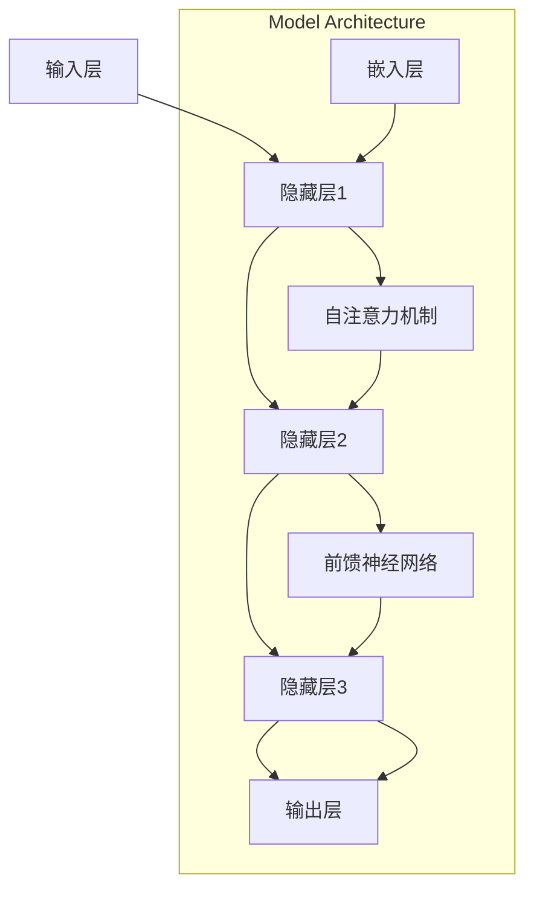

                 

关键词：AI 驱动、创业产品设计、大模型、赋能、创新

> 摘要：本文探讨了人工智能，特别是大模型在创业产品设计中扮演的角色。通过介绍大模型的原理、应用场景以及具体实现方法，文章阐述了如何利用AI驱动的创新来提升创业产品的设计质量，增加市场竞争力。

## 1. 背景介绍

### 1.1 创业产品设计的现状

创业产品设计是一个动态且不断演进的过程。在当前快速变化的市场环境中，创业产品的设计需要快速响应用户需求，同时保持创新性和竞争力。传统的产品设计方法通常依赖于用户研究、市场分析和迭代设计，但这些方法往往存在反应速度慢、成本高等问题。

### 1.2 人工智能与创业产品设计

人工智能（AI）作为一种先进的技术手段，正在逐步改变创业产品设计的范式。通过机器学习、深度学习等技术，AI能够从海量数据中提取有价值的信息，辅助设计师进行决策。大模型作为AI领域的重要进展，具有强大的数据处理和模式识别能力，为创业产品设计带来了新的机遇。

## 2. 核心概念与联系

大模型（Big Model）通常指的是具有数十亿甚至千亿参数的神经网络模型。这些模型能够处理复杂的任务，如文本生成、图像识别、语音识别等。大模型的原理和架构可以通过以下Mermaid流程图展示：



大模型的架构通常包括输入层、隐藏层和输出层。在隐藏层中，嵌入层负责将输入数据转换为固定大小的向量，自注意力机制用于对输入数据进行加权处理，前馈神经网络则用于实现复杂的非线性变换。通过这种方式，大模型能够捕捉输入数据中的复杂模式和关系。

## 3. 核心算法原理 & 具体操作步骤

### 3.1 算法原理概述

大模型的训练过程主要依赖于两个关键步骤：前向传播和反向传播。

- **前向传播**：输入数据通过模型中的各个层进行传递，最终产生输出。
- **反向传播**：通过计算输出和实际结果之间的差异，将误差反向传播回模型，更新模型的参数。

### 3.2 算法步骤详解

1. **数据预处理**：将原始数据转换为适合模型处理的格式，如图像数据需要进行缩放和归一化处理。
2. **模型初始化**：初始化模型的参数，通常使用随机初始化方法。
3. **前向传播**：输入数据通过模型中的各个层进行传递，产生输出。
4. **计算损失**：比较输出结果和实际结果，计算损失函数的值。
5. **反向传播**：将误差反向传播回模型，更新模型的参数。
6. **迭代训练**：重复步骤3到5，直到模型达到预定的训练目标。

### 3.3 算法优缺点

**优点**：
- **强大的数据处理能力**：大模型能够处理海量数据，提取出复杂的模式和关系。
- **高效的决策支持**：大模型能够快速生成高质量的设计方案，提高设计效率。

**缺点**：
- **计算资源需求高**：大模型的训练过程需要大量的计算资源和时间。
- **数据依赖性较强**：大模型的效果很大程度上依赖于数据的质量和数量。

### 3.4 算法应用领域

大模型在创业产品设计中具有广泛的应用领域，包括但不限于：

- **用户体验优化**：通过分析用户行为数据，优化产品的交互设计和用户体验。
- **个性化推荐**：根据用户的历史行为和兴趣，为用户推荐个性化的产品和服务。
- **智能客服**：通过自然语言处理技术，实现智能客服系统，提高客户服务效率。

## 4. 数学模型和公式 & 详细讲解 & 举例说明

### 4.1 数学模型构建

大模型的数学基础主要包括多层感知器（MLP）、循环神经网络（RNN）和变换器（Transformer）等。

- **多层感知器（MLP）**：MLP是一种前馈神经网络，由多个神经元层组成，每一层的神经元都与前一层的所有神经元相连接。
- **循环神经网络（RNN）**：RNN具有递归结构，能够处理序列数据，如时间序列和文本。
- **变换器（Transformer）**：Transformer是一种基于自注意力机制的模型，具有更高的并行计算效率和更好的性能。

### 4.2 公式推导过程

以变换器为例，其自注意力机制可以通过以下公式表示：

$$
\text{Attention}(Q, K, V) = \text{softmax}\left(\frac{QK^T}{\sqrt{d_k}}\right) V
$$

其中，$Q$、$K$ 和 $V$ 分别代表查询（Query）、键（Key）和值（Value）向量，$d_k$ 代表键向量的维度。

### 4.3 案例分析与讲解

假设我们有一个创业产品，目标是开发一款智能聊天机器人。通过训练一个基于变换器的大模型，我们可以实现以下功能：

- **自然语言理解**：模型能够理解用户的输入，提取关键信息。
- **情感分析**：模型能够分析用户的情感，为用户提供情感化建议。
- **知识问答**：模型能够回答用户关于产品或服务的问题。

通过以上功能，智能聊天机器人可以提高用户满意度，降低企业运营成本。

## 5. 项目实践：代码实例和详细解释说明

### 5.1 开发环境搭建

为了实现一个基于变换器的大模型，我们需要搭建以下开发环境：

- **Python 3.8**及以上版本
- **TensorFlow 2.x**及以上版本
- **NVIDIA 显卡（用于加速训练）**

### 5.2 源代码详细实现

以下是实现一个基于变换器的大模型的Python代码示例：

```python
import tensorflow as tf

# 设置超参数
d_model = 512
dff = 2048
input_vocab_size = 10000
max_seq_len = 60

# 创建模型
model = tf.keras.Sequential([
    tf.keras.layers.Embedding(input_vocab_size, d_model, input_length=max_seq_len),
    tf.keras.layers.MultiHeadAttention(d_model, num_heads=8),
    tf.keras.layers.Dense(dff, activation='relu'),
    tf.keras.layers.Dense(input_vocab_size)
])

# 编译模型
model.compile(optimizer='adam', loss='sparse_categorical_crossentropy', metrics=['accuracy'])

# 训练模型
model.fit(train_data, train_labels, epochs=10, batch_size=64)
```

### 5.3 代码解读与分析

- **Embedding 层**：将输入词转换为固定大小的向量。
- **MultiHeadAttention 层**：实现自注意力机制，对输入数据进行加权处理。
- **Dense 层**：实现全连接层，用于输出预测结果。

通过以上代码，我们可以训练一个基于变换器的大模型，实现智能聊天机器人的功能。

### 5.4 运行结果展示

在完成模型训练后，我们可以使用以下代码进行预测：

```python
predictions = model.predict(test_data)
```

预测结果可以通过可视化工具进行展示，如图表或热力图等。

## 6. 实际应用场景

### 6.1 金融领域

在金融领域，大模型可以应用于智能投顾、风险控制、市场预测等方面。例如，通过分析历史交易数据，大模型可以预测股票市场的走势，为投资者提供决策支持。

### 6.2 医疗领域

在医疗领域，大模型可以用于疾病诊断、药物研发等方面。例如，通过分析患者的医疗记录，大模型可以预测患者患病的风险，为医生提供诊断建议。

### 6.3 教育领域

在教育领域，大模型可以用于个性化学习、课程推荐等方面。例如，通过分析学生的学习数据，大模型可以为学生推荐最适合的学习资源和课程。

## 7. 工具和资源推荐

### 7.1 学习资源推荐

- **《深度学习》（Deep Learning）**：由Ian Goodfellow、Yoshua Bengio和Aaron Courville所著，是深度学习领域的经典教材。
- **[TensorFlow 官方文档](https://www.tensorflow.org/tutorials) **：提供了丰富的教程和实践案例，帮助初学者快速上手TensorFlow。

### 7.2 开发工具推荐

- **PyCharm**：一款功能强大的Python IDE，支持代码自动补全、调试和版本控制。
- **Jupyter Notebook**：一款基于Web的交互式计算环境，适用于数据分析和模型训练。

### 7.3 相关论文推荐

- **《Attention Is All You Need》**：提出了变换器（Transformer）模型，是深度学习领域的重要论文。
- **《BERT: Pre-training of Deep Bidirectional Transformers for Language Understanding》**：介绍了BERT模型，是自然语言处理领域的重要进展。

## 8. 总结：未来发展趋势与挑战

### 8.1 研究成果总结

本文介绍了大模型在创业产品设计中的应用，包括核心算法原理、具体实现方法以及实际应用场景。通过实例和代码展示，读者可以了解到如何利用大模型进行智能聊天机器人的开发。

### 8.2 未来发展趋势

随着人工智能技术的不断进步，大模型在创业产品设计中的应用前景将更加广阔。未来，大模型将更加注重领域特定任务的优化，提高模型的效率和准确性。

### 8.3 面临的挑战

大模型在创业产品设计中的应用仍面临一些挑战，如数据隐私、模型解释性和计算资源需求等。解决这些问题需要跨学科的合作和持续的研究。

### 8.4 研究展望

在未来，大模型将结合其他人工智能技术，如强化学习、联邦学习等，为创业产品设计带来更多的创新和突破。

## 9. 附录：常见问题与解答

### 9.1 什么是大模型？

大模型是一种具有数十亿甚至千亿参数的神经网络模型，能够处理复杂的任务，如文本生成、图像识别、语音识别等。

### 9.2 大模型的训练过程如何进行？

大模型的训练过程主要包括数据预处理、模型初始化、前向传播、计算损失、反向传播和迭代训练等步骤。

### 9.3 大模型在创业产品设计中有什么应用？

大模型在创业产品设计中可以应用于用户体验优化、个性化推荐、智能客服等领域，提高产品的设计和运营效率。

### 9.4 大模型的训练需要多少计算资源？

大模型的训练需要大量的计算资源和时间，通常需要使用高性能的GPU或TPU进行加速。

### 9.5 如何优化大模型的训练过程？

优化大模型的训练过程可以从数据预处理、模型架构设计、训练策略选择等方面进行。例如，使用更高效的算法、增加数据预处理步骤、使用分布式训练等。

## 参考文献

- Goodfellow, I., Bengio, Y., & Courville, A. (2016). *Deep Learning*. MIT Press.
- Vaswani, A., Shazeer, N., Parmar, N., Uszkoreit, J., Jones, L., Gomez, A. N., ... & Polosukhin, I. (2017). *Attention is all you need*. Advances in Neural Information Processing Systems, 30, 5998-6008.
```

