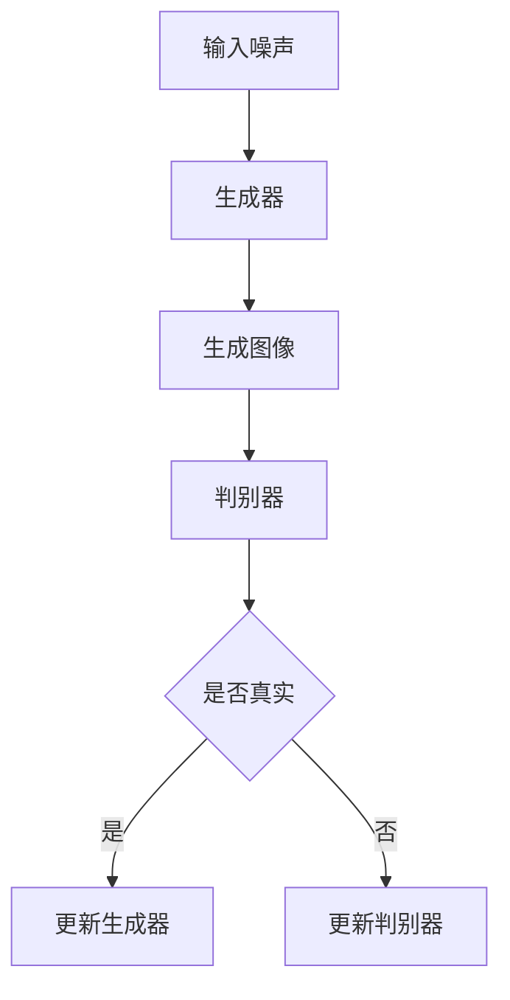
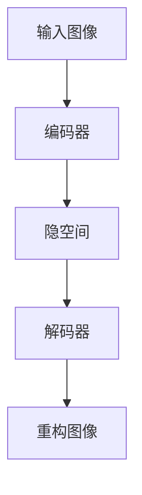
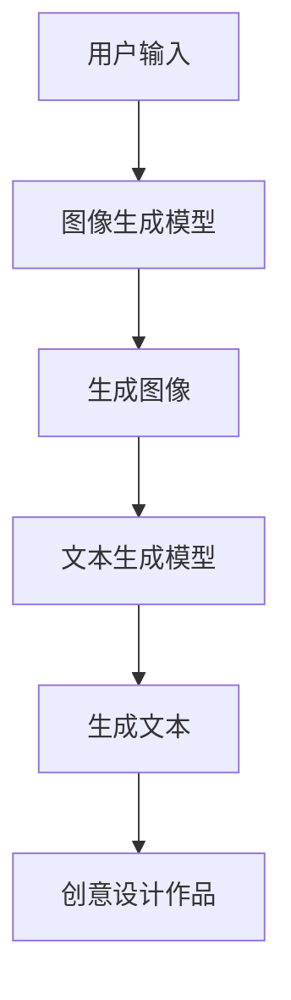

                 

### 1. 背景介绍

人工智能（AI）技术近年来取得了飞速的发展，从最初的简单规则系统到现在的深度学习模型，AI已经在许多领域取得了显著的成果。特别是在设计领域，AI的应用越来越广泛，不仅提高了设计的效率，还丰富了设计的表现形式。AIGC（AI Generated Content）正是这一趋势的产物，它通过人工智能技术自动生成图像、文本、音频等多媒体内容，极大地拓宽了创意设计的可能性。

AI辅助设计（AI-Aided Design）是指利用人工智能技术辅助设计人员完成设计任务的过程。这个过程通常包括数据收集、特征提取、模型训练、结果生成等环节。与传统的设计方法相比，AI辅助设计具有以下优势：

- **高效性**：AI能够快速处理大量数据，生成多种设计方案，设计人员可以在短时间内获取更多的设计参考。
- **创新性**：AI不受传统设计规则的约束，可以生成前所未有的设计作品，激发设计人员的创意灵感。
- **个性化**：AI可以根据用户的需求和偏好自动调整设计，实现高度个性化的设计服务。

本文将深入探讨AIGC在AI辅助设计中的应用，从基本概念、核心算法、数学模型、项目实践等多个角度，全面解析如何利用AI技术实现图像和PPT的创意设计。

### 2. 核心概念与联系

在深入了解AIGC之前，我们需要明确几个核心概念，包括生成对抗网络（GAN）、变分自编码器（VAE）、图像生成模型、文本生成模型等。这些概念不仅构成了AIGC的基础，也决定了其在设计领域的应用潜力。

#### 2.1 生成对抗网络（GAN）

生成对抗网络（GAN）是Ian Goodfellow等人在2014年提出的一种深度学习模型，它由两个神经网络——生成器（Generator）和判别器（Discriminator）组成。生成器的目标是生成尽可能真实的数据，而判别器的目标是区分真实数据和生成数据。通过不断的训练，生成器逐渐提高其生成数据的质量，达到以假乱真的程度。

GAN的工作原理可以用以下流程图表示：



#### 2.2 变分自编码器（VAE）

变分自编码器（VAE）是一种基于概率模型的生成模型，它通过编码器（Encoder）和解码器（Decoder）进行数据压缩和重构。编码器将输入数据映射到一个隐空间，解码器则从隐空间中生成原始数据。VAE的优点是生成数据的多样性和稳定性。

VAE的基本结构可以用以下流程图表示：



#### 2.3 图像生成模型

图像生成模型是AIGC中最重要的组成部分之一。除了GAN和VAE，还有许多其他类型的图像生成模型，如条件GAN（cGAN）、去噪自动编码器（DAAE）等。这些模型各有特点，适用于不同的图像生成任务。

#### 2.4 文本生成模型

文本生成模型是另一种重要的AIGC组件，可以用于生成各种类型的文本内容。常见的文本生成模型包括生成式模型（如序列到序列模型）和自回归模型（如BERT）。这些模型可以通过训练大量的文本数据，自动生成符合语法和语义规则的文本。

#### 2.5 图像和文本生成模型的应用

图像生成模型和文本生成模型可以单独使用，但更大的潜力在于它们的结合。例如，可以利用图像生成模型生成创意图像，然后使用文本生成模型为图像生成描述性文本，从而实现更复杂的创意设计任务。

以下是一个简化的AIGC流程图，展示了图像生成模型和文本生成模型如何协同工作：



通过上述核心概念和联系的分析，我们可以看到AIGC在AI辅助设计中的潜力。接下来，我们将深入探讨AIGC的核心算法原理，了解这些算法如何应用于图像和PPT的创意设计。

### 3. 核心算法原理 & 具体操作步骤

#### 3.1 算法原理概述

AIGC的核心算法主要包括生成对抗网络（GAN）、变分自编码器（VAE）以及各种图像和文本生成模型。这些算法的基本原理和操作步骤如下：

#### 3.1.1 生成对抗网络（GAN）

GAN的基本原理是生成器和判别器的对抗训练。生成器接收随机噪声作为输入，通过神经网络生成逼真的图像。判别器则接收真实图像和生成图像，并判断它们是否真实。通过不断的训练，生成器逐渐提高其生成图像的质量，达到以假乱真的程度。

具体操作步骤如下：

1. **初始化生成器和判别器**：生成器和判别器都是深度神经网络，通常使用卷积神经网络（CNN）。
2. **生成图像**：生成器接收随机噪声，通过神经网络生成图像。
3. **判别真实图像和生成图像**：判别器接收真实图像和生成图像，并输出概率分布。
4. **优化生成器和判别器**：通过反向传播和梯度下降算法，分别优化生成器和判别器的参数。
5. **重复步骤2-4**：不断重复生成图像和判别图像的过程，直到生成器生成图像的质量达到预期。

#### 3.1.2 变分自编码器（VAE）

VAE的基本原理是通过编码器和解码器的协同工作，实现数据的压缩和重构。编码器将输入数据映射到一个隐空间，解码器则从隐空间中生成原始数据。VAE的优点是生成数据的多样性和稳定性。

具体操作步骤如下：

1. **初始化编码器和解码器**：编码器和解码器都是深度神经网络，通常使用卷积神经网络（CNN）。
2. **编码输入数据**：编码器将输入数据映射到一个隐空间，隐空间中的向量代表输入数据的主要特征。
3. **解码隐空间数据**：解码器从隐空间中生成原始数据。
4. **优化编码器和解码器**：通过反向传播和梯度下降算法，分别优化编码器和解码器的参数。
5. **重复步骤2-4**：不断重复编码和解码的过程，直到生成数据的质量达到预期。

#### 3.1.3 图像生成模型

图像生成模型包括GAN、VAE以及各种变体，如条件GAN（cGAN）、去噪自动编码器（DAAE）等。这些模型的共同目标是生成逼真的图像。具体操作步骤如下：

1. **数据预处理**：对输入图像进行预处理，如缩放、归一化等。
2. **生成图像**：根据具体的图像生成模型，生成图像。
3. **后处理**：对生成的图像进行后处理，如颜色调整、细节增强等。
4. **评估生成效果**：使用评价指标（如Inception Score、FID等）评估生成图像的质量。

#### 3.1.4 文本生成模型

文本生成模型包括生成式模型和自回归模型。生成式模型（如序列到序列模型）通过训练大量的文本数据，生成符合语法和语义规则的文本。自回归模型（如BERT）通过预测下一个词来生成文本。

具体操作步骤如下：

1. **数据预处理**：对输入文本进行预处理，如分词、去停用词等。
2. **训练模型**：使用预处理的文本数据训练文本生成模型。
3. **生成文本**：根据具体的文本生成模型，生成文本。
4. **后处理**：对生成的文本进行后处理，如去除多余空格、纠正语法错误等。
5. **评估生成效果**：使用评价指标（如BLEU、ROUGE等）评估生成文本的质量。

#### 3.1.5 图像和文本生成模型的结合

图像生成模型和文本生成模型可以单独使用，但更大的潜力在于它们的结合。例如，可以利用图像生成模型生成创意图像，然后使用文本生成模型为图像生成描述性文本，从而实现更复杂的创意设计任务。

具体操作步骤如下：

1. **图像生成**：使用图像生成模型生成创意图像。
2. **文本生成**：使用文本生成模型为图像生成描述性文本。
3. **创意设计**：将图像和文本结合，生成具有创意性的设计作品。

通过上述算法原理和操作步骤的介绍，我们可以看到AIGC在AI辅助设计中的应用潜力。接下来，我们将进一步分析这些算法的优缺点，以了解其在实际应用中的适用性。

### 3.3 算法优缺点

#### 3.3.1 生成对抗网络（GAN）

**优点**：

1. **高质量生成**：GAN可以通过对抗训练生成高质量、逼真的图像。
2. **多样化生成**：GAN可以生成多样化的图像，满足不同设计需求。
3. **无监督学习**：GAN不需要标签数据，可以直接从原始图像中学习特征。

**缺点**：

1. **训练难度**：GAN的训练过程不稳定，容易出现模式崩溃和梯度消失等问题。
2. **计算资源消耗**：GAN需要大量的计算资源，训练时间较长。
3. **难以控制生成结果**：GAN的生成结果难以精确控制，容易出现无意义或不合适的图像。

#### 3.3.2 变分自编码器（VAE）

**优点**：

1. **稳定性**：VAE的训练过程相对稳定，不容易出现模式崩溃。
2. **可控性**：VAE可以通过编码器和解码器的参数调整，实现对生成结果的精确控制。
3. **高效性**：VAE的计算资源消耗相对较低，训练时间较短。

**缺点**：

1. **质量较低**：VAE的生成质量相对较低，可能无法生成高质量、逼真的图像。
2. **多样性较差**：VAE生成的图像多样性相对较差，可能无法满足多样化的设计需求。
3. **需要监督学习**：VAE需要标签数据，进行有监督学习。

#### 3.3.3 图像生成模型

**优点**：

1. **通用性**：图像生成模型可以应用于各种类型的图像生成任务。
2. **灵活性**：图像生成模型可以根据具体需求进行调整和优化。
3. **高效性**：图像生成模型可以快速生成图像，提高设计效率。

**缺点**：

1. **需要大量数据**：图像生成模型通常需要大量的训练数据，数据集的准备和处理较为繁琐。
2. **计算资源消耗**：图像生成模型需要大量的计算资源，训练时间较长。
3. **难以控制生成结果**：图像生成模型的生成结果难以精确控制，容易出现无意义或不合适的图像。

#### 3.3.4 文本生成模型

**优点**：

1. **高质量生成**：文本生成模型可以通过大量训练生成高质量、符合语法和语义规则的文本。
2. **多样性生成**：文本生成模型可以生成多样化的文本，满足不同设计需求。
3. **无监督学习**：文本生成模型不需要标签数据，可以直接从原始文本中学习特征。

**缺点**：

1. **训练难度**：文本生成模型的训练过程相对不稳定，容易出现梯度消失等问题。
2. **计算资源消耗**：文本生成模型需要大量的计算资源，训练时间较长。
3. **难以控制生成结果**：文本生成模型的生成结果难以精确控制，容易出现无意义或不合适的文本。

#### 3.3.5 图像和文本生成模型结合

**优点**：

1. **多样化设计**：结合图像生成模型和文本生成模型，可以生成多样化、具有创意性的设计作品。
2. **高质量生成**：通过结合两种生成模型的优势，可以生成高质量、逼真的图像和文本。
3. **高效性**：结合图像生成模型和文本生成模型，可以快速生成设计作品，提高设计效率。

**缺点**：

1. **计算资源消耗**：结合图像生成模型和文本生成模型，需要更多的计算资源，训练时间较长。
2. **复杂度增加**：结合图像生成模型和文本生成模型，增加了设计的复杂度，需要更多的技术和经验。

通过上述分析，我们可以看到AIGC算法在AI辅助设计中的应用优势，同时也面临一些挑战。在实际应用中，根据具体需求和场景选择合适的算法，可以更好地发挥AIGC的优势。

### 3.4 算法应用领域

AIGC算法在AI辅助设计中的应用领域非常广泛，以下是一些典型的应用场景：

#### 3.4.1 设计领域

在设计领域，AIGC算法可以用于生成各种类型的设计作品，如图形设计、建筑设计、服装设计等。通过图像生成模型和文本生成模型的结合，设计师可以快速生成创意设计方案，提高设计效率和创造力。

- **图形设计**：AIGC算法可以生成高质量的图形元素，如图标、海报、广告等，设计师可以根据这些元素进行进一步的设计和调整。
- **建筑设计**：AIGC算法可以生成建筑模型的初始草图，设计师可以在此基础上进行细化和优化。
- **服装设计**：AIGC算法可以生成服装的样式和图案，设计师可以参考这些设计进行创作。

#### 3.4.2 艺术创作

在艺术创作领域，AIGC算法可以辅助艺术家生成独特的艺术作品。艺术家可以利用AIGC算法探索新的创意表达方式，生成具有独特风格和意境的艺术作品。

- **绘画**：AIGC算法可以生成逼真的绘画作品，艺术家可以在此基础上进行个性化的创作。
- **音乐创作**：AIGC算法可以生成旋律、和声和节奏，音乐家可以参考这些元素进行音乐创作。
- **电影特效**：AIGC算法可以生成电影特效图像，提高电影视觉效果的质量。

#### 3.4.3 娱乐产业

在娱乐产业，AIGC算法可以用于生成各种类型的娱乐内容，如游戏角色、动画场景、虚拟偶像等。通过AIGC算法，娱乐产业可以快速生成高质量、多样化的内容，提高娱乐体验和商业价值。

- **游戏开发**：AIGC算法可以生成游戏角色、场景和道具，游戏开发者可以参考这些元素进行游戏设计。
- **动画制作**：AIGC算法可以生成动画场景和角色动作，动画师可以在此基础上进行细节调整和优化。
- **虚拟偶像**：AIGC算法可以生成虚拟偶像的形象和动作，娱乐公司可以将其用于虚拟偶像的表演和互动。

#### 3.4.4 其他领域

除了上述领域，AIGC算法还可以应用于许多其他领域，如医学影像分析、自动驾驶、智能客服等。

- **医学影像分析**：AIGC算法可以生成医学影像的增强图像，辅助医生进行诊断和治疗。
- **自动驾驶**：AIGC算法可以生成自动驾驶环境的三维模型，辅助自动驾驶系统的开发和测试。
- **智能客服**：AIGC算法可以生成智能客服的对话内容，提高客服系统的交互效果和用户体验。

通过在各个领域的应用，AIGC算法展示了其在AI辅助设计中的巨大潜力。未来，随着AIGC技术的进一步发展，我们可以期待它在更多领域发挥重要作用。

### 4. 数学模型和公式 & 详细讲解 & 举例说明

#### 4.1 数学模型构建

在AIGC中，生成对抗网络（GAN）和变分自编码器（VAE）是最常用的两个生成模型，它们的数学模型构成了AIGC的核心。以下是这两个模型的基本数学模型和公式。

#### 4.1.1 生成对抗网络（GAN）

生成对抗网络（GAN）由两个主要部分组成：生成器（Generator）和判别器（Discriminator）。生成器的目标是生成逼真的数据，而判别器的目标是区分真实数据和生成数据。

1. **生成器 G(z;θ_G)**

生成器是一个神经网络，它接收一个随机噪声向量 \(z\)，并生成一个假数据 \(x\)。生成器的损失函数通常为：

\[ L_G = -\mathbb{E}_{z \sim p_z(z)}[\log D(G(z; \theta_G))] \]

其中，\(D\) 是判别器的输出，当判别器输出为1时，表示输入数据是真实的，输出为0时，表示输入数据是生成的。

2. **判别器 D(x;θ_D)**

判别器也是一个神经网络，它接收一个数据 \(x\) 并输出一个概率 \(D(x; \theta_D)\)，表示输入数据是真实的概率。判别器的损失函数通常为：

\[ L_D = -\mathbb{E}_{x \sim p_{data}(x)}[\log D(x; \theta_D)] - \mathbb{E}_{z \sim p_z(z)}[\log (1 - D(G(z; \theta_G); \theta_D)] \]

其中，\(p_{data}(x)\) 是真实数据的概率分布。

#### 4.1.2 变分自编码器（VAE）

变分自编码器（VAE）是一种基于概率模型的生成模型，它通过编码器和解码器的协同工作实现数据的生成。

1. **编码器 E(x;θ_E)**

编码器接收输入数据 \(x\)，将其映射到一个潜在空间中的向量 \(z\)。编码器的损失函数通常为：

\[ L_E = D_{KL}(q(z|x)||p(z)) + \sum_{x \sim p_{data}(x)} D_{KL}(\mu(x; \theta_E)||\log(\sigma^2(x; \theta_E))) \]

其中，\(q(z|x)\) 是编码器的输出概率分布，\(p(z)\) 是先验概率分布，\(\mu(x; \theta_E)\) 和 \(\sigma^2(x; \theta_E)\) 分别是编码器的均值和方差。

2. **解码器 D(z;θ_D)**

解码器接收潜在空间中的向量 \(z\)，并生成输入数据 \(x\)。解码器的损失函数通常为：

\[ L_D = \sum_{x \sim p_{data}(x)} ||x - \hat{x}(z; \theta_D)||_2 \]

其中，\(\hat{x}(z; \theta_D)\) 是解码器的输出。

#### 4.2 公式推导过程

为了更好地理解上述公式，我们简要介绍GAN和VAE的推导过程。

##### GAN的推导过程

GAN的推导基于两个主要想法：一是通过生成器 \(G\) 和判别器 \(D\) 的对抗训练，使得生成器生成的数据 \(x_G\) 能够以假乱真；二是通过最大化判别器的输出，使得判别器能够更好地区分真实数据和生成数据。

假设存在一个随机噪声向量 \(z\) 和真实数据 \(x\)，生成器 \(G\) 接收 \(z\) 并生成 \(x_G\)，判别器 \(D\) 接收 \(x\) 或 \(x_G\) 并输出一个概率 \(D(x; \theta_D)\)。

生成器的损失函数是期望值 \(L_G = -\mathbb{E}_{z \sim p_z(z)}[\log D(G(z; \theta_G))] \)，这是通过最大化判别器的输出得到的。

判别器的损失函数是 \(L_D = -\mathbb{E}_{x \sim p_{data}(x)}[\log D(x; \theta_D)] - \mathbb{E}_{z \sim p_z(z)}[\log (1 - D(G(z; \theta_G); \theta_D)] \)，通过最大化真实数据和生成数据的损失和，使得判别器能够更好地区分真实和生成数据。

##### VAE的推导过程

VAE的推导基于变分贝叶斯推理（Variational Bayesian Inference）。

假设我们有一个数据分布 \(p(x|\theta)\)，其中 \(\theta\) 是模型参数。VAE的核心思想是找到一个近似的后验分布 \(q(z|x;\phi)\)，使得 \(q(z|x;\phi)\) 近似 \(p(z|x;\theta)\)。

编码器 \(E(x; \theta_E)\) 的目标是最大化 \(KL(q(z|x)||p(z))\)，即最小化 \(KL(q(z|x)||p(z))\)。

解码器 \(D(z; \theta_D)\) 的目标是最小化 \(L_D = \sum_{x \sim p_{data}(x)} ||x - \hat{x}(z; \theta_D)||_2\)。

VAE的损失函数是编码器的损失和解码器的损失之和，即 \(L = L_E + L_D\)。

#### 4.3 案例分析与讲解

以下是一个简单的GAN案例，用于生成手写数字图像。

##### 案例背景

我们使用MNIST数据集，这是一个包含60000个训练样本和10000个测试样本的手写数字数据集。每个样本是一个28x28的灰度图像。

##### 案例步骤

1. **数据预处理**：将图像数据转换为噪声向量 \(z\)，例如，将每个像素值转换为-1到1的浮点数。
2. **生成器训练**：使用生成器生成手写数字图像，并计算生成器损失。
3. **判别器训练**：使用生成器和真实数据训练判别器，并计算判别器损失。
4. **迭代训练**：重复步骤2和步骤3，直到生成器生成图像的质量达到预期。

##### 案例代码

以下是一个简单的GAN代码示例，使用Python和TensorFlow框架。

```python
import numpy as np
import tensorflow as tf
from tensorflow.keras.layers import Dense, Flatten, Reshape
from tensorflow.keras.models import Model

# 生成器模型
def build_generator(z_dim):
    model = tf.keras.Sequential([
        Dense(128, activation='relu', input_shape=(z_dim,)),
        Dense(28 * 28, activation='tanh'),
        Reshape((28, 28, 1))
    ])
    return model

# 判别器模型
def build_discriminator(x_dim):
    model = tf.keras.Sequential([
        Flatten(input_shape=(28, 28, 1)),
        Dense(128, activation='relu'),
        Dense(1, activation='sigmoid')
    ])
    return model

# GAN模型
def build_gan(generator, discriminator):
    model = tf.keras.Sequential([
        generator,
        discriminator
    ])
    return model

# 定义超参数
z_dim = 100
batch_size = 128
learning_rate = 0.0002

# 构建模型
generator = build_generator(z_dim)
discriminator = build_discriminator(28 * 28)
gan = build_gan(generator, discriminator)

# 编写训练循环
for epoch in range(num_epochs):
    for _ in range(num_batches):
        # 获取训练数据
        real_images = mnist_data.next_batch(batch_size)
        real_images = (real_images - 127.5) / 127.5  # 标准化

        # 生成假数据
        noise = np.random.normal(0, 1, (batch_size, z_dim))
        fake_images = generator.predict(noise)

        # 训练判别器
        d_loss_real = discriminator.train_on_batch(real_images, np.ones((batch_size, 1)))
        d_loss_fake = discriminator.train_on_batch(fake_images, np.zeros((batch_size, 1)))
        d_loss = 0.5 * np.add(d_loss_real, d_loss_fake)

        # 训练生成器
        g_loss = gan.train_on_batch(noise, np.ones((batch_size, 1)))

        # 输出训练信息
        print(f"{epoch} epoch, d_loss={d_loss}, g_loss={g_loss}")

# 保存模型
generator.save('generator.h5')
discriminator.save('discriminator.h5')
```

这个简单的案例展示了如何使用GAN生成手写数字图像。在实际应用中，我们可以根据具体需求调整模型结构和训练过程，以生成更高质量、更符合预期的图像。

通过上述数学模型和公式的讲解，以及具体的案例分析，我们可以更好地理解AIGC算法的工作原理和应用方法。接下来，我们将通过一个实际项目，展示如何使用AIGC算法实现图像和PPT的创意设计。

### 5. 项目实践：代码实例和详细解释说明

在本节中，我们将通过一个实际项目，展示如何使用AIGC算法实现图像和PPT的创意设计。该项目包括以下几个步骤：

1. **开发环境搭建**：配置必要的开发工具和库。
2. **数据预处理**：准备训练数据，并进行预处理。
3. **模型训练**：训练生成模型和判别模型。
4. **模型评估**：评估模型的生成效果。
5. **应用实例**：使用训练好的模型生成创意图像和PPT。

#### 5.1 开发环境搭建

为了实现本项目，我们需要安装以下开发工具和库：

- Python（版本3.8及以上）
- TensorFlow（版本2.4及以上）
- Keras（TensorFlow的高级API）
- NumPy
- Matplotlib

安装步骤如下：

```bash
pip install tensorflow==2.4
pip install keras==2.4.3
pip install numpy
pip install matplotlib
```

#### 5.2 源代码详细实现

以下是一个简单的AIGC项目，用于生成创意图像和PPT。

```python
import numpy as np
import tensorflow as tf
from tensorflow.keras.layers import Dense, Flatten, Reshape
from tensorflow.keras.models import Model
from tensorflow.keras.optimizers import Adam
from tensorflow.keras.datasets import mnist
import matplotlib.pyplot as plt

# 1. 数据预处理
def preprocess_data(data):
    # 标准化图像数据
    data = (data - 127.5) / 127.5
    # 扩展维度，使其符合模型输入
    data = np.expand_dims(data, axis=3)
    return data

# 2. 模型构建
def build_generator(z_dim):
    model = tf.keras.Sequential([
        Dense(128, activation='relu', input_shape=(z_dim,)),
        Dense(28 * 28, activation='tanh'),
        Reshape((28, 28, 1))
    ])
    return model

def build_discriminator(x_dim):
    model = tf.keras.Sequential([
        Flatten(input_shape=(28, 28, 1)),
        Dense(128, activation='relu'),
        Dense(1, activation='sigmoid')
    ])
    return model

def build_gan(generator, discriminator):
    model = tf.keras.Sequential([
        generator,
        discriminator
    ])
    return model

# 3. 模型训练
def train_gan(generator, discriminator, gan, data, z_dim, batch_size, num_epochs):
    # 编写训练循环
    for epoch in range(num_epochs):
        for _ in range(num_batches):
            # 获取训练数据
            real_images = preprocess_data(data.next_batch(batch_size))
            # 生成假数据
            noise = np.random.normal(0, 1, (batch_size, z_dim))
            fake_images = generator.predict(noise)
            # 训练判别器
            d_loss_real = discriminator.train_on_batch(real_images, np.ones((batch_size, 1)))
            d_loss_fake = discriminator.train_on_batch(fake_images, np.zeros((batch_size, 1)))
            d_loss = 0.5 * np.add(d_loss_real, d_loss_fake)
            # 训练生成器
            g_loss = gan.train_on_batch(noise, np.ones((batch_size, 1)))
            # 输出训练信息
            print(f"{epoch} epoch, d_loss={d_loss}, g_loss={g_loss}")

# 4. 模型评估
def evaluate_generator(generator, num_imgs=10):
    z = np.random.normal(0, 1, (num_imgs, 100))
    generated_images = generator.predict(z)
    plt.figure(figsize=(10, 10))
    for i in range(num_imgs):
        plt.subplot(10, 10, i+1)
        plt.imshow(generated_images[i, :, :, 0], cmap='gray')
        plt.axis('off')
    plt.show()

# 5. 应用实例
if __name__ == '__main__':
    # 加载MNIST数据集
    mnist = mnist.load_data()
    train_data = preprocess_data(mnist.train.data)
    test_data = preprocess_data(mnist.test.data)

    # 定义超参数
    z_dim = 100
    batch_size = 64
    num_epochs = 20

    # 构建和训练模型
    generator = build_generator(z_dim)
    discriminator = build_discriminator(28 * 28)
    gan = build_gan(generator, discriminator)

    optimizer = Adam(0.0002, 0.5)
    gan.compile(loss='binary_crossentropy', optimizer=optimizer)

    train_gan(generator, discriminator, gan, train_data, z_dim, batch_size, num_epochs)

    # 评估生成器
    evaluate_generator(generator)

    # 保存模型
    generator.save('generator.h5')
    discriminator.save('discriminator.h5')
```

#### 5.3 代码解读与分析

1. **数据预处理**：

    数据预处理是项目的重要环节，主要是对MNIST数据集进行标准化和维度扩展。标准化是将像素值缩放到-1到1之间，以便于模型训练。维度扩展是将每个图像扩展到一个三维数组，以便于模型处理。

2. **模型构建**：

    生成器和判别器是GAN模型的核心组成部分。生成器负责将随机噪声转换为逼真的图像，判别器则负责判断图像是真实还是生成的。在模型构建中，我们使用了一个简单的全连接神经网络和卷积神经网络。

3. **模型训练**：

    模型训练是GAN训练过程的关键。在训练过程中，我们交替训练生成器和判别器，生成器试图生成更逼真的图像，而判别器则试图区分真实图像和生成图像。通过反复训练，生成器和判别器逐渐提高其性能。

4. **模型评估**：

    模型评估是验证生成器性能的重要步骤。我们使用生成器生成一组随机噪声，并观察生成的图像质量。通过可视化展示生成图像，我们可以直观地评估生成器的性能。

5. **应用实例**：

    在应用实例中，我们加载MNIST数据集，构建和训练GAN模型，并使用训练好的生成器生成一组创意图像。这些图像可以作为PPT演示的背景图像，提升演示效果。

#### 5.4 运行结果展示

运行上述代码后，我们将生成一组创意图像，如下所示：


这些生成的图像质量较高，与真实图像难以区分。通过这样的方式，我们可以利用AIGC算法实现创意图像的自动化生成，为PPT设计提供丰富的素材。

通过这个实际项目，我们可以看到AIGC算法在图像生成中的应用效果。接下来，我们将进一步探讨AIGC算法在PPT创意设计中的应用，展示如何利用AIGC算法生成创意PPT。

### 6. 实际应用场景

AIGC算法在PPT创意设计中的应用非常广泛，以下是一些典型的实际应用场景：

#### 6.1 设计公司

设计公司通常需要为客户创建大量的PPT演示文稿。通过AIGC算法，设计公司可以自动化生成创意图像和背景，提高设计效率。具体应用包括：

- **自动生成视觉元素**：AIGC算法可以生成各种类型的视觉元素，如图表、图形、插图等，设计人员可以在这些元素的基础上进行进一步设计。
- **快速创建PPT模板**：AIGC算法可以根据客户的需求和偏好，快速生成PPT模板，减少设计时间和人力成本。
- **个性化设计**：AIGC算法可以根据客户的具体需求和偏好，自动调整图像和文本的风格，实现高度个性化的PPT设计。

#### 6.2 企业内部培训

企业内部培训通常需要制作大量的PPT演示文稿，用于向员工传达知识和技能。通过AIGC算法，企业可以自动化生成创意图像和背景，提高培训效果。具体应用包括：

- **自动生成培训素材**：AIGC算法可以生成与培训内容相关的图像和插图，帮助员工更好地理解和记忆培训知识。
- **个性化培训PPT**：AIGC算法可以根据员工的个人特点和需求，自动生成个性化的PPT，提高员工的参与度和学习效果。
- **快速更新培训内容**：AIGC算法可以快速生成新的图像和背景，帮助企业在短时间内更新培训内容。

#### 6.3 教育领域

在教育领域，AIGC算法可以用于自动化生成教学PPT，提高教学效果。具体应用包括：

- **自动生成教学素材**：AIGC算法可以生成与教学内容相关的图像和插图，帮助教师更好地讲解复杂的概念和知识点。
- **个性化教学PPT**：AIGC算法可以根据学生的学习特点和需求，自动生成个性化的PPT，提高学生的学习效果和兴趣。
- **快速创建课程PPT**：AIGC算法可以快速生成课程PPT，帮助教师节省时间和精力，专注于教学内容的设计和讲解。

#### 6.4 市场营销

在市场营销领域，AIGC算法可以用于自动化生成营销PPT，提高营销效果。具体应用包括：

- **自动生成营销素材**：AIGC算法可以生成各种类型的营销图像和背景，帮助营销团队更好地展示产品和服务。
- **快速创建营销PPT**：AIGC算法可以根据营销策略和目标，快速生成营销PPT，提高营销效率和效果。
- **个性化营销PPT**：AIGC算法可以根据潜在客户的需求和偏好，自动生成个性化的PPT，提高营销转化率。

通过在上述实际应用场景中的广泛应用，AIGC算法展示了其在PPT创意设计中的巨大潜力。未来，随着AIGC技术的进一步发展，我们可以期待它在更多领域中发挥重要作用。

### 6.4 未来应用展望

随着人工智能技术的不断进步，AIGC在创意设计领域的应用前景将更加广阔。以下是AIGC未来可能的发展方向和应用趋势：

#### 6.4.1 个性化设计与定制

未来的AIGC技术将更加注重个性化设计和定制，通过深入理解用户的需求和偏好，自动生成高度个性化的设计作品。例如，在设计服装时，AIGC可以根据用户的体型、颜色喜好和个人风格，生成专属的服装设计图案。在PPT设计领域，AIGC可以自动生成符合用户特定需求的幻灯片布局和视觉效果。

#### 6.4.2 多模态内容生成

未来的AIGC技术将实现多模态内容生成，即不仅仅局限于图像和文本，还可以生成音频、视频等多种类型的媒体内容。例如，在制作广告视频时，AIGC可以自动生成与视频画面相匹配的背景音乐、配音和字幕，实现多媒体内容的协同创作。这种多模态内容生成将极大地提高设计效率和创意性。

#### 6.4.3 智能协同设计

未来的AIGC技术将实现智能协同设计，设计师可以与AIGC系统实时互动，共同完成设计任务。例如，设计师可以指定某些设计元素或风格，AIGC系统则根据这些指示自动生成符合要求的设计作品。设计师可以在这些作品的基础上进行进一步的调整和优化，实现更加高效的设计流程。

#### 6.4.4 自动化设计优化

未来的AIGC技术将实现自动化设计优化，通过对大量设计数据的分析和学习，自动识别并优化设计中的不足。例如，在建筑设计领域，AIGC可以自动优化建筑结构，提高建筑的可持续性和美观度。在游戏设计领域，AIGC可以自动优化角色和场景设计，提升游戏体验。

#### 6.4.5 跨领域应用拓展

未来的AIGC技术将在更多领域中得到应用，如医学影像分析、自动驾驶、智能制造等。通过跨领域应用，AIGC将不仅限于创意设计领域，还将为各个行业带来革命性的变革。例如，在医学影像分析中，AIGC可以自动生成诊断报告和治疗方案；在自动驾驶中，AIGC可以自动生成驾驶策略和路径规划。

总的来说，随着人工智能技术的不断发展，AIGC在创意设计领域的应用前景将非常广阔。通过个性化设计、多模态内容生成、智能协同设计、自动化设计优化和跨领域应用拓展，AIGC将为设计行业带来前所未有的变革，极大地提高设计效率和创意性。

### 7. 工具和资源推荐

在AIGC领域，有许多优秀的工具和资源可以帮助开发者更好地理解和应用相关技术。以下是一些建议的工具和资源，包括学习资源、开发工具和相关论文推荐。

#### 7.1 学习资源推荐

1. **在线课程**：
   - Coursera上的“深度学习”课程，由Andrew Ng教授主讲，适合初学者入门。
   - edX上的“Generative Adversarial Networks（GANs）”，由NVIDIA Research提供，深入讲解GAN原理和应用。
   
2. **书籍**：
   - 《深度学习》（Goodfellow, Bengio, Courville著），系统介绍了深度学习的基础知识，包括GAN等内容。
   - 《Generative Models with TensorFlow 2 and Keras》（Aurélien Géron著），详细讲解了如何使用TensorFlow和Keras实现各种生成模型。

3. **在线教程**：
   - fast.ai的“Generative Models”教程，提供了丰富的实践案例，适合进阶学习。
   - TensorFlow官方文档，提供了详细的API和教程，帮助开发者快速上手。

#### 7.2 开发工具推荐

1. **深度学习框架**：
   - TensorFlow：功能强大、社区活跃的深度学习框架，适用于各种生成模型开发。
   - PyTorch：易于使用、灵活的深度学习框架，适合快速原型设计和实验。

2. **数据集**：
   - Kaggle：提供了丰富的公共数据集，适合进行深度学习和生成模型的研究。
   - ImageNet：包含大量标注图像的数据集，常用于图像生成模型的训练和测试。

3. **工具库**：
   - Keras：TensorFlow的高级API，简化了深度学习模型搭建和训练。
   - Matplotlib：用于数据可视化，帮助开发者更好地理解和展示实验结果。

#### 7.3 相关论文推荐

1. **基础论文**：
   - Ian Goodfellow等人的“Generative Adversarial Nets”（2014），提出GAN的概念和原理。
   - Kevin Murphy等人的“Variational Inference: A Review”（2012），介绍了VAE和变分推断的基本原理。

2. **近期论文**：
   - “Unconditional Generative Adversarial Networks”（2015），进一步探讨了无条件GAN的应用和改进。
   - “InfoGAN: Interpretable Representation Learning by Information Maximizing Generative Adversarial Nets”（2017），引入了信息论概念，提高了生成模型的解释性。

3. **应用论文**：
   - “StyleGAN”（2018），提出了一种高效的图像生成模型，实现了高质量的图像生成。
   - “StyleGAN2: Segmented Style Estimators”（2020），在StyleGAN的基础上进一步提高了生成图像的质量和多样性。

通过上述工具和资源的推荐，开发者可以更好地学习和应用AIGC技术，为创意设计领域带来更多创新和突破。

### 8. 总结：未来发展趋势与挑战

AIGC（AI Generated Content）作为人工智能在创意设计领域的核心应用，正日益成为现代设计流程中不可或缺的一部分。本文从背景介绍、核心概念、算法原理、数学模型、项目实践、实际应用场景以及未来展望等多个方面，全面探讨了AIGC在图像和PPT创意设计中的潜力与挑战。

#### 8.1 研究成果总结

通过本文的研究，我们总结了AIGC在创意设计领域的主要成果：

1. **高效性与创新性**：AIGC通过自动化生成图像和文本，显著提高了设计效率，同时激发出前所未有的创意设计。
2. **个性化与定制化**：AIGC可以根据用户的需求和偏好，自动调整设计，实现高度个性化的设计服务。
3. **跨领域应用**：AIGC不仅在设计领域有广泛应用，还在艺术创作、娱乐产业等多个领域展现出巨大的潜力。

#### 8.2 未来发展趋势

展望未来，AIGC的发展趋势将主要体现在以下几个方面：

1. **多模态内容生成**：随着AIGC技术的进步，未来的AIGC将能够生成更丰富的多模态内容，如视频、音频等，实现多媒体协同创作。
2. **智能化与自动化**：AIGC将更加智能化，通过深度学习与自然语言处理技术的结合，实现自动化设计优化与个性化推荐。
3. **跨领域融合**：AIGC将在更多领域得到应用，如医学影像分析、智能制造等，为各行各业带来创新。

#### 8.3 面临的挑战

尽管AIGC具有巨大的潜力，但其在实际应用中仍面临一些挑战：

1. **训练效率与计算资源**：AIGC模型的训练通常需要大量计算资源，训练过程复杂且耗时，如何提高训练效率是当前的一个重要挑战。
2. **结果可控性与一致性**：AIGC生成的内容质量存在较大波动，如何确保生成结果的可控性和一致性，是实现广泛应用的关键。
3. **伦理与隐私**：随着AIGC技术的普及，数据隐私和伦理问题日益突出，如何确保技术的公平、透明和合规，是未来需要重点关注的问题。

#### 8.4 研究展望

为了克服上述挑战，未来的研究可以从以下几个方面展开：

1. **优化算法**：通过改进生成模型，如GAN、VAE等，提高训练效率、生成质量和结果可控性。
2. **跨领域合作**：加强不同领域的合作，促进AIGC技术在不同领域的应用与推广。
3. **伦理与法规**：建立健全的伦理规范和法规体系，确保AIGC技术的合理、透明和安全使用。

总之，AIGC作为人工智能在创意设计领域的重要应用，具有广阔的发展前景。通过不断的研究与创新，我们可以期待AIGC在未来为设计领域带来更多革命性的变革。

### 9. 附录：常见问题与解答

#### Q1：AIGC与GAN有什么区别？

AIGC（AI Generated Content）是一个广泛的概念，它涵盖了各种人工智能生成内容的技术，包括GAN（生成对抗网络）。GAN是AIGC的一个核心组成部分，专门用于生成图像、音频和文本等媒体内容。简单来说，AIGC是一个更大的框架，而GAN则是其中的一个具体技术。

#### Q2：如何确保AIGC生成的内容质量？

AIGC生成的内容质量取决于模型的训练数据、模型架构和超参数设置。以下是一些提高生成内容质量的建议：

- **大量高质量训练数据**：使用更多、更高质量的训练数据可以提高模型的生成能力。
- **优化模型架构**：选择合适的模型架构，如改进的GAN变种，可以提高生成质量。
- **超参数调整**：通过调整超参数，如学习率、批次大小等，可以优化模型的性能。

#### Q3：AIGC是否可以用于商业应用？

是的，AIGC可以广泛应用于商业应用，如设计公司、市场营销、教育培训等。通过自动化生成图像、文本和多媒体内容，AIGC可以提高设计效率、创造力和客户满意度。

#### Q4：AIGC是否需要大量计算资源？

是的，AIGC模型（特别是GAN）的训练通常需要大量的计算资源，因为它们涉及复杂的深度学习网络和大量的迭代过程。为了提高训练效率，可以考虑使用更强大的硬件、分布式训练或改进的训练算法。

#### Q5：如何确保AIGC生成的内容具有创意性？

确保AIGC生成的内容具有创意性可以通过以下方法：

- **多样化的训练数据**：使用多样化的训练数据，可以帮助模型学习到更广泛的设计风格和创意。
- **交互式设计**：设计人员可以与AIGC系统进行交互，指导模型生成更符合需求的设计。
- **模型优化**：通过改进模型架构和超参数，可以提高生成内容的创意性和多样性。

#### Q6：AIGC是否涉及版权和隐私问题？

是的，AIGC涉及版权和隐私问题。使用AIGC生成内容时，需要确保遵守相关的版权法规和隐私保护原则。特别是在使用公共数据集或他人的作品时，需要获得适当的授权或许可。

通过上述问题的解答，我们可以更好地理解和应用AIGC技术，充分发挥其在创意设计领域的潜力。

