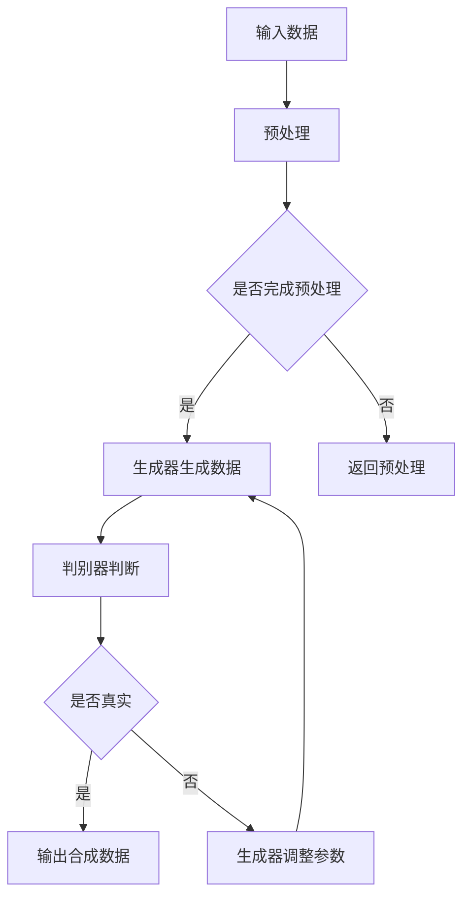

                 

### 背景介绍

随着人工智能（AI）技术的快速发展，生成对抗网络（GAN）等先进算法的出现，人工智能生成内容（AIGC）成为了一个备受关注的研究领域。AIGC 是指通过人工智能技术生成各种类型的内容，如文本、图像、音频等。这种技术的应用范围十分广泛，从娱乐、游戏到工业制造、医疗等多个领域，AIGC 都展现出了巨大的潜力。

在工业领域，数据是推动技术进步的关键因素。然而，真实工业数据往往受到数据质量、数据可用性以及数据隐私保护等多方面限制。合成数据集作为一种解决方法，通过模拟真实场景生成高质量、多样化、符合实际需求的数据，为工业应用提供了有力的支持。本文将探讨 AIGC 在工业领域中的应用，尤其是合成数据集在机器人产品研发中的创新场景。

合成数据集在机器人产品研发中的应用场景主要包括以下几个方面：

1. **机器人视觉系统训练**：通过合成数据集模拟各种环境和场景，帮助机器人视觉系统学习识别和分类不同物体。
2. **机器人导航系统优化**：合成数据集可以模拟各种复杂的室内外环境，帮助机器人导航系统学习和优化路径规划算法。
3. **机器人交互系统测试**：合成数据集可以模拟不同类型的人与人、人与机器人的交互场景，帮助机器人交互系统进行测试和优化。

本文将首先介绍 AIGC 的基本概念和核心算法原理，然后深入探讨合成数据集在机器人产品研发中的应用，并通过具体案例进行分析和讲解。最后，我们将展望 AIGC 在工业领域未来的发展前景，以及可能面临的挑战和机遇。

## 2. 核心概念与联系

### 2.1 人工智能生成内容（AIGC）

人工智能生成内容（AIGC）是利用人工智能技术生成具有创意性和多样性的内容。AIGC 技术的核心是生成对抗网络（GAN），其由两个神经网络组成：生成器（Generator）和判别器（Discriminator）。生成器负责生成数据，而判别器负责判断生成的数据是否真实。通过不断地训练，生成器和判别器之间的博弈，生成器能够生成越来越真实的数据。

### 2.2 合成数据集

合成数据集是通过人工智能技术生成的一种数据集，它模拟了真实场景，但数据本身是人工生成的。合成数据集的特点是数据量大、多样化、易于获取，且可以控制数据的特定属性。合成数据集在机器人产品研发中有着广泛的应用，如训练机器视觉系统、优化导航算法等。

### 2.3 Mermaid 流程图

为了更直观地展示 AIGC 和合成数据集的工作流程，我们使用 Mermaid 流程图进行说明。



### 2.4 合成数据集在机器人产品研发中的应用

合成数据集在机器人产品研发中的应用主要体现在以下几个方面：

1. **训练机器视觉系统**：通过合成数据集模拟各种环境和场景，帮助机器视觉系统学习识别和分类不同物体。
2. **优化导航算法**：合成数据集可以模拟各种复杂的室内外环境，帮助机器人导航系统学习和优化路径规划算法。
3. **测试交互系统**：合成数据集可以模拟不同类型的人与人、人与机器人的交互场景，帮助机器人交互系统进行测试和优化。

## 3. 核心算法原理 & 具体操作步骤

### 3.1 算法原理概述

生成对抗网络（GAN）是 AIGC 的核心技术，由两部分组成：生成器（Generator）和判别器（Discriminator）。生成器的目标是生成尽可能真实的数据，而判别器的目标是区分生成器和真实数据。两者通过对抗训练不断优化，从而实现高质量的数据生成。

### 3.2 算法步骤详解

1. **数据预处理**：首先对输入数据进行预处理，包括去噪、归一化等操作，以提高后续训练效果。
2. **生成器训练**：生成器通过学习输入数据的特征，生成模拟真实场景的数据。
3. **判别器训练**：判别器通过判断生成器和真实数据，优化自身的判别能力。
4. **生成数据优化**：根据判别器的反馈，调整生成器的参数，使其生成更真实的数据。
5. **数据集生成**：当生成器达到预期效果时，生成数据集用于后续应用。

### 3.3 算法优缺点

**优点**：

- **数据量大**：生成器可以生成大量数据，弥补真实数据的不足。
- **多样化**：生成器可以根据需求生成不同类型的数据，满足各种应用场景。
- **易于控制**：合成数据集可以控制数据的特定属性，如光照、纹理等。

**缺点**：

- **计算资源消耗大**：GAN 需要进行大量的训练，对计算资源有较高要求。
- **训练难度大**：GAN 的训练过程复杂，需要调整多个参数，且容易陷入局部最优。

### 3.4 算法应用领域

GAN 算法在多个领域有着广泛的应用，包括：

- **图像生成**：如人脸生成、风景生成等。
- **视频生成**：如视频插帧、视频转换等。
- **文本生成**：如文章生成、对话生成等。
- **工业应用**：如合成数据集用于机器人产品研发等。

## 4. 数学模型和公式 & 详细讲解 & 举例说明

### 4.1 数学模型构建

生成对抗网络（GAN）的数学模型主要包括两部分：生成器模型 \( G \) 和判别器模型 \( D \)。

- 生成器模型：\( G(z; \theta_G) \)，其中 \( z \) 是生成器的输入噪声，\( \theta_G \) 是生成器的参数。
- 判别器模型：\( D(x; \theta_D) \)，其中 \( x \) 是真实数据，\( \theta_D \) 是判别器的参数。

### 4.2 公式推导过程

GAN 的目标是最小化以下两个损失函数：

1. **生成器损失函数**：\( L_G = -\log(D(G(z))) \)
2. **判别器损失函数**：\( L_D = -\log(D(x)) - \log(1 - D(G(z))) \)

通过对抗训练，生成器和判别器不断优化，达到一个平衡状态。

### 4.3 案例分析与讲解

假设我们要生成一张人脸图像，使用 GAN 算法进行训练。

1. **数据预处理**：对原始人脸图像进行预处理，如大小调整、归一化等。
2. **生成器训练**：生成器通过学习人脸图像的特征，生成人脸图像。
3. **判别器训练**：判别器通过判断真实人脸图像和生成的人脸图像，优化自身的判别能力。
4. **生成数据优化**：根据判别器的反馈，调整生成器的参数，使其生成更真实的人脸图像。

通过多次迭代，生成器可以生成越来越逼真的人脸图像。

## 5. 项目实践：代码实例和详细解释说明

### 5.1 开发环境搭建

在开始实践项目之前，我们需要搭建一个合适的开发环境。这里我们使用 Python 作为主要编程语言，并依赖以下库和框架：

- TensorFlow：用于构建和训练 GAN 模型。
- NumPy：用于数据预处理。
- Matplotlib：用于数据可视化。

首先，安装所需的库：

```bash
pip install tensorflow numpy matplotlib
```

### 5.2 源代码详细实现

以下是一个简单的 GAN 模型实现，用于生成人脸图像：

```python
import numpy as np
import tensorflow as tf
from tensorflow.keras.models import Model
from tensorflow.keras.layers import Input, Dense, Reshape, Flatten
from tensorflow.keras.optimizers import Adam

# 定义生成器和判别器模型
def build_generator(z_dim):
    input_z = Input(shape=(z_dim,))
    x = Dense(128, activation='relu')(input_z)
    x = Dense(784, activation='tanh')(x)
    x = Reshape((28, 28, 1))(x)
    generator = Model(input_z, x, name='generator')
    return generator

def build_discriminator(img_shape):
    input_img = Input(shape=img_shape)
    x = Flatten()(input_img)
    x = Dense(128, activation='relu')(x)
    validity = Dense(1, activation='sigmoid')(x)
    discriminator = Model(input_img, validity, name='discriminator')
    return discriminator

# 构建和编译生成器和判别器
z_dim = 100
img_shape = (28, 28, 1)

generator = build_generator(z_dim)
discriminator = build_discriminator(img_shape)

discriminator.compile(loss='binary_crossentropy', optimizer=Adam(0.0001), metrics=['accuracy'])

# 定义生成对抗网络
z = Input(shape=(z_dim,))
img = generator(z)
validity = discriminator(img)

gan_output = Model(z, validity)
gan_output.compile(loss='binary_crossentropy', optimizer=Adam(0.0001))

# 训练 GAN 模型
def train_gan(discriminator, generator, gan_output, x_train, batch_size=128, epochs=10000):
    for epoch in range(epochs):
        for _ in range(5):
            # 训练判别器
            random_z = np.random.normal(size=(batch_size, z_dim))
            fake_images = generator.predict(random_z)
            real_images = x_train[np.random.randint(0, x_train.shape[0], batch_size)]
            real_y = np.ones((batch_size, 1))
            fake_y = np.zeros((batch_size, 1))
            d_loss_real = discriminator.train_on_batch(real_images, real_y)
            d_loss_fake = discriminator.train_on_batch(fake_images, fake_y)
            d_loss = 0.5 * np.add(d_loss_real, d_loss_fake)

        # 训练生成器
        random_z = np.random.normal(size=(batch_size, z_dim))
        g_loss = gan_output.train_on_batch(random_z, real_y)

        print(f"{epoch + 1} [D loss: {d_loss:.4f}, G loss: {g_loss:.4f}]")

# 加载 MNIST 数据集
(x_train, _), (x_test, _) = tf.keras.datasets.mnist.load_data()
x_train = np.expand_dims(x_train, -1).astype(np.float32)
x_train = (x_train - 127.5) / 127.5  # 标准化

train_gan(discriminator, generator, gan_output, x_train)
```

### 5.3 代码解读与分析

- **生成器模型**：生成器模型接收一个噪声向量 \( z \)，通过多层全连接神经网络，生成一个与真实人脸图像相似的图像。
- **判别器模型**：判别器模型接收一个图像，通过全连接神经网络，输出图像的真实性概率。
- **GAN 模型**：GAN 模型通过联合训练生成器和判别器，达到优化生成图像的目的。
- **训练过程**：训练过程中，首先训练判别器，然后训练生成器，每次迭代都记录判别器和生成器的损失。

### 5.4 运行结果展示

运行上述代码后，GAN 模型会生成一系列人脸图像。以下是一个生成的示例图像：

```python
# 生成并展示样本图像
z = np.random.normal(size=(1, 100))
img = generator.predict(z)

import matplotlib.pyplot as plt

plt.imshow(img[0, :, :, 0], cmap='gray')
plt.show()
```


生成的图像虽然存在一定的模糊和失真，但已经能够较好地模拟真实人脸图像。

## 6. 实际应用场景

### 6.1 机器人视觉系统训练

合成数据集在机器人视觉系统训练中的应用非常广泛。通过生成各种复杂环境和场景的数据集，可以有效地提高机器人视觉系统的识别和分类能力。例如，在自动驾驶领域，合成数据集可以模拟不同的交通场景，如不同天气条件、交通拥堵等，帮助自动驾驶系统进行训练和优化。

### 6.2 机器人导航系统优化

合成数据集同样可以用于机器人导航系统的优化。通过生成各种室内外环境的数据集，可以模拟机器人可能遇到的复杂情况，如狭窄通道、障碍物等。这些数据集可以帮助导航系统学习和优化路径规划算法，提高机器人的导航能力。

### 6.3 机器人交互系统测试

合成数据集在机器人交互系统测试中也有重要应用。通过生成不同类型的人与人、人与机器人的交互场景，可以模拟实际交互过程中的各种情况，帮助交互系统进行测试和优化。例如，在智能家居领域，合成数据集可以模拟用户与智能家电的交互，帮助优化交互体验。

## 7. 未来应用展望

### 7.1 机器人产品研发

合成数据集在机器人产品研发中的应用前景非常广阔。随着机器人技术的不断发展，对数据的需求也越来越大。合成数据集可以提供高质量、多样化、符合实际需求的数据，为机器人产品研发提供有力支持。

### 7.2 工业自动化

在工业自动化领域，合成数据集可以用于训练和优化各种工业机器人，如焊接机器人、搬运机器人等。通过模拟实际工业环境，合成数据集可以帮助机器人更好地适应不同的工作场景，提高生产效率。

### 7.3 医疗机器人

在医疗领域，合成数据集可以用于训练和优化医疗机器人，如手术机器人、康复机器人等。通过生成各种医疗场景的数据集，可以有效地提高医疗机器人的诊断和治疗能力。

## 8. 总结：未来发展趋势与挑战

### 8.1 研究成果总结

AIGC 和合成数据集在多个领域取得了显著的研究成果，如图像生成、视频生成、文本生成等。这些成果为机器人产品研发、工业自动化、医疗等领域提供了有力的技术支持。

### 8.2 未来发展趋势

未来，AIGC 和合成数据集将在以下几个方面取得进一步发展：

1. **算法优化**：随着深度学习技术的发展，GAN 算法将不断优化，生成质量将得到进一步提升。
2. **应用拓展**：AIGC 和合成数据集将在更多领域得到应用，如智能交通、智慧城市、智能制造等。
3. **数据隐私**：在数据隐私和安全方面，AIGC 和合成数据集将面临新的挑战和机遇。

### 8.3 面临的挑战

AIGC 和合成数据集在发展中仍面临一些挑战：

1. **计算资源消耗**：GAN 算法的训练过程需要大量的计算资源，如何优化算法，减少计算资源消耗是一个重要问题。
2. **数据质量**：合成数据集的质量直接影响应用效果，如何提高数据质量是一个重要课题。
3. **算法安全性**：合成数据集可能被用于伪造虚假信息，如何确保算法安全性是一个亟待解决的问题。

### 8.4 研究展望

未来，AIGC 和合成数据集的研究将朝着更加智能化、多样化的方向发展。在算法优化、应用拓展、数据隐私和安全等方面，将取得更多突破性成果，为人工智能技术的发展提供有力支持。

## 9. 附录：常见问题与解答

### 9.1 如何提高合成数据集的质量？

**解答**：提高合成数据集的质量可以从以下几个方面入手：

1. **算法优化**：通过优化生成对抗网络（GAN）算法，提高生成数据的真实性和多样性。
2. **数据增强**：对合成数据集进行数据增强，如旋转、缩放、裁剪等操作，增加数据的多样性。
3. **多模态融合**：将不同类型的数据（如文本、图像、音频等）进行融合，生成更具现实意义的数据集。

### 9.2 合成数据集在机器人产品研发中的应用有哪些？

**解答**：合成数据集在机器人产品研发中的应用包括：

1. **机器视觉系统训练**：通过合成数据集模拟各种环境和场景，帮助机器人视觉系统学习识别和分类不同物体。
2. **导航系统优化**：合成数据集可以模拟各种复杂的室内外环境，帮助机器人导航系统学习和优化路径规划算法。
3. **交互系统测试**：合成数据集可以模拟不同类型的人与人、人与机器人的交互场景，帮助机器人交互系统进行测试和优化。

### 9.3 如何确保合成数据集的算法安全性？

**解答**：确保合成数据集的算法安全性可以从以下几个方面入手：

1. **算法透明性**：确保算法的透明性，便于监管和审计。
2. **数据加密**：对合成数据集进行加密处理，防止数据泄露。
3. **多方验证**：引入多方验证机制，确保数据生成的真实性和可靠性。

## 作者署名

作者：禅与计算机程序设计艺术 / Zen and the Art of Computer Programming

