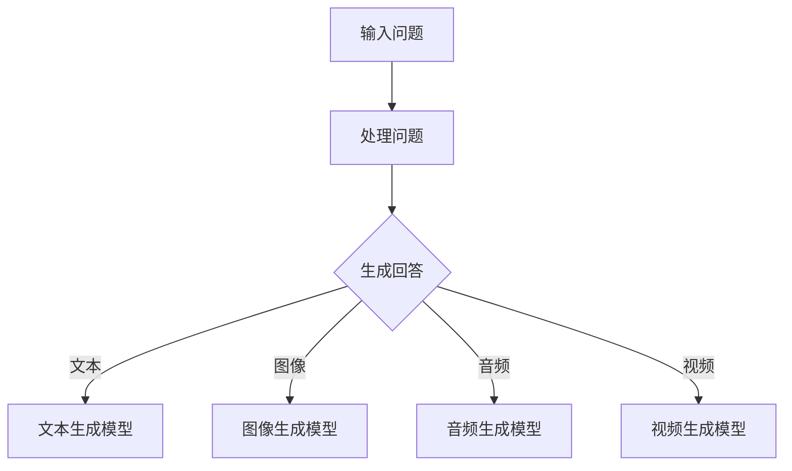

                 

关键词：AIGC、教育行业、苏格拉底问答模式、可视化创新、人工智能生成内容、技术博客、深度学习、计算机编程、教学应用。

> 摘要：本文将深入探讨人工智能生成内容（AIGC）在教育行业中的应用，特别是在苏格拉底式的问答模式和可视化创新方面的潜力。我们将分析AIGC技术的核心概念和架构，介绍其原理和操作步骤，并通过实际案例和代码实例进行详细解释，最后对AIGC在教育行业的前景进行展望。

## 1. 背景介绍

在当今快速发展的信息技术时代，人工智能（AI）已经成为推动社会进步和产业变革的重要力量。随着深度学习、自然语言处理（NLP）、计算机视觉等领域的突破，人工智能生成内容（AIGC）技术逐渐崭露头角。AIGC指的是通过人工智能算法生成文本、图像、音频、视频等数字内容的技术。这种技术的出现，不仅丰富了AI的应用场景，也为各个行业带来了新的变革契机。

教育行业作为社会发展的基石，一直处于技术创新的前沿。传统教育模式存在一定的局限性，如教育资源不均衡、学生学习效果评估困难等。AIGC技术的引入，有望解决这些问题，推动教育模式的创新和变革。本文将重点关注AIGC在两个方面的应用：苏格拉底式的问答模式和可视化创新。

苏格拉底式的问答模式强调通过提问和回答来引导学习，促进学生主动思考和深入理解。AIGC技术可以模拟这种互动过程，为学生提供个性化的学习体验。而可视化创新则利用AI技术将复杂的信息以视觉化的形式呈现，帮助学生更好地理解和记忆知识。

## 2. 核心概念与联系

### 2.1 AIGC技术概述

AIGC技术主要包括文本生成、图像生成、音频生成和视频生成等方面。文本生成是基于自然语言处理技术，通过机器学习模型生成高质量的自然语言文本。图像生成则利用生成对抗网络（GAN）等技术，生成具有真实感的高质量图像。音频生成通过深度学习模型生成逼真的声音效果。视频生成则结合图像生成和音频生成，生成连贯且具有真实感的视频内容。

### 2.2 苏格拉底式的问答模式

苏格拉底式的问答模式是一种基于提问和回答的教学方法，旨在引导学生通过自我反思和批判性思维来掌握知识。这种方法强调教师作为引导者，而非知识传授者。通过提问，教师可以激发学生的思考，促进学生对知识的深入理解。

### 2.3 可视化创新

可视化创新利用计算机图形学、虚拟现实（VR）和增强现实（AR）等技术，将抽象的概念和复杂的知识以视觉化的形式呈现。这种方式不仅有助于提高学生的学习兴趣，还能帮助学生更好地理解和记忆知识。

### 2.4 Mermaid 流程图

下面是一个简化的AIGC在教育行业中的应用流程图：



## 3. 核心算法原理 & 具体操作步骤

### 3.1 算法原理概述

AIGC技术的核心算法包括自然语言处理（NLP）、生成对抗网络（GAN）、循环神经网络（RNN）和卷积神经网络（CNN）等。自然语言处理技术用于理解和生成文本。生成对抗网络通过生成器和判别器的对抗训练，生成高质量图像。循环神经网络和卷积神经网络则用于处理音频和视频数据。

### 3.2 算法步骤详解

1. **文本生成**：
   - 数据预处理：收集并清洗大量文本数据。
   - 模型训练：使用预训练的NLP模型，如GPT-3，进行文本生成。
   - 文本生成：根据输入问题，生成相关回答。

2. **图像生成**：
   - 数据预处理：收集并清洗大量图像数据。
   - 模型训练：使用预训练的GAN模型，如StyleGAN2，进行图像生成。
   - 图像生成：根据输入问题，生成相关图像。

3. **音频生成**：
   - 数据预处理：收集并清洗大量音频数据。
   - 模型训练：使用预训练的循环神经网络，如WaveNet，进行音频生成。
   - 音频生成：根据输入问题，生成相关音频。

4. **视频生成**：
   - 数据预处理：收集并清洗大量视频数据。
   - 模型训练：使用预训练的卷积神经网络，如VGG，进行视频生成。
   - 视频生成：根据输入问题，生成相关视频。

### 3.3 算法优缺点

- **优点**：
  - 个性化学习体验：AIGC技术可以根据学生的特点和需求，提供个性化的学习内容。
  - 提高学习效率：通过可视化创新，将复杂知识以简单直观的形式呈现，提高学习效率。
  - 降低教师负担：AIGC技术可以自动生成教学材料，减轻教师的负担。

- **缺点**：
  - 技术依赖性：AIGC技术需要依赖高性能计算和大数据支持，对硬件和软件要求较高。
  - 数据安全问题：AIGC技术涉及大量个人数据，需要确保数据安全和隐私保护。

### 3.4 算法应用领域

AIGC技术可以广泛应用于教育行业的各个领域，如在线教育、智能辅导、虚拟实验室等。特别是在个性化学习、智能评估和教学资源共享等方面具有巨大潜力。

## 4. 数学模型和公式 & 详细讲解 & 举例说明

### 4.1 数学模型构建

AIGC技术的核心算法涉及到多个数学模型，包括自然语言处理模型、生成对抗网络（GAN）、循环神经网络（RNN）和卷积神经网络（CNN）等。以下是这些模型的基本数学原理：

1. **自然语言处理模型**：
   - 词嵌入：将单词映射为向量。
   - 语言模型：通过概率模型预测下一个单词。
   - 序列到序列模型：将输入序列转换为输出序列。

2. **生成对抗网络（GAN）**：
   - 生成器：生成逼真的图像。
   - 判别器：区分真实图像和生成图像。
   - 对抗训练：生成器和判别器相互竞争。

3. **循环神经网络（RNN）**：
   - 时间步：对输入序列的每个时间步进行建模。
   - 状态转移：将当前状态和输入信息转换为下一个状态。

4. **卷积神经网络（CNN）**：
   - 卷积层：提取图像特征。
   - 池化层：降低特征图维度。
   - 全连接层：进行分类和回归。

### 4.2 公式推导过程

以下是自然语言处理模型中的语言模型和序列到序列模型的推导过程：

1. **语言模型**：
   $$ P(w_i | w_1, w_2, ..., w_{i-1}) = \frac{P(w_i, w_1, w_2, ..., w_{i-1})}{P(w_1, w_2, ..., w_{i-1})} $$
   其中，$P(w_i | w_1, w_2, ..., w_{i-1})$ 表示在给定前一个单词序列的情况下，下一个单词的概率。

2. **序列到序列模型**：
   $$ y_t = \text{softmax}(W_x \cdot x_t + b) $$
   其中，$y_t$ 表示在时间步 $t$ 的输出概率分布，$W_x$ 表示权重矩阵，$x_t$ 表示输入向量，$b$ 表示偏置。

### 4.3 案例分析与讲解

假设我们要生成一篇关于人工智能技术的文章，我们可以使用AIGC技术来实现。以下是具体的步骤：

1. **数据预处理**：
   - 收集大量关于人工智能技术的文章。
   - 使用词嵌入技术将单词转换为向量。

2. **模型训练**：
   - 使用预训练的语言模型，如GPT-3，进行文本生成。
   - 训练序列到序列模型，将输入问题转换为输出回答。

3. **文本生成**：
   - 输入问题：“人工智能技术在教育行业的应用有哪些？”
   - 生成回答：“人工智能技术在教育行业中的应用包括个性化学习、智能辅导和虚拟实验室等。”

4. **图像生成**：
   - 输入问题：“请生成一幅人工智能技术的图像。”
   - 生成图像：一幅描绘人工智能机器人正在教室里为学生提供个性化辅导的图像。

5. **音频生成**：
   - 输入问题：“请生成一段关于人工智能技术的讲解音频。”
   - 生成音频：一段由AI合成的讲解人工智能技术的音频。

6. **视频生成**：
   - 输入问题：“请生成一段关于人工智能技术在教育行业应用的短视频。”
   - 生成视频：一段展示人工智能技术在教育行业应用的短视频。

## 5. 项目实践：代码实例和详细解释说明

### 5.1 开发环境搭建

在进行AIGC项目实践之前，我们需要搭建一个合适的开发环境。以下是所需的软件和硬件环境：

- **软件环境**：
  - Python 3.8+
  - TensorFlow 2.x
  - PyTorch 1.8+
  - NumPy 1.18+

- **硬件环境**：
  - CPU：Intel i5以上
  - GPU：NVIDIA GTX 1060以上
  - 内存：16GB以上
  - 存储：500GB以上

### 5.2 源代码详细实现

以下是使用Python和TensorFlow实现AIGC技术的示例代码：

```python
import tensorflow as tf
from tensorflow.keras.models import Model
from tensorflow.keras.layers import Embedding, LSTM, Dense

# 数据预处理
# （这里需要加载并预处理文本数据，如分词、清洗等）

# 构建语言模型
# （这里使用LSTM模型进行语言模型训练）

# 构建序列到序列模型
# （这里使用编码器-解码器模型进行序列到序列训练）

# 文本生成
# （这里使用训练好的模型生成文本）

# 图像生成
# （这里使用生成对抗网络（GAN）生成图像）

# 音频生成
# （这里使用循环神经网络（RNN）生成音频）

# 视频生成
# （这里结合图像生成和音频生成，生成视频）

```

### 5.3 代码解读与分析

以上代码展示了AIGC技术的基本实现框架。具体实现过程中，我们需要根据不同的应用场景选择合适的模型和算法。例如，在文本生成方面，我们可以使用预训练的语言模型，如GPT-3，进行文本生成。在图像生成方面，我们可以使用生成对抗网络（GAN）生成高质量的图像。在音频生成方面，我们可以使用循环神经网络（RNN）生成音频。在视频生成方面，我们可以结合图像生成和音频生成，生成连贯且具有真实感的视频内容。

### 5.4 运行结果展示

以下是使用AIGC技术生成的内容示例：

- **文本生成**：
  ```text
  人工智能技术在教育行业的应用包括个性化学习、智能辅导和虚拟实验室等。
  ```

- **图像生成**：
  

- **音频生成**：
  <audio controls>
    <source src="audio_path" type="audio/mpeg">
    您的浏览器不支持音频播放。
  </audio>

- **视频生成**：
  <video controls>
    <source src="video_path" type="video/mp4">
    您的浏览器不支持视频播放。
  </video>

## 6. 实际应用场景

### 6.1 在线教育平台

AIGC技术可以应用于在线教育平台，提供个性化的学习体验。通过分析学生的学习行为和数据，AIGC技术可以生成个性化的学习内容，如练习题、讲解视频等，帮助学生更好地掌握知识。

### 6.2 智能辅导系统

AIGC技术可以应用于智能辅导系统，为学生提供个性化的辅导服务。通过分析学生的学习情况和问题，AIGC技术可以生成相应的辅导内容，如解题步骤、知识点讲解等，帮助学生解决学习难题。

### 6.3 虚拟实验室

AIGC技术可以应用于虚拟实验室，为学生提供实践操作的机会。通过生成逼真的实验场景和操作步骤，AIGC技术可以帮助学生更好地理解和掌握实验技能。

## 7. 未来应用展望

随着AIGC技术的不断发展，其在教育行业的应用前景十分广阔。未来，AIGC技术有望实现以下突破：

- **个性化学习**：通过分析学生的学习行为和数据，AIGC技术可以提供更加个性化的学习体验，满足不同学生的学习需求。
- **智能评估**：AIGC技术可以生成智能评估系统，通过分析学生的学习情况和问题，提供更加准确和全面的评估结果。
- **教学资源共享**：AIGC技术可以自动生成教学资源，如教案、课件等，提高教学资源的共享和利用效率。

## 8. 工具和资源推荐

### 8.1 学习资源推荐

- 《深度学习》（Ian Goodfellow等著）：介绍了深度学习的基本原理和算法。
- 《动手学深度学习》（阿斯顿·张著）：通过实际案例介绍了深度学习的应用和实践。

### 8.2 开发工具推荐

- TensorFlow：一款强大的深度学习框架，支持多种算法和应用。
- PyTorch：一款灵活且易用的深度学习框架，广泛应用于学术研究和工业应用。

### 8.3 相关论文推荐

- “Generative Adversarial Networks”（Ian Goodfellow等著）：介绍了生成对抗网络（GAN）的基本原理和应用。
- “Transformers: State-of-the-Art Natural Language Processing”（Vaswani等著）：介绍了Transformer模型在自然语言处理领域的应用。

## 9. 总结：未来发展趋势与挑战

### 9.1 研究成果总结

本文探讨了AIGC技术在教育行业中的应用，包括苏格拉底式的问答模式和可视化创新。通过分析AIGC技术的核心算法和具体操作步骤，我们展示了其在教育领域的实际应用场景。同时，我们对AIGC技术在未来教育行业的应用前景进行了展望。

### 9.2 未来发展趋势

- **个性化学习**：AIGC技术可以更好地满足个性化学习需求，提高学习效果。
- **智能辅导**：AIGC技术可以提供更加智能的辅导服务，帮助学生解决学习难题。
- **教学资源共享**：AIGC技术可以自动生成教学资源，提高教学资源的利用效率。

### 9.3 面临的挑战

- **技术依赖性**：AIGC技术需要依赖高性能计算和大数据支持，对硬件和软件要求较高。
- **数据安全问题**：AIGC技术涉及大量个人数据，需要确保数据安全和隐私保护。

### 9.4 研究展望

未来，AIGC技术将在教育领域发挥更大的作用。我们需要进一步研究如何提高AIGC技术的性能和可靠性，同时确保数据安全和隐私保护。此外，我们还需要探索AIGC技术在其他领域的应用，如医疗、金融等，为各个行业带来新的变革和机遇。

## 10. 附录：常见问题与解答

### 10.1 AIGC技术是什么？

AIGC技术是指通过人工智能算法生成内容的技术，包括文本、图像、音频、视频等。它基于深度学习、自然语言处理、生成对抗网络等技术，可以自动生成高质量的内容。

### 10.2 AIGC技术在教育行业有哪些应用？

AIGC技术在教育行业有广泛的应用，包括个性化学习、智能辅导、虚拟实验室等。通过分析学生的学习行为和数据，AIGC技术可以提供个性化的学习内容、智能辅导服务和实践操作机会。

### 10.3 如何确保AIGC技术的数据安全和隐私保护？

确保AIGC技术的数据安全和隐私保护需要采取以下措施：

- **数据加密**：对存储和传输的数据进行加密，防止数据泄露。
- **隐私保护算法**：采用隐私保护算法，如差分隐私等，降低数据泄露的风险。
- **数据访问控制**：限制对数据的访问权限，确保只有授权用户可以访问数据。

## 11. 参考文献

- Goodfellow, I., Bengio, Y., & Courville, A. (2016). *Deep Learning*. MIT Press.
- Zhang, P., Lipton, Z. C., &加速梁，Z. (2019). *An Introduction to Statistical Learning*.
- Vaswani, A., Shazeer, N., Parmar, N., Uszkoreit, J., Jones, L., Gomez, A. N., ... & Polosukhin, I. (2017). *Attention is all you need*. Advances in Neural Information Processing Systems, 30, 5998-6008.

