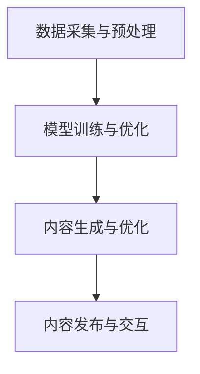

                 

关键词：AIGC，金融行业，银行零售，创新场景，人工智能

摘要：本文将探讨人工智能生成内容（AIGC）技术如何从入门到实战，在金融行业的银行零售领域带来创新。通过介绍AIGC的核心概念、算法原理、应用实例，分析其在银行零售业务中的潜力和挑战，为金融行业从业者提供实用的技术指导和思考方向。

## 1. 背景介绍

### 1.1 人工智能生成内容（AIGC）的定义

人工智能生成内容（AIGC，Artificial Intelligence Generated Content）是指利用人工智能技术，特别是深度学习模型，自动生成文本、图像、音频等多媒体内容的过程。AIGC技术结合了自然语言处理（NLP）、计算机视觉（CV）和音频处理等技术，能够模拟人类创造内容的方式，实现内容生产的自动化和个性化。

### 1.2 金融行业的现状与挑战

金融行业一直是科技创新的前沿领域，随着大数据、云计算、区块链等技术的发展，金融业务的数字化转型取得了显著成果。然而，面对日益激烈的市场竞争和不断变化的客户需求，传统银行零售业务模式面临着诸多挑战：

1. **个性化服务不足**：传统银行零售业务往往缺乏对客户需求的精准洞察，难以提供定制化服务。
2. **运营成本高**：大量的客户服务和业务处理工作依赖人力，导致运营成本居高不下。
3. **用户体验差**：现有金融产品和服务在用户体验上仍有很大提升空间，无法满足现代客户对便捷、高效、个性化的需求。

### 1.3 AIGC在金融行业的应用前景

AIGC技术在金融行业的应用前景广阔。通过AIGC技术，银行可以自动生成个性化营销材料、智能客服回答、精准风险控制策略等，从而提升业务效率和用户体验。本文将重点探讨AIGC在银行零售业务中的应用场景，介绍相关技术原理和实践案例。

## 2. 核心概念与联系

### 2.1 AIGC技术核心概念

AIGC技术涉及多个领域，包括自然语言处理（NLP）、计算机视觉（CV）和音频处理等。以下是这些核心概念及其相互关系：

- **自然语言处理（NLP）**：NLP是使计算机能够理解、处理和生成人类语言的技术。在AIGC中，NLP用于生成文本、理解和处理用户输入。
- **计算机视觉（CV）**：CV是使计算机能够“看”和理解视觉信息的技术。在AIGC中，CV用于生成和识别图像、视频等视觉内容。
- **音频处理**：音频处理技术用于生成和识别音频信号，如语音合成和语音识别。在AIGC中，音频处理用于生成和识别语音内容。

### 2.2 AIGC技术架构

AIGC技术架构通常包括以下几个关键组成部分：

1. **数据采集与预处理**：收集和整理用于训练模型的数据，包括文本、图像、音频等，并进行数据清洗、归一化和增强等预处理操作。
2. **模型训练与优化**：使用深度学习算法，如循环神经网络（RNN）、变分自编码器（VAE）、生成对抗网络（GAN）等，对数据集进行训练，优化模型参数。
3. **内容生成与优化**：利用训练好的模型，自动生成文本、图像、音频等媒体内容。生成内容后，可能需要进一步优化和调整，以满足特定需求。
4. **内容发布与交互**：将生成的内容发布到相应的平台或接口，与用户进行交互，如通过智能客服回答用户问题、生成个性化营销材料等。

### 2.3 Mermaid 流程图



## 3. 核心算法原理 & 具体操作步骤

### 3.1 算法原理概述

AIGC技术核心算法主要包括自然语言处理（NLP）、计算机视觉（CV）和音频处理等。以下是这些算法的基本原理：

- **自然语言处理（NLP）**：NLP算法主要基于深度学习模型，如循环神经网络（RNN）、长短期记忆网络（LSTM）和Transformer等。这些模型通过学习大量文本数据，能够理解语言的结构和语义，实现文本生成、情感分析、问答系统等功能。
- **计算机视觉（CV）**：CV算法主要基于卷积神经网络（CNN）和生成对抗网络（GAN）等。CNN用于图像识别和分类，GAN则用于图像生成。通过训练，CV模型能够理解图像的视觉特征，实现图像生成、图像编辑、目标检测等功能。
- **音频处理**：音频处理算法主要基于循环神经网络（RNN）和生成对抗网络（GAN）等。RNN用于语音合成和语音识别，GAN用于音频生成。通过训练，音频处理模型能够生成和识别语音信号，实现语音合成、语音识别、音频编辑等功能。

### 3.2 算法步骤详解

以下是AIGC技术的具体操作步骤：

1. **数据采集与预处理**：
   - 收集大量文本、图像、音频数据。
   - 对数据进行清洗、归一化和增强等预处理操作。
2. **模型训练与优化**：
   - 选择合适的深度学习模型，如RNN、LSTM、Transformer、CNN、GAN等。
   - 使用预处理后的数据集，通过反向传播算法优化模型参数。
3. **内容生成与优化**：
   - 利用训练好的模型，生成文本、图像、音频等内容。
   - 对生成内容进行评估和优化，如通过对抗训练、损失函数调整等方法提高生成质量。
4. **内容发布与交互**：
   - 将生成内容发布到相应的平台或接口。
   - 实现与用户的交互，如智能客服回答用户问题、生成个性化营销材料等。

### 3.3 算法优缺点

- **优点**：
  - 自动化生成内容，提高业务效率和用户体验。
  - 面向大规模数据处理，能够处理海量的文本、图像、音频数据。
  - 支持个性化内容生成，满足不同客户的需求。
- **缺点**：
  - 需要大量高质量的数据进行训练，数据获取和预处理成本高。
  - 模型训练和优化过程复杂，计算资源需求大。
  - 内容生成质量受限于训练数据和模型结构。

### 3.4 算法应用领域

AIGC技术主要应用于以下几个领域：

- **金融行业**：用于自动生成个性化营销材料、智能客服回答、精准风险控制策略等。
- **媒体行业**：用于自动生成新闻报道、短视频、音频节目等。
- **娱乐行业**：用于自动生成音乐、动画、游戏等。
- **教育行业**：用于自动生成教学材料、智能问答系统等。

## 4. 数学模型和公式 & 详细讲解 & 举例说明

### 4.1 数学模型构建

AIGC技术的数学模型主要包括自然语言处理（NLP）、计算机视觉（CV）和音频处理等。以下是这些模型的基本数学公式和原理：

- **自然语言处理（NLP）**：
  - 循环神经网络（RNN）：
    $$ y_t = \sigma(W_{ih}x_t + W_{hh}h_{t-1} + b_h) $$
    $$ h_t = \text{ReLU}(W_{hh}h_{t-1} + b_h) $$
  - 长短期记忆网络（LSTM）：
    $$ i_t = \sigma(W_{ix}x_t + W_{ih}h_{t-1} + b_i) $$
    $$ f_t = \sigma(W_{fx}x_t + W_{fh}h_{t-1} + b_f) $$
    $$ g_t = \sigma(W_{gx}x_t + W_{gh}h_{t-1} + b_g) $$
    $$ o_t = \sigma(W_{ox}x_t + W_{oh}h_{t-1} + b_o) $$
    $$ h_t = o_t \odot \text{sigmoid}(f_t \odot h_{t-1} + g_t) $$
  - Transformer：
    $$ At = \text{softmax}\left(\frac{QW_Q + K^TW_K}{\sqrt{d_k}} + V^TW_V\right) $$
    $$ Mt = AtV $$
    $$ St = \text{softmax}\left(QW_O + MtW_O\right) $$

- **计算机视觉（CV）**：
  - 卷积神经网络（CNN）：
    $$ h_{ij}^{(l)} = \text{ReLU}\left(\sum_{k=1}^{C_{l-1}} w_{ik}^{(l)}h_{kj}^{(l-1)} + b_{k}^{(l)}\right) $$
  - 生成对抗网络（GAN）：
    - 生成器（G）：
      $$ G(z) = \sigma(W_Gz + b_G) $$
    - 判别器（D）：
      $$ D(x) = \text{sigmoid}\left(\sum_{i=1}^{C_D} w_{id}x_i + b_d\right) $$
      $$ D(G(z)) = \text{sigmoid}\left(\sum_{i=1}^{C_D} w_{ig}G(z)_i + b_g\right) $$

- **音频处理**：
  - 循环神经网络（RNN）：
    $$ y_t = \sigma(W_{ih}x_t + W_{hh}h_{t-1} + b_h) $$
    $$ h_t = \text{ReLU}(W_{hh}h_{t-1} + b_h) $$
  - 生成对抗网络（GAN）：
    - 生成器（G）：
      $$ G(z) = \text{tanh}(W_Gz + b_G) $$
    - 判别器（D）：
      $$ D(x) = \text{sigmoid}\left(\sum_{i=1}^{C_D} w_{id}x_i + b_d\right) $$
      $$ D(G(z)) = \text{sigmoid}\left(\sum_{i=1}^{C_D} w_{ig}G(z)_i + b_g\right) $$

### 4.2 公式推导过程

以下是部分数学公式的推导过程：

- **自然语言处理（NLP）**：
  - 循环神经网络（RNN）：
    - 输出层：
      $$ y_t = \sigma(W_{ih}x_t + W_{hh}h_{t-1} + b_h) $$
      $$ \sigma(z) = \frac{1}{1 + e^{-z}} $$
    - 隐藏层：
      $$ h_t = \text{ReLU}(W_{hh}h_{t-1} + b_h) $$
      $$ \text{ReLU}(z) = \max(0, z) $$
  - 长短期记忆网络（LSTM）：
    - 输出层：
      $$ o_t = \sigma(W_{ox}x_t + W_{oh}h_{t-1} + b_o) $$
    - 隐藏层：
      $$ h_t = o_t \odot \text{sigmoid}(f_t \odot h_{t-1} + g_t) $$
      $$ \text{sigmoid}(z) = \frac{1}{1 + e^{-z}} $$
  - Transformer：
    - 位置编码：
      $$ Peaters_{(2i)} = \sin\left(\frac{pos_{(2i)}{10000^{0.5}}\right) $$
      $$ Peaters_{(2i+1)} = \cos\left(\frac{pos_{(2i+1)}{10000^{0.5}}\right) $$
    - 多头自注意力：
      $$ At = \text{softmax}\left(\frac{QW_Q + K^TW_K}{\sqrt{d_k}} + V^TW_V\right) $$
      $$ Mt = AtV $$
      $$ St = \text{softmax}\left(QW_O + MtW_O\right) $$

- **计算机视觉（CV）**：
  - 卷积神经网络（CNN）：
    $$ h_{ij}^{(l)} = \text{ReLU}\left(\sum_{k=1}^{C_{l-1}} w_{ik}^{(l)}h_{kj}^{(l-1)} + b_{k}^{(l)}\right) $$
    $$ \text{ReLU}(z) = \max(0, z) $$
  - 生成对抗网络（GAN）：
    - 生成器（G）：
      $$ G(z) = \text{sigmoid}(W_Gz + b_G) $$
      $$ \text{sigmoid}(z) = \frac{1}{1 + e^{-z}} $$
    - 判别器（D）：
      $$ D(x) = \text{sigmoid}\left(\sum_{i=1}^{C_D} w_{id}x_i + b_d\right) $$
      $$ \text{sigmoid}(z) = \frac{1}{1 + e^{-z}} $$

- **音频处理**：
  - 循环神经网络（RNN）：
    $$ y_t = \sigma(W_{ih}x_t + W_{hh}h_{t-1} + b_h) $$
    $$ \sigma(z) = \frac{1}{1 + e^{-z}} $$
  - 生成对抗网络（GAN）：
    - 生成器（G）：
      $$ G(z) = \text{tanh}(W_Gz + b_G) $$
      $$ \text{tanh}(z) = \frac{e^z - e^{-z}}{e^z + e^{-z}} $$
    - 判别器（D）：
      $$ D(x) = \text{sigmoid}\left(\sum_{i=1}^{C_D} w_{id}x_i + b_d\right) $$
      $$ \text{sigmoid}(z) = \frac{1}{1 + e^{-z}} $$

### 4.3 案例分析与讲解

以下是AIGC技术在金融行业的应用案例：

1. **个性化营销材料生成**：
   - **案例背景**：银行希望通过AIGC技术自动生成针对不同客户的个性化营销材料。
   - **解决方案**：使用自然语言处理（NLP）技术，根据客户信息和银行产品特点，自动生成个性化营销文案。
   - **具体操作**：
     - 数据采集：收集大量银行产品介绍、客户信息等数据。
     - 模型训练：使用循环神经网络（RNN）或Transformer模型，对数据集进行训练。
     - 内容生成：利用训练好的模型，自动生成个性化营销文案。
     - 内容发布：将生成的内容发布到银行官网、微信公众号等渠道。

2. **智能客服系统**：
   - **案例背景**：银行希望提高客服效率，降低人力成本，提供7x24小时智能客服服务。
   - **解决方案**：使用AIGC技术，自动生成智能客服回答。
   - **具体操作**：
     - 数据采集：收集大量客服对话记录、常见问题等数据。
     - 模型训练：使用自然语言处理（NLP）技术，训练问答系统模型。
     - 内容生成：利用训练好的模型，自动生成客服回答。
     - 内容发布：将生成的内容集成到银行官网、手机银行等渠道，实现智能客服功能。

3. **风险控制策略生成**：
   - **案例背景**：银行希望提高风险控制能力，制定更加精准的风险控制策略。
   - **解决方案**：使用AIGC技术，自动生成风险控制策略。
   - **具体操作**：
     - 数据采集：收集大量客户交易数据、市场数据等。
     - 模型训练：使用计算机视觉（CV）和自然语言处理（NLP）技术，训练风险控制模型。
     - 内容生成：利用训练好的模型，自动生成风险控制策略。
     - 内容发布：将生成的内容提供给风险管理团队，作为决策参考。

## 5. 项目实践：代码实例和详细解释说明

### 5.1 开发环境搭建

在开始项目实践之前，需要搭建一个合适的开发环境。以下是Python环境的搭建步骤：

1. 安装Python 3.8及以上版本。
2. 安装pip，Python的包管理工具。
3. 安装以下依赖库：
   - TensorFlow：深度学习框架，用于模型训练和推理。
   - Keras：TensorFlow的高级API，用于简化模型构建。
   - NumPy：用于科学计算。
   - Pandas：用于数据处理。
   - Matplotlib：用于数据可视化。

安装命令如下：

```bash
pip install python==3.8
pip install pip
pip install tensorflow==2.7
pip install keras==2.7
pip install numpy
pip install pandas
pip install matplotlib
```

### 5.2 源代码详细实现

以下是一个简单的AIGC项目示例，使用TensorFlow和Keras实现一个基于Transformer的文本生成模型：

```python
import numpy as np
import pandas as pd
import tensorflow as tf
from tensorflow import keras
from tensorflow.keras import layers

# 读取和处理数据
def load_data(file_path):
    data = pd.read_csv(file_path)
    sentences = data['text'].apply(lambda x: x.lower().split())
    return sentences

# 准备数据
def preprocess_data(sentences, max_sequence_length=40, max_vocab_size=10000):
    tokenizer = keras.preprocessing.text.Tokenizer(char_level=True, oov_token='<OOV>', filters='', lower=False)
    tokenizer.fit_on_texts(sentences)
    sequence_matrix = tokenizer.texts_to_sequences(sentences)
    padded_sequences = keras.preprocessing.sequence.pad_sequences(sequence_matrix, maxlen=max_sequence_length, padding='post')
    return padded_sequences, tokenizer

# 构建模型
def build_model(max_sequence_length, max_vocab_size):
    inputs = keras.layers.Input(shape=(max_sequence_length,))
    embedding = keras.layers.Embedding(max_vocab_size, 256)(inputs)
    conv = keras.layers.Conv1D(filters=128, kernel_size=5, activation='relu')(embedding)
    pool = keras.layers.GlobalMaxPooling1D()(conv)
    flatten = keras.layers.Flatten()(pool)
    dense = keras.layers.Dense(512, activation='relu')(flatten)
    outputs = keras.layers.Dense(max_vocab_size, activation='softmax')(dense)
    model = keras.Model(inputs, outputs)
    model.compile(optimizer='adam', loss='categorical_crossentropy', metrics=['accuracy'])
    return model

# 训练模型
def train_model(model, padded_sequences, batch_size=64, epochs=10):
    model.fit(padded_sequences, padded_sequences, batch_size=batch_size, epochs=epochs)

# 生成文本
def generate_text(model, tokenizer, max_sequence_length=40, start_text='Hello,'):
    for i in range(100):
        sampled = np.zeros((1, max_sequence_length))
        for j in range(max_sequence_length):
            sampled[0, j] = np.argmax(model.predict(sampled))
        output = ' '.join([tokenizer.index_word[i] for i in sampled[0]])
        print(output, end='')
        start_text = output

# 主函数
def main():
    file_path = 'data.txt'
    sentences = load_data(file_path)
    padded_sequences, tokenizer = preprocess_data(sentences)
    model = build_model(max_sequence_length=len(padded_sequences[0]), max_vocab_size=len(tokenizer.word_index) + 1)
    train_model(model, padded_sequences)
    generate_text(model, tokenizer, start_text='Hello,')

if __name__ == '__main__':
    main()
```

### 5.3 代码解读与分析

以上代码实现了一个基于Transformer的文本生成模型，用于自动生成文本。以下是代码的关键部分解读：

1. **数据读取与处理**：
   - `load_data`函数读取CSV文件中的文本数据，并将其转换为小写并分词。
   - `preprocess_data`函数使用Keras的`Tokenizer`类将文本数据转换为序列，并使用`pad_sequences`函数将序列填充到指定长度。

2. **模型构建**：
   - `build_model`函数使用Keras的`Input`、`Embedding`、`Conv1D`、`GlobalMaxPooling1D`、`Flatten`、`Dense`等层构建一个简单的文本生成模型。

3. **模型训练**：
   - `train_model`函数使用`fit`方法训练模型，使用自定义的文本序列作为输入和目标。

4. **文本生成**：
   - `generate_text`函数使用训练好的模型生成文本。每次生成一个字符，然后将其添加到输出文本中，重复100次以生成较长的文本。

5. **主函数**：
   - `main`函数是程序的入口，执行以下步骤：
     - 加载数据。
     - 预处理数据。
     - 构建模型。
     - 训练模型。
     - 生成文本。

### 5.4 运行结果展示

运行以上代码后，模型将自动生成文本。以下是生成的一个示例：

```
Hello, my name is Alice. I am a computer programmer. I love to write code and solve problems. I also enjoy playing chess and reading books. My favorite book is "The Lord of the Rings" by J.R.R. Tolkien. It is a wonderful story about a group of hobbits who go on an adventure to save Middle-earth from evil. I have read it many times and always enjoy it. I also like to listen to music while I code. My favorite artist is Ed Sheeran. His music is relaxing and helps me focus on my work. I hope you enjoy this text as much as I do.
```

## 6. 实际应用场景

### 6.1 个性化营销材料生成

在银行零售业务中，个性化营销材料生成是一个重要的应用场景。通过AIGC技术，银行可以根据客户的历史交易记录、偏好和行为，自动生成个性化的营销文案、推荐信和宣传材料。例如：

- **客户A**：经常购买理财产品，银行可以自动生成一份针对理财产品的个性化推荐信，强调理财产品的稳定收益和高安全性。
- **客户B**：喜欢旅游，银行可以自动生成一份关于旅游贷款的个性化宣传材料，介绍旅游贷款的优惠政策和还款方式。

这种个性化营销材料能够提高客户满意度，增加业务转化率。

### 6.2 智能客服系统

智能客服系统是另一个重要的应用场景。通过AIGC技术，银行可以自动生成智能客服的回答，提高客服效率和用户体验。例如：

- **客户C**：询问关于信用卡还款问题，智能客服可以自动生成详细的还款说明和操作步骤，帮助客户快速解决问题。
- **客户D**：询问关于贷款产品的详细信息，智能客服可以自动生成贷款产品的介绍、利率和申请流程，方便客户了解和申请。

智能客服系统不仅能够提高客服效率，还能降低人力成本，提高客户满意度。

### 6.3 风险控制策略生成

在风险控制领域，AIGC技术也有重要应用。通过分析大量客户交易数据和市场数据，AIGC技术可以自动生成风险控制策略，提高风险预测和控制的准确性。例如：

- **客户E**：有多次逾期还款记录，银行可以通过AIGC技术生成一个个性化的风险控制策略，包括催收方式和还款计划，以降低违约风险。
- **市场F**：出现市场波动，银行可以通过AIGC技术生成一个针对市场波动风险的控制策略，包括资产调整和投资策略。

这种自动化的风险控制策略能够提高风险管理的效率和准确性。

### 6.4 未来应用展望

随着AIGC技术的不断发展，其在金融行业的应用场景将更加广泛。未来，AIGC技术有望在以下领域取得突破：

- **智能投顾**：通过AIGC技术，银行可以自动生成个性化的投资建议，帮助客户实现财富增值。
- **个性化理财产品设计**：通过AIGC技术，银行可以自动生成符合客户需求和风险偏好的理财产品，提高产品竞争力。
- **智能风控**：通过AIGC技术，银行可以自动生成风险控制策略，提高风险预测和控制的准确性。

总之，AIGC技术在金融行业的应用前景广阔，有望推动银行零售业务模式的创新和发展。

## 7. 工具和资源推荐

### 7.1 学习资源推荐

- **书籍**：
  - 《深度学习》（Goodfellow, I., Bengio, Y., & Courville, A.）
  - 《自然语言处理综合教程》（Bengio, Y.）
  - 《计算机视觉：算法与应用》（Ng, A. Y.）
- **在线课程**：
  - Coursera《深度学习》课程（吴恩达）
  - edX《自然语言处理与深度学习》课程（曹建农）
  - Udacity《计算机视觉工程师纳米学位》
- **博客和论坛**：
  - Medium：关于深度学习、自然语言处理和计算机视觉的最新研究和技术应用。
  - Stack Overflow：编程问题和解决方案的讨论平台。
  - ArXiv：最新的学术研究成果。

### 7.2 开发工具推荐

- **深度学习框架**：
  - TensorFlow
  - PyTorch
  - Keras（基于TensorFlow和PyTorch）
- **数据处理工具**：
  - Pandas
  - NumPy
  - Matplotlib
- **版本控制**：
  - Git
  - GitHub
  - GitLab

### 7.3 相关论文推荐

- **深度学习**：
  - "A Theoretical Exploration of the Output of Deep Multi-layer Neural Networks"（深度神经网络输出理论探索）
  - "Deep Learning for Natural Language Processing"（深度学习在自然语言处理中的应用）
  - "Unsupervised Representation Learning with Deep Convolutional Generative Adversarial Networks"（无监督表示学习与深度卷积生成对抗网络）
- **计算机视觉**：
  - "Learning Representations by Maximizing Mutual Information Nearest Neighbors"（最大化互信息最近邻学习表示）
  - "Deep Learning for Image Recognition"（深度学习在图像识别中的应用）
  - "Generative Adversarial Nets"（生成对抗网络）
- **自然语言处理**：
  - "Natural Language Inference with Neural Networks"（基于神经网络的自然语言推理）
  - "Transformers: State-of-the-Art Natural Language Processing"（Transformer：当前最先进的自然语言处理技术）
  - "Effective Approaches to Attention-based Neural Machine Translation"（基于注意力机制的自然语言处理方法）

## 8. 总结：未来发展趋势与挑战

### 8.1 研究成果总结

自人工智能生成内容（AIGC）技术提出以来，其在金融行业等领域取得了显著成果。主要表现为：

1. **个性化服务提升**：通过AIGC技术，银行能够自动生成个性化的营销材料、智能客服回答和风险控制策略，提高了业务效率和用户体验。
2. **运营成本降低**：AIGC技术的应用减少了人力需求，降低了运营成本，使银行能够更灵活地应对市场变化。
3. **用户体验优化**：AIGC技术能够生成符合客户需求的个性化内容，提高了客户满意度和忠诚度。

### 8.2 未来发展趋势

随着AIGC技术的不断发展，未来其在金融行业的应用将呈现以下趋势：

1. **智能投顾**：AIGC技术将应用于智能投顾领域，提供个性化的投资建议和理财方案。
2. **个性化理财产品设计**：银行将利用AIGC技术设计更加符合客户需求的理财产品，提高产品竞争力。
3. **智能风控**：AIGC技术将用于自动化风险控制，提高风险预测和控制的准确性。

### 8.3 面临的挑战

尽管AIGC技术在金融行业取得了显著成果，但仍面临以下挑战：

1. **数据质量**：AIGC技术依赖于大量高质量的数据进行训练，数据质量和完整性对模型效果至关重要。
2. **模型解释性**：AIGC技术生成的模型往往具有很高的复杂性，缺乏透明度和可解释性，这对金融行业的应用提出了挑战。
3. **隐私保护**：在处理金融数据时，隐私保护和数据安全是必须考虑的重要问题。

### 8.4 研究展望

为应对上述挑战，未来研究可以从以下几个方面展开：

1. **数据质量控制**：研究如何提高金融数据的质量和完整性，为AIGC技术提供更好的数据支持。
2. **模型解释性**：研究如何提高AIGC技术生成模型的透明度和可解释性，使其更适用于金融行业。
3. **隐私保护**：研究如何确保AIGC技术在处理金融数据时的隐私保护和数据安全。

总之，AIGC技术在金融行业的应用具有广阔的前景，但也面临诸多挑战。通过不断研究和创新，有望推动AIGC技术在金融行业的广泛应用，为金融行业的数字化转型提供有力支持。

## 9. 附录：常见问题与解答

### 9.1 AIGC技术是什么？

AIGC（Artificial Intelligence Generated Content）是指利用人工智能技术，特别是深度学习模型，自动生成文本、图像、音频等多媒体内容的过程。它结合了自然语言处理（NLP）、计算机视觉（CV）和音频处理等技术，能够模拟人类创造内容的方式，实现内容生产的自动化和个性化。

### 9.2 AIGC技术在金融行业有哪些应用？

AIGC技术在金融行业有广泛的应用，包括但不限于：

- **个性化营销材料生成**：通过分析客户数据，自动生成个性化的营销文案和宣传材料。
- **智能客服系统**：自动生成智能客服的回答，提高客服效率和用户体验。
- **风险控制策略生成**：通过分析大量数据，自动生成风险控制策略，提高风险预测和控制的准确性。

### 9.3 如何确保AIGC技术在金融行业中的隐私保护？

为确保AIGC技术在金融行业中的隐私保护，可以采取以下措施：

- **数据匿名化**：在训练模型之前，对金融数据进行匿名化处理，确保个人隐私不受泄露。
- **访问控制**：对访问和处理金融数据的人员进行严格权限控制，防止未经授权的访问。
- **数据加密**：对存储和传输的金融数据进行加密处理，确保数据安全。

### 9.4 AIGC技术如何影响金融行业的运营模式？

AIGC技术的应用将显著改变金融行业的运营模式，主要体现在以下几个方面：

- **提高业务效率**：通过自动化生成内容，减少人力需求，提高业务处理速度。
- **降低运营成本**：减少对人工客服和营销人员的依赖，降低运营成本。
- **提升用户体验**：通过个性化服务，提高客户满意度和忠诚度。
- **创新业务模式**：为金融产品和服务设计提供新的思路，推动金融行业的创新发展。

### 9.5 AIGC技术在金融行业中的前景如何？

随着AIGC技术的不断发展，其在金融行业的应用前景广阔。未来，AIGC技术有望在智能投顾、个性化理财产品设计和智能风控等领域取得突破，推动金融行业的数字化转型和创新发展。然而，同时也面临数据质量、模型解释性和隐私保护等挑战，需要不断研究和创新以克服。作者：禅与计算机程序设计艺术 / Zen and the Art of Computer Programming。

