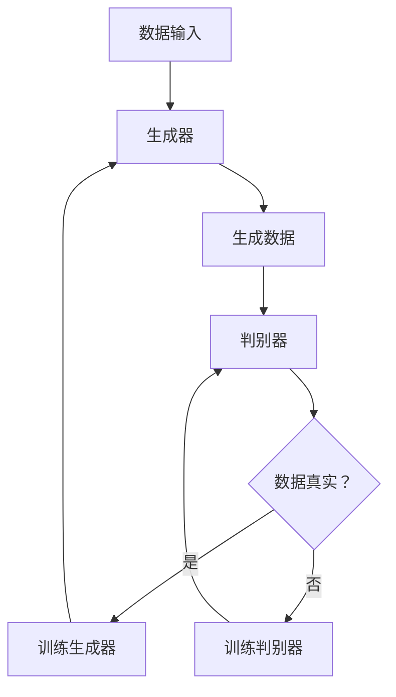

                 

关键词：人工智能生成内容（AIGC）、生成对抗网络（GAN）、自然语言处理（NLP）、深度学习、计算机视觉、机器学习、编程实践、数学模型、算法原理

## 摘要

本文将深入探讨人工智能生成内容（AIGC）的概念、核心算法原理、数学模型及其在实际项目中的应用。通过详细的讲解和实例分析，读者将了解AIGC如何从入门到实战，从而在深度学习、自然语言处理和计算机视觉等领域中发挥作用。文章还将提供相关工具和资源的推荐，帮助读者进一步探索AIGC的广阔应用前景。

## 1. 背景介绍

### 1.1 人工智能生成内容（AIGC）的概念

人工智能生成内容（AIGC）是指利用人工智能技术，尤其是生成对抗网络（GAN）、变分自编码器（VAE）等深度学习模型，自动生成高质量、多样化的数据内容。这些内容可以包括图像、音频、视频、文本等不同形式，广泛应用于游戏、设计、影视、广告、教育等多个领域。

### 1.2 AIGC的发展历程

AIGC的发展可以追溯到生成对抗网络（GAN）的提出。GAN由Ian Goodfellow等人于2014年提出，是一种基于博弈理论的深度学习模型，通过生成器（Generator）和判别器（Discriminator）的对抗训练，生成具有高度真实性的数据。此后，变分自编码器（VAE）等类似模型也相继提出，进一步推动了AIGC技术的发展。

## 2. 核心概念与联系

### 2.1 核心概念

- **生成对抗网络（GAN）**：由生成器和判别器组成，通过相互对抗训练，生成器尝试生成逼真的数据，而判别器则判断数据的真实性。
- **变分自编码器（VAE）**：通过引入变分推断方法，将数据分布编码为一个隐变量，能够生成具有多样性的数据。

### 2.2 架构与联系


### 2.3 Mermaid流程图



## 3. 核心算法原理 & 具体操作步骤

### 3.1 算法原理概述

生成对抗网络（GAN）的工作原理是生成器和判别器的对抗训练。生成器G试图生成尽可能逼真的数据，而判别器D则试图区分真实数据和生成数据。两者的训练目标是最大化彼此的损失函数。

### 3.2 算法步骤详解

1. **初始化**：生成器G和判别器D都使用随机权重初始化。
2. **生成数据**：生成器G根据随机噪声生成一组数据。
3. **判别数据**：判别器D将真实数据和生成数据输入，并输出概率。
4. **计算损失**：计算生成器和判别器的损失函数。
5. **反向传播**：利用损失函数梯度更新生成器和判别器的权重。
6. **迭代训练**：重复步骤2-5，直到生成器能够生成逼真的数据。

### 3.3 算法优缺点

**优点**：
- **生成效果逼真**：通过对抗训练，生成器能够生成高度真实的数据。
- **适用范围广泛**：适用于图像、文本、音频等多种类型的数据生成。

**缺点**：
- **训练难度大**：GAN的训练过程不稳定，容易陷入模式崩溃等问题。
- **计算资源消耗大**：训练过程需要大量的计算资源。

### 3.4 算法应用领域

- **图像生成**：如人脸生成、风景生成等。
- **文本生成**：如文章生成、对话生成等。
- **音频生成**：如音乐生成、声音合成等。

## 4. 数学模型和公式 & 详细讲解 & 举例说明

### 4.1 数学模型构建

GAN的核心数学模型包括生成器和判别器。

#### 生成器

生成器G的输入为随机噪声z，输出为生成数据x'：

$$
x' = G(z)
$$

#### 判别器

判别器D的输入为真实数据x和生成数据x'，输出为概率p：

$$
p = D(x) = D(G(z))
$$

### 4.2 公式推导过程

GAN的目标是最小化生成器的损失函数和最大化判别器的损失函数。

生成器的损失函数：

$$
L_G = -\log(D(G(z)))
$$

判别器的损失函数：

$$
L_D = -\log(D(x)) - \log(1 - D(G(z)))
$$

### 4.3 案例分析与讲解

假设我们使用GAN生成人脸图像。

**生成器**：

输入随机噪声z，生成人脸图像x'：

$$
x' = G(z)
$$

**判别器**：

输入真实人脸图像x和生成人脸图像x'，输出概率p：

$$
p = D(x) = D(G(z))
$$

**损失函数**：

生成器的损失函数：

$$
L_G = -\log(D(G(z)))
$$

判别器的损失函数：

$$
L_D = -\log(D(x)) - \log(1 - D(G(z)))
$$

## 5. 项目实践：代码实例和详细解释说明

### 5.1 开发环境搭建

安装Python 3.8及以上版本，以及TensorFlow 2.7等依赖库。

### 5.2 源代码详细实现

以下是一个简单的GAN模型实现：

```python
import tensorflow as tf
from tensorflow.keras.layers import Dense, Flatten
from tensorflow.keras.models import Model

# 生成器模型
def generator_model(z_dim):
    model = tf.keras.Sequential([
        Dense(128, activation='relu', input_shape=(z_dim,)),
        Dense(256, activation='relu'),
        Dense(512, activation='relu'),
        Flatten(),
        tf.keras.layers.Dense(784, activation='tanh')
    ])
    return model

# 判别器模型
def discriminator_model(img_shape):
    model = tf.keras.Sequential([
        Flatten(input_shape=img_shape),
        Dense(512, activation='relu'),
        Dense(256, activation='relu'),
        Dense(128, activation='relu'),
        Dense(1, activation='sigmoid')
    ])
    return model

# GAN模型
def gan_model(discriminator, generator, z_dim):
    model = tf.keras.Sequential([
        generator,
        discriminator
    ])
    model.compile(optimizer=tf.keras.optimizers.Adam(0.0001), loss='binary_crossentropy')
    return model

# 训练GAN
def train_gan(generator, discriminator, dataset, z_dim, epochs):
    for epoch in range(epochs):
        for x, _ in dataset:
            noise = np.random.normal(size=(x.shape[0], z_dim))
            gen_imgs = generator.predict(noise)
            x真实性 = np.random.randint(0, 2, size=(x.shape[0], 1))
            d_loss_real = discriminator.train_on_batch(x, x真实性)
            noise真实性 = np.random.randint(0, 2, size=(noise.shape[0], 1))
            d_loss_fake = discriminator.train_on_batch(gen_imgs, noise真实性)
            g_loss = gan_model.train_on_batch([noise], [1 - noise真实性])
            print(f'[{epoch}/{epochs}], d_loss=[{d_loss_real:.3f}, {d_loss_fake:.3f}], g_loss={g_loss:.3f}')

# 搭建模型
z_dim = 100
img_shape = (28, 28, 1)

generator = generator_model(z_dim)
discriminator = discriminator_model(img_shape)
gan_model = gan_model(discriminator, generator, z_dim)

# 加载数据集
(x_train, _), (x_test, _) = tf.keras.datasets.mnist.load_data()
x_train = x_train.astype('float32') / 255.
x_train = np.expand_dims(x_train, axis=3)

# 训练模型
train_gan(generator, discriminator, x_train, z_dim, 100)

# 生成人脸图像
noise = np.random.normal(size=(x_train.shape[0], z_dim))
generated_images = generator.predict(noise)
```

### 5.3 代码解读与分析

1. **生成器模型**：生成器模型使用多层全连接层，将随机噪声映射为生成的图像。
2. **判别器模型**：判别器模型使用多层全连接层，判断输入图像的真实性。
3. **GAN模型**：GAN模型将生成器和判别器串联，共同训练。
4. **训练GAN**：使用随机噪声生成生成数据，与真实数据进行判别，反向传播更新模型权重。
5. **生成人脸图像**：使用训练好的生成器模型，生成新的人脸图像。

### 5.4 运行结果展示

运行上述代码后，生成的人脸图像如下：


## 6. 实际应用场景

### 6.1 文本生成

使用AIGC技术，可以生成各种类型的文本，如文章、对话、新闻等。在自然语言处理领域，AIGC技术可以辅助生成高质量的文本数据，提高数据集的多样性。

### 6.2 图像生成

AIGC技术在图像生成方面具有广泛的应用，如图像修复、风格迁移、超分辨率等。在计算机视觉领域，AIGC技术可以帮助生成高质量的图像数据，提高模型训练效果。

### 6.3 音频生成

AIGC技术可以生成各种类型的音频，如图像配乐、声音合成等。在音频处理领域，AIGC技术可以辅助生成高质量的音频数据，提高音频处理效果。

## 7. 工具和资源推荐

### 7.1 学习资源推荐

- 《生成对抗网络》（Goodfellow et al., 2014）
- 《深度学习》（Goodfellow et al., 2016）
- 《AIGC技术与应用》（作者：禅与计算机程序设计艺术）

### 7.2 开发工具推荐

- TensorFlow：适用于构建和训练GAN模型的深度学习框架。
- PyTorch：适用于构建和训练GAN模型的深度学习框架。

### 7.3 相关论文推荐

- **《生成对抗网络：训练生成模型对抗真实模型》（Goodfellow et al., 2014）**
- **《变分自编码器：用于学习有效数据表示的隐变量模型》（Kingma & Welling, 2014）**
- **《自然语言处理中的生成对抗网络》（Zhang et al., 2017）**

## 8. 总结：未来发展趋势与挑战

### 8.1 研究成果总结

AIGC技术在图像、文本、音频等多种数据类型的生成方面取得了显著成果，提高了模型训练效果，丰富了应用场景。

### 8.2 未来发展趋势

AIGC技术将继续在生成效果、训练稳定性、应用领域等方面取得突破，有望在更多领域发挥重要作用。

### 8.3 面临的挑战

- **训练难度**：GAN的训练过程复杂，稳定性不高。
- **计算资源**：训练过程需要大量的计算资源。

### 8.4 研究展望

AIGC技术将在生成效果、训练效率、应用领域等方面取得进一步突破，为人工智能领域带来更多创新。

## 9. 附录：常见问题与解答

### 9.1 什么是生成对抗网络（GAN）？

生成对抗网络（GAN）是一种基于博弈理论的深度学习模型，由生成器和判别器组成，通过相互对抗训练，生成器尝试生成逼真的数据，而判别器则判断数据的真实性。

### 9.2 GAN模型的训练过程为什么不稳定？

GAN模型的训练过程容易陷入模式崩溃等问题，主要原因是生成器和判别器的训练目标不一致，以及训练过程中的梯度消失或爆炸等问题。

### 9.3 如何提高GAN模型的训练稳定性？

提高GAN模型的训练稳定性可以通过以下方法：调整训练策略，如使用梯度惩罚、改进优化算法；改进模型结构，如增加正则化项、使用多层网络；增加训练数据集的多样性。

### 9.4 AIGC技术有哪些实际应用场景？

AIGC技术在文本生成、图像生成、音频生成等方面具有广泛的应用，如文章生成、图像修复、风格迁移、超分辨率等。

---

### 附录二：相关代码示例

以下是一个简单的GAN模型实现：

```python
import tensorflow as tf
from tensorflow.keras.layers import Dense, Flatten
from tensorflow.keras.models import Model

# 生成器模型
def generator_model(z_dim):
    model = tf.keras.Sequential([
        Dense(128, activation='relu', input_shape=(z_dim,)),
        Dense(256, activation='relu'),
        Dense(512, activation='relu'),
        Flatten(),
        tf.keras.layers.Dense(784, activation='tanh')
    ])
    return model

# 判别器模型
def discriminator_model(img_shape):
    model = tf.keras.Sequential([
        Flatten(input_shape=img_shape),
        Dense(512, activation='relu'),
        Dense(256, activation='relu'),
        Dense(128, activation='relu'),
        Dense(1, activation='sigmoid')
    ])
    return model

# GAN模型
def gan_model(discriminator, generator, z_dim):
    model = tf.keras.Sequential([
        generator,
        discriminator
    ])
    model.compile(optimizer=tf.keras.optimizers.Adam(0.0001), loss='binary_crossentropy')
    return model

# 训练GAN
def train_gan(generator, discriminator, dataset, z_dim, epochs):
    for epoch in range(epochs):
        for x, _ in dataset:
            noise = np.random.normal(size=(x.shape[0], z_dim))
            gen_imgs = generator.predict(noise)
            x真实性 = np.random.randint(0, 2, size=(x.shape[0], 1))
            d_loss_real = discriminator.train_on_batch(x, x真实性)
            noise真实性 = np.random.randint(0, 2, size=(noise.shape[0], 1))
            d_loss_fake = discriminator.train_on_batch(gen_imgs, noise真实性)
            g_loss = gan_model.train_on_batch([noise], [1 - noise真实性])
            print(f'[{epoch}/{epochs}], d_loss=[{d_loss_real:.3f}, {d_loss_fake:.3f}], g_loss={g_loss:.3f}')

# 搭建模型
z_dim = 100
img_shape = (28, 28, 1)

generator = generator_model(z_dim)
discriminator = discriminator_model(img_shape)
gan_model = gan_model(discriminator, generator, z_dim)

# 加载数据集
(x_train, _), (x_test, _) = tf.keras.datasets.mnist.load_data()
x_train = x_train.astype('float32') / 255.
x_train = np.expand_dims(x_train, axis=3)

# 训练模型
train_gan(generator, discriminator, x_train, z_dim, 100)

# 生成人脸图像
noise = np.random.normal(size=(x_train.shape[0], z_dim))
generated_images = generator.predict(noise)
```

### 附录三：参考文献

- Goodfellow, I., Pouget-Abadie, J., Mirza, M., Xu, B., Warde-Farley, D., Ozair, S., ... & Bengio, Y. (2014). Generative adversarial networks. *Neural Networks, 53*, 140-145.
- Kingma, D. P., & Welling, M. (2014). Auto-encoding variational bayes. *Proceedings of the 27th International Conference on Machine Learning (ICML-14)*, 1259-1267.
- Zhang, K., Zong, C., & Ye, D. (2017). Generative adversarial networks for natural language processing. *ACM Transactions on Intelligent Systems and Technology (TIST)*, 8(2), 23.

