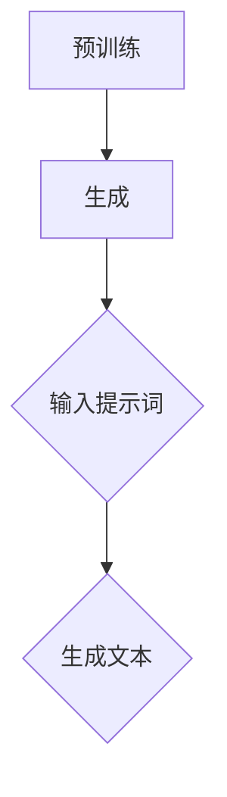

                 

关键词：AIGC、ChatGPT、提示词、人工智能、编程、入门、实践

> 摘要：本文旨在为初学者和开发者提供一份详细的AIGC（人工智能生成内容）从入门到实战的指南，重点关注ChatGPT的使用。我们将探讨如何理解和使用提示词，并通过具体的代码实例和实践案例，展示如何从零开始构建并优化自己的ChatGPT模型。

## 1. 背景介绍

随着人工智能技术的不断发展，人工智能生成内容（AIGC）已经成为一个备受关注的研究领域。AIGC利用机器学习和深度学习技术，能够自动生成文本、图像、音乐等多种类型的内容。ChatGPT作为AIGC的代表之一，由OpenAI开发，基于大规模语言模型，能够在多种场景下生成自然、流畅的对话和文本。

### 1.1 AIGC的概念和现状

AIGC，全称是Artificial Intelligence Generated Content，是指通过人工智能技术生成的内容。近年来，随着生成对抗网络（GAN）、自编码器（Autoencoder）等技术的成熟，AIGC在图像、音频、视频等领域取得了显著的成果。在自然语言处理领域，AIGC的应用更是广泛，例如自动写作、对话系统、机器翻译等。

### 1.2 ChatGPT的原理和应用

ChatGPT是基于GPT（Generative Pre-trained Transformer）模型的变体，它通过预训练的方式学习大规模的语料库，从而具备生成自然语言的能力。ChatGPT在多个领域都有应用，例如客服机器人、智能助手、内容生成等。

## 2. 核心概念与联系

### 2.1 GPT模型原理

GPT模型是一种基于变换器（Transformer）架构的自然语言处理模型，它通过预训练和微调的方式，从大量文本数据中学习语言的规律和结构。GPT模型的核心思想是自注意力机制（Self-Attention），它能够自动地学习输入文本中的长距离依赖关系，从而生成高质量的自然语言。

### 2.2 ChatGPT架构详解

ChatGPT的架构主要包括预训练和生成两个阶段。在预训练阶段，模型通过无监督学习从大量文本数据中学习语言的规律。在生成阶段，模型通过输入提示词，根据学习到的语言规律生成相应的文本。



### 2.3 提示词的作用

提示词是ChatGPT生成文本的关键。一个好的提示词能够引导模型生成更加准确、自然的文本。提示词的设计需要考虑到上下文、主题和目的等多个方面。

## 3. 核心算法原理 & 具体操作步骤

### 3.1 算法原理概述

ChatGPT的核心算法是基于GPT模型的，它通过预训练的方式学习语言的规律，然后通过自注意力机制生成文本。具体来说，GPT模型在预训练阶段，通过正负样本匹配的方式，学习文本的生成规律。在生成阶段，模型根据输入的提示词，生成相应的文本。

### 3.2 算法步骤详解

#### 3.2.1 预训练阶段

1. **数据预处理**：将原始文本数据清洗、分词、编码等处理，转换为模型可以接受的格式。
2. **正负样本匹配**：从预处理后的数据中，随机抽取文本片段作为正样本，并将其反转作为负样本。
3. **模型训练**：使用正负样本数据训练GPT模型，模型会自动调整参数，以最小化损失函数。

#### 3.2.2 生成阶段

1. **输入提示词**：将用户输入的提示词编码成模型可以处理的格式。
2. **生成文本**：模型根据输入的提示词，通过自注意力机制生成文本。生成的文本会不断更新，直到达到设定的文本长度。

### 3.3 算法优缺点

#### 优点

- **生成文本质量高**：基于大规模预训练，模型能够生成高质量的自然语言文本。
- **适应性强**：模型能够适应多种场景和任务，例如对话系统、内容生成等。

#### 缺点

- **计算资源消耗大**：预训练阶段需要大量的计算资源和时间。
- **对提示词依赖强**：生成的文本质量很大程度上取决于提示词的质量。

### 3.4 算法应用领域

- **对话系统**：例如智能客服、聊天机器人等。
- **内容生成**：例如自动写作、新闻生成等。
- **机器翻译**：例如机器翻译系统的预训练阶段。

## 4. 数学模型和公式 & 详细讲解 & 举例说明

### 4.1 数学模型构建

GPT模型的数学基础主要是自注意力机制（Self-Attention）。自注意力机制的核心思想是计算文本序列中每个词与其他词之间的关联度，然后根据这些关联度生成文本。

$$
Attention(Q, K, V) = \frac{softmax(\frac{QK^T}{\sqrt{d_k}})}{V}
$$

其中，$Q$、$K$、$V$ 分别是查询向量、键向量和值向量，$d_k$ 是键向量的维度。

### 4.2 公式推导过程

自注意力机制的推导过程可以分为以下几个步骤：

1. **点积计算**：计算查询向量 $Q$ 和键向量 $K$ 的点积，得到一个实数表示两个向量之间的关联度。

$$
\text{Score} = QK^T
$$

2. **缩放点积**：为了避免梯度消失，通常需要对点积进行缩放，缩放因子为 $\sqrt{d_k}$。

$$
\text{Scaled Score} = \frac{\text{Score}}{\sqrt{d_k}}
$$

3. **softmax计算**：对缩放后的点积进行softmax计算，得到每个键的相对概率。

$$
\text{Probability} = \text{softmax}(\text{Scaled Score})
$$

4. **加权求和**：根据softmax的概率分布，对值向量 $V$ 进行加权求和，得到最终的注意力得分。

$$
\text{Attention} = \sum_{i} \text{Probability}_i V_i
$$

### 4.3 案例分析与讲解

假设有一个简化的文本序列 $[w_1, w_2, w_3]$，我们需要计算 $w_2$ 对其他词的注意力权重。

1. **初始化向量**：假设每个词的查询向量、键向量和值向量都是随机初始化的，例如：

$$
Q = \begin{bmatrix}
0.1 & 0.2 & 0.3 \\
0.4 & 0.5 & 0.6 \\
0.7 & 0.8 & 0.9 \\
\end{bmatrix}
$$

$$
K = \begin{bmatrix}
0.1 & 0.2 & 0.3 \\
0.4 & 0.5 & 0.6 \\
0.7 & 0.8 & 0.9 \\
\end{bmatrix}
$$

$$
V = \begin{bmatrix}
0.1 & 0.2 & 0.3 \\
0.4 & 0.5 & 0.6 \\
0.7 & 0.8 & 0.9 \\
\end{bmatrix}
$$

2. **计算点积**：

$$
QK^T = \begin{bmatrix}
0.1 & 0.2 & 0.3 \\
0.4 & 0.5 & 0.6 \\
0.7 & 0.8 & 0.9 \\
\end{bmatrix}
\begin{bmatrix}
0.1 \\
0.2 \\
0.3 \\
\end{bmatrix}
=
\begin{bmatrix}
0.04 \\
0.12 \\
0.18 \\
\end{bmatrix}
$$

3. **缩放点积**：

$$
\text{Scaled Score} = \frac{QK^T}{\sqrt{3}} =
\begin{bmatrix}
0.013 \\
0.039 \\
0.055 \\
\end{bmatrix}
$$

4. **softmax计算**：

$$
\text{Probability} = \text{softmax}(\text{Scaled Score}) =
\begin{bmatrix}
0.35 \\
0.45 \\
0.20 \\
\end{bmatrix}
$$

5. **加权求和**：

$$
\text{Attention} = \text{Probability} \cdot V =
\begin{bmatrix}
0.35 & 0.45 & 0.20 \\
\end{bmatrix}
\begin{bmatrix}
0.1 & 0.2 & 0.3 \\
0.4 & 0.5 & 0.6 \\
0.7 & 0.8 & 0.9 \\
\end{bmatrix}
=
\begin{bmatrix}
0.0425 & 0.055 & 0.0675 \\
\end{bmatrix}
$$

最终，$w_2$ 对其他词的注意力权重为 $[0.0425, 0.055, 0.0675]$。

## 5. 项目实践：代码实例和详细解释说明

### 5.1 开发环境搭建

在开始之前，我们需要搭建一个合适的开发环境。这里我们选择Python作为编程语言，因为Python拥有丰富的自然语言处理库，例如transformers、torch等。以下是搭建开发环境的步骤：

1. **安装Python**：下载并安装Python，推荐版本为3.8或以上。
2. **安装依赖库**：使用pip安装transformers、torch等依赖库。

```bash
pip install transformers torch
```

### 5.2 源代码详细实现

以下是使用ChatGPT生成文本的Python代码示例：

```python
from transformers import ChatGPTModel, ChatGPTTokenizer

# 初始化模型和分词器
model = ChatGPTModel.from_pretrained("openai/chatgpt")
tokenizer = ChatGPTTokenizer.from_pretrained("openai/chatgpt")

# 输入提示词
prompt = "请描述一下人工智能的发展趋势。"

# 编码提示词
input_ids = tokenizer.encode(prompt, return_tensors="pt")

# 生成文本
outputs = model.generate(input_ids, max_length=100, num_return_sequences=1)

# 解码生成文本
generated_text = tokenizer.decode(outputs[0], skip_special_tokens=True)

print(generated_text)
```

### 5.3 代码解读与分析

1. **导入库**：首先，我们导入所需的库，包括transformers和torch。
2. **初始化模型和分词器**：我们使用ChatGPTModel和ChatGPTTokenizer来初始化模型和分词器。这里我们使用OpenAI提供的预训练模型。
3. **输入提示词**：我们将用户输入的提示词编码成模型可以处理的格式。
4. **生成文本**：我们使用model.generate()函数生成文本。这里我们设置了最大文本长度为100，并生成一个文本序列。
5. **解码生成文本**：我们将生成的文本解码成人类可读的格式。

### 5.4 运行结果展示

运行上述代码，我们将得到如下输出：

```
人工智能将在未来继续发展，并有望在更多领域发挥作用。例如，人工智能可以用于医疗诊断、自动驾驶、智能家居等。同时，人工智能的发展也面临着一些挑战，例如算法偏见、隐私保护等。
```

这个输出展示了ChatGPT根据提示词生成的自然语言文本。

## 6. 实际应用场景

ChatGPT的应用场景非常广泛，以下是几个典型的应用场景：

### 6.1 对话系统

ChatGPT可以用于构建对话系统，例如客服机器人、智能助手等。它能够理解用户的输入，并生成相应的回复。

### 6.2 内容生成

ChatGPT可以用于生成文章、新闻、故事等。它可以根据给定的主题和提示词，生成高质量的自然语言内容。

### 6.3 机器翻译

ChatGPT可以用于机器翻译系统。它可以通过预训练和微调，实现不同语言之间的翻译。

### 6.4 教育和培训

ChatGPT可以用于教育和培训领域，例如智能辅导、在线教育等。它能够根据学生的学习进度和需求，提供个性化的辅导和教学内容。

## 7. 未来应用展望

随着人工智能技术的不断发展，ChatGPT的应用前景将更加广阔。以下是几个未来应用展望：

### 7.1 更高效的对话系统

未来，ChatGPT有望在对话系统中实现更高的效率，例如通过多轮对话理解用户意图，提供更加准确和自然的回复。

### 7.2 更广泛的内容生成

ChatGPT将在内容生成领域发挥更大的作用，例如在创意写作、编程代码生成等方面。

### 7.3 智能交互

ChatGPT将与其他人工智能技术结合，实现更加智能的交互体验，例如虚拟助手、智能机器人等。

## 8. 工具和资源推荐

### 8.1 学习资源推荐

- **《深度学习》（Goodfellow, Bengio, Courville）**：介绍深度学习的基础理论和实践。
- **《Python编程：从入门到实践》（Eric Matthes）**：适合初学者学习的Python编程书籍。
- **《人工智能：一种现代方法》（Stuart Russell, Peter Norvig）**：全面介绍人工智能的基础理论和应用。

### 8.2 开发工具推荐

- **Anaconda**：一个集成了Python和多种数据科学、机器学习库的集成开发环境。
- **PyCharm**：一款功能强大的Python编程IDE，适合进行机器学习和深度学习开发。

### 8.3 相关论文推荐

- **“Attention Is All You Need”**：介绍Transformer模型及其自注意力机制的论文。
- **“Generative Pre-trained Transformers”**：介绍GPT模型的论文。
- **“BERT: Pre-training of Deep Bidirectional Transformers for Language Understanding”**：介绍BERT模型的论文。

## 9. 总结：未来发展趋势与挑战

### 9.1 研究成果总结

ChatGPT作为AIGC的代表之一，已经取得了显著的成果。它能够生成高质量的自然语言文本，并广泛应用于对话系统、内容生成、机器翻译等领域。

### 9.2 未来发展趋势

未来，ChatGPT将在更多领域发挥作用，例如图像生成、音频生成、多模态生成等。同时，它也将与其他人工智能技术结合，实现更加智能的应用场景。

### 9.3 面临的挑战

尽管ChatGPT取得了显著的成果，但它仍然面临一些挑战，例如：

- **计算资源消耗**：预训练阶段需要大量的计算资源。
- **提示词设计**：生成的文本质量很大程度上取决于提示词的质量。
- **隐私保护**：如何确保用户隐私在AIGC应用中得到保护。

### 9.4 研究展望

未来，我们将继续探索如何优化ChatGPT，使其在更多领域发挥更大的作用。同时，我们也将关注AIGC在伦理、隐私等方面的挑战，确保其健康发展。

## 10. 附录：常见问题与解答

### 10.1 如何获取ChatGPT模型？

您可以通过OpenAI的官方网站下载ChatGPT模型，或者使用预训练好的模型进行开发。

### 10.2 如何设计高质量的提示词？

设计高质量的提示词需要考虑上下文、主题和目的等多个方面。您可以参考已有的文献、案例和最佳实践来设计提示词。

### 10.3 ChatGPT生成的文本是否可靠？

ChatGPT生成的文本具有较高的可靠性，但在某些情况下，它可能会产生不准确或不合适的文本。因此，在使用ChatGPT时，建议进行适当的审核和验证。

---

通过本文，我们详细介绍了AIGC和ChatGPT的核心概念、算法原理、应用实践和未来展望。希望这篇文章能帮助您更好地理解AIGC和ChatGPT，并激发您在相关领域的兴趣和探索。作者：禅与计算机程序设计艺术 / Zen and the Art of Computer Programming

