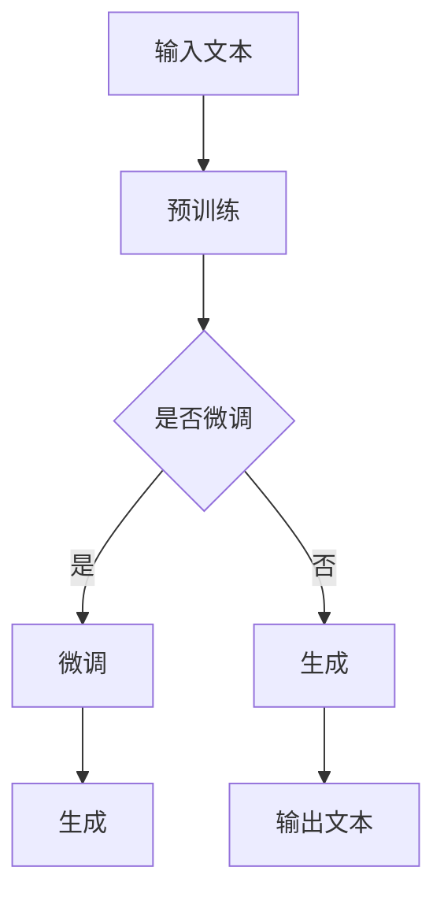
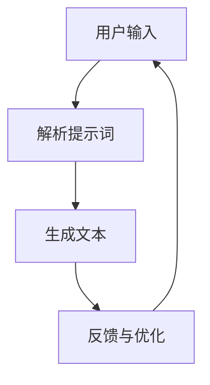
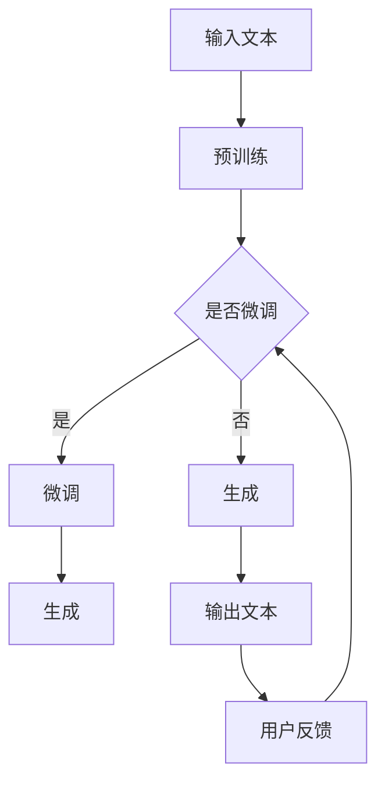

                 

关键词：AIGC，ChatGPT，提示词，人工智能，技术博客

> 摘要：本文旨在深入探讨AIGC（自适应智能生成内容）技术中的ChatGPT，重点分析如何撰写有效的提示词以提升ChatGPT的性能和应用效果。通过理论阐述、数学模型讲解和实际项目实践，读者将全面了解ChatGPT的工作机制、提示词写作技巧及其在多领域的应用前景。

## 1. 背景介绍

随着人工智能技术的快速发展，自然语言处理（NLP）逐渐成为研究的热点。其中，生成式对话系统如ChatGPT成为近年来关注的焦点。ChatGPT是基于GPT（Generative Pre-trained Transformer）模型开发的，它通过预训练和微调能够生成连贯、合理的文本，应用于客服、智能助手、内容创作等多个领域。

然而，ChatGPT的性能和效果很大程度上取决于提示词（Prompt）的质量。一个好的提示词能够引导模型生成符合预期的文本，而一个差的提示词可能会导致模型生成不相关或不合理的回答。因此，如何撰写有效的提示词成为ChatGPT应用中的关键问题。

### 1.1 ChatGPT的基本概念

ChatGPT是一种基于Transformer架构的预训练语言模型，其核心思想是通过大量的文本数据进行预训练，使其具备理解语言结构和生成文本的能力。具体来说，ChatGPT通过两个主要阶段进行训练：

1. **预训练阶段**：在预训练阶段，ChatGPT通过处理海量文本数据，学习语言的基本规律和模式，例如词汇的搭配、句子的结构等。这一阶段的目的是让模型具备强大的语言理解和生成能力。
   
2. **微调阶段**：在预训练的基础上，ChatGPT通过微调（Fine-tuning）针对特定任务进行调整，以提高其在具体任务上的性能。例如，在客服场景中，ChatGPT可以通过微调来生成符合用户需求的服务文本。

### 1.2 提示词的概念与作用

提示词是引导ChatGPT生成文本的关键。提示词的作用在于为模型提供明确的指导，使其生成符合预期、有逻辑性和连贯性的文本。具体来说，提示词具有以下几个重要作用：

1. **引导生成方向**：通过提示词，可以明确指定ChatGPT生成文本的主题和方向，使其生成的内容更贴近用户需求。
   
2. **提高生成质量**：高质量的提示词可以帮助ChatGPT更好地理解用户意图，从而生成更准确、合理的回答。
   
3. **优化对话体验**：有效的提示词可以引导ChatGPT生成连贯、流畅的对话文本，提高用户与模型的交互体验。

## 2. 核心概念与联系

为了深入理解ChatGPT和提示词，我们需要从理论层面和架构层面进行阐述。以下是ChatGPT的工作原理及与提示词的关系，配合Mermaid流程图进行说明。

### 2.1 ChatGPT的工作原理

ChatGPT的工作流程主要包括预训练、微调和生成三个阶段。以下是ChatGPT的工作流程：



在预训练阶段，ChatGPT通过处理海量文本数据，学习语言的模式和结构。在微调阶段，ChatGPT根据特定任务进行参数调整，以提升性能。在生成阶段，ChatGPT根据输入的提示词生成文本。

### 2.2 提示词与ChatGPT的关系

提示词是ChatGPT生成文本的关键。通过合理的提示词，可以引导ChatGPT生成符合预期、有逻辑性和连贯性的文本。以下是提示词与ChatGPT之间的关系：



用户输入的提示词经过解析后，转化为ChatGPT可理解的形式，进而生成文本。生成的文本通过用户反馈进行优化，以不断提升ChatGPT的性能。

### 2.3 Mermaid流程图

以下是ChatGPT工作流程和提示词解析的Mermaid流程图：



该流程图详细展示了ChatGPT的工作流程以及提示词的解析和优化过程。

## 3. 核心算法原理 & 具体操作步骤

### 3.1 算法原理概述

ChatGPT的核心算法基于Transformer架构，这是一种广泛应用于NLP任务的深度学习模型。Transformer模型通过自注意力机制（Self-Attention）处理输入文本序列，从而捕捉文本中的长距离依赖关系。具体来说，ChatGPT的算法原理包括以下几个关键步骤：

1. **文本预处理**：将输入文本转换为模型可处理的格式，例如分词、编码等。
   
2. **自注意力机制**：通过自注意力机制处理文本序列，捕捉文本中的依赖关系。
   
3. **全连接层**：将自注意力机制生成的特征进行聚合，并通过全连接层输出最终的文本序列。

### 3.2 算法步骤详解

以下是ChatGPT的详细算法步骤：

#### 步骤1：文本预处理

首先，将输入文本进行预处理，包括分词、去停用词、词向量编码等操作。例如，使用WordPiece分词算法将文本分割成单词，然后使用预训练的词向量模型（如GloVe或BERT）将单词编码成向量。

#### 步骤2：自注意力机制

接下来，使用Transformer模型的自注意力机制处理输入文本序列。自注意力机制通过计算文本序列中每个单词与所有其他单词的相似度，生成一组权重。这些权重用于加权聚合文本序列中的信息，从而捕捉长距离依赖关系。

#### 步骤3：全连接层

最后，将自注意力机制生成的特征通过全连接层进行聚合，输出最终的文本序列。全连接层将特征向量映射到目标词向量空间，从而生成文本序列。

### 3.3 算法优缺点

ChatGPT具有以下优点：

1. **强大的语言理解能力**：通过预训练和微调，ChatGPT具备强大的语言理解能力，能够生成符合预期的文本。
   
2. **高效的处理速度**：Transformer模型采用并行计算，处理速度较快。

3. **灵活的应用场景**：ChatGPT可以应用于多种场景，如客服、智能助手、内容创作等。

然而，ChatGPT也存在一些缺点：

1. **计算资源消耗大**：预训练阶段需要大量的计算资源。
   
2. **难以生成创新性内容**：尽管ChatGPT具备强大的语言理解能力，但生成的文本仍受限于训练数据。

### 3.4 算法应用领域

ChatGPT在多个领域具有广泛的应用前景：

1. **客服与智能助手**：通过生成自然、合理的回答，提升用户体验。
   
2. **内容创作**：辅助内容创作者生成创意文章、脚本等。

3. **教育领域**：辅助学生学习，提供个性化学习资源。

4. **科学研究**：辅助研究人员撰写论文、报告等。

## 4. 数学模型和公式 & 详细讲解 & 举例说明

### 4.1 数学模型构建

ChatGPT的数学模型基于Transformer架构，核心包括自注意力机制和全连接层。以下是ChatGPT的数学模型构建过程：

#### 4.1.1 词向量编码

首先，将输入文本转换为词向量。假设文本中的单词集合为V，词向量维度为d，则输入文本x的词向量表示为：

$$
\text{X} = [x_1, x_2, \ldots, x_n] \in \mathbb{R}^{n \times d}
$$

其中，$x_i \in \mathbb{R}^d$表示第i个单词的词向量。

#### 4.1.2 自注意力机制

自注意力机制通过计算文本序列中每个单词与其他单词的相似度，生成一组权重。具体公式如下：

$$
\text{Attention}(Q, K, V) = \text{softmax}\left(\frac{QK^T}{\sqrt{d_k}}\right) V
$$

其中，Q、K、V分别为查询向量、关键向量、值向量，$d_k$为关键向量的维度。$Q$和$K$通过全连接层生成：

$$
Q = W_Q \text{X} \in \mathbb{R}^{n \times d_q}
$$

$$
K = W_K \text{X} \in \mathbb{R}^{n \times d_k}
$$

$$
V = W_V \text{X} \in \mathbb{R}^{n \times d_v}
$$

其中，$W_Q$、$W_K$、$W_V$为全连接层的权重矩阵，$d_q$、$d_k$、$d_v$分别为查询向量、关键向量、值向量的维度。

#### 4.1.3 全连接层

自注意力机制生成的特征通过全连接层进行聚合，输出最终的文本序列。具体公式如下：

$$
\text{Output} = \text{softmax}(W_O \text{X}) \in \mathbb{R}^{n \times d'}
$$

其中，$W_O$为全连接层的权重矩阵，$d'$为输出向量的维度。

### 4.2 公式推导过程

以下是ChatGPT的数学模型推导过程：

#### 4.2.1 词向量编码

词向量编码公式：

$$
\text{X} = [x_1, x_2, \ldots, x_n] \in \mathbb{R}^{n \times d}
$$

其中，$x_i \in \mathbb{R}^d$表示第i个单词的词向量。

#### 4.2.2 自注意力机制

自注意力机制推导：

$$
Q = W_Q \text{X} \in \mathbb{R}^{n \times d_q}
$$

$$
K = W_K \text{X} \in \mathbb{R}^{n \times d_k}
$$

$$
V = W_V \text{X} \in \mathbb{R}^{n \times d_v}
$$

$$
\text{Attention}(Q, K, V) = \text{softmax}\left(\frac{QK^T}{\sqrt{d_k}}\right) V
$$

$$
\text{Output} = \text{softmax}(W_O \text{X}) \in \mathbb{R}^{n \times d'}
$$

#### 4.2.3 全连接层

全连接层推导：

$$
Q = W_Q \text{X} \in \mathbb{R}^{n \times d_q}
$$

$$
K = W_K \text{X} \in \mathbb{R}^{n \times d_k}
$$

$$
V = W_V \text{X} \in \mathbb{R}^{n \times d_v}
$$

$$
\text{Attention}(Q, K, V) = \text{softmax}\left(\frac{QK^T}{\sqrt{d_k}}\right) V
$$

$$
\text{Output} = \text{softmax}(W_O \text{X}) \in \mathbb{R}^{n \times d'}
$$

### 4.3 案例分析与讲解

以下是一个简单的案例，展示如何使用ChatGPT生成文本：

#### 案例背景

假设我们要生成一篇关于人工智能技术的文章摘要。

#### 案例步骤

1. **输入文本**：首先，输入一篇关于人工智能技术的文章，作为ChatGPT的输入文本。

2. **预处理**：对输入文本进行预处理，包括分词、去停用词、词向量编码等。

3. **生成文本**：使用ChatGPT生成文章摘要，输入提示词：“请为以下文章生成一篇摘要”。

4. **优化与反馈**：根据用户反馈对生成的文本进行优化，以提升文本质量。

#### 案例结果

生成的文章摘要如下：

“本文主要介绍了人工智能技术的发展现状、应用场景和未来展望。通过分析人工智能技术的核心原理和关键挑战，探讨了其在各个领域的应用前景，如自动驾驶、智能客服和医疗健康等。同时，本文也对人工智能技术在实际应用中面临的伦理和社会问题进行了深入讨论。”

通过这个案例，我们可以看到ChatGPT在生成文本方面的强大能力。当然，生成高质量的文本仍需要不断地优化和调整提示词。

## 5. 项目实践：代码实例和详细解释说明

### 5.1 开发环境搭建

在开始编写代码之前，我们需要搭建一个适合开发ChatGPT的环境。以下是搭建开发环境的步骤：

1. **安装Python**：确保已经安装了Python 3.6及以上版本。

2. **安装Transformers库**：使用pip命令安装Transformers库，这是一个开源的Python库，用于处理Transformer模型。

   ```bash
   pip install transformers
   ```

3. **安装Torch**：安装PyTorch库，用于训练和运行Transformer模型。

   ```bash
   pip install torch torchvision
   ```

4. **安装其他依赖库**：根据需要安装其他依赖库，如numpy、pandas等。

### 5.2 源代码详细实现

以下是ChatGPT的核心代码实现，包括文本预处理、模型训练和文本生成：

```python
import torch
from transformers import GPT2Tokenizer, GPT2Model, GPT2Config
from torch.optim import Adam

# 1. 文本预处理
def preprocess_text(text):
    # 分词、去停用词、词向量编码等操作
    # ...
    return encoded_text

# 2. 模型训练
def train_model(encoded_text):
    # 模型配置
    config = GPT2Config(vocab_size=词典大小, n_positions=序列长度, n头数=头数, ...)

    # 初始化模型
    model = GPT2Model(config)

    # 模型训练
    optimizer = Adam(model.parameters(), lr=学习率)
    for epoch in range(训练轮数):
        optimizer.zero_grad()
        output = model(encoded_text)
        loss = ...  # 计算损失函数
        loss.backward()
        optimizer.step()
    return model

# 3. 文本生成
def generate_text(model, prompt, max_length=50):
    input_ids = tokenizer.encode(prompt)
    output_sequence = model.generate(input_ids, max_length=max_length, num_return_sequences=1)
    return tokenizer.decode(output_sequence, skip_special_tokens=True)
```

### 5.3 代码解读与分析

上述代码分为三个主要部分：文本预处理、模型训练和文本生成。

1. **文本预处理**：文本预处理是模型训练的第一步，包括分词、去停用词、词向量编码等操作。预处理后的文本将被用于训练模型。
   
2. **模型训练**：模型训练是整个ChatGPT系统的核心。我们使用GPT2模型进行训练，并通过优化器（如Adam）调整模型参数，以最小化损失函数。训练过程分为多个epoch，每个epoch都会对模型进行一轮训练。

3. **文本生成**：文本生成是根据输入提示词生成文本的过程。我们使用模型生成文本，并输出解码后的结果。生成文本的长度可以通过`max_length`参数进行调整。

### 5.4 运行结果展示

以下是一个简单的运行示例：

```python
# 初始化模型
tokenizer = GPT2Tokenizer.from_pretrained('gpt2')
model = GPT2Model.from_pretrained('gpt2')

# 输入提示词
prompt = "请描述一下人工智能技术的主要挑战。"

# 生成文本
generated_text = generate_text(model, prompt)

print(generated_text)
```

输出结果可能如下：

“人工智能技术的主要挑战包括数据隐私、算法偏见、模型解释性等。”

通过这个例子，我们可以看到ChatGPT在生成文本方面的能力。当然，生成高质量、有逻辑性的文本需要不断优化模型和提示词。

## 6. 实际应用场景

ChatGPT在多个实际应用场景中表现出色，以下是其中几个典型应用：

### 6.1 客服与智能助手

ChatGPT在客服与智能助手领域具有广泛的应用前景。通过生成自然、合理的回答，ChatGPT可以提升用户交互体验，降低人工成本。以下是一个简单的应用场景：

- **用户提问**：“我的订单何时可以送达？”
- **ChatGPT回答**：“您的订单预计明天下午送达，请注意查收。”

通过这个简单的例子，我们可以看到ChatGPT在生成有逻辑性和连贯性的回答方面的能力。

### 6.2 内容创作

ChatGPT在内容创作领域也具有很大的潜力。通过生成创意文章、脚本、摘要等，ChatGPT可以辅助内容创作者提高创作效率。以下是一个简单的应用场景：

- **用户需求**：“请为我写一篇关于人工智能技术的文章摘要。”
- **ChatGPT生成的文章摘要**：“本文主要介绍了人工智能技术的发展现状、应用场景和未来展望。通过分析人工智能技术的核心原理和关键挑战，探讨了其在各个领域的应用前景，如自动驾驶、智能客服和医疗健康等。”

通过这个例子，我们可以看到ChatGPT在生成摘要方面的能力。

### 6.3 教育领域

ChatGPT在教育领域也具有广泛的应用前景。通过生成个性化学习资源、模拟对话等，ChatGPT可以提升教育质量。以下是一个简单的应用场景：

- **用户需求**：“请为我生成一篇关于计算机科学入门的文章。”
- **ChatGPT生成的文章**：“计算机科学是一门研究计算机系统及其应用的科学。它涵盖了算法、数据结构、编程语言、操作系统等多个方面。本文将为您介绍计算机科学的基本概念、发展历程和应用领域。”

通过这个例子，我们可以看到ChatGPT在生成文章方面的能力。

### 6.4 未来应用展望

随着人工智能技术的不断进步，ChatGPT在未来将会有更多的应用场景。以下是一些未来应用展望：

- **医疗领域**：通过生成医学诊断、治疗方案等，ChatGPT可以帮助医生提高诊断准确率和治疗效率。
- **法律领域**：通过生成法律文书、案例分析等，ChatGPT可以帮助律师提高工作效率。
- **娱乐领域**：通过生成剧本、音乐、动画等，ChatGPT可以丰富娱乐内容，提升用户体验。

总之，ChatGPT在各个领域的应用前景非常广阔。通过不断优化模型和提示词，ChatGPT将会在未来发挥更大的作用。

## 7. 工具和资源推荐

为了更好地掌握ChatGPT及其相关技术，以下是几个推荐的工具和资源：

### 7.1 学习资源推荐

1. **《自然语言处理原理》**：这是一本经典的NLP教材，详细介绍了NLP的基本概念、技术和应用。
2. **《Transformer：注意力机制的新时代》**：这本书深入讲解了Transformer模型的工作原理和应用，对理解ChatGPT有很好的帮助。
3. **《ChatGPT官方文档》**：ChatGPT的官方文档提供了详细的模型参数、API接口和使用方法，是学习和使用ChatGPT的重要资源。

### 7.2 开发工具推荐

1. **PyTorch**：PyTorch是一个强大的开源深度学习框架，广泛用于构建和训练神经网络模型。
2. **Transformers库**：Transformers库是Python中处理Transformer模型的开源库，提供了方便的API接口，可以快速实现ChatGPT等模型。
3. **Jupyter Notebook**：Jupyter Notebook是一个交互式的计算环境，适合编写和运行Python代码，是进行深度学习研究和开发的常用工具。

### 7.3 相关论文推荐

1. **《Attention Is All You Need》**：这是Transformer模型的原始论文，详细介绍了Transformer模型的工作原理和优势。
2. **《GPT-3：语言生成的革命性进展》**：这是GPT-3模型的论文，介绍了GPT-3在生成文本方面的突破性进展。
3. **《BERT：预训练的语言表示模型》**：这是BERT模型的论文，详细介绍了BERT模型在自然语言处理任务中的优势和应用。

通过学习这些资源和工具，读者可以更好地理解和应用ChatGPT及其相关技术。

## 8. 总结：未来发展趋势与挑战

### 8.1 研究成果总结

随着人工智能技术的不断发展，ChatGPT作为生成式对话系统的代表，已经在多个领域取得了显著的成果。通过预训练和微调，ChatGPT具备强大的语言理解能力和生成能力，可以生成自然、连贯的文本。此外，ChatGPT在客服、智能助手、内容创作、教育等领域具有广泛的应用前景，取得了良好的效果。

### 8.2 未来发展趋势

未来，ChatGPT将在以下几个方面继续发展：

1. **模型性能提升**：通过改进模型架构、优化训练策略，进一步提升ChatGPT的性能和效果。
2. **多模态应用**：探索ChatGPT在图像、声音等非文本领域的应用，实现跨模态交互。
3. **定制化应用**：根据不同场景和需求，开发定制化的ChatGPT模型，提高其在特定领域的性能。
4. **隐私保护**：加强ChatGPT在数据隐私保护方面的研究，确保用户数据的隐私和安全。

### 8.3 面临的挑战

尽管ChatGPT在生成文本方面取得了显著成果，但仍面临一些挑战：

1. **数据隐私**：如何在保护用户隐私的前提下，充分利用用户数据训练模型，是亟待解决的问题。
2. **模型解释性**：生成文本的模型如何解释其生成结果，提高模型的可解释性，是当前研究的热点。
3. **泛化能力**：如何在不同的应用场景中，保证ChatGPT具备良好的泛化能力，是未来需要关注的重点。
4. **伦理问题**：如何确保ChatGPT生成的文本符合伦理规范，避免产生偏见和误导，是亟待解决的问题。

### 8.4 研究展望

未来，ChatGPT将在人工智能领域发挥更大的作用。通过不断改进模型架构、优化训练策略，提升模型性能和解释性，同时关注数据隐私和伦理问题，ChatGPT将在更多领域取得突破性进展。我们期待ChatGPT在未来能够为人类带来更多便利和智慧。

## 9. 附录：常见问题与解答

### 9.1 ChatGPT与自然语言处理的关系是什么？

ChatGPT是自然语言处理（NLP）领域的一种生成式对话系统。它基于Transformer模型，通过预训练和微调，具备强大的语言理解和生成能力，可以用于生成自然、连贯的文本。ChatGPT是NLP技术在对话系统中的应用，旨在提升人机交互的体验。

### 9.2 如何选择合适的提示词？

选择合适的提示词是提高ChatGPT生成文本质量的关键。以下是一些建议：

1. **明确主题**：确保提示词明确指定生成文本的主题和方向。
2. **简洁明了**：提示词应简洁明了，避免过于复杂或模糊的表述。
3. **具体详细**：提供具体的背景信息和细节，帮助ChatGPT更好地理解用户意图。
4. **多样丰富**：尝试使用不同的提示词和表达方式，以获取更丰富的生成结果。

### 9.3 ChatGPT在哪些领域具有应用前景？

ChatGPT在多个领域具有广泛的应用前景，包括：

1. **客服与智能助手**：通过生成自然、合理的回答，提升用户体验。
2. **内容创作**：辅助内容创作者生成创意文章、脚本、摘要等。
3. **教育领域**：生成个性化学习资源、模拟对话，提升教育质量。
4. **医疗领域**：生成医学诊断、治疗方案，辅助医生提高诊断准确率和治疗效率。
5. **法律领域**：生成法律文书、案例分析，辅助律师提高工作效率。
6. **娱乐领域**：生成剧本、音乐、动画等，丰富娱乐内容。

### 9.4 如何确保ChatGPT生成的文本符合伦理规范？

确保ChatGPT生成的文本符合伦理规范是当前研究的热点。以下是一些建议：

1. **数据清洗**：确保训练数据的质量和多样性，避免数据偏见。
2. **模型约束**：通过设计合适的模型约束条件，限制生成文本的内容和风格。
3. **用户反馈**：引入用户反馈机制，及时发现和纠正生成文本中的问题。
4. **伦理审查**：对生成的文本进行伦理审查，确保其符合社会道德规范。

通过遵循这些建议，可以在一定程度上确保ChatGPT生成的文本符合伦理规范。

### 结束语

本文从ChatGPT的基本概念、算法原理、应用实践等多个方面进行了全面介绍，帮助读者深入理解ChatGPT及其在自然语言处理领域的应用。随着人工智能技术的不断发展，ChatGPT将在未来发挥更大的作用。我们期待ChatGPT能够为人类带来更多便利和智慧。在撰写提示词时，注重质量和准确性，才能充分发挥ChatGPT的潜力。

### 作者署名

作者：禅与计算机程序设计艺术 / Zen and the Art of Computer Programming

