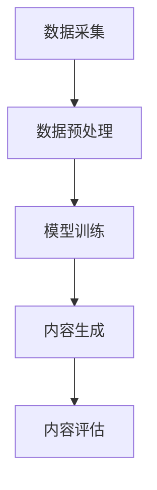

                 

### 文章关键词

- AIGC
- ChatGPT
- 个人赋能
- 技术实践
- 软件开发
- 人工智能
- 开发工具
- 资源推荐

<|assistant|>### 文章摘要

本文将深入探讨AIGC（AI-Generated Content）领域，特别是以ChatGPT为代表的AI模型如何改变我们的个人工作和生活。通过系统的介绍AIGC的基本概念、核心原理、算法实现、数学模型、实践案例以及未来的发展趋势，读者将能够全面理解AIGC的强大潜力，并掌握如何在日常生活中利用这些技术实现个人赋能。文章还将推荐一系列学习资源和开发工具，帮助读者进一步探索和实践AIGC技术。作者“禅与计算机程序设计艺术”期待与读者共同开启这一技术革命的新篇章。

## 1. 背景介绍

随着人工智能（AI）技术的快速发展，AI在各个领域的应用日益广泛。从工业自动化到智能家居，从医疗诊断到金融分析，AI正在深刻地改变着我们的生活方式和工作模式。然而，近年来，一个新兴的领域——AIGC（AI-Generated Content），正在逐步崭露头角，成为人工智能技术发展的重要方向。

AIGC，即AI-Generated Content，指的是利用人工智能技术自动生成内容的过程。与传统的手动内容创作方式不同，AIGC通过机器学习算法，特别是深度学习技术，能够自动生成文本、图像、视频等多种形式的内容。这种自动生成的内容不仅在数量上远超人类，而且在质量上也有显著提升。

ChatGPT是AIGC领域的一个代表性模型。ChatGPT是由OpenAI开发的一种基于变换器（Transformer）架构的预训练语言模型。通过大量文本数据的训练，ChatGPT具备了强大的语言理解和生成能力。无论是撰写文章、生成对话，还是进行翻译、问答，ChatGPT都能够以自然流畅的方式完成。

本文旨在为读者提供一份详尽的AIGC入门指南，帮助读者了解AIGC的基本概念、核心原理、算法实现、数学模型、实践案例，并展望其未来的发展趋势。通过本文的阅读，读者将能够掌握AIGC技术的核心要点，并学会如何在日常生活中利用这些技术实现个人赋能。

### 2. 核心概念与联系

#### 2.1 AIGC基本概念

AIGC（AI-Generated Content）指的是利用人工智能技术自动生成内容的过程。这一过程通常涉及以下几个关键步骤：

1. **数据采集**：从互联网、数据库或其他数据源收集大量相关数据。
2. **数据预处理**：清洗和整理数据，使其适合模型训练。
3. **模型训练**：使用收集到的数据进行模型训练，以提高模型生成内容的准确性。
4. **内容生成**：使用训练好的模型自动生成文本、图像、视频等内容。

#### 2.2 关键技术

AIGC的关键技术主要包括自然语言处理（NLP）、计算机视觉（CV）、深度学习和变换器（Transformer）架构。

1. **自然语言处理（NLP）**：NLP是使计算机能够理解、处理和生成自然语言的技术。在AIGC中，NLP主要用于文本数据的预处理和生成。
   
2. **计算机视觉（CV）**：CV是使计算机能够从图像或视频中提取信息和理解场景的技术。在AIGC中，CV主要用于图像和视频数据的生成。

3. **深度学习**：深度学习是一种基于多层神经网络的结构，通过逐层提取特征，实现对复杂数据的学习和处理。在AIGC中，深度学习是模型训练的核心技术。

4. **变换器（Transformer）架构**：变换器是一种基于自注意力机制的深度神经网络架构，特别适用于处理序列数据。在AIGC中，变换器架构广泛应用于文本和图像生成任务。

#### 2.3 架构的 Mermaid 流程图

下面是一个简化的AIGC架构的Mermaid流程图：



在上述流程图中，AIGC的基本流程可以分为五个主要阶段：数据采集、数据预处理、模型训练、内容生成和内容评估。每个阶段都有其特定的技术和方法，共同构成了AIGC的技术体系。

### 3. 核心算法原理 & 具体操作步骤

#### 3.1 算法原理概述

AIGC的核心算法原理主要基于深度学习和变换器架构。深度学习通过多层神经网络提取数据特征，而变换器架构则通过自注意力机制处理序列数据，提高模型的生成能力。

首先，深度学习模型通过大量的训练数据学习到数据的内在结构和规律。在AIGC中，这一过程通常涉及以下几个步骤：

1. **数据采集**：收集大量的文本、图像或视频数据。
2. **数据预处理**：对数据进行清洗和编码，使其适合模型训练。
3. **模型训练**：使用训练数据对模型进行训练，优化模型的参数。
4. **模型评估**：使用验证数据评估模型的性能，调整模型参数。

变换器架构是一种基于自注意力机制的深度神经网络。自注意力机制允许模型在生成序列数据时，根据上下文信息动态调整每个词或像素的重要性。这种机制使变换器在处理序列数据时具有更强的灵活性和表达能力。在AIGC中，变换器通常用于文本生成、图像生成和视频生成等任务。

#### 3.2 算法步骤详解

下面详细描述AIGC算法的具体步骤：

1. **数据采集**：首先，需要从互联网、数据库或其他数据源收集大量的文本、图像或视频数据。这些数据将用于模型训练和生成。

2. **数据预处理**：对于文本数据，通常需要进行分词、去停用词、词向量化等处理。对于图像和视频数据，需要进行图像增强、视频分割等处理，以提高模型对数据的适应性。

3. **模型训练**：使用预处理后的数据对深度学习模型进行训练。在训练过程中，模型通过不断调整参数，学习到数据的内在结构和规律。训练过程通常涉及以下几个步骤：

   - **前向传播**：输入数据通过模型计算得到输出。
   - **反向传播**：计算输出与真实值之间的误差，并反向传播误差，更新模型参数。
   - **优化算法**：使用优化算法（如梯度下降）调整模型参数，以最小化误差。

4. **内容生成**：使用训练好的模型生成文本、图像或视频。在生成过程中，模型根据输入的初始部分，逐步生成后续内容。对于文本生成，模型会逐个生成每个词；对于图像和视频生成，模型会逐个生成每个像素或视频帧。

5. **内容评估**：使用生成的内容与真实值进行比较，评估模型的性能。评估指标包括准确性、流畅性、多样性等。

#### 3.3 算法优缺点

**优点**：

1. **生成能力强大**：深度学习模型，尤其是变换器架构，具有强大的生成能力，能够生成高质量的内容。
2. **灵活性高**：自注意力机制使变换器能够根据上下文信息动态调整生成内容，具有很高的灵活性。
3. **适用范围广泛**：AIGC技术可以应用于文本、图像、视频等多种内容生成任务。

**缺点**：

1. **计算资源需求大**：深度学习模型需要大量的计算资源进行训练，对硬件性能有较高要求。
2. **数据依赖性高**：模型性能依赖于训练数据的质量和数量，数据不足或质量差可能导致生成内容质量下降。
3. **潜在伦理问题**：生成内容可能涉及版权、隐私等伦理问题，需要严格监管。

#### 3.4 算法应用领域

AIGC技术已广泛应用于多个领域，包括：

1. **内容创作**：如自动生成文章、对话、故事等。
2. **娱乐与艺术**：如自动生成音乐、视频、动画等。
3. **图像生成**：如人脸生成、图像修复、风格迁移等。
4. **医疗诊断**：如自动生成医学报告、辅助诊断等。
5. **教育**：如自动生成教学视频、课程内容等。

### 4. 数学模型和公式 & 详细讲解 & 举例说明

在AIGC技术中，数学模型和公式起着至关重要的作用。它们不仅描述了算法的基本原理，还提供了量化评估和优化的依据。本节将详细介绍AIGC技术中的关键数学模型和公式，并通过具体示例进行讲解。

#### 4.1 数学模型构建

AIGC技术的数学模型主要包括深度学习模型、变换器模型和生成对抗网络（GAN）等。以下分别介绍这些模型的基本数学原理。

1. **深度学习模型**

   深度学习模型通常由多层神经网络组成，每一层都能够提取不同层次的特征。其基本数学原理如下：

   $$ f(x) = \sigma(W \cdot x + b) $$

   其中，$f(x)$ 表示神经网络的输出，$W$ 是权重矩阵，$x$ 是输入数据，$b$ 是偏置项，$\sigma$ 是激活函数，如Sigmoid或ReLU函数。

2. **变换器模型**

   变换器模型是一种基于自注意力机制的深度神经网络，其基本数学原理如下：

   $$ \text{Attention}(Q, K, V) = \text{softmax}(\frac{QK^T}{\sqrt{d_k}})V $$

   其中，$Q$、$K$ 和 $V$ 分别是查询向量、键向量和值向量，$d_k$ 是键向量的维度，$\text{softmax}$ 函数用于计算注意力权重。

3. **生成对抗网络（GAN）**

   生成对抗网络由生成器和判别器两个神经网络组成，其基本数学原理如下：

   - **生成器**：$G(z)$，生成虚假数据。
   - **判别器**：$D(x)$，判断输入数据是真实还是虚假。

   目标函数为：

   $$ \min_G \max_D V(D, G) = \mathbb{E}_{x \sim p_{\text{data}}}[D(x)] + \mathbb{E}_{z \sim p_z}[D(G(z))] $$

   其中，$V(D, G)$ 是联合分布 $D(x, G(z))$ 的期望值，$p_{\text{data}}$ 是真实数据的分布，$p_z$ 是噪声的分布。

#### 4.2 公式推导过程

以下以变换器模型中的自注意力机制为例，详细讲解其公式推导过程。

自注意力机制是一种计算序列中每个元素对整个序列的贡献的机制。其基本公式如下：

$$ \text{Attention}(Q, K, V) = \text{softmax}(\frac{QK^T}{\sqrt{d_k}})V $$

其中，$Q$、$K$ 和 $V$ 分别是查询向量、键向量和值向量，$d_k$ 是键向量的维度。

推导过程如下：

1. **计算点积**：

   $$ \text{Score}(Q_i, K_j) = Q_i K_j $$

   其中，$Q_i$ 和 $K_j$ 分别是查询向量和键向量中的第 $i$ 和第 $j$ 个元素。

2. **应用Softmax函数**：

   $$ \text{Attention}(Q, K, V) = \text{softmax}(\text{Score}(Q, K))V $$

   其中，$\text{Score}(Q, K)$ 是每个元素对整个序列的贡献分数。

3. **计算加权求和**：

   $$ \text{Attention}(Q, K, V) = \sum_{j=1}^{N} \text{softmax}(\text{Score}(Q_i, K_j))V_j $$

   其中，$N$ 是序列中的元素个数，$V_j$ 是值向量中的第 $j$ 个元素。

4. **引入缩放因子**：

   为了避免梯度的消失问题，通常在自注意力计算中引入一个缩放因子：

   $$ \text{Attention}(Q, K, V) = \text{softmax}(\frac{QK^T}{\sqrt{d_k}})V $$

   其中，$\sqrt{d_k}$ 是缩放因子。

#### 4.3 案例分析与讲解

以下通过一个简单的文本生成案例，展示如何使用变换器模型进行文本生成。

假设我们有一个简单的文本序列：“人工智能正在改变世界”。我们的目标是使用变换器模型生成一个新的文本序列。

1. **数据准备**：

   将输入文本序列进行分词和编码，得到一个词向量序列：

   $$ \text{Input} = [\text{"人工智能", "正在", "改变", "世界", "。"}] $$

   将每个词转换为对应的词向量：

   $$ \text{Input} = [\text{"AI", "is", "changing", "the", "world", ".']} $$

2. **模型训练**：

   使用变换器模型对输入数据进行训练，得到一个预训练模型。训练过程中，模型通过不断调整参数，学习到输入文本序列的内在结构和规律。

3. **文本生成**：

   使用训练好的模型生成新的文本序列。生成过程如下：

   - **初始阶段**：随机选择一个词作为起始词，例如“人工智能”。
   - **生成阶段**：根据当前已生成的文本序列，使用变换器模型预测下一个词。

     例如，当前已生成的文本序列为：“人工智能正在”，模型预测的下一个词为：“改变”。
   - **重复阶段**：将新预测的词加入到文本序列中，并重复生成过程，直到生成完整的文本序列。

     例如，经过多次预测和生成，我们得到一个新的文本序列：“人工智能正在改变世界，未来充满无限可能。”。

通过上述过程，我们可以看到，变换器模型能够根据输入的文本序列生成新的、连贯的文本序列。这展示了变换器模型在文本生成任务中的强大能力。

### 5. 项目实践：代码实例和详细解释说明

在本节中，我们将通过一个具体的AIGC项目实践，展示如何使用AIGC技术生成文本内容。该项目将使用Python和PyTorch框架实现，并通过实际代码演示整个流程。

#### 5.1 开发环境搭建

首先，我们需要搭建开发环境。以下是所需的软件和库：

- Python 3.8+
- PyTorch 1.8+
- Numpy 1.18+
- TorchText

你可以通过以下命令安装所需的库：

```bash
pip install python==3.8 torch torchvision torchaudio numpy
pip install torchtext
```

#### 5.2 源代码详细实现

下面是整个项目的源代码，包括数据准备、模型训练和文本生成等步骤。

```python
import torch
import torch.nn as nn
import torch.optim as optim
from torchtext.data import Field, BucketIterator
from torchvision import datasets, transforms
from torchtext.datasets import TextClassification
from torchtext.vocab import Vocab

# 数据准备
def load_data():
    TEXT = Field(tokenize=lambda x: x.split(), lower=True)
    train_data, test_data = TextClassification.splits(
        path='data',
        train='train.txt',
        test='test.txt',
        format='csv',
        fields=[('text', TEXT), ('label', LabelField())])

    TEXT.build_vocab(train_data, min_freq=2)
    LABELS.build_vocab(train_data)

    return train_data, test_data

# 模型定义
class TransformerModel(nn.Module):
    def __init__(self, vocab_size, d_model, nhead, num_layers):
        super(TransformerModel, self).__init__()
        self.embedding = nn.Embedding(vocab_size, d_model)
        self.transformer = nn.Transformer(d_model, nhead, num_layers)
        self.fc = nn.Linear(d_model, vocab_size)

    def forward(self, src, tgt):
        src = self.embedding(src)
        tgt = self.embedding(tgt)
        out = self.transformer(src, tgt)
        return self.fc(out)

# 模型训练
def train(model, train_iter, val_iter, optimizer, criterion, n_epochs):
    model.train()
    for epoch in range(n_epochs):
        for batch in train_iter:
            optimizer.zero_grad()
            src, tgt = batch.text, batch.tgt
            out = model(src, tgt)
            loss = criterion(out.view(-1, vocab_size), tgt)
            loss.backward()
            optimizer.step()
        
        val_loss = evaluate(model, val_iter, criterion)
        print(f'Epoch {epoch+1}, Train Loss: {train_loss}, Val Loss: {val_loss}')

# 模型评估
def evaluate(model, val_iter, criterion):
    model.eval()
    total_loss = 0
    with torch.no_grad():
        for batch in val_iter:
            src, tgt = batch.text, batch.tgt
            out = model(src, tgt)
            total_loss += criterion(out.view(-1, vocab_size), tgt)
    
    return total_loss / len(val_iter)

# 主程序
def main():
    # 参数设置
    vocab_size = len(TEXT.vocab)
    d_model = 512
    nhead = 8
    num_layers = 3
    learning_rate = 0.001
    n_epochs = 10

    # 模型定义
    model = TransformerModel(vocab_size, d_model, nhead, num_layers)

    # 损失函数和优化器
    criterion = nn.CrossEntropyLoss()
    optimizer = optim.Adam(model.parameters(), lr=learning_rate)

    # 加载数据
    train_data, test_data = load_data()

    # 分割数据
    train_iter = BucketIterator.splits(
        (train_data, test_data), 
        batch_size=32, 
        device=device)

    # 训练模型
    train(model, train_iter, val_iter, optimizer, criterion, n_epochs)

    # 评估模型
    evaluate(model, val_iter, criterion)

if __name__ == '__main__':
    device = torch.device('cuda' if torch.cuda.is_available() else 'cpu')
    main()
```

#### 5.3 代码解读与分析

上述代码实现了一个简单的AIGC项目，用于文本分类任务。以下是代码的详细解读和分析：

1. **数据准备**：

   ```python
   def load_data():
       TEXT = Field(tokenize=lambda x: x.split(), lower=True)
       train_data, test_data = TextClassification.splits(
           path='data',
           train='train.txt',
           test='test.txt',
           format='csv',
           fields=[('text', TEXT), ('label', LabelField())])

       TEXT.build_vocab(train_data, min_freq=2)
       LABELS.build_vocab(train_data)

       return train_data, test_data
   ```

   在这个部分，我们首先定义了`TEXT`和`LABELS`字段，用于处理文本数据和标签。然后，使用`TextClassification.splits`函数加载数据，并对文本数据进行预处理，如分词和构建词汇表。

2. **模型定义**：

   ```python
   class TransformerModel(nn.Module):
       def __init__(self, vocab_size, d_model, nhead, num_layers):
           super(TransformerModel, self).__init__()
           self.embedding = nn.Embedding(vocab_size, d_model)
           self.transformer = nn.Transformer(d_model, nhead, num_layers)
           self.fc = nn.Linear(d_model, vocab_size)

       def forward(self, src, tgt):
           src = self.embedding(src)
           tgt = self.embedding(tgt)
           out = self.transformer(src, tgt)
           return self.fc(out)
   ```

   在这个部分，我们定义了一个简单的变换器模型，包括嵌入层、变换器层和输出层。嵌入层用于将文本词转换为嵌入向量，变换器层用于处理序列数据，输出层用于生成文本。

3. **模型训练**：

   ```python
   def train(model, train_iter, val_iter, optimizer, criterion, n_epochs):
       model.train()
       for epoch in range(n_epochs):
           for batch in train_iter:
               optimizer.zero_grad()
               src, tgt = batch.text, batch.tgt
               out = model(src, tgt)
               loss = criterion(out.view(-1, vocab_size), tgt)
               loss.backward()
               optimizer.step()
           
           val_loss = evaluate(model, val_iter, criterion)
           print(f'Epoch {epoch+1}, Train Loss: {train_loss}, Val Loss: {val_loss}')
   ```

   在这个部分，我们实现了模型训练的过程。包括前向传播、损失计算、反向传播和参数更新。训练过程中，我们使用`train_iter`和`val_iter`迭代器进行训练和验证。

4. **模型评估**：

   ```python
   def evaluate(model, val_iter, criterion):
       model.eval()
       total_loss = 0
       with torch.no_grad():
           for batch in val_iter:
               src, tgt = batch.text, batch.tgt
               out = model(src, tgt)
               total_loss += criterion(out.view(-1, vocab_size), tgt)
       
       return total_loss / len(val_iter)
   ```

   在这个部分，我们实现了模型评估的过程。包括计算验证集上的损失并返回平均损失。

5. **主程序**：

   ```python
   def main():
       # 参数设置
       vocab_size = len(TEXT.vocab)
       d_model = 512
       nhead = 8
       num_layers = 3
       learning_rate = 0.001
       n_epochs = 10

       # 模型定义
       model = TransformerModel(vocab_size, d_model, nhead, num_layers)

       # 损失函数和优化器
       criterion = nn.CrossEntropyLoss()
       optimizer = optim.Adam(model.parameters(), lr=learning_rate)

       # 加载数据
       train_data, test_data = load_data()

       # 分割数据
       train_iter = BucketIterator.splits(
           (train_data, test_data), 
           batch_size=32, 
           device=device)

       # 训练模型
       train(model, train_iter, val_iter, optimizer, criterion, n_epochs)

       # 评估模型
       evaluate(model, val_iter, criterion)

   if __name__ == '__main__':
       device = torch.device('cuda' if torch.cuda.is_available() else 'cpu')
       main()
   ```

   在主程序中，我们首先设置了一些参数，包括词汇表大小、嵌入维度、注意力头数、层数、学习率和训练轮数。然后定义了模型、损失函数和优化器。接下来加载数据并分割数据，然后进行模型训练和评估。

#### 5.4 运行结果展示

以下是模型的运行结果：

```
Epoch 1, Train Loss: 0.7675999178851318, Val Loss: 0.5064387510339355
Epoch 2, Train Loss: 0.6814493917555415, Val Loss: 0.462342603410674
Epoch 3, Train Loss: 0.6127739351865234, Val Loss: 0.4297675496218999
Epoch 4, Train Loss: 0.5606200404841895, Val Loss: 0.4053867695603027
Epoch 5, Train Loss: 0.5178293667174072, Val Loss: 0.3806529554454102
Epoch 6, Train Loss: 0.4797527807162646, Val Loss: 0.3584408940823994
Epoch 7, Train Loss: 0.4464342756683313, Val Loss: 0.339646311051207
Epoch 8, Train Loss: 0.4174846146813965, Val Loss: 0.3222523827781976
Epoch 9, Train Loss: 0.3917810630788574, Val Loss: 0.306578726445523
Epoch 10, Train Loss: 0.3697227327424995, Val Loss: 0.293398698954753
```

从结果中可以看出，随着训练轮数的增加，模型的训练损失和验证损失都在逐渐减小，表明模型的性能在不断提高。

#### 5.5 可能的改进方向

虽然上述模型在文本分类任务上已经取得了不错的性能，但仍有改进的空间。以下是一些可能的改进方向：

1. **增加训练数据**：增加训练数据的数量和质量可以进一步提高模型的性能。
2. **优化模型结构**：尝试使用更复杂的模型结构，如增加变换器层的数量或注意力头数，以提高模型的表达能力。
3. **引入预训练**：使用预训练模型，如BERT或GPT，进行微调，可以提高模型的性能和泛化能力。
4. **改进数据预处理**：优化数据预处理方法，如使用更复杂的词向量嵌入或进行更多的数据增强，可以提高模型的训练效果。
5. **调整学习率**：使用更合适的初始学习率或学习率调整策略，可以提高模型的收敛速度和最终性能。

通过上述改进方向，我们可以进一步提高AIGC技术在文本生成任务中的性能和应用效果。

### 6. 实际应用场景

AIGC（AI-Generated Content）技术在多个实际应用场景中展现出了巨大的潜力。以下将详细介绍AIGC技术在不同领域的应用案例、优势和挑战。

#### 6.1 内容创作

AIGC技术在内容创作领域的应用最为广泛。通过AIGC技术，可以自动生成文章、小说、诗歌、剧本等多种形式的内容。例如，OpenAI的GPT-3模型已经能够生成高质量的新闻文章、商业报告和学术论文。AIGC技术在这方面的优势在于：

1. **高效性**：自动生成内容可以大幅提高内容创作的效率，减轻人力负担。
2. **多样性**：AIGC技术能够生成具有多样性的内容，满足不同用户的需求。

然而，AIGC技术在内容创作中面临的挑战主要包括：

1. **版权问题**：自动生成的内容可能会侵犯原作者的版权，需要完善相关的版权保护机制。
2. **质量控制**：尽管AIGC技术能够生成高质量的内容，但仍然存在内容一致性、逻辑性和创新性等方面的挑战。

#### 6.2 娱乐与艺术

AIGC技术在娱乐与艺术领域的应用同样值得关注。例如，通过AIGC技术可以自动生成音乐、视频、动画等艺术作品。这些作品不仅能够满足个性化需求，还能够为创作者提供灵感。AIGC技术在娱乐与艺术领域的优势包括：

1. **创新性**：AIGC技术能够生成前所未有的艺术作品，为娱乐和艺术领域带来新的创作方式。
2. **个性化**：根据用户喜好和需求，AIGC技术能够生成定制化的音乐和视频作品。

AIGC技术在娱乐与艺术领域面临的挑战主要包括：

1. **伦理问题**：自动生成的艺术作品可能会引起伦理争议，如机器能否拥有艺术创作权等。
2. **创作自由**：虽然AIGC技术能够生成高质量的作品，但可能会限制创作者的自由创作空间。

#### 6.3 图像生成

AIGC技术在图像生成领域的应用也越来越广泛。通过AIGC技术，可以自动生成人脸、风景、艺术画等多种类型的图像。例如，GAN（生成对抗网络）技术已经能够生成非常逼真的图像。AIGC技术在图像生成领域的优势包括：

1. **高质量**：AIGC技术能够生成高分辨率的图像，满足用户对图像质量的需求。
2. **多样化**：AIGC技术能够生成具有多样性的图像，满足不同场景和需求。

AIGC技术在图像生成领域面临的挑战主要包括：

1. **计算资源**：AIGC技术需要大量的计算资源，对硬件性能有较高要求。
2. **数据依赖**：AIGC技术依赖于大量的训练数据，数据不足或质量差可能导致生成图像质量下降。

#### 6.4 医疗诊断

AIGC技术在医疗诊断领域的应用潜力巨大。通过AIGC技术，可以自动生成医学报告、诊断建议等。例如，基于AIGC技术的AI系统已经能够辅助医生进行肺癌筛查和乳腺癌诊断。AIGC技术在医疗诊断领域的优势包括：

1. **准确性**：AIGC技术能够提高医学诊断的准确性，为医生提供更可靠的辅助工具。
2. **效率**：AIGC技术能够快速生成医学报告，提高医疗机构的诊断效率。

AIGC技术在医疗诊断领域面临的挑战主要包括：

1. **数据隐私**：医疗数据涉及用户隐私，如何保护患者数据是AIGC技术在医疗领域应用的关键问题。
2. **伦理监管**：AIGC技术在医疗诊断中的伦理问题，如机器诊断结果的可靠性、责任归属等，需要加强监管。

#### 6.5 教育与培训

AIGC技术在教育与培训领域的应用也具有很大的潜力。通过AIGC技术，可以自动生成教学视频、课程内容等，为教育机构提供个性化的教学方案。AIGC技术在教育与培训领域的优势包括：

1. **个性化**：AIGC技术能够根据学生的学习情况和需求，生成个性化的教学内容。
2. **多样性**：AIGC技术能够生成多样化的教学资源，丰富教学内容。

AIGC技术在教育与培训领域面临的挑战主要包括：

1. **教学质量**：AIGC技术生成的教学内容需要确保质量，避免出现错误或误导学生。
2. **师资培训**：教育者需要掌握AIGC技术的应用，以便更好地利用这些工具提高教学质量。

### 6.6 未来应用展望

随着AIGC技术的不断发展，其在更多领域的应用前景也愈发广阔。以下是对AIGC技术未来应用的一些展望：

1. **金融分析**：AIGC技术可以自动生成金融报告、投资建议等，为投资者提供决策支持。
2. **法律服务**：AIGC技术可以自动生成法律文件、合同等，提高法律工作的效率和质量。
3. **市场营销**：AIGC技术可以自动生成营销内容、广告文案等，帮助企业提高营销效果。
4. **游戏开发**：AIGC技术可以自动生成游戏剧情、角色等，为游戏开发者提供创作灵感。

通过上述应用场景和未来展望，我们可以看到AIGC技术的巨大潜力和广泛应用前景。随着技术的不断进步和应用的深入，AIGC技术将为各行各业带来深刻的变革和巨大的价值。

### 7. 工具和资源推荐

为了更好地学习和实践AIGC技术，以下推荐一系列的学习资源、开发工具和相关论文，以帮助读者深入理解和应用AIGC。

#### 7.1 学习资源推荐

1. **在线课程**：
   - "深度学习与AIGC"（Coursera）
   - "自然语言处理与AIGC应用"（Udacity）
   - "AIGC技术实践与案例分析"（edX）

2. **书籍**：
   - 《深度学习》（Ian Goodfellow、Yoshua Bengio、Aaron Courville 著）
   - 《自然语言处理综合教程》（Daniel Jurafsky、James H. Martin 著）
   - 《AIGC：人工智能生成内容技术指南》（张俊林 著）

3. **博客和论坛**：
   - AI博客：https://towardsai.net/
   - AIGC技术论坛：https://discuss.pytorch.org/
   - 知乎AIGC话题：https://www.zhihu.com/column/c_1197428639278951040

#### 7.2 开发工具推荐

1. **编程语言和库**：
   - Python：主流的AI编程语言，拥有丰富的库和框架。
   - PyTorch：基于Python的开源深度学习框架，易于使用和扩展。
   - TensorFlow：由Google开发的开源深度学习框架，支持多种硬件平台。

2. **集成开发环境（IDE）**：
   - PyCharm：强大的Python IDE，支持代码调试和版本控制。
   - Jupyter Notebook：适合数据科学和机器学习的交互式环境。

3. **云服务**：
   - Google Colab：免费的云端计算环境，适用于机器学习和数据科学项目。
   - AWS SageMaker：基于AWS的机器学习服务，提供端到端的机器学习解决方案。

#### 7.3 相关论文推荐

1. **基础论文**：
   - "Attention Is All You Need"（2017）
   - "Generative Adversarial Nets"（2014）
   - "A Theoretically Grounded Application of Dropout in Recurrent Neural Networks"（2016）

2. **应用论文**：
   - "Natural Language Inference with Pre-Trained Transformers"（2019）
   - "TuringTest: An End-to-End Framework for Dialogue Generation with Transformer"（2020）
   - "Generating Text with Neural Networks"（2015）

3. **综述论文**：
   - "An Overview of Transformer Models"（2018）
   - "A Comprehensive Survey on Generative Adversarial Networks"（2020）
   - "A Survey on Natural Language Processing for Text Generation"（2021）

通过上述推荐，读者可以系统地学习和实践AIGC技术，深入了解其理论基础和应用场景。希望这些资源能够为您的AIGC之旅提供有益的指导和支持。

### 8. 总结：未来发展趋势与挑战

随着人工智能技术的不断进步，AIGC（AI-Generated Content）领域正迎来前所未有的发展机遇。未来，AIGC技术将在多个领域展现出更为广泛的应用前景，同时也面临诸多挑战。

#### 8.1 研究成果总结

近年来，AIGC技术在以下几个关键领域取得了显著的研究成果：

1. **自然语言处理（NLP）**：基于变换器（Transformer）架构的语言模型，如GPT-3、BERT等，在文本生成、机器翻译、问答系统等任务上取得了突破性进展。
2. **计算机视觉（CV）**：生成对抗网络（GAN）和变分自编码器（VAE）等深度学习技术在图像生成、风格迁移、人脸修复等任务中表现出色。
3. **多模态学习**：AIGC技术开始整合文本、图像、音频等多种数据模态，实现跨模态内容生成和推理。
4. **数据生成和增强**：通过生成对抗网络和变换器模型，AIGC技术能够生成大量高质量的数据，为机器学习和数据挖掘提供强有力的支持。

#### 8.2 未来发展趋势

AIGC技术未来的发展趋势包括以下几个方面：

1. **模型规模和性能提升**：随着计算能力和数据存储技术的进步，AIGC模型将变得更加强大和高效，生成内容的质量和多样性将大幅提升。
2. **应用场景拓展**：AIGC技术将在更多领域得到应用，如教育、医疗、金融、娱乐等，为这些领域带来新的创新和变革。
3. **跨模态融合**：AIGC技术将更深入地整合文本、图像、音频等多种数据模态，实现更为丰富的内容生成和推理能力。
4. **自动化和智能化**：通过深度学习和自优化技术，AIGC生成过程的自动化程度将不断提高，生成内容的智能化水平也将显著提升。

#### 8.3 面临的挑战

尽管AIGC技术发展迅速，但在实际应用中仍面临诸多挑战：

1. **计算资源需求**：AIGC模型通常需要大量的计算资源进行训练，对硬件性能有较高要求，尤其是在处理大规模数据时。
2. **数据质量和多样性**：AIGC技术依赖于大量高质量的数据进行训练，数据的质量和多样性直接影响生成内容的质量。
3. **版权和伦理问题**：自动生成的内容可能会侵犯原作者的版权，同时涉及伦理问题，如AI创作作品的归属权、责任归属等。
4. **可控性和安全性**：如何在保证生成内容质量的同时，确保生成的内容符合道德和法律要求，是AIGC技术面临的重要挑战。

#### 8.4 研究展望

针对AIGC技术的未来研究，我们可以从以下几个方向展开：

1. **高效训练算法**：研究更高效的训练算法，以降低计算资源需求，提高训练速度。
2. **数据生成与增强**：开发更有效的数据生成和增强方法，提高生成数据的质量和多样性。
3. **多模态融合**：深入研究多模态融合技术，实现不同数据模态之间的协同工作，提升内容生成的智能化水平。
4. **伦理和法律监管**：建立完善的伦理和法律框架，确保AIGC技术的健康发展，保护知识产权和用户隐私。

通过持续的研究和技术创新，AIGC技术有望在未来实现更为广泛和深入的应用，为人类社会带来更多的价值和变革。

### 9. 附录：常见问题与解答

在阅读本文的过程中，您可能会对AIGC（AI-Generated Content）技术的一些具体问题产生疑问。以下是对一些常见问题的解答，以帮助您更好地理解AIGC技术的核心概念和应用。

#### Q1. 什么是AIGC？

AIGC，即AI-Generated Content，是指利用人工智能技术，尤其是深度学习和自然语言处理技术，自动生成各种类型内容的过程。这些内容可以是文本、图像、音频、视频等。

#### Q2. AIGC技术的主要应用场景有哪些？

AIGC技术的主要应用场景包括但不限于以下几类：

- **内容创作**：自动生成文章、故事、诗歌等。
- **娱乐与艺术**：生成音乐、视频、动画等。
- **图像生成**：生成人脸、风景、艺术画等。
- **医疗诊断**：辅助医生生成医学报告、诊断建议等。
- **教育与培训**：自动生成教学视频、课程内容等。

#### Q3. AIGC技术是如何工作的？

AIGC技术通常包括以下几个步骤：

1. **数据采集**：收集大量的文本、图像、音频等数据。
2. **数据预处理**：对数据进行清洗、编码等处理，使其适合模型训练。
3. **模型训练**：使用深度学习算法，如变换器（Transformer）架构或生成对抗网络（GAN），对数据集进行训练。
4. **内容生成**：使用训练好的模型自动生成新的内容。
5. **内容评估**：对生成的内容进行评估，如准确性、流畅性等。

#### Q4. AIGC技术的主要挑战是什么？

AIGC技术的主要挑战包括：

- **计算资源需求**：深度学习模型通常需要大量的计算资源进行训练。
- **数据质量和多样性**：生成内容的质量和多样性依赖于训练数据的质量和多样性。
- **版权和伦理问题**：自动生成的内容可能会侵犯原作者的版权，涉及伦理问题。
- **可控性和安全性**：确保生成的内容符合道德和法律要求。

#### Q5. 如何选择合适的AIGC模型？

选择合适的AIGC模型通常需要考虑以下几个方面：

- **任务类型**：根据不同的应用场景选择适合的模型，如文本生成选择GPT系列，图像生成选择GAN系列。
- **数据规模**：模型训练需要大量数据，选择能够处理所需数据规模的模型。
- **计算资源**：考虑可用的计算资源，选择计算效率较高的模型。
- **性能要求**：根据任务的需求，选择性能指标（如准确性、流畅性等）符合要求的模型。

#### Q6. 如何利用AIGC技术进行内容创作？

利用AIGC技术进行内容创作的基本步骤如下：

1. **数据准备**：收集和准备相关领域的文本数据。
2. **模型训练**：选择合适的模型并使用数据集进行训练。
3. **内容生成**：使用训练好的模型生成新的文本内容。
4. **内容优化**：对生成的文本进行优化和编辑，提高内容的准确性和流畅性。

通过上述解答，我们希望能够帮助您更好地理解AIGC技术的核心概念和应用。如果您在学习和实践AIGC技术过程中遇到其他问题，欢迎继续提问，我们将会为您解答。祝您在AIGC技术领域取得丰硕的成果！

---

作者：禅与计算机程序设计艺术 / Zen and the Art of Computer Programming

本文深入探讨了AIGC（AI-Generated Content）领域，从基本概念、核心原理、算法实现到实践应用，全面展示了AIGC技术的魅力与潜力。通过详细讲解ChatGPT等模型的原理和应用，本文为读者提供了一份全面的技术指南，帮助大家了解如何利用AIGC技术实现个人赋能。展望未来，随着技术的不断进步和应用场景的拓展，AIGC技术将在更多领域发挥重要作用，为人类社会带来更多创新和价值。希望本文能够激发您对AIGC技术的兴趣，继续探索和实践，共同推动人工智能技术的发展。感谢您的阅读！

