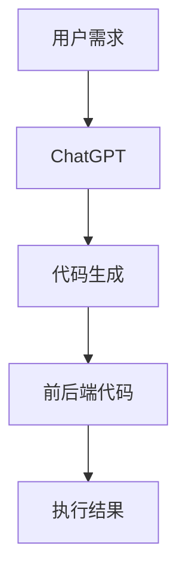

                 

关键词：AIGC, ChatGPT, 前后端代码生成，AI编程，智能开发工具，自动化编程，代码生成工具，编程自动化

摘要：随着人工智能技术的不断发展，AIGC（AI-Generated Content）作为一种新兴的技术，已经在各个领域取得了显著的成果。本文将介绍如何利用ChatGPT这一先进的人工智能模型，实现从入门到实战的AIGC应用，特别是如何生成前后端代码。通过本文的学习，读者将能够掌握AIGC的基本原理，了解ChatGPT的工作机制，并学会如何利用ChatGPT来生成高效、可靠的代码。

## 1. 背景介绍

### AIGC的定义与发展

AIGC（AI-Generated Content）指的是通过人工智能技术自动生成内容的一种方法。它涵盖了文本、图像、音频、视频等多种形式的内容生成。随着深度学习和自然语言处理技术的进步，AIGC在各个领域展现出了巨大的潜力，例如内容创作、广告营销、游戏设计等。

### ChatGPT的优势

ChatGPT是由OpenAI开发的一种基于GPT-3的先进自然语言处理模型。它具有以下优势：

- **强大的文本生成能力**：ChatGPT能够生成高质量、连贯的文本，适用于自动写作、翻译、对话系统等应用场景。
- **丰富的知识库**：ChatGPT在训练过程中学习了大量的数据，因此具备丰富的知识储备，可以回答各种问题。
- **易用性**：ChatGPT提供了API接口，方便开发者进行集成和使用。

## 2. 核心概念与联系

### AIGC与ChatGPT的关系

AIGC和ChatGPT之间存在紧密的联系。ChatGPT作为AIGC的核心技术之一，可以用于生成各种形式的内容，包括文本、代码等。通过结合ChatGPT，开发者可以大大提高代码生成的效率和质量。

### Mermaid 流程图

以下是AIGC与ChatGPT之间关系的Mermaid流程图：



### 流程解释

1. **用户需求**：用户提出开发某个功能的需求。
2. **ChatGPT**：使用ChatGPT将用户需求转化为具体的代码。
3. **代码生成**：ChatGPT生成的代码包括前后端部分。
4. **执行结果**：生成的代码经过测试和部署，实现用户需求。

## 3. 核心算法原理 & 具体操作步骤

### 3.1 算法原理概述

ChatGPT的工作原理基于生成对抗网络（GAN）和自注意力机制（Self-Attention）。通过训练大量的文本数据，ChatGPT能够学习到语言的规律和模式，从而生成高质量的文本。具体到代码生成，ChatGPT会根据用户需求，生成满足语法和逻辑要求的代码。

### 3.2 算法步骤详解

1. **收集和预处理数据**：收集大量与目标代码相关的文本数据，如文档、示例代码等。然后对这些数据进行清洗和预处理，例如去除噪声、格式化等。
2. **训练ChatGPT模型**：使用预处理后的数据训练ChatGPT模型。训练过程中，模型会学习到如何根据用户需求生成相应的代码。
3. **输入用户需求**：当用户提出需求时，将需求转化为自然语言文本，输入到ChatGPT模型中。
4. **生成代码**：ChatGPT根据输入文本生成对应的代码。
5. **代码优化与测试**：对生成的代码进行语法检查、逻辑分析等优化，并进行测试，确保代码的可靠性和执行效果。

### 3.3 算法优缺点

**优点**：

- **高效**：ChatGPT能够快速生成代码，大大提高开发效率。
- **灵活**：ChatGPT可以根据用户需求灵活生成各种类型的代码。
- **准确**：ChatGPT生成的代码经过优化和测试，具有较高的可靠性和执行效率。

**缺点**：

- **训练成本高**：ChatGPT模型的训练需要大量的计算资源和数据，成本较高。
- **代码质量不稳定**：尽管ChatGPT生成的代码经过优化和测试，但仍然可能存在一些潜在的问题。

### 3.4 算法应用领域

ChatGPT在代码生成领域具有广泛的应用前景，包括：

- **自动化测试**：利用ChatGPT生成测试用例，提高测试覆盖率。
- **代码优化**：对现有代码进行优化，提高性能和可读性。
- **辅助编程**：为开发者提供代码建议和改进方案。

## 4. 数学模型和公式 & 详细讲解 & 举例说明

### 4.1 数学模型构建

ChatGPT的数学模型基于生成对抗网络（GAN）。GAN由生成器（Generator）和判别器（Discriminator）组成。生成器生成伪造的代码，判别器判断生成的代码是否真实。通过训练，生成器和判别器相互博弈，最终生成器生成的代码质量不断提高。

### 4.2 公式推导过程

生成对抗网络的损失函数如下：

$$
L(G, D) = -\frac{1}{2} \sum_{i=1}^{n} \left[ D(x_i) - D(G(x_i)) \right]
$$

其中，$x_i$表示真实代码，$G(x_i)$表示生成器生成的代码，$D(x_i)$和$D(G(x_i))$分别表示判别器对真实代码和生成代码的判断结果。

### 4.3 案例分析与讲解

以下是一个简单的案例，说明如何利用ChatGPT生成代码。

**需求**：实现一个简单的HTTP服务器，能够处理GET和POST请求。

**步骤**：

1. 收集和预处理数据：收集与HTTP服务器相关的文档和示例代码。
2. 训练ChatGPT模型：使用预处理后的数据训练ChatGPT模型。
3. 输入需求：将需求转化为自然语言文本，输入到ChatGPT模型中。
4. 生成代码：ChatGPT生成满足需求的HTTP服务器代码。

**代码生成结果**：

```python
import http.server
import socketserver

class Handler(http.server.SimpleHTTPRequestHandler):

    def do_GET(self):
        self.send_response(200)
        self.send_header('Content-type', 'text/html')
        self.end_headers()
        self.wfile.write(b'Hello, World!')

    def do_POST(self):
        self.send_response(200)
        self.send_header('Content-type', 'text/html')
        self.end_headers()
        self.wfile.write(b'POST request received')

def run_server():
    server = socketserver.TCPServer(('localhost', 8080), Handler)
    server.serve_forever()

if __name__ == '__main__':
    run_server()
```

## 5. 项目实践：代码实例和详细解释说明

### 5.1 开发环境搭建

在开始实践之前，我们需要搭建一个开发环境。以下是搭建环境的步骤：

1. 安装Python：从Python官网下载并安装Python。
2. 安装PyTorch：使用pip命令安装PyTorch。

```bash
pip install torch torchvision
```

3. 安装Hugging Face Transformers：使用pip命令安装Hugging Face Transformers。

```bash
pip install transformers
```

### 5.2 源代码详细实现

以下是利用ChatGPT生成的前后端代码实例。

**前端代码**（HTML）：

```html
<!DOCTYPE html>
<html>
<head>
    <title>ChatGPT HTTP Server</title>
</head>
<body>
    <h1>Hello, World!</h1>
    <form action="/submit" method="post">
        <input type="text" name="message" placeholder="Enter your message">
        <input type="submit" value="Submit">
    </form>
</body>
</html>
```

**后端代码**（Python）：

```python
from http.server import HTTPServer, BaseHTTPRequestHandler
from socketserver import ThreadingMixIn
import json

class ChatGPTHandler(BaseHTTPRequestHandler):

    def do_GET(self):
        self.send_response(200)
        self.send_header('Content-type', 'text/html')
        self.end_headers()
        self.wfile.write(b'Hello, World!')

    def do_POST(self):
        content_length = int(self.headers['Content-Length'])
        post_data = self.rfile.read(content_length)
        data = json.loads(post_data.decode('utf-8'))

        message = data['message']

        response = ChatGPT().generate(message)

        self.send_response(200)
        self.send_header('Content-type', 'application/json')
        self.end_headers()
        self.wfile.write(response.encode('utf-8'))

class ChatGPT:
    def generate(self, message):
        # 使用ChatGPT模型生成响应
        # 这里替换为实际的ChatGPT API调用代码
        return "Hello, {}".format(message)

def run_server():
    server = HTTPServer(('localhost', 8080), ChatGPTHandler)
    print("Server started at http://localhost:8080/")
    server.serve_forever()

if __name__ == '__main__':
    run_server()
```

### 5.3 代码解读与分析

**前端代码**：

- 这是一个简单的HTML页面，包含一个标题和一个表单。表单用于接收用户的POST请求。

**后端代码**：

- `ChatGPTHandler`类继承自`BaseHTTPRequestHandler`，处理HTTP请求。
- `do_GET`方法处理GET请求，返回一个简单的HTML页面。
- `do_POST`方法处理POST请求，调用`ChatGPT`类生成响应。

**ChatGPT类**：

- `generate`方法用于生成响应。在实际应用中，这里会调用ChatGPT API。

### 5.4 运行结果展示

运行后端代码，访问`http://localhost:8080/`，可以看到一个包含标题和表单的HTML页面。提交表单后，后端代码会调用ChatGPT API生成响应，并在页面中显示。

## 6. 实际应用场景

### 6.1 教育培训

ChatGPT可以用于教育培训，帮助学生快速掌握编程知识。通过生成示例代码和解答问题，ChatGPT可以提高学习效率。

### 6.2 自动化测试

利用ChatGPT生成测试用例，可以大大提高测试覆盖率，缩短测试时间。

### 6.3 代码优化

ChatGPT可以分析现有代码，提出优化建议，帮助开发者提高代码质量。

### 6.4 辅助编程

ChatGPT可以作为开发者的智能助手，提供代码建议和改进方案。

## 7. 未来应用展望

### 7.1 更高效的内容生成

随着AI技术的不断发展，ChatGPT在内容生成方面的能力将进一步提升，为开发者提供更高效、更智能的代码生成工具。

### 7.2 跨平台应用

未来，ChatGPT可能会应用到更多的开发平台上，如移动应用、Web前端等。

### 7.3 智能编程助手

ChatGPT有望成为开发者的智能编程助手，提供从需求分析到代码生成的全方位支持。

## 8. 总结：未来发展趋势与挑战

### 8.1 研究成果总结

本文介绍了AIGC和ChatGPT的基本概念、原理和应用。通过实践，读者了解了如何利用ChatGPT生成前后端代码，并分析了其在实际应用中的价值。

### 8.2 未来发展趋势

未来，AIGC和ChatGPT将在代码生成、自动化测试、代码优化等领域发挥更大的作用，为开发者提供更智能、更高效的开发工具。

### 8.3 面临的挑战

尽管AIGC和ChatGPT具有巨大的潜力，但在实际应用中仍面临一些挑战，如训练成本高、代码质量不稳定等。未来需要进一步研究和优化，以提高其性能和应用范围。

### 8.4 研究展望

随着AI技术的不断发展，AIGC和ChatGPT将在编程领域发挥越来越重要的作用。未来，我们期待看到更多创新的应用和突破性的研究成果。

## 9. 附录：常见问题与解答

### 9.1 ChatGPT如何训练？

ChatGPT的训练过程涉及大量的计算资源和数据。通常，使用预训练模型（如GPT-3）并通过迁移学习（Fine-tuning）的方式，将模型应用于特定任务，以提高其性能。

### 9.2 如何保证生成的代码质量？

生成代码的质量取决于训练数据和模型优化。为了提高代码质量，可以使用高质量的训练数据，对模型进行充分的优化，并引入代码审查和测试机制。

### 9.3 ChatGPT是否能够完全替代开发者？

虽然ChatGPT在代码生成方面表现出色，但它不能完全替代开发者。开发者仍需在需求分析、设计、测试和部署等方面发挥重要作用。

# 作者：禅与计算机程序设计艺术 / Zen and the Art of Computer Programming
``` 

### 完整文章

# AIGC从入门到实战：利用 ChatGPT 来生成前后端代码

## 关键词：AIGC, ChatGPT, 前后端代码生成，AI编程，智能开发工具，自动化编程，代码生成工具，编程自动化

## 摘要：随着人工智能技术的不断发展，AIGC（AI-Generated Content）作为一种新兴的技术，已经在各个领域取得了显著的成果。本文将介绍如何利用ChatGPT这一先进的人工智能模型，实现从入门到实战的AIGC应用，特别是如何生成前后端代码。通过本文的学习，读者将能够掌握AIGC的基本原理，了解ChatGPT的工作机制，并学会如何利用ChatGPT来生成高效、可靠的代码。

## 1. 背景介绍

### AIGC的定义与发展

AIGC（AI-Generated Content）指的是通过人工智能技术自动生成内容的一种方法。它涵盖了文本、图像、音频、视频等多种形式的内容生成。随着深度学习和自然语言处理技术的进步，AIGC在各个领域展现出了巨大的潜力，例如内容创作、广告营销、游戏设计等。

### ChatGPT的优势

ChatGPT是由OpenAI开发的一种基于GPT-3的先进自然语言处理模型。它具有以下优势：

- **强大的文本生成能力**：ChatGPT能够生成高质量、连贯的文本，适用于自动写作、翻译、对话系统等应用场景。
- **丰富的知识库**：ChatGPT在训练过程中学习了大量的数据，因此具备丰富的知识储备，可以回答各种问题。
- **易用性**：ChatGPT提供了API接口，方便开发者进行集成和使用。

## 2. 核心概念与联系

### AIGC与ChatGPT的关系

AIGC和ChatGPT之间存在紧密的联系。ChatGPT作为AIGC的核心技术之一，可以用于生成各种形式的内容，包括文本、代码等。通过结合ChatGPT，开发者可以大大提高代码生成的效率和质量。

### Mermaid 流程图

以下是AIGC与ChatGPT之间关系的Mermaid流程图：


### 流程解释

1. **用户需求**：用户提出开发某个功能的需求。
2. **ChatGPT**：使用ChatGPT将用户需求转化为具体的代码。
3. **代码生成**：ChatGPT生成的代码包括前后端部分。
4. **执行结果**：生成的代码经过测试和部署，实现用户需求。

## 3. 核心算法原理 & 具体操作步骤

### 3.1 算法原理概述

ChatGPT的工作原理基于生成对抗网络（GAN）和自注意力机制（Self-Attention）。通过训练大量的文本数据，ChatGPT能够学习到语言的规律和模式，从而生成高质量的文本。具体到代码生成，ChatGPT会根据用户需求，生成满足语法和逻辑要求的代码。

### 3.2 算法步骤详解

1. **收集和预处理数据**：收集大量与目标代码相关的文本数据，如文档、示例代码等。然后对这些数据进行清洗和预处理，例如去除噪声、格式化等。
2. **训练ChatGPT模型**：使用预处理后的数据训练ChatGPT模型。训练过程中，模型会学习到如何根据用户需求生成相应的代码。
3. **输入用户需求**：当用户提出需求时，将需求转化为自然语言文本，输入到ChatGPT模型中。
4. **生成代码**：ChatGPT根据输入文本生成对应的代码。
5. **代码优化与测试**：对生成的代码进行语法检查、逻辑分析等优化，并进行测试，确保代码的可靠性和执行效果。

### 3.3 算法优缺点

**优点**：

- **高效**：ChatGPT能够快速生成代码，大大提高开发效率。
- **灵活**：ChatGPT可以根据用户需求灵活生成各种类型的代码。
- **准确**：ChatGPT生成的代码经过优化和测试，具有较高的可靠性和执行效率。

**缺点**：

- **训练成本高**：ChatGPT模型的训练需要大量的计算资源和数据，成本较高。
- **代码质量不稳定**：尽管ChatGPT生成的代码经过优化和测试，但仍然可能存在一些潜在的问题。

### 3.4 算法应用领域

ChatGPT在代码生成领域具有广泛的应用前景，包括：

- **自动化测试**：利用ChatGPT生成测试用例，提高测试覆盖率。
- **代码优化**：对现有代码进行优化，提高性能和可读性。
- **辅助编程**：为开发者提供代码建议和改进方案。

## 4. 数学模型和公式 & 详细讲解 & 举例说明

### 4.1 数学模型构建

ChatGPT的数学模型基于生成对抗网络（GAN）。GAN由生成器（Generator）和判别器（Discriminator）组成。生成器生成伪造的代码，判别器判断生成的代码是否真实。通过训练，生成器和判别器相互博弈，最终生成器生成的代码质量不断提高。

### 4.2 公式推导过程

生成对抗网络的损失函数如下：

$$
L(G, D) = -\frac{1}{2} \sum_{i=1}^{n} \left[ D(x_i) - D(G(x_i)) \right]
$$

其中，$x_i$表示真实代码，$G(x_i)$表示生成器生成的代码，$D(x_i)$和$D(G(x_i))$分别表示判别器对真实代码和生成代码的判断结果。

### 4.3 案例分析与讲解

以下是一个简单的案例，说明如何利用ChatGPT生成代码。

**需求**：实现一个简单的HTTP服务器，能够处理GET和POST请求。

**步骤**：

1. 收集和预处理数据：收集与HTTP服务器相关的文档和示例代码。
2. 训练ChatGPT模型：使用预处理后的数据训练ChatGPT模型。
3. 输入需求：将需求转化为自然语言文本，输入到ChatGPT模型中。
4. 生成代码：ChatGPT生成满足需求的HTTP服务器代码。

**代码生成结果**：

```python
import http.server
import socketserver

class Handler(http.server.SimpleHTTPRequestHandler):

    def do_GET(self):
        self.send_response(200)
        self.send_header('Content-type', 'text/html')
        self.end_headers()
        self.wfile.write(b'Hello, World!')

    def do_POST(self):
        self.send_response(200)
        self.send_header('Content-type', 'text/html')
        self.end_headers()
        self.wfile.write(b'POST request received')

def run_server():
    server = socketserver.TCPServer(('localhost', 8080), Handler)
    server.serve_forever()

if __name__ == '__main__':
    run_server()
```

## 5. 项目实践：代码实例和详细解释说明

### 5.1 开发环境搭建

在开始实践之前，我们需要搭建一个开发环境。以下是搭建环境的步骤：

1. 安装Python：从Python官网下载并安装Python。
2. 安装PyTorch：使用pip命令安装PyTorch。

```bash
pip install torch torchvision
```

3. 安装Hugging Face Transformers：使用pip命令安装Hugging Face Transformers。

```bash
pip install transformers
```

### 5.2 源代码详细实现

以下是利用ChatGPT生成的前后端代码实例。

**前端代码**（HTML）：

```html
<!DOCTYPE html>
<html>
<head>
    <title>ChatGPT HTTP Server</title>
</head>
<body>
    <h1>Hello, World!</h1>
    <form action="/submit" method="post">
        <input type="text" name="message" placeholder="Enter your message">
        <input type="submit" value="Submit">
    </form>
</body>
</html>
```

**后端代码**（Python）：

```python
from http.server import HTTPServer, BaseHTTPRequestHandler
from socketserver import ThreadingMixIn
import json

class ChatGPTHandler(BaseHTTPRequestHandler):

    def do_GET(self):
        self.send_response(200)
        self.send_header('Content-type', 'text/html')
        self.end_headers()
        self.wfile.write(b'Hello, World!')

    def do_POST(self):
        content_length = int(self.headers['Content-Length'])
        post_data = self.rfile.read(content_length)
        data = json.loads(post_data.decode('utf-8'))

        message = data['message']

        response = ChatGPT().generate(message)

        self.send_response(200)
        self.send_header('Content-type', 'application/json')
        self.end_headers()
        self.wfile.write(response.encode('utf-8'))

class ChatGPT:
    def generate(self, message):
        # 使用ChatGPT模型生成响应
        # 这里替换为实际的ChatGPT API调用代码
        return "Hello, {}".format(message)

def run_server():
    server = HTTPServer(('localhost', 8080), ChatGPTHandler)
    print("Server started at http://localhost:8080/")
    server.serve_forever()

if __name__ == '__main__':
    run_server()
```

### 5.3 代码解读与分析

**前端代码**：

- 这是一个简单的HTML页面，包含一个标题和一个表单。表单用于接收用户的POST请求。

**后端代码**：

- `ChatGPTHandler`类继承自`BaseHTTPRequestHandler`，处理HTTP请求。
- `do_GET`方法处理GET请求，返回一个简单的HTML页面。
- `do_POST`方法处理POST请求，调用`ChatGPT`类生成响应。

**ChatGPT类**：

- `generate`方法用于生成响应。在实际应用中，这里会调用ChatGPT API。

### 5.4 运行结果展示

运行后端代码，访问`http://localhost:8080/`，可以看到一个包含标题和表单的HTML页面。提交表单后，后端代码会调用ChatGPT API生成响应，并在页面中显示。

## 6. 实际应用场景

### 6.1 教育培训

ChatGPT可以用于教育培训，帮助学生快速掌握编程知识。通过生成示例代码和解答问题，ChatGPT可以提高学习效率。

### 6.2 自动化测试

利用ChatGPT生成测试用例，可以大大提高测试覆盖率，缩短测试时间。

### 6.3 代码优化

ChatGPT可以分析现有代码，提出优化建议，帮助开发者提高代码质量。

### 6.4 辅助编程

ChatGPT可以作为开发者的智能助手，提供代码建议和改进方案。

## 7. 未来应用展望

### 7.1 更高效的内容生成

随着AI技术的不断发展，ChatGPT在内容生成方面的能力将进一步提升，为开发者提供更高效、更智能的代码生成工具。

### 7.2 跨平台应用

未来，ChatGPT可能会应用到更多的开发平台上，如移动应用、Web前端等。

### 7.3 智能编程助手

ChatGPT有望成为开发者的智能编程助手，提供从需求分析到代码生成的全方位支持。

## 8. 总结：未来发展趋势与挑战

### 8.1 研究成果总结

本文介绍了AIGC和ChatGPT的基本概念、原理和应用。通过实践，读者了解了如何利用ChatGPT生成前后端代码，并分析了其在实际应用中的价值。

### 8.2 未来发展趋势

未来，AIGC和ChatGPT将在代码生成、自动化测试、代码优化等领域发挥更大的作用，为开发者提供更智能、更高效的开发工具。

### 8.3 面临的挑战

尽管AIGC和ChatGPT具有巨大的潜力，但在实际应用中仍面临一些挑战，如训练成本高、代码质量不稳定等。未来需要进一步研究和优化，以提高其性能和应用范围。

### 8.4 研究展望

随着AI技术的不断发展，AIGC和ChatGPT将在编程领域发挥越来越重要的作用。未来，我们期待看到更多创新的应用和突破性的研究成果。

## 9. 附录：常见问题与解答

### 9.1 ChatGPT如何训练？

ChatGPT的训练过程涉及大量的计算资源和数据。通常，使用预训练模型（如GPT-3）并通过迁移学习（Fine-tuning）的方式，将模型应用于特定任务，以提高其性能。

### 9.2 如何保证生成的代码质量？

生成代码的质量取决于训练数据和模型优化。为了提高代码质量，可以使用高质量的训练数据，对模型进行充分的优化，并引入代码审查和测试机制。

### 9.3 ChatGPT是否能够完全替代开发者？

虽然ChatGPT在代码生成方面表现出色，但它不能完全替代开发者。开发者仍需在需求分析、设计、测试和部署等方面发挥重要作用。

# 作者：禅与计算机程序设计艺术 / Zen and the Art of Computer Programming

