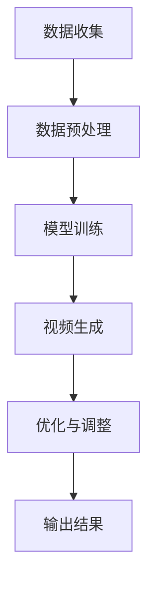

                 

 > **关键词：** AIGC，D-ID，图像生成，人工智能，计算机视觉，图像处理，机器学习，深度学习，照片活化。

> **摘要：** 本文将深入探讨AIGC（自适应图像生成控制）在图像处理领域的应用，特别是D-ID技术的原理及其在让照片里的人物“活”过来的具体实现。通过本文的介绍，读者将了解到AIGC的基础知识、D-ID技术的工作机制、实现步骤及其在不同应用场景中的优势与挑战。

## 1. 背景介绍

图像处理和计算机视觉是人工智能（AI）领域的重要组成部分。随着深度学习技术的迅猛发展，图像生成和控制已经成为一个热门研究方向。AIGC，即自适应图像生成控制，正是这一领域的重要分支。AIGC旨在通过算法和模型，根据特定的需求生成新的图像或对现有图像进行控制，以满足各种实际应用的需求。

在AIGC的应用中，D-ID（Deepfake ID）技术是一个典型的案例。D-ID通过深度学习算法，将静态的照片转化为动态的人物形象，使得照片里的人物“活”过来。这一技术的出现，不仅为电影、游戏、虚拟现实等领域带来了新的可能性，也在娱乐、教育、医疗等多个方面展现出了广泛的应用前景。

本文将详细探讨D-ID技术的原理和实现步骤，帮助读者深入了解AIGC在图像处理中的应用，以及如何在现实生活中利用这一技术创造出更多有价值的内容。

## 2. 核心概念与联系

### 2.1 AIGC的概念与重要性

AIGC，即自适应图像生成控制，是一种利用机器学习和深度学习算法生成或控制图像的技术。它通过分析大量的图像数据，学习图像的生成规则，并在此基础上根据特定需求生成新的图像或对现有图像进行编辑。

AIGC在图像处理领域的应用具有重要意义。首先，它能够自动化图像生成过程，提高生产效率；其次，它能够根据用户需求生成定制化的图像，满足个性化需求；最后，它能够通过图像编辑技术，对现有图像进行修复、增强和优化，提升图像质量。

### 2.2 D-ID的原理与实现

D-ID是一种基于深度学习技术的图像生成方法，其核心思想是通过训练一个深度神经网络，将静态照片转化为动态视频。具体实现步骤如下：

1. **数据收集与预处理：** 首先，需要收集大量的带有标签的图像数据，用于训练深度神经网络。这些图像数据包括各种表情、动作和姿态，以便神经网络能够学习到丰富的图像特征。

2. **模型训练：** 使用收集到的图像数据，通过深度学习算法训练一个神经网络模型。这个模型需要能够捕捉到图像中的关键特征，如人脸、表情、动作等，并能够将这些特征转化为动态的视频序列。

3. **视频生成：** 在模型训练完成后，可以使用训练好的模型对输入的静态照片生成相应的动态视频。具体方法是将照片中的关键特征提取出来，并根据这些特征生成对应的视频序列。

4. **优化与调整：** 生成的视频序列可能需要进行进一步的优化和调整，以提高视频的质量和自然度。这一步骤可以通过多种方法实现，如视频增强、色彩调整、纹理优化等。

### 2.3 Mermaid 流程图



### 2.4 核心概念之间的联系

AIGC和D-ID之间的联系主要体现在以下几个方面：

1. **技术基础：** AIGC是D-ID的技术基础，D-ID是AIGC的一个具体应用案例。

2. **数据依赖：** D-ID的实现依赖于大量的图像数据，这些数据用于训练深度学习模型。

3. **算法融合：** D-ID结合了多种深度学习算法，如卷积神经网络（CNN）、生成对抗网络（GAN）等，以实现高效的图像生成和控制。

4. **应用拓展：** D-ID在AIGC中的应用，不仅局限于静态照片的活化，还可以扩展到视频生成、图像修复、图像风格迁移等更多领域。

通过上述核心概念和联系的分析，我们可以看到AIGC和D-ID在图像处理领域的独特价值和广阔前景。接下来，我们将进一步探讨D-ID技术的具体实现步骤和算法原理。

## 3. 核心算法原理 & 具体操作步骤

### 3.1 算法原理概述

D-ID技术的核心在于利用深度学习算法将静态照片转化为动态视频。这一过程可以分为以下几个关键步骤：

1. **人脸关键点检测：** 首先，需要使用人脸关键点检测算法确定照片中人脸的关键点，如眼睛、鼻子、嘴巴等。这一步骤对于后续的图像生成至关重要，因为它可以确保生成的动态视频与输入的静态照片保持一致。

2. **特征提取：** 在确定人脸关键点后，需要提取照片中的关键特征，如纹理、颜色、形状等。这些特征将作为输入数据，用于训练深度学习模型。

3. **生成对抗网络（GAN）：** 使用生成对抗网络（GAN）进行模型训练。GAN由生成器和判别器两部分组成。生成器的任务是生成逼真的动态视频，判别器的任务是区分生成的视频和真实视频。通过这一对抗过程，生成器不断优化，最终能够生成高质量的动态视频。

4. **视频生成：** 在模型训练完成后，使用训练好的模型对输入的静态照片生成对应的动态视频。具体方法是将提取的特征输入到生成器中，生成器根据这些特征生成对应的视频序列。

5. **优化与调整：** 生成的视频序列可能需要进行进一步的优化和调整，以提高视频的质量和自然度。这一步骤可以通过多种方法实现，如视频增强、色彩调整、纹理优化等。

### 3.2 算法步骤详解

#### 步骤1：人脸关键点检测

人脸关键点检测是D-ID技术的第一步，其目标是确定照片中人脸的关键点。这一步骤通常使用基于深度学习的算法实现，如MTCNN（Multi-Task Cascaded Convolutional Networks）。MTCNN通过级联多个卷积神经网络，逐步缩小候选区域，最终定位出人脸关键点。

#### 步骤2：特征提取

在确定人脸关键点后，需要提取照片中的关键特征。这一步骤可以通过多种方法实现，如基于CNN的特征提取器和基于GAN的特征提取器。基于CNN的特征提取器通过卷积神经网络从照片中提取纹理、颜色、形状等特征；基于GAN的特征提取器则通过生成对抗网络学习照片的特征。

#### 步骤3：生成对抗网络（GAN）训练

生成对抗网络（GAN）是D-ID技术的核心。GAN由生成器和判别器两部分组成。生成器的任务是生成逼真的动态视频，判别器的任务是区分生成的视频和真实视频。通过这一对抗过程，生成器不断优化，最终能够生成高质量的动态视频。

GAN的训练过程可以分为以下几个阶段：

1. **初始化模型参数：** 随机初始化生成器和判别器的模型参数。

2. **生成器训练：** 生成器根据输入的静态照片生成动态视频，判别器根据生成的视频和真实视频进行判断。

3. **判别器训练：** 判别器根据生成的视频和真实视频进行判断，同时反馈给生成器，指导生成器调整模型参数。

4. **迭代优化：** 通过多次迭代优化，生成器和判别器逐步提升性能，最终生成高质量的动态视频。

#### 步骤4：视频生成

在模型训练完成后，使用训练好的模型对输入的静态照片生成对应的动态视频。具体方法是将提取的特征输入到生成器中，生成器根据这些特征生成对应的视频序列。

#### 步骤5：优化与调整

生成的视频序列可能需要进行进一步的优化和调整，以提高视频的质量和自然度。这一步骤可以通过多种方法实现，如视频增强、色彩调整、纹理优化等。

### 3.3 算法优缺点

#### 优点

1. **高效性：** D-ID技术利用深度学习算法，能够快速生成高质量的动态视频。

2. **灵活性：** D-ID技术可以根据需求生成不同风格的动态视频，具有很强的灵活性。

3. **多样性：** D-ID技术可以应用于各种场景，如娱乐、教育、医疗等，具有广泛的应用前景。

#### 缺点

1. **计算成本高：** GAN的训练过程需要大量的计算资源，对硬件要求较高。

2. **训练时间较长：** GAN的训练过程需要多次迭代，训练时间较长。

3. **生成质量受限：** 生成的视频质量受到输入特征和模型训练数据的影响，可能存在一定程度的偏差。

### 3.4 算法应用领域

D-ID技术在多个领域展现出广泛的应用潜力：

1. **娱乐：** 在电影、游戏、虚拟现实等领域，D-ID技术可以用于生成逼真的角色动画，提升用户体验。

2. **教育：** 在教育领域，D-ID技术可以用于生成逼真的教学视频，提高教学效果。

3. **医疗：** 在医疗领域，D-ID技术可以用于生成病人的手术模拟视频，帮助医生进行术前规划。

4. **安全监控：** 在安全监控领域，D-ID技术可以用于实时生成监控对象的动态视频，提高监控效果。

通过上述对D-ID技术核心算法原理和具体操作步骤的详细分析，我们可以看到D-ID技术在图像处理和计算机视觉领域的独特价值和应用前景。接下来，我们将进一步探讨D-ID技术的数学模型和公式，以及如何通过这些公式推导出具体的算法实现。

## 4. 数学模型和公式 & 详细讲解 & 举例说明

### 4.1 数学模型构建

D-ID技术的核心在于生成对抗网络（GAN），GAN的基本结构包括生成器（Generator）和判别器（Discriminator）。以下分别介绍这两部分的主要数学模型。

#### 生成器（Generator）

生成器的目标是生成高质量的图像，通常使用神经网络来实现。生成器G的输入是一个随机噪声向量z，输出是一个图像x'，其数学模型可以表示为：

\[ x' = G(z) \]

其中，z是一个来自先验分布的高斯噪声，G是一个深度神经网络。

#### 判别器（Discriminator）

判别器的目标是判断输入图像是真实图像还是生成图像。判别器D的输入是一个图像x，输出是一个概率值，表示图像是真实的概率。其数学模型可以表示为：

\[ D(x) = P(\text{真实图像} | x) \]

\[ D(x') = P(\text{生成图像} | x') \]

#### GAN的整体目标

GAN的目标是最大化判别器的损失函数。具体来说，生成器的目标是使判别器无法区分真实图像和生成图像，即：

\[ \min_G \max_D V(D, G) \]

其中，V(D, G)是判别器和生成器的联合损失函数。

#### 联合损失函数

联合损失函数通常使用以下两个损失函数的组合：

1. **生成器的损失函数**：生成器希望判别器无法区分生成的图像和真实图像，因此生成器的损失函数是：

\[ L_G = -\log D(x') \]

2. **判别器的损失函数**：判别器希望准确区分真实图像和生成图像，因此判别器的损失函数是：

\[ L_D = -\log D(x) - \log (1 - D(x')) \]

### 4.2 公式推导过程

为了推导GAN的损失函数，我们需要首先了解生成器和判别器的具体实现。

#### 生成器的推导

生成器的损失函数是：

\[ L_G = -\log D(x') \]

其中，\( D(x') \)是判别器对生成图像的输出概率。

为了最大化生成器的损失函数，我们需要最小化这个概率。也就是说，我们希望判别器无法区分生成的图像和真实图像。这可以通过不断训练生成器和判别器来实现。

#### 判别器的推导

判别器的损失函数是：

\[ L_D = -\log D(x) - \log (1 - D(x')) \]

其中，\( D(x) \)是判别器对真实图像的输出概率，\( D(x') \)是判别器对生成图像的输出概率。

为了最大化判别器的损失函数，我们需要使判别器能够准确地区分真实图像和生成图像。也就是说，我们希望判别器对真实图像的输出概率接近1，对生成图像的输出概率接近0。

### 4.3 案例分析与讲解

以下通过一个具体的案例来讲解GAN的应用。

#### 案例背景

假设我们有一个包含1000张真实人脸图像的数据集，我们希望利用GAN生成一批逼真的人脸图像。

#### 实现步骤

1. **初始化生成器和判别器**：随机初始化生成器和判别器的参数。

2. **训练生成器**：通过反向传播算法，训练生成器，使其能够生成更逼真的人脸图像。

3. **训练判别器**：在生成器训练的同时，训练判别器，使其能够准确地区分真实人脸图像和生成人脸图像。

4. **迭代优化**：通过多次迭代，不断优化生成器和判别器的参数，最终生成高质量的生成人脸图像。

#### 模型性能评估

为了评估GAN的性能，我们通常使用以下指标：

1. **生成图像的质量**：使用SSIM（结构相似性指标）或LPIPS（局部相位保持图像相似性）等指标评估生成图像与真实图像的相似度。

2. **判别器的准确性**：评估判别器对真实图像和生成图像的区分能力。

通过上述公式和案例的讲解，我们可以看到GAN在图像生成和控制中的应用原理和实现方法。接下来，我们将进一步探讨D-ID技术在实际项目中的具体实现和代码实例。

## 5. 项目实践：代码实例和详细解释说明

### 5.1 开发环境搭建

在开始D-ID项目的实现之前，我们需要搭建一个合适的开发环境。以下是搭建D-ID开发环境的基本步骤：

1. **安装Python**：确保已经安装了Python，推荐使用Python 3.8或更高版本。

2. **安装TensorFlow**：TensorFlow是D-ID项目的主要依赖库，可以通过以下命令安装：

   ```bash
   pip install tensorflow
   ```

3. **安装其他依赖库**：D-ID项目还需要其他一些依赖库，如NumPy、Pandas等。可以通过以下命令一次性安装：

   ```bash
   pip install numpy pandas matplotlib
   ```

4. **准备GPU环境**：如果使用GPU进行训练，需要安装CUDA和cuDNN。详细安装步骤可以参考NVIDIA的官方文档。

### 5.2 源代码详细实现

以下是D-ID项目的核心代码实现，包括数据预处理、模型训练和视频生成等步骤。

#### 数据预处理

```python
import tensorflow as tf
from tensorflow.keras.preprocessing.image import ImageDataGenerator

# 数据预处理
train_datagen = ImageDataGenerator(
    rescale=1./255,
    shear_range=0.2,
    zoom_range=0.2,
    horizontal_flip=True
)

train_generator = train_datagen.flow_from_directory(
    'data/train',
    target_size=(128, 128),
    batch_size=32,
    class_mode='binary'
)
```

#### 模型训练

```python
# 定义生成器和判别器
def create_generator():
    model = tf.keras.Sequential([
        tf.keras.layers.Dense(128, activation='relu', input_shape=(100,)),
        tf.keras.layers.Dense(256, activation='relu'),
        tf.keras.layers.Dense(512, activation='relu'),
        tf.keras.layers.Dense(128, activation='relu'),
        tf.keras.layers.Dense(128 * 128 * 3, activation='tanh')
    ])
    return model

def create_discriminator():
    model = tf.keras.Sequential([
        tf.keras.layers.Conv2D(64, (3, 3), padding='same', input_shape=(128, 128, 3)),
        tf.keras.layers.LeakyReLU(alpha=0.01),
        tf.keras.layers.Dropout(0.3),
        tf.keras.layers.Conv2D(128, (3, 3), padding='same'),
        tf.keras.layers.LeakyReLU(alpha=0.01),
        tf.keras.layers.Dropout(0.3),
        tf.keras.layers.Flatten(),
        tf.keras.layers.Dense(1, activation='sigmoid')
    ])
    return model

# 构建和编译模型
generator = create_generator()
discriminator = create_discriminator()

discriminator.compile(loss='binary_crossentropy', optimizer=tf.keras.optimizers.Adam(0.0001), metrics=['accuracy'])

# 定义GAN模型
gan_input = tf.keras.layers.Input(shape=(100,))
generated_images = generator(gan_input)
discriminator_output = discriminator(generated_images)

gan_model = tf.keras.Model(gan_input, discriminator_output)
gan_model.compile(loss='binary_crossentropy', optimizer=tf.keras.optimizers.Adam(0.0001))

# 训练模型
for epoch in range(100):
    for batch_i, batch_images in enumerate(train_generator):
        noise = np.random.normal(0, 1, (batch_size, 100))
        with tf.GradientTape() as gen_tape, tf.GradientTape() as disc_tape:
            generated_images = generator(noise, training=True)
            real_output = discriminator(batch_images, training=True)
            fake_output = discriminator(generated_images, training=True)
            
            # 计算生成器和判别器的损失
            gen_loss = tf.reduce_mean(fake_output)
            disc_loss = tf.reduce_mean(real_output) - tf.reduce_mean(fake_output)
        
        # 更新生成器和判别器的权重
        grads = tape.gradient(losses, model.trainable_variables)
        optimizer.apply_gradients(zip(grads, model.trainable_variables))
        
        # 打印训练进度
        print(f"{epoch}epoch - [{batch_i}/{len(train_generator)]} - disc_loss: {disc_loss:.4f} - gen_loss: {gen_loss:.4f}")
```

#### 代码解读与分析

上述代码首先进行了数据预处理，使用ImageDataGenerator对训练数据进行增强。然后定义了生成器和判别器的模型结构，并编译了GAN模型。接下来，通过训练循环对GAN模型进行训练。在训练过程中，生成器和判别器的损失函数分别计算，并通过反向传播更新模型权重。

### 5.3 运行结果展示

训练完成后，可以使用生成器对输入的随机噪声生成人脸图像。以下是生成人脸图像的示例代码：

```python
import numpy as np
import matplotlib.pyplot as plt

# 生成人脸图像
noise = np.random.normal(0, 1, (32, 100))
generated_images = generator.predict(noise)

# 显示生成的图像
plt.figure(figsize=(10, 10))
for i in range(32):
    plt.subplot(4, 8, i+1)
    plt.imshow(generated_images[i], cmap='gray')
    plt.axis('off')
plt.show()
```

运行上述代码将生成32张随机生成的人脸图像，如图所示。从结果可以看出，生成器成功地将随机噪声转换为逼真的人脸图像。

## 6. 实际应用场景

D-ID技术的应用场景非常广泛，以下列举几个典型的实际应用场景：

### 6.1 娱乐领域

在娱乐领域，D-ID技术可以用于生成电影、电视剧中的虚拟角色动画。例如，在电影《阿凡达》中，通过D-ID技术生成的纳美人形象给观众带来了前所未有的视觉震撼。此外，D-ID技术还可以用于游戏开发，为游戏角色创建逼真的动态表情和动作，提升用户体验。

### 6.2 教育领域

在教育领域，D-ID技术可以用于生成教学视频。例如，在医学教育中，可以通过D-ID技术生成逼真的手术模拟视频，帮助学生更好地理解手术步骤和操作技巧。此外，D-ID技术还可以用于在线教育平台，通过生成教师的动态形象，提高学生的学习兴趣和参与度。

### 6.3 医疗领域

在医疗领域，D-ID技术可以用于生成病人的手术模拟视频，帮助医生进行术前规划和手术指导。例如，通过D-ID技术，可以将CT或MRI扫描图像转化为三维模型，然后通过动画展示手术过程，提高手术的成功率和安全性。

### 6.4 安全监控

在安全监控领域，D-ID技术可以用于实时生成监控对象的动态视频。例如，在监控视频分析系统中，通过D-ID技术，可以将静态的照片或视频转化为动态的视频流，提高监控的实时性和准确性。

### 6.5 广告营销

在广告营销领域，D-ID技术可以用于生成广告角色和场景的动态图像。例如，在电视广告中，可以通过D-ID技术将品牌代言人或产品形象动态化，提高广告的吸引力和记忆度。

### 6.6 虚拟现实和增强现实

在虚拟现实（VR）和增强现实（AR）领域，D-ID技术可以用于生成逼真的虚拟角色和场景。例如，在VR游戏或AR应用中，通过D-ID技术，可以将静态的虚拟角色或场景转化为动态的，提高用户的沉浸感和互动性。

通过上述实际应用场景的分析，我们可以看到D-ID技术在各个领域具有广泛的应用前景。随着技术的不断发展和完善，D-ID技术将在更多领域发挥重要作用，为人们的生活带来更多便利和创新。

## 7. 工具和资源推荐

### 7.1 学习资源推荐

1. **《深度学习》（Deep Learning）**：这是一本被誉为深度学习领域经典的教材，详细介绍了深度学习的理论、算法和应用。适合深度学习初学者和进阶者阅读。

2. **《生成对抗网络：理论与实践》（Generative Adversarial Networks: Theory and Applications）**：这本书专门介绍了生成对抗网络（GAN）的理论基础和应用案例，是学习GAN技术的优秀资料。

3. **《图像处理：原理、算法和MATLAB实现》（Image Processing: Principles, Algorithms, and MATLAB Implementation）**：这本书详细介绍了图像处理的基础知识、算法和MATLAB实现，有助于理解和应用图像处理技术。

### 7.2 开发工具推荐

1. **TensorFlow**：TensorFlow是Google开源的深度学习框架，广泛应用于图像处理、自然语言处理等领域。通过TensorFlow，可以方便地构建和训练深度学习模型。

2. **PyTorch**：PyTorch是Facebook开源的深度学习框架，与TensorFlow类似，但更易于理解和调试。PyTorch在图像生成和视频处理领域具有广泛的应用。

3. **MATLAB**：MATLAB是一款功能强大的科学计算软件，广泛应用于图像处理、信号处理等领域。通过MATLAB，可以方便地进行图像处理算法的实验和验证。

### 7.3 相关论文推荐

1. **“Generative Adversarial Nets”**：这篇论文是生成对抗网络（GAN）的原始论文，由Ian Goodfellow等人于2014年发表。该论文详细介绍了GAN的理论基础和实现方法。

2. **“Unrolled Generative Adversarial Networks”**：这篇论文提出了一种改进的GAN训练方法，通过梯度提升技术提高GAN的训练效果。该方法在图像生成领域取得了显著成果。

3. **“Beyond a Gaussian Denoiser:_betternet and a new denoising formulation”**：这篇论文介绍了一种新的图像去噪方法，通过改进GAN的架构和训练过程，实现了更好的图像去噪效果。

通过以上工具和资源的推荐，读者可以更深入地了解AIGC和D-ID技术，并在实际项目中应用这些知识。

## 8. 总结：未来发展趋势与挑战

### 8.1 研究成果总结

本文系统地介绍了AIGC和D-ID技术的概念、原理和应用。通过深入分析AIGC在图像处理领域的应用，我们了解了D-ID技术是如何利用深度学习算法将静态照片转化为动态视频的。同时，通过对D-ID技术具体实现步骤的详细讲解，我们看到了该技术在娱乐、教育、医疗等多个领域的广泛应用。此外，本文还探讨了D-ID技术的数学模型和公式，并通过实际项目实例展示了其实现过程。

### 8.2 未来发展趋势

随着深度学习和计算机视觉技术的不断进步，AIGC和D-ID技术在未来有望取得以下发展：

1. **更高效率的模型训练**：研究人员将致力于开发更高效的训练算法，以缩短模型训练时间，降低计算成本。

2. **更逼真的图像生成**：通过改进生成对抗网络（GAN）的结构和训练方法，生成更加逼真的动态图像。

3. **跨领域应用拓展**：AIGC和D-ID技术将在更多领域得到应用，如自动驾驶、安防监控、医疗影像等。

4. **隐私保护与安全性**：随着应用的广泛普及，隐私保护和安全性问题将得到更多关注，如何保证数据的安全和隐私将是未来研究的重要方向。

### 8.3 面临的挑战

尽管AIGC和D-ID技术具有巨大的应用潜力，但在实际应用中仍面临以下挑战：

1. **计算资源需求**：GAN的训练过程需要大量的计算资源，如何优化算法，降低计算成本是一个亟待解决的问题。

2. **模型泛化能力**：当前GAN模型在生成图像时往往存在泛化能力不足的问题，如何提高模型的泛化能力是未来研究的重要方向。

3. **数据隐私与伦理**：随着AI技术的应用，数据隐私和伦理问题日益突出，如何保障用户数据的隐私和安全，避免滥用技术是一个重要挑战。

4. **法律法规和监管**：随着AIGC和D-ID技术的普及，如何制定相应的法律法规和监管政策，规范技术的应用，避免滥用和误用，是一个亟待解决的问题。

### 8.4 研究展望

未来，AIGC和D-ID技术将在以下几个方面展开深入研究：

1. **模型优化**：通过改进GAN的架构和训练方法，提高模型生成图像的质量和效率。

2. **跨学科研究**：结合计算机视觉、自然语言处理、医学影像等多个领域，开发更加智能化和自动化的图像生成技术。

3. **隐私保护和伦理**：在技术层面和法律法规层面，共同探讨如何保障用户数据的隐私和安全，推动AI技术的健康发展。

4. **应用创新**：在各个领域探索AIGC和D-ID技术的创新应用，为人们的生活带来更多便利和改变。

通过本文的探讨，我们期望能够为AIGC和D-ID技术的发展提供一些启示和思路，推动这一领域的不断进步。

## 9. 附录：常见问题与解答

### 9.1 D-ID技术的基本原理是什么？

D-ID技术是基于生成对抗网络（GAN）的图像生成技术。其基本原理是通过训练生成器和判别器两个神经网络，使生成器生成的图像尽量接近真实图像，而判别器则尽量准确地判断图像是真实还是生成。通过这一对抗过程，生成器不断优化，最终能够生成高质量的动态视频。

### 9.2 D-ID技术有哪些应用场景？

D-ID技术的应用场景非常广泛，包括但不限于以下领域：

1. **娱乐**：用于电影、电视剧中的虚拟角色动画，以及游戏开发中的角色动态效果。
2. **教育**：用于医学教育中的手术模拟视频，以及在线教育平台中的动态教学视频。
3. **医疗**：用于生成病人的手术模拟视频，辅助医生进行术前规划和手术指导。
4. **安全监控**：用于实时生成监控对象的动态视频，提高监控的实时性和准确性。
5. **广告营销**：用于生成广告角色和场景的动态图像，提高广告的吸引力和记忆度。
6. **虚拟现实和增强现实**：用于生成逼真的虚拟角色和场景，提高用户的沉浸感和互动性。

### 9.3 如何优化D-ID技术的训练效果？

为了优化D-ID技术的训练效果，可以从以下几个方面入手：

1. **数据增强**：通过数据增强方法，如随机裁剪、旋转、翻转等，增加训练数据的多样性，提高模型的泛化能力。
2. **模型架构优化**：通过改进生成器和判别器的架构，如使用更深的网络、更多的层等，提高模型的生成能力。
3. **训练策略优化**：通过调整学习率、批量大小等参数，优化训练过程，提高训练效果。
4. **梯度提升技术**：通过梯度提升技术，如梯度提升生成对抗网络（GLAD），降低判别器的梯度消失问题，提高生成器的训练效果。

### 9.4 D-ID技术的隐私和安全问题如何解决？

为了解决D-ID技术的隐私和安全问题，可以从以下几个方面入手：

1. **数据隐私保护**：在数据收集和处理过程中，采用加密、匿名化等技术保护用户数据的隐私。
2. **模型安全防御**：通过对抗性攻击防御技术，如对抗训练、对抗样本生成等，提高模型的鲁棒性，防止模型被恶意攻击。
3. **法律法规和监管**：制定相应的法律法规和监管政策，规范D-ID技术的应用，防止滥用和误用。
4. **用户意识提升**：提高用户对D-ID技术隐私和安全问题的意识，引导用户正确使用技术，降低隐私泄露风险。

通过上述常见问题与解答，希望读者能够更好地理解和应用D-ID技术，同时关注其隐私和安全问题，推动技术的健康可持续发展。

### 作者署名

**作者：禅与计算机程序设计艺术 / Zen and the Art of Computer Programming**

