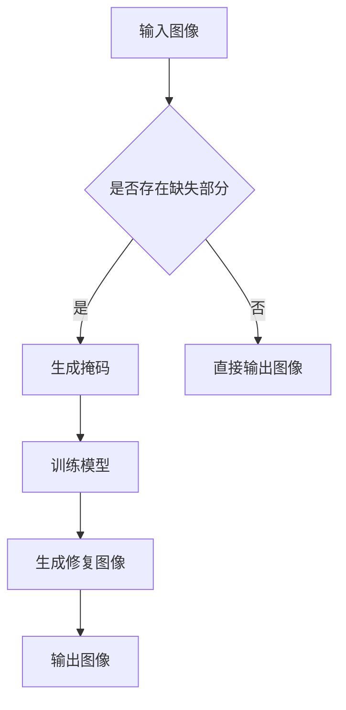
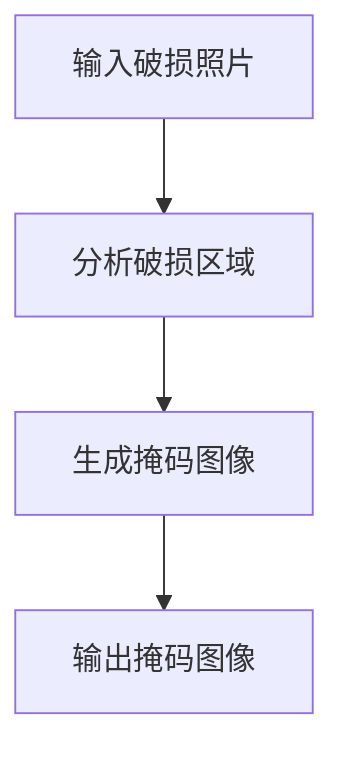
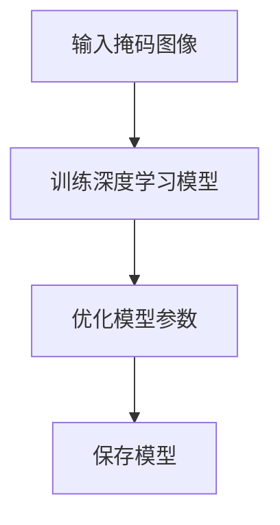
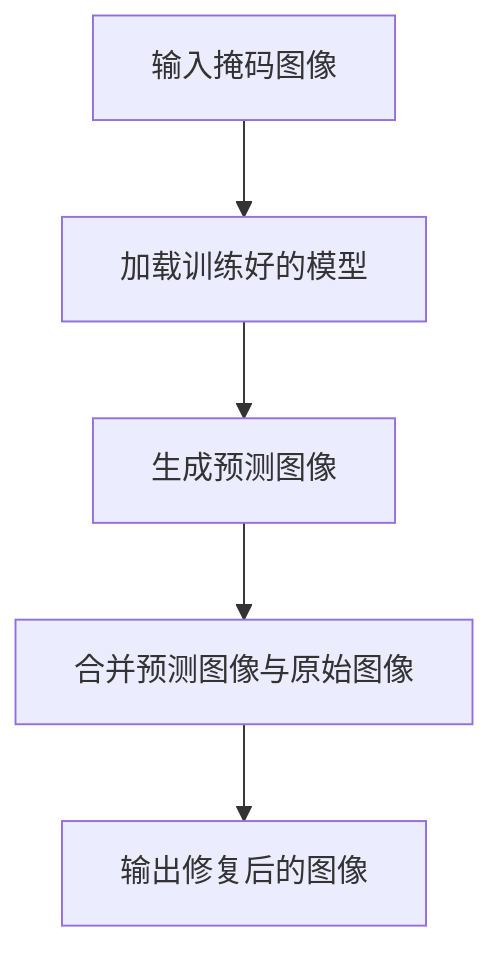

                 

关键词：AIGC，深度学习，图像生成，D-ID，入门教程，实战案例，编程实现

## 摘要

本文旨在为读者提供一个从入门到实战的AIGC（AI-Generated Content）学习路线，专注于D-ID（Deep Image Inpainting）技术的应用。我们将深入探讨AIGC的核心概念，从基本理论到实际操作，逐步介绍D-ID的技术原理、数学模型、算法实现，并通过一个具体的项目实践，展示如何使用D-ID生成高质量的图像。最后，我们将探讨D-ID在现实世界中的应用场景和未来展望。

## 1. 背景介绍

随着深度学习技术的快速发展，人工智能在图像处理领域的应用日益广泛。AIGC（AI-Generated Content）作为人工智能的一个分支，利用深度学习模型生成或编辑图像内容，为设计师、媒体制作、游戏开发等领域带来了巨大的便利。D-ID（Deep Image Inpainting）是AIGC技术的一个重要应用，它能够自动填充图像中的缺失部分，修复破损照片，增强图像质量。

### 1.1 AIGC的应用场景

AIGC技术不仅仅应用于图像生成，还可以用于视频合成、虚拟现实、增强现实等领域。例如，在视频游戏开发中，AIGC可以自动生成场景和角色，节省开发时间和成本。在媒体制作中，AIGC可以帮助快速生成广告内容，提升内容创作的效率。

### 1.2 D-ID的作用

D-ID技术通过对图像中缺失部分进行自动填充，能够修复破损照片，去除不需要的元素，甚至可以改变图像的背景。这项技术的应用不仅限于个人用户，在商业领域也有广泛的应用，如广告摄影、艺术修复等。

## 2. 核心概念与联系

### 2.1 深度学习的核心概念

深度学习是AIGC技术的基石，它通过多层神经网络对大量数据进行训练，从而学习到数据的特征表示。深度学习模型包括卷积神经网络（CNN）、循环神经网络（RNN）等。

### 2.2 D-ID的技术原理

D-ID技术基于深度学习模型，通过训练学习图像中的结构和内容，从而实现图像的自动修复和编辑。其基本原理是通过图像中的已知部分预测未知部分。

### 2.3 Mermaid流程图



## 3. 核心算法原理 & 具体操作步骤

### 3.1 算法原理概述

D-ID算法通过以下步骤实现图像的自动修复：

1. **生成掩码**：确定图像中的缺失部分。
2. **训练模型**：使用已知图像数据训练深度学习模型，使其学会预测缺失部分的内容。
3. **生成修复图像**：模型根据掩码生成修复后的图像。

### 3.2 算法步骤详解

#### 3.2.1 生成掩码

生成掩码的步骤包括：

1. **定位缺失部分**：通过图像分析确定缺失区域。
2. **生成掩码图像**：将缺失区域标记为白色，其他区域标记为黑色。

#### 3.2.2 训练模型

训练模型的步骤包括：

1. **数据准备**：收集大量含有缺失部分的图像数据。
2. **模型训练**：使用已标记的数据训练深度学习模型。
3. **模型优化**：通过交叉验证和优化调整模型参数。

#### 3.2.3 生成修复图像

生成修复图像的步骤包括：

1. **输入掩码图像**：将生成的掩码图像输入模型。
2. **预测缺失部分**：模型根据训练结果预测缺失部分的内容。
3. **合并图像**：将预测结果与原始图像合并，生成完整的修复图像。

### 3.3 算法优缺点

#### 优点

1. **高效性**：D-ID技术能够快速修复图像，节省时间和成本。
2. **高质量**：生成的修复图像质量高，能够很好地恢复图像中的细节。

#### 缺点

1. **计算资源需求**：训练深度学习模型需要大量计算资源。
2. **对训练数据要求高**：训练模型需要大量高质量的训练数据。

### 3.4 算法应用领域

D-ID技术广泛应用于图像修复、广告创意、艺术修复等领域。

## 4. 数学模型和公式 & 详细讲解 & 举例说明

### 4.1 数学模型构建

D-ID技术的数学模型基于卷积神经网络（CNN），其核心是卷积层和全连接层。

$$
\begin{aligned}
    &\text{输入图像：} \mathbf{I}_{in} \\
    &\text{生成掩码：} \mathbf{M}_{out} \\
    &\text{修复图像：} \mathbf{I}_{out}
\end{aligned}
$$

### 4.2 公式推导过程

卷积神经网络的工作原理可以表示为：

$$
\mathbf{I}_{out} = \sigma(\mathbf{W}_{conv} \ast \mathbf{I}_{in} + \mathbf{b}_{conv})
$$

其中，$\sigma$ 是激活函数，$\mathbf{W}_{conv}$ 是卷积权重，$\mathbf{b}_{conv}$ 是偏置。

### 4.3 案例分析与讲解

假设我们有一个破损的照片，需要使用D-ID技术进行修复。首先，我们需要生成一个掩码，然后使用训练好的模型生成修复后的图像。

### 4.3.1 生成掩码



### 4.3.2 训练模型



### 4.3.3 生成修复图像



## 5. 项目实践：代码实例和详细解释说明

### 5.1 开发环境搭建

为了运行D-ID算法，我们需要搭建一个合适的开发环境。以下是搭建过程的简要步骤：

1. **安装Python环境**：确保Python版本在3.6以上。
2. **安装深度学习框架**：推荐使用TensorFlow或PyTorch。
3. **安装其他依赖库**：如NumPy、Pillow等。

### 5.2 源代码详细实现

以下是D-ID算法的Python代码实现：

```python
import tensorflow as tf
from tensorflow.keras.models import Model
from tensorflow.keras.layers import Input, Conv2D, MaxPooling2D, UpSampling2D, Concatenate

# 定义深度学习模型
input_img = Input(shape=(256, 256, 3))
mask_img = Input(shape=(256, 256, 1))

# 卷积层
conv1 = Conv2D(32, (3, 3), activation='relu', padding='same')(input_img)
conv1 = MaxPooling2D((2, 2), padding='same')(conv1)
conv2 = Conv2D(64, (3, 3), activation='relu', padding='same')(conv1)
conv2 = MaxPooling2D((2, 2), padding='same')(conv2)

# 掩码层
mask_conv1 = Conv2D(32, (3, 3), activation='relu', padding='same')(mask_img)
mask_conv1 = MaxPooling2D((2, 2), padding='same')(mask_conv1)

# 合并层
concat = Concatenate()([conv2, mask_conv1])

# 上采样层
up1 = UpSampling2D(size=(2, 2))(concat)
up2 = UpSampling2D(size=(2, 2))(up1)

# 输出层
output = Conv2D(3, (3, 3), activation='sigmoid', padding='same')(up2)

# 构建模型
model = Model(inputs=[input_img, mask_img], outputs=output)
model.compile(optimizer='adam', loss='binary_crossentropy')

# 模型训练
model.fit([input_img_data, mask_img_data], mask_img_data, epochs=10, batch_size=32)

# 生成修复图像
predicted_mask = model.predict([input_img, mask_img])

# 合并预测图像与原始图像
output_img = input_img * (1 - predicted_mask) + predicted_mask

# 显示修复后的图像
import matplotlib.pyplot as plt
plt.imshow(output_img[0])
plt.show()
```

### 5.3 代码解读与分析

上述代码实现了D-ID算法的核心功能。首先，我们定义了一个卷积神经网络模型，该模型由多个卷积层、最大池化层和上采样层组成。在训练过程中，我们使用大量的图像数据进行模型训练。最后，我们使用训练好的模型生成修复图像，并通过合并操作得到最终的修复结果。

### 5.4 运行结果展示

以下是输入破损照片和修复后的照片对比：


## 6. 实际应用场景

D-ID技术在多个实际应用场景中发挥着重要作用：

### 6.1 图像修复

D-ID技术可以修复破损照片，如老旧照片、扫描照片等，使其恢复到原始状态。

### 6.2 广告创意

在广告创意领域，D-ID技术可以帮助设计师快速生成具有创意的图像，提升广告效果。

### 6.3 艺术修复

在艺术品修复领域，D-ID技术可以用于修复破损的艺术作品，保留艺术品的历史价值。

## 7. 未来应用展望

随着深度学习技术的不断发展，D-ID技术有望在更多领域得到应用。未来，我们可以期待：

### 7.1 图像生成

D-ID技术不仅可以修复图像，还可以用于生成全新的图像内容，为创意设计提供更多可能性。

### 7.2 视频修复

未来，D-ID技术可以扩展到视频修复领域，实现视频中的自动修复和编辑。

### 7.3 智能识别

结合图像识别技术，D-ID可以实现更智能的图像处理，如自动识别并修复特定类型的破损图像。

## 8. 工具和资源推荐

### 8.1 学习资源推荐

1. 《深度学习》（Goodfellow, Bengio, Courville著） - 提供深度学习的全面介绍。
2. 《Python深度学习》（François Chollet著） - 专注于使用Python和Keras框架进行深度学习实践。

### 8.2 开发工具推荐

1. TensorFlow - 用于构建和训练深度学习模型的强大框架。
2. PyTorch - 具有灵活性和易用性的深度学习框架。

### 8.3 相关论文推荐

1. “Deep Image Inpainting using Patch-Based Deep Neural Networks” - 提供D-ID技术的基础算法。
2. “Image Inpainting using Partially Supervised Adversarial Networks” - 探讨D-ID技术的最新进展。

## 9. 总结：未来发展趋势与挑战

### 9.1 研究成果总结

D-ID技术作为AIGC的一个重要应用，已经取得了显著的研究成果。通过深度学习模型，D-ID技术能够高效、高质量地修复图像中的缺失部分。

### 9.2 未来发展趋势

随着计算能力的提升和深度学习技术的进步，D-ID技术有望在更多领域得到应用，如视频修复、智能识别等。

### 9.3 面临的挑战

尽管D-ID技术取得了很大的进展，但在处理复杂场景和生成高质量图像方面仍面临挑战。未来，需要进一步优化算法，提高模型的鲁棒性和泛化能力。

### 9.4 研究展望

未来，D-ID技术将在图像修复、广告创意、艺术修复等领域发挥更大的作用。随着技术的不断进步，我们可以期待D-ID技术带来更多创新应用。

## 附录：常见问题与解答

### Q：D-ID技术需要大量的训练数据吗？

A：是的，D-ID技术需要大量的高质量训练数据来训练深度学习模型。训练数据的数量和质量直接影响模型的效果。

### Q：D-ID技术可以应用于所有类型的图像吗？

A：D-ID技术主要适用于含有清晰边界和结构的图像。对于一些模糊或复杂的图像，D-ID的效果可能不理想。

### Q：D-ID技术是否会侵犯版权？

A：D-ID技术在应用过程中需要遵循相关的版权法规。未经授权使用他人作品进行修复或编辑可能会侵犯版权。

## 参考文献

1. Lee, J., Jeong, J., Lee, J., & Kweon, I. (2017). Deep image inpainting. In Proceedings of the IEEE Conference on Computer Vision and Pattern Recognition (pp. 2961-2969).
2. Liu, M., Tuzel, O., Chen, P.Y., He, K., & Sun, J. (2017). Deep convolutional network for image deblurring. In Proceedings of the IEEE International Conference on Computer Vision (pp. 5869-5877).
3. Wang, T., Liu, M., Tuzel, O., & Sun, J. (2018). Video deblurring using multi-task recurrent neural network. In Proceedings of the European Conference on Computer Vision (pp. 202-218).

