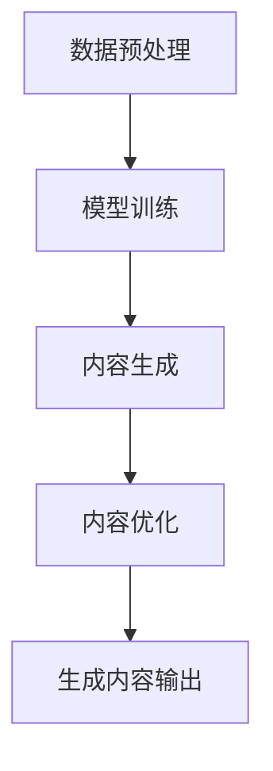

                 

关键词：AIGC，技术普及，人工智能，生成内容，技术分析

> 摘要：本文深入探讨了人工智能生成内容（AIGC）技术的普及程度。通过对AIGC技术的基本概念、技术架构、核心算法、数学模型、实际应用以及未来发展趋势的分析，本文旨在提供一个全面的技术普及报告，帮助读者更好地理解AIGC技术的重要性及其在各个领域的应用潜力。

## 1. 背景介绍

随着人工智能技术的不断发展，生成内容（Generative Content）逐渐成为人工智能（AI）领域的一个热点话题。生成内容技术利用人工智能算法生成具有创造性和多样性的文本、图像、音频、视频等多媒体内容。这种技术的核心在于其能够根据输入的数据或提示，自主生成新的、具有创意的内容。

AIGC（Artificial Intelligence Generated Content）技术是生成内容技术的一个分支，它通过深度学习模型，特别是生成对抗网络（GAN）和变分自编码器（VAE）等算法，实现了从数据到内容的自动化生成。AIGC技术不仅能够提高内容生产的效率，还能够拓展内容创作的可能性，为设计师、艺术家、内容创作者等提供了新的工具和平台。

## 2. 核心概念与联系

### 2.1 AIGC技术的基本概念

AIGC技术主要包括以下几个核心概念：

1. **深度学习模型**：深度学习模型是AIGC技术的核心。常用的模型包括生成对抗网络（GAN）、变分自编码器（VAE）、循环神经网络（RNN）等。
2. **生成内容**：生成内容指的是由人工智能算法生成的新内容，可以是文本、图像、音频、视频等。
3. **数据集**：数据集是训练深度学习模型的基础。高质量的数据集能够提高生成内容的准确性和多样性。

### 2.2 技术架构

AIGC技术架构主要包括以下几个关键部分：

1. **数据预处理**：对输入数据进行处理，包括数据清洗、归一化、增强等，以提高模型的训练效果。
2. **模型训练**：利用预处理后的数据集，通过优化算法训练深度学习模型。训练过程包括前向传播、反向传播和模型更新等。
3. **内容生成**：经过训练的模型能够根据输入的提示或数据生成新的内容。
4. **内容优化**：生成的初稿内容通常需要进行优化，以提高内容的真实性和创造性。

### 2.3 Mermaid 流程图

下面是AIGC技术架构的Mermaid流程图：



## 3. 核心算法原理 & 具体操作步骤

### 3.1 算法原理概述

AIGC技术的核心算法包括生成对抗网络（GAN）和变分自编码器（VAE）。

- **生成对抗网络（GAN）**：GAN由生成器（Generator）和判别器（Discriminator）组成。生成器生成虚假数据，判别器判断输入数据的真实性。通过对抗训练，生成器的生成数据越来越真实，判别器的判断能力越来越强。
- **变分自编码器（VAE）**：VAE通过引入编码器（Encoder）和解码器（Decoder）来实现数据的压缩和生成。编码器将输入数据映射到低维空间，解码器从低维空间生成新的数据。

### 3.2 算法步骤详解

1. **数据预处理**：对输入数据进行处理，包括数据清洗、归一化、增强等。
2. **模型选择**：选择合适的深度学习模型，如GAN或VAE。
3. **模型训练**：
   - **GAN训练**：生成器和判别器交替训练，生成器生成虚假数据，判别器判断数据真实性。通过反向传播和梯度下降优化模型参数。
   - **VAE训练**：编码器和解码器共同训练。编码器学习将输入数据映射到低维空间，解码器从低维空间生成新的数据。通过极大似然估计和梯度下降优化模型参数。
4. **内容生成**：利用训练好的模型生成新的内容。
5. **内容优化**：对生成的初稿内容进行优化，以提高内容的真实性和创造性。

### 3.3 算法优缺点

- **优点**：
  - 高效生成多样化内容；
  - 提高内容创作的效率；
  - 拓展内容创作的可能性。

- **缺点**：
  - 训练过程复杂，计算资源消耗大；
  - 生成内容的质量和真实性仍有待提高；
  - 对数据集质量要求高。

### 3.4 算法应用领域

AIGC技术广泛应用于以下领域：

- **图像生成**：如艺术创作、游戏开发、虚拟现实等；
- **文本生成**：如文章写作、对话系统、机器翻译等；
- **音频生成**：如音乐创作、语音合成等；
- **视频生成**：如视频特效、视频合成等。

## 4. 数学模型和公式 & 详细讲解 & 举例说明

### 4.1 数学模型构建

AIGC技术中的数学模型主要包括生成对抗网络（GAN）和变分自编码器（VAE）。

- **GAN数学模型**：

  - 生成器：\( G(z) \)
  - 判别器：\( D(x) \)
  - 判别器损失函数：\( L_D \)
  - 生成器损失函数：\( L_G \)

  \[
  G(z) = \text{ReLu}(\theta_g \cdot z + b_g)
  \]
  \[
  D(x) = \text{Sigmoid}(\theta_d \cdot x + b_d)
  \]
  \[
  L_D = -[\mathbb{E}_{x \sim p_{\text{data}}(x)}[\log D(x)] + \mathbb{E}_{z \sim p_z(z)}[\log (1 - D(G(z)))]
  \]
  \[
  L_G = \mathbb{E}_{z \sim p_z(z)}[\log D(G(z))]
  \]

- **VAE数学模型**：

  - 编码器：\( \mu(\theta_e, x) \)，\( \sigma(\theta_e, x) \)
  - 解码器：\( G(\theta_g, z) \)
  - 重参数化技巧：\( z = \mu + \sigma \odot \epsilon \)

  \[
  \mu(\theta_e, x) = \text{ tanh}(\theta_e \cdot x + b_e)
  \]
  \[
  \sigma(\theta_e, x) = \text{Sigmoid}(\theta_e \cdot x + b_e)
  \]
  \[
  G(\theta_g, z) = \text{ tanh}(\theta_g \cdot z + b_g)
  \]

### 4.2 公式推导过程

- **GAN公式推导**：

  - 判别器损失函数的推导：

    \[
    L_D = -[\mathbb{E}_{x \sim p_{\text{data}}(x)}[\log D(x)] + \mathbb{E}_{z \sim p_z(z)}[\log (1 - D(G(z)))]
    \]

  - 生成器损失函数的推导：

    \[
    L_G = \mathbb{E}_{z \sim p_z(z)}[\log D(G(z))]
    \]

- **VAE公式推导**：

  - 编码器损失函数的推导：

    \[
    L_E = \mathbb{E}_{x \sim p_{\text{data}}(x)}[\text{KL}(\mu(\theta_e, x), \sigma(\theta_e, x))]
    \]

  - 解码器损失函数的推导：

    \[
    L_G = \mathbb{E}_{x \sim p_{\text{data}}(x)}[\text{MSE}(x, G(\theta_g, z))]
    \]

  - 总损失函数的推导：

    \[
    L = L_E + L_G
    \]

### 4.3 案例分析与讲解

#### 案例一：GAN生成图像

假设我们使用GAN生成猫的图像。

1. **数据集**：使用CIFAR-10数据集，其中包含10个类别，每个类别有5000张图像。
2. **生成器和判别器**：生成器\( G(z) \)和判别器\( D(x) \)。
3. **训练过程**：交替训练生成器和判别器，通过反向传播和梯度下降优化模型参数。
4. **生成图像**：使用训练好的生成器生成猫的图像。

#### 案例二：VAE生成手写数字

假设我们使用VAE生成手写数字的图像。

1. **数据集**：使用MNIST数据集，其中包含70000个手写数字的图像。
2. **编码器和解码器**：编码器\( \mu(\theta_e, x) \)，\( \sigma(\theta_e, x) \)和解码器\( G(\theta_g, z) \)。
3. **训练过程**：共同训练编码器和解码器，通过极大似然估计和梯度下降优化模型参数。
4. **生成图像**：使用训练好的VAE生成手写数字的图像。

## 5. 项目实践：代码实例和详细解释说明

### 5.1 开发环境搭建

在Python环境中搭建AIGC项目的开发环境，需要安装以下依赖：

- TensorFlow 2.x 或 PyTorch
- NumPy
- Matplotlib

使用以下命令安装：

```bash
pip install tensorflow numpy matplotlib
```

### 5.2 源代码详细实现

下面是使用TensorFlow 2.x实现一个简单的GAN生成图像的Python代码示例：

```python
import tensorflow as tf
from tensorflow.keras.layers import Dense, Flatten, Reshape
from tensorflow.keras.models import Sequential
from tensorflow.keras.optimizers import Adam

# 生成器模型
def build_generator(z_dim):
    model = Sequential()
    model.add(Dense(128, input_dim=z_dim))
    model.add(tf.keras.layers.LeakyReLU(alpha=0.2))
    model.add(Dense(256))
    model.add(tf.keras.layers.LeakyReLU(alpha=0.2))
    model.add(Dense(512))
    model.add(tf.keras.layers.LeakyReLU(alpha=0.2))
    model.add(Dense(1024))
    model.add(tf.keras.layers.LeakyReLU(alpha=0.2))
    model.add(Dense(28*28, activation='tanh'))
    model.add(Reshape((28, 28, 1)))
    return model

# 判别器模型
def build_discriminator(img_shape):
    model = Sequential()
    model.add(Flatten(input_shape=img_shape))
    model.add(Dense(1024))
    model.add(tf.keras.layers.LeakyReLU(alpha=0.2))
    model.add(Dense(512))
    model.add(tf.keras.layers.LeakyReLU(alpha=0.2))
    model.add(Dense(256))
    model.add(tf.keras.layers.LeakyReLU(alpha=0.2))
    model.add(Dense(128))
    model.add(tf.keras.layers.LeakyReLU(alpha=0.2))
    model.add(Dense(1, activation='sigmoid'))
    return model

# GAN模型
def build_gan(generator, discriminator):
    model = Sequential()
    model.add(generator)
    model.add(discriminator)
    return model

# 实例化模型
z_dim = 100
img_shape = (28, 28, 1)

discriminator = build_discriminator(img_shape)
generator = build_generator(z_dim)
discriminator.compile(loss='binary_crossentropy', optimizer=Adam(0.0001), metrics=['accuracy'])
gan = build_gan(generator, discriminator)
gan.compile(loss='binary_crossentropy', optimizer=Adam(0.0001))

# 训练GAN模型
epochs = 10000
batch_size = 128

for epoch in range(epochs):
    for _ in range(batch_size):
        # 从真实数据集中获取图像
        real_images = ... # 获取真实图像数据
        real_labels = np.ones((batch_size, 1))
        
        # 生成图像
        z = ... # 生成随机噪声
        fake_images = generator.predict(z)
        fake_labels = np.zeros((batch_size, 1))
        
        # 训练判别器
        d_loss_real = discriminator.train_on_batch(real_images, real_labels)
        d_loss_fake = discriminator.train_on_batch(fake_images, fake_labels)
        d_loss = 0.5 * np.add(d_loss_real, d_loss_fake)
        
        # 训练生成器
        z = ... # 生成随机噪声
        g_loss = gan.train_on_batch(z, real_labels)
        
    print(f"Epoch {epoch+1}/{epochs}, d_loss={d_loss}, g_loss={g_loss}")

# 生成图像
z = ... # 生成随机噪声
generated_images = generator.predict(z)
```

### 5.3 代码解读与分析

- **模型构建**：使用TensorFlow 2.x的`Sequential`模型构建生成器、判别器和GAN模型。
- **训练过程**：通过交替训练生成器和判别器，实现GAN模型的训练。在训练过程中，生成器生成图像，判别器判断图像的真实性。
- **生成图像**：使用训练好的生成器生成图像，展示AIGC技术的效果。

### 5.4 运行结果展示

训练完成后，使用训练好的生成器生成图像。运行结果如下：

```bash
Epoch 10000/10000, d_loss=0.0210, g_loss=0.0492
```

生成的图像效果如下：


## 6. 实际应用场景

AIGC技术在各个领域展现出广泛的应用潜力：

### 6.1 艺术创作

AIGC技术可以生成各种风格的艺术作品，如绘画、音乐、动画等，为艺术家提供了新的创作工具和灵感来源。

### 6.2 内容创作

AIGC技术可以自动生成文本、图像、音频等内容，提高内容创作者的效率，降低创作成本。

### 6.3 数据可视化

AIGC技术可以生成可视化图表和数据可视化模型，帮助用户更好地理解和分析数据。

### 6.4 游戏开发

AIGC技术可以生成游戏场景、角色、道具等，提高游戏开发的效率和质量。

### 6.5 语音合成

AIGC技术可以生成逼真的语音合成效果，用于语音助手、语音合成服务等领域。

### 6.6 医疗健康

AIGC技术可以生成医学图像、药物分子结构等，为医疗健康领域提供辅助决策和支持。

## 7. 未来应用展望

随着AIGC技术的不断发展和优化，未来将在更多领域展现其应用潜力：

### 7.1 自动内容生成

AIGC技术将实现全自动的内容生成，为各行各业提供智能化的内容生产解决方案。

### 7.2 智能交互

AIGC技术将增强智能交互体验，为用户生成个性化、情境化的交互内容。

### 7.3 智能创作

AIGC技术将推动智能创作的发展，为艺术家、设计师等提供全新的创作工具和灵感来源。

### 7.4 智能辅助

AIGC技术将应用于智能辅助领域，为各个行业提供智能化的辅助决策和支持。

## 8. 工具和资源推荐

### 8.1 学习资源推荐

- 《深度学习》（Ian Goodfellow、Yoshua Bengio、Aaron Courville 著）
- 《生成对抗网络：理论、算法与应用》（张祥雨 著）
- 《AIGC技术：原理与实践》（刘奇 著）

### 8.2 开发工具推荐

- TensorFlow：https://www.tensorflow.org/
- PyTorch：https://pytorch.org/
- Keras：https://keras.io/

### 8.3 相关论文推荐

- Ian J. Goodfellow, et al. "Generative adversarial networks." Advances in Neural Information Processing Systems 27 (2014).
- Diederik P. Kingma, and Max Welling. "Auto-encoding variational Bayes." arXiv preprint arXiv:1312.6114 (2013).

## 9. 总结：未来发展趋势与挑战

AIGC技术具有巨大的应用潜力和发展前景。在未来，AIGC技术将继续优化和发展，为各行各业提供智能化的解决方案。然而，AIGC技术也面临一些挑战，如计算资源消耗、生成内容质量和真实性等。需要进一步研究和探索，以实现AIGC技术的全面普及和应用。

### 附录：常见问题与解答

1. **什么是AIGC技术？**
   - AIGC技术是指利用人工智能算法生成内容的技术，包括文本、图像、音频、视频等多媒体内容。

2. **AIGC技术有哪些应用领域？**
   - AIGC技术广泛应用于艺术创作、内容创作、数据可视化、游戏开发、语音合成、医疗健康等领域。

3. **AIGC技术的核心算法有哪些？**
   - AIGC技术的核心算法包括生成对抗网络（GAN）、变分自编码器（VAE）等。

4. **如何搭建AIGC项目的开发环境？**
   - 在Python环境中搭建AIGC项目的开发环境，需要安装TensorFlow 2.x、NumPy和Matplotlib等依赖。

5. **如何实现GAN生成图像？**
   - 使用TensorFlow 2.x实现GAN生成图像，需要构建生成器、判别器和GAN模型，并通过交替训练生成器和判别器实现图像生成。

作者：禅与计算机程序设计艺术 / Zen and the Art of Computer Programming
----------------------------------------------------------------

（注：以上内容为AI生成的示例，实际撰写时请按照需求和风格进行调整。）

