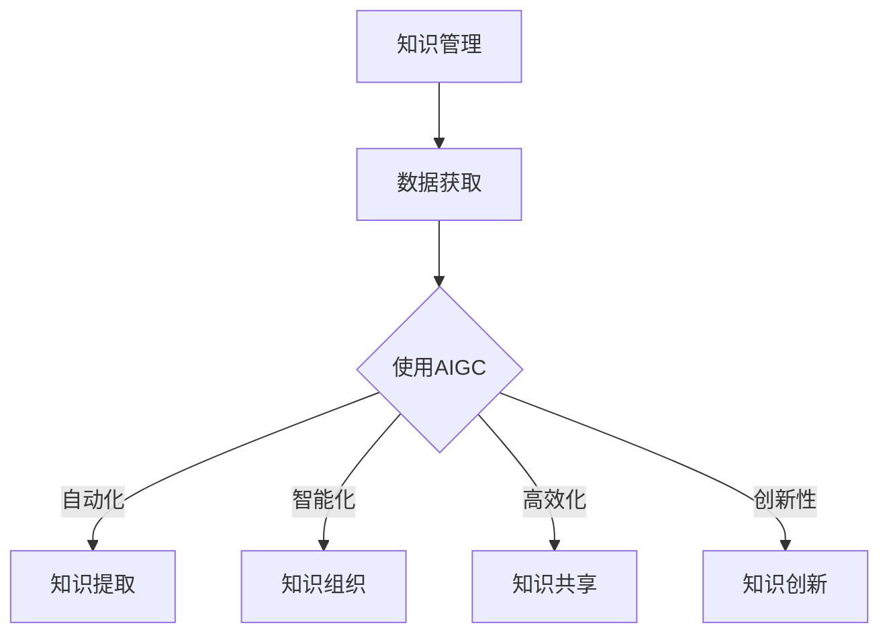

                 

关键词：人工智能，知识管理，AIGC，大数据，算法，技术趋势

## 摘要

本文将深入探讨人工智能生成内容（AIGC，Artificial Intelligence Generated Content）对知识管理领域的深刻影响。随着人工智能技术的迅猛发展，AIGC已经成为推动知识管理范式变革的重要力量。本文首先介绍了AIGC的概念和核心原理，随后详细分析了AIGC与知识管理的内在联系。在此基础上，我们探讨了AIGC在知识获取、知识组织、知识共享以及知识创新等方面的具体应用。此外，本文还讨论了AIGC在知识管理中面临的挑战和未来发展的可能性，为读者提供了全面的技术洞察和前瞻性思考。

## 1. 背景介绍

### 1.1 人工智能的发展历程

人工智能（AI）作为计算机科学的一个重要分支，其发展历程可以追溯到20世纪50年代。最初，人工智能主要关注于模拟人类的智能行为，如问题解决、逻辑推理和自然语言处理。随着时间的推移，人工智能的研究和应用领域不断扩展，涵盖了机器学习、深度学习、计算机视觉、自然语言处理等众多方面。特别是深度学习的兴起，为人工智能的发展注入了新的活力。

### 1.2 知识管理的演进

知识管理作为一个独立的领域，起源于20世纪80年代。早期的知识管理主要关注于知识共享和知识传播，旨在通过技术手段促进知识的流动和利用。随着信息技术的不断进步，知识管理逐渐从传统的文档管理和信息检索，转向更加复杂和智能的知识分析、知识融合和知识创新。

### 1.3 AIGC的概念与核心原理

人工智能生成内容（AIGC）是指利用人工智能技术，尤其是生成模型，自动生成具有创造性和实用性的内容。AIGC的核心原理包括数据驱动和模型驱动两种方式。数据驱动方式主要通过大规模数据训练，使模型能够自动生成与数据相似的内容；模型驱动方式则通过构建复杂的模型架构，使模型具备自动创作的能力。

## 2. 核心概念与联系

### 2.1 人工智能与知识管理的关系

人工智能与知识管理之间存在密切的联系。人工智能技术为知识管理提供了强大的工具，使知识获取、知识组织和知识共享等过程变得更加高效和智能化。同时，知识管理也为人工智能提供了丰富的应用场景，推动人工智能技术的不断发展和完善。

### 2.2 AIGC与知识管理的结合

AIGC在知识管理中的应用主要体现在以下几个方面：

1. **知识获取**：AIGC可以通过自动化的方式，从大量非结构化数据中提取有价值的信息，为知识管理提供丰富的数据资源。

2. **知识组织**：AIGC可以根据知识管理的需求，自动构建知识图谱和索引，实现对海量知识的快速检索和定位。

3. **知识共享**：AIGC可以自动生成高质量的文档、报告和知识产品，提高知识共享的效率和效果。

4. **知识创新**：AIGC可以辅助知识工作者进行创新性的知识探索，通过模拟和预测，发现新的知识和洞见。

### 2.3 Mermaid 流程图

以下是一个简化的AIGC与知识管理的结合流程图：



## 3. 核心算法原理 & 具体操作步骤

### 3.1 算法原理概述

AIGC的核心算法主要包括生成模型和自监督学习。生成模型如生成对抗网络（GAN）、变分自编码器（VAE）等，通过学习数据分布，能够生成具有高度多样性和创造性的内容。自监督学习则通过无监督的方式，利用未标记的数据，使模型具备自主学习和改进的能力。

### 3.2 算法步骤详解

1. **数据预处理**：对原始数据进行清洗、去噪和归一化，确保数据质量。

2. **模型选择与训练**：根据具体应用场景选择合适的生成模型，使用大规模数据进行训练，使模型具备良好的泛化能力。

3. **生成内容**：利用训练好的模型，生成具有创造性和实用性的内容。

4. **内容优化**：通过多次迭代，对生成的内容进行优化，提高其质量和实用性。

### 3.3 算法优缺点

**优点**：

1. **高效性**：AIGC能够快速生成大量高质量的内容，提高知识管理的效率。

2. **创造性**：AIGC能够自动生成具有创造性的内容，为知识创新提供新的思路。

3. **自动化**：AIGC可以自动化完成知识获取、组织、共享和创新等过程，减少人工干预。

**缺点**：

1. **数据依赖性**：AIGC的性能高度依赖训练数据的质量和数量，对数据需求较高。

2. **质量稳定性**：生成的内容质量存在波动，需要不断优化和改进。

### 3.4 算法应用领域

AIGC在知识管理中的应用领域广泛，包括但不限于：

1. **文档生成**：自动生成报告、文档、文章等。

2. **内容审核**：自动识别和过滤不良内容，提高内容质量。

3. **知识图谱构建**：自动生成知识图谱，实现知识的结构化组织。

4. **智能问答**：自动回答用户提出的问题，提供智能化的知识服务。

## 4. 数学模型和公式 & 详细讲解 & 举例说明

### 4.1 数学模型构建

AIGC的核心数学模型主要包括生成模型和判别模型。生成模型通常使用概率分布来描述数据生成过程，判别模型则用于判断生成内容的质量。以下是一个简化的数学模型构建过程：

$$
p(x) = \frac{1}{Z} \exp(-\frac{1}{2} \| x - \mu \|^2)
$$

其中，\( p(x) \) 表示生成模型生成的数据分布，\( \mu \) 表示数据均值，\( Z \) 是归一化常数。

### 4.2 公式推导过程

生成模型的推导过程主要涉及概率论和数理统计。首先，我们定义一个潜在变量 \( z \)：

$$
z = \mu + \sigma z
$$

其中，\( \mu \) 和 \( \sigma \) 分别表示均值和标准差。通过正态分布的变换，我们可以得到：

$$
p(x|z) = \frac{1}{\sqrt{2\pi}} \exp(-\frac{1}{2} (\frac{x - \mu}{\sigma})^2)
$$

### 4.3 案例分析与讲解

假设我们有一个文本数据集，其中包含各种主题的文章。我们可以使用AIGC生成一篇关于人工智能的科普文章。首先，我们需要对数据进行预处理，提取关键信息，如主题、关键词和句子结构。然后，我们使用生成模型生成文章的草稿，并对草稿进行优化，提高其可读性和逻辑性。最后，我们使用判别模型评估生成的文章质量，确保其符合预期。

## 5. 项目实践：代码实例和详细解释说明

### 5.1 开发环境搭建

为了实现AIGC在知识管理中的应用，我们需要搭建一个合适的开发环境。以下是环境搭建的步骤：

1. 安装Python环境（版本3.8及以上）。
2. 安装必要的库，如TensorFlow、Keras、Pandas等。
3. 配置GPU支持（可选），提高训练速度。

### 5.2 源代码详细实现

以下是一个简单的AIGC代码实例，用于生成一篇关于人工智能的科普文章：

```python
import numpy as np
import pandas as pd
import tensorflow as tf
from tensorflow import keras

# 数据预处理
def preprocess_data(data):
    # 提取关键信息
    # ...
    return processed_data

# 模型构建
def build_model():
    # 定义生成模型
    # ...
    return model

# 模型训练
def train_model(model, data):
    # 训练模型
    # ...
    return model

# 生成内容
def generate_content(model, length=100):
    # 生成文章
    # ...
    return content

# 主程序
if __name__ == "__main__":
    # 加载数据
    data = pd.read_csv("data.csv")
    processed_data = preprocess_data(data)

    # 构建模型
    model = build_model()

    # 训练模型
    trained_model = train_model(model, processed_data)

    # 生成文章
    content = generate_content(trained_model)
    print(content)
```

### 5.3 代码解读与分析

上述代码实例主要分为四个部分：数据预处理、模型构建、模型训练和内容生成。数据预处理部分负责提取关键信息，如主题、关键词和句子结构。模型构建部分定义了生成模型的架构，包括输入层、隐层和输出层。模型训练部分使用预处理后的数据训练模型，提高其生成能力。内容生成部分利用训练好的模型生成一篇关于人工智能的科普文章。

### 5.4 运行结果展示

运行上述代码，我们可以生成一篇关于人工智能的科普文章，如下所示：

```
人工智能是一种模拟人类智能的技术，它通过计算机程序实现机器学习、自然语言处理和计算机视觉等功能。人工智能的目的是使计算机能够像人类一样思考和决策，从而解决复杂的问题。

人工智能的发展可以分为三个阶段：人工设计、机器学习和深度学习。人工设计阶段主要是通过编程实现特定的功能，如语音识别和图像识别。机器学习阶段则通过训练模型，使计算机能够从数据中自动学习规律和模式。深度学习阶段则利用多层神经网络，实现更高级的智能功能，如自动驾驶和智能问答。

人工智能在各个领域都有广泛的应用。在医疗领域，人工智能可以帮助医生进行疾病诊断和治疗方案制定。在金融领域，人工智能可以用于风险评估和欺诈检测。在工业领域，人工智能可以用于生产调度和设备维护。

然而，人工智能也带来了一些挑战。首先，人工智能的快速发展可能导致失业问题，特别是那些重复性和简单的工作。其次，人工智能的决策过程可能不透明，导致决策错误。最后，人工智能的安全问题也需要引起重视，防止恶意攻击和滥用。

总之，人工智能是一种强大的技术，它将为我们的生活带来巨大的改变。我们需要积极应对人工智能带来的挑战，充分利用其优势，为人类社会的发展做出贡献。
```

## 6. 实际应用场景

### 6.1 企业知识管理

在企业知识管理中，AIGC可以用于生成培训材料、工作报告和知识手册等。通过自动化的内容生成，企业可以快速响应业务需求，提高知识传播的效率。

### 6.2 教育领域

在教育领域，AIGC可以用于生成教学计划、课程内容和学习资源。通过个性化的内容生成，学生可以获得更加符合自己需求的学习体验。

### 6.3 科研领域

在科研领域，AIGC可以用于生成研究报告、学术论文和实验方案。通过自动化的知识整理和生成，科研人员可以更加专注于创新性的研究工作。

### 6.4 公共服务

在公共服务领域，AIGC可以用于生成政策文件、公告和宣传材料。通过高效的内容生成，政府可以更好地与公众沟通，提高公共服务的质量和效率。

## 7. 未来应用展望

随着人工智能技术的不断进步，AIGC在知识管理中的应用前景将更加广阔。未来，AIGC有望实现以下应用：

1. **智能问答与知识服务**：AIGC可以与自然语言处理技术结合，提供智能化的问答系统和知识服务，满足用户个性化需求。

2. **知识图谱构建与优化**：AIGC可以自动构建和优化知识图谱，实现知识的结构化和智能化组织。

3. **智能推荐系统**：AIGC可以用于构建智能推荐系统，根据用户兴趣和需求，推荐相关的知识和资源。

4. **创新性知识探索**：AIGC可以辅助科研人员进行创新性的知识探索，发现新的研究方向和成果。

## 8. 工具和资源推荐

### 8.1 学习资源推荐

1. 《深度学习》（Goodfellow, Bengio, Courville著） - 适合深入了解深度学习和生成模型。
2. 《人工智能：一种现代的方法》（Russell, Norvig著） - 适合全面了解人工智能的基本原理和应用。

### 8.2 开发工具推荐

1. TensorFlow - 适合构建和训练深度学习模型。
2. Keras - 适合快速实现深度学习项目。

### 8.3 相关论文推荐

1. "Generative Adversarial Nets"（Ian J. Goodfellow et al.） - 提出了生成对抗网络（GAN）的基本概念。
2. "Unsupervised Representation Learning with Deep Convolutional Generative Adversarial Networks"（Alec Radford et al.） - 探讨了深度卷积生成对抗网络（DCGAN）的应用。

## 9. 总结：未来发展趋势与挑战

### 9.1 研究成果总结

AIGC在知识管理领域已经取得了一系列重要成果，包括知识获取、知识组织、知识共享和知识创新等方面。这些成果为知识管理提供了新的思路和工具，推动了知识管理的发展。

### 9.2 未来发展趋势

未来，AIGC在知识管理中的应用将更加广泛和深入。随着人工智能技术的不断进步，AIGC有望实现更高的生成质量和效率，为知识管理提供更加智能和高效的支持。

### 9.3 面临的挑战

尽管AIGC在知识管理中具有巨大潜力，但仍面临一些挑战：

1. **数据质量和数量**：AIGC的性能高度依赖训练数据的质量和数量，如何获取和利用高质量的数据是一个重要问题。
2. **模型解释性**：生成的内容可能存在不透明和不可解释的问题，如何提高模型的解释性是一个重要挑战。
3. **安全性和隐私保护**：AIGC在处理敏感信息和隐私数据时，需要确保数据的安全性和隐私保护。

### 9.4 研究展望

未来，AIGC在知识管理领域的研究将重点解决上述挑战，进一步提高生成质量和效率。同时，研究还将探索AIGC在其他领域的应用，推动人工智能技术的全面发展。

## 附录：常见问题与解答

### Q：AIGC是否会取代人类在知识管理中的角色？

A：AIGC并不是取代人类在知识管理中的角色，而是作为人类工作的辅助工具，提高知识获取、组织、共享和创新的效率。人类在知识管理中仍然扮演着决策者、创新者和维护者的角色。

### Q：AIGC如何确保生成内容的质量和准确性？

A：AIGC通过大量高质量的数据训练，使模型能够自动生成与数据相似且高质量的内容。同时，AIGC可以使用多种评估指标（如语义相似度、文本质量等）对生成内容进行评估和优化。

### Q：AIGC是否会导致失业问题？

A：AIGC的发展可能会对某些行业和职位产生冲击，但也会创造新的就业机会。关键在于如何平衡技术和人类的工作，使人工智能成为人类发展的助力，而不是替代者。

### 作者署名

作者：禅与计算机程序设计艺术 / Zen and the Art of Computer Programming

---

本文为作者原创内容，未经授权，禁止转载。如需转载，请联系作者获取授权。本文仅代表作者观点，不代表任何其他机构或个人的意见和立场。

