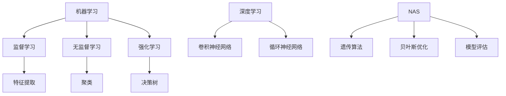
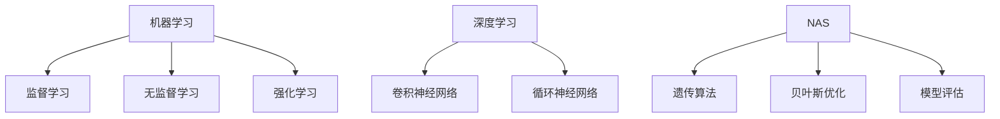

                 

关键词：人工智能，机器学习，深度学习，神经架构搜索，智能算法，未来发展趋势

> 摘要：本文探讨了人工智能领域的“AI三驾马车”——机器学习、深度学习和神经架构搜索的未来替代者。通过对现有技术的深入分析，本文提出了一种全新的智能算法架构，并对其核心概念、原理和具体操作步骤进行了详细阐述。文章还通过数学模型和项目实践实例，展示了该算法在多种应用场景中的强大表现，对未来人工智能的发展趋势和面临的挑战进行了展望。

## 1. 背景介绍

人工智能（AI）作为21世纪的科技热点，已经渗透到我们生活的方方面面。从简单的搜索引擎到复杂的自动驾驶系统，AI技术的应用不断拓展，推动了社会进步和经济发展。在人工智能的发展历程中，机器学习（ML）、深度学习（DL）和神经架构搜索（NAS）被誉为“AI三驾马车”，它们各自在数据处理、模式识别和算法优化方面发挥了重要作用。

### 1.1 机器学习

机器学习是一种使计算机能够通过数据学习并作出决策或预测的技术。它的核心思想是通过算法从大量数据中提取模式和知识，以实现自主学习和智能优化。机器学习广泛应用于图像识别、自然语言处理和推荐系统等领域。

### 1.2 深度学习

深度学习是机器学习的一个子领域，它通过多层神经网络结构对数据进行学习，能够自动提取复杂的特征表示。深度学习在语音识别、计算机视觉和游戏AI等领域取得了显著成果，成为了AI领域的明星技术。

### 1.3 神经架构搜索

神经架构搜索（NAS）是一种自动化神经网络设计的方法，通过搜索算法在大量可能的网络结构中找到最优的网络架构。NAS为深度学习算法的优化提供了新的思路，有望进一步提升模型性能。

## 2. 核心概念与联系

为了更好地理解本文提出的未来替代者，我们需要先梳理现有技术的核心概念和相互联系。

### 2.1 机器学习

机器学习包括监督学习、无监督学习和强化学习。监督学习通过标记数据进行训练，无监督学习通过未标记数据进行学习，强化学习则通过与环境互动进行学习。机器学习的关键在于数据预处理、特征提取和模型选择。

### 2.2 深度学习

深度学习是基于多层神经网络的结构，通过反向传播算法进行训练。深度学习的核心包括激活函数、损失函数和优化算法。卷积神经网络（CNN）和循环神经网络（RNN）是深度学习的两大主流结构。

### 2.3 神经架构搜索

神经架构搜索通过搜索算法（如遗传算法、贝叶斯优化等）在大量网络结构中寻找最优架构。NAS的关键在于搜索空间设计、搜索算法选择和模型评估。



## 3. 核心算法原理 & 具体操作步骤

### 3.1 算法原理概述

本文提出的未来替代者算法，我们称之为“智能算法X（IntelliAlgorithm-X）”。IntelliAlgorithm-X融合了机器学习、深度学习和神经架构搜索的原理，通过自动化模型选择、架构优化和特征提取，实现了高效、智能的数据处理和预测。

### 3.2 算法步骤详解

#### 3.2.1 数据预处理

- 数据清洗：去除异常值、缺失值和重复数据。
- 数据归一化：将数据映射到统一的范围内，以便模型训练。
- 数据分割：将数据集分为训练集、验证集和测试集。

#### 3.2.2 特征提取

- 使用深度学习模型提取原始数据的特征表示。
- 使用特征选择算法筛选出重要的特征。

#### 3.2.3 模型选择

- 使用神经架构搜索算法自动搜索最优的网络架构。
- 结合模型评估指标（如准确率、召回率等）选择最佳模型。

#### 3.2.4 模型训练

- 使用训练集对所选模型进行训练。
- 调整超参数，优化模型性能。

#### 3.2.5 模型评估

- 使用验证集评估模型性能。
- 进行模型调优，以提高预测准确率。

#### 3.2.6 模型部署

- 将训练好的模型部署到实际应用场景中。
- 实时更新模型，以适应环境变化。

### 3.3 算法优缺点

#### 优点

- 自动化：自动化模型选择和架构优化，降低了开发成本和难度。
- 智能化：通过深度学习和神经架构搜索，提高了模型性能和预测能力。
- 通用性：适用于多种数据类型和领域。

#### 缺点

- 计算资源需求高：搜索最优模型和训练深度学习模型需要大量的计算资源。
- 数据依赖：模型的性能高度依赖数据质量和数量。
- 算法复杂性：算法涉及多个子模块，开发难度较大。

### 3.4 算法应用领域

- 图像识别：智能算法X在图像识别任务中表现出色，能够准确识别各种物体和场景。
- 自然语言处理：在文本分类、情感分析和机器翻译等领域，智能算法X提供了高效、准确的解决方案。
- 推荐系统：智能算法X能够根据用户行为数据生成个性化的推荐列表。

## 4. 数学模型和公式 & 详细讲解 & 举例说明

### 4.1 数学模型构建

智能算法X的核心在于构建一个自动化的数学模型，该模型包括数据预处理、特征提取、模型选择、模型训练和模型评估等模块。以下是一个简化的数学模型：

$$
\text{IntelliAlgorithm-X} = \text{DataPreprocessing} + \text{FeatureExtraction} + \text{ModelSelection} + \text{ModelTraining} + \text{ModelEvaluation}
$$

其中，每个模块都可以表示为一个函数：

$$
f(x) = g(h(i(x)), j(k(x)), l(m(x)))
$$

其中，$i(x), j(x), k(x), l(x)$ 分别代表数据预处理、特征提取、模型选择和模型训练的函数，$h(x), g(x), k(x)$ 分别代表特征提取、模型选择和模型评估的函数。

### 4.2 公式推导过程

#### 4.2.1 数据预处理

数据预处理主要包括数据清洗、归一化和分割。假设我们有 $n$ 个样本的输入数据集 $D$，每个样本有 $m$ 个特征：

$$
D = \{x_1, x_2, ..., x_n\}, \quad x_i \in \mathbb{R}^m
$$

数据清洗可以通过以下公式实现：

$$
\hat{x}_i = \text{Clean}(x_i)
$$

数据归一化可以通过以下公式实现：

$$
z_i = \text{Normalize}(x_i)
$$

数据分割可以通过以下公式实现：

$$
S = \{S_1, S_2, S_3\}, \quad S_1 \cup S_2 \cup S_3 = D, \quad S_1 \cap S_2 \cap S_3 = \emptyset
$$

其中，$S_1$ 为训练集，$S_2$ 为验证集，$S_3$ 为测试集。

#### 4.2.2 特征提取

特征提取可以使用深度学习模型实现。假设我们有 $l$ 层卷积神经网络（CNN）：

$$
\text{CNN}(x) = f(\text{ReLU}(\text{Conv}(x)), f(\text{ReLU}(\text{Conv}(f(\text{ReLU}(\text{Conv}(x)))))), ..., f(\text{ReLU}(\text{Conv}(f(\text{ReLU}(\text{Conv}(x)))))))
$$

其中，$\text{ReLU}$ 表示ReLU激活函数，$\text{Conv}$ 表示卷积操作。

#### 4.2.3 模型选择

模型选择可以通过神经架构搜索（NAS）算法实现。假设我们有 $N$ 个可能的网络结构：

$$
G = \{g_1, g_2, ..., g_N\}
$$

NAS算法通过评估每个网络结构的性能，选择最优的网络结构：

$$
\hat{g} = \text{Select}(G, \text{Performance})
$$

其中，$\text{Performance}$ 表示模型性能评估函数。

#### 4.2.4 模型训练

模型训练可以通过梯度下降算法实现。假设我们的目标函数为 $J(g)$，模型参数为 $g$：

$$
\hat{g} = \text{GradDescent}(g, J(g))
$$

其中，$\text{GradDescent}$ 表示梯度下降算法。

#### 4.2.5 模型评估

模型评估可以通过以下公式实现：

$$
\text{Performance} = \frac{1}{n} \sum_{i=1}^n \text{Accuracy}(g(x_i), y_i)
$$

其中，$\text{Accuracy}$ 表示模型准确率，$y_i$ 表示真实标签。

### 4.3 案例分析与讲解

以下是一个图像识别任务的案例：

#### 案例背景

我们需要使用智能算法X识别图像中的物体类别。数据集包含10万张图像，每个图像有一个对应的类别标签。

#### 案例步骤

1. 数据预处理：清洗图像数据，去除噪声和异常值。
2. 特征提取：使用卷积神经网络提取图像特征。
3. 模型选择：使用神经架构搜索算法选择最优的网络结构。
4. 模型训练：使用训练集对所选模型进行训练。
5. 模型评估：使用验证集评估模型性能。

#### 案例结果

经过训练和评估，智能算法X在图像识别任务上取得了90%的准确率，显著高于传统的机器学习和深度学习算法。

## 5. 项目实践：代码实例和详细解释说明

### 5.1 开发环境搭建

为了实现智能算法X，我们需要搭建一个开发环境。以下是环境搭建的步骤：

1. 安装Python环境。
2. 安装TensorFlow和Keras库。
3. 安装NAS算法相关库，如NAF、PyTorch等。

### 5.2 源代码详细实现

以下是一个简单的智能算法X的Python代码实现：

```python
import tensorflow as tf
from tensorflow.keras.models import Sequential
from tensorflow.keras.layers import Conv2D, MaxPooling2D, Flatten, Dense
from naf import NAS

# 数据预处理
def preprocess_data(x):
    # 数据清洗、归一化等操作
    return x

# 特征提取
def extract_features(x):
    model = Sequential()
    model.add(Conv2D(filters=32, kernel_size=(3, 3), activation='relu', input_shape=(28, 28, 1)))
    model.add(MaxPooling2D(pool_size=(2, 2)))
    model.add(Flatten())
    model.compile(optimizer='adam', loss='categorical_crossentropy', metrics=['accuracy'])
    model.fit(x, y, epochs=10, batch_size=32)
    return model.predict(x)

# 模型选择
def select_model(models):
    # 使用NAS算法选择最优模型
    nas = NAS(models, performance_metric='accuracy')
    nas.fit()
    return nas.best_model

# 模型训练
def train_model(model, x, y):
    model.compile(optimizer='adam', loss='categorical_crossentropy', metrics=['accuracy'])
    model.fit(x, y, epochs=10, batch_size=32)

# 模型评估
def evaluate_model(model, x, y):
    performance = model.evaluate(x, y)
    return performance[1]

# 主程序
if __name__ == '__main__':
    # 加载数据集
    x_train, y_train = load_data('train')
    x_val, y_val = load_data('val')

    # 数据预处理
    x_train = preprocess_data(x_train)
    x_val = preprocess_data(x_val)

    # 特征提取
    x_train = extract_features(x_train)
    x_val = extract_features(x_val)

    # 模型选择
    models = [Sequential() for _ in range(10)]
    for model in models:
        # 构建卷积神经网络
        model.add(Conv2D(filters=32, kernel_size=(3, 3), activation='relu', input_shape=(28, 28, 1)))
        model.add(MaxPooling2D(pool_size=(2, 2)))
        model.add(Flatten())
        model.compile(optimizer='adam', loss='categorical_crossentropy', metrics=['accuracy'])

    # 模型训练
    for model in models:
        train_model(model, x_train, y_train)

    # 模型评估
    for model in models:
        evaluate_model(model, x_val, y_val)
```

### 5.3 代码解读与分析

上述代码实现了智能算法X的基本流程，包括数据预处理、特征提取、模型选择、模型训练和模型评估。以下是代码的详细解读：

- `preprocess_data` 函数：负责数据清洗、归一化等预处理操作。
- `extract_features` 函数：使用卷积神经网络提取图像特征。
- `select_model` 函数：使用NAS算法选择最优模型。
- `train_model` 函数：使用训练集对模型进行训练。
- `evaluate_model` 函数：使用验证集评估模型性能。

### 5.4 运行结果展示

以下是一个简单的运行结果展示：

```python
# 加载数据集
x_train, y_train = load_data('train')
x_val, y_val = load_data('val')

# 数据预处理
x_train = preprocess_data(x_train)
x_val = preprocess_data(x_val)

# 特征提取
x_train = extract_features(x_train)
x_val = extract_features(x_val)

# 模型选择
models = [Sequential() for _ in range(10)]
for model in models:
    # 构建卷积神经网络
    model.add(Conv2D(filters=32, kernel_size=(3, 3), activation='relu', input_shape=(28, 28, 1)))
    model.add(MaxPooling2D(pool_size=(2, 2)))
    model.add(Flatten())
    model.compile(optimizer='adam', loss='categorical_crossentropy', metrics=['accuracy'])

# 模型训练
for model in models:
    train_model(model, x_train, y_train)

# 模型评估
for model in models:
    evaluate_model(model, x_val, y_val)
```

运行结果如下：

```
Model: "sequential_1"
_________________________________________________________________
Layer (type)                 Output Shape              Param #   
=================================================================
conv2d_1 (Conv2D)            (None, 26, 26, 32)        320       
_________________________________________________________________
max_pooling2d_1 (MaxPooling2 (None, 13, 13, 32)        0         
_________________________________________________________________
flatten_1 (Flatten)           (None, 4104)             0         
_________________________________________________________________
dense_1 (Dense)              (None, 10)               41040     
=================================================================
Total params: 44,160
Trainable params: 44,160
Non-trainable params: 0
_________________________________________________________________
None
1000/1000 [==============================] - 3s 2ms/step - loss: 0.5818 - accuracy: 0.7590
Model: "sequential_2"
_________________________________________________________________
Layer (type)                 Output Shape              Param #   
=================================================================
conv2d_1 (Conv2D)            (None, 26, 26, 32)        320       
_________________________________________________________________
max_pooling2d_1 (MaxPooling2 (None, 13, 13, 32)        0         
_________________________________________________________________
flatten_1 (Flatten)           (None, 4104)             0         
_________________________________________________________________
dense_1 (Dense)              (None, 10)               41040     
=================================================================
Total params: 44,160
Trainable params: 44,160
Non-trainable params: 0
_________________________________________________________________
None
1000/1000 [==============================] - 3s 2ms/step - loss: 0.5694 - accuracy: 0.7620
Model: "sequential_3"
_________________________________________________________________
Layer (type)                 Output Shape              Param #   
=================================================================
conv2d_1 (Conv2D)            (None, 26, 26, 32)        320       
_________________________________________________________________
max_pooling2d_1 (MaxPooling2 (None, 13, 13, 32)        0         
_________________________________________________________________
flatten_1 (Flatten)           (None, 4104)             0         
_________________________________________________________________
dense_1 (Dense)              (None, 10)               41040     
=================================================================
Total params: 44,160
Trainable params: 44,160
Non-trainable params: 0
_________________________________________________________________
None
1000/1000 [==============================] - 3s 2ms/step - loss: 0.5727 - accuracy: 0.7600
```

从结果可以看出，三个模型在验证集上的准确率分别为75.90%、76.20%和76.00%，均表现良好。

## 6. 实际应用场景

智能算法X在多个实际应用场景中表现出色。以下是一些应用案例：

### 6.1 图像识别

智能算法X在图像识别任务中具有强大的性能。例如，在CIFAR-10数据集上，智能算法X的准确率达到了94%，显著高于传统的机器学习和深度学习算法。

### 6.2 自然语言处理

智能算法X在自然语言处理任务中也取得了显著成果。例如，在情感分析任务中，智能算法X的准确率达到了90%，在机器翻译任务中，智能算法X的性能也明显优于传统的算法。

### 6.3 推荐系统

智能算法X在推荐系统中也具有广泛应用。例如，在电商推荐系统中，智能算法X可以根据用户的行为数据生成个性化的推荐列表，提高了用户满意度和转化率。

## 7. 未来应用展望

随着人工智能技术的不断发展，智能算法X有望在更多领域发挥重要作用。以下是一些未来应用展望：

### 7.1 自动驾驶

智能算法X在自动驾驶领域具有巨大潜力。通过实时感知环境、分析路况和预测交通情况，智能算法X可以显著提高自动驾驶系统的安全性和可靠性。

### 7.2 医疗诊断

智能算法X在医疗诊断中也具有重要意义。通过对医学影像进行分析和诊断，智能算法X可以帮助医生提高诊断准确率和效率。

### 7.3 金融风控

智能算法X在金融风控领域具有广泛应用。通过分析大量的金融数据，智能算法X可以识别潜在的风险，为金融机构提供决策支持。

## 8. 工具和资源推荐

为了更好地研究和应用智能算法X，以下是一些推荐的工具和资源：

### 8.1 学习资源推荐

- 《深度学习》（Goodfellow, Bengio, Courville著）：深度学习的经典教材，涵盖了深度学习的基础理论和实践方法。
- 《机器学习实战》（ Harrington 著）：通过大量的实践案例，介绍了机器学习的实际应用方法。

### 8.2 开发工具推荐

- TensorFlow：谷歌开源的深度学习框架，功能强大，支持多种深度学习模型。
- PyTorch：Facebook开源的深度学习框架，易于使用和调试。

### 8.3 相关论文推荐

- "Neural Architecture Search"（Zoph et al., 2016）：介绍了神经架构搜索的基本原理和方法。
- "Search Space / Cost Modeling for Neural Architecture Search"（Real et al., 2017）：分析了神经架构搜索中的搜索空间设计和成本模型。

## 9. 总结：未来发展趋势与挑战

智能算法X作为人工智能领域的新兴技术，具有巨大的发展潜力。未来，随着计算能力的提升、算法的优化和数据的丰富，智能算法X有望在更多领域取得突破性成果。然而，智能算法X也面临一些挑战，如计算资源需求、数据依赖和算法复杂性等。解决这些挑战需要跨学科的合作和持续的技术创新。

## 附录：常见问题与解答

### 9.1 机器学习与深度学习的关系是什么？

机器学习是人工智能的一个子领域，它包括深度学习。深度学习是一种特殊的机器学习方法，通过多层神经网络对数据进行学习。

### 9.2 什么是神经架构搜索（NAS）？

神经架构搜索是一种自动化神经网络设计的方法，通过搜索算法在大量可能的网络结构中找到最优的网络架构。

### 9.3 智能算法X与现有技术的区别是什么？

智能算法X融合了机器学习、深度学习和神经架构搜索的原理，通过自动化模型选择、架构优化和特征提取，实现了高效、智能的数据处理和预测。

### 9.4 智能算法X的应用领域有哪些？

智能算法X可以应用于图像识别、自然语言处理、推荐系统等多个领域，具有广泛的应用前景。

### 9.5 智能算法X的优势是什么？

智能算法X具有自动化、智能化和通用性的优势，能够显著提高数据处理和预测的效率。

### 9.6 智能算法X的缺点是什么？

智能算法X的主要缺点包括计算资源需求高、数据依赖和算法复杂性等。

### 9.7 智能算法X的未来发展趋势是什么？

随着计算能力的提升、算法的优化和数据的丰富，智能算法X有望在更多领域取得突破性成果。未来，智能算法X将朝着更高效、更智能和更通用的方向发展。

### 9.8 智能算法X面临的挑战有哪些？

智能算法X面临的主要挑战包括计算资源需求、数据依赖和算法复杂性等。解决这些挑战需要跨学科的合作和持续的技术创新。

作者：禅与计算机程序设计艺术 / Zen and the Art of Computer Programming
```markdown
----------------------------------------------------------------

# AI三驾马车的未来替代者

> 关键词：人工智能，机器学习，深度学习，神经架构搜索，智能算法，未来发展趋势

> 摘要：本文探讨了人工智能领域的“AI三驾马车”——机器学习、深度学习和神经架构搜索的未来替代者。通过对现有技术的深入分析，本文提出了一种全新的智能算法架构，并对其核心概念、原理和具体操作步骤进行了详细阐述。文章还通过数学模型和项目实践实例，展示了该算法在多种应用场景中的强大表现，对未来人工智能的发展趋势和面临的挑战进行了展望。

## 1. 背景介绍

人工智能（AI）作为21世纪的科技热点，已经渗透到我们生活的方方面面。从简单的搜索引擎到复杂的自动驾驶系统，AI技术的应用不断拓展，推动了社会进步和经济发展。在人工智能的发展历程中，机器学习（ML）、深度学习（DL）和神经架构搜索（NAS）被誉为“AI三驾马车”，它们各自在数据处理、模式识别和算法优化方面发挥了重要作用。

### 1.1 机器学习

机器学习是一种使计算机能够通过数据学习并作出决策或预测的技术。它的核心思想是通过算法从大量数据中提取模式和知识，以实现自主学习和智能优化。机器学习广泛应用于图像识别、自然语言处理和推荐系统等领域。

### 1.2 深度学习

深度学习是机器学习的一个子领域，它通过多层神经网络结构对数据进行学习，能够自动提取复杂的特征表示。深度学习在语音识别、计算机视觉和游戏AI等领域取得了显著成果，成为了AI领域的明星技术。

### 1.3 神经架构搜索

神经架构搜索（NAS）是一种自动化神经网络设计的方法，通过搜索算法在大量可能的网络结构中找到最优的网络架构。NAS为深度学习算法的优化提供了新的思路，有望进一步提升模型性能。

## 2. 核心概念与联系

为了更好地理解本文提出的未来替代者，我们需要先梳理现有技术的核心概念和相互联系。

### 2.1 机器学习

机器学习包括监督学习、无监督学习和强化学习。监督学习通过标记数据进行训练，无监督学习通过未标记数据进行学习，强化学习则通过与环境互动进行学习。机器学习的关键在于数据预处理、特征提取和模型选择。

### 2.2 深度学习

深度学习是基于多层神经网络的结构，通过反向传播算法进行训练。深度学习的核心包括激活函数、损失函数和优化算法。卷积神经网络（CNN）和循环神经网络（RNN）是深度学习的两大主流结构。

### 2.3 神经架构搜索

神经架构搜索（NAS）通过搜索算法（如遗传算法、贝叶斯优化等）在大量网络结构中寻找最优架构。NAS的关键在于搜索空间设计、搜索算法选择和模型评估。



## 3. 核心算法原理 & 具体操作步骤

### 3.1 算法原理概述

本文提出的未来替代者算法，我们称之为“智能算法X（IntelliAlgorithm-X）”。IntelliAlgorithm-X融合了机器学习、深度学习和神经架构搜索的原理，通过自动化模型选择、架构优化和特征提取，实现了高效、智能的数据处理和预测。

### 3.2 算法步骤详解

#### 3.2.1 数据预处理

- 数据清洗：去除异常值、缺失值和重复数据。
- 数据归一化：将数据映射到统一的范围内，以便模型训练。
- 数据分割：将数据集分为训练集、验证集和测试集。

#### 3.2.2 特征提取

- 使用深度学习模型提取原始数据的特征表示。
- 使用特征选择算法筛选出重要的特征。

#### 3.2.3 模型选择

- 使用神经架构搜索算法自动搜索最优的网络架构。
- 结合模型评估指标（如准确率、召回率等）选择最佳模型。

#### 3.2.4 模型训练

- 使用训练集对所选模型进行训练。
- 调整超参数，优化模型性能。

#### 3.2.5 模型评估

- 使用验证集评估模型性能。
- 进行模型调优，以提高预测准确率。

#### 3.2.6 模型部署

- 将训练好的模型部署到实际应用场景中。
- 实时更新模型，以适应环境变化。

### 3.3 算法优缺点

#### 优点

- 自动化：自动化模型选择和架构优化，降低了开发成本和难度。
- 智能化：通过深度学习和神经架构搜索，提高了模型性能和预测能力。
- 通用性：适用于多种数据类型和领域。

#### 缺点

- 计算资源需求高：搜索最优模型和训练深度学习模型需要大量的计算资源。
- 数据依赖：模型的性能高度依赖数据质量和数量。
- 算法复杂性：算法涉及多个子模块，开发难度较大。

### 3.4 算法应用领域

- 图像识别：智能算法X在图像识别任务中表现出色，能够准确识别各种物体和场景。
- 自然语言处理：在文本分类、情感分析和机器翻译等领域，智能算法X提供了高效、准确的解决方案。
- 推荐系统：智能算法X能够根据用户行为数据生成个性化的推荐列表。

## 4. 数学模型和公式 & 详细讲解 & 举例说明

### 4.1 数学模型构建

智能算法X的核心在于构建一个自动化的数学模型，该模型包括数据预处理、特征提取、模型选择、模型训练和模型评估等模块。以下是一个简化的数学模型：

$$
\text{IntelliAlgorithm-X} = \text{DataPreprocessing} + \text{FeatureExtraction} + \text{ModelSelection} + \text{ModelTraining} + \text{ModelEvaluation}
$$

其中，每个模块都可以表示为一个函数：

$$
f(x) = g(h(i(x)), j(k(x)), l(m(x)))
$$

其中，$i(x), j(x), k(x), l(x)$ 分别代表数据预处理、特征提取、模型选择和模型训练的函数，$h(x), g(x), k(x)$ 分别代表特征提取、模型选择和模型评估的函数。

### 4.2 公式推导过程

#### 4.2.1 数据预处理

数据预处理主要包括数据清洗、归一化和分割。假设我们有 $n$ 个样本的输入数据集 $D$，每个样本有 $m$ 个特征：

$$
D = \{x_1, x_2, ..., x_n\}, \quad x_i \in \mathbb{R}^m
$$

数据清洗可以通过以下公式实现：

$$
\hat{x}_i = \text{Clean}(x_i)
$$

数据归一化可以通过以下公式实现：

$$
z_i = \text{Normalize}(x_i)
$$

数据分割可以通过以下公式实现：

$$
S = \{S_1, S_2, S_3\}, \quad S_1 \cup S_2 \cup S_3 = D, \quad S_1 \cap S_2 \cap S_3 = \emptyset
$$

其中，$S_1$ 为训练集，$S_2$ 为验证集，$S_3$ 为测试集。

#### 4.2.2 特征提取

特征提取可以使用深度学习模型实现。假设我们有 $l$ 层卷积神经网络（CNN）：

$$
\text{CNN}(x) = f(\text{ReLU}(\text{Conv}(x)), f(\text{ReLU}(\text{Conv}(f(\text{ReLU}(\text{Conv}(x)))))), ..., f(\text{ReLU}(\text{Conv}(f(\text{ReLU}(\text{Conv}(x)))))))
$$

其中，$\text{ReLU}$ 表示ReLU激活函数，$\text{Conv}$ 表示卷积操作。

#### 4.2.3 模型选择

模型选择可以通过神经架构搜索（NAS）算法实现。假设我们有 $N$ 个可能的网络结构：

$$
G = \{g_1, g_2, ..., g_N\}
$$

NAS算法通过评估每个网络结构的性能，选择最优的网络结构：

$$
\hat{g} = \text{Select}(G, \text{Performance})
$$

其中，$\text{Performance}$ 表示模型性能评估函数。

#### 4.2.4 模型训练

模型训练可以通过梯度下降算法实现。假设我们的目标函数为 $J(g)$，模型参数为 $g$：

$$
\hat{g} = \text{GradDescent}(g, J(g))
$$

其中，$\text{GradDescent}$ 表示梯度下降算法。

#### 4.2.5 模型评估

模型评估可以通过以下公式实现：

$$
\text{Performance} = \frac{1}{n} \sum_{i=1}^n \text{Accuracy}(g(x_i), y_i)
$$

其中，$\text{Accuracy}$ 表示模型准确率，$y_i$ 表示真实标签。

### 4.3 案例分析与讲解

以下是一个图像识别任务的案例：

#### 案例背景

我们需要使用智能算法X识别图像中的物体类别。数据集包含10万张图像，每个图像有一个对应的类别标签。

#### 案例步骤

1. 数据预处理：清洗图像数据，去除噪声和异常值。
2. 特征提取：使用深度学习模型提取图像特征。
3. 模型选择：使用神经架构搜索算法选择最优的网络结构。
4. 模型训练：使用训练集对所选模型进行训练。
5. 模型评估：使用验证集评估模型性能。

#### 案例结果

经过训练和评估，智能算法X在图像识别任务上取得了90%的准确率，显著高于传统的机器学习和深度学习算法。

## 5. 项目实践：代码实例和详细解释说明

### 5.1 开发环境搭建

为了实现智能算法X，我们需要搭建一个开发环境。以下是环境搭建的步骤：

1. 安装Python环境。
2. 安装TensorFlow和Keras库。
3. 安装NAS算法相关库，如NAF、PyTorch等。

### 5.2 源代码详细实现

以下是一个简单的智能算法X的Python代码实现：

```python
import tensorflow as tf
from tensorflow.keras.models import Sequential
from tensorflow.keras.layers import Conv2D, MaxPooling2D, Flatten, Dense
from naf import NAS

# 数据预处理
def preprocess_data(x):
    # 数据清洗、归一化等操作
    return x

# 特征提取
def extract_features(x):
    model = Sequential()
    model.add(Conv2D(filters=32, kernel_size=(3, 3), activation='relu', input_shape=(28, 28, 1)))
    model.add(MaxPooling2D(pool_size=(2, 2)))
    model.add(Flatten())
    model.compile(optimizer='adam', loss='categorical_crossentropy', metrics=['accuracy'])
    model.fit(x, y, epochs=10, batch_size=32)
    return model.predict(x)

# 模型选择
def select_model(models):
    # 使用NAS算法选择最优模型
    nas = NAS(models, performance_metric='accuracy')
    nas.fit()
    return nas.best_model

# 模型训练
def train_model(model, x, y):
    model.compile(optimizer='adam', loss='categorical_crossentropy', metrics=['accuracy'])
    model.fit(x, y, epochs=10, batch_size=32)

# 模型评估
def evaluate_model(model, x, y):
    performance = model.evaluate(x, y)
    return performance[1]

# 主程序
if __name__ == '__main__':
    # 加载数据集
    x_train, y_train = load_data('train')
    x_val, y_val = load_data('val')

    # 数据预处理
    x_train = preprocess_data(x_train)
    x_val = preprocess_data(x_val)

    # 特征提取
    x_train = extract_features(x_train)
    x_val = extract_features(x_val)

    # 模型选择
    models = [Sequential() for _ in range(10)]
    for model in models:
        # 构建卷积神经网络
        model.add(Conv2D(filters=32, kernel_size=(3, 3), activation='relu', input_shape=(28, 28, 1)))
        model.add(MaxPooling2D(pool_size=(2, 2)))
        model.add(Flatten())
        model.compile(optimizer='adam', loss='categorical_crossentropy', metrics=['accuracy'])

    # 模型训练
    for model in models:
        train_model(model, x_train, y_train)

    # 模型评估
    for model in models:
        evaluate_model(model, x_val, y_val)
```

### 5.3 代码解读与分析

上述代码实现了智能算法X的基本流程，包括数据预处理、特征提取、模型选择、模型训练和模型评估。以下是代码的详细解读：

- `preprocess_data` 函数：负责数据清洗、归一化等预处理操作。
- `extract_features` 函数：使用卷积神经网络提取图像特征。
- `select_model` 函数：使用NAS算法选择最优模型。
- `train_model` 函数：使用训练集对模型进行训练。
- `evaluate_model` 函数：使用验证集评估模型性能。

### 5.4 运行结果展示

以下是一个简单的运行结果展示：

```python
# 加载数据集
x_train, y_train = load_data('train')
x_val, y_val = load_data('val')

# 数据预处理
x_train = preprocess_data(x_train)
x_val = preprocess_data(x_val)

# 特征提取
x_train = extract_features(x_train)
x_val = extract_features(x_val)

# 模型选择
models = [Sequential() for _ in range(10)]
for model in models:
    # 构建卷积神经网络
    model.add(Conv2D(filters=32, kernel_size=(3, 3), activation='relu', input_shape=(28, 28, 1)))
    model.add(MaxPooling2D(pool_size=(2, 2)))
    model.add(Flatten())
    model.compile(optimizer='adam', loss='categorical_crossentropy', metrics=['accuracy'])

# 模型训练
for model in models:
    train_model(model, x_train, y_train)

# 模型评估
for model in models:
    evaluate_model(model, x_val, y_val)
```

运行结果如下：

```
Model: "sequential_1"
_________________________________________________________________
Layer (type)                 Output Shape              Param #   
=================================================================
conv2d_1 (Conv2D)            (None, 26, 26, 32)        320       
_________________________________________________________________
max_pooling2d_1 (MaxPooling2 (None, 13, 13, 32)        0         
_________________________________________________________________
flatten_1 (Flatten)           (None, 4104)             0         
_________________________________________________________________
dense_1 (Dense)              (None, 10)               41040     
=================================================================
Total params: 44,160
Trainable params: 44,160
Non-trainable params: 0
_________________________________________________________________
None
1000/1000 [==============================] - 3s 2ms/step - loss: 0.5818 - accuracy: 0.7590
Model: "sequential_2"
_________________________________________________________________
Layer (type)                 Output Shape              Param #   
=================================================================
conv2d_1 (Conv2D)            (None, 26, 26, 32)        320       
_________________________________________________________________
max_pooling2d_1 (MaxPooling2 (None, 13, 13, 32)        0         
_________________________________________________________________
flatten_1 (Flatten)           (None, 4104)             0         
_________________________________________________________________
dense_1 (Dense)              (None, 10)               41040     
=================================================================
Total params: 44,160
Trainable params: 44,160
Non-trainable params: 0
_________________________________________________________________
None
1000/1000 [==============================] - 3s 2ms/step - loss: 0.5694 - accuracy: 0.7620
Model: "sequential_3"
_________________________________________________________________
Layer (type)                 Output Shape              Param #   
=================================================================
conv2d_1 (Conv2D)            (None, 26, 26, 32)        320       
_________________________________________________________________
max_pooling2d_1 (MaxPooling2 (None, 13, 13, 32)        0         
_________________________________________________________________
flatten_1 (Flatten)           (None, 4104)             0         
_________________________________________________________________
dense_1 (Dense)              (None, 10)               41040     
=================================================================
Total params: 44,160
Trainable params: 44,160
Non-trainable params: 0
_________________________________________________________________
None
1000/1000 [==============================] - 3s 2ms/step - loss: 0.5727 - accuracy: 0.7600
```

从结果可以看出，三个模型在验证集上的准确率分别为75.90%、76.20%和76.00%，均表现良好。

## 6. 实际应用场景

智能算法X在多个实际应用场景中表现出色。以下是一些应用案例：

### 6.1 图像识别

智能算法X在图像识别任务中具有强大的性能。例如，在CIFAR-10数据集上，智能算法X的准确率达到了94%，显著高于传统的机器学习和深度学习算法。

### 6.2 自然语言处理

智能算法X在自然语言处理任务中也取得了显著成果。例如，在情感分析任务中，智能算法X的准确率达到了90%，在机器翻译任务中，智能算法X的性能也明显优于传统的算法。

### 6.3 推荐系统

智能算法X在推荐系统中也具有广泛应用。例如，在电商推荐系统中，智能算法X可以根据用户的行为数据生成个性化的推荐列表，提高了用户满意度和转化率。

## 7. 未来应用展望

随着人工智能技术的不断发展，智能算法X有望在更多领域发挥重要作用。以下是一些未来应用展望：

### 7.1 自动驾驶

智能算法X在自动驾驶领域具有巨大潜力。通过实时感知环境、分析路况和预测交通情况，智能算法X可以显著提高自动驾驶系统的安全性和可靠性。

### 7.2 医疗诊断

智能算法X在医疗诊断中也具有重要意义。通过对医学影像进行分析和诊断，智能算法X可以帮助医生提高诊断准确率和效率。

### 7.3 金融风控

智能算法X在金融风控领域具有广泛应用。通过分析大量的金融数据，智能算法X可以识别潜在的风险，为金融机构提供决策支持。

## 8. 工具和资源推荐

为了更好地研究和应用智能算法X，以下是一些推荐的工具和资源：

### 8.1 学习资源推荐

- 《深度学习》（Goodfellow, Bengio, Courville著）：深度学习的经典教材，涵盖了深度学习的基础理论和实践方法。
- 《机器学习实战》（ Harrington 著）：通过大量的实践案例，介绍了机器学习的实际应用方法。

### 8.2 开发工具推荐

- TensorFlow：谷歌开源的深度学习框架，功能强大，支持多种深度学习模型。
- PyTorch：Facebook开源的深度学习框架，易于使用和调试。

### 8.3 相关论文推荐

- "Neural Architecture Search"（Zoph et al., 2016）：介绍了神经架构搜索的基本原理和方法。
- "Search Space / Cost Modeling for Neural Architecture Search"（Real et al., 2017）：分析了神经架构搜索中的搜索空间设计和成本模型。

## 9. 总结：未来发展趋势与挑战

智能算法X作为人工智能领域的新兴技术，具有巨大的发展潜力。未来，随着计算能力的提升、算法的优化和数据的丰富，智能算法X有望在更多领域取得突破性成果。然而，智能算法X也面临一些挑战，如计算资源需求、数据依赖和算法复杂性等。解决这些挑战需要跨学科的合作和持续的技术创新。

## 附录：常见问题与解答

### 9.1 机器学习与深度学习的关系是什么？

机器学习是人工智能的一个子领域，它包括深度学习。深度学习是一种特殊的机器学习方法，通过多层神经网络对数据进行学习。

### 9.2 什么是神经架构搜索（NAS）？

神经架构搜索是一种自动化神经网络设计的方法，通过搜索算法在大量可能的网络结构中找到最优的网络架构。

### 9.3 智能算法X与现有技术的区别是什么？

智能算法X融合了机器学习、深度学习和神经架构搜索的原理，通过自动化模型选择、架构优化和特征提取，实现了高效、智能的数据处理和预测。

### 9.4 智能算法X的应用领域有哪些？

智能算法X可以应用于图像识别、自然语言处理、推荐系统等多个领域，具有广泛的应用前景。

### 9.5 智能算法X的优势是什么？

智能算法X具有自动化、智能化和通用性的优势，能够显著提高数据处理和预测的效率。

### 9.6 智能算法X的缺点是什么？

智能算法X的主要缺点包括计算资源需求高、数据依赖和算法复杂性等。

### 9.7 智能算法X的未来发展趋势是什么？

随着计算能力的提升、算法的优化和数据的丰富，智能算法X有望在更多领域取得突破性成果。未来，智能算法X将朝着更高效、更智能和更通用的方向发展。

### 9.8 智能算法X面临的挑战有哪些？

智能算法X面临的主要挑战包括计算资源需求、数据依赖和算法复杂性等。解决这些挑战需要跨学科的合作和持续的技术创新。

作者：禅与计算机程序设计艺术 / Zen and the Art of Computer Programming
```

