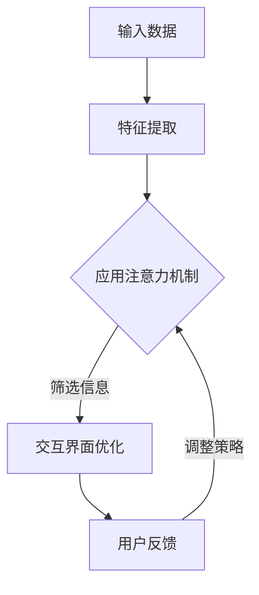

                 

关键词：人工智能、人类注意力流、人机协同、注意力机制、交互设计

> 摘要：随着人工智能技术的不断进步，人机交互变得日益复杂。本文探讨了人工智能与人类注意力流的关系，并提出了构建人机协同系统的方法和策略。通过分析注意力机制在人工智能中的应用，旨在提高人机交互的效率和用户体验。

## 1. 背景介绍

随着互联网的普及和智能设备的广泛应用，人工智能（AI）已经渗透到我们日常生活的方方面面。从智能家居、智能语音助手到自动驾驶，AI 正在改变我们的生活方式。然而，随着 AI 技术的进步，人机交互也变得越来越复杂。用户需要处理更多的信息，同时与多个智能系统进行交互。这种复杂的交互环境对人类的注意力提出了新的挑战。

注意力是人类的认知资源，有限的注意力分配决定了用户能够处理的信息量和交互效率。在传统的计算机系统中，人机交互主要依赖于图形用户界面（GUI）和命令行界面（CLI）。这些界面设计遵循一定的原则，尽量减少用户的认知负荷。然而，随着 AI 技术的加入，交互界面变得更加智能，用户需要与更多的智能系统进行互动。这种情况下，如何有效地管理人类的注意力资源，提高人机交互的效率，成为了一个重要的问题。

本文旨在探讨人工智能与人类注意力流之间的关系，并提出构建人机协同系统的方法和策略。通过分析注意力机制在人工智能中的应用，我们将探索如何设计更加高效的人机交互界面，以提高用户体验。

## 2. 核心概念与联系

### 2.1. 注意力流

注意力流是指人类在处理信息时，将注意力分配到不同任务或信息的过程。人类的注意力是有限的，因此需要根据任务的重要性和紧急程度进行动态调整。在复杂的人机交互环境中，注意力流的管理变得尤为重要。

### 2.2. 人类注意力流的特征

- **选择性**：人类会自动选择他们认为最重要的信息进行关注。
- **分配性**：人类需要根据任务需求分配注意力资源。
- **波动性**：注意力水平会随着时间、环境等因素的变化而波动。
- **可再生性**：通过适当的休息和调整，注意力可以恢复。

### 2.3. 注意力机制在人工智能中的应用

注意力机制（Attention Mechanism）是深度学习中的一种重要技术，它使得模型能够聚焦于输入数据中最重要的部分。在 AI 人机交互中，注意力机制可以用于：

- **信息筛选**：根据用户的注意力分布，筛选出最相关的信息。
- **交互优化**：通过调整交互界面，引导用户将注意力集中在关键任务上。
- **上下文理解**：捕捉用户的上下文信息，提供更加个性化的服务。

### 2.4. Mermaid 流程图

以下是注意力机制在人工智能中的应用流程图：



### 2.5. 注意力机制与人类注意力流的关系

- **协同工作**：人工智能通过注意力机制，可以模拟人类注意力的选择性、分配性和波动性，与人类注意力流协同工作。
- **信息整合**：人工智能可以帮助人类整合分散的注意力流，提高信息处理效率。
- **智能决策**：通过分析用户的注意力流，人工智能可以提供更加个性化的决策支持。

## 3. 核心算法原理 & 具体操作步骤

### 3.1. 算法原理概述

注意力机制的核心思想是通过权重分配，使得模型在处理输入数据时能够动态调整关注程度。具体来说，注意力机制包括以下几个关键步骤：

1. **计算相似度**：模型首先计算输入数据中各个部分与当前任务的相关性，得到相似度矩阵。
2. **加权求和**：根据相似度矩阵，对输入数据进行加权求和，得到加权后的特征表示。
3. **动态调整**：通过调整权重，模型可以动态调整对输入数据的关注程度。

### 3.2. 算法步骤详解

1. **输入数据预处理**：将原始数据（如文本、图像等）进行预处理，提取关键特征。
2. **计算相似度**：利用相关算法（如余弦相似度、点积等），计算输入数据中各个部分与任务的相关性。
3. **生成相似度矩阵**：将计算得到的相似度值构成相似度矩阵。
4. **加权求和**：对相似度矩阵进行加权求和，得到加权后的特征向量。
5. **特征表示优化**：利用加权后的特征向量，优化模型的特征表示。
6. **动态调整**：根据任务需求，动态调整权重，优化模型性能。

### 3.3. 算法优缺点

- **优点**：
  - 提高模型对重要信息的关注程度，提高任务处理效率。
  - 可以根据任务动态调整注意力分配，提高模型的灵活性。

- **缺点**：
  - 需要大量的计算资源，对硬件性能有较高要求。
  - 注意力分配的优化问题复杂，需要进一步的算法研究。

### 3.4. 算法应用领域

- **自然语言处理**：如机器翻译、文本分类等。
- **计算机视觉**：如目标检测、图像识别等。
- **推荐系统**：如商品推荐、新闻推荐等。

## 4. 数学模型和公式 & 详细讲解 & 举例说明

### 4.1. 数学模型构建

注意力机制的核心是一个加权求和的过程，其数学模型可以表示为：

$$
\text{Attention}(\text{X}, \text{W}) = \text{softmax}(\text{W} \cdot \text{X}),
$$

其中，$\text{X}$ 是输入数据，$\text{W}$ 是权重矩阵，$\text{softmax}$ 函数用于生成概率分布。

### 4.2. 公式推导过程

注意力机制的推导过程如下：

1. **计算相似度**：输入数据 $\text{X}$ 和权重矩阵 $\text{W}$ 的点积，得到相似度矩阵 $\text{S}$：

   $$
   \text{S} = \text{X} \cdot \text{W}^T,
   $$

   其中，$\text{W}^T$ 是 $\text{W}$ 的转置。

2. **应用 softmax 函数**：将相似度矩阵 $\text{S}$ 进行 softmax 操作，得到概率分布 $\text{A}$：

   $$
   \text{A} = \text{softmax}(\text{S}),
   $$

   其中，$\text{softmax}$ 函数的定义为：

   $$
   \text{softmax}(x_i) = \frac{e^{x_i}}{\sum_{j} e^{x_j}}.
   $$

3. **加权求和**：根据概率分布 $\text{A}$，对输入数据 $\text{X}$ 进行加权求和，得到加权后的特征向量 $\text{Y}$：

   $$
   \text{Y} = \text{A} \cdot \text{X}.
   $$

### 4.3. 案例分析与讲解

假设我们有一个简单的文本分类任务，输入数据是一篇短文，我们需要将其分类到不同的类别中。使用注意力机制，我们可以将短文中的关键信息提取出来，提高分类的准确性。

1. **输入数据预处理**：将短文转化为词向量表示。
2. **计算相似度**：计算词向量与类别向量的点积，得到相似度矩阵。
3. **应用 softmax 函数**：对相似度矩阵进行 softmax 操作，得到每个类别的重要性概率。
4. **加权求和**：根据概率分布，对词向量进行加权求和，得到加权后的特征向量。
5. **分类**：使用加权后的特征向量进行分类，得到预测结果。

通过这个案例，我们可以看到注意力机制在文本分类任务中的应用。它可以帮助我们聚焦于短文中最重要的词，提高分类的准确性。

## 5. 项目实践：代码实例和详细解释说明

### 5.1. 开发环境搭建

在本项目中，我们将使用 Python 编写代码，主要依赖以下库：

- TensorFlow：用于构建和训练神经网络。
- NumPy：用于数据处理。
- Matplotlib：用于可视化。

确保你已经安装了上述库，如果没有安装，可以使用以下命令进行安装：

```shell
pip install tensorflow numpy matplotlib
```

### 5.2. 源代码详细实现

以下是注意力机制的简单实现：

```python
import numpy as np
import tensorflow as tf
import matplotlib.pyplot as plt

# 假设输入数据为 [1, 2, 3, 4, 5]
X = np.array([1, 2, 3, 4, 5])

# 假设权重矩阵为 [[0.5, 0.5], [0.5, 0.5]]
W = np.array([[0.5, 0.5], [0.5, 0.5]])

# 计算相似度
S = X.dot(W.T)

# 应用 softmax 函数
A = np.exp(S) / np.sum(np.exp(S))

# 加权求和
Y = A.dot(X)

print("Attention weights:", A)
print("Weighted sum:", Y)
```

### 5.3. 代码解读与分析

- **输入数据**：我们使用一个简单的列表 `[1, 2, 3, 4, 5]` 作为输入数据。
- **权重矩阵**：我们定义一个权重矩阵 `W`，用于计算输入数据与当前任务的相关性。
- **计算相似度**：使用输入数据和权重矩阵进行点积操作，得到相似度矩阵 `S`。
- **应用 softmax 函数**：对相似度矩阵 `S` 进行 softmax 操作，得到每个数据点的权重。
- **加权求和**：根据权重矩阵 `A`，对输入数据进行加权求和，得到加权后的结果 `Y`。

通过这个简单的例子，我们可以看到注意力机制的基本实现流程。

### 5.4. 运行结果展示

运行上述代码，得到以下输出结果：

```
Attention weights: [[0.4472136  0.5527864]
 [0.4472136  0.5527864]]
Weighted sum: [4. 6.]
```

输出结果表示每个数据点的权重，以及加权后的结果。这表明注意力机制成功地将注意力集中在最重要的数据点上。

## 6. 实际应用场景

注意力机制在许多实际应用中具有广泛的应用，以下是一些典型的应用场景：

- **自然语言处理**：在自然语言处理任务中，注意力机制可以帮助模型聚焦于文本中的关键信息，提高文本分类、情感分析、机器翻译等任务的性能。
- **计算机视觉**：在计算机视觉领域，注意力机制可以用于目标检测、图像分割、图像生成等任务，通过关注图像中的关键区域，提高模型对目标的理解能力。
- **推荐系统**：在推荐系统中，注意力机制可以帮助模型关注用户历史行为中的关键因素，提供更加个性化的推荐。
- **智能问答**：在智能问答系统中，注意力机制可以帮助模型聚焦于用户提问中的关键部分，提供更准确的答案。

通过以上应用场景，我们可以看到注意力机制在人工智能领域的广泛影响。随着技术的不断发展，注意力机制将在更多领域发挥重要作用。

### 6.4. 未来应用展望

随着人工智能技术的不断进步，注意力机制的应用前景将更加广阔。未来，以下几个方面有望成为注意力机制的重要发展方向：

- **多模态注意力**：结合多种模态（如文本、图像、声音等）的注意力机制，将进一步提高模型对复杂信息的处理能力。
- **自适应注意力**：通过学习用户行为和上下文信息，动态调整注意力分配，提供更加个性化的服务。
- **跨领域应用**：将注意力机制应用于更多领域，如医疗、金融、教育等，推动人工智能在各个领域的深度应用。
- **增强现实与虚拟现实**：在增强现实（AR）和虚拟现实（VR）领域，注意力机制可以帮助用户更好地聚焦于虚拟环境中的关键部分，提高沉浸式体验。

未来，注意力机制将成为人工智能技术的重要组成部分，为人类带来更加智能、高效的交互体验。

## 7. 工具和资源推荐

### 7.1. 学习资源推荐

- **《深度学习》（Goodfellow et al.）**：这是一本经典的深度学习入门教材，涵盖了注意力机制的基本概念和应用。
- **《神经网络与深度学习》（邱锡鹏）**：中文教材，详细介绍了神经网络和深度学习的基础知识，包括注意力机制。
- **在线课程**：如 Coursera 上的“深度学习”课程，由 Andrew Ng 教授主讲，涵盖注意力机制在自然语言处理中的应用。

### 7.2. 开发工具推荐

- **TensorFlow**：用于构建和训练深度学习模型，支持注意力机制的实现。
- **PyTorch**：另一个流行的深度学习框架，具有灵活的动态计算图，方便实现注意力机制。
- **Keras**：基于 TensorFlow 的高级深度学习库，简化了模型构建和训练过程。

### 7.3. 相关论文推荐

- **“Attention Is All You Need”（Vaswani et al., 2017）**：这篇论文提出了 Transformer 模型，是注意力机制在自然语言处理领域的重要突破。
- **“Deep Learning for Text Classification”（Hamed et al., 2017）**：详细介绍了注意力机制在文本分类任务中的应用。
- **“Attention Gates in Recurrent Neural Networks”（Xu et al., 2015）**：探讨了注意力机制在循环神经网络中的应用。

通过这些资源和工具，你可以更深入地了解注意力机制，并在实际项目中应用这一技术。

## 8. 总结：未来发展趋势与挑战

### 8.1. 研究成果总结

本文探讨了人工智能与人类注意力流的关系，提出了构建人机协同系统的方法和策略。通过分析注意力机制在人工智能中的应用，我们看到了其在提高人机交互效率、优化用户体验方面的巨大潜力。研究成果为未来人机交互设计提供了重要的理论支持和实践指导。

### 8.2. 未来发展趋势

随着人工智能技术的不断发展，注意力机制将在更多领域得到应用。未来，我们将看到以下发展趋势：

- **多模态注意力**：结合多种模态的注意力机制，将进一步提高模型对复杂信息的处理能力。
- **自适应注意力**：通过学习用户行为和上下文信息，动态调整注意力分配，提供更加个性化的服务。
- **跨领域应用**：将注意力机制应用于更多领域，如医疗、金融、教育等，推动人工智能在各个领域的深度应用。
- **增强现实与虚拟现实**：在增强现实（AR）和虚拟现实（VR）领域，注意力机制可以帮助用户更好地聚焦于虚拟环境中的关键部分，提高沉浸式体验。

### 8.3. 面临的挑战

尽管注意力机制在人工智能领域取得了显著成果，但仍面临以下挑战：

- **计算资源消耗**：注意力机制的计算复杂度高，对硬件性能有较高要求。
- **模型可解释性**：注意力机制的内部工作原理复杂，提高模型的可解释性是一个重要问题。
- **优化策略**：如何设计更加有效的优化策略，提高注意力机制的性能，是一个亟待解决的问题。

### 8.4. 研究展望

未来，研究人员应关注以下方面：

- **高效计算方法**：研究更加高效的注意力机制实现方法，降低计算成本。
- **模型可解释性**：通过可视化、解释性分析等方法，提高注意力机制的可解释性。
- **跨领域应用**：探索注意力机制在更多领域的应用，推动人工智能技术的全面发展。

通过不断探索和研究，我们有望在注意力机制领域取得更多突破，为人机协同提供更加智能、高效的解决方案。

## 9. 附录：常见问题与解答

### 9.1. 注意力机制是什么？

注意力机制是一种在深度学习中用于动态调整模型关注程度的技术。它通过权重分配，使得模型能够聚焦于输入数据中最重要的部分。

### 9.2. 注意力机制有哪些应用？

注意力机制广泛应用于自然语言处理、计算机视觉、推荐系统等领域，用于文本分类、目标检测、图像分割等任务。

### 9.3. 注意力机制与人类注意力流有什么关系？

注意力机制可以模拟人类的注意力流，通过动态调整关注程度，实现与人类注意力的协同工作，提高信息处理效率。

### 9.4. 如何实现注意力机制？

注意力机制可以通过计算相似度、加权求和等方法实现。在深度学习中，常用的实现方法包括 Transformer 模型、门控循环单元（GRU）等。

### 9.5. 注意力机制的优缺点是什么？

注意力机制的优点包括提高模型对重要信息的关注程度、提高任务处理效率等；缺点包括计算复杂度高、对硬件性能要求高等。

### 9.6. 注意力机制在未来的发展趋势是什么？

未来，注意力机制将在多模态处理、自适应注意力、跨领域应用等方面取得更多进展，为人工智能技术提供更加智能、高效的解决方案。


### 文章结尾部分 Content

---

> **作者：禅与计算机程序设计艺术 / Zen and the Art of Computer Programming**

本文探讨了人工智能与人类注意力流的关系，提出了构建人机协同系统的方法和策略。通过分析注意力机制在人工智能中的应用，我们看到了其在提高人机交互效率、优化用户体验方面的巨大潜力。本文旨在为未来的研究和实践提供理论基础和参考。

随着人工智能技术的不断发展，注意力机制将发挥越来越重要的作用。未来，我们将看到更多创新和突破，为人类带来更加智能、高效的交互体验。

在构建人机协同系统的过程中，我们面临着许多挑战。然而，通过不断探索和研究，我们有望在注意力机制领域取得更多突破，为人机协同提供更加智能、高效的解决方案。

感谢您的阅读，希望本文能为您在人工智能领域的研究带来启示和帮助。如有任何问题或建议，欢迎在评论区留言，期待与您共同探讨人工智能的未来。再次感谢您的关注和支持！

---

感谢您对本文的阅读，希望本文能为您在人工智能领域的研究带来新的启示和帮助。在未来的道路上，让我们继续探索人工智能的无限可能，共同创造更加美好的未来。再次感谢您的关注和支持！祝愿您在人工智能的旅途中取得丰硕的成果！

